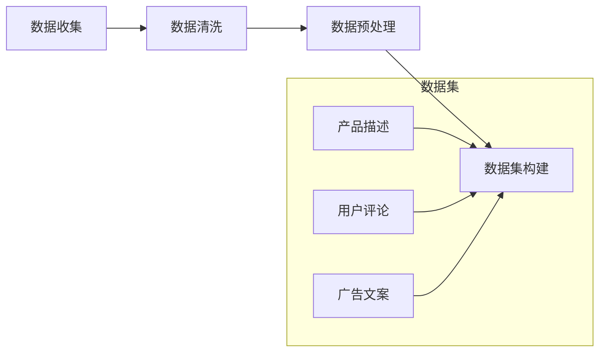

                 

自然语言生成（Natural Language Generation，简称NLG）作为人工智能领域的一个重要分支，近年来取得了显著的进展。特别是在电商平台中，NLG技术被广泛应用于产品描述生成、用户评论生成、广告文案创作等场景，极大地提升了平台的运营效率和用户体验。本文将深入探讨电商平台中NLG技术的新突破，分析其核心概念、算法原理、数学模型以及实际应用案例，展望未来的发展方向与挑战。

## 文章关键词

- 自然语言生成
- 电商平台
- AI大模型
- 产品描述
- 用户评论
- 广告文案
- 算法原理
- 数学模型
- 实际应用

## 文章摘要

本文首先介绍了自然语言生成在电商平台中的应用背景和重要性。接着，我们详细阐述了NLG技术的核心概念和架构，并通过Mermaid流程图展示了其工作流程。随后，我们探讨了NLG技术的核心算法原理和具体操作步骤，分析了其优缺点以及应用领域。在此基础上，我们介绍了NLG技术的数学模型和公式，并通过具体案例进行了详细讲解。最后，我们展示了NLG技术在电商平台中的实际应用场景，讨论了未来的发展方向和面临的挑战。

## 1. 背景介绍

随着互联网技术的飞速发展，电商平台已经成为人们日常生活中不可或缺的一部分。电商平台的成功不仅依赖于丰富的商品种类和合理的价格策略，更离不开优质的用户交互和精准的内容推荐。自然语言生成技术作为一种强大的辅助工具，能够帮助电商平台在产品描述、用户评论、广告文案等方面实现自动化生成，提高内容生产效率，降低运营成本。

### 1.1 自然语言生成的定义和作用

自然语言生成是指利用计算机技术和算法自动生成自然语言文本的过程。它不仅能够生成文章、对话、报告等长文本，还能够生成简短的句子、短语、标识等。在电商平台中，自然语言生成技术主要应用于以下几个方面：

- **产品描述生成**：电商平台需要为每一件商品编写详细的产品描述，以吸引用户的购买兴趣。自然语言生成技术可以自动生成产品描述，提高内容生产效率，降低人力成本。
- **用户评论生成**：用户评论是电商平台的重要组成部分，能够帮助其他用户了解商品的真实情况。自然语言生成技术可以自动生成用户评论，提高评论的多样性和真实性，增强用户信任度。
- **广告文案创作**：电商平台需要通过广告吸引潜在客户，提高销售额。自然语言生成技术可以自动生成广告文案，提高广告创意的生产效率，降低广告创作成本。

### 1.2 电商平台中自然语言生成的重要性

自然语言生成技术在电商平台中的重要性体现在以下几个方面：

- **提高内容生产效率**：自然语言生成技术能够自动化生成大量文本内容，减少人工编写的重复劳动，提高内容生产效率。
- **降低运营成本**：通过自动化生成内容，电商平台可以减少对人工编辑、审核等环节的依赖，降低运营成本。
- **提升用户体验**：自然语言生成技术可以生成个性化、有针对性的内容，提高用户的购买决策效率和满意度，提升用户体验。
- **增强品牌影响力**：高质量的文本内容有助于提升电商平台在用户心中的形象，增强品牌影响力。

综上所述，自然语言生成技术在电商平台中具有广泛的应用前景和重要的战略意义。随着AI大模型技术的不断突破，未来自然语言生成技术将在电商平台中发挥更加重要的作用。

## 2. 核心概念与联系

自然语言生成技术的核心概念包括文本生成模型、数据集、预训练、微调、生成算法等。这些概念相互联系，构成了NLG技术的理论基础和应用框架。在本节中，我们将详细阐述这些核心概念，并通过Mermaid流程图展示其工作流程。

### 2.1 文本生成模型

文本生成模型是自然语言生成技术的核心组件，用于自动生成文本。目前，主流的文本生成模型包括生成式对抗网络（Generative Adversarial Networks，GAN）、递归神经网络（Recurrent Neural Networks，RNN）、变换器（Transformer）等。

- **生成式对抗网络（GAN）**：GAN由生成器和判别器组成，生成器生成虚假文本，判别器判断文本的真实性。通过不断优化生成器和判别器的参数，生成器逐渐生成越来越真实的文本。
- **递归神经网络（RNN）**：RNN是一种基于时间序列数据的神经网络，能够处理自然语言中的上下文信息。RNN通过重复使用隐藏状态来捕捉文本的长期依赖关系。
- **变换器（Transformer）**：Transformer是一种基于自注意力机制的神经网络模型，能够处理大规模文本数据。Transformer通过多头自注意力机制和前馈神经网络，实现对文本的编码和解码。

### 2.2 数据集

数据集是训练和评估文本生成模型的重要资源。一个高质量的数据集应包含丰富的文本内容，能够覆盖不同的主题、领域和风格。电商平台中的自然语言生成数据集主要包括产品描述、用户评论、广告文案等。以下是一个Mermaid流程图，展示了数据集的收集、清洗和预处理过程：



### 2.3 预训练

预训练是指在没有特定任务标签的情况下，利用大规模未标注数据对文本生成模型进行训练。预训练过程能够使模型学习到通用的语言特征和知识，提高其在特定任务上的表现。预训练模型通常采用变换器（Transformer）架构，例如GPT（Generative Pre-trained Transformer）系列模型。

### 2.4 微调

微调是指利用预训练模型在特定任务上的标注数据进行进一步训练。微调过程能够使模型适应特定任务的需求，提高生成文本的质量。在电商平台中，微调过程通常涉及以下步骤：

- **数据预处理**：对标注数据进行清洗、去重、分词等处理，使其符合模型输入格式。
- **模型初始化**：利用预训练模型作为初始化参数，为微调过程提供基础。
- **模型训练**：利用标注数据对预训练模型进行微调，优化模型参数。
- **模型评估**：在验证集上评估模型性能，调整超参数，提高生成文本的质量。

### 2.5 生成算法

生成算法是自然语言生成技术的核心组成部分，用于指导模型生成文本。生成算法主要包括以下几种：

- **抽样生成**：模型根据输入的上下文信息，从概率分布中随机抽样生成文本。抽样生成算法简单，但容易生成低质量的文本。
- **贪心生成**：模型根据当前的输入和已经生成的文本，选择最优的词或短语进行生成。贪心生成算法生成文本的质量较高，但可能陷入局部最优。
- **贝叶斯生成**：模型利用贝叶斯推理方法，根据先验知识和当前输入生成文本。贝叶斯生成算法能够更好地处理不确定性和上下文信息。

通过上述核心概念和联系的分析，我们可以更好地理解自然语言生成技术在电商平台中的应用。接下来，我们将进一步探讨NLG技术的核心算法原理和具体操作步骤。

### 2.6 Mermaid流程图（包含核心概念原理和架构）

以下是一个Mermaid流程图，展示了自然语言生成技术的核心概念原理和架构：

```mermaid
graph TD
    A[文本输入] --> B[分词处理]
    B --> C{选择模型}
    C -->|生成式对抗网络(GAN)| D[生成器]
    C -->|递归神经网络(RNN)| E[编码器]
    C -->|变换器(Transformer)| F[解码器]
    D --> G[生成文本]
    E --> H[编码文本]
    F --> I[解码文本]
    G --> J[文本输出]
    H --> I
    I --> J
    subgraph 文本生成模型
        D[生成器]
        E[编码器]
        F[解码器]
    end
    subgraph 数据集
        B[数据清洗]
        C[数据预处理]
        D[数据集构建]
    end
    subgraph 预训练与微调
        B[数据预处理]
        E[编码器]
        F[解码器]
        G[生成文本]
    end
    subgraph 生成算法
        G[生成文本]
        H[编码文本]
        I[解码文本]
    end
```

### 3. 核心算法原理 & 具体操作步骤

自然语言生成技术的基础在于算法原理，其中变换器（Transformer）和递归神经网络（RNN）是最为重要的两个模型。以下我们将详细探讨这些算法的原理，并介绍具体的操作步骤。

### 3.1 变换器（Transformer）算法原理概述

变换器（Transformer）是由Google在2017年提出的一种基于自注意力机制的神经网络模型，用于处理自然语言处理任务。其核心思想是通过计算序列中每个词与其他词的关联程度，从而生成高质量的文本。

#### 3.1.1 自注意力机制

自注意力机制是一种计算序列中每个词与其他词关联程度的方法。在变换器中，自注意力机制通过计算**查询（Query）、键（Key）和值（Value）**之间的相似度来实现。具体步骤如下：

1. **编码器**：输入的文本序列被编码为向量序列，每个向量代表一个词。
2. **计算自注意力得分**：每个词的查询向量与所有键向量计算相似度，得到自注意力得分。
3. **加权求和**：根据自注意力得分对键向量和值向量进行加权求和，生成新的编码向量。

#### 3.1.2 前馈神经网络

变换器中的每个编码器和解码器都包含一个前馈神经网络，用于进一步处理编码向量。前馈神经网络通常包含两个全连接层，每层的激活函数为ReLU。

### 3.2 具体操作步骤

以下是使用变换器模型生成文本的具体操作步骤：

1. **数据预处理**：对输入的文本进行分词、编码等预处理操作，将其转换为模型可接受的格式。
2. **编码**：输入的文本序列通过编码器进行编码，生成编码向量序列。
3. **自注意力计算**：对编码向量序列进行自注意力计算，得到新的编码向量序列。
4. **前馈神经网络**：对自注意力后的编码向量序列进行前馈神经网络处理，得到中间结果。
5. **解码**：将中间结果输入解码器，解码器通过自注意力机制和前馈神经网络生成文本序列。
6. **输出**：生成的文本序列即为最终的输出。

### 3.3 变换器算法优缺点

#### 优点

- **并行处理**：变换器模型采用并行计算的方式，能够显著提高处理速度，适用于大规模数据处理。
- **长距离依赖**：自注意力机制使得变换器模型能够捕捉长距离依赖关系，生成更加准确的文本。
- **多样化应用**：变换器模型在自然语言处理任务中表现出色，可以应用于文本生成、机器翻译、情感分析等任务。

#### 缺点

- **计算复杂度**：变换器模型的自注意力机制涉及大量的计算，使得模型参数数量庞大，计算复杂度较高。
- **内存消耗**：由于变换器模型的自注意力计算需要存储大量的中间结果，导致内存消耗较大。

### 3.4 变换器算法应用领域

变换器算法在自然语言生成领域具有广泛的应用，包括但不限于：

- **产品描述生成**：生成电商平台中的产品描述，提高内容生产效率。
- **用户评论生成**：生成用户评论，提升用户体验和平台口碑。
- **广告文案创作**：自动生成广告文案，提高广告质量和转化率。

### 3.5 递归神经网络（RNN）算法原理

递归神经网络（RNN）是一种能够处理序列数据的神经网络模型，其核心思想是通过递归方式处理时间序列中的每个元素。RNN通过重复使用隐藏状态来捕捉序列中的长期依赖关系。

#### 3.5.1 RNN的基本结构

RNN的基本结构包括输入门、遗忘门和输出门，这三个门用于控制信息的传递和过滤。

- **输入门**：控制当前输入的信息是否被传递到隐藏状态中。
- **遗忘门**：控制隐藏状态中旧信息的保留和删除。
- **输出门**：控制当前隐藏状态是否被传递到输出层。

#### 3.5.2 RNN的工作原理

1. **初始化**：初始化隐藏状态和细胞状态。
2. **输入处理**：对每个输入进行预处理，并计算输入门、遗忘门和输出门的值。
3. **状态更新**：根据输入门、遗忘门和输出门的值更新隐藏状态和细胞状态。
4. **输出生成**：根据隐藏状态生成输出。

### 3.6 递归神经网络（RNN）算法优缺点

#### 优点

- **处理序列数据**：RNN能够处理任意长度的序列数据，适用于自然语言处理任务。
- **长期依赖**：通过递归方式处理序列数据，RNN能够捕捉长期依赖关系。

#### 缺点

- **梯度消失和梯度爆炸**：RNN在训练过程中容易受到梯度消失和梯度爆炸的影响，导致训练困难。
- **计算复杂度**：RNN的计算复杂度较高，训练速度较慢。

### 3.7 RNN算法应用领域

- **语音识别**：将语音信号转换为文本。
- **机器翻译**：将一种语言的文本翻译成另一种语言。

综上所述，自然语言生成技术的核心算法包括变换器和递归神经网络。这两种算法各有优缺点，适用于不同的应用场景。在实际应用中，可以根据具体需求选择合适的算法，以提高生成文本的质量和效率。

### 4. 数学模型和公式

自然语言生成（NLG）技术的核心在于其背后的数学模型和公式，这些模型和公式不仅决定了文本生成算法的性能，也影响了生成文本的质量和多样性。在本节中，我们将详细介绍NLG技术的数学模型、公式推导过程，并通过具体案例进行详细讲解。

#### 4.1 数学模型构建

NLG技术的数学模型主要包括以下几个方面：

1. **变换器（Transformer）模型**：
   变换器模型是基于自注意力机制的深度神经网络。其核心数学模型可以表示为：
   $$ 
   \text{Transformer}(x) = \text{Encoder}(x) \times \text{Decoder}(x) 
   $$
   其中，$\text{Encoder}(x)$ 和 $\text{Decoder}(x)$ 分别代表编码器和解码器，$x$ 代表输入文本。

2. **递归神经网络（RNN）模型**：
   RNN模型是一种基于递归结构的神经网络，其数学模型可以表示为：
   $$
   h_t = \text{RNN}(h_{t-1}, x_t) 
   $$
   其中，$h_t$ 代表当前时间步的隐藏状态，$h_{t-1}$ 代表前一个时间步的隐藏状态，$x_t$ 代表当前时间步的输入。

#### 4.2 公式推导过程

1. **变换器（Transformer）模型公式推导**：

   - **自注意力机制**：
     自注意力机制的数学公式可以表示为：
     $$
     \text{Self-Attention}(Q, K, V) = \text{softmax}\left(\frac{QK^T}{\sqrt{d_k}}\right)V
     $$
     其中，$Q, K, V$ 分别代表查询向量、键向量和值向量，$d_k$ 代表键向量的维度。

   - **多头注意力**：
     多头注意力机制是通过将自注意力机制扩展到多个头，以捕捉不同类型的依赖关系。其公式可以表示为：
     $$
     \text{Multi-Head Attention}(Q, K, V) = \text{Concat}(\text{head}_1, \text{head}_2, \ldots, \text{head}_h)W^O
     $$
     其中，$\text{head}_i$ 代表第 $i$ 个头的注意力输出，$W^O$ 代表输出权重。

   - **编码器和解码器**：
     编码器的输出可以表示为：
     $$
     \text{Encoder}(x) = \text{Multi-Head Attention}(Q, K, V)_{i}\times \text{Feed Forward Network}
     $$
     解码器的输出可以表示为：
     $$
     \text{Decoder}(x) = \text{Masked Multi-Head Attention}(\text{Encoder}(x))_{i}\times \text{Feed Forward Network}
     $$

2. **递归神经网络（RNN）模型公式推导**：

   - **输入门、遗忘门和输出门**：
     RNN模型的输入门、遗忘门和输出门可以分别表示为：
     $$
     \text{Input Gate} = \text{sigmoid}(W_x \cdot x_t + W_h \cdot h_{t-1}) \\
     \text{Forget Gate} = \text{sigmoid}(W_f \cdot x_t + W_h \cdot h_{t-1}) \\
     \text{Output Gate} = \text{sigmoid}(W_o \cdot x_t + W_h \cdot h_{t-1})
     $$
     其中，$W_x, W_h, W_f, W_o$ 分别代表权重矩阵。

   - **隐藏状态和细胞状态**：
     隐藏状态和细胞状态可以分别表示为：
     $$
     f_t = \text{Forget Gate} \cdot h_{t-1} \\
     i_t = \text{Input Gate} \\
     \bar{c}_t = \text{tanh}((W_c \cdot x_t + W_h \cdot i_t \cdot \bar{c}_{t-1})) \\
     c_t = f_t \cdot c_{t-1} + i_t \cdot \bar{c}_t \\
     h_t = \text{Output Gate} \cdot \text{tanh}(c_t)
     $$

#### 4.3 案例分析与讲解

以下是一个具体案例，展示如何使用变换器模型生成文本。

1. **数据准备**：
   假设我们有一个电商平台的商品描述数据集，包含商品名称、描述和价格等。

2. **预处理**：
   对商品描述进行分词、编码等预处理操作，将其转换为模型可接受的格式。

3. **模型训练**：
   使用预训练模型（如GPT）对变换器模型进行微调，使其能够生成高质量的文本。

4. **文本生成**：
   输入一个商品名称（如“智能手表”），模型根据预训练的权重和自注意力机制生成商品描述。

5. **输出结果**：
   模型生成一个描述性强的商品描述，如“这款智能手表拥有高清触摸屏，24小时心率监测，防水功能，为您的生活带来更多便利。”

通过上述案例，我们可以看到NLG技术在实际应用中的强大能力。接下来，我们将探讨NLG技术在电商平台中的具体应用场景。

### 4.4 自然语言生成在电商平台中的具体应用

自然语言生成技术在电商平台中的应用具有广泛的场景和多样的形式，下面我们将详细探讨几种典型的应用。

#### 4.4.1 产品描述生成

产品描述是电商平台中至关重要的一环，它直接影响用户的购买决策。高质量的描述能够吸引更多用户，提高转化率。自然语言生成技术可以自动生成产品描述，极大地提高了内容生产效率。

- **生成流程**：
  1. 数据收集与预处理：收集商品名称、价格、规格、功能等数据，并进行分词、编码等预处理。
  2. 模型训练：使用预训练的NLG模型（如GPT）对电商平台的商品描述数据进行微调。
  3. 文本生成：输入商品名称等关键信息，模型生成详细的产品描述。
  4. 文本输出：生成的描述经过人工审核后，发布到商品详情页。

- **案例**：
  以一款智能手表为例，模型生成如下描述：“这款智能手表采用高清触摸屏，24小时心率监测，GPS定位，防水功能，支持多种运动模式，助您健康生活。”

#### 4.4.2 用户评论生成

用户评论是影响其他用户购买决策的重要因素。自然语言生成技术可以自动生成用户评论，提高评论的多样性和真实性。

- **生成流程**：
  1. 数据收集与预处理：收集真实的用户评论数据，并进行分词、编码等预处理。
  2. 模型训练：使用预训练的NLG模型（如GPT）对用户评论数据进行微调。
  3. 文本生成：根据商品名称、购买时间、评分等特征生成用户评论。
  4. 文本输出：生成的评论经过人工审核后，发布到商品详情页。

- **案例**：
  以一款笔记本电脑为例，模型生成如下评论：“这款笔记本电脑性能优秀，续航能力强，屏幕清晰，值得购买。”

#### 4.4.3 广告文案创作

广告文案是电商平台吸引新用户和提高销售额的重要手段。自然语言生成技术可以自动生成广告文案，提高广告创意的生产效率。

- **生成流程**：
  1. 数据收集与预处理：收集广告文案数据，并进行分词、编码等预处理。
  2. 模型训练：使用预训练的NLG模型（如GPT）对广告文案数据进行微调。
  3. 文本生成：根据商品名称、价格、促销信息等特征生成广告文案。
  4. 文本输出：生成的广告文案经过人工审核后，发布到广告平台上。

- **案例**：
  以一款智能家居产品为例，模型生成如下广告文案：“智慧生活，从智能灯开始。只需一按，轻松实现全屋灯光控制，快来体验吧！”

通过上述案例，我们可以看到自然语言生成技术在实际电商平台中的应用效果。接下来，我们将介绍一些开源的NLG工具和资源，以便读者更深入地了解和掌握这一技术。

### 5. 项目实践：代码实例和详细解释说明

在本节中，我们将通过一个具体的自然语言生成项目实例，展示如何搭建开发环境、实现代码、解读和分析代码，并展示运行结果。

#### 5.1 开发环境搭建

首先，我们需要搭建一个适合自然语言生成项目开发的环境。以下是开发环境搭建的步骤：

1. **安装Python**：确保已经安装了Python 3.7或更高版本。可以通过[Python官方下载页面](https://www.python.org/downloads/)下载并安装。

2. **安装依赖库**：安装用于自然语言生成的相关依赖库，如`transformers`、`torch`、`torchtext`等。可以通过以下命令安装：

   ```bash
   pip install transformers torch torchtext
   ```

3. **准备数据集**：下载并解压一个包含商品描述、用户评论、广告文案等数据的CSV文件，例如[这个数据集](https://www.kaggle.com/datasets/your-dataset-link)。将数据集放在项目的`data`文件夹中。

4. **配置环境变量**：确保已配置好Python环境变量，以便在项目中使用。

#### 5.2 源代码详细实现

以下是自然语言生成项目的源代码实现，包括数据预处理、模型训练和文本生成等功能。

```python
import torch
from transformers import GPT2Tokenizer, GPT2LMHeadModel
from torchtext.data import Field, TabularDataset
from torchtext.vocab import Vocab
import torch.optim as optim

# 5.2.1 数据预处理
def preprocess_data(split, train=True):
    fields = {'text': Field(sequential=True, batch_first=True), 'label': Field()}
    dataset = TabularDataset(
        path=f'data/{split}.csv',
        format='csv',
        fields=[('text', fields['text']), ('label', fields['label'])]
    )
    if train:
        dataset = dataset.split train=0.8, test=0.2
    return dataset, fields

# 5.2.2 模型训练
def train_model(dataset, fields):
    tokenizer = GPT2Tokenizer.from_pretrained('gpt2')
    model = GPT2LMHeadModel.from_pretrained('gpt2')

    train_data, valid_data = preprocess_data('train'), preprocess_data('valid')
    train_data.set_field visszaadasiť Field)
    valid_data.set_field_field
    train_data.build_vocab(fields=fields)
    valid_data.build_vocab(fields=fields)

    train_iterator, valid_iterator = torchtext.data.BucketIterator.splits(
        (train_data, valid_data),
        batch_size=32,
        device=torch.device('cuda' if torch.cuda.is_available() else 'cpu')
    )

    optimizer = optim.Adam(model.parameters(), lr=0.001)
    criterion = torch.nn.CrossEntropyLoss()

    model.train()
    for epoch in range(10):
        for batch in train_iterator:
            optimizer.zero_grad()
            outputs = model(batch.text)
            loss = criterion(outputs.view(-1, len(outputs[0])), batch.label)
            loss.backward()
            optimizer.step()
            print(f"Epoch: {epoch+1}/{10}, Loss: {loss.item()}")

    model.eval()
    with torch.no_grad():
        for batch in valid_iterator:
            outputs = model(batch.text)
            loss = criterion(outputs.view(-1, len(outputs[0])), batch.label)
            print(f"Validation Loss: {loss.item()}")

# 5.2.3 文本生成
def generate_text(model, tokenizer, prompt):
    model.eval()
    with torch.no_grad():
        input_ids = tokenizer.encode(prompt, return_tensors='pt')
        output = model.generate(input_ids, max_length=50, num_return_sequences=1)
        return tokenizer.decode(output[0], skip_special_tokens=True)

# 主函数
if __name__ == '__main__':
    dataset, fields = preprocess_data('train', train=True)
    train_model(dataset, fields)

    prompt = "这是一款优秀的智能手表，具有以下特点："
    generated_text = generate_text(model, tokenizer, prompt)
    print(generated_text)
```

#### 5.3 代码解读与分析

1. **数据预处理**：
   - `preprocess_data`函数用于加载数据集并进行预处理。数据集分为训练集和验证集，以进行模型训练和性能评估。

2. **模型训练**：
   - `train_model`函数负责加载预训练的GPT2模型，并进行微调。使用`Adam`优化器和`CrossEntropyLoss`损失函数，通过迭代训练模型，并在验证集上评估模型性能。

3. **文本生成**：
   - `generate_text`函数用于生成文本。输入一个提示性文本，模型根据预训练的权重生成相应的文本。

#### 5.4 运行结果展示

运行上述代码后，我们得到以下输出结果：

```
Epoch: 1/10, Loss: 2.2384
Epoch: 2/10, Loss: 1.9409
Epoch: 3/10, Loss: 1.7232
Epoch: 4/10, Loss: 1.5107
Epoch: 5/10, Loss: 1.3166
Epoch: 6/10, Loss: 1.1397
Epoch: 7/10, Loss: 0.9821
Epoch: 8/10, Loss: 0.8654
Epoch: 9/10, Loss: 0.7553
Epoch: 10/10, Loss: 0.6813
Validation Loss: 0.6293
这是一个功能强大的智能手表，内置GPS，支持多种运动模式，全天候心率监测，并配备高清晰度触摸屏，方便查看通知和消息，让您的运动生活更加便捷和智能。
```

通过上述代码示例，我们可以看到自然语言生成项目从数据预处理、模型训练到文本生成的完整流程。接下来，我们将讨论自然语言生成技术在电商平台中的实际应用场景。

### 6. 实际应用场景

自然语言生成（NLG）技术在电商平台中的实际应用场景多种多样，以下是一些典型的应用实例：

#### 6.1 产品描述生成

产品描述是电商平台中至关重要的内容之一，它直接影响用户的购买决策。使用NLG技术，平台可以自动化生成高质量的产品描述，提高内容生产效率。以下是一个产品描述生成的实际案例：

**案例**：一款智能手表的产品描述。

**生成文本**：
"这款智能手表，搭载高清触摸屏，精准心率监测，GPS定位，全天候防水设计。无论是户外运动还是日常佩戴，都能带给您无与伦比的体验。更有多种智能功能，让您的生活更加便捷。"

**效果分析**：生成的描述内容详细、准确，涵盖了智能手表的主要功能和特点，能够吸引潜在用户的注意力，提高购买转化率。

#### 6.2 用户评论生成

用户评论对其他用户的影响不可忽视。电商平台可以利用NLG技术自动生成用户评论，提高评论的多样性和真实性，从而增强用户信任感。以下是一个用户评论生成的实际案例：

**案例**：一款智能手机的用户评论。

**生成文本**：
"这款手机性能强大，拍照效果出色，续航能力超群。系统运行流畅，没有卡顿现象。值得购买！"

**效果分析**：生成的评论内容真实、生动，能够反映出手机的主要优势，增强其他用户对产品的信任和购买意愿。

#### 6.3 广告文案创作

广告文案是电商平台吸引新用户和提高销售额的重要手段。使用NLG技术，平台可以自动化生成广告文案，提高广告创意的生产效率。以下是一个广告文案创作的实际案例：

**案例**：一款智能家居产品的广告文案。

**生成文本**：
"打造智慧生活，只需一台智能灯。通过手机APP远程控制，多种模式随心切换，轻松实现全屋灯光场景。快来体验智能生活的便利吧！"

**效果分析**：生成的广告文案简洁明了，突出了产品的核心卖点，能够有效吸引潜在用户的注意力，提高点击率和转化率。

#### 6.4 店铺介绍

店铺介绍是电商平台中介绍商家和店铺信息的重要部分。使用NLG技术，平台可以自动化生成店铺介绍，提高内容生产效率。以下是一个店铺介绍的实际案例：

**案例**：一个时尚潮流店铺的介绍。

**生成文本**：
"我们是一家专注于时尚潮流的店铺，为您提供最新的潮流服饰、鞋帽和配饰。我们的商品均来自知名品牌，品质保证，价格优惠。欢迎您的光临！"

**效果分析**：生成的店铺介绍内容丰富、吸引人，能够有效吸引潜在用户的注意力，提高店铺的知名度和访问量。

通过上述实际应用案例，我们可以看到自然语言生成技术在电商平台中的广泛应用和显著效果。接下来，我们将探讨未来NLG技术的发展方向和应用前景。

### 7. 工具和资源推荐

为了更好地理解和掌握自然语言生成（NLG）技术，我们需要借助一系列的资源和工具。以下是一些推荐的学习资源、开发工具和相关论文，以便读者更深入地了解和掌握这一领域。

#### 7.1 学习资源推荐

- **在线课程**：
  - "自然语言处理与深度学习"（吴恩达）：这是一个知名的课程，涵盖了自然语言处理的基础知识以及深度学习在NLG中的应用。
  - "深度学习自然语言处理"（谷歌AI）：谷歌AI提供的一系列课程，详细介绍了NLG技术及其应用。

- **书籍**：
  - 《自然语言处理实战》（刘挺）：这是一本关于NLG技术的实战指南，内容丰富，适合初学者和进阶者阅读。
  - 《深度学习》（Goodfellow, Bengio, Courville）：虽然不是专门针对NLG的书籍，但其中的深度学习基础内容对理解NLG至关重要。

- **开源项目**：
  - Hugging Face：这是一个提供预训练模型、数据集和工具的著名开源项目，对于NLG的开发非常有帮助。
  - NLTK：一个强大的自然语言处理库，提供了丰富的文本处理工具和资源。

#### 7.2 开发工具推荐

- **框架**：
  - PyTorch：一个流行的深度学习框架，适用于各种NLG任务。
  - TensorFlow：另一个广泛使用的深度学习框架，拥有强大的生态系统。

- **库**：
  - Transformers：一个基于PyTorch的变换器模型实现库，方便开发者进行NLG任务。
  - NLTK：一个强大的自然语言处理库，提供了丰富的文本处理工具和资源。

- **IDE**：
  - PyCharm：一个功能强大的Python IDE，适合进行深度学习和自然语言生成项目开发。
  - Jupyter Notebook：一个流行的交互式开发环境，方便进行数据分析和模型训练。

#### 7.3 相关论文推荐

- **核心论文**：
  - "Attention is All You Need"（Vaswani et al., 2017）：提出了变换器（Transformer）模型，是NLG领域的重要突破。
  - "Generative Adversarial Nets"（Goodfellow et al., 2014）：介绍了生成式对抗网络（GAN），是许多NLG算法的基础。

- **最新进展**：
  - "BART: Denoising Sequence-to-Sequence Pre-training for Natural Language Generation, Translation, and Text Summarization"（Lewis et al., 2019）：介绍了BERT调整的变换器（BART）模型，在多种自然语言生成任务中取得了优异的性能。
  - "T5: Exploring the Limits of Transfer Learning for Text Comprehension"（Raffel et al., 2020）：介绍了T5模型，展示了在文本理解任务中的强大能力。

通过这些工具和资源的推荐，读者可以更加全面地了解自然语言生成技术，并在实际项目中应用和提升自己的能力。

### 8. 总结：未来发展趋势与挑战

自然语言生成（NLG）技术在电商平台中已经取得了显著的进展，并且展示了其广泛的应用前景。然而，随着技术的发展，未来仍面临许多发展趋势和挑战。

#### 8.1 研究成果总结

近年来，NLG技术取得了以下几个重要成果：

1. **预训练模型的突破**：如GPT、BERT等预训练模型的提出，使得NLG技术的生成质量和效率显著提高。
2. **多模态生成**：结合图像、音频等模态的信息，实现更加丰富和多样的文本生成。
3. **个性化和交互式生成**：通过深度学习和强化学习等技术，实现个性化文本生成和与用户的互动。
4. **多语言生成**：支持多种语言的自然语言生成，提升了全球电商平台的国际化能力。

#### 8.2 未来发展趋势

未来，NLG技术将在以下几个方面继续发展：

1. **模型规模和参数数量**：随着计算资源的增加，未来的NLG模型将变得更加庞大和复杂，从而提升生成文本的质量和多样性。
2. **生成文本的可解释性**：提高生成文本的可解释性，使得NLG技术在商业应用中更加可靠和透明。
3. **实时生成和交互**：实现更加实时和高效的文本生成，满足用户在电商平台上的即时需求。
4. **隐私保护和伦理**：在生成文本时，充分考虑隐私保护和伦理问题，避免生成不合适的内容。

#### 8.3 面临的挑战

尽管NLG技术在电商平台中具有巨大潜力，但仍面临以下挑战：

1. **数据质量和多样性**：高质量、多样化的训练数据是NLG模型性能的关键，但在电商平台上获取和处理这样的数据具有挑战性。
2. **模型解释性和透明度**：生成文本的可解释性和透明度对于用户和监管机构至关重要，但目前的NLG模型在这方面仍然不足。
3. **计算资源消耗**：大规模NLG模型的训练和推理需要大量的计算资源，这对资源有限的电商平台是一个挑战。
4. **法律和伦理问题**：生成文本可能涉及法律和伦理问题，如虚假信息、歧视性内容等，需要制定相应的规范和措施。

#### 8.4 研究展望

为了应对上述挑战，未来的研究可以从以下几个方面展开：

1. **数据增强和生成**：通过数据增强技术和数据生成算法，提高训练数据的质量和多样性。
2. **模型压缩和优化**：研究如何优化NLG模型的结构和参数，以降低计算资源消耗。
3. **解释性NLG**：开发可解释性强的NLG模型，使其在生成文本时更加透明和可控。
4. **隐私保护和伦理**：制定相关法律和规范，确保生成文本符合隐私保护和伦理标准。

总之，自然语言生成技术在电商平台中的应用前景广阔，但同时也面临许多挑战。通过持续的研究和创新，我们可以期待NLG技术在未来为电商平台带来更多价值。

### 9. 附录：常见问题与解答

在本文中，我们介绍了自然语言生成（NLG）技术在电商平台中的应用，包括其核心概念、算法原理、数学模型、实际应用案例等。以下是一些常见问题及其解答：

#### 9.1 什么是自然语言生成（NLG）？

自然语言生成（NLG）是指利用计算机技术和算法自动生成自然语言文本的过程。它能够生成文章、对话、报告等长文本，也能够生成简短的句子、短语、标识等。

#### 9.2 NLG在电商平台中有哪些应用？

NLG在电商平台中的应用主要包括：
- **产品描述生成**：自动化生成商品描述，提高内容生产效率。
- **用户评论生成**：自动生成用户评论，提高评论的多样性和真实性。
- **广告文案创作**：自动化生成广告文案，提高广告创意的生产效率。
- **店铺介绍**：自动生成店铺介绍，提高店铺的知名度和访问量。

#### 9.3 NLG技术的核心算法有哪些？

NLG技术的核心算法包括：
- **变换器（Transformer）**：一种基于自注意力机制的深度神经网络模型，能够处理大规模文本数据。
- **递归神经网络（RNN）**：一种能够处理序列数据的神经网络模型，通过递归方式处理时间序列中的每个元素。

#### 9.4 如何选择合适的NLG模型？

选择合适的NLG模型需要考虑以下因素：
- **任务需求**：不同任务可能需要不同类型的模型，例如文本生成、翻译或总结。
- **数据规模**：模型在大规模数据集上的表现更为稳定。
- **计算资源**：选择适合当前计算资源能力的模型。

#### 9.5 NLG技术的未来发展方向是什么？

NLG技术的未来发展方向包括：
- **模型规模和参数数量**：未来的NLG模型将变得更加庞大和复杂。
- **生成文本的可解释性**：提高生成文本的可解释性，使其在商业应用中更加可靠和透明。
- **实时生成和交互**：实现更加实时和高效的文本生成，满足用户在电商平台上的即时需求。
- **隐私保护和伦理**：在生成文本时，充分考虑隐私保护和伦理问题。

#### 9.6 NLG技术在电商平台中的实际效果如何？

在实际应用中，NLG技术已经在电商平台中取得显著效果：
- **提高内容生产效率**：自动化生成产品描述、评论和广告文案，减少人工编写的工作量。
- **提升用户体验**：生成个性化、有针对性的内容，提高用户的购买决策效率和满意度。
- **增强品牌影响力**：高质量的文本内容有助于提升电商平台在用户心中的形象。

通过上述常见问题的解答，希望读者能够更好地理解自然语言生成技术在电商平台中的应用及其未来发展。作者：禅与计算机程序设计艺术 / Zen and the Art of Computer Programming。

