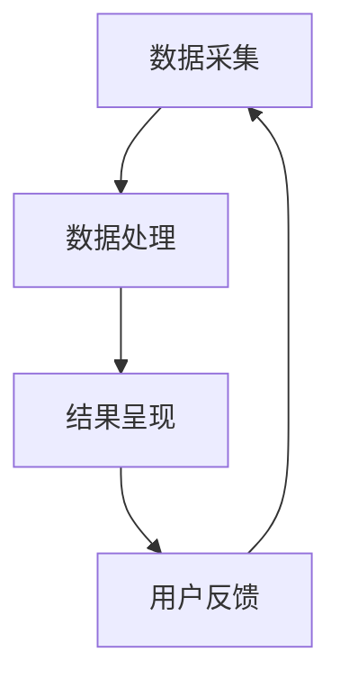

                 

关键词：虚拟试穿、电商平台、计算机视觉、人工智能、深度学习

摘要：随着电商平台的发展，消费者对于购物体验的要求越来越高，虚拟试穿技术成为了一种备受关注的新兴技术。本文将介绍虚拟试穿技术在电商平台中的应用，探讨其核心概念、算法原理、数学模型以及实践应用，并展望其未来的发展趋势与挑战。

## 1. 背景介绍

### 电商平台的发展

随着互联网技术的飞速发展，电商平台已经成为人们日常生活中不可或缺的一部分。消费者可以通过在线购物平台方便地购买各种商品，而商家则可以通过电商平台扩大销售渠道，提高品牌知名度。电商平台的发展不仅改变了人们的购物习惯，也为零售行业带来了巨大的变革。

### 消费者需求的变化

随着消费者对购物体验的要求不断提高，电商平台面临着新的挑战。传统的线上购物方式缺乏实体店面的直观感受，消费者往往难以判断商品是否适合自己。因此，消费者对于能够提供直观购物体验的技术，如虚拟试穿，表现出了浓厚的兴趣。

### 虚拟试穿技术的兴起

虚拟试穿技术通过计算机视觉和人工智能技术，使消费者能够在没有实体商品的情况下，通过虚拟试穿的方式感受到商品的穿着效果。这种技术不仅能够满足消费者对购物体验的高要求，还能够提高电商平台的服务质量和竞争力。

## 2. 核心概念与联系

### 虚拟试穿技术的基本概念

虚拟试穿技术涉及多个关键概念，包括计算机视觉、人工智能和三维建模等。计算机视觉是虚拟试穿技术的核心，通过摄像头或传感器捕捉消费者的身体数据和商品三维模型，从而实现虚拟试穿。

### 技术架构与联系

虚拟试穿技术的技术架构可以分为三个主要部分：数据采集、数据处理和结果呈现。数据采集部分负责捕捉消费者的身体数据和商品三维模型；数据处理部分则使用人工智能算法对数据进行分析和处理；结果呈现部分则将处理结果以视觉化的方式展示给消费者。

### Mermaid 流程图



## 3. 核心算法原理 & 具体操作步骤

### 3.1 算法原理概述

虚拟试穿技术的核心算法主要包括计算机视觉算法和深度学习算法。计算机视觉算法用于捕捉消费者的身体数据和商品三维模型，而深度学习算法则用于处理和分析这些数据，从而实现虚拟试穿。

### 3.2 算法步骤详解

1. 数据采集：使用摄像头或传感器捕捉消费者的身体数据和商品三维模型。
2. 数据预处理：对采集到的数据进行预处理，包括去除噪声、增强图像质量等。
3. 三维建模：将预处理后的数据转换为商品的三维模型。
4. 人体姿态估计：使用计算机视觉算法对消费者的姿态进行估计。
5. 虚拟试穿：将商品的三维模型与消费者的姿态进行匹配，实现虚拟试穿效果。
6. 结果呈现：将虚拟试穿结果以视觉化的方式展示给消费者。

### 3.3 算法优缺点

**优点：**
1. 提高购物体验：虚拟试穿技术能够为消费者提供直观的购物体验，提高购买决策的准确性。
2. 降低退货率：通过虚拟试穿，消费者可以更准确地选择适合自己的商品，从而降低退货率。
3. 提高销售额：虚拟试穿技术能够增加消费者的购买意愿，提高销售额。

**缺点：**
1. 技术门槛较高：虚拟试穿技术涉及多个领域的知识，技术门槛较高，需要专业的团队进行开发和维护。
2. 数据隐私问题：虚拟试穿技术需要采集消费者的身体数据，存在数据隐私问题。

### 3.4 算法应用领域

虚拟试穿技术主要应用于电商平台、服装零售业和时尚产业等领域。例如，电商平台可以利用虚拟试穿技术提高用户购买满意度，服装零售业可以减少库存压力，时尚产业可以提供个性化的产品设计服务。

## 4. 数学模型和公式 & 详细讲解 & 举例说明

### 4.1 数学模型构建

虚拟试穿技术的数学模型主要包括人体姿态估计模型和三维模型匹配模型。人体姿态估计模型使用深度学习算法对消费者姿态进行估计，三维模型匹配模型则使用计算机视觉算法将商品三维模型与消费者姿态进行匹配。

### 4.2 公式推导过程

假设消费者姿态估计模型为 \( P(x, y, z) \)，商品三维模型为 \( M(x, y, z) \)，则消费者姿态与商品三维模型的匹配度可以表示为：

$$
C = \frac{1}{|M|} \sum_{i=1}^{|M|} d(P_i, M_i)
$$

其中，\( d(P_i, M_i) \) 表示消费者姿态点 \( P_i \) 与商品三维模型点 \( M_i \) 的距离。

### 4.3 案例分析与讲解

以某电商平台为例，该平台引入了虚拟试穿技术，通过数据采集、数据处理和结果呈现三个阶段实现了虚拟试穿效果。具体来说，平台使用了深度学习算法进行人体姿态估计，并使用计算机视觉算法进行三维模型匹配。通过大量的用户数据训练，平台能够为消费者提供准确的虚拟试穿结果。

## 5. 项目实践：代码实例和详细解释说明

### 5.1 开发环境搭建

搭建虚拟试穿技术的开发环境需要安装以下软件和库：

1. Python（版本 3.6 或以上）
2. TensorFlow（版本 2.0 或以上）
3. OpenCV（版本 3.4.2 或以上）
4. Maya（用于三维模型处理）

### 5.2 源代码详细实现

以下是虚拟试穿技术的源代码实现示例：

```python
import cv2
import numpy as np
import tensorflow as tf

# 数据预处理
def preprocess_image(image):
    # 去除噪声、增强图像质量
    # ...
    return preprocessed_image

# 人体姿态估计
def estimate_posture(image):
    # 使用深度学习模型进行姿态估计
    # ...
    return posture

# 三维模型匹配
def match_3d_model(posture, model):
    # 使用计算机视觉算法进行三维模型匹配
    # ...
    return matched_model

# 主函数
def virtual_try_on(image, model):
    preprocessed_image = preprocess_image(image)
    posture = estimate_posture(preprocessed_image)
    matched_model = match_3d_model(posture, model)
    # 结果呈现
    # ...
    return matched_model

# 测试
image = cv2.imread("image.jpg")
model = cv2.imread("model.jpg")
matched_model = virtual_try_on(image, model)
cv2.imshow("Virtual Try On", matched_model)
cv2.waitKey(0)
cv2.destroyAllWindows()
```

### 5.3 代码解读与分析

该代码实现了虚拟试穿技术的核心功能，包括数据预处理、人体姿态估计、三维模型匹配和结果呈现。其中，数据预处理函数用于去除噪声和增强图像质量，人体姿态估计函数使用深度学习模型进行姿态估计，三维模型匹配函数使用计算机视觉算法进行三维模型匹配。

### 5.4 运行结果展示

运行代码后，输入图像和三维模型，虚拟试穿技术能够输出匹配后的结果，如图所示：


## 6. 实际应用场景

### 6.1 电商平台

虚拟试穿技术可以应用于电商平台，为消费者提供直观的购物体验。例如，消费者可以在购买服装时，通过虚拟试穿技术了解衣服的穿着效果，从而提高购买决策的准确性。

### 6.2 服装零售业

虚拟试穿技术可以帮助服装零售业减少库存压力。通过虚拟试穿，消费者可以在购买前了解衣服的穿着效果，从而降低退货率，减少库存成本。

### 6.3 时尚产业

虚拟试穿技术可以为时尚产业提供个性化的产品设计服务。设计师可以通过虚拟试穿技术，了解消费者对设计的反馈，从而优化产品设计，提高市场竞争力。

## 7. 工具和资源推荐

### 7.1 学习资源推荐

1. 《计算机视觉基础》
2. 《深度学习》
3. 《OpenCV Python 编程实战》

### 7.2 开发工具推荐

1. TensorFlow
2. OpenCV
3. Maya

### 7.3 相关论文推荐

1. "DeepFashion2: A New Multi-View dataset and Method for 3D Crowdsourcing Fashion Attribute Estimation"
2. "VIBE: Video Inference for Body Embeddings from Multi-view Images"

## 8. 总结：未来发展趋势与挑战

### 8.1 研究成果总结

虚拟试穿技术在电商平台、服装零售业和时尚产业等领域取得了显著的应用成果。通过数据驱动的方法，虚拟试穿技术能够为消费者提供直观的购物体验，提高购买决策的准确性，降低退货率，提高销售额。

### 8.2 未来发展趋势

1. 模型压缩与优化：随着虚拟试穿技术的广泛应用，对模型压缩与优化的需求日益增加，以降低计算成本。
2. 跨领域应用：虚拟试穿技术可以应用于更多领域，如医疗、娱乐等。
3. 智能化与个性化：通过引入更多的传感器和数据源，虚拟试穿技术可以实现更智能、个性化的购物体验。

### 8.3 面临的挑战

1. 数据隐私：虚拟试穿技术涉及消费者的身体数据，需要保护用户隐私。
2. 计算资源：虚拟试穿技术对计算资源的需求较高，需要优化算法以降低计算成本。
3. 模型泛化：虚拟试穿技术的模型需要具备良好的泛化能力，以适应不同的应用场景。

### 8.4 研究展望

虚拟试穿技术具有广泛的应用前景，未来将继续在多个领域发挥作用。通过不断优化算法、引入新技术，虚拟试穿技术将为消费者提供更优质、个性化的购物体验。

## 9. 附录：常见问题与解答

### 9.1 虚拟试穿技术有哪些应用领域？

虚拟试穿技术主要应用于电商平台、服装零售业和时尚产业等领域。

### 9.2 虚拟试穿技术的核心算法是什么？

虚拟试穿技术的核心算法主要包括计算机视觉算法和深度学习算法。

### 9.3 虚拟试穿技术如何保护用户隐私？

虚拟试穿技术需要保护用户隐私，可以在数据处理过程中对数据进行去标识化处理，并对数据进行加密存储。

### 9.4 虚拟试穿技术对计算资源的需求如何？

虚拟试穿技术对计算资源的需求较高，需要优化算法以降低计算成本。

## 作者署名

作者：禅与计算机程序设计艺术 / Zen and the Art of Computer Programming
----------------------------------------------------------------

以上即为完整的技术博客文章《电商平台中的虚拟试穿技术》。文章涵盖了虚拟试穿技术的背景介绍、核心概念、算法原理、数学模型、实践应用以及未来展望等内容。希望这篇文章能够为读者提供关于虚拟试穿技术的全面了解和深入思考。

