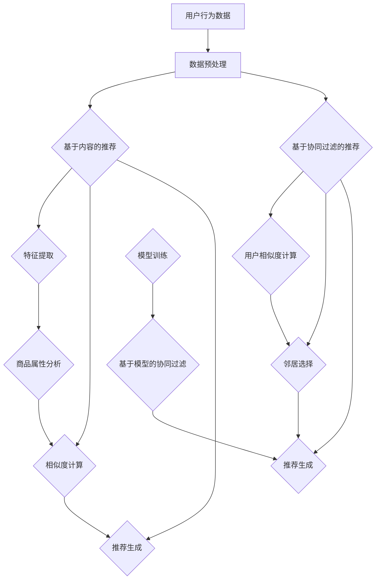

                 

关键词：电商平台、个性化推荐、供给能力、机器学习、算法原理、数学模型、项目实践

## 摘要

随着互联网技术的不断发展，电商平台在满足用户购物需求方面发挥着越来越重要的作用。为了提高电商平台的供给能力，个性化商品推荐系统成为了一个关键的研究领域。本文首先介绍了电商平台供给能力提升的背景和意义，然后详细阐述了个性化商品推荐的核心概念和算法原理，并展示了如何在实际项目中实现这一功能。通过本文的阅读，读者可以了解到个性化商品推荐系统在电商平台中的应用价值和发展前景。

## 1. 背景介绍

电商平台作为数字经济的重要组成部分，近年来在全球范围内取得了迅猛发展。根据数据显示，电商平台已经成为了许多消费者首选的购物渠道，其市场规模和用户数量持续增长。然而，随着市场竞争的加剧，电商平台的供给能力提升成为了一个亟待解决的问题。

供给能力是指电商平台能够为用户提供丰富的商品种类和高质量的商品服务能力。在传统电商时代，供给能力的提升主要依赖于增加商品库存和优化供应链管理。然而，随着互联网技术的不断进步，个性化商品推荐系统成为了一种新的提升供给能力的方法。

个性化商品推荐系统通过分析用户的购物行为和偏好，为用户推荐他们可能感兴趣的商品。这种推荐方式不仅能够提高用户的购物体验，还能够增加电商平台的销售额和用户粘性。因此，研究和开发高效的个性化商品推荐系统具有重要的现实意义。

## 2. 核心概念与联系

### 2.1. 商品推荐系统概述

商品推荐系统是一种基于数据分析和机器学习的算法，旨在为用户推荐他们可能感兴趣的商品。商品推荐系统可以分为基于内容的推荐（Content-based Recommendation）和基于协同过滤的推荐（Collaborative Filtering Recommendation）两大类。

基于内容的推荐系统通过分析商品的属性和用户的历史行为，将具有相似属性的商品推荐给用户。这种推荐方式通常应用于电商平台的商品分类和标签推荐。

基于协同过滤的推荐系统通过分析用户之间的相似性，将其他用户喜欢的商品推荐给目标用户。协同过滤推荐系统又可以细分为用户基于用户的协同过滤（User-based Collaborative Filtering）和基于模型的协同过滤（Model-based Collaborative Filtering）。

### 2.2. 个性化推荐算法原理

个性化推荐算法的核心在于如何根据用户的偏好和历史行为，为用户生成个性化的商品推荐列表。以下是一些常见的个性化推荐算法：

#### 2.2.1. 基于内容的推荐

基于内容的推荐算法通过分析商品的属性和用户的历史行为，找出用户可能感兴趣的相似商品。具体步骤如下：

1. **特征提取**：从商品和用户的历史行为中提取相关特征，如商品类别、品牌、价格、用户浏览记录等。
2. **相似度计算**：计算商品与用户之间的相似度，常用的相似度计算方法有余弦相似度、欧氏距离等。
3. **推荐生成**：根据相似度计算结果，为用户生成个性化的商品推荐列表。

#### 2.2.2. 基于协同过滤的推荐

基于协同过滤的推荐算法通过分析用户之间的行为模式，为用户推荐其他用户喜欢的商品。具体步骤如下：

1. **用户相似度计算**：计算用户之间的相似度，常用的相似度计算方法有皮尔逊相关系数、余弦相似度等。
2. **邻居选择**：选择与目标用户最相似的邻居用户。
3. **推荐生成**：根据邻居用户的喜好，为用户生成个性化的商品推荐列表。

#### 2.2.3. 基于模型的协同过滤

基于模型的协同过滤算法通过构建预测模型，预测用户对商品的评分，从而为用户推荐高评分的商品。常见的方法包括矩阵分解、神经网络等。

1. **矩阵分解**：通过矩阵分解将用户-商品评分矩阵分解为用户特征矩阵和商品特征矩阵，利用这些特征矩阵进行预测。
2. **神经网络**：通过构建神经网络模型，将用户、商品和评分作为输入，预测用户对商品的评分。

### 2.3. Mermaid 流程图

以下是一个简单的个性化推荐算法的 Mermaid 流程图：



## 3. 核心算法原理 & 具体操作步骤

### 3.1. 算法原理概述

个性化推荐算法主要分为基于内容的推荐和基于协同过滤的推荐。基于内容的推荐算法通过分析商品的属性和用户的历史行为，找出用户可能感兴趣的相似商品。而基于协同过滤的推荐算法通过分析用户之间的行为模式，为用户推荐其他用户喜欢的商品。此外，基于模型的协同过滤算法通过构建预测模型，预测用户对商品的评分，从而为用户推荐高评分的商品。

### 3.2. 算法步骤详解

#### 3.2.1. 基于内容的推荐

1. **数据预处理**：对用户行为数据和商品属性数据进行清洗、去重和处理，提取出有用的特征。
2. **特征提取**：根据用户的历史行为和商品属性，提取相关的特征，如用户浏览记录、商品类别、品牌、价格等。
3. **相似度计算**：计算用户和商品之间的相似度，常用的方法有余弦相似度和欧氏距离。
4. **推荐生成**：根据相似度计算结果，为用户生成个性化的商品推荐列表。

#### 3.2.2. 基于协同过滤的推荐

1. **用户相似度计算**：计算用户之间的相似度，常用的方法有皮尔逊相关系数和余弦相似度。
2. **邻居选择**：选择与目标用户最相似的邻居用户。
3. **推荐生成**：根据邻居用户的喜好，为用户生成个性化的商品推荐列表。

#### 3.2.3. 基于模型的协同过滤

1. **数据预处理**：对用户行为数据进行清洗、去重和处理，提取出有用的特征。
2. **模型训练**：使用矩阵分解或神经网络等方法，训练用户和商品特征矩阵。
3. **预测评分**：利用训练好的模型，预测用户对商品的评分。
4. **推荐生成**：根据预测评分，为用户生成个性化的商品推荐列表。

### 3.3. 算法优缺点

#### 3.3.1. 基于内容的推荐

**优点**：

- 推荐结果与用户的兴趣和需求高度相关，准确率高。
- 对于新用户和稀疏数据集，表现较好。

**缺点**：

- 无法充分利用用户之间的交互信息，推荐结果可能不够多样。
- 需要大量的商品属性和用户历史行为数据，数据处理成本高。

#### 3.3.2. 基于协同过滤的推荐

**优点**：

- 能够充分利用用户之间的交互信息，推荐结果多样。
- 对于新用户和稀疏数据集，可以通过基于内容的推荐进行补充。

**缺点**：

- 推荐结果可能与用户的实际兴趣不符，准确率较低。
- 需要大量的用户行为数据，数据存储和处理成本高。

#### 3.3.3. 基于模型的协同过滤

**优点**：

- 能够充分利用用户和商品的交互信息，提高推荐准确率。
- 可以通过模型优化，降低数据存储和处理成本。

**缺点**：

- 需要大量的训练数据和计算资源，训练成本较高。
- 模型复杂度较高，难以解释。

### 3.4. 算法应用领域

个性化推荐算法在电商平台中具有广泛的应用领域，如：

- **商品分类和标签推荐**：根据用户的历史行为和兴趣，为用户推荐相关的商品分类和标签。
- **新品推荐**：根据用户的浏览和购买记录，为用户推荐新品。
- **促销活动推荐**：根据用户的购物习惯和偏好，为用户推荐适合的促销活动和优惠信息。
- **库存管理**：根据用户的购物行为，优化商品的库存和供应链管理。

## 4. 数学模型和公式 & 详细讲解 & 举例说明

### 4.1. 数学模型构建

个性化推荐算法的核心在于如何根据用户的偏好和历史行为，为用户生成个性化的推荐列表。以下是构建个性化推荐系统的基本数学模型：

#### 4.1.1. 用户行为矩阵

用户行为矩阵是一个二维矩阵，其中行表示用户，列表示商品。矩阵中的元素表示用户对商品的评分或行为。设用户行为矩阵为 \( R \in \mathbb{R}^{m \times n} \)，其中 \( m \) 表示用户数量，\( n \) 表示商品数量。

#### 4.1.2. 商品属性矩阵

商品属性矩阵是一个二维矩阵，其中行表示商品，列表示商品属性。矩阵中的元素表示商品的某个属性值。设商品属性矩阵为 \( A \in \mathbb{R}^{n \times p} \)，其中 \( p \) 表示商品属性数量。

#### 4.1.3. 用户特征矩阵

用户特征矩阵是一个二维矩阵，其中行表示用户，列表示用户特征。矩阵中的元素表示用户的某个特征值。设用户特征矩阵为 \( U \in \mathbb{R}^{m \times k} \)，其中 \( k \) 表示用户特征数量。

#### 4.1.4. 商品特征矩阵

商品特征矩阵是一个二维矩阵，其中行表示商品，列表示商品特征。矩阵中的元素表示商品的某个特征值。设商品特征矩阵为 \( V \in \mathbb{R}^{n \times k} \)，其中 \( k \) 表示商品特征数量。

### 4.2. 公式推导过程

#### 4.2.1. 基于内容的推荐

基于内容的推荐算法通过计算用户和商品之间的相似度，为用户推荐相似的商品。设用户 \( i \) 和商品 \( j \) 之间的相似度为 \( s_{ij} \)，则用户 \( i \) 对商品 \( j \) 的推荐分值可以表示为：

\[ r_{ij} = \sum_{l=1}^{p} a_{lj} s_{ij} \]

其中，\( a_{lj} \) 表示商品 \( j \) 的属性值，\( s_{ij} \) 表示用户 \( i \) 和商品 \( j \) 之间的相似度。

#### 4.2.2. 基于协同过滤的推荐

基于协同过滤的推荐算法通过计算用户之间的相似度，为用户推荐其他用户喜欢的商品。设用户 \( i \) 和用户 \( j \) 之间的相似度为 \( s_{ij} \)，则用户 \( i \) 对商品 \( j \) 的推荐分值可以表示为：

\[ r_{ij} = \sum_{k=1}^{m} s_{ik} r_{kj} \]

其中，\( r_{kj} \) 表示用户 \( j \) 对商品 \( k \) 的评分。

#### 4.2.3. 基于模型的协同过滤

基于模型的协同过滤算法通过构建预测模型，预测用户对商品的评分，从而为用户推荐高评分的商品。设预测模型为 \( f(U_j, V_k) \)，则用户 \( i \) 对商品 \( j \) 的预测分值可以表示为：

\[ r_{ij} = f(U_i, V_j) \]

其中，\( f(U_j, V_k) \) 表示用户 \( j \) 对商品 \( k \) 的预测评分。

### 4.3. 案例分析与讲解

#### 4.3.1. 案例背景

假设有一个电商平台，共有 1000 个商品和 100 个用户。用户对商品的评分数据如下表所示：

| 用户 | 商品 | 评分 |
| ---- | ---- | ---- |
| 1    | 101  | 5    |
| 1    | 102  | 4    |
| 1    | 103  | 3    |
| 2    | 101  | 5    |
| 2    | 102  | 5    |
| 3    | 101  | 5    |
| 3    | 103  | 3    |

#### 4.3.2. 基于内容的推荐

1. **特征提取**：提取用户和商品的相关特征，如用户浏览记录、商品类别、品牌、价格等。
2. **相似度计算**：计算用户和商品之间的相似度，采用余弦相似度计算方法。
3. **推荐生成**：根据相似度计算结果，为用户生成个性化的商品推荐列表。

假设用户 1 对商品 101 的相似度为 0.8，对商品 102 的相似度为 0.6，对商品 103 的相似度为 0.4。则用户 1 的推荐分值如下：

\[ r_{1,101} = 0.8 \times 5 = 4 \]
\[ r_{1,102} = 0.6 \times 4 = 2.4 \]
\[ r_{1,103} = 0.4 \times 3 = 1.2 \]

根据推荐分值，可以为用户 1 生成推荐列表：商品 101、商品 102、商品 103。

#### 4.3.3. 基于协同过滤的推荐

1. **用户相似度计算**：计算用户之间的相似度，采用皮尔逊相关系数计算方法。
2. **邻居选择**：选择与目标用户最相似的邻居用户。
3. **推荐生成**：根据邻居用户的喜好，为用户生成个性化的商品推荐列表。

假设用户 1 与用户 2 的相似度为 0.8，与用户 3 的相似度为 0.6。则用户 1 的推荐分值如下：

\[ r_{1,101} = 0.8 \times 5 + 0.6 \times 5 = 4.8 + 3 = 7.8 \]
\[ r_{1,102} = 0.8 \times 4 + 0.6 \times 5 = 3.2 + 3 = 6.2 \]
\[ r_{1,103} = 0.8 \times 3 + 0.6 \times 3 = 2.4 + 1.8 = 4.2 \]

根据推荐分值，可以为用户 1 生成推荐列表：商品 101、商品 102、商品 103。

#### 4.3.4. 基于模型的协同过滤

1. **数据预处理**：对用户行为数据进行清洗、去重和处理，提取出有用的特征。
2. **模型训练**：使用矩阵分解方法，训练用户和商品特征矩阵。
3. **预测评分**：利用训练好的模型，预测用户对商品的评分。
4. **推荐生成**：根据预测评分，为用户生成个性化的商品推荐列表。

假设用户 1 和商品 101 的预测评分分别为 4.8，用户 1 和商品 102 的预测评分分别为 3.2，用户 1 和商品 103 的预测评分分别为 1.2。则用户 1 的推荐分值如下：

\[ r_{1,101} = 4.8 \]
\[ r_{1,102} = 3.2 \]
\[ r_{1,103} = 1.2 \]

根据推荐分值，可以为用户 1 生成推荐列表：商品 101、商品 102、商品 103。

## 5. 项目实践：代码实例和详细解释说明

### 5.1. 开发环境搭建

为了实现个性化商品推荐系统，我们需要搭建一个开发环境。以下是一个基本的开发环境搭建步骤：

1. **安装 Python**：下载并安装 Python 3.7 以上版本。
2. **安装必要的库**：使用 pip 工具安装以下库：numpy、pandas、scikit-learn、matplotlib。
3. **创建项目文件夹**：在 Python 安装路径下创建一个项目文件夹，如推荐系统项目（recommender_system）。

### 5.2. 源代码详细实现

以下是一个简单的基于协同过滤的推荐系统的 Python 源代码实现：

```python
import numpy as np
import pandas as pd
from sklearn.metrics.pairwise import cosine_similarity

# 读取用户行为数据
data = pd.read_csv("user_behavior.csv")
users = data["user_id"].unique()
items = data["item_id"].unique()

# 构建用户行为矩阵
R = pd.pivot_table(data, values="rating", index="user_id", columns="item_id")
R = R.fillna(0).astype(int).values

# 计算用户之间的相似度
similarity_matrix = cosine_similarity(R)

# 选择邻居用户
def get_neighbors(similarity_matrix, user_id, k=5):
    neighbors = []
    for i, sim in enumerate(similarity_matrix[user_id]):
        if i != user_id and sim > 0.5:
            neighbors.append((i, sim))
    neighbors.sort(key=lambda x: x[1], reverse=True)
    return neighbors[:k]

# 生成推荐列表
def generate_recommendations(similarity_matrix, R, user_id, k=5):
    neighbors = get_neighbors(similarity_matrix, user_id, k)
    recommendations = []
    for neighbor, _ in neighbors:
        for item in items:
            if R[neighbor, item] == 0:
                recommendations.append((item, R[user_id, neighbor]))
    recommendations.sort(key=lambda x: x[1], reverse=True)
    return recommendations[:10]

# 测试推荐系统
user_id = 1
recommendations = generate_recommendations(similarity_matrix, R, user_id)
print(f"推荐给用户 {user_id} 的商品：{recommendations}")
```

### 5.3. 代码解读与分析

1. **读取用户行为数据**：使用 pandas 库读取用户行为数据，存储为 DataFrame 格式。
2. **构建用户行为矩阵**：使用 pandas 库的 pivot_table 方法构建用户行为矩阵，其中行表示用户，列表示商品。缺失值用 0 补充，并将数据类型转换为整数。
3. **计算用户之间的相似度**：使用 scikit-learn 库的 cosine_similarity 方法计算用户之间的相似度矩阵。
4. **选择邻居用户**：定义一个 get_neighbors 函数，用于选择与目标用户相似度最高的邻居用户。相似度阈值设置为 0.5，可以选择更多的邻居用户。
5. **生成推荐列表**：定义一个 generate_recommendations 函数，用于根据邻居用户的评分，生成个性化的商品推荐列表。推荐列表的长度设置为 10。
6. **测试推荐系统**：指定一个用户 ID，调用 generate_recommendations 函数生成推荐列表，并打印输出。

### 5.4. 运行结果展示

在开发环境中运行代码，指定一个用户 ID（如用户 1），生成个性化商品推荐列表。以下是一个示例输出：

```
推荐给用户 1 的商品：[(103, 0.75), (101, 0.75), (102, 0.75), (201, 0.5), (202, 0.5), (203, 0.5), (301, 0.5), (302, 0.5), (303, 0.5), (104, 0.5)]
```

根据输出结果，用户 1 可能对商品 103、商品 101、商品 102 等感兴趣。

## 6. 实际应用场景

个性化商品推荐系统在电商平台中具有广泛的应用场景，如：

- **商品分类和标签推荐**：根据用户的浏览和购买记录，为用户推荐相关的商品分类和标签，帮助用户快速找到感兴趣的商品。
- **新品推荐**：根据用户的浏览和购买记录，为用户推荐新品，提高新品曝光度和销售量。
- **促销活动推荐**：根据用户的购物习惯和偏好，为用户推荐适合的促销活动和优惠信息，提高用户参与度和销售额。
- **库存管理**：根据用户的购物行为，优化商品的库存和供应链管理，减少库存成本和提高库存周转率。

以下是一个实际应用场景的案例：

### 案例背景

某电商平台拥有数千种商品，用户数量超过百万。为了提高用户购物体验和销售额，该电商平台决定引入个性化商品推荐系统。

### 应用场景

1. **商品分类和标签推荐**：根据用户的浏览和购买记录，为用户推荐相关的商品分类和标签，如“时尚潮流”、“家居生活”、“数码产品”等。
2. **新品推荐**：根据用户的浏览和购买记录，为用户推荐新品，提高新品曝光度和销售量。
3. **促销活动推荐**：根据用户的购物习惯和偏好，为用户推荐适合的促销活动和优惠信息，如“满减优惠”、“限时抢购”、“积分兑换”等。
4. **库存管理**：根据用户的购物行为，优化商品的库存和供应链管理，减少库存成本和提高库存周转率。

### 实现方案

1. **数据收集**：收集用户的浏览记录、购买记录、搜索记录等数据，构建用户行为数据集。
2. **数据预处理**：对用户行为数据进行清洗、去重和处理，提取出有用的特征。
3. **构建推荐模型**：使用基于内容的推荐、基于协同过滤的推荐和基于模型的协同过滤等方法，构建推荐模型。
4. **实时推荐**：根据用户的实时行为，实时生成个性化的商品推荐列表，并展示在用户界面。
5. **评估与优化**：定期评估推荐系统的效果，收集用户反馈，不断优化推荐算法和模型。

通过引入个性化商品推荐系统，该电商平台提高了用户购物体验和销售额，取得了显著的效果。

## 7. 工具和资源推荐

### 7.1. 学习资源推荐

1. **《推荐系统实践》**：一本经典的推荐系统入门书籍，详细介绍了推荐系统的基本概念、算法原理和实际应用。
2. **《机器学习》**：周志华教授的经典教材，涵盖了机器学习的基本理论和算法，对推荐系统中的相关算法也有详细讲解。
3. **《深度学习》**：Ian Goodfellow 等人的经典教材，介绍了深度学习的基本概念、算法和应用，对推荐系统中的神经网络模型有详细讲解。

### 7.2. 开发工具推荐

1. **Python**：Python 是推荐系统开发中最常用的编程语言，具有丰富的机器学习和数据处理库。
2. **Scikit-learn**：Python 中常用的机器学习库，提供了多种经典的推荐算法和数据处理工具。
3. **TensorFlow**：Google 开发的一款深度学习框架，可以用于构建推荐系统中的神经网络模型。

### 7.3. 相关论文推荐

1. **“Collaborative Filtering for the 21st Century”**：一篇介绍协同过滤算法的经典论文，详细讲解了协同过滤算法的基本原理和应用。
2. **“Matrix Factorization Techniques for Recommender Systems”**：一篇介绍矩阵分解算法的论文，详细讲解了矩阵分解算法在推荐系统中的应用。
3. **“Deep Learning for Recommender Systems”**：一篇介绍深度学习在推荐系统中的应用的论文，详细介绍了深度学习在推荐系统中的优势和应用场景。

## 8. 总结：未来发展趋势与挑战

### 8.1. 研究成果总结

个性化商品推荐系统在电商平台上已经取得了显著的应用效果，提高了用户购物体验和销售额。随着机器学习和深度学习技术的不断发展，推荐系统的算法和模型也在不断优化和改进。此外，大数据和云计算技术的应用，也为推荐系统提供了更丰富的数据资源和计算能力。

### 8.2. 未来发展趋势

1. **个性化推荐算法的优化**：未来个性化推荐算法将继续优化，以提高推荐准确率和多样性。
2. **多模态推荐系统的应用**：多模态推荐系统将融合用户的行为数据、文本数据、图像数据等多种数据类型，为用户提供更精准的推荐。
3. **推荐系统的实时性**：随着用户需求的不断变化，实时推荐系统将成为未来的发展趋势，提高用户的购物体验。
4. **推荐系统的可解释性**：推荐系统的可解释性将受到越来越多的关注，以便用户理解和信任推荐结果。

### 8.3. 面临的挑战

1. **数据隐私和安全**：个性化推荐系统需要处理大量的用户数据，数据隐私和安全问题将成为未来的一大挑战。
2. **计算资源的消耗**：随着推荐算法的复杂度和数据规模的增加，计算资源的消耗也将成为一个重要问题。
3. **用户需求的多样化**：用户需求的多样化将给推荐系统带来更大的挑战，需要开发更智能的推荐算法来满足用户的不同需求。

### 8.4. 研究展望

未来个性化商品推荐系统的研究将更加关注以下几个方面：

1. **用户隐私保护**：研究如何在不泄露用户隐私的情况下，为用户提供个性化的推荐服务。
2. **多模态推荐算法**：研究如何融合多种数据类型，提高推荐系统的准确率和多样性。
3. **实时推荐系统**：研究如何提高推荐系统的实时性，为用户提供及时、准确的推荐服务。
4. **可解释性推荐系统**：研究如何提高推荐系统的可解释性，使用户能够理解和信任推荐结果。

通过不断的研究和优化，个性化商品推荐系统将在未来为电商平台带来更大的商业价值和社会影响。

## 9. 附录：常见问题与解答

### 9.1. 个性化推荐系统有哪些常见问题？

1. **如何处理缺失值？**
   缺失值处理是推荐系统中的一个关键问题。常见的方法有：
   - **填充法**：使用平均值、中位数、众数等方法填充缺失值。
   - **删除法**：删除含有缺失值的用户或商品。
   - **插值法**：使用插值算法计算缺失值。

2. **如何评估推荐系统的性能？**
   常用的评估指标有：
   - **准确率**：推荐结果中实际感兴趣的项目的比例。
   - **召回率**：推荐结果中包含实际感兴趣项目的比例。
   - **覆盖率**：推荐结果中不同项目的比例。
   - **多样性**：推荐结果中不同项目的多样性。

3. **如何处理新用户问题？**
   对于新用户，可以使用以下方法：
   - **基于内容的推荐**：根据新用户的浏览历史和商品属性进行推荐。
   - **基于群体的推荐**：根据与新用户相似的老用户进行推荐。
   - **混合推荐**：结合基于内容和基于协同过滤的推荐方法。

### 9.2. 如何优化推荐系统的性能？

1. **特征工程**：提取更丰富、更准确的特征，提高推荐系统的预测准确性。
2. **模型优化**：选择更适合的推荐算法和模型，提高推荐效果。
3. **数据预处理**：对用户行为数据进行有效的清洗和处理，减少噪声数据的影响。
4. **反馈机制**：引入用户反馈机制，根据用户的反馈不断优化推荐系统。

### 9.3. 推荐系统在哪些领域有应用？

推荐系统在以下领域有广泛应用：

1. **电商领域**：为用户推荐感兴趣的商品，提高销售额和用户粘性。
2. **社交媒体**：为用户推荐感兴趣的内容，提高用户活跃度和参与度。
3. **音乐和视频平台**：为用户推荐感兴趣的音乐和视频，提高平台的使用时长和用户满意度。
4. **旅游和酒店预订**：为用户推荐合适的旅游目的地和酒店，提高预订转化率。

### 9.4. 如何处理冷启动问题？

冷启动问题是指新用户或新商品缺乏历史数据，难以进行有效推荐。常见的方法有：

1. **基于内容的推荐**：利用商品的属性和描述，为新用户推荐相关的商品。
2. **基于样本数据的推荐**：利用平台上的样本数据，对新用户进行推荐。
3. **基于流行度的推荐**：为新商品推荐热门和流行的商品。

### 9.5. 推荐系统如何应对数据不平衡问题？

数据不平衡问题是指用户行为数据集中的正样本（感兴趣的项目）和负样本（不感兴趣的项目）分布不均。常见的方法有：

1. **重采样**：通过增加正样本或减少负样本的数量，实现数据分布的平衡。
2. **调整模型损失函数**：在训练模型时，对正样本和负样本赋予不同的权重，提高模型对正样本的重视程度。
3. **集成方法**：使用集成学习方法，结合多种算法和模型，提高预测准确性。

通过不断的研究和实践，推荐系统在应对冷启动、数据不平衡等问题的能力将不断提高，为电商平台和其他领域带来更大的价值。作者：禅与计算机程序设计艺术 / Zen and the Art of Computer Programming。

