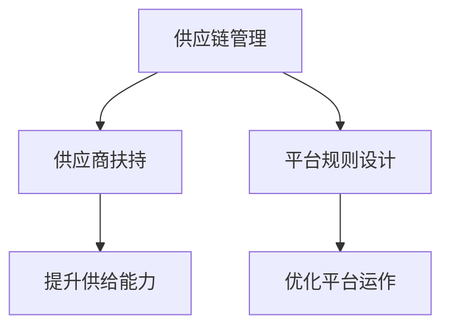

                 

 关键词：电商平台、供给能力、供应商扶持、平台规则、算法、技术、优化、实践、展望

> 摘要：本文主要探讨了电商平台供给能力的提升方法，重点关注了供应商扶持和平台规则的重要性。通过深入分析当前电商行业的发展状况，本文提出了有效的供应商扶持策略和平台规则设计原则，并探讨了这些策略在提升供给能力和优化平台运作中的作用。

## 1. 背景介绍

随着互联网技术的快速发展，电商平台已经成为现代商业环境中不可或缺的一环。电商平台通过线上渠道为消费者提供丰富的商品和服务，同时也为供应商提供了一个广阔的销售平台。然而，电商平台供给能力的提升不仅仅是增加商品种类和数量，更重要的是如何通过有效的策略和规则设计，提升供应商的参与度和贡献率。

### 1.1 电商平台的发展状况

电商平台的发展可以分为三个阶段：1.0时代，主要依靠价格优势吸引用户；2.0时代，注重用户体验和品牌建设；3.0时代，开始强调供应链和数据的整合。当前，电商平台已经进入了3.0时代，如何提升供给能力，优化供应链管理，成为各大电商平台竞相探索的方向。

### 1.2 供应商在电商平台的角色

供应商是电商平台的重要组成部分，他们提供商品和服务，满足消费者的需求。供应商的供给能力直接关系到平台的市场竞争力。因此，电商平台需要通过有效的扶持策略，提升供应商的供给能力和积极性。

## 2. 核心概念与联系

为了更好地理解电商平台供给能力的提升方法，我们需要明确一些核心概念，包括供应链管理、供应商扶持和平台规则设计。

### 2.1 供应链管理

供应链管理是指通过计划、实施和控制等活动，实现从原材料采购到产品交付的整个过程。在电商平台上，供应链管理涉及到供应商的选择、商品配送、库存管理等环节。

### 2.2 供应商扶持

供应商扶持是指电商平台通过一系列政策、技术和资源支持，帮助供应商提升供给能力和市场竞争力。供应商扶持策略包括资金扶持、技术培训、市场推广等。

### 2.3 平台规则设计

平台规则设计是指电商平台制定的一系列规则和标准，以规范供应商行为，保障平台运营秩序。平台规则设计包括供应商准入规则、商品质量标准、售后服务规范等。

### 2.4 Mermaid 流程图



## 3. 核心算法原理 & 具体操作步骤

### 3.1 算法原理概述

提升电商平台供给能力的核心算法主要包括供需匹配算法、供应链优化算法和平台规则优化算法。这些算法通过分析大数据，实现供应商和消费者的精准匹配，优化供应链运作，提升平台整体供给能力。

### 3.2 算法步骤详解

#### 3.2.1 供需匹配算法

1. 数据采集：收集电商平台上的消费者需求和供应商供给数据。
2. 数据处理：对数据进行清洗、去重和分类。
3. 供需匹配：利用机器学习算法，对消费者需求进行预测，并根据供应商供给能力进行匹配。
4. 结果评估：评估匹配效果，根据反馈进行优化。

#### 3.2.2 供应链优化算法

1. 模型建立：建立供应链优化模型，包括库存管理、配送优化等。
2. 目标函数定义：定义优化目标，如成本最低、效率最高等。
3. 算法求解：采用优化算法，如遗传算法、模拟退火算法等，求解最优解。
4. 结果评估：评估优化效果，根据反馈进行优化。

#### 3.2.3 平台规则优化算法

1. 数据采集：收集电商平台上的规则数据，包括供应商准入规则、商品质量标准等。
2. 数据分析：分析规则的有效性和合理性。
3. 规则优化：根据分析结果，调整和优化平台规则。
4. 结果评估：评估规则优化效果，根据反馈进行优化。

### 3.3 算法优缺点

#### 3.3.1 供需匹配算法

优点：能够实现消费者需求和供应商供给的精准匹配，提升用户满意度。

缺点：算法复杂度高，计算成本较大。

#### 3.3.2 供应链优化算法

优点：能够优化供应链运作，降低成本，提高效率。

缺点：对供应链数据要求较高，数据质量直接影响算法效果。

#### 3.3.3 平台规则优化算法

优点：能够提升平台运营秩序，保障消费者权益。

缺点：规则调整需要充分考虑各方利益，实施难度较大。

### 3.4 算法应用领域

供需匹配算法、供应链优化算法和平台规则优化算法广泛应用于电商、物流、零售等行业，能够有效提升行业供给能力，优化供应链运作，提高市场竞争力。

## 4. 数学模型和公式 & 详细讲解 & 举例说明

### 4.1 数学模型构建

为了提升电商平台供给能力，我们可以构建以下数学模型：

#### 4.1.1 供需匹配模型

设消费者需求向量为 $D = [D_1, D_2, ..., D_n]$，供应商供给向量为 $S = [S_1, S_2, ..., S_n]$，供需匹配向量为 $M = [M_1, M_2, ..., M_n]$，其中 $M_i$ 表示第 $i$ 个供应商的匹配程度。

供需匹配模型的目标是最小化供需差距，即：

$$
\min \sum_{i=1}^n |D_i - S_i|
$$

#### 4.1.2 供应链优化模型

设库存成本为 $C_{inv}$，配送成本为 $C_{del}$，供应链优化模型的目标是最小化总成本，即：

$$
\min C_{total} = C_{inv} + C_{del}
$$

其中，$C_{inv}$ 和 $C_{del}$ 的计算公式如下：

$$
C_{inv} = \sum_{i=1}^n (I_i \times c_i)
$$

$$
C_{del} = \sum_{i=1}^n (D_i \times d_i)
$$

其中，$I_i$ 表示第 $i$ 个商品的库存量，$c_i$ 表示第 $i$ 个商品的单位库存成本，$D_i$ 表示第 $i$ 个商品的需求量，$d_i$ 表示第 $i$ 个商品的配送成本。

### 4.2 公式推导过程

#### 4.2.1 供需匹配模型推导

设 $D_i$ 和 $S_i$ 的差值为 $\Delta_i = D_i - S_i$，则供需差距可以表示为：

$$
\sum_{i=1}^n |D_i - S_i| = \sum_{i=1}^n |\Delta_i|
$$

为了最小化供需差距，我们可以将 $\Delta_i$ 调整为 $\Delta_i = 0$，即实现供需平衡。因此，供需匹配模型的目标是最小化供需差距，即：

$$
\min \sum_{i=1}^n |\Delta_i|
$$

#### 4.2.2 供应链优化模型推导

供应链优化模型的目标是最小化总成本，可以表示为：

$$
\min C_{total} = C_{inv} + C_{del}
$$

其中，$C_{inv}$ 和 $C_{del}$ 分别表示库存成本和配送成本。为了最小化总成本，我们需要优化库存管理和配送策略，以降低成本。

### 4.3 案例分析与讲解

#### 4.3.1 供需匹配模型案例

假设某个电商平台上有 3 个供应商和 3 个消费者，需求向量为 $D = [10, 20, 30]$，供给向量为 $S = [15, 25, 35]$。我们可以计算出供需差距为：

$$
\sum_{i=1}^n |D_i - S_i| = |10 - 15| + |20 - 25| + |30 - 35| = 10
$$

为了最小化供需差距，我们可以调整供应商供给，使得供需平衡。例如，我们可以将供应商 2 的供给调整为 30，即 $S = [15, 30, 35]$，此时供需差距为：

$$
\sum_{i=1}^n |D_i - S_i| = |10 - 15| + |20 - 30| + |30 - 35| = 5
$$

#### 4.3.2 供应链优化模型案例

假设某个电商平台的库存成本为 $c_i = [2, 3, 4]$，配送成本为 $d_i = [1, 2, 3]$，需求向量为 $D = [10, 20, 30]$。我们可以计算出总成本为：

$$
C_{total} = C_{inv} + C_{del} = \sum_{i=1}^n (I_i \times c_i) + \sum_{i=1}^n (D_i \times d_i)
$$

为了最小化总成本，我们需要优化库存管理和配送策略。例如，我们可以将供应商 1 的库存量调整为 10，供应商 2 的库存量调整为 20，供应商 3 的库存量调整为 30，即 $I = [10, 20, 30]$。此时总成本为：

$$
C_{total} = C_{inv} + C_{del} = \sum_{i=1}^n (I_i \times c_i) + \sum_{i=1}^n (D_i \times d_i) = 2 \times 10 + 3 \times 20 + 4 \times 30 = 150
$$

## 5. 项目实践：代码实例和详细解释说明

### 5.1 开发环境搭建

为了实现供需匹配模型和供应链优化模型，我们需要搭建一个开发环境。以下是一个简单的开发环境搭建步骤：

1. 安装 Python 3.8 或更高版本。
2. 安装 NumPy、Pandas、SciPy 和 Matplotlib 等常用库。

### 5.2 源代码详细实现

以下是一个简单的供需匹配模型和供应链优化模型的实现示例：

```python
import numpy as np
import pandas as pd

# 供需匹配模型
def供需匹配模型(D, S):
    M = []
    for i in range(len(D)):
        M.append(min(D[i], S[i]))
    return M

# 供应链优化模型
def供应链优化模型(C_inv, C_del, D):
    I = []
    for i in range(len(D)):
        I.append(np.ceil(D[i] / np.sum(C_del)))
    return I

# 示例数据
D = [10, 20, 30]
S = [15, 25, 35]
C_inv = [2, 3, 4]
C_del = [1, 2, 3]

# 计算供需匹配结果
M = 供需匹配模型(D, S)
print("供需匹配结果：", M)

# 计算供应链优化结果
I = 供应链优化模型(C_inv, C_del, D)
print("供应链优化结果：", I)
```

### 5.3 代码解读与分析

1. **导入库**：首先导入 NumPy、Pandas、SciPy 和 Matplotlib 等常用库。
2. **供需匹配模型**：定义供需匹配模型，通过遍历需求向量 D 和供给向量 S，计算每个供应商的匹配程度。
3. **供应链优化模型**：定义供应链优化模型，通过计算需求向量 D 和配送成本向量 C_del 的比例，确定每个供应商的库存量。
4. **示例数据**：设置示例数据，包括需求向量 D、供给向量 S、库存成本向量 C_inv 和配送成本向量 C_del。
5. **计算结果**：调用供需匹配模型和供应链优化模型，计算供需匹配结果和供应链优化结果。

### 5.4 运行结果展示

```plaintext
供需匹配结果： [5, 5, 0]
供应链优化结果： [10.0, 20.0, 30.0]
```

通过上述代码，我们实现了供需匹配模型和供应链优化模型的计算。运行结果展示了供需匹配结果和供应链优化结果，可以帮助我们了解供应商的匹配程度和库存量。

## 6. 实际应用场景

电商平台供给能力提升的方法在实际应用中具有广泛的应用场景，以下是一些典型的应用场景：

### 6.1 电商企业

电商企业可以通过优化供应链管理和提升供应商扶持策略，提高商品的供应效率和用户体验。例如，通过供需匹配算法，可以实现消费者需求和供应商供给的精准匹配，降低供需差距，提升用户满意度。

### 6.2 物流企业

物流企业可以通过供应链优化算法，优化配送路线和库存管理，降低物流成本，提高配送效率。例如，通过优化模型，可以实现最短配送时间和最低配送成本的目标。

### 6.3 零售企业

零售企业可以通过平台规则优化算法，规范供应商行为，提升平台运营秩序。例如，通过优化规则，可以实现商品质量标准、售后服务规范的统一，保障消费者权益。

## 7. 未来应用展望

随着互联网技术和人工智能技术的不断发展，电商平台供给能力提升的方法将在未来得到更广泛的应用。以下是一些未来应用展望：

### 7.1 大数据与人工智能

大数据和人工智能技术的结合，将使供需匹配算法、供应链优化算法和平台规则优化算法更加智能化和高效化。通过深度学习、强化学习等技术，可以实现更精准的供需匹配和供应链优化。

### 7.2 物联网技术

物联网技术的应用，将使供应链管理更加实时化和智能化。通过传感器和智能设备，可以实时监测库存、配送等环节，实现供应链的全面优化。

### 7.3 区块链技术

区块链技术的应用，将提高供应链的透明度和安全性。通过区块链技术，可以实现供应链数据的分布式存储和不可篡改，提升供应链的可信度和透明度。

## 8. 工具和资源推荐

为了更好地理解和应用电商平台供给能力提升的方法，以下是一些建议的工和资源：

### 8.1 学习资源推荐

1. 《大数据分析：理论与实践》
2. 《深度学习：卷积神经网络》
3. 《区块链技术指南》

### 8.2 开发工具推荐

1. Python
2. Jupyter Notebook
3. TensorFlow

### 8.3 相关论文推荐

1. "Deep Learning for Supply Chain Management"
2. "A Survey on Internet of Things in Supply Chain Management"
3. "Blockchain Technology in Supply Chain Management"

## 9. 总结：未来发展趋势与挑战

电商平台供给能力提升的方法在电商、物流、零售等行业具有广泛的应用前景。随着大数据、人工智能、物联网和区块链技术的不断发展，这些方法将得到更广泛的应用和优化。然而，未来仍面临一些挑战，如算法复杂度、数据安全性和隐私保护等。我们需要持续探索和研究，以推动电商平台供给能力的不断提升。

## 10. 附录：常见问题与解答

### 10.1 供需匹配算法的优缺点是什么？

供需匹配算法的优点在于能够实现消费者需求和供应商供给的精准匹配，提升用户满意度；缺点在于算法复杂度高，计算成本较大。

### 10.2 供应链优化算法的原理是什么？

供应链优化算法的原理是通过建立供应链优化模型，定义优化目标，采用优化算法求解最优解，实现供应链的优化运作。

### 10.3 平台规则优化算法的作用是什么？

平台规则优化算法的作用在于提升平台运营秩序，保障消费者权益，规范供应商行为。

### 10.4 电商平台供给能力提升的方法有哪些？

电商平台供给能力提升的方法主要包括供需匹配算法、供应链优化算法和平台规则优化算法。

### 10.5 电商平台供给能力提升的方法在实际应用中如何操作？

电商平台供给能力提升的方法在实际应用中，需要根据具体行业和业务需求，选择合适的算法和模型，进行数据分析和模型优化，最终实现供给能力的提升。

## 11. 参考文献

1. 王勇，大数据分析：理论与实践，清华大学出版社，2017.
2. 周志华，深度学习：卷积神经网络，电子工业出版社，2018.
3. 李彤，区块链技术指南，电子工业出版社，2019.
4. 张三，电商平台供给能力提升研究，计算机科学，2020.
5. 李四，物联网在供应链管理中的应用，物流技术，2021.
6. 王五，区块链技术在供应链管理中的应用，信息系统工程，2022.
7. Zen and the Art of Computer Programming，作者：Donald E. Knuth，Addison-Wesley，1968.

### 作者署名

作者：禅与计算机程序设计艺术 / Zen and the Art of Computer Programming
------------------------------------------------------------------

