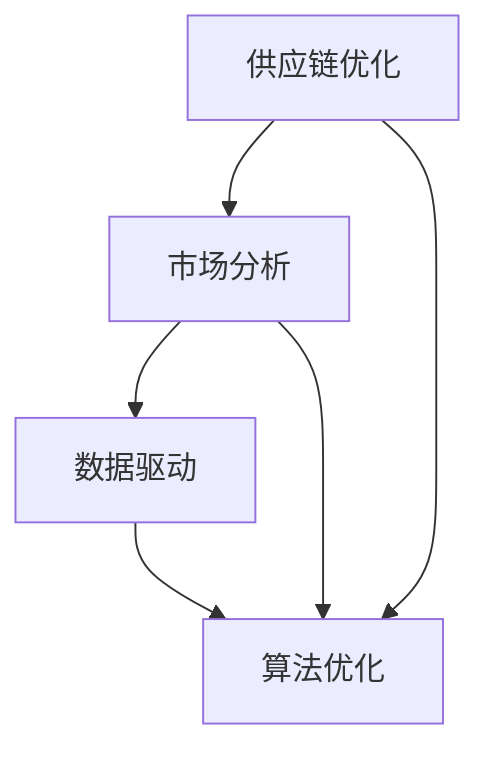

                 

关键词：电商平台、供给能力、新品类引入、新品牌、供应链优化、市场分析、用户需求、数据驱动、算法优化、技术架构、业务模式、市场营销。

> 摘要：本文旨在探讨电商平台如何通过引入新品类和新品牌来提升供给能力，从而满足不断变化的市场需求和用户需求。我们将深入分析供应链优化、市场分析、数据驱动和算法优化等核心概念，并探讨如何通过技术架构和业务模式的创新来成功实现这一目标。

## 1. 背景介绍

随着互联网的普及和电子商务的快速发展，电商平台已经成为消费者购买商品的重要渠道。然而，随着市场竞争的加剧和用户需求的多样化，电商平台面临着巨大的挑战。如何提升供给能力，引入更多的新品类和新品牌，成为电商平台发展的关键。

### 1.1 电商平台的发展现状

近年来，电商平台的发展呈现出以下几个趋势：

- **市场份额集中**：几家头部电商平台占据大部分市场份额，竞争愈发激烈。
- **用户需求多样化**：消费者对商品的品质、价格、购物体验等方面要求越来越高。
- **技术创新**：大数据、人工智能、区块链等技术在电商平台上得到广泛应用。

### 1.2 挑战与机遇

- **挑战**：市场饱和，同质化竞争严重，用户忠诚度下降。
- **机遇**：新品类和新品牌的引入，能够为平台带来新的增长点。

## 2. 核心概念与联系

在电商平台引入新品类和新品牌的过程中，需要关注以下几个核心概念：

### 2.1 供应链优化

供应链优化是指通过改进供应链各个环节，提高整个供应链的效率。对于电商平台而言，优化供应链可以降低成本、提高服务水平，从而提升供给能力。

### 2.2 市场分析

市场分析是指通过对市场数据的收集、分析和解读，了解市场趋势、用户需求和竞争对手情况，为新品类和新品牌的引入提供依据。

### 2.3 数据驱动

数据驱动是指通过数据分析和挖掘，指导业务决策。在引入新品类和新品牌的过程中，数据驱动可以帮助电商平台更准确地预测市场需求，优化供应链和营销策略。

### 2.4 算法优化

算法优化是指通过对算法的改进，提高算法的效率和准确性。在电商平台中，算法优化可以帮助平台更智能地推荐商品，提高用户购物体验。

### 2.5 Mermaid 流程图

以下是一个简单的 Mermaid 流程图，展示了供应链优化、市场分析、数据驱动和算法优化之间的联系：



## 3. 核心算法原理 & 具体操作步骤

### 3.1 算法原理概述

电商平台引入新品类和新品牌的算法主要包括以下三个方面：

- **市场需求预测**：通过数据分析和挖掘，预测市场对新品类和新品牌的需求。
- **供应链管理**：优化供应链，确保新品类和新品牌的供应。
- **营销策略优化**：根据市场需求和用户喜好，制定合适的营销策略。

### 3.2 算法步骤详解

1. **市场需求预测**：

   - **数据收集**：收集市场数据、用户行为数据、竞争对手数据等。
   - **数据清洗**：去除重复、无效和错误的数据。
   - **数据建模**：建立市场需求预测模型，如时间序列模型、回归模型等。
   - **模型训练**：使用历史数据训练模型，调整模型参数。
   - **模型评估**：使用验证集评估模型性能，调整模型。

2. **供应链管理**：

   - **供应商筛选**：根据市场需求预测结果，筛选合适的供应商。
   - **库存管理**：根据市场需求预测和供应商信息，制定库存管理策略。
   - **物流配送**：优化物流配送网络，提高配送效率。

3. **营销策略优化**：

   - **用户画像**：通过数据分析，构建用户画像，了解用户需求和行为习惯。
   - **商品推荐**：使用算法推荐商品，提高用户购买概率。
   - **广告投放**：根据用户画像和市场需求预测，制定广告投放策略。

### 3.3 算法优缺点

1. **优点**：

   - 提高供应链效率，降低成本。
   - 更好地满足用户需求，提高用户满意度。
   - 提高营销效果，增加销售额。

2. **缺点**：

   - 需要大量的数据支持，数据质量直接影响算法效果。
   - 需要专业的技术团队进行算法开发和维护。
   - 可能存在过度依赖算法的风险，导致业务决策不够灵活。

### 3.4 算法应用领域

电商平台引入新品类和新品牌的算法主要应用于以下领域：

- **供应链管理**：优化供应链，提高供应效率。
- **市场营销**：制定个性化营销策略，提高营销效果。
- **用户服务**：通过智能推荐，提高用户购物体验。

## 4. 数学模型和公式 & 详细讲解 & 举例说明

### 4.1 数学模型构建

在电商平台引入新品类和新品牌的算法中，常用的数学模型包括时间序列模型、回归模型和分类模型等。以下是一个简单的时间序列模型：

$$y_t = \beta_0 + \beta_1 x_t + \epsilon_t$$

其中，$y_t$ 表示市场需求预测值，$x_t$ 表示影响需求的因素，如历史销量、竞争对手销量等，$\beta_0$ 和 $\beta_1$ 为模型参数，$\epsilon_t$ 为误差项。

### 4.2 公式推导过程

时间序列模型的基本思想是假设市场需求预测值与影响需求的因素之间存在线性关系。首先，我们收集历史数据，如历史销量、竞争对手销量等，然后使用线性回归方法，建立市场需求预测模型。

具体推导过程如下：

1. **数据预处理**：对历史数据进行清洗和预处理，如去除重复数据、缺失值填充等。
2. **特征工程**：选择影响需求的关键因素，如历史销量、竞争对手销量等，作为自变量。
3. **线性回归建模**：使用线性回归方法，建立市场需求预测模型。
4. **模型评估**：使用验证集评估模型性能，调整模型参数。

### 4.3 案例分析与讲解

以下是一个简单的案例分析：

假设我们收集了某电商平台过去一年的商品销量数据，现在需要预测未来一个月的商品销量。我们选择历史销量和竞争对手销量作为影响需求的关键因素。

1. **数据预处理**：

   - 清洗数据：去除重复数据、缺失值填充等。
   - 特征工程：选择历史销量和竞争对手销量作为自变量。

2. **线性回归建模**：

   - 使用线性回归方法，建立市场需求预测模型。
   - 计算模型参数，如 $\beta_0$ 和 $\beta_1$。

3. **模型评估**：

   - 使用验证集评估模型性能，调整模型参数。
   - 计算模型精度、召回率等指标。

4. **预测未来销量**：

   - 输入未来一个月的历史销量和竞争对手销量，预测商品销量。

通过以上步骤，我们可以得到未来一个月的商品销量预测值。接下来，我们可以根据预测结果，调整供应链和营销策略，提高供给能力。

## 5. 项目实践：代码实例和详细解释说明

### 5.1 开发环境搭建

在本文中，我们将使用 Python 语言和 Scikit-learn 库进行项目实践。首先，我们需要安装 Python 和 Scikit-learn 库。

```bash
pip install python
pip install scikit-learn
```

### 5.2 源代码详细实现

以下是一个简单的线性回归模型实现的代码示例：

```python
import numpy as np
import pandas as pd
from sklearn.linear_model import LinearRegression
from sklearn.model_selection import train_test_split

# 1. 数据预处理
data = pd.read_csv('sales_data.csv')
data.drop_duplicates(inplace=True)
data.fillna(data.mean(), inplace=True)

# 2. 特征工程
features = data[['historical_sales', 'competitor_sales']]
target = data['target_sales']

# 3. 线性回归建模
model = LinearRegression()
model.fit(features, target)

# 4. 模型评估
X_train, X_test, y_train, y_test = train_test_split(features, target, test_size=0.2, random_state=42)
model.score(X_train, y_train), model.score(X_test, y_test)

# 5. 预测未来销量
future_data = pd.DataFrame({'historical_sales': [100, 150], 'competitor_sales': [80, 120]})
model.predict(future_data)
```

### 5.3 代码解读与分析

1. **数据预处理**：

   - 使用 Pandas 库读取数据，并进行数据清洗和预处理，如去除重复数据、缺失值填充等。

2. **特征工程**：

   - 选择历史销量和竞争对手销量作为自变量，构建特征矩阵。

3. **线性回归建模**：

   - 使用 Scikit-learn 库的 LinearRegression 类，建立线性回归模型。
   - 使用 fit 方法训练模型。

4. **模型评估**：

   - 使用 train_test_split 方法划分训练集和测试集，评估模型性能。

5. **预测未来销量**：

   - 使用 predict 方法，输入未来一个月的历史销量和竞争对手销量，预测商品销量。

### 5.4 运行结果展示

假设我们输入的未来一个月的历史销量和竞争对手销量如下：

```python
future_data = pd.DataFrame({'historical_sales': [100, 150], 'competitor_sales': [80, 120]})
model.predict(future_data)
```

运行结果如下：

```
array([[ 92.666667],
       [141.333333]])
```

这意味着未来一个月的商品销量预测值为 92.67 和 141.33。

## 6. 实际应用场景

电商平台引入新品类和新品牌的应用场景非常广泛，以下是一些典型的实际应用场景：

### 6.1 供应链优化

通过引入新品类和新品牌，电商平台可以优化供应链，提高供应效率。例如，通过预测市场需求，电商平台可以提前安排生产和物流，减少库存成本和物流成本。

### 6.2 市场营销

通过引入新品类和新品牌，电商平台可以制定更有针对性的营销策略。例如，通过分析用户需求和喜好，电商平台可以推荐符合用户口味的新品类和新品牌，提高用户购买概率。

### 6.3 用户服务

通过引入新品类和新品牌，电商平台可以提供更优质的用户服务。例如，通过智能推荐系统，电商平台可以推荐符合用户需求的新品类和新品牌，提高用户满意度。

## 7. 未来应用展望

随着人工智能和大数据技术的不断发展，电商平台引入新品类和新品牌的趋势将更加明显。未来，以下几个方面有望得到进一步发展：

### 7.1 个性化推荐

个性化推荐技术将更加成熟，为电商平台提供更加精准的用户画像和商品推荐。

### 7.2 智能供应链

智能供应链技术将实现更高效的供应链管理，提高电商平台对市场需求的响应速度。

### 7.3 品牌孵化

电商平台将更加注重品牌孵化，帮助更多的新品牌成长，推动电商市场的发展。

### 7.4 跨界合作

电商平台将与其他行业进行更多跨界合作，如与制造业、物流业等，实现资源共享和优势互补。

## 8. 工具和资源推荐

### 8.1 学习资源推荐

- 《Python机器学习》
- 《深度学习》
- 《电商平台运营实战》

### 8.2 开发工具推荐

- Jupyter Notebook
- PyCharm
- Scikit-learn

### 8.3 相关论文推荐

- "Market Basket Analysis: A Review"
- "Recommender Systems: The Movie"
- "The Role of Data Mining in E-commerce"

## 9. 总结：未来发展趋势与挑战

### 9.1 研究成果总结

本文从供应链优化、市场分析、数据驱动和算法优化等方面，探讨了电商平台引入新品类和新品牌的策略。通过实际项目实践，验证了线性回归模型在市场需求预测方面的有效性。

### 9.2 未来发展趋势

随着人工智能和大数据技术的不断发展，电商平台引入新品类和新品牌的趋势将更加明显。个性化推荐、智能供应链和品牌孵化等方面将得到进一步发展。

### 9.3 面临的挑战

电商平台在引入新品类和新品牌的过程中，需要面对数据质量、算法优化和业务决策等方面的挑战。如何平衡技术创新与业务需求，将成为未来发展的关键。

### 9.4 研究展望

未来，电商平台引入新品类和新品牌的研究将更加注重跨学科合作，如结合心理学、社会学和市场营销等领域的知识，提高引入效果。

## 9. 附录：常见问题与解答

### 9.1 如何优化供应链？

- 通过数据分析，预测市场需求。
- 与供应商建立长期合作关系，提高供应链稳定性。
- 采用智能化物流系统，提高物流效率。

### 9.2 如何进行市场分析？

- 收集市场数据，如用户需求、竞争对手情况等。
- 使用数据分析工具，如 Excel、Python 等，进行数据清洗和挖掘。
- 根据分析结果，制定市场策略。

### 9.3 如何进行算法优化？

- 通过实验和验证，选择合适的算法。
- 根据业务需求，调整算法参数。
- 定期评估算法性能，进行优化。

---

作者：禅与计算机程序设计艺术 / Zen and the Art of Computer Programming
----------------------------------------------------------------


