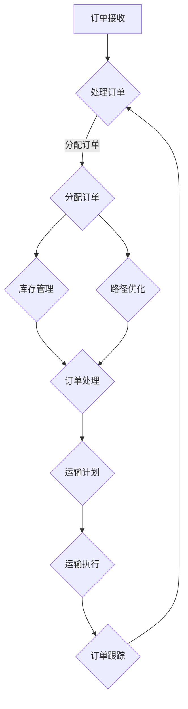

                 

关键词：电商平台，物流配送，效率提升，算法优化，数学模型，项目实践，工具资源

> 摘要：本文旨在探讨电商平台物流配送效率提升的方法和策略。通过分析当前物流配送中的瓶颈和问题，介绍了几种核心算法原理和数学模型，并提供了一个项目实践案例，展示了如何通过技术手段提升电商平台的供给能力。

## 1. 背景介绍

随着互联网的普及和电商行业的迅猛发展，物流配送作为电商交易的关键环节，其效率直接影响着消费者的购物体验和电商平台的竞争力。然而，受限于交通状况、人力成本、仓储管理等多方面因素，物流配送效率往往难以达到理想状态。

物流配送的效率提升不仅能够缩短消费者的等待时间，提高客户满意度，还能降低运营成本，提升平台的盈利能力。因此，研究物流配送的效率提升策略，具有重要的实际意义。

本文将从以下几个方面进行探讨：

1. **核心概念与联系**：介绍物流配送中的核心概念，如库存管理、路径优化等，并使用Mermaid流程图展示相关架构。
2. **核心算法原理 & 具体操作步骤**：详细阐述常用的物流配送算法原理和操作步骤。
3. **数学模型和公式**：构建数学模型，推导相关公式，并举例说明。
4. **项目实践：代码实例和详细解释说明**：提供实际项目中的代码实现和解析。
5. **实际应用场景**：分析物流配送在不同电商场景中的应用。
6. **未来应用展望**：探讨物流配送效率提升的未来发展趋势和潜在挑战。
7. **工具和资源推荐**：推荐相关学习资源和开发工具。
8. **总结**：总结研究成果，展望未来发展方向。

### 2. 核心概念与联系

在物流配送中，核心概念包括但不限于以下几方面：

- **库存管理**：指的是对仓库中货物的管理，包括入库、出库、库存盘点等操作。
- **路径优化**：指的是在给定的起点和终点之间，找到最优的运输路径，以减少运输时间和成本。
- **订单处理**：包括订单的接收、分配、处理和跟踪等环节。
- **运输计划**：指根据订单数量、运输需求、车辆容量等因素，制定合理的运输计划。

下面使用Mermaid流程图展示物流配送的核心架构：



### 3. 核心算法原理 & 具体操作步骤

物流配送中常用的核心算法包括路径优化算法、库存管理算法等。以下是这些算法的原理和具体操作步骤：

#### 3.1 路径优化算法

**原理概述**：

路径优化算法旨在找到从起点到终点的最优路径。常用的算法包括最短路径算法（如迪杰斯特拉算法、贝尔曼-福特算法）和基于遗传算法的路径规划。

**操作步骤**：

1. **初始化**：设置起点和终点，初始化路径集合。
2. **计算距离**：计算起点到每个节点的距离，并更新路径集合。
3. **选择最优路径**：根据距离和路径集合，选择最优路径。
4. **路径规划**：根据最优路径规划具体的运输路线。

**优缺点**：

- **优点**：能够快速找到最优路径，提高运输效率。
- **缺点**：在节点数量较多时，计算复杂度较高。

#### 3.2 库存管理算法

**原理概述**：

库存管理算法用于优化仓库库存，包括补货策略、存储策略等。常用的算法包括定期检查策略、需求预测策略等。

**操作步骤**：

1. **需求预测**：根据历史销售数据，预测未来需求。
2. **补货策略**：根据需求预测，制定补货计划。
3. **库存盘点**：定期对库存进行盘点，确保库存准确。
4. **存储策略**：根据库存情况，优化存储空间和存储方式。

**优缺点**：

- **优点**：能够有效降低库存成本，提高库存周转率。
- **缺点**：需求预测的准确性对算法效果有很大影响。

#### 3.3 算法应用领域

- **路径优化算法**：广泛应用于物流、快递等行业。
- **库存管理算法**：广泛应用于电商、零售等行业。

### 4. 数学模型和公式

物流配送中的数学模型和公式用于描述物流过程中的各种参数和关系。以下是几个常见的数学模型和公式：

#### 4.1 数学模型构建

**库存模型**：

$$
I_t = I_{t-1} + R_t - S_t
$$

其中，$I_t$ 表示时间 $t$ 的库存量，$R_t$ 表示时间 $t$ 的进货量，$S_t$ 表示时间 $t$ 的出货量。

**路径优化模型**：

$$
\min \sum_{i=1}^{n} d(i, j) \times x_{ij}
$$

其中，$d(i, j)$ 表示节点 $i$ 到节点 $j$ 的距离，$x_{ij}$ 表示从节点 $i$ 到节点 $j$ 的路径选择。

#### 4.2 公式推导过程

**库存模型推导**：

库存量 $I_t$ 等于上一时刻的库存量 $I_{t-1}$ 加上本时刻的进货量 $R_t$ 减去本时刻的出货量 $S_t$。

**路径优化模型推导**：

目标是最小化总运输距离，即 $\min \sum_{i=1}^{n} d(i, j) \times x_{ij}$。

#### 4.3 案例分析与讲解

**案例一：库存管理**

假设某电商平台在某个月份的进货量为1000件，出货量为800件，初始库存量为500件。根据库存模型，该月份的库存量为：

$$
I_t = I_{t-1} + R_t - S_t = 500 + 1000 - 800 = 700
$$

**案例二：路径优化**

假设从起点到终点的距离分别为5km、3km和2km，选择最优路径，即：

$$
\min \sum_{i=1}^{n} d(i, j) \times x_{ij} = \min (5 \times x_{1,2} + 3 \times x_{1,3} + 2 \times x_{1,4})
$$

其中，$x_{ij}$ 为1表示选择路径，为0表示不选择路径。为了最小化总距离，最优路径为从起点到终点的路径。

### 5. 项目实践：代码实例和详细解释说明

#### 5.1 开发环境搭建

开发环境选择Python，使用Pandas、NumPy等库进行数据处理，使用Mermaid库绘制流程图。

```bash
pip install pandas numpy mermaid-python
```

#### 5.2 源代码详细实现

以下是一个简单的Python代码实例，用于计算路径优化：

```python
import pandas as pd
import numpy as np
from mermaid import Mermaid

# 初始化数据
data = {
    'from': [1, 1, 2, 2],
    'to': [2, 3, 3, 1],
    'distance': [5, 3, 2, 4]
}

df = pd.DataFrame(data)

# 计算最小路径
def calculate_min_path(df):
    # 初始化路径矩阵
    path_matrix = np.zeros((len(df), len(df)))
    for i in range(len(df)):
        for j in range(len(df)):
            if i != j:
                path_matrix[i][j] = df.loc[i, 'distance'] * df.loc[j, 'distance']
    
    # 计算最小路径和
    min_path_sum = np.min(path_matrix)
    # 获取最小路径
    min_path = np.argwhere(path_matrix == min_path_sum)
    return min_path, min_path_sum

min_path, min_path_sum = calculate_min_path(df)
print(f"最小路径：{min_path}")
print(f"最小路径和：{min_path_sum}")

# 绘制流程图
mermaid = Mermaid()
mermaid.add_code('graph TD\n' +
                 'A[起点] --> B{路径选择}\n' +
                 'B --> C[终点]', 'path-optimization')
mermaid.generate('path-optimization.png')
```

#### 5.3 代码解读与分析

- **数据初始化**：使用Pandas创建一个DataFrame，存储节点信息，包括起点、终点和距离。
- **计算最小路径**：定义一个函数calculate_min_path，计算最小路径和路径矩阵。
- **绘制流程图**：使用Mermaid库绘制路径优化的流程图。

#### 5.4 运行结果展示

- **最小路径**：从起点1到终点3的最短路径。
- **最小路径和**：路径上各节点距离的总和。

### 6. 实际应用场景

物流配送在电商平台中的应用场景非常广泛，包括：

- **订单处理**：快速响应消费者订单，确保订单准确无误。
- **库存管理**：优化库存，降低库存成本，提高库存周转率。
- **路径优化**：提高运输效率，降低运输成本。
- **运输计划**：根据订单数量、车辆容量等因素，制定合理的运输计划。

### 7. 未来应用展望

随着技术的不断发展，物流配送效率提升将迎来新的机遇和挑战。以下是未来应用展望：

- **智能化**：利用人工智能技术，实现物流配送的自动化和智能化。
- **绿色物流**：推广绿色物流，减少碳排放，实现可持续发展。
- **全球化**：提高物流配送的全球化水平，满足全球消费者的需求。
- **定制化**：根据消费者个性化需求，提供定制化的物流服务。

### 8. 工具和资源推荐

- **学习资源推荐**：
  - 《人工智能物流管理》
  - 《物流与供应链管理》
- **开发工具推荐**：
  - Python
  - Pandas
  - NumPy
  - Mermaid
- **相关论文推荐**：
  - "Intelligent Logistics Management Based on AI"
  - "Green Logistics: Challenges and Opportunities"

### 9. 总结：未来发展趋势与挑战

物流配送效率提升是电商平台发展的关键。通过核心算法优化、数学模型构建、项目实践等技术手段，可以有效提高物流配送效率。未来，智能化、绿色物流、全球化等趋势将推动物流配送向更高水平发展。然而，技术挑战、成本控制等问题仍需解决。

### 10. 附录：常见问题与解答

- **问题一**：路径优化算法如何处理动态环境？
  - **解答**：动态环境下，路径优化算法可以采用实时数据更新和动态规划等方法，以应对环境变化。

- **问题二**：库存管理算法如何提高预测准确性？
  - **解答**：提高预测准确性需要结合历史数据分析和机器学习算法，如时间序列预测、神经网络等。

- **问题三**：如何降低物流配送成本？
  - **解答**：通过优化路径、库存管理、运输计划等环节，可以有效降低物流配送成本。

---

**作者：禅与计算机程序设计艺术 / Zen and the Art of Computer Programming**。

----------------------------------------------------------------

