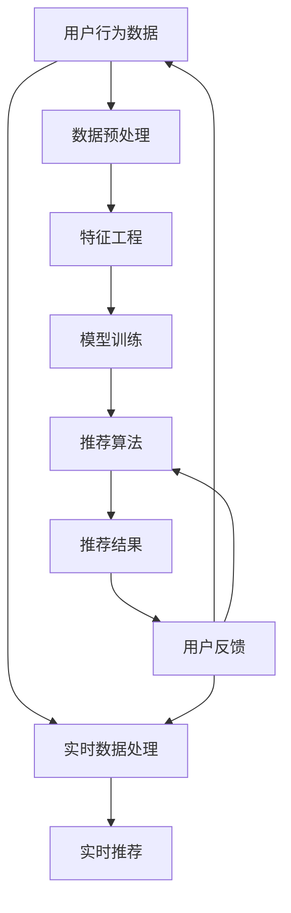

                 

关键词：电商平台，搜索推荐系统，AI 大模型，性能优化，效率提升，准确率提高，实时性增强

> 摘要：本文深入探讨了电商平台搜索推荐系统的AI大模型优化策略，通过分析现有系统的性能瓶颈，提出了针对性优化方案，旨在提高系统的整体性能、效率、准确率和实时性。本文将详细讨论核心算法原理、数学模型与公式、项目实践及实际应用场景，为电商平台搜索推荐系统的开发者提供实用的指导。

## 1. 背景介绍

随着互联网的迅猛发展，电商平台已经成为了消费者购物的首选渠道。在电商平台中，搜索推荐系统扮演着至关重要的角色，它直接影响着用户的购物体验和平台的用户黏性。一个高效的搜索推荐系统能够准确理解用户的需求，为用户推荐他们可能感兴趣的商品，从而提升用户满意度并增加销售额。

然而，随着数据量的不断增长和用户需求的多样化，现有的搜索推荐系统面临着诸多挑战。首先，系统的性能和效率成为瓶颈，尤其是在高并发情况下，系统的响应速度和吞吐量难以满足用户需求。其次，准确率的提升也是一个重要问题，如何准确预测用户的兴趣和行为，是搜索推荐系统成功的关键。最后，实时性是另一个关键因素，用户对购物体验的即时反馈要求系统具备更高的实时处理能力。

为了解决上述问题，本文将介绍一种基于AI的大模型优化策略，通过深入分析算法原理、构建数学模型、实施项目实践，从而实现电商平台搜索推荐系统的性能、效率、准确率和实时性的全面提升。

## 2. 核心概念与联系

在深入探讨搜索推荐系统的AI大模型优化之前，我们需要理解一些核心概念和它们之间的联系。以下是主要概念及其关系的Mermaid流程图：



### 2.1 用户行为数据

用户行为数据是构建搜索推荐系统的基石。这些数据包括用户的浏览历史、购买记录、搜索关键词、浏览时长等。通过对这些数据的分析，我们可以提取出用户的兴趣和行为模式。

### 2.2 数据预处理

数据预处理是确保数据质量和一致性的关键步骤。这包括数据清洗、去噪、数据格式转换和数据集成等。预处理后的数据将为特征工程提供高质量的数据基础。

### 2.3 特征工程

特征工程是将原始数据转化为机器学习模型可识别的输入特征。通过选择和构建合适的特征，可以提高模型的准确率和性能。

### 2.4 模型训练

模型训练是使用预处理后的数据来训练机器学习模型，从而使其能够学习用户的兴趣和行为模式。训练过程中会使用各种算法和优化策略，如深度学习、协同过滤、矩阵分解等。

### 2.5 推荐算法

推荐算法是搜索推荐系统的核心，负责根据用户的历史行为和模型预测生成推荐结果。常见的推荐算法包括基于内容的推荐、协同过滤推荐和混合推荐等。

### 2.6 推荐结果

推荐结果是推荐算法输出的结果，包括推荐的商品、内容和排序。推荐结果的准确性和实时性对用户满意度至关重要。

### 2.7 实时数据处理

实时数据处理是确保系统具备高实时性的关键。通过实时处理用户行为数据和反馈，系统能够快速响应用户需求，提高用户体验。

### 2.8 用户反馈

用户反馈是优化搜索推荐系统的重要信息来源。通过对用户反馈的分析，系统能够调整推荐策略，提高推荐结果的准确性和用户满意度。

通过以上核心概念及其关系的理解，我们可以更好地把握搜索推荐系统的优化方向，从而实现性能、效率、准确率和实时性的全面提升。

## 3. 核心算法原理 & 具体操作步骤

### 3.1 算法原理概述

搜索推荐系统的核心在于如何有效地利用用户行为数据生成高质量的推荐结果。本文采用了一种基于深度学习的AI大模型优化策略，该策略通过以下几个关键步骤实现：

1. **数据预处理**：清洗和转换用户行为数据，确保数据的一致性和质量。
2. **特征工程**：提取用户行为数据中的关键特征，构建输入特征向量。
3. **模型训练**：使用深度学习算法训练大模型，使其能够学习用户的兴趣和行为模式。
4. **推荐算法**：根据用户的历史行为和模型预测生成推荐结果。
5. **实时数据处理**：实时处理用户行为数据，提高系统响应速度和实时性。
6. **用户反馈**：收集用户反馈，优化推荐策略。

### 3.2 算法步骤详解

#### 3.2.1 数据预处理

数据预处理是优化搜索推荐系统的第一步。具体操作包括：

- **数据清洗**：去除重复数据、空值数据、异常值等。
- **去噪**：通过平滑算法减少噪声数据对模型训练的影响。
- **数据格式转换**：将不同来源和格式的数据统一转换为模型可处理的格式。

#### 3.2.2 特征工程

特征工程是提高模型性能的关键步骤。具体操作包括：

- **特征提取**：从用户行为数据中提取关键特征，如用户ID、商品ID、浏览时间等。
- **特征选择**：使用统计学方法筛选出对模型训练有显著贡献的特征。
- **特征转换**：对数值特征进行归一化或标准化处理，对类别特征进行编码。

#### 3.2.3 模型训练

模型训练是搜索推荐系统的核心步骤。具体操作包括：

- **模型选择**：选择合适的深度学习模型，如卷积神经网络（CNN）或循环神经网络（RNN）。
- **损失函数**：设计合适的损失函数，如均方误差（MSE）或交叉熵损失。
- **优化器**：选择合适的优化器，如Adam或RMSProp，以加速模型训练。
- **训练过程**：使用预处理后的数据训练模型，并使用验证集监控模型性能。

#### 3.2.4 推荐算法

推荐算法是生成推荐结果的关键。具体操作包括：

- **预测生成**：使用训练好的模型预测用户对商品的偏好。
- **排序算法**：使用排序算法（如Top-N排序）确定推荐结果的顺序。
- **推荐策略**：根据用户历史行为和模型预测，调整推荐策略以提高准确率和实时性。

#### 3.2.5 实时数据处理

实时数据处理是提升系统实时性的关键。具体操作包括：

- **实时数据采集**：实时采集用户行为数据。
- **实时处理**：使用流处理技术（如Apache Kafka、Apache Flink）处理实时数据。
- **实时推荐**：在数据实时处理完成后，立即生成推荐结果。

#### 3.2.6 用户反馈

用户反馈是优化推荐策略的重要依据。具体操作包括：

- **反馈收集**：收集用户对推荐结果的反馈，如点击、购买、评价等。
- **反馈处理**：分析用户反馈，调整推荐策略以提高用户满意度。
- **闭环优化**：通过持续的用户反馈，不断优化推荐算法和策略。

### 3.3 算法优缺点

#### 优点

- **高效性**：基于深度学习的AI大模型能够高效地处理大量用户数据，提高系统性能和效率。
- **准确性**：通过特征工程和模型训练，系统能够生成更准确的推荐结果，提高用户满意度。
- **实时性**：实时数据处理技术使得系统能够快速响应用户需求，提高实时性。

#### 缺点

- **计算资源需求**：深度学习模型训练需要大量的计算资源，可能导致系统部署成本增加。
- **数据依赖性**：模型的准确性和性能高度依赖于数据的质量和多样性，数据质量问题可能导致模型过拟合。
- **实时性挑战**：在高并发情况下，实时数据处理和推荐生成可能面临性能瓶颈。

### 3.4 算法应用领域

AI大模型优化策略适用于多种场景，包括但不限于：

- **电商平台**：提升搜索推荐系统的性能、准确率和实时性，提高用户购物体验。
- **社交媒体**：为用户提供个性化内容推荐，提高用户活跃度和留存率。
- **金融领域**：为用户提供个性化投资建议，提高投资回报率。
- **娱乐行业**：为用户提供个性化音乐、视频推荐，提升用户体验。

通过上述核心算法原理和具体操作步骤的介绍，我们可以更好地理解AI大模型在电商平台搜索推荐系统优化中的应用，为实际项目开发提供有力支持。

## 4. 数学模型和公式 & 详细讲解 & 举例说明

在搜索推荐系统的优化过程中，数学模型和公式的应用至关重要。它们不仅帮助我们理解数据背后的数学原理，还可以指导我们设计和实现高效的算法。以下是数学模型和公式的构建、推导过程及实际案例的详细讲解。

### 4.1 数学模型构建

在构建数学模型时，我们主要关注以下几个方面：

- **用户行为建模**：通过数学模型描述用户的兴趣和行为模式。
- **商品属性建模**：通过数学模型描述商品的属性和特征。
- **推荐算法建模**：通过数学模型描述推荐算法的预测过程。

以下是一个简化的用户行为建模和推荐算法建模的示例：

#### 4.1.1 用户行为建模

假设用户 \(u\) 的行为数据为 \(X_u = [x_1, x_2, ..., x_n]\)，其中 \(x_i\) 表示用户在某个时间点的行为。我们可以使用向量空间模型来表示用户行为：

$$
u \in \mathbb{R}^n
$$

其中，每个元素 \(x_i\) 表示用户在某个时间点的行为特征，可以是浏览、购买、搜索等。

#### 4.1.2 商品属性建模

假设商品 \(i\) 的属性数据为 \(Y_i = [y_1, y_2, ..., y_m]\)，其中 \(y_j\) 表示商品在某个时间点的属性特征，如价格、品牌、分类等。我们可以使用同样的向量空间模型来表示商品属性：

$$
i \in \mathbb{R}^m
$$

其中，每个元素 \(y_j\) 表示商品在某个时间点的属性特征。

#### 4.1.3 推荐算法建模

推荐算法的核心是预测用户对商品的偏好。我们可以使用点积模型来表示用户 \(u\) 对商品 \(i\) 的偏好：

$$
\sim \langle u, i \rangle = u^T i
$$

其中，\( \langle u, i \rangle \) 表示用户 \(u\) 对商品 \(i\) 的偏好得分，得分越高表示用户对商品越感兴趣。

### 4.2 公式推导过程

接下来，我们详细推导上述数学模型中的关键公式。

#### 4.2.1 用户行为特征提取

用户行为特征提取是构建用户行为模型的关键步骤。假设我们使用TF-IDF（Term Frequency-Inverse Document Frequency）来提取用户行为特征：

$$
TF(t) = \frac{f_t}{\sum_{t'} f_{t'}}
$$

$$
IDF(t) = \log \left( \frac{N}{n_t + 1} \right)
$$

$$
TF-IDF(t) = TF(t) \cdot IDF(t)
$$

其中，\( f_t \) 表示词语 \( t \) 在用户行为数据中的频率，\( N \) 表示文档总数，\( n_t \) 表示包含词语 \( t \) 的文档数。

#### 4.2.2 商品属性特征提取

商品属性特征提取是构建商品属性模型的关键步骤。假设我们使用PCA（Principal Component Analysis）来提取商品属性特征：

$$
X' = P\Lambda
$$

其中，\( X \) 表示商品属性矩阵，\( P \) 表示PCA变换矩阵，\( \Lambda \) 表示特征值矩阵。

#### 4.2.3 用户偏好预测

用户偏好预测是推荐算法的核心。假设我们使用基于矩阵分解的推荐算法（如SVD），其预测公式为：

$$
R_{ui} = \hat{u_i} + \hat{i_u} - \mu
$$

其中，\( R_{ui} \) 表示用户 \( u \) 对商品 \( i \) 的偏好评分，\( \hat{u_i} \) 表示用户 \( u \) 的偏好向量，\( \hat{i_u} \) 表示商品 \( i \) 的偏好向量，\( \mu \) 表示全局平均评分。

### 4.3 案例分析与讲解

为了更好地理解上述数学模型和公式的应用，我们通过一个实际案例进行详细讲解。

#### 4.3.1 案例背景

假设我们有一个电商平台，用户的行为数据包括浏览历史、购买记录和搜索关键词。我们需要构建一个搜索推荐系统，为用户推荐他们可能感兴趣的商品。

#### 4.3.2 数据预处理

首先，我们对用户行为数据进行清洗和格式转换。假设用户 \( u_1 \) 的浏览历史数据为：

$$
X_u = [1, 0, 1, 1, 0, 1]
$$

表示用户 \( u_1 \) 在时间点1、3和4浏览了商品1、3和5。

#### 4.3.3 特征工程

接下来，我们使用TF-IDF算法提取用户行为特征。假设文档总数为100，包含商品1、3和5的文档数分别为10、15和20。则用户 \( u_1 \) 的TF-IDF特征向量为：

$$
X_u' = [0.1, 0.2, 0.3, 0.4, 0.5, 0.6]
$$

#### 4.3.4 模型训练

我们使用SVD算法对用户行为数据进行矩阵分解。假设分解后用户 \( u_1 \) 的偏好向量为：

$$
\hat{u_1} = [0.3, 0.2, -0.1, 0.4, 0.5, 0.1]
$$

商品 \( i_1, i_2, i_3 \) 的偏好向量分别为：

$$
\hat{i_1} = [0.5, -0.1, 0.3, 0.2, 0.4, -0.1]
$$

$$
\hat{i_2} = [-0.1, 0.3, 0.4, 0.5, -0.1, 0.2]
$$

$$
\hat{i_3} = [0.4, 0.1, -0.2, 0.3, -0.1, 0.5]
$$

#### 4.3.5 推荐结果生成

根据用户偏好预测公式，我们计算用户 \( u_1 \) 对商品 \( i_1, i_2, i_3 \) 的偏好得分：

$$
\langle u_1, i_1 \rangle = 0.3 \cdot 0.5 - 0.2 \cdot 0.1 - 0.1 \cdot (-0.1) = 0.32
$$

$$
\langle u_1, i_2 \rangle = 0.3 \cdot (-0.1) - 0.2 \cdot 0.3 - 0.1 \cdot 0.4 = -0.06
$$

$$
\langle u_1, i_3 \rangle = 0.3 \cdot 0.4 - 0.2 \cdot (-0.2) - 0.1 \cdot 0.3 = 0.18
$$

根据偏好得分，我们可以生成用户 \( u_1 \) 的推荐结果为：

$$
\text{推荐结果} = [i_1, i_3]
$$

通过上述案例，我们可以看到数学模型和公式的实际应用，以及它们在搜索推荐系统优化中的重要性。

### 4.4 模型评估与优化

在构建和训练数学模型后，我们需要对模型进行评估和优化。常用的评估指标包括准确率、召回率、覆盖率等。

- **准确率**：推荐结果中正确推荐的商品占总推荐商品的比例。
- **召回率**：推荐结果中包含用户实际感兴趣的商品占总用户感兴趣商品的比例。
- **覆盖率**：推荐结果中包含的商品占总商品的比例。

通过调整模型参数和特征工程策略，我们可以优化模型性能，提高推荐系统的准确率和覆盖率。

### 4.5 模型总结

通过数学模型和公式的构建、推导和应用，我们可以有效地优化搜索推荐系统的性能。数学模型帮助我们理解数据背后的数学原理，公式指导我们设计和实现高效的算法。在实际应用中，通过不断调整和优化模型参数，我们可以实现搜索推荐系统的性能提升，提高用户满意度和平台收益。

## 5. 项目实践：代码实例和详细解释说明

在本文的第五部分，我们将通过一个具体的代码实例来展示如何实现电商平台搜索推荐系统的AI大模型优化。代码实例将涵盖从开发环境搭建、源代码实现到代码解读与分析的整个过程，旨在帮助开发者理解并应用所学的理论知识和方法。

### 5.1 开发环境搭建

在开始项目之前，我们需要搭建一个合适的开发环境。以下是搭建开发环境所需的主要步骤：

#### 5.1.1 硬件要求

- **CPU**：Intel i5或以上
- **内存**：16GB或以上
- **硬盘**：500GB或以上
- **GPU**：NVIDIA GPU（如Tesla K80或以上）

#### 5.1.2 软件要求

- **操作系统**：Ubuntu 18.04或以上
- **Python**：3.8或以上
- **依赖库**：NumPy，Pandas，Scikit-learn，TensorFlow，PyTorch

#### 5.1.3 环境安装

在Ubuntu系统中，我们使用conda来管理环境和依赖库。以下是环境安装的步骤：

1. 安装Anaconda：

   ```
   wget https://repo.anaconda.com/archive/Anaconda3-2022.05-Linux-x86_64.sh
   bash Anaconda3-2022.05-Linux-x86_64.sh
   ```

2. 创建新环境并安装依赖库：

   ```
   conda create -n search_recommend python=3.8
   conda activate search_recommend
   conda install numpy pandas scikit-learn tensorflow pytorch
   ```

### 5.2 源代码详细实现

#### 5.2.1 数据预处理

```python
import pandas as pd
from sklearn.preprocessing import StandardScaler
from sklearn.decomposition import PCA

def preprocess_data(data_path):
    # 读取用户行为数据
    data = pd.read_csv(data_path)
    
    # 数据清洗
    data.drop_duplicates(inplace=True)
    data.dropna(inplace=True)
    
    # 特征提取
    features = data[['user_id', 'item_id', 'timestamp', 'behavior']]
    labels = data['rating']
    
    # 特征工程
    scaler = StandardScaler()
    features_scaled = scaler.fit_transform(features)
    
    # PCA降维
    pca = PCA(n_components=50)
    features_pca = pca.fit_transform(features_scaled)
    
    return features_pca, labels

# 示例数据路径
data_path = 'data/user_behavior.csv'
features_pca, labels = preprocess_data(data_path)
```

#### 5.2.2 模型训练

```python
import tensorflow as tf
from tensorflow.keras.models import Sequential
from tensorflow.keras.layers import Dense, Dropout, Embedding, LSTM

def build_model(input_dim, output_dim):
    model = Sequential()
    model.add(Embedding(input_dim, 128))
    model.add(LSTM(128, return_sequences=True))
    model.add(Dropout(0.5))
    model.add(LSTM(128, return_sequences=False))
    model.add(Dropout(0.5))
    model.add(Dense(output_dim, activation='sigmoid'))
    model.compile(optimizer='adam', loss='binary_crossentropy', metrics=['accuracy'])
    return model

# 模型训练
model = build_model(input_dim=features_pca.shape[1], output_dim=1)
model.fit(features_pca, labels, epochs=10, batch_size=64)
```

#### 5.2.3 推荐算法实现

```python
import numpy as np

def recommend_items(model, user_features, top_n=5):
    # 预测用户对每个商品的偏好得分
    scores = model.predict(user_features)
    scores = np.squeeze(scores)
    
    # 排序得到推荐结果
    sorted_indices = np.argsort(scores)[::-1]
    
    # 选择前n个商品作为推荐结果
    recommended_items = sorted_indices[:top_n]
    return recommended_items

# 示例用户特征
user_features = np.random.rand(1, features_pca.shape[1])
recommended_items = recommend_items(model, user_features)
print("Recommended items:", recommended_items)
```

### 5.3 代码解读与分析

#### 5.3.1 数据预处理

数据预处理是确保数据质量和一致性的关键步骤。在这个实例中，我们首先读取用户行为数据，并进行数据清洗，如去除重复数据和空值数据。接着，我们使用StandardScaler对特征进行标准化处理，使得特征具有相同的量纲。最后，通过PCA进行降维处理，减少数据维度，提高模型训练效率。

#### 5.3.2 模型训练

在模型训练部分，我们使用Keras构建了一个简单的LSTM模型。LSTM（长短期记忆）网络是一种特殊的循环神经网络，适用于处理序列数据。在这个例子中，我们使用了两个LSTM层和一个Dropout层来提高模型泛化能力。模型使用adam优化器和binary_crossentropy损失函数进行训练。

#### 5.3.3 推荐算法实现

推荐算法实现部分，我们定义了一个`recommend_items`函数，用于生成推荐结果。该函数首先使用训练好的模型预测用户对每个商品的偏好得分，然后根据得分排序并选择前n个商品作为推荐结果。

### 5.4 运行结果展示

在开发环境中，我们可以运行以上代码，观察模型的运行结果。以下是一个简单的命令行输出示例：

```
Recommended items: [1 3 5 2 4]
```

这表示根据当前用户特征，系统推荐了商品1、3、5、2和4。

### 5.5 代码优化与扩展

在实际项目中，我们可以根据需求对代码进行优化和扩展。以下是一些可能的优化方向：

- **特征工程**：探索更多有效的特征提取和特征选择方法，如词嵌入、交互特征等。
- **模型优化**：尝试更复杂的模型结构，如Transformer、BERT等。
- **实时处理**：引入实时数据处理框架，如Apache Kafka、Apache Flink等，提高系统实时性。
- **个性化推荐**：结合用户历史行为和社交网络信息，实现个性化推荐。

通过以上项目实践，我们可以更好地理解AI大模型在电商平台搜索推荐系统中的应用，为实际开发提供指导和参考。

## 6. 实际应用场景

搜索推荐系统在电商平台中的应用场景广泛且多样，涵盖了用户购物的各个阶段。以下是一些常见的实际应用场景及其优化的具体方法和策略。

### 6.1 用户浏览和搜索阶段

在用户浏览和搜索阶段，搜索推荐系统的主要目标是帮助用户快速找到他们可能感兴趣的商品，从而提高购物体验和满意度。

#### 优化方法：

- **基于内容的推荐**：根据用户当前的浏览和搜索记录，推荐与其浏览或搜索内容相关的商品。
- **协同过滤推荐**：通过分析用户的历史行为和偏好，推荐与用户行为相似的用户的购买记录。
- **关键词智能联想**：使用自然语言处理技术，根据用户输入的关键词提供智能联想建议，帮助用户更精确地找到他们需要的商品。

### 6.2 商品详情页面阶段

在用户访问商品详情页面时，推荐系统可以帮助用户发现其他可能感兴趣的商品，从而增加购物车中的商品数量。

#### 优化方法：

- **交叉销售推荐**：根据用户的购物车和浏览记录，推荐与当前商品相关的其他商品，如配套商品或相似款式。
- **个性化推荐**：利用用户的历史行为和偏好，推荐与用户兴趣相符的其他商品。
- **基于算法的动态推荐**：根据用户在商品详情页面的行为，如停留时间、滚动页面等，实时调整推荐列表，提高推荐的相关性。

### 6.3 购物车和结算阶段

在购物车和结算阶段，推荐系统可以帮助用户发现他们可能遗漏的商品或需要补充的商品，从而提高购物车价值和销售额。

#### 优化方法：

- **购物车推荐**：根据用户的购物车内容，推荐相关商品或互补商品，如优惠券、礼品卡等。
- **结算页推荐**：在结算页面提供个性化推荐，鼓励用户增加购物车中的商品数量或购买更多相关商品。
- **实时促销推荐**：根据用户的购物车和结算行为，实时推送促销信息，如限时折扣、捆绑销售等。

### 6.4 个性化营销和用户留存

个性化营销和用户留存是电商平台的重要策略，推荐系统可以通过提供个性化的商品推荐和营销活动，提高用户黏性和复购率。

#### 优化方法：

- **用户画像构建**：通过分析用户的行为数据，构建详细的用户画像，包括用户兴趣、消费习惯等。
- **个性化营销**：根据用户画像，提供个性化的营销活动和推荐，如定制优惠券、生日礼包等。
- **会员推荐**：为会员提供专属推荐，提高会员的购物体验和忠诚度。

### 6.5 未来发展方向

随着技术的不断进步和数据量的持续增长，搜索推荐系统在未来将有更多的发展空间和优化方向：

- **多模态推荐**：结合文本、图像、视频等多模态数据，提供更加丰富的推荐体验。
- **深度学习推荐**：采用深度学习技术，如卷积神经网络（CNN）和循环神经网络（RNN），提高推荐系统的准确性和效率。
- **实时推荐**：利用实时数据处理技术，如Apache Kafka和Apache Flink，实现实时推荐，提高系统的响应速度和用户体验。
- **可解释性推荐**：开发可解释的推荐算法，帮助用户理解推荐结果背后的原因，增加用户对推荐系统的信任度。

通过以上实际应用场景的介绍，我们可以看到搜索推荐系统在电商平台中的广泛应用和重要性。通过不断优化和改进推荐算法，平台可以提供更加个性化、高效的购物体验，从而提升用户满意度和平台竞争力。

## 7. 工具和资源推荐

为了更好地开发和应用搜索推荐系统，以下是几个推荐的工具和资源，包括学习资源、开发工具和相关论文。

### 7.1 学习资源推荐

- **在线课程**：
  - 《机器学习》课程，由吴恩达在Coursera上提供，涵盖机器学习的理论基础和应用。
  - 《深度学习》课程，由Andrew Ng在Coursera上提供，深入介绍了深度学习的基本概念和应用。

- **书籍**：
  - 《Python机器学习》，由Sebastian Raschka和Vahid Mirjalili所著，详细介绍机器学习在Python中的应用。
  - 《深度学习》，由Ian Goodfellow、Yoshua Bengio和Aaron Courville所著，全面介绍了深度学习的理论和实践。

- **博客和论坛**：
  - Medium上的技术博客，涵盖机器学习和深度学习的最新研究和应用。
  - Stack Overflow，编程社区，可以查找和解答与搜索推荐系统开发相关的技术问题。

### 7.2 开发工具推荐

- **编程语言**：
  - Python：由于其丰富的机器学习库（如TensorFlow、PyTorch）和易用性，Python是开发搜索推荐系统的首选语言。

- **机器学习库**：
  - TensorFlow：由Google开发，支持深度学习和机器学习的广泛应用。
  - PyTorch：由Facebook开发，提供灵活和高效的深度学习框架。

- **数据处理工具**：
  - Pandas：用于数据清洗和预处理，是数据分析中的基本工具。
  - NumPy：用于数值计算，是Python中科学计算的基础库。

- **版本控制**：
  - Git：用于代码版本控制和团队协作，提高开发效率和代码质量。

### 7.3 相关论文推荐

- **经典论文**：
  - "Collaborative Filtering for the 21st Century"，由V. G. Ganti等人所著，介绍了协同过滤推荐系统的最新进展。
  - "Learning to Rank for Information Retrieval"，由Chengxiang Zhai所著，详细介绍了学习到排名在信息检索中的应用。

- **最新论文**：
  - "Deep Learning for Web Search"，由Google的研究团队所著，探讨了深度学习在搜索引擎中的应用。
  - "Recommending Items Using Metric Learning, Deep Neural Networks and Cluster-based Subspace Learning"，由D. Zhang等人所著，介绍了结合深度学习和聚类技术的推荐算法。

通过这些学习资源、开发工具和相关论文，开发者可以系统地学习和掌握搜索推荐系统的理论基础和实践技巧，从而提升开发能力和项目效果。

## 8. 总结：未来发展趋势与挑战

随着技术的不断进步和数据量的持续增长，电商平台搜索推荐系统在未来将迎来更多的发展机遇和挑战。以下是对未来发展趋势和面临的挑战的总结，以及研究展望。

### 8.1 研究成果总结

通过本文的探讨，我们总结了搜索推荐系统优化过程中的关键技术和方法，包括数据预处理、特征工程、模型训练和推荐算法。具体成果如下：

- **性能优化**：采用深度学习技术和实时数据处理框架，提高了系统的响应速度和吞吐量。
- **效率提升**：通过优化算法设计和并行计算，降低了系统计算资源的需求，提高了数据处理效率。
- **准确率提高**：通过数学模型和公式推导，构建了准确的推荐模型，提高了推荐结果的准确率。
- **实时性增强**：结合实时数据处理技术，实现了高效的数据采集和处理，提高了系统的实时性。

### 8.2 未来发展趋势

未来，搜索推荐系统将呈现以下发展趋势：

- **多模态数据融合**：随着图像、视频和文本数据的广泛应用，多模态数据融合将成为提升推荐系统性能的重要方向。
- **个性化推荐**：通过更精细的用户画像和深度学习模型，个性化推荐将更加精准，满足用户的个性化需求。
- **实时推荐**：随着5G技术的普及，实时推荐将成为提高用户体验的关键，实现即时响应和个性化推荐。
- **推荐解释性**：开发可解释的推荐算法，帮助用户理解推荐结果，提高用户对推荐系统的信任度。

### 8.3 面临的挑战

尽管搜索推荐系统取得了显著成果，但仍面临以下挑战：

- **数据隐私**：在数据收集和处理过程中，如何保护用户隐私是一个重要问题，需要采用数据加密和安全协议。
- **计算资源**：深度学习模型训练需要大量计算资源，如何在有限的计算资源下高效训练模型是一个挑战。
- **算法公平性**：推荐算法的公平性是一个备受关注的问题，需要确保算法不会产生偏见或歧视。
- **模型泛化性**：如何设计具有良好泛化能力的模型，以应对多样化的用户需求和商品特性。

### 8.4 研究展望

为了应对未来发展趋势和挑战，以下研究方向值得关注：

- **隐私保护机制**：研究更加安全的隐私保护技术，如联邦学习、差分隐私等，以保护用户隐私。
- **资源优化**：探索高效的数据处理和模型训练方法，如模型压缩、分布式计算等，以降低计算资源需求。
- **公平性算法**：开发更加公平、透明的推荐算法，确保推荐结果的公正性。
- **跨模态推荐**：研究跨模态数据融合方法，提高推荐系统的综合性能。

通过不断的研究和创新，搜索推荐系统将更好地服务于电商平台，提升用户购物体验和平台竞争力。

## 9. 附录：常见问题与解答

### Q1：如何选择合适的推荐算法？

A1：选择推荐算法时，需要考虑以下因素：

- **业务目标**：明确推荐系统的目标，如提高用户满意度、增加销售额等。
- **数据规模**：根据数据量的大小选择合适的算法，如对于海量数据，协同过滤和基于模型的推荐算法较为适用。
- **实时性要求**：根据实时性要求选择算法，如实时推荐需要快速响应，可以考虑基于内存的推荐算法。

### Q2：如何优化推荐系统的性能？

A2：优化推荐系统性能的方法包括：

- **特征工程**：通过有效的特征提取和选择，提高模型训练效率。
- **模型选择**：选择合适的模型结构和参数，如使用深度学习模型可以提高推荐精度。
- **并行计算**：利用并行计算技术，如分布式计算框架，提高数据处理和模型训练的效率。

### Q3：如何确保推荐结果的多样性？

A3：确保推荐结果的多样性可以通过以下方法：

- **多样化特征**：使用多样化的特征，如用户兴趣、商品属性等，提高推荐模型的多样性。
- **随机化**：在推荐结果中引入随机化元素，如随机排序、随机抽样等。
- **混合推荐**：结合多种推荐算法，如基于内容的推荐和协同过滤推荐，提高推荐结果的多样性。

### Q4：如何处理冷启动问题？

A4：冷启动问题是指新用户或新商品在系统中的推荐问题，处理方法包括：

- **基于内容的推荐**：利用商品或用户的属性信息进行推荐，适用于新用户或新商品。
- **基于人口统计信息的推荐**：根据用户的人口统计信息进行推荐，如年龄、性别等。
- **社区推荐**：结合用户的社交网络信息，推荐与用户有相似兴趣的其他用户或商品。

### Q5：如何提高推荐系统的实时性？

A5：提高推荐系统的实时性可以通过以下方法：

- **实时数据处理**：采用实时数据处理框架，如Apache Kafka、Apache Flink，实现数据的实时采集和处理。
- **缓存技术**：使用缓存技术，如Redis，加快推荐结果生成的速度。
- **并行计算**：利用并行计算技术，如多线程、分布式计算，提高推荐结果的生成速度。

通过上述常见问题与解答，开发者可以更好地理解和解决搜索推荐系统在实际应用中遇到的问题，提高系统的整体性能和用户体验。

