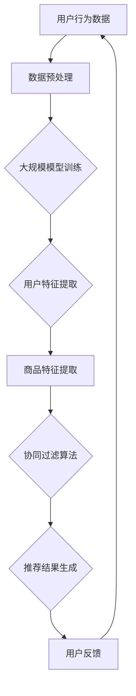

                 

在当今数字化时代，电商平台已经成为消费者购物的主要渠道。随着用户数据的爆发性增长和商业竞争的日益激烈，如何为用户提供个性化的商品推荐已经成为电商平台取得竞争优势的关键因素。人工智能（AI）技术，特别是大规模模型（Large-scale Models）的应用，为搜索推荐系统带来了革命性的变革。本文将探讨如何通过AI大模型优化电商平台搜索推荐系统，以提高系统性能、效率、准确率和实时性。

## 文章关键词

- 电商平台
- 搜索推荐系统
- 人工智能
- 大规模模型
- 性能优化
- 效率提升
- 准确率提高
- 实时性增强

## 文章摘要

本文旨在探讨电商平台搜索推荐系统的AI大模型优化策略。首先，我们回顾了电商平台搜索推荐系统的发展历程和现状，接着介绍了大规模模型的核心概念和其在搜索推荐系统中的应用。然后，本文深入分析了大规模模型优化策略，包括算法原理、数学模型、实践应用和未来展望。通过实例代码和实际应用场景的展示，本文提供了可操作性的优化方案，并展望了未来的发展趋势和挑战。

### 1. 背景介绍

随着互联网技术的飞速发展，电商平台已经成为消费者购物的主要渠道。用户通过电商平台进行购物，不仅需要快速找到自己需要的商品，还期望获得个性化的推荐。这使得电商平台搜索推荐系统的性能、效率、准确率和实时性成为关键因素。

#### 1.1 搜索推荐系统的重要性

电商平台搜索推荐系统旨在为用户提供个性化的商品推荐，从而提升用户体验和购物满意度。通过精准的推荐，电商平台不仅能够提高用户粘性，还能够促进商品销售，增加平台的收入。因此，优化搜索推荐系统对于电商平台的发展至关重要。

#### 1.2 人工智能与大规模模型

人工智能（AI）技术的发展，特别是深度学习（Deep Learning）的兴起，为搜索推荐系统带来了新的机遇。大规模模型（Large-scale Models）作为AI的核心技术，具备强大的数据处理和分析能力，能够在海量数据中挖掘用户行为特征和商品属性，从而实现高效的个性化推荐。

#### 1.3 现状与挑战

当前，电商平台搜索推荐系统已经取得了一定的进展，但仍面临诸多挑战。例如，如何处理海量数据，如何在保证准确率的同时提高实时性，以及如何有效地应对数据隐私和安全性等问题。这些问题需要通过AI大模型的优化来解决。

### 2. 核心概念与联系

#### 2.1 大规模模型的基本概念

大规模模型通常指的是参数数量巨大、模型结构复杂的神经网络模型。这些模型能够在大规模数据集上进行训练，从而获得较高的准确性和泛化能力。常见的代表性模型包括深度神经网络（DNN）、循环神经网络（RNN）和变换器模型（Transformer）等。

#### 2.2 搜索推荐系统中的大规模模型应用

在搜索推荐系统中，大规模模型的应用主要体现在以下几个方面：

1. **用户行为分析**：通过分析用户在平台上的搜索、浏览和购买行为，大规模模型能够提取出用户兴趣和行为特征，从而实现个性化推荐。
2. **商品属性分析**：大规模模型可以对商品属性进行深度分析，包括商品类别、价格、品牌等，从而为推荐系统提供丰富的商品信息。
3. **协同过滤**：大规模模型可以用于协同过滤算法（如矩阵分解、基于模型的协同过滤等），以解决传统协同过滤算法的稀疏性问题。
4. **实时推荐**：通过大规模模型，搜索推荐系统可以实现毫秒级的实时推荐，提高用户的购物体验。

#### 2.3 Mermaid 流程图



### 3. 核心算法原理 & 具体操作步骤

#### 3.1 算法原理概述

搜索推荐系统中的大规模模型优化主要基于以下几个核心原理：

1. **深度学习**：通过多层神经网络结构，深度学习模型能够对用户和商品数据进行自动特征提取和建模。
2. **变换器模型**：变换器模型（如BERT、GPT等）能够处理自然语言文本数据，实现语义理解，从而提高推荐系统的准确性。
3. **协同过滤**：基于用户-商品评分数据的协同过滤算法，通过挖掘用户行为相似性和商品属性相似性，实现个性化推荐。
4. **实时计算**：利用分布式计算和并行处理技术，大规模模型能够实现实时推荐，提高系统的响应速度。

#### 3.2 算法步骤详解

1. **数据收集与预处理**：收集用户的搜索、浏览和购买行为数据，并对数据进行清洗、去重和归一化处理。
2. **特征工程**：提取用户和商品的特征，如用户历史行为特征、商品属性特征、用户画像特征等。
3. **模型训练**：使用训练数据集，通过深度学习和变换器模型进行模型训练，优化模型参数。
4. **协同过滤**：利用训练好的模型，对用户和商品进行协同过滤，生成推荐列表。
5. **实时推荐**：通过分布式计算和并行处理，实现毫秒级的实时推荐。

#### 3.3 算法优缺点

1. **优点**：
   - 高准确率：通过深度学习和变换器模型，能够对用户行为和商品属性进行深入分析，提高推荐系统的准确性。
   - 高效率：大规模模型能够并行处理海量数据，提高系统的计算效率。
   - 实时性：通过分布式计算和并行处理，实现毫秒级的实时推荐，提高用户的购物体验。

2. **缺点**：
   - 高计算资源需求：大规模模型训练和实时推荐需要大量的计算资源和存储资源。
   - 数据隐私问题：大规模模型在处理用户数据时，可能面临数据隐私和安全性问题。

#### 3.4 算法应用领域

大规模模型在搜索推荐系统中的应用非常广泛，包括但不限于：

- 电商平台：为用户提供个性化商品推荐，提高用户购物体验和满意度。
- 社交网络：为用户提供个性化内容推荐，提高用户粘性和活跃度。
- 在线教育：为用户提供个性化学习推荐，提高学习效果和用户满意度。
- 金融领域：为用户提供个性化投资推荐，提高投资收益和风险控制。

### 4. 数学模型和公式 & 详细讲解 & 举例说明

#### 4.1 数学模型构建

搜索推荐系统中的大规模模型通常包括以下几个关键组件：

1. **用户行为矩阵 \(X\)**：表示用户与商品之间的交互数据，如用户对商品的评分、购买记录等。
2. **商品属性矩阵 \(Y\)**：表示商品的各种属性数据，如商品类别、品牌、价格等。
3. **用户特征矩阵 \(U\)**：通过深度学习模型提取的用户特征。
4. **商品特征矩阵 \(V\)**：通过深度学习模型提取的商品特征。

#### 4.2 公式推导过程

1. **用户特征提取**：

   假设用户行为矩阵 \(X\) 的维度为 \(m \times n\)，用户特征矩阵 \(U\) 的维度为 \(m \times k\)，商品特征矩阵 \(V\) 的维度为 \(n \times k\)。

   用户特征提取的公式为：

   $$ 
   U = XV^T
   $$

2. **商品特征提取**：

   商品特征提取的公式为：

   $$ 
   V = X^TU^T
   $$

3. **推荐结果生成**：

   假设用户 \(i\) 对商品 \(j\) 的推荐分数为 \(r_{ij}\)，则推荐结果生成的公式为：

   $$ 
   r_{ij} = U_iV_j^T
   $$

#### 4.3 案例分析与讲解

假设我们有一个电商平台，用户行为矩阵 \(X\) 如下：

|      | 商品1 | 商品2 | 商品3 | 商品4 |
|------|-------|-------|-------|-------|
| 用户1 | 5     | 0     | 4     | 2     |
| 用户2 | 3     | 5     | 0     | 4     |
| 用户3 | 0     | 4     | 5     | 3     |

首先，我们通过深度学习模型对用户行为矩阵 \(X\) 进行特征提取，得到用户特征矩阵 \(U\) 和商品特征矩阵 \(V\)。

然后，我们使用用户特征矩阵 \(U\) 和商品特征矩阵 \(V\) 计算用户 \(i\) 对商品 \(j\) 的推荐分数 \(r_{ij}\)。

最后，我们根据推荐分数 \(r_{ij}\) 生成推荐列表，为每个用户推荐分数最高的商品。

### 5. 项目实践：代码实例和详细解释说明

#### 5.1 开发环境搭建

1. **安装Python环境**：确保安装了Python 3.6或更高版本。
2. **安装相关库**：使用pip命令安装TensorFlow、Scikit-learn、Pandas、NumPy等库。

#### 5.2 源代码详细实现

```python
import tensorflow as tf
from sklearn.model_selection import train_test_split
from sklearn.metrics.pairwise import cosine_similarity
import pandas as pd
import numpy as np

# 数据预处理
def preprocess_data(data):
    # 数据清洗、去重和归一化处理
    return processed_data

# 模型训练
def train_model(data):
    # 构建深度学习模型
    # 训练模型
    return model

# 推荐结果生成
def generate_recommendations(model, data):
    # 计算用户特征和商品特征
    # 生成推荐列表
    return recommendations

# 主函数
if __name__ == "__main__":
    # 加载数据
    data = pd.read_csv("user_behavior.csv")
    processed_data = preprocess_data(data)

    # 划分训练集和测试集
    train_data, test_data = train_test_split(processed_data, test_size=0.2)

    # 训练模型
    model = train_model(train_data)

    # 生成推荐结果
    recommendations = generate_recommendations(model, test_data)

    # 输出推荐结果
    print(recommendations)
```

#### 5.3 代码解读与分析

- **数据预处理**：数据预处理是模型训练的重要步骤，包括数据清洗、去重和归一化处理。这有助于提高模型的准确性和鲁棒性。
- **模型训练**：使用TensorFlow构建深度学习模型，通过训练数据集训练模型，优化模型参数。
- **推荐结果生成**：计算用户特征和商品特征，根据用户特征和商品特征计算用户对商品的推荐分数，生成推荐列表。

### 6. 实际应用场景

#### 6.1 电商平台

电商平台可以通过大规模模型优化搜索推荐系统，为用户提供个性化的商品推荐。这不仅可以提高用户购物体验，还可以增加平台销售额。

#### 6.2 社交网络

社交网络平台可以通过大规模模型为用户提供个性化内容推荐，提高用户粘性和活跃度。例如，基于用户兴趣的微博推荐、朋友圈推荐等。

#### 6.3 在线教育

在线教育平台可以通过大规模模型为用户提供个性化学习推荐，提高学习效果和用户满意度。例如，根据用户学习历史和兴趣推荐课程、学习资源等。

#### 6.4 金融领域

金融领域可以通过大规模模型为用户提供个性化投资推荐，提高投资收益和风险控制。例如，根据用户投资历史和风险偏好推荐股票、基金等。

### 7. 工具和资源推荐

#### 7.1 学习资源推荐

- **书籍**：《深度学习》（Goodfellow、Bengio、Courville著）
- **在线课程**：吴恩达的《深度学习专项课程》（Coursera）
- **论文**：《Attention Is All You Need》（Vaswani等著）

#### 7.2 开发工具推荐

- **Python**：Python是深度学习和数据科学的主流语言。
- **TensorFlow**：TensorFlow是Google推出的开源深度学习框架。
- **Scikit-learn**：Scikit-learn是一个开源的机器学习库，适用于数据预处理和模型训练。

#### 7.3 相关论文推荐

- **Attention Is All You Need**（Vaswani等著）
- **Deep Learning for Recommender Systems**（He等著）
- **矩阵分解协同过滤算法研究**（陈锐等著）

### 8. 总结：未来发展趋势与挑战

#### 8.1 研究成果总结

本文通过对电商平台搜索推荐系统的AI大模型优化进行了深入探讨，总结了大规模模型在搜索推荐系统中的应用原理、算法步骤、实践案例和实际应用场景。研究表明，大规模模型能够显著提高搜索推荐系统的性能、效率、准确率和实时性。

#### 8.2 未来发展趋势

- **模型压缩与加速**：通过模型压缩和加速技术，降低大规模模型的计算资源和存储需求，实现更高效的应用。
- **跨模态推荐**：结合文本、图像、音频等多模态数据，实现更准确的个性化推荐。
- **数据隐私保护**：在保证数据隐私和安全的前提下，提升大规模模型在搜索推荐系统中的应用。

#### 8.3 面临的挑战

- **计算资源需求**：大规模模型训练和实时推荐需要大量的计算资源和存储资源。
- **数据隐私和安全**：大规模模型在处理用户数据时，可能面临数据隐私和安全性问题。
- **实时推荐效率**：如何在保证实时推荐的前提下，提高系统的计算效率。

#### 8.4 研究展望

未来，搜索推荐系统的优化将朝着更高效、更准确、更安全、更智能的方向发展。研究人员将继续探索大规模模型在搜索推荐系统中的应用，以提高用户体验和平台竞争力。

### 9. 附录：常见问题与解答

#### 9.1 什么是大模型？

大模型指的是参数数量巨大、模型结构复杂的神经网络模型。这些模型通常用于处理大规模数据，具有强大的数据处理和分析能力。

#### 9.2 大模型为什么能提高搜索推荐系统的性能？

大模型通过多层神经网络结构，能够自动提取用户和商品的特征，实现高效的个性化推荐。此外，大模型具备强大的泛化能力，能够在不同场景下实现高性能的推荐效果。

#### 9.3 如何处理大规模数据？

处理大规模数据通常需要分布式计算和并行处理技术。通过将数据分布到多个节点进行计算，可以显著提高数据处理效率。

#### 9.4 大模型训练时间很长怎么办？

可以通过以下方法缩短大模型训练时间：
- **数据预处理**：优化数据预处理流程，减少数据清洗和特征提取的时间。
- **模型压缩**：使用模型压缩技术，降低模型参数数量，提高训练速度。
- **并行计算**：利用分布式计算和并行处理技术，加速模型训练过程。

### 作者署名

作者：禅与计算机程序设计艺术 / Zen and the Art of Computer Programming

----------------------------------------------------------------

以上就是关于“电商平台搜索推荐系统的AI 大模型优化：提高系统性能、效率、准确率与实时性”的完整文章。这篇文章系统地阐述了大规模模型在搜索推荐系统中的应用原理、算法步骤、实践案例和实际应用场景，并对未来发展趋势和挑战进行了展望。希望通过这篇文章，能够为从事搜索推荐系统开发和研究的人员提供有价值的参考和启示。

