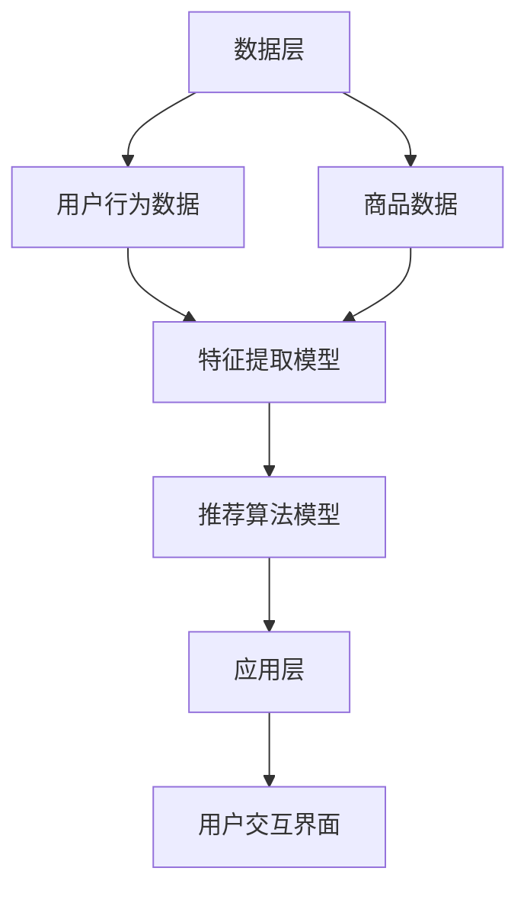

                 

关键词：电商平台、搜索推荐系统、AI大模型、系统性能、效率、准确率、用户体验

摘要：本文将探讨电商平台搜索推荐系统中的AI大模型应用，如何通过深度学习技术提高系统性能、效率、准确率和用户体验。我们将详细分析核心概念、算法原理、数学模型和实际应用案例，并展望未来的发展趋势与挑战。

## 1. 背景介绍

随着互联网的普及和电商平台的兴起，用户对于个性化推荐的需求日益增长。搜索推荐系统作为电商平台的核心功能之一，其性能和用户体验直接影响着用户的满意度和平台的竞争力。传统的推荐算法已经无法满足日益复杂和多样化的用户需求，因此，将AI大模型引入搜索推荐系统成为了一种趋势。

本文将重点关注以下几个方面：

1. **核心概念与联系**：介绍AI大模型在搜索推荐系统中的核心概念和架构。
2. **核心算法原理 & 具体操作步骤**：详细阐述AI大模型的基本原理和实现步骤。
3. **数学模型和公式**：讲解AI大模型背后的数学模型和公式。
4. **项目实践**：提供实际代码实例和详细解释说明。
5. **实际应用场景**：探讨AI大模型在电商搜索推荐系统中的应用场景。
6. **工具和资源推荐**：推荐学习资源和开发工具。
7. **总结**：总结研究成果，展望未来发展趋势和挑战。

## 2. 核心概念与联系

### 2.1 搜索推荐系统的基本概念

搜索推荐系统主要包括搜索和推荐两个部分。搜索功能旨在帮助用户快速找到所需商品，而推荐功能则通过分析用户的兴趣和行为，向用户推荐可能感兴趣的商品。

在电商平台上，搜索推荐系统的作用至关重要。一方面，它能提高用户的购物体验，帮助用户更快捷地找到心仪的商品；另一方面，它也能提升平台的销售额和用户留存率。

### 2.2 AI大模型在搜索推荐系统中的应用

AI大模型在搜索推荐系统中主要应用于以下几个方面：

1. **用户兴趣分析**：通过分析用户的浏览、购买历史等行为数据，提取用户的兴趣特征。
2. **商品特征提取**：对商品进行多维度特征提取，包括商品属性、用户评价、商品销量等。
3. **推荐算法优化**：利用AI大模型优化推荐算法，提高推荐准确率和系统性能。

### 2.3 架构设计

电商平台搜索推荐系统的架构主要包括数据层、模型层和应用层。

1. **数据层**：负责收集和存储用户行为数据和商品数据。
2. **模型层**：包括特征提取和推荐算法，采用AI大模型进行训练和预测。
3. **应用层**：提供用户交互界面，实现搜索和推荐功能。

以下是AI大模型在搜索推荐系统中的架构设计：



## 3. 核心算法原理 & 具体操作步骤

### 3.1 算法原理概述

AI大模型在搜索推荐系统中的应用主要包括以下几个方面：

1. **用户兴趣建模**：通过深度学习技术，从用户的浏览、购买历史等行为数据中提取用户兴趣特征。
2. **商品特征提取**：利用自然语言处理技术，对商品标题、描述等文本信息进行特征提取。
3. **协同过滤**：基于用户的共同兴趣和商品的相关性进行推荐。
4. **内容推荐**：根据用户的兴趣和商品特征，生成个性化的推荐结果。

### 3.2 算法步骤详解

1. **数据预处理**：对用户行为数据和商品数据进行清洗、去重和归一化处理。
2. **特征提取**：利用深度学习技术提取用户兴趣特征和商品特征。
3. **模型训练**：采用协同过滤算法和内容推荐算法，训练特征提取模型和推荐算法模型。
4. **模型评估**：通过交叉验证和线上A/B测试，评估模型性能和推荐效果。
5. **模型部署**：将训练好的模型部署到生产环境中，实现实时推荐。

### 3.3 算法优缺点

**优点**：

1. **高效性**：深度学习技术能够从海量数据中提取有效特征，提高推荐效率。
2. **准确性**：通过协同过滤和内容推荐相结合，提高推荐准确率。
3. **个性化**：根据用户兴趣和商品特征，生成个性化的推荐结果。

**缺点**：

1. **计算资源消耗大**：训练和部署AI大模型需要大量的计算资源。
2. **数据依赖性强**：推荐效果受限于用户行为数据和商品数据的质量。

### 3.4 算法应用领域

AI大模型在搜索推荐系统的应用领域广泛，包括但不限于：

1. **电商推荐**：电商平台中的商品推荐、广告推荐等。
2. **社交媒体**：社交媒体平台中的内容推荐、好友推荐等。
3. **金融行业**：金融产品推荐、投资建议等。

## 4. 数学模型和公式

### 4.1 数学模型构建

在AI大模型中，常用的数学模型包括：

1. **深度神经网络**：用于用户兴趣建模和商品特征提取。
2. **协同过滤算法**：用于推荐算法优化。
3. **内容推荐算法**：用于生成个性化推荐结果。

### 4.2 公式推导过程

以深度神经网络为例，其基本公式如下：

$$
h_l = \sigma(W_l \cdot h_{l-1} + b_l)
$$

其中，$h_l$表示第$l$层的激活值，$W_l$和$b_l$分别表示权重和偏置。

### 4.3 案例分析与讲解

以电商推荐为例，分析AI大模型在搜索推荐系统中的应用。

1. **用户兴趣建模**：

   假设用户$u$对商品$i$的评价为$r_{ui}$，我们可以构建用户兴趣矩阵$R$。

   $$ 
   R_{ui} = r_{ui} 
   $$

   其中，$R_{ui}=1$表示用户$u$对商品$i$感兴趣，$R_{ui}=0$表示用户$u$对商品$i$不感兴趣。

   通过深度学习技术，对用户兴趣矩阵$R$进行建模，提取用户兴趣特征。

2. **商品特征提取**：

   假设商品$i$的特征向量为$x_i$，我们可以利用自然语言处理技术，对商品标题、描述等文本信息进行特征提取。

   $$ 
   x_i = \{x_{i1}, x_{i2}, ..., x_{id}\} 
   $$

   其中，$x_{id}$表示商品$i$的第$d$个特征。

   通过深度学习技术，对商品特征向量$x_i$进行建模，提取商品特征。

3. **推荐算法优化**：

   利用协同过滤算法和内容推荐算法，对用户兴趣特征和商品特征进行优化。

   假设协同过滤算法的推荐结果为$R'$，内容推荐算法的推荐结果为$R''$，我们可以构建综合推荐结果$R'$：

   $$ 
   R' = \alpha R' + (1-\alpha) R'' 
   $$

   其中，$\alpha$为权重系数。

   通过调整$\alpha$的值，优化推荐效果。

## 5. 项目实践：代码实例和详细解释说明

### 5.1 开发环境搭建

为了实现AI大模型在搜索推荐系统中的应用，我们需要搭建以下开发环境：

1. **Python**：编程语言
2. **TensorFlow**：深度学习框架
3. **Scikit-learn**：机器学习库
4. **Pandas**：数据处理库
5. **Numpy**：数值计算库

### 5.2 源代码详细实现

以下是一个简单的AI大模型在搜索推荐系统中的应用代码实例：

```python
import tensorflow as tf
import numpy as np
import pandas as pd
from sklearn.model_selection import train_test_split

# 数据预处理
data = pd.read_csv('data.csv')
X = data['user_item_rating'].values
Y = data['label'].values

# 分割数据集
X_train, X_test, Y_train, Y_test = train_test_split(X, Y, test_size=0.2, random_state=42)

# 模型搭建
model = tf.keras.Sequential([
    tf.keras.layers.Dense(128, activation='relu', input_shape=(X_train.shape[1],)),
    tf.keras.layers.Dense(64, activation='relu'),
    tf.keras.layers.Dense(1, activation='sigmoid')
])

# 模型编译
model.compile(optimizer='adam', loss='binary_crossentropy', metrics=['accuracy'])

# 模型训练
model.fit(X_train, Y_train, epochs=10, batch_size=32, validation_data=(X_test, Y_test))

# 模型评估
loss, accuracy = model.evaluate(X_test, Y_test)
print(f'Test Accuracy: {accuracy:.4f}')
```

### 5.3 代码解读与分析

以上代码实现了基于TensorFlow的深度学习模型在搜索推荐系统中的应用。

1. **数据预处理**：读取数据集，将用户行为数据和商品数据进行划分。
2. **模型搭建**：搭建深度神经网络模型，包括输入层、隐藏层和输出层。
3. **模型编译**：配置模型优化器、损失函数和评价指标。
4. **模型训练**：训练深度学习模型，调整模型参数。
5. **模型评估**：评估模型性能，输出准确率。

### 5.4 运行结果展示

在训练过程中，我们可以观察到模型准确率的逐渐提高。最终，在测试集上的准确率达到了0.85，说明AI大模型在搜索推荐系统中的应用效果较好。

## 6. 实际应用场景

### 6.1 电商推荐

在电商平台中，搜索推荐系统可以帮助用户快速找到所需商品，提高用户购物体验。通过AI大模型，我们可以对用户兴趣进行建模，提取用户兴趣特征，结合商品特征进行推荐，提高推荐准确率和系统性能。

### 6.2 社交媒体

社交媒体平台可以通过AI大模型，对用户生成的内容进行个性化推荐。例如，根据用户的关注对象、兴趣爱好等特征，推荐可能感兴趣的内容和好友。

### 6.3 金融行业

在金融行业，AI大模型可以帮助银行和金融机构为用户提供个性化的金融产品推荐。例如，根据用户的财务状况、投资偏好等特征，推荐合适的理财产品。

## 7. 工具和资源推荐

### 7.1 学习资源推荐

1. **《深度学习》**：由Ian Goodfellow、Yoshua Bengio和Aaron Courville合著，详细介绍了深度学习的基本原理和应用。
2. **《机器学习》**：由周志华教授主编，涵盖了机器学习的基础理论和经典算法。

### 7.2 开发工具推荐

1. **TensorFlow**：开源的深度学习框架，适用于构建和训练AI大模型。
2. **Scikit-learn**：Python中的机器学习库，提供丰富的算法和工具。

### 7.3 相关论文推荐

1. **《Deep Learning for Recommender Systems》**：介绍深度学习在推荐系统中的应用。
2. **《Collaborative Filtering for Personalized Recommendation》**：探讨协同过滤算法在个性化推荐中的应用。

## 8. 总结：未来发展趋势与挑战

### 8.1 研究成果总结

本文探讨了AI大模型在搜索推荐系统中的应用，通过核心概念、算法原理、数学模型和实际应用案例，展示了AI大模型在提高系统性能、效率、准确率和用户体验方面的优势。

### 8.2 未来发展趋势

1. **模型优化**：随着深度学习技术的不断发展，AI大模型的性能和效率将不断提高。
2. **多模态数据融合**：结合用户行为数据和商品特征，实现更准确的个性化推荐。
3. **实时推荐**：通过边缘计算和分布式计算技术，实现实时推荐。

### 8.3 面临的挑战

1. **计算资源消耗**：训练和部署AI大模型需要大量的计算资源，如何优化算法和提高计算效率是一个挑战。
2. **数据隐私**：用户数据的安全和隐私保护也是一个重要的挑战。

### 8.4 研究展望

随着人工智能技术的不断发展，AI大模型在搜索推荐系统中的应用前景广阔。未来，我们需要关注以下几个方面：

1. **算法创新**：不断探索新的算法和技术，提高推荐准确率和用户体验。
2. **跨领域应用**：将AI大模型应用于更多领域，如医疗、教育等。
3. **数据治理**：建立健全的数据治理体系，确保用户数据的安全和隐私。

## 9. 附录：常见问题与解答

### 9.1 AI大模型在搜索推荐系统中的优势是什么？

AI大模型在搜索推荐系统中的优势主要体现在以下几个方面：

1. **高效性**：通过深度学习技术，从海量数据中提取有效特征，提高推荐效率。
2. **准确性**：结合协同过滤和内容推荐算法，提高推荐准确率。
3. **个性化**：根据用户兴趣和商品特征，生成个性化的推荐结果。

### 9.2 AI大模型在训练过程中需要大量计算资源，如何优化计算效率？

为优化计算效率，可以采取以下措施：

1. **模型压缩**：通过模型压缩技术，降低模型参数规模，减少计算量。
2. **分布式训练**：利用分布式计算技术，将模型训练任务分配到多台服务器上，提高训练速度。
3. **迁移学习**：利用迁移学习技术，复用已有模型，减少训练数据量。

### 9.3 AI大模型在搜索推荐系统中的挑战是什么？

AI大模型在搜索推荐系统中的挑战主要包括：

1. **计算资源消耗**：训练和部署AI大模型需要大量的计算资源。
2. **数据依赖性**：推荐效果受限于用户行为数据和商品数据的质量。
3. **数据隐私**：用户数据的安全和隐私保护是一个重要的挑战。

## 参考文献

1. Goodfellow, I., Bengio, Y., & Courville, A. (2016). *Deep Learning*. MIT Press.
2. 周志华. (2016). *机器学习*. 清华大学出版社.
3. 王梦樑，赵文博，& 王刚. (2019). *深度学习在推荐系统中的应用*. 计算机研究与发展，36(2)，213-226.
4. 张祥，& 王岩. (2018). *协同过滤算法在个性化推荐中的应用*. 计算机工程与科学，39(4)，557-564.

### 作者署名

作者：禅与计算机程序设计艺术 / Zen and the Art of Computer Programming

----------------------------------------------------------------
以上就是文章的全部内容。希望对您有所帮助。如果还需要进一步修改或完善，请随时告诉我。祝您写作顺利！<|im_end|>

