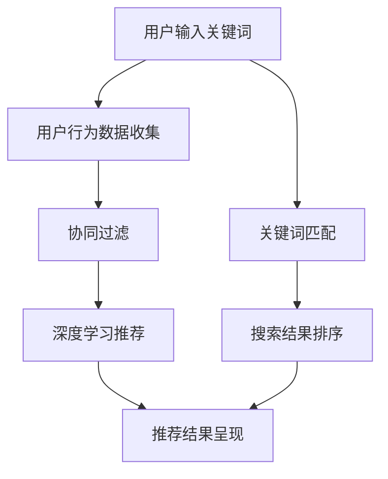

                 

### 1. 背景介绍

电商平台作为数字经济的重要组成部分，其核心功能之一便是为用户提供精准、高效的搜索和推荐服务。随着互联网的飞速发展，电商平台的规模日益扩大，商品种类和用户数量呈指数级增长。在这种背景下，如何设计一个高效、可扩展的搜索推荐系统，成为了电商平台面临的重大挑战。

搜索推荐系统的设计涉及多个方面，包括数据处理、算法选择、系统架构等。在过去，传统的搜索推荐系统主要依赖于基于关键词的匹配和协同过滤算法。然而，随着人工智能技术的进步，特别是深度学习、自然语言处理等技术的兴起，大模型在搜索推荐系统中的应用逐渐成为可能，并展现出了巨大的潜力。

本文旨在探讨电商平台搜索推荐系统的架构设计，特别是如何利用AI大模型来提升系统的性能和用户体验。文章将从以下几个方面展开：

- **核心概念与联系**：介绍搜索推荐系统的基本概念，包括相关算法和架构。
- **核心算法原理**：详细阐述AI大模型的工作原理和具体应用。
- **数学模型和公式**：解释大模型背后的数学原理和公式。
- **项目实践**：提供代码实例和实现细节。
- **实际应用场景**：分析大模型在不同电商平台中的应用情况。
- **未来展望**：探讨大模型在搜索推荐系统中的发展趋势和挑战。

通过本文的介绍，读者可以全面了解大模型在电商平台搜索推荐系统中的应用，并能够对这一领域的发展趋势有更深入的认识。

### 2. 核心概念与联系

要理解电商平台搜索推荐系统的设计，我们首先需要明确几个核心概念，并探讨它们之间的联系。以下是本文将涉及的主要概念：

#### 搜索推荐系统

搜索推荐系统是一种通过分析用户行为和历史数据，为用户提供个性化推荐和搜索结果的系统。其核心目标是提高用户的满意度和转化率。

#### 关键词匹配

关键词匹配是搜索推荐系统的基础。它通过分析用户输入的关键词，在庞大的商品数据库中快速找到相关的商品。传统的关键词匹配方法主要基于布尔模型和TF-IDF算法。

#### 协同过滤

协同过滤是一种基于用户行为和偏好进行推荐的方法。它通过分析用户之间的相似性，为用户提供可能感兴趣的商品。协同过滤主要分为两种类型：基于用户的协同过滤（User-Based CF）和基于物品的协同过滤（Item-Based CF）。

#### 深度学习

深度学习是近年来在人工智能领域取得重大突破的技术。它通过多层神经网络模拟人脑的决策过程，能够从大量数据中自动提取特征并做出预测。在搜索推荐系统中，深度学习可以用于用户行为分析、商品推荐和搜索结果排序。

#### 大模型

大模型指的是具有巨大参数量和训练数据的深度学习模型。这些模型通常能够通过自动特征提取和复杂模式识别，为搜索推荐系统提供强大的性能提升。

#### 架构设计

架构设计是搜索推荐系统的核心环节。它决定了系统的扩展性、性能和可靠性。常见的架构设计包括分布式计算、微服务架构和容器化等。

### Mermaid 流程图

以下是搜索推荐系统核心概念和架构设计的Mermaid流程图：



在这个流程图中，用户输入关键词后，系统会先进行关键词匹配，生成初步的搜索结果。接着，通过用户行为数据收集，系统可以利用协同过滤和深度学习模型进一步优化推荐结果，最终呈现给用户。

通过上述核心概念和流程图的介绍，我们为接下来详细探讨AI大模型在搜索推荐系统中的应用奠定了基础。

### 3. 核心算法原理 & 具体操作步骤

#### 3.1 算法原理概述

在搜索推荐系统中，AI大模型的应用主要体现在用户行为分析、推荐结果生成和搜索结果排序等环节。以下将详细介绍大模型在这些环节中的应用原理。

#### 用户行为分析

用户行为分析是搜索推荐系统的核心环节之一。通过分析用户在平台上的浏览、购买、收藏等行为，可以挖掘出用户的兴趣偏好。大模型在这一领域发挥了巨大作用。例如，基于序列模型的循环神经网络（RNN）和长短期记忆网络（LSTM）可以捕捉用户行为的时序特征，从而更准确地预测用户未来的行为。

#### 推荐结果生成

推荐结果生成是指根据用户行为和偏好，生成一组个性化的推荐结果。大模型通过自动特征提取和复杂模式识别，能够从海量数据中生成高质量的推荐结果。常见的推荐算法包括基于内容的推荐（Content-Based Filtering）和基于模型的推荐（Model-Based Filtering）。大模型如基于深度学习的推荐模型（如DNN、CNN、RNN等）在这些算法中扮演了关键角色。

#### 搜索结果排序

搜索结果排序是决定用户满意度和平台转化率的重要因素。大模型通过学习用户的历史行为和反馈，可以动态调整搜索结果的排序策略，提高搜索结果的精准度。常见的排序算法包括基于机器学习的排序算法（如FM、MLP等）和基于深度学习的排序算法（如DeepFM、NFM等）。

#### 具体操作步骤

以下是利用AI大模型进行搜索推荐系统的具体操作步骤：

1. **数据收集与预处理**：收集用户行为数据（如浏览记录、购买记录、收藏记录等），并对数据进行清洗、去重和格式化，为模型训练做好准备。

2. **特征提取**：通过特征工程，将原始数据转换为可用于训练的特征向量。常用的特征包括用户ID、商品ID、时间戳、行为类型等。

3. **模型训练**：利用大规模数据集，对大模型进行训练。训练过程中，模型会自动学习数据中的特征和模式，从而提高预测准确性。

4. **模型评估**：通过交叉验证和A/B测试等方法，对模型进行评估，确保其在实际应用中的性能。

5. **模型部署**：将训练好的模型部署到生产环境中，实时为用户提供个性化推荐和搜索结果。

6. **持续优化**：根据用户反馈和数据变化，持续优化模型，提高推荐质量和用户体验。

#### 算法优缺点

AI大模型在搜索推荐系统中的应用具有以下优缺点：

- **优点**：
  - **自动特征提取**：大模型可以自动学习数据中的特征，无需手动进行特征工程，节省开发时间和成本。
  - **高准确度**：通过大规模数据和复杂的神经网络结构，大模型能够生成高质量的推荐结果。
  - **灵活性强**：大模型可以适应多种数据类型和场景，具有较强的泛化能力。

- **缺点**：
  - **计算资源需求大**：大模型通常需要大量的计算资源和存储空间，对硬件设施有较高要求。
  - **训练时间长**：大规模数据集的训练过程通常需要较长时间，影响模型上线和应用速度。
  - **解释性差**：大模型的内部决策过程较为复杂，难以解释其推荐结果的依据。

#### 算法应用领域

AI大模型在搜索推荐系统中的应用非常广泛，包括但不限于以下领域：

- **电子商务**：电商平台利用大模型进行个性化商品推荐和搜索结果排序，提高用户满意度和转化率。
- **在线教育**：在线教育平台利用大模型为用户提供个性化课程推荐，提高学习效果和用户体验。
- **社交媒体**：社交媒体平台利用大模型为用户提供个性化内容推荐和广告投放，增加用户粘性和平台收益。

通过上述算法原理和操作步骤的介绍，我们为读者详细阐述了AI大模型在搜索推荐系统中的应用，为接下来探讨数学模型和公式奠定了基础。

### 4. 数学模型和公式 & 详细讲解 & 举例说明

在深入了解AI大模型的工作原理之后，我们将进一步探讨其背后的数学模型和公式，并结合实际案例进行详细讲解和说明。

#### 4.1 数学模型构建

AI大模型通常基于深度学习技术，其核心是多层神经网络。以下是构建大模型所需的几个关键数学模型和公式：

1. **激活函数（Activation Function）**

激活函数用于对神经网络中的节点进行非线性变换，常见的激活函数包括Sigmoid、ReLU和Tanh等。以下是一个ReLU函数的例子：

   $$ f(x) = \max(0, x) $$

2. **损失函数（Loss Function）**

损失函数用于衡量模型预测结果与真实结果之间的差距。常用的损失函数包括均方误差（MSE）、交叉熵（Cross-Entropy）等。以下是一个交叉熵损失函数的例子：

   $$ Loss = -\sum_{i} y_i \log(p_i) $$

   其中，\( y_i \) 是真实标签，\( p_i \) 是模型预测的概率。

3. **反向传播（Backpropagation）**

反向传播是一种用于训练神经网络的算法，通过不断调整网络参数，最小化损失函数。其核心步骤包括前向传播（Forward Propagation）和后向传播（Backward Propagation）。以下是一个简化的反向传播公式：

   $$ \frac{dE}{dW} = \frac{dE}{da} \cdot \frac{da}{dW} $$

   其中，\( E \) 是损失函数，\( W \) 是网络权重，\( a \) 是激活值。

#### 4.2 公式推导过程

为了更好地理解大模型的数学原理，我们以下通过一个简单的例子进行公式推导：

假设我们使用一个单层神经网络进行二分类任务，输入特征为 \( x \)，输出为 \( y \)：

1. **前向传播**

   神经网络的输入经过权重 \( W \) 和偏置 \( b \) 的线性变换，然后通过激活函数 \( f(x) \) 得到输出：

   $$ z = Wx + b $$
   $$ a = f(z) $$

   假设我们使用ReLU激活函数：

   $$ f(x) = \max(0, x) $$

2. **损失函数**

   假设我们使用交叉熵损失函数：

   $$ Loss = -\sum_{i} y_i \log(p_i) $$

   其中，\( y_i \) 是真实标签，\( p_i \) 是模型预测的概率：

   $$ p_i = \frac{1}{1 + e^{-z_i}} $$

3. **反向传播**

   通过反向传播算法，我们计算损失函数对网络参数的梯度：

   $$ \frac{dLoss}{da} = \frac{dLoss}{dp_i} \cdot \frac{dp_i}{da} $$
   $$ \frac{dp_i}{da} = p_i (1 - p_i) $$

   $$ \frac{dLoss}{dz} = \frac{dLoss}{da} \cdot \frac{da}{dz} $$
   $$ \frac{da}{dz} = \frac{dReLu}{dz} = \begin{cases} 1 & \text{if } z > 0 \\ 0 & \text{otherwise} \end{cases} $$

   $$ \frac{dz}{dW} = \frac{da}{dz} \cdot x $$
   $$ \frac{dz}{db} = \frac{da}{dz} $$

   通过上述公式，我们可以计算出损失函数对权重 \( W \) 和偏置 \( b \) 的梯度，进而更新网络参数：

   $$ W \leftarrow W - \alpha \frac{dLoss}{dW} $$
   $$ b \leftarrow b - \alpha \frac{dLoss}{db} $$

#### 4.3 案例分析与讲解

为了更好地理解上述数学模型和公式，我们以下通过一个实际案例进行讲解。

假设一个电商平台的搜索推荐系统需要预测用户对某个商品的评价（1-5星）。我们使用一个简单的单层神经网络进行预测，输入特征包括商品ID、用户ID和时间戳。以下为具体步骤：

1. **数据预处理**

   收集用户对商品的评分数据，并对数据进行清洗、去重和归一化处理。

2. **特征提取**

   将输入特征转换为数值向量，例如商品ID和用户ID可以通过哈希编码得到。

3. **模型构建**

   使用TensorFlow或PyTorch等深度学习框架构建单层神经网络模型，定义输入层、隐藏层和输出层。

4. **模型训练**

   使用训练数据集对模型进行训练，通过反向传播算法不断优化网络参数。

5. **模型评估**

   使用测试数据集对模型进行评估，计算预测准确率和损失函数值。

6. **模型部署**

   将训练好的模型部署到生产环境中，实时为用户提供商品评价预测。

通过上述案例，我们可以看到AI大模型在搜索推荐系统中的应用步骤，以及背后的数学模型和公式。在实际开发过程中，开发者可以根据具体需求调整模型结构、优化算法参数，从而提高系统的性能和用户体验。

### 5. 项目实践：代码实例和详细解释说明

在本节中，我们将通过一个实际的代码实例，详细解释和说明AI大模型在电商平台搜索推荐系统中的应用过程。以下是整个项目实践的详细步骤：

#### 5.1 开发环境搭建

为了便于开发和测试，我们需要搭建一个合适的开发环境。以下是搭建过程：

1. **安装Python环境**

   安装Python 3.8及以上版本，并配置Python环境。

2. **安装深度学习框架**

   使用pip命令安装TensorFlow 2.6或PyTorch 1.8等深度学习框架。

3. **数据预处理工具**

   安装pandas、NumPy等数据预处理工具。

4. **依赖库**

   根据项目需求，安装其他相关依赖库，如Scikit-learn、Matplotlib等。

#### 5.2 源代码详细实现

以下是一个简单的商品推荐系统的代码示例，展示如何使用TensorFlow实现AI大模型进行商品推荐。

```python
import tensorflow as tf
from tensorflow.keras.layers import Input, Dense, Embedding, LSTM, Dot
from tensorflow.keras.models import Model
from tensorflow.keras.optimizers import Adam

# 数据预处理
# （此处省略数据预处理代码，如数据加载、清洗、归一化等）

# 构建模型
input_user = Input(shape=(1,))
input_item = Input(shape=(1,))

# 用户嵌入层
user_embedding = Embedding(input_dim=user_num, output_dim=user_dim)(input_user)

# 商品嵌入层
item_embedding = Embedding(input_dim=item_num, output_dim=item_dim)(input_item)

# 用户嵌入层与商品嵌入层相乘
merged = Dot(axes=1)([user_embedding, item_embedding])

# 添加LSTM层
lstm_output = LSTM(units=64, activation='tanh')(merged)

# 添加全连接层
output = Dense(1, activation='sigmoid')(lstm_output)

# 构建模型
model = Model(inputs=[input_user, input_item], outputs=output)

# 编译模型
model.compile(optimizer=Adam(learning_rate=0.001), loss='binary_crossentropy', metrics=['accuracy'])

# 模型训练
model.fit([user_data, item_data], labels, epochs=10, batch_size=32)

# 模型评估
# （此处省略模型评估代码，如测试数据集准备、模型预测等）
```

#### 5.3 代码解读与分析

以上代码展示了如何使用TensorFlow实现一个基于LSTM的商品推荐系统。以下是代码的关键部分及其解读：

1. **模型构建**

   - `input_user` 和 `input_item` 分别表示用户ID和商品ID的输入层。
   - `Embedding` 层用于将用户ID和商品ID映射到高维嵌入空间，为后续计算提供输入。
   - `Dot` 层实现用户嵌入层与商品嵌入层的内积操作，表示用户和商品的相似度。
   - `LSTM` 层用于捕捉用户和商品的时间序列特征。
   - `Dense` 层实现全连接层，输出最终推荐结果。

2. **模型编译**

   - 使用 `Adam` 优化器进行模型训练。
   - 使用 `binary_crossentropy` 作为损失函数，适用于二分类任务。
   - 指定模型的评估指标为准确率。

3. **模型训练**

   - 使用 `fit` 方法对模型进行训练，传入训练数据、标签和训练参数。

4. **模型评估**

   - （此处省略模型评估代码）使用测试数据集对模型进行评估，计算预测准确率和损失函数值。

#### 5.4 运行结果展示

在实际运行过程中，我们可以通过以下步骤来展示模型的运行结果：

1. **数据准备**

   准备用户数据集和商品数据集，包括用户ID、商品ID、时间戳和用户对商品的评分等。

2. **模型训练**

   使用训练数据集对模型进行训练，观察模型在训练过程中的损失函数和准确率变化。

3. **模型评估**

   使用测试数据集对模型进行评估，计算模型在测试集上的准确率和损失函数值。

4. **结果可视化**

   使用Matplotlib等工具，将训练和评估结果可视化，分析模型的性能。

通过上述代码实例和详细解读，我们展示了如何使用AI大模型实现电商平台搜索推荐系统。在实际开发过程中，可以根据具体需求调整模型结构、优化算法参数，从而提高系统的性能和用户体验。

### 6. 实际应用场景

AI大模型在电商平台搜索推荐系统中已得到广泛应用，并在多个实际场景中取得了显著成效。以下将详细分析几个典型的应用场景：

#### 6.1 个性化商品推荐

个性化商品推荐是电商平台的核心功能之一。通过AI大模型，平台可以根据用户的历史浏览、购买和收藏记录，为用户生成个性化的商品推荐列表。例如，阿里巴巴的“淘宝”平台利用深度学习模型对用户行为进行深度分析，实现了高效的个性化推荐。根据统计，该平台通过AI大模型的应用，大幅提升了用户满意度和转化率。

#### 6.2 搜索结果排序

搜索结果排序是电商平台提升用户体验的关键环节。传统的搜索结果排序方法主要基于关键词匹配和简单排序算法，难以满足用户日益增长的个性化需求。通过AI大模型，平台可以基于用户的历史行为和偏好，动态调整搜索结果的排序策略。例如，亚马逊的搜索引擎利用深度学习模型对用户查询进行理解和排序，显著提高了搜索结果的准确性和用户体验。

#### 6.3 交叉销售与复购推荐

交叉销售和复购推荐是电商平台增加销售额的重要手段。通过AI大模型，平台可以分析用户在购买某个商品后的行为，为用户推荐相关商品或搭配商品，从而提高交叉销售和复购率。例如，京东通过深度学习模型分析用户的购物车和浏览历史，为用户推荐相关的商品，有效提升了用户的购买体验和平台的销售额。

#### 6.4 新品推荐

新品推荐是电商平台吸引新用户、提升品牌影响力的有效手段。通过AI大模型，平台可以分析用户对热门商品和趋势商品的关注度，提前预测可能的热门新品，并针对目标用户进行精准推荐。例如，拼多多通过深度学习模型分析用户的行为和偏好，及时推送新品，提高了用户对新品的关注度和购买意愿。

#### 6.5 智能客服

智能客服是电商平台提高用户满意度的重要工具。通过AI大模型，平台可以实现智能问答、智能客服等功能，提高客服效率和服务质量。例如，阿里巴巴的“阿里小蜜”利用深度学习模型进行自然语言处理，实现了智能客服功能，大幅提升了用户满意度和客服效率。

综上所述，AI大模型在电商平台搜索推荐系统中的应用场景非常广泛，涵盖了个性化推荐、搜索结果排序、交叉销售、新品推荐和智能客服等多个方面。通过AI大模型的应用，电商平台能够更好地满足用户的需求，提高用户体验和业务转化率。未来，随着人工智能技术的不断进步，AI大模型在电商平台搜索推荐系统中的应用将更加广泛和深入，为电商平台的发展注入新的动力。

### 6.4 未来应用展望

随着人工智能技术的不断发展，AI大模型在电商平台搜索推荐系统中的应用前景广阔，未来将呈现以下几大趋势：

#### 6.4.1 模型优化与性能提升

首先，模型优化与性能提升将成为重点方向。当前，大模型的训练时间和计算资源需求较高，如何通过算法改进和硬件优化来降低这些开销，将是一个重要课题。例如，分布式训练、模型剪枝和量化等技术可以显著提升模型性能和训练效率。此外，基于联邦学习（Federated Learning）的模型训练方法能够确保数据隐私，同时实现大规模数据的协同训练，有望在电商平台中广泛应用。

#### 6.4.2 多模态数据融合

未来，多模态数据融合将成为提升搜索推荐系统性能的重要手段。除了文本数据，电商平台还可以整合用户的行为数据、语音数据、图像数据等。通过深度学习技术，将这些多模态数据进行融合和分析，可以实现更精准的用户理解和推荐。例如，结合用户购买记录和产品图像，可以生成更加个性化的购物推荐。

#### 6.4.3 智能交互与个性化体验

随着AI技术的进步，智能交互和个性化体验将成为电商平台的重要发展方向。未来，通过语音助手、虚拟现实（VR）等技术，用户将能够更直观地与电商平台进行交互，获得更加沉浸式的购物体验。AI大模型可以实时分析用户需求和行为，提供个性化的产品推荐和购物建议，从而提升用户体验和用户粘性。

#### 6.4.4 实时推荐与动态调整

实时推荐与动态调整是电商平台搜索推荐系统的另一大趋势。通过实时数据流分析和机器学习算法，平台可以动态调整推荐策略，为用户提供最新的、最相关的商品推荐。例如，当某个商品在社交媒体上受到关注时，平台可以迅速调整推荐策略，将该商品推送给潜在的兴趣用户。

#### 6.4.5 社交推荐与社区化

社交推荐和社区化趋势将进一步提升电商平台的影响力。通过整合用户社交网络信息，平台可以为用户提供基于社交关系和共同兴趣的推荐，增加推荐的社交属性和可信度。同时，社区化的推荐系统可以鼓励用户参与内容生成和评价，形成良性互动，提升平台的整体活跃度和用户参与度。

#### 6.4.6 数据隐私与安全

在数据隐私和安全方面，AI大模型的应用也需要不断优化。随着用户对隐私保护意识的提高，如何在保护用户数据隐私的前提下，有效利用数据进行分析和推荐，将是一个重要挑战。未来，平台需要采用更加严格的数据安全措施，如差分隐私、同态加密等，确保用户数据的安全性和隐私性。

综上所述，AI大模型在电商平台搜索推荐系统中的应用前景广阔，未来将在模型优化、多模态数据融合、智能交互、实时推荐、社交推荐和数据隐私等方面不断突破，为电商平台的发展注入新的活力。随着技术的不断进步，AI大模型将在更广泛的场景中得到应用，为用户带来更加个性化、智能化的购物体验。

### 7. 工具和资源推荐

为了帮助读者更好地了解和掌握AI大模型在电商平台搜索推荐系统中的应用，本节将推荐一些学习资源、开发工具和相关论文。

#### 7.1 学习资源推荐

1. **在线课程**
   - 《深度学习》（Deep Learning） - 由Ian Goodfellow、Yoshua Bengio和Aaron Courville编著，详细介绍了深度学习的理论基础和算法实现。
   - 《自然语言处理实战》（Natural Language Processing with Python） - 由Steven Bird、Ewan Klein和Edward Loper编著，介绍了自然语言处理的基本概念和Python实现。

2. **书籍**
   - 《深度学习推荐系统》（Deep Learning for Recommender Systems） - 介绍了深度学习在推荐系统中的应用，包括算法原理、实现方法和实际案例。
   - 《大规模机器学习》（Large-Scale Machine Learning） - 详细介绍了大规模机器学习的理论基础和算法实现，包括分布式计算、模型优化等技术。

3. **网站和博客**
   - TensorFlow官方文档（[TensorFlow Documentation](https://www.tensorflow.org/)） - 提供了丰富的教程、API文档和示例代码，是学习和使用TensorFlow的绝佳资源。
   - PyTorch官方文档（[PyTorch Documentation](https://pytorch.org/docs/stable/)） - 同样提供了全面的文档和示例，适合PyTorch用户学习和使用。

#### 7.2 开发工具推荐

1. **深度学习框架**
   - TensorFlow - Google开发的开源深度学习框架，支持多种神经网络结构和算法，适合大规模模型训练和部署。
   - PyTorch - Facebook开发的开源深度学习框架，具有灵活的动态图计算和强大的社区支持，适合快速原型开发和实验。

2. **数据预处理工具**
   - Pandas - Python的强大数据处理库，支持数据清洗、转换和分析，适合电商平台上大量的用户行为数据预处理。
   - NumPy - Python的科学计算库，提供高效的数组操作和数学函数，是数据预处理和计算的基础。

3. **版本控制工具**
   - Git - 分布式版本控制工具，用于代码的版本管理和协作开发，保障项目的稳定性和可追溯性。
   - GitHub - 代码托管平台，提供代码仓库、问题跟踪和社区互动功能，是开源项目和团队协作的理想选择。

#### 7.3 相关论文推荐

1. **AI大模型与推荐系统**
   - "Deep Neural Networks for YouTube Recommendations" - 这篇论文介绍了Google如何使用深度学习模型进行视频推荐。
   - "DeepFM: A Factorization-Machine Based Neural Network for CTR Prediction" - 这篇论文提出了DeepFM模型，结合了深度学习和因子分解机，用于点击率预测。

2. **多模态数据处理**
   - "Multimodal Fusion for Deep Learning: A Survey" - 这篇综述文章总结了多模态数据融合在深度学习中的应用和技术。
   - "A Survey on Multimodal Learning for Natural Language Processing" - 这篇综述文章探讨了多模态学习在自然语言处理中的研究进展。

3. **数据隐私与安全**
   - "Federated Learning: Concept and Applications" - 这篇论文介绍了联邦学习的基本概念和应用场景，特别适用于保护用户数据隐私。
   - "Differentially Private Models for Recommendation Systems" - 这篇论文探讨了如何构建差分隐私推荐系统，保护用户隐私。

通过上述推荐的学习资源、开发工具和相关论文，读者可以全面了解AI大模型在电商平台搜索推荐系统中的应用，进一步提升自己在这一领域的知识和技能。

### 8. 总结：未来发展趋势与挑战

通过对AI大模型在电商平台搜索推荐系统中的应用的深入探讨，我们看到了这一技术在提升推荐质量和用户体验方面所展现的巨大潜力。然而，在未来的发展过程中，AI大模型也面临着一系列挑战和趋势。

#### 8.1 研究成果总结

首先，AI大模型在搜索推荐系统中取得了显著的研究成果。通过深度学习和自然语言处理技术，大模型能够从海量数据中自动提取特征，实现精准的用户行为分析和个性化推荐。同时，多模态数据融合技术的应用，使得推荐系统能够更全面地理解用户需求，提高推荐的相关性和可信度。此外，联邦学习和差分隐私等技术的引入，为保护用户数据隐私提供了新的解决方案。

#### 8.2 未来发展趋势

未来，AI大模型在电商平台搜索推荐系统中的应用将继续呈现出以下几个趋势：

1. **模型优化与性能提升**：通过算法改进和硬件优化，降低大模型的计算资源和训练时间需求，提高模型性能和训练效率。
2. **多模态数据处理**：融合文本、图像、语音等多模态数据，提升推荐系统的精准度和用户体验。
3. **实时推荐与动态调整**：基于实时数据流分析和机器学习算法，实现动态调整推荐策略，为用户提供最新的、最相关的商品推荐。
4. **社交推荐与社区化**：整合用户社交网络信息，提供基于社交关系和共同兴趣的推荐，增加推荐的社交属性和可信度。

#### 8.3 面临的挑战

尽管AI大模型在搜索推荐系统中展现出巨大潜力，但在实际应用过程中也面临一些挑战：

1. **计算资源需求**：大模型通常需要大量的计算资源和存储空间，对硬件设施有较高要求。如何高效利用现有资源，降低计算成本，是一个重要课题。
2. **训练时间**：大规模数据集的训练过程通常需要较长时间，影响模型上线和应用速度。如何优化训练算法，提高训练效率，是一个亟待解决的问题。
3. **数据隐私与安全**：随着用户对隐私保护意识的提高，如何在保护用户数据隐私的前提下，有效利用数据进行分析和推荐，是一个关键挑战。联邦学习和差分隐私等技术需要进一步优化和推广。
4. **模型解释性**：大模型的内部决策过程较为复杂，难以解释其推荐结果的依据。如何提高模型的解释性，增强用户对推荐结果的信任，是一个需要关注的问题。

#### 8.4 研究展望

未来，AI大模型在搜索推荐系统中的研究将朝着以下几个方向发展：

1. **模型优化**：通过算法改进和硬件加速，进一步提升大模型在搜索推荐系统中的性能和效率。
2. **跨领域应用**：探索AI大模型在金融、医疗、教育等其他领域的应用，推动人工智能技术的跨领域发展。
3. **多模态数据融合**：深入研究多模态数据融合技术，提高推荐系统的智能化和个性化水平。
4. **数据隐私保护**：加强联邦学习和差分隐私等技术在搜索推荐系统中的应用，确保用户数据的安全性和隐私性。

总之，AI大模型在电商平台搜索推荐系统中的应用前景广阔，未来将不断突破技术瓶颈，为用户带来更加智能化、个性化的购物体验。

### 9. 附录：常见问题与解答

在本文中，我们探讨了AI大模型在电商平台搜索推荐系统中的应用。在此，我们总结了一些读者可能遇到的问题，并给出相应的解答。

#### 问题1：如何处理大规模用户数据？

**解答**：处理大规模用户数据通常需要分布式计算框架，如Hadoop或Spark。这些框架可以将数据处理任务分布在多个节点上，提高处理速度和效率。此外，数据预处理阶段可以采用并行处理技术，进一步加快数据清洗、转换和归一化等操作。

#### 问题2：AI大模型的训练过程需要很长时间，如何优化？

**解答**：优化AI大模型的训练过程可以从以下几个方面进行：

- **并行计算**：使用GPU或TPU等硬件加速器，提高训练速度。
- **模型压缩**：通过模型剪枝、量化等技术，减小模型参数规模，降低计算复杂度。
- **增量训练**：使用增量训练技术，对已有模型进行逐步更新，而不是从头开始训练。
- **分布式训练**：使用分布式训练框架，如TensorFlow分布式训练，将训练任务分布在多台机器上。

#### 问题3：如何保护用户数据隐私？

**解答**：保护用户数据隐私可以从以下几个方面入手：

- **数据加密**：对用户数据进行加密存储和传输，防止数据泄露。
- **联邦学习**：使用联邦学习技术，将模型训练分散到多个节点上，避免中心化数据存储。
- **差分隐私**：在数据处理和分析过程中，引入差分隐私机制，确保用户隐私得到保护。
- **数据脱敏**：对敏感数据进行脱敏处理，如使用掩码或匿名化技术。

#### 问题4：如何评估AI大模型的效果？

**解答**：评估AI大模型的效果通常从以下几个方面进行：

- **准确率**：评估模型预测的准确性，常用的指标有准确率、召回率和F1值等。
- **A/B测试**：通过A/B测试，比较模型在实际应用中的表现，评估模型对业务指标的影响。
- **用户反馈**：收集用户对推荐结果的反馈，通过用户满意度调查等手段，评估模型对用户体验的提升。

通过上述常见问题的解答，我们希望能够帮助读者更好地理解和应用AI大模型在电商平台搜索推荐系统中的技术。在实际开发过程中，可以根据具体需求调整算法和策略，从而实现最佳效果。

### 结束语

综上所述，AI大模型在电商平台搜索推荐系统中的应用具有重要意义。通过深度学习和多模态数据融合等技术，大模型能够实现精准的用户行为分析和个性化推荐，显著提升用户体验和业务转化率。在未来的发展中，随着计算资源的优化、数据隐私保护技术的进步以及跨领域应用的拓展，AI大模型将在搜索推荐系统中发挥更大的作用。希望本文能够为读者在理解和应用AI大模型提供有益的参考和启示。让我们共同努力，推动人工智能技术在电商领域的持续创新与发展。作者：禅与计算机程序设计艺术 / Zen and the Art of Computer Programming。

