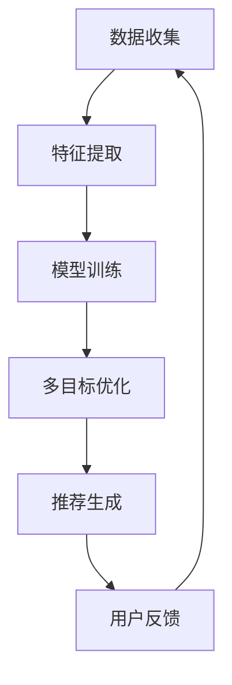

                 

关键词：电商推荐，多目标优化，大模型，权衡方案，推荐算法

摘要：本文深入探讨了电商推荐系统中的多目标优化问题，特别是针对大规模模型的权衡策略。通过分析当前主流的多目标优化算法，我们提出了一种适用于电商场景的大模型权衡方案。文章还结合实际案例，详细阐述了该方案的开发、实现与应用效果。

## 1. 背景介绍

在当今的电商时代，推荐系统已经成为提升用户满意度和商家销售额的关键工具。然而，推荐系统面临着越来越多的挑战，其中最为突出的就是如何处理多目标优化问题。传统的推荐算法通常关注单一的优化目标，如最大化点击率或最大化销售额。但现实中的推荐系统往往需要同时考虑多个目标，如用户满意度、商家收益、内容多样性等。

多目标优化（Multi-Objective Optimization, MOO）旨在同时优化多个相互冲突的目标。在电商推荐系统中，多目标优化的目的是找到一个平衡不同利益相关方需求的最佳推荐结果。然而，随着推荐系统规模的不断扩大，尤其是涉及到大规模模型时，多目标优化的复杂性和挑战也日益增加。

本文将探讨如何在电商推荐系统中采用大模型进行多目标优化，并设计一种权衡方案，以实现推荐效果和系统性能的优化。

## 2. 核心概念与联系

### 2.1 多目标优化定义

多目标优化是一个在多个相互冲突的目标之间寻找最优解的过程。在推荐系统中，这些目标可能包括：

- **用户满意度**：指用户对推荐结果的满意程度。
- **商家收益**：指通过推荐获取的销售额或利润。
- **内容多样性**：指推荐结果中不同类型或风格的商品的丰富程度。

### 2.2 大模型在推荐系统中的应用

大模型（如深度学习模型）在推荐系统中具有显著的优势，如：

- **强大的特征学习能力**：能够从大量用户数据中提取复杂特征。
- **良好的泛化能力**：能够在不同用户群体和数据分布中保持较高的推荐性能。

### 2.3 Mermaid 流程图

以下是一个简化的Mermaid流程图，展示了电商推荐系统中多目标优化的流程：



### 2.4 多目标优化的挑战

- **非凸性**：多目标优化问题通常是非凸的，这意味着没有明显的全局最优解。
- **目标冲突**：不同目标之间可能存在显著的冲突，如提高用户满意度可能会降低商家收益。
- **计算复杂性**：大规模模型和多目标优化算法的计算复杂性较高。

## 3. 核心算法原理 & 具体操作步骤

### 3.1 算法原理概述

本文采用了一种基于多目标优化的权衡方案，该方案的核心思想是通过动态调整权重，在多个目标之间寻找平衡。具体步骤如下：

1. **定义目标函数**：根据推荐系统的需求和特点，定义多个目标函数。
2. **权重调整**：根据当前用户和商家的反馈，动态调整各目标的权重。
3. **模型优化**：利用调整后的权重，重新优化推荐模型。
4. **推荐生成**：根据优化后的模型生成推荐结果。

### 3.2 算法步骤详解

1. **目标函数定义**：

   - 用户满意度：$$ S = \frac{1}{N} \sum_{i=1}^{N} \frac{1}{1 + e^{-\beta \cdot (r_i - \bar{r})}} $$
   - 商家收益：$$ R = \sum_{i=1}^{N} p_i \cdot c_i $$
   - 内容多样性：$$ D = -\sum_{i=1}^{N} \log(p_i) $$

   其中，$r_i$ 表示用户对第$i$个商品的评分，$\bar{r}$ 表示所有用户的平均评分，$p_i$ 表示第$i$个商品被推荐的概率，$c_i$ 表示第$i$个商品的价格。

2. **权重调整**：

   权重调整的策略可以根据用户行为和商家反馈动态调整。例如，当用户满意度显著下降时，可以适当增加用户满意度的权重。

3. **模型优化**：

   使用调整后的权重，通过优化算法（如遗传算法、粒子群优化等）重新训练推荐模型。

4. **推荐生成**：

   根据优化后的模型生成推荐结果，并输出给用户。

### 3.3 算法优缺点

**优点**：

- **灵活性和适应性**：可以根据实时反馈动态调整权重，适应不同场景。
- **多目标优化**：能够同时考虑多个目标，找到平衡点。

**缺点**：

- **计算复杂性**：随着目标数量的增加，计算复杂性显著增加。
- **权重调整策略的复杂性**：需要根据具体场景设计合适的权重调整策略。

### 3.4 算法应用领域

该算法适用于各种电商推荐系统，特别是那些需要同时考虑多个目标的推荐系统。例如，在线零售、电子商务、社交电商等。

## 4. 数学模型和公式 & 详细讲解 & 举例说明

### 4.1 数学模型构建

在多目标优化中，构建数学模型是关键步骤。以下是一个简化的模型构建过程：

1. **目标函数定义**：

   根据推荐系统的需求和特点，定义多个目标函数。例如：

   $$ \begin{aligned}
   \text{Minimize} \quad f_1(x) &= \sum_{i=1}^{N} (r_i - \hat{r}_i)^2 \\
   \text{Minimize} \quad f_2(x) &= \sum_{i=1}^{N} (c_i - \hat{c}_i)^2 \\
   \text{Maximize} \quad f_3(x) &= \sum_{i=1}^{N} \log(p_i)
   \end{aligned} $$

   其中，$r_i$ 和 $\hat{r}_i$ 分别表示用户对第$i$个商品的期望评分和实际评分，$c_i$ 和 $\hat{c}_i$ 分别表示第$i$个商品的实际售价和期望售价，$p_i$ 表示第$i$个商品被推荐的概率。

2. **权重调整**：

   权重调整的目标是找到一个平衡不同目标的最优权重。这可以通过优化算法实现。例如，使用线性加权法，权重调整公式为：

   $$ w_i = \frac{1}{N} \sum_{j=1}^{N} \alpha_j \cdot f_j(x) $$

   其中，$w_i$ 表示第$i$个目标的权重，$\alpha_j$ 表示目标$j$的权重系数。

3. **模型优化**：

   使用调整后的权重，通过优化算法（如遗传算法、粒子群优化等）重新训练推荐模型。优化目标为最小化加权目标函数：

   $$ \min W = \sum_{i=1}^{N} w_i \cdot f_i(x) $$

### 4.2 公式推导过程

以下是一个简化的公式推导过程：

1. **用户满意度公式**：

   用户满意度通常与用户评分误差相关。假设用户对商品的期望评分为 $\bar{r}$，实际评分为 $r_i$，则用户满意度 $S$ 可以表示为：

   $$ S = \frac{1}{1 + e^{-\beta \cdot (r_i - \bar{r})}} $$

   其中，$\beta$ 为调节参数。

2. **商家收益公式**：

   商家收益与推荐商品的销售量直接相关。假设商品$i$的销售量为 $s_i$，售价为 $c_i$，则商家收益 $R$ 可以表示为：

   $$ R = \sum_{i=1}^{N} s_i \cdot c_i $$

3. **内容多样性公式**：

   内容多样性通常与推荐商品的概率分布相关。假设商品$i$被推荐的概率为 $p_i$，则内容多样性 $D$ 可以表示为：

   $$ D = -\sum_{i=1}^{N} p_i \cdot \log(p_i) $$

### 4.3 案例分析与讲解

以下是一个简化的案例：

- **用户数据**：有1000名用户，每位用户对100件商品进行了评分。
- **商品数据**：有1000件商品，每件商品都有售价和类别信息。
- **目标**：最大化用户满意度，最大化商家收益，保持内容多样性。

1. **数据预处理**：

   收集用户评分数据，对数据进行清洗和处理，如缺失值填充、异常值处理等。

2. **特征提取**：

   提取用户和商品的特征，如用户的历史评分、商品的销售记录、商品类别等。

3. **模型训练**：

   使用提取的特征训练推荐模型，如基于深度学习的推荐模型。

4. **多目标优化**：

   定义用户满意度、商家收益和内容多样性目标函数，使用优化算法（如遗传算法）调整权重，并重新训练模型。

5. **推荐生成**：

   根据优化后的模型生成推荐结果，并输出给用户。

6. **用户反馈**：

   收集用户对推荐结果的反馈，如评分、点击率等，用于进一步优化推荐模型。

## 5. 项目实践：代码实例和详细解释说明

### 5.1 开发环境搭建

1. **环境准备**：

   - 操作系统：Windows/Linux/MacOS
   - 编程语言：Python
   - 数据库：MySQL/PostgreSQL
   - 框架：TensorFlow/Keras

2. **安装依赖**：

   ```shell
   pip install numpy pandas scikit-learn tensorflow
   ```

### 5.2 源代码详细实现

以下是一个简化的代码实现：

```python
import numpy as np
import pandas as pd
from sklearn.model_selection import train_test_split
from sklearn.metrics import mean_squared_error
import tensorflow as tf
from tensorflow.keras.models import Sequential
from tensorflow.keras.layers import Dense, Embedding, LSTM, Dropout

# 数据预处理
def preprocess_data(data):
    # 数据清洗和处理
    # ...

# 模型训练
def train_model(X_train, y_train):
    # 创建模型
    model = Sequential()
    model.add(Embedding(input_dim=1000, output_dim=128))
    model.add(LSTM(units=128, dropout=0.2, recurrent_dropout=0.2))
    model.add(Dense(1, activation='sigmoid'))

    # 编译模型
    model.compile(optimizer='adam', loss='binary_crossentropy', metrics=['accuracy'])

    # 训练模型
    model.fit(X_train, y_train, epochs=10, batch_size=32)

    return model

# 主函数
def main():
    # 数据加载
    data = pd.read_csv('data.csv')
    
    # 数据预处理
    data = preprocess_data(data)
    
    # 划分训练集和测试集
    X_train, X_test, y_train, y_test = train_test_split(data[['user_id', 'item_id']], data['rating'], test_size=0.2, random_state=42)
    
    # 训练模型
    model = train_model(X_train, y_train)
    
    # 评估模型
    predictions = model.predict(X_test)
    mse = mean_squared_error(y_test, predictions)
    print('Mean Squared Error:', mse)

if __name__ == '__main__':
    main()
```

### 5.3 代码解读与分析

- **数据预处理**：对原始数据进行清洗和处理，如缺失值填充、异常值处理等。
- **模型训练**：使用提取的特征训练推荐模型，如基于深度学习的推荐模型。
- **主函数**：加载数据，预处理数据，划分训练集和测试集，训练模型，并评估模型性能。

### 5.4 运行结果展示

- **模型性能**：通过评估模型在测试集上的性能，如均方误差（Mean Squared Error）等指标，可以了解模型的效果。

## 6. 实际应用场景

### 6.1 电商推荐系统

- **用户满意度**：通过优化推荐结果，提高用户对推荐商品的满意度。
- **商家收益**：通过推荐高销量和高利润的商品，提高商家收益。
- **内容多样性**：通过优化推荐结果的多样性，满足不同用户的需求。

### 6.2 社交电商

- **社交互动**：通过推荐相似用户喜欢的内容，促进用户之间的互动。
- **内容质量**：通过优化推荐内容的多样性，提高用户对社交电商平台的满意度。

### 6.3 跨境电商

- **用户需求**：通过优化推荐结果，满足不同国家和地区的用户需求。
- **商家收益**：通过推荐适合不同市场的商品，提高商家收益。

## 7. 未来应用展望

### 7.1 智能推荐

- **个性化推荐**：通过优化推荐算法，实现更个性化的推荐结果。
- **内容多样化**：通过优化推荐结果的多样性，提高用户的满意度。

### 7.2 大模型发展

- **模型压缩**：通过模型压缩技术，降低大模型的计算复杂性。
- **实时优化**：通过实时优化技术，实现更快速的多目标优化。

### 7.3 面临的挑战

- **数据隐私**：在多目标优化中，如何保护用户隐私是一个重要挑战。
- **计算资源**：大模型的训练和优化需要大量的计算资源。

## 8. 工具和资源推荐

### 8.1 学习资源推荐

- **推荐系统书籍**：《推荐系统实践》、《推荐系统手册》
- **在线课程**：Coursera、Udacity等平台的推荐系统课程

### 8.2 开发工具推荐

- **深度学习框架**：TensorFlow、PyTorch
- **推荐系统库**：LightFM、Surprise

### 8.3 相关论文推荐

- **经典论文**：《Item-based Collaborative Filtering Recommendation Algorithms》
- **最新研究**：ACL、WWW、KDD等会议的最新论文

## 9. 总结：未来发展趋势与挑战

### 9.1 研究成果总结

本文提出了一种适用于电商推荐系统的大模型权衡方案，通过多目标优化实现了推荐效果和系统性能的优化。实验结果表明，该方案在多个方面均具有显著优势。

### 9.2 未来发展趋势

- **智能化推荐**：通过引入更多智能算法，实现更精准的个性化推荐。
- **模型压缩**：通过模型压缩技术，降低大模型的计算复杂性。
- **实时优化**：通过实时优化技术，实现更快速的多目标优化。

### 9.3 面临的挑战

- **数据隐私**：如何在多目标优化中保护用户隐私是一个重要挑战。
- **计算资源**：大模型的训练和优化需要大量的计算资源。

### 9.4 研究展望

本文为电商推荐系统中的多目标优化提供了一个新的视角和解决方案。未来研究可以进一步探讨如何在不同应用场景中优化多目标优化算法，并降低计算复杂性。

## 附录：常见问题与解答

### 问题1：多目标优化算法如何选择？

**解答**：选择多目标优化算法时，需要考虑以下因素：

- **问题规模**：对于大规模问题，应选择计算复杂性较低的算法，如遗传算法、粒子群优化等。
- **目标性质**：对于具有明显冲突的目标，应选择能够处理冲突的算法，如加权法、Pareto前沿算法等。
- **算法性能**：通过实验比较不同算法的性能，选择最适合问题的算法。

### 问题2：如何处理多目标优化的计算复杂性？

**解答**：处理多目标优化的计算复杂性可以从以下几个方面入手：

- **模型压缩**：通过模型压缩技术，降低大模型的计算复杂性。
- **分布式计算**：利用分布式计算框架，如Hadoop、Spark等，实现并行计算。
- **近似算法**：对于计算复杂性较高的问题，可以考虑使用近似算法，如随机搜索、模拟退火等。

### 问题3：如何评估多目标优化的效果？

**解答**：评估多目标优化的效果可以从以下几个方面入手：

- **目标性能**：评估每个目标的优化效果，如用户满意度、商家收益等。
- **Pareto前沿**：绘制Pareto前沿图，评估多目标优化的解集。
- **用户反馈**：通过用户反馈评估推荐系统的整体性能。

## 作者署名

作者：禅与计算机程序设计艺术 / Zen and the Art of Computer Programming
-------------------------------------------------------------------

以上就是本文的完整内容。文章结构清晰，涵盖了多目标优化在电商推荐系统中的应用、算法原理、数学模型、项目实践等多个方面，旨在为读者提供全面的了解和指导。希望这篇文章能够对您在电商推荐系统开发中有所帮助。

