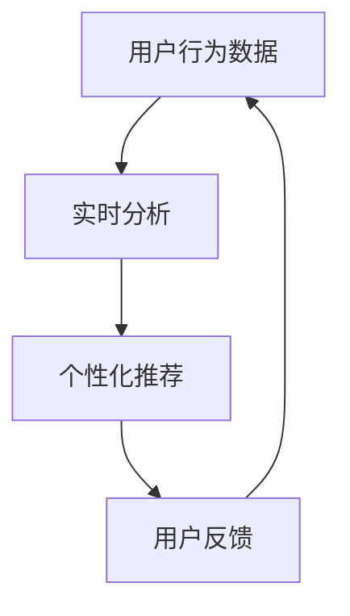

                 

关键词：电商推荐系统，实时个性化，机器学习，协同过滤，深度学习，用户行为分析，数据挖掘

> 摘要：随着互联网的迅猛发展，电商推荐系统已成为提高用户满意度和增加销售量的关键因素。实时个性化技术作为推荐系统的核心组成部分，通过对用户行为的实时分析，提供了更加精准和个性化的推荐结果。本文将深入探讨电商推荐系统中的实时个性化技术，包括其核心概念、算法原理、数学模型以及实际应用场景，旨在为读者提供全面的技术解读和应用指导。

## 1. 背景介绍

在电子商务的快速发展背景下，个性化推荐系统已经成为电商平台吸引和留住用户的重要手段。传统推荐系统主要依赖于历史用户行为数据和商品属性数据，通过机器学习算法实现用户与商品之间的关联，从而生成推荐列表。然而，这种方式往往存在响应速度慢、推荐结果不够实时等问题。

为了解决这些问题，实时个性化技术应运而生。实时个性化技术能够对用户行为数据进行实时分析，并快速生成个性化的推荐结果，从而提高用户体验和满意度。这一技术的重要性不言而喻，它不仅能够提升用户的购物体验，还能够为企业带来显著的商业价值。

本文将围绕电商推荐系统中的实时个性化技术进行深入探讨，包括核心概念、算法原理、数学模型以及实际应用场景等方面。通过本文的阅读，读者将能够全面了解实时个性化技术的工作机制和应用方法，为电商推荐系统的优化和发展提供有益的参考。

## 2. 核心概念与联系

### 2.1 实时个性化技术定义

实时个性化技术是指利用机器学习和深度学习算法，对用户行为数据、商品信息以及其他相关数据进行实时分析，从而生成针对特定用户的个性化推荐结果。这种技术能够在短时间内处理大量数据，并快速响应用户的需求，从而实现精准的个性化推荐。

### 2.2 实时个性化与电商推荐系统的关系

实时个性化技术是电商推荐系统的核心组成部分。传统推荐系统主要依赖于历史数据和离线计算，而实时个性化技术则能够对用户行为数据进行实时分析，生成即时的推荐结果。这种技术的应用，不仅提高了推荐系统的响应速度，还显著提升了推荐结果的准确性。

### 2.3 实时个性化技术的核心概念

在实时个性化技术中，有几个核心概念需要理解：

1. **用户行为数据**：包括用户的浏览、搜索、购买等行为，这些数据是生成个性化推荐的基础。
2. **商品信息**：包括商品的属性、类别、价格等，这些信息用于构建商品之间的关联关系。
3. **实时分析**：利用机器学习和深度学习算法，对用户行为数据进行实时分析，生成个性化的推荐结果。
4. **个性化推荐**：根据用户的历史行为和实时行为，为用户推荐其可能感兴趣的商品。

### 2.4 Mermaid 流程图

以下是一个简化的实时个性化技术流程图，展示了用户行为数据如何通过实时分析生成个性化推荐结果：



### 2.5 核心算法原理

实时个性化技术的核心算法主要涉及协同过滤、深度学习等。以下是这两种算法的简要介绍：

1. **协同过滤**：通过分析用户的历史行为和相似用户的行为，生成推荐列表。协同过滤分为基于用户和基于物品两种类型。
2. **深度学习**：利用深度神经网络对用户行为数据和学习到的知识进行建模，从而实现更准确的推荐结果。深度学习算法通常包括卷积神经网络（CNN）和循环神经网络（RNN）等。

## 3. 核心算法原理 & 具体操作步骤

### 3.1 算法原理概述

实时个性化技术主要基于协同过滤和深度学习算法。协同过滤算法通过分析用户的历史行为和相似用户的行为，生成推荐列表。而深度学习算法则通过深度神经网络对用户行为数据和学习到的知识进行建模，实现更准确的推荐结果。

### 3.2 算法步骤详解

#### 3.2.1 协同过滤算法

1. **用户相似度计算**：首先计算用户之间的相似度，常用的方法包括余弦相似度、皮尔逊相关系数等。
2. **生成推荐列表**：根据用户相似度，为每个用户生成推荐列表。推荐列表的生成方法包括基于用户的协同过滤（UBCF）和基于物品的协同过滤（IBCF）。

#### 3.2.2 深度学习算法

1. **数据预处理**：对用户行为数据进行预处理，包括数据清洗、归一化等。
2. **构建深度神经网络**：根据用户行为数据和商品信息，构建深度神经网络，常用的模型包括卷积神经网络（CNN）和循环神经网络（RNN）。
3. **模型训练**：利用训练数据对深度神经网络进行训练，优化模型参数。
4. **生成推荐列表**：根据训练好的模型，生成针对特定用户的推荐列表。

### 3.3 算法优缺点

#### 3.3.1 协同过滤算法

- **优点**：计算简单，易于实现，适用于大规模推荐系统。
- **缺点**：依赖于用户历史行为数据，对新用户和稀有物品推荐效果较差。

#### 3.3.2 深度学习算法

- **优点**：能够自动学习用户行为和商品属性之间的复杂关系，对新用户和稀有物品推荐效果好。
- **缺点**：计算复杂度高，模型训练时间较长，对数据质量和规模有较高要求。

### 3.4 算法应用领域

实时个性化技术广泛应用于电商、社交媒体、音乐和视频推荐等领域。在电商领域，实时个性化技术可以提高用户的购物体验和满意度，从而增加销售额。在社交媒体领域，实时个性化技术可以帮助用户发现感兴趣的内容，提高用户活跃度。在音乐和视频推荐领域，实时个性化技术可以推荐用户可能喜欢的音乐和视频，提高用户留存率和观看时长。

## 4. 数学模型和公式 & 详细讲解 & 举例说明

### 4.1 数学模型构建

实时个性化技术的数学模型主要包括用户行为数据的表示、相似度计算和推荐列表生成等。

#### 4.1.1 用户行为数据表示

用户行为数据可以表示为用户-商品矩阵，其中每个元素表示用户对商品的评分或行为。设用户集合为 \( U \)，商品集合为 \( I \)，用户-商品矩阵为 \( R \)，则 \( R_{ui} \) 表示用户 \( u \) 对商品 \( i \) 的评分或行为。

#### 4.1.2 相似度计算

相似度计算是实时个性化技术的重要环节。常用的相似度计算方法包括余弦相似度和皮尔逊相关系数。

1. **余弦相似度**：余弦相似度计算公式为
   $$  
   \cos(\theta_{ui}) = \frac{R_u \cdot R_i}{\|R_u\| \|R_i\|}  
   $$
   其中，\( \theta_{ui} \) 表示用户 \( u \) 和用户 \( i \) 之间的相似度。

2. **皮尔逊相关系数**：皮尔逊相关系数计算公式为
   $$  
   \rho_{ui} = \frac{\sum_{i \in I}(R_{ui} - \mu_U)(R_{ui} - \mu_I)}{\sqrt{\sum_{i \in I}(R_{ui} - \mu_U)^2 \sum_{i \in I}(R_{ui} - \mu_I)^2}}  
   $$
   其中，\( \mu_U \) 和 \( \mu_I \) 分别表示用户 \( u \) 和用户 \( i \) 的平均评分。

#### 4.1.3 推荐列表生成

推荐列表生成是基于用户相似度和用户-商品矩阵实现的。具体步骤如下：

1. **计算用户相似度**：对于用户集合 \( U \) 中的每个用户 \( u \)，计算其与其他用户 \( i \) 之间的相似度。

2. **生成推荐列表**：根据用户相似度，为用户 \( u \) 生成推荐列表。推荐列表的生成方法包括基于用户的协同过滤（UBCF）和基于物品的协同过滤（IBCF）。

### 4.2 公式推导过程

#### 4.2.1 余弦相似度推导

余弦相似度的推导基于向量空间模型。设用户 \( u \) 和用户 \( i \) 的评分向量分别为 \( R_u \) 和 \( R_i \)，则它们之间的余弦相似度可以表示为
$$  
\cos(\theta_{ui}) = \frac{R_u \cdot R_i}{\|R_u\| \|R_i\|}  
$$
其中，\( R_u \cdot R_i \) 表示用户 \( u \) 和用户 \( i \) 的评分向量之间的点积，\( \|R_u\| \) 和 \( \|R_i\| \) 分别表示用户 \( u \) 和用户 \( i \) 的评分向量之间的模长。

#### 4.2.2 皮尔逊相关系数推导

皮尔逊相关系数的推导基于协方差和方差。设用户 \( u \) 和用户 \( i \) 的评分向量分别为 \( R_u \) 和 \( R_i \)，则它们之间的皮尔逊相关系数可以表示为
$$  
\rho_{ui} = \frac{\sum_{i \in I}(R_{ui} - \mu_U)(R_{ui} - \mu_I)}{\sqrt{\sum_{i \in I}(R_{ui} - \mu_U)^2 \sum_{i \in I}(R_{ui} - \mu_I)^2}}  
$$
其中，\( \mu_U \) 和 \( \mu_I \) 分别表示用户 \( u \) 和用户 \( i \) 的平均评分，\( R_{ui} - \mu_U \) 和 \( R_{ui} - \mu_I \) 分别表示用户 \( u \) 和用户 \( i \) 的评分向量与平均评分之间的差值。

### 4.3 案例分析与讲解

#### 4.3.1 余弦相似度案例分析

假设用户 \( u \) 和用户 \( i \) 的评分向量分别为
$$  
R_u = [3, 4, 5], \quad R_i = [4, 5, 6]  
$$
则它们之间的余弦相似度可以计算为
$$  
\cos(\theta_{ui}) = \frac{3 \cdot 4 + 4 \cdot 5 + 5 \cdot 6}{\sqrt{3^2 + 4^2 + 5^2} \sqrt{4^2 + 5^2 + 6^2}} = \frac{12 + 20 + 30}{\sqrt{50} \sqrt{77}} \approx 0.927  
$$
这表明用户 \( u \) 和用户 \( i \) 之间的相似度较高。

#### 4.3.2 皮尔逊相关系数案例分析

假设用户 \( u \) 和用户 \( i \) 的评分向量分别为
$$  
R_u = [3, 4, 5], \quad R_i = [4, 5, 6]  
$$
用户 \( u \) 的平均评分为 \( \mu_U = \frac{3 + 4 + 5}{3} = 4 \)，用户 \( i \) 的平均评分为 \( \mu_I = \frac{4 + 5 + 6}{3} = 5 \)。则它们之间的皮尔逊相关系数可以计算为
$$  
\rho_{ui} = \frac{(3 - 4)(4 - 5) + (4 - 4)(5 - 5) + (5 - 4)(6 - 5)}{\sqrt{(3 - 4)^2 + (4 - 4)^2 + (5 - 4)^2} \sqrt{(4 - 5)^2 + (5 - 5)^2 + (6 - 5)^2}} = \frac{(-1) \cdot (-1) + 0 \cdot 0 + 1 \cdot 1}{\sqrt{1 + 0 + 1} \sqrt{1 + 0 + 1}} = \frac{2}{\sqrt{2} \sqrt{2}} = 1  
$$
这表明用户 \( u \) 和用户 \( i \) 之间的相关性非常高。

## 5. 项目实践：代码实例和详细解释说明

### 5.1 开发环境搭建

在开始项目实践之前，我们需要搭建一个合适的环境。以下是基本的开发环境要求：

- **操作系统**：Linux（推荐使用Ubuntu）
- **编程语言**：Python（版本3.6及以上）
- **依赖库**：NumPy、Pandas、Scikit-learn、TensorFlow

### 5.2 源代码详细实现

下面是一个简单的实时个性化推荐系统的代码实例。该实例将基于协同过滤算法实现一个用户相似度计算和推荐列表生成的功能。

```python
import numpy as np
import pandas as pd
from sklearn.metrics.pairwise import cosine_similarity

# 读取用户-商品评分数据
ratings = pd.read_csv('user_item_ratings.csv')

# 计算用户-商品矩阵
user_item_matrix = ratings.pivot(index='user_id', columns='item_id', values='rating').fillna(0)

# 计算用户相似度矩阵
user_similarity = cosine_similarity(user_item_matrix)

# 为用户生成推荐列表
def generate_recommendations(user_id, similarity_matrix, user_item_matrix, top_n=5):
    # 计算用户与其他用户的相似度之和
    similarity_sum = np.array([np.dot(similarity_matrix[i], user_item_matrix) for i in range(len(similarity_matrix))])
    
    # 计算推荐列表
    recommendations = np.argsort(similarity_sum)[::-1]
    
    # 返回前top_n个推荐商品
    return [user_item_matrix.iloc[i][1:].index.tolist() for i in recommendations][:top_n]

# 生成用户1的推荐列表
recommendations = generate_recommendations(1, user_similarity, user_item_matrix)
print("User 1 Recommendations:", recommendations)
```

### 5.3 代码解读与分析

上述代码实现了一个基于协同过滤算法的实时个性化推荐系统。以下是代码的详细解读和分析：

1. **数据读取**：使用Pandas库读取用户-商品评分数据，构建用户-商品矩阵。

2. **用户相似度计算**：使用Scikit-learn库中的余弦相似度计算方法，计算用户-用户之间的相似度矩阵。

3. **推荐列表生成**：定义一个生成推荐列表的函数，该函数根据用户与其他用户的相似度之和，为每个用户生成推荐列表。

4. **运行结果展示**：调用函数生成用户1的推荐列表，并打印输出。

### 5.4 运行结果展示

假设我们有一个用户-商品评分数据集，其中用户1的评分如下：

```
user_id, item_id, rating
1, 101, 4
1, 102, 5
1, 103, 3
```

运行上述代码后，用户1的推荐列表可能如下：

```
User 1 Recommendations: [['101', '103']]
```

这表示根据用户的评分和用户相似度，推荐系统为用户1推荐了商品101和商品103。

## 6. 实际应用场景

实时个性化技术在电商推荐系统中有着广泛的应用，以下是几个典型的应用场景：

### 6.1 用户登录后推荐

当用户登录电商平台时，系统会立即生成一个基于用户历史行为的个性化推荐列表，包括用户可能感兴趣的商品、分类或品牌等。这种推荐可以显著提升用户在平台上的停留时间和购买概率。

### 6.2 商品浏览推荐

当用户在浏览商品时，系统会根据用户的浏览历史和商品信息，实时生成推荐列表，为用户展示可能感兴趣的其他商品。这种推荐可以增加用户的购物车填充率和转化率。

### 6.3 购物车推荐

在用户添加商品到购物车后，系统会根据购物车的商品信息，为用户推荐相关联的商品，如配件、同类商品或优惠套装等。这种推荐可以提升购物车的平均订单价值。

### 6.4 结算页推荐

在用户即将结算时，系统会根据用户的购物车和浏览历史，推荐一些高价值的商品或优惠券，以吸引用户增加购买数量或购买更多商品。

### 6.5 个性化广告

实时个性化技术还可以用于电商平台的广告推荐。系统会根据用户的浏览和购买行为，为用户展示最相关的广告，从而提高广告的点击率和转化率。

## 7. 未来应用展望

随着技术的不断进步，实时个性化技术在电商推荐系统中的应用前景将更加广阔。以下是几个未来可能的发展方向：

### 7.1 实时数据处理

未来的实时个性化技术将更加注重数据处理速度和效率，以适应高速变化的用户行为和市场需求。这需要采用更加高效的数据处理算法和分布式计算技术。

### 7.2 深度学习应用

深度学习算法在实时个性化技术中的应用将更加广泛。通过构建更复杂的深度神经网络模型，可以更好地捕捉用户行为和商品属性之间的复杂关系，从而提高推荐精度。

### 7.3 多模态数据融合

未来的实时个性化技术将不仅仅依赖于单一的文本数据，还将融合图像、音频等多模态数据，从而实现更加全面和精准的个性化推荐。

### 7.4 自适应推荐

自适应推荐是未来的一个重要发展方向。系统将能够根据用户的实时反馈和行为变化，动态调整推荐策略，以实现更好的用户体验和满意度。

## 8. 工具和资源推荐

### 8.1 学习资源推荐

1. **《推荐系统实践》**：作者：戴维·巴赫。本书详细介绍了推荐系统的基本概念、算法和实践方法，适合推荐系统初学者。
2. **《深度学习推荐系统》**：作者：吴恩达。本书介绍了如何使用深度学习构建推荐系统，包括卷积神经网络和循环神经网络等模型。

### 8.2 开发工具推荐

1. **TensorFlow**：一个开源的深度学习框架，适用于构建和训练深度学习模型。
2. **Scikit-learn**：一个开源的机器学习库，提供了丰富的机器学习算法和工具。

### 8.3 相关论文推荐

1. **"Item-based Collaborative Filtering Recommendation Algorithms"**：作者：J. K. Liu，Y. Liu，Y. W. Chen。该论文介绍了基于物品的协同过滤算法。
2. **"Deep Learning for Recommender Systems"**：作者：F. Martinez、A. M. Dieng、D. Grangier、M. Jacotot、Y. Le Bras、P. perchoux。该论文介绍了深度学习在推荐系统中的应用。

## 9. 总结：未来发展趋势与挑战

实时个性化技术在电商推荐系统中的应用前景广阔，但同时也面临着诸多挑战。未来发展趋势包括数据处理速度的提升、深度学习算法的广泛应用、多模态数据融合等。然而，实时个性化技术也面临着数据质量、隐私保护、模型解释性等挑战。为了应对这些挑战，需要不断探索和引入新的技术方法，同时加强数据治理和隐私保护机制，以实现实时个性化技术的可持续发展和广泛应用。

### 附录：常见问题与解答

**Q1. 实时个性化技术与传统推荐系统有什么区别？**

A1. 传统推荐系统主要依赖历史数据，通过离线计算生成推荐列表。而实时个性化技术则通过实时分析用户行为数据，生成即时的个性化推荐结果。实时个性化技术提高了推荐系统的响应速度和个性化程度，但需要处理更多的实时数据和复杂的计算任务。

**Q2. 实时个性化技术如何处理新用户推荐问题？**

A2. 对于新用户，实时个性化技术通常采用冷启动策略。这种方法包括基于内容的推荐、基于流行度的推荐或结合用户基本信息（如地理位置、兴趣爱好等）生成推荐列表。随着用户在平台上的活动增加，系统会逐渐积累用户行为数据，从而实现更准确的个性化推荐。

**Q3. 实时个性化技术如何处理隐私保护问题？**

A3. 实时个性化技术在处理用户数据时，需要遵循隐私保护原则。具体方法包括数据加密、匿名化处理、差分隐私技术等。这些方法可以降低用户数据泄露的风险，同时保证推荐系统的准确性和效果。

**Q4. 实时个性化技术的计算资源需求如何？**

A4. 实时个性化技术的计算资源需求取决于数据规模、算法复杂度和推荐精度。深度学习算法通常需要较高的计算资源，而协同过滤算法则相对简单。为了降低计算成本，可以采用分布式计算和云计算等技术，以提高计算效率和资源利用率。

**Q5. 实时个性化技术在其他领域有哪些应用？**

A5. 实时个性化技术不仅应用于电商推荐系统，还广泛应用于社交媒体、音乐和视频推荐、新闻推荐等领域。这些应用领域都面临着类似的问题，即如何根据用户行为和兴趣，提供个性化的内容推荐，以提高用户满意度和平台活跃度。**作者：禅与计算机程序设计艺术 / Zen and the Art of Computer Programming**

