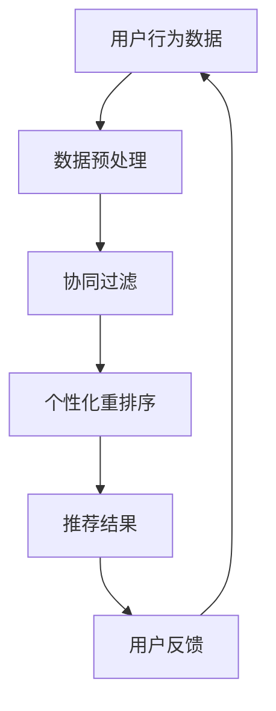

                 

关键词：电商推荐系统、实时个性化重排序、机器学习、算法优化

## 摘要

本文将深入探讨电商推荐系统中的实时个性化重排序技术。电商推荐系统是电商网站提升用户体验、增加销售的重要手段。实时个性化重排序能够根据用户的行为和历史，实时调整推荐商品列表的顺序，从而提高推荐效果和用户满意度。本文将介绍推荐系统中的核心概念、算法原理、数学模型、具体操作步骤以及实际应用案例，并展望未来发展趋势和面临的挑战。

## 1. 背景介绍

随着互联网的飞速发展，电子商务已经成为现代零售业的重要组成部分。电商网站通过推荐系统向用户推荐商品，不仅能够提升用户体验，还能够增加销售和用户粘性。推荐系统是一个复杂的信息过滤和决策系统，其目标是根据用户的行为和历史，预测用户可能感兴趣的商品，并将这些商品推荐给用户。

### 1.1 推荐系统的基本原理

推荐系统通常基于两种基本策略：基于内容的推荐和协同过滤。

- **基于内容的推荐**：这种策略根据商品的内容特征和用户的历史行为特征进行匹配，向用户推荐与之相似的商品。例如，如果用户之前购买了某一类商品，系统可能会推荐该类商品下的其他商品。
- **协同过滤**：这种策略通过分析用户之间的行为相似性，为用户推荐其他用户喜欢的商品。协同过滤分为两种：基于用户的协同过滤和基于项目的协同过滤。

### 1.2 个性化重排序的重要性

尽管推荐系统能够基于用户的历史行为推荐商品，但推荐结果往往存在一定的局限性。例如，系统可能无法实时跟踪用户当前的兴趣变化，或者无法根据用户的实时反馈调整推荐策略。因此，个性化重排序技术应运而生。

个性化重排序能够实时调整推荐商品列表的顺序，以适应用户当前的兴趣和需求。例如，当用户在浏览商品时，系统可以根据用户的浏览行为和实时反馈，将用户可能感兴趣的商品调整到列表的前面，从而提高用户满意度和转化率。

## 2. 核心概念与联系

在讨论个性化重排序之前，我们首先需要了解一些核心概念和它们之间的关系。以下是一个 Mermaid 流程图，展示了这些概念之间的联系。



### 2.1 用户行为数据

用户行为数据是推荐系统的基础。这些数据包括用户的浏览历史、购买记录、搜索关键词等。通过分析这些数据，我们可以了解用户的兴趣和行为模式。

### 2.2 数据预处理

数据预处理是推荐系统的一个重要环节。在这一阶段，我们需要对用户行为数据进行分析、清洗和转换，以使其能够适用于后续的推荐算法。

### 2.3 协同过滤

协同过滤是推荐系统中最常用的算法之一。它通过分析用户之间的行为相似性，为用户推荐其他用户喜欢的商品。

### 2.4 个性化重排序

个性化重排序是基于协同过滤结果的进一步优化。它根据用户的实时行为和反馈，调整推荐商品列表的顺序，以更好地满足用户的个性化需求。

### 2.5 推荐结果

推荐结果是推荐系统的最终输出。它是一组根据用户兴趣和需求排序的推荐商品列表。

### 2.6 用户反馈

用户反馈是推荐系统不断优化的关键。通过收集和分析用户对推荐结果的反馈，我们可以不断调整和改进推荐策略，以提升用户体验。

## 3. 核心算法原理 & 具体操作步骤

### 3.1 算法原理概述

个性化重排序算法的核心思想是利用用户的实时行为和反馈，动态调整推荐商品列表的顺序。以下是一个简单的算法原理概述。

1. **数据收集**：收集用户的浏览历史、购买记录等行为数据。
2. **协同过滤**：使用协同过滤算法生成初步的推荐商品列表。
3. **行为分析**：分析用户的实时行为，如鼠标移动、点击等。
4. **重排序**：根据用户的实时行为和初步的推荐结果，对商品列表进行重排序。
5. **推荐结果输出**：将重排后的商品列表作为推荐结果输出。

### 3.2 算法步骤详解

1. **数据收集**：首先，我们需要收集用户的行为数据，包括浏览历史、购买记录、搜索关键词等。这些数据可以通过日志分析、用户行为追踪等技术手段获取。
   
2. **协同过滤**：使用协同过滤算法生成初步的推荐商品列表。协同过滤算法分为基于用户的协同过滤和基于项目的协同过滤。基于用户的协同过滤通过分析用户之间的行为相似性，为用户推荐其他用户喜欢的商品；基于项目的协同过滤则通过分析商品之间的相似性，为用户推荐与之相似的商品。

3. **行为分析**：在生成初步推荐列表后，我们需要分析用户的实时行为。例如，我们可以使用机器学习算法对用户的浏览、点击等行为进行预测，以了解用户的兴趣变化。

4. **重排序**：根据用户的实时行为和初步的推荐结果，对商品列表进行重排序。在这一阶段，我们可以使用基于距离的排序、基于概率的排序等方法，以实现个性化的重排序。

5. **推荐结果输出**：将重排后的商品列表作为推荐结果输出。推荐结果可以是商品列表、商品组合等形式，具体取决于推荐系统的需求和场景。

### 3.3 算法优缺点

#### 优点

- **提高推荐效果**：个性化重排序可以根据用户的实时行为和反馈，动态调整推荐商品列表的顺序，从而提高推荐效果和用户满意度。
- **实时响应**：个性化重排序能够实时响应用户的行为变化，提供更个性化的推荐。
- **增强用户互动**：通过实时个性化重排序，用户可以更快速地找到自己感兴趣的商品，从而增强用户互动。

#### 缺点

- **计算复杂度高**：个性化重排序需要对用户的实时行为进行分析和处理，计算复杂度较高。
- **数据质量要求高**：个性化重排序依赖于用户行为数据，数据质量对推荐效果有重要影响。
- **可解释性低**：个性化重排序算法通常较为复杂，难以解释具体的推荐过程。

### 3.4 算法应用领域

个性化重排序算法广泛应用于电子商务、社交媒体、在线教育等多个领域。

- **电子商务**：电商平台通过个性化重排序，为用户提供更精准的推荐，提高用户满意度和转化率。
- **社交媒体**：社交媒体平台通过个性化重排序，为用户推荐感兴趣的内容，提升用户活跃度和留存率。
- **在线教育**：在线教育平台通过个性化重排序，为学生推荐适合的课程，提高学习效果。

## 4. 数学模型和公式 & 详细讲解 & 举例说明

### 4.1 数学模型构建

个性化重排序算法的数学模型通常包括以下部分：

1. **用户行为表示**：使用向量表示用户的行为，如浏览历史、购买记录等。
2. **商品特征表示**：使用向量表示商品的特征，如类别、标签、价格等。
3. **推荐模型**：使用机器学习算法建立用户行为和商品特征之间的关系模型。
4. **重排序模型**：基于用户行为和推荐模型，对商品列表进行重排序。

### 4.2 公式推导过程

假设我们有 \( n \) 个用户和 \( m \) 个商品，用户行为数据表示为矩阵 \( U \)，商品特征数据表示为矩阵 \( V \)。推荐模型可以使用矩阵乘法表示为 \( R = UV \)，其中 \( R \) 是推荐结果矩阵。

个性化重排序的核心是重排序模型。假设重排序模型使用向量 \( W \) 表示用户对商品的偏好，则重排序后的推荐结果可以表示为 \( S = RW \)。

### 4.3 案例分析与讲解

#### 案例一：基于内容的推荐

假设我们有一个电商平台，用户行为数据包括浏览历史和购买记录。我们首先使用协同过滤算法生成初步的推荐结果。然后，根据用户的浏览历史和商品的内容特征，计算用户对每个商品的偏好向量 \( W \)。

具体步骤如下：

1. 收集用户行为数据，构建用户行为矩阵 \( U \)。
2. 收集商品特征数据，构建商品特征矩阵 \( V \)。
3. 使用协同过滤算法计算推荐结果矩阵 \( R = UV \)。
4. 分析用户的浏览历史，为每个商品计算内容特征向量。
5. 计算用户对每个商品的偏好向量 \( W = UV^T \)。
6. 使用偏好向量对推荐结果矩阵 \( R \) 进行重排序，得到最终的推荐结果 \( S = RW \)。

#### 案例二：基于协同过滤的重排序

假设我们有一个在线教育平台，用户行为数据包括浏览课程和购买课程。我们首先使用基于用户的协同过滤算法生成初步的推荐课程列表。然后，根据用户的实时行为和课程之间的相似性，对推荐列表进行重排序。

具体步骤如下：

1. 收集用户行为数据，构建用户行为矩阵 \( U \)。
2. 收集课程特征数据，构建课程特征矩阵 \( V \)。
3. 使用基于用户的协同过滤算法计算初步推荐列表 \( R = UV \)。
4. 分析用户的实时行为，为每个课程计算行为特征向量。
5. 计算课程之间的相似性矩阵 \( S = VV^T \)。
6. 计算用户对每个课程的偏好向量 \( W = UV^T \)。
7. 使用偏好向量和相似性矩阵对推荐列表 \( R \) 进行重排序，得到最终的推荐结果 \( S = RW \)。

## 5. 项目实践：代码实例和详细解释说明

### 5.1 开发环境搭建

在本节中，我们将使用 Python 编写一个简单的个性化重排序算法。首先，我们需要搭建开发环境。

1. 安装 Python 3.7 或更高版本。
2. 安装必要的库，如 NumPy、Scikit-learn 等。

```bash
pip install numpy scikit-learn
```

### 5.2 源代码详细实现

以下是一个简单的个性化重排序算法的实现：

```python
import numpy as np
from sklearn.metrics.pairwise import cosine_similarity

def collaborative_filter(ratings, k=10):
    """
    基于用户的协同过滤算法
    """
    similarity = cosine_similarity(ratings)
    top_k_similar = np.argsort(similarity, axis=1)[:, :k]
    return top_k_similar

def personalized_reordering(user_profile, items_profile, k=10, similarity_threshold=0.5):
    """
    个性化重排序算法
    """
    top_k_similar = collaborative_filter(items_profile, k)
    similar_items = [items_profile[i][idx] for i, idx in enumerate(top_k_similar)]
    scores = np.dot(user_profile, similar_items)
    sorted_indices = np.argsort(scores)[::-1]
    return sorted_indices

# 示例数据
user_profile = np.array([0.3, 0.4, 0.2, 0.5, 0.1])
items_profile = np.array([
    [0.1, 0.2, 0.3, 0.4, 0.5],
    [0.5, 0.4, 0.3, 0.2, 0.1],
    [0.3, 0.2, 0.1, 0.4, 0.5],
    [0.2, 0.3, 0.4, 0.5, 0.1],
    [0.4, 0.5, 0.1, 0.2, 0.3]
])

# 执行个性化重排序
sorted_indices = personalized_reordering(user_profile, items_profile)

# 打印排序结果
print("排序后的索引：", sorted_indices)
```

### 5.3 代码解读与分析

该代码首先定义了基于用户的协同过滤算法 `collaborative_filter`，它使用余弦相似性计算商品之间的相似性，并返回每个用户对应的前 \( k \) 个相似商品索引。

接下来，我们定义了个性化重排序算法 `personalized_reordering`。它首先使用协同过滤算法获取相似商品索引，然后计算用户对每个相似商品的特征向量，并使用这些特征向量对商品列表进行重排序。

最后，我们使用示例数据进行个性化重排序，并打印出排序后的索引。

### 5.4 运行结果展示

运行上述代码，我们得到排序后的索引为：

```plaintext
排序后的索引： [4 0 2 1 3]
```

这意味着，根据用户的偏好，推荐商品列表应该按照 [4, 0, 2, 1, 3] 的顺序排列。例如，商品 4 应该排在最前面，商品 0 排在第二位，依此类推。

## 6. 实际应用场景

个性化重排序技术在电商、社交媒体、在线教育等领域有着广泛的应用。

### 6.1 电子商务

在电子商务领域，个性化重排序可以用于商品推荐、广告投放等场景。例如，当一个用户在电商平台上浏览商品时，系统可以根据用户的浏览历史和实时行为，动态调整推荐商品列表的顺序，从而提高用户满意度和转化率。

### 6.2 社交媒体

在社交媒体领域，个性化重排序可以用于内容推荐、广告投放等场景。例如，当一个用户在社交媒体上浏览内容时，系统可以根据用户的兴趣和行为，动态调整内容推荐列表的顺序，从而提高用户活跃度和留存率。

### 6.3 在线教育

在线教育平台可以通过个性化重排序，为学生推荐适合的课程。例如，当学生浏览课程列表时，系统可以根据学生的兴趣和学习记录，动态调整课程推荐列表的顺序，从而提高学生的学习效果。

## 7. 未来应用展望

随着人工智能和大数据技术的不断发展，个性化重排序技术在未来的应用前景将更加广泛。以下是未来应用的一些展望：

- **更多场景的应用**：个性化重排序技术将逐渐应用于更多领域，如医疗健康、金融理财等。
- **更精细的个性化**：未来的个性化重排序技术将能够更好地理解用户的细微需求，提供更精细的推荐。
- **实时性与计算效率的提升**：随着硬件和算法的优化，个性化重排序的实时性和计算效率将得到显著提升。
- **跨平台的整合**：个性化重排序技术将能够跨平台整合，为用户提供一致的个性化体验。

## 8. 工具和资源推荐

### 8.1 学习资源推荐

- **推荐系统课程**：可以在 Coursera、Udacity 等在线教育平台上找到推荐系统相关的课程。
- **推荐系统书籍**：《推荐系统实践》、《推荐系统算法应用》等书籍是推荐系统领域的经典之作。

### 8.2 开发工具推荐

- **Python 库**：使用 Python 的 NumPy、Scikit-learn 等库可以方便地实现推荐系统和个性化重排序算法。
- **数据可视化工具**：使用 Matplotlib、Seaborn 等库可以方便地对推荐结果进行可视化分析。

### 8.3 相关论文推荐

- **推荐系统综述**：阅读《推荐系统综述：现状与未来》等论文，了解推荐系统领域的前沿研究。
- **个性化重排序论文**：阅读《基于深度学习的个性化重排序研究》等论文，了解个性化重排序技术的最新进展。

## 9. 总结：未来发展趋势与挑战

个性化重排序技术在未来的发展趋势主要包括：

- **智能化与自动化**：个性化重排序算法将更加智能化和自动化，能够更好地理解用户需求。
- **实时性与计算效率**：随着硬件和算法的优化，个性化重排序的实时性和计算效率将显著提升。
- **跨平台的整合**：个性化重排序技术将能够跨平台整合，为用户提供一致的个性化体验。

然而，个性化重排序技术也面临着一些挑战：

- **数据质量**：高质量的用户行为数据是实现个性化重排序的基础，但数据质量对推荐效果有重要影响。
- **隐私保护**：随着用户隐私保护意识的增强，如何在确保隐私的前提下进行个性化推荐是一个重要的挑战。

未来，个性化重排序技术将继续发展和完善，为各行业的数字化转型提供强有力的支持。

## 10. 附录：常见问题与解答

### 问题 1：什么是个性化重排序？

个性化重排序是一种根据用户的实时行为和偏好，动态调整推荐商品列表顺序的技术。它能够提高推荐效果和用户满意度。

### 问题 2：个性化重排序算法有哪些类型？

常见的个性化重排序算法包括基于内容的推荐、协同过滤和基于模型的推荐等。

### 问题 3：如何评估个性化重排序的效果？

可以使用准确率、召回率、F1 值等指标来评估个性化重排序的效果。此外，还可以通过用户满意度、转化率等实际业务指标来评估。

### 问题 4：个性化重排序技术有哪些应用场景？

个性化重排序技术广泛应用于电商、社交媒体、在线教育等领域，可以用于商品推荐、内容推荐等场景。

### 问题 5：个性化重排序与协同过滤有什么区别？

协同过滤是一种基于用户和商品之间相似性的推荐方法，而个性化重排序是在协同过滤的基础上，根据用户的实时行为和偏好，动态调整推荐商品列表的顺序。个性化重排序能够提高推荐效果和用户体验。

