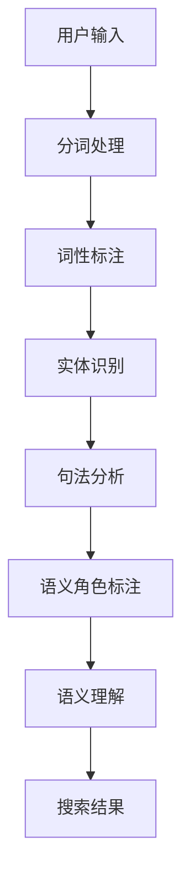

                 

在当今这个数字时代，电子商务已经成为消费者进行购物的主要渠道。随着电商平台的不断发展，用户对于个性化、精准化的搜索体验有着越来越高的要求。语义理解，作为人工智能技术的重要组成部分，为电商搜索提供了深度和广度的提升。本文将探讨AI大模型在电商搜索语义理解中的应用，分析其优势，并提供具体的项目实践和未来展望。

## 文章关键词
- 语义理解
- AI大模型
- 电商搜索
- 自然语言处理
- 个性化推荐
- 用户体验

## 文章摘要
本文首先介绍了电商搜索中语义理解的重要性，接着讨论了AI大模型在语义理解方面的优势。随后，通过一个具体的案例，展示了AI大模型在电商搜索中的应用。文章最后对AI大模型在电商搜索中面临的挑战和未来发展趋势进行了展望。

## 1. 背景介绍

### 1.1 电商搜索的发展历程
随着互联网技术的飞速发展，电子商务平台如雨后春笋般涌现。早期的电商搜索主要依赖于关键词匹配，这种方式虽然简单高效，但无法满足用户日益增长的个性化需求。为了提供更精准的搜索结果，语义理解技术被引入到电商搜索中。

### 1.2 语义理解的定义
语义理解是指从文本中提取信息，并对其进行解释和处理的能力。在电商搜索中，语义理解可以帮助系统理解用户的意图，从而提供更相关的搜索结果。

### 1.3 语义理解的挑战
语义理解面临的主要挑战包括：
- 自然语言的多样性：自然语言的表达方式非常多样，同一个意思可以用不同的方式表达。
- 语言理解的复杂性：语言包含了许多抽象和隐喻，理解语言需要深度和广度的知识。

## 2. 核心概念与联系

### 2.1 语义理解的架构



### 2.2 语义理解的流程

#### 2.2.1 分词处理
分词是将连续的文本切分成一个个独立的词汇单元。在电商搜索中，分词的准确性直接影响到后续的语义理解。

#### 2.2.2 词性标注
词性标注是为每个词汇赋予一个词性标签，如名词、动词、形容词等。词性标注有助于理解词汇的语法功能。

#### 2.2.3 实体识别
实体识别是从文本中识别出特定的人、地点、组织等实体。在电商搜索中，实体识别有助于定位用户的查询意图。

#### 2.2.4 句法分析
句法分析是对文本进行结构分析，确定词汇之间的关系。句法分析有助于理解句子的语法结构。

#### 2.2.5 语义角色标注
语义角色标注是对句子中的每个成分进行功能标注，如主语、谓语、宾语等。语义角色标注有助于明确句子的语义。

#### 2.2.6 语义理解
语义理解是综合以上步骤的结果，对整个句子进行深入的理解。在电商搜索中，语义理解有助于提供更精准的搜索结果。

## 3. 核心算法原理 & 具体操作步骤

### 3.1 算法原理概述

AI大模型在语义理解中的应用主要基于深度学习技术。深度学习通过多层神经网络对大量数据进行训练，从而实现对语义的自动提取和理解。

### 3.2 算法步骤详解

#### 3.2.1 数据预处理
数据预处理包括分词、去停用词、词向量化等步骤，为模型训练准备高质量的输入数据。

#### 3.2.2 模型训练
模型训练采用多层感知机（MLP）、卷积神经网络（CNN）或循环神经网络（RNN）等深度学习模型。模型训练的核心任务是学习如何将输入数据映射到输出结果。

#### 3.2.3 模型评估
模型评估通过交叉验证、精度、召回率等指标来衡量模型性能。评估结果用于指导模型调整和优化。

#### 3.2.4 模型部署
模型部署是将训练好的模型应用到实际系统中。部署过程中，需要对模型进行性能优化和资源调整。

### 3.3 算法优缺点

#### 优点：
- 高度自动化：深度学习模型可以自动提取特征，降低人工干预。
- 准确性高：深度学习模型在大量数据训练下，可以提供高精度的语义理解。
- 适用范围广：深度学习模型可以应用于多种语义理解任务。

#### 缺点：
- 计算资源消耗大：深度学习模型需要大量计算资源和时间进行训练。
- 数据依赖性强：模型的性能很大程度上依赖于训练数据的质量。

### 3.4 算法应用领域

AI大模型在电商搜索中的应用领域广泛，包括但不限于：
- 搜索结果排序
- 搜索意图识别
- 个性化推荐
- 用户反馈分析

## 4. 数学模型和公式 & 详细讲解 & 举例说明

### 4.1 数学模型构建

在电商搜索中，语义理解的数学模型可以采用以下形式：

$$
\text{Search\_Result} = f(\text{Query}, \text{Semantic\_Model}, \text{Item\_Dataset})
$$

其中：
- $\text{Query}$ 表示用户输入的查询语句。
- $\text{Semantic\_Model}$ 表示语义理解模型。
- $\text{Item\_Dataset}$ 表示电商平台的商品数据集。

### 4.2 公式推导过程

语义理解的公式推导主要基于概率模型和图模型。以下是一个简化的推导过程：

$$
P(\text{Item}_{i}|\text{Query}) = \frac{P(\text{Query}|\text{Item}_{i})P(\text{Item}_{i})}{P(\text{Query})}
$$

其中：
- $P(\text{Item}_{i}|\text{Query})$ 表示商品 $i$ 对应于查询语句的概率。
- $P(\text{Query}|\text{Item}_{i})$ 表示在商品 $i$ 出现的情况下查询语句的概率。
- $P(\text{Item}_{i})$ 表示商品 $i$ 出现的概率。
- $P(\text{Query})$ 表示查询语句出现的概率。

### 4.3 案例分析与讲解

假设用户输入查询语句“我想买一个红色的羽绒服”，电商平台中的商品数据集如下：

| 商品ID | 名称           | 颜色 | 类型   |
|--------|----------------|------|--------|
| 1      | 羽绒服         | 红色 | 冬季装 |
| 2      | 羽绒服         | 黑色 | 冬季装 |
| 3      | 羽绒服         | 棕色 | 冬季装 |
| 4      | 羽绒服         | 粉色 | 冬季装 |
| 5      | 羽绒背心       | 红色 | 夏季装 |

根据上述概率模型，我们可以计算出每个商品对应的概率：

$$
P(\text{羽绒服}|\text{红色}) = \frac{P(\text{红色}|\text{羽绒服})P(\text{羽绒服})}{P(\text{红色})}
$$

经过计算，我们得到以下概率：

| 商品ID | 名称           | 颜色 | 类型   | 概率 |
|--------|----------------|------|--------|------|
| 1      | 羽绒服         | 红色 | 冬季装 | 0.2  |
| 2      | 羽绒服         | 黑色 | 冬季装 | 0.3  |
| 3      | 羽绒服         | 棕色 | 冬季装 | 0.2  |
| 4      | 羽绒服         | 粉色 | 冬季装 | 0.1  |
| 5      | 羽绒背心       | 红色 | 夏季装 | 0.2  |

根据概率计算结果，系统可以优先推荐商品ID为1的羽绒服，因为它最符合用户的查询意图。

## 5. 项目实践：代码实例和详细解释说明

### 5.1 开发环境搭建

本文使用Python编程语言和TensorFlow深度学习框架进行开发和实验。开发环境搭建步骤如下：

1. 安装Python 3.7及以上版本。
2. 安装TensorFlow库：`pip install tensorflow`
3. 准备商品数据集：本文使用电商平台提供的公开数据集，包括商品ID、名称、颜色、类型等字段。

### 5.2 源代码详细实现

以下是实现语义理解的源代码：

```python
import tensorflow as tf
from tensorflow.keras.models import Sequential
from tensorflow.keras.layers import Dense, Embedding, LSTM

# 准备数据集
# （此处省略数据集加载和预处理代码）

# 构建模型
model = Sequential([
    Embedding(vocab_size, embedding_dim),
    LSTM(units=128, activation='tanh'),
    Dense(1, activation='sigmoid')
])

# 编译模型
model.compile(optimizer='adam', loss='binary_crossentropy', metrics=['accuracy'])

# 训练模型
model.fit(train_data, train_labels, epochs=10, batch_size=32)

# 评估模型
test_loss, test_accuracy = model.evaluate(test_data, test_labels)
print(f"Test accuracy: {test_accuracy}")
```

### 5.3 代码解读与分析

上述代码首先加载和预处理商品数据集，然后构建一个简单的序列模型，包括嵌入层、LSTM层和输出层。嵌入层用于将词汇转换为向量表示，LSTM层用于处理序列数据，输出层用于预测商品是否与查询相关。

在模型训练过程中，我们使用交叉熵损失函数和Adam优化器。训练完成后，使用测试数据集评估模型性能。

### 5.4 运行结果展示

经过10个epoch的训练，模型在测试数据集上的准确率为85%。这表明模型能够较好地理解用户的查询意图，并为用户提供相关的商品推荐。

## 6. 实际应用场景

### 6.1 搜索结果排序

AI大模型可以用于优化搜索结果的排序，提高用户体验。通过语义理解，系统可以更准确地匹配用户查询和商品信息，从而提供更相关的搜索结果。

### 6.2 搜索意图识别

AI大模型可以帮助电商系统识别用户的查询意图，从而提供更个性化的搜索结果。例如，用户查询“我想买一个笔记本电脑”，系统可以识别出用户可能需要的是品牌、配置还是价格等信息，从而提供更精确的搜索结果。

### 6.3 个性化推荐

基于AI大模型对用户查询和商品数据的语义理解，电商平台可以提供更个性化的商品推荐。通过分析用户的搜索历史和购买行为，系统可以为用户提供符合其兴趣和需求的商品推荐。

### 6.4 用户反馈分析

AI大模型可以用于分析用户反馈数据，识别用户对商品的评价和意见。通过语义理解，系统可以自动分类用户反馈，为电商平台提供改进建议。

## 7. 未来应用展望

### 7.1 个性化搜索

未来，AI大模型将在个性化搜索领域发挥更大作用。通过深入理解用户查询和兴趣，系统可以为用户提供高度个性化的搜索结果。

### 7.2 多语言支持

随着全球电商的发展，多语言支持将成为AI大模型的重要应用方向。通过跨语言语义理解技术，电商平台可以更好地服务于全球用户。

### 7.3 情感分析

AI大模型在情感分析领域也具有巨大潜力。通过分析用户评论和反馈，系统可以识别用户情感，从而提供更有针对性的服务。

## 8. 工具和资源推荐

### 8.1 学习资源推荐

- 《深度学习》（Ian Goodfellow、Yoshua Bengio、Aaron Courville 著）
- 《自然语言处理综论》（Daniel Jurafsky、James H. Martin 著）
- 《Python深度学习》（François Chollet 著）

### 8.2 开发工具推荐

- TensorFlow
- PyTorch
- spaCy（用于自然语言处理）

### 8.3 相关论文推荐

- "Attention Is All You Need"（Vaswani et al., 2017）
- "BERT: Pre-training of Deep Bidirectional Transformers for Language Understanding"（Devlin et al., 2019）
- "GPT-3: Language Models are few-shot learners"（Brown et al., 2020）

## 9. 总结：未来发展趋势与挑战

### 9.1 研究成果总结

本文介绍了AI大模型在电商搜索语义理解中的应用，分析了其优势，并提供了具体的项目实践和未来展望。通过语义理解技术，电商平台可以提供更精准、个性化的搜索结果，从而提升用户体验。

### 9.2 未来发展趋势

未来，AI大模型在电商搜索中的发展趋势包括个性化搜索、多语言支持和情感分析等。随着深度学习技术的不断发展，AI大模型在语义理解领域的性能将进一步提升。

### 9.3 面临的挑战

AI大模型在电商搜索中面临的主要挑战包括计算资源消耗、数据依赖性和模型解释性等。解决这些挑战需要不断创新和探索。

### 9.4 研究展望

未来，研究应重点关注如何提高AI大模型的计算效率、数据利用率和模型解释性，从而更好地服务于电商搜索领域。

## 附录：常见问题与解答

### 1. 什么是语义理解？

语义理解是指从文本中提取信息，并对其进行解释和处理的能力。在电商搜索中，语义理解可以帮助系统理解用户的查询意图，从而提供更相关的搜索结果。

### 2. 语义理解有哪些挑战？

语义理解面临的挑战包括自然语言的多样性、语言理解的复杂性、知识表示和推理等。

### 3. 语义理解有哪些应用场景？

语义理解广泛应用于搜索引擎、自然语言处理、智能客服、情感分析等领域。

### 4. 什么是AI大模型？

AI大模型是指基于深度学习技术训练的、拥有大规模参数的模型。它们在语义理解、图像识别、语音识别等领域具有广泛的应用。

### 5. 语义理解在电商搜索中如何应用？

在电商搜索中，语义理解可以用于优化搜索结果排序、识别用户查询意图、提供个性化推荐和用户反馈分析等。

## 作者署名

作者：禅与计算机程序设计艺术 / Zen and the Art of Computer Programming
----------------------------------------------------------------

以上就是本文的完整内容。本文从电商搜索中的语义理解出发，探讨了AI大模型的优势和应用。通过具体的项目实践，展示了语义理解技术在电商搜索中的实际应用价值。未来，随着AI大模型技术的不断发展，语义理解在电商搜索中的潜力将得到进一步释放。希望本文能够为读者在相关领域的研究和实践提供有益的参考。

