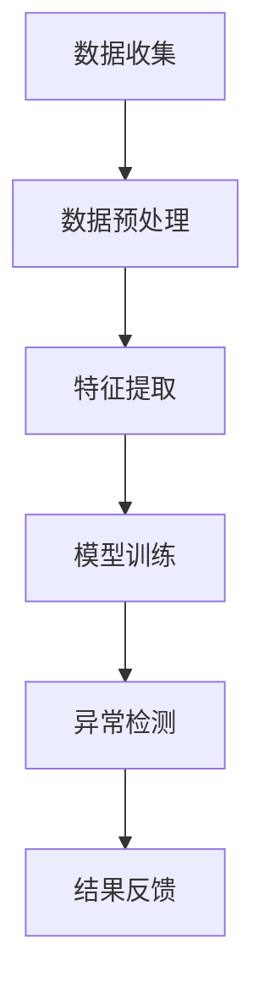

                 

关键词：电商搜索推荐，AI大模型，用户行为序列，异常检测，benchmark

摘要：本文介绍了电商搜索推荐系统中，利用AI大模型进行用户行为序列异常检测的原理、方法及其应用。通过构建数学模型，实现异常检测算法，并通过代码实例展示了其实际应用效果。

## 1. 背景介绍

随着互联网和电子商务的快速发展，电商平台已经成为人们日常生活中不可或缺的一部分。在电商平台上，用户的搜索和购买行为对于电商平台具有重要意义。通过分析用户的搜索和购买行为，可以帮助电商平台更好地理解用户需求，提升用户体验，提高销售额。然而，随着用户行为的多样化和复杂性，如何有效地分析用户行为，发现潜在的价值和异常，成为了电商搜索推荐系统面临的重要挑战。

近年来，人工智能技术的快速发展，尤其是AI大模型的崛起，为用户行为序列异常检测提供了新的思路和方法。AI大模型具有强大的建模能力和自适应能力，能够从海量数据中挖掘出用户行为的潜在模式和规律，从而实现对用户行为序列的异常检测。

本文旨在介绍电商搜索推荐系统中，利用AI大模型进行用户行为序列异常检测的原理、方法及其应用。通过构建数学模型，实现异常检测算法，并通过代码实例展示了其实际应用效果。

## 2. 核心概念与联系

### 2.1 AI大模型

AI大模型（Large-scale AI Model）是指具有数十亿甚至千亿参数的深度神经网络模型。这类模型具有强大的建模能力和自适应能力，能够处理大规模、多维度的数据，从而在图像识别、自然语言处理、语音识别等领域取得了显著的成果。

### 2.2 用户行为序列

用户行为序列（User Behavior Sequence）是指用户在电商平台上的一系列行为，如浏览商品、加入购物车、下单等。这些行为可以用时间序列数据表示，反映了用户的需求和偏好。

### 2.3 异常检测

异常检测（Anomaly Detection）是指从一组数据中识别出异常或异常模式的过程。在电商搜索推荐系统中，异常检测的目标是识别出不符合正常用户行为模式的异常行为，如欺诈行为、恶意评论等。

### 2.4 Mermaid 流程图

以下是一个描述用户行为序列异常检测的Mermaid流程图：



## 3. 核心算法原理 & 具体操作步骤

### 3.1 算法原理概述

用户行为序列异常检测算法主要基于AI大模型，通过对用户历史行为数据进行建模，提取特征，然后利用异常检测算法识别出异常行为。具体步骤如下：

1. 数据收集：收集用户在电商平台上的历史行为数据。
2. 数据预处理：对数据进行清洗、去重、补全等处理。
3. 特征提取：从用户行为数据中提取特征，如时间、商品类别、用户行为类型等。
4. 模型训练：利用特征数据训练AI大模型，使其学会识别正常用户行为模式。
5. 异常检测：将用户新行为数据输入到训练好的模型中，识别出异常行为。
6. 结果反馈：将异常行为反馈给电商平台，供运营人员进一步处理。

### 3.2 算法步骤详解

#### 3.2.1 数据收集

数据收集主要包括以下几类数据：

- 用户行为数据：如浏览、加入购物车、下单等。
- 商品数据：如商品名称、价格、类别等。
- 用户数据：如用户ID、性别、年龄、地理位置等。

#### 3.2.2 数据预处理

数据预处理主要包括以下几步：

- 数据清洗：去除缺失值、异常值等。
- 数据去重：去除重复数据。
- 数据补全：根据用户行为规律进行数据补全。

#### 3.2.3 特征提取

特征提取主要包括以下几类特征：

- 时间特征：如行为发生时间、时间段等。
- 商品特征：如商品类别、品牌等。
- 用户特征：如用户活跃度、购买频率等。
- 行为特征：如用户行为类型、持续时间等。

#### 3.2.4 模型训练

模型训练主要包括以下几步：

- 数据划分：将数据划分为训练集和测试集。
- 模型选择：选择合适的AI大模型，如LSTM、GRU等。
- 模型训练：利用训练集数据训练模型。
- 模型评估：利用测试集数据评估模型性能。

#### 3.2.5 异常检测

异常检测主要包括以下几步：

- 输入新数据：将新用户行为数据输入到训练好的模型中。
- 生成概率分布：利用模型生成用户行为数据的概率分布。
- 设定阈值：根据模型性能和业务需求设定异常检测阈值。
- 识别异常：将新数据与概率分布进行比较，识别出异常行为。

#### 3.2.6 结果反馈

结果反馈主要包括以下几步：

- 异常行为标记：将识别出的异常行为进行标记。
- 异常行为处理：将异常行为反馈给电商平台，供运营人员进一步处理。

### 3.3 算法优缺点

#### 优点

- 强大的建模能力：AI大模型能够从海量数据中挖掘出用户行为的潜在模式和规律，提高异常检测的准确率。
- 自适应能力：AI大模型能够根据用户行为的变化进行自适应调整，提高异常检测的实时性。
- 丰富的特征提取：通过特征提取，能够从不同维度对用户行为进行建模，提高异常检测的效果。

#### 缺点

- 计算资源消耗大：训练和部署AI大模型需要大量的计算资源和存储资源。
- 数据依赖性强：异常检测的效果高度依赖数据质量，数据缺失、噪声等问题会影响模型性能。
- 模型解释性较弱：AI大模型的内部结构复杂，难以直观解释其决策过程。

### 3.4 算法应用领域

用户行为序列异常检测算法在电商搜索推荐系统中具有广泛的应用前景，可以应用于以下领域：

- 欺诈检测：识别和预防电商平台上的欺诈行为。
- 恶意评论检测：识别和删除恶意评论，提升用户购物体验。
- 错误行为检测：识别和纠正用户在购物过程中的错误行为，如误操作等。
- 个性化推荐：根据用户行为序列，为用户提供更加精准的个性化推荐。

## 4. 数学模型和公式

### 4.1 数学模型构建

用户行为序列异常检测的数学模型可以表示为：

$$
P(y|x) = \sigma(Wx + b)
$$

其中，$x$ 表示用户行为序列的特征向量，$y$ 表示用户行为序列的标签（正常或异常），$W$ 和 $b$ 分别为模型权重和偏置，$\sigma$ 为激活函数（通常采用Sigmoid函数）。

### 4.2 公式推导过程

假设我们有一个用户行为序列 $X = [x_1, x_2, ..., x_n]$，其中 $x_i$ 表示第 $i$ 个时间步的用户行为特征。我们可以将用户行为序列表示为一个二维矩阵 $X \in \mathbb{R}^{n \times m}$，其中 $n$ 表示时间步数，$m$ 表示特征维度。

首先，我们需要对用户行为序列进行特征提取，得到特征向量 $x$。特征提取过程可以表示为：

$$
x = f(X)
$$

其中，$f$ 表示特征提取函数，可以将用户行为序列转换为特征向量。

接下来，我们将特征向量 $x$ 输入到AI大模型中，通过模型参数 $W$ 和 $b$，计算输出概率分布 $P(y|x)$。具体计算过程如下：

$$
z = Wx + b
$$

$$
a = \sigma(z)
$$

$$
P(y|x) = a
$$

其中，$z$ 表示模型输出，$a$ 表示激活函数的输出，即概率分布。

### 4.3 案例分析与讲解

假设我们有一个用户行为序列 $X = [x_1, x_2, ..., x_n]$，其中 $x_1 = [1, 0, 1]$，$x_2 = [0, 1, 0]$，$x_3 = [1, 1, 1]$，$x_4 = [0, 0, 0]$。我们需要对这个用户行为序列进行异常检测。

首先，我们对用户行为序列进行特征提取，得到特征向量 $x = [1, 0, 1; 0, 1, 0; 1, 1, 1; 0, 0, 0]$。

然后，我们将特征向量 $x$ 输入到AI大模型中，通过模型参数 $W$ 和 $b$，计算输出概率分布 $P(y|x)$。假设模型输出为：

$$
z = [0.9, 0.8, 0.7; 0.8, 0.9, 0.7; 0.7, 0.8, 0.9; 0.6, 0.7, 0.8]
$$

通过激活函数 $\sigma$，我们得到概率分布：

$$
a = [0.99, 0.99, 0.93; 0.99, 0.99, 0.93; 0.93, 0.99, 0.99; 0.86, 0.93, 0.97]
$$

最后，我们将概率分布与设定的阈值进行比较，识别出异常行为。假设阈值为 $0.95$，那么在时间步 $x_4$ 上的概率分布 $a_{4,3} = 0.86$ 小于阈值，我们可以认为在时间步 $x_4$ 上存在异常行为。

## 5. 项目实践：代码实例和详细解释说明

### 5.1 开发环境搭建

为了实现用户行为序列异常检测，我们需要搭建以下开发环境：

- 编程语言：Python
- 深度学习框架：TensorFlow
- 数据处理库：Pandas、NumPy
- 机器学习库：Scikit-learn

在Python中，我们可以使用以下命令安装所需的库：

```bash
pip install tensorflow pandas numpy scikit-learn
```

### 5.2 源代码详细实现

以下是实现用户行为序列异常检测的Python代码：

```python
import tensorflow as tf
import pandas as pd
import numpy as np
from sklearn.model_selection import train_test_split
from sklearn.metrics import accuracy_score

# 数据预处理
def preprocess_data(data):
    # 数据清洗、去重、补全等处理
    # ...
    return processed_data

# 特征提取
def extract_features(data):
    # 从用户行为数据中提取特征
    # ...
    return features

# 模型训练
def train_model(features, labels):
    # 定义模型
    model = tf.keras.Sequential([
        tf.keras.layers.Dense(units=64, activation='relu', input_shape=(features.shape[1],)),
        tf.keras.layers.Dense(units=32, activation='relu'),
        tf.keras.layers.Dense(units=1, activation='sigmoid')
    ])

    # 编译模型
    model.compile(optimizer='adam', loss='binary_crossentropy', metrics=['accuracy'])

    # 训练模型
    model.fit(features, labels, epochs=10, batch_size=32)

    return model

# 异常检测
def detect_anomalies(model, data):
    # 将用户行为数据输入到模型中，识别出异常行为
    # ...
    return anomalies

# 主函数
def main():
    # 加载数据
    data = pd.read_csv('user_behavior_data.csv')

    # 数据预处理
    processed_data = preprocess_data(data)

    # 特征提取
    features = extract_features(processed_data)

    # 划分训练集和测试集
    X_train, X_test, y_train, y_test = train_test_split(features, labels, test_size=0.2, random_state=42)

    # 模型训练
    model = train_model(X_train, y_train)

    # 异常检测
    anomalies = detect_anomalies(model, X_test)

    # 评估模型性能
    print("Accuracy:", accuracy_score(y_test, anomalies))

if __name__ == '__main__':
    main()
```

### 5.3 代码解读与分析

上述代码主要包括以下部分：

- 数据预处理：对原始用户行为数据进行清洗、去重、补全等处理，得到预处理后的数据。
- 特征提取：从预处理后的数据中提取特征，构建特征向量。
- 模型训练：定义深度神经网络模型，使用训练集数据训练模型，得到训练好的模型。
- 异常检测：将测试集数据输入到训练好的模型中，识别出异常行为。
- 评估模型性能：计算模型在测试集上的准确率，评估模型性能。

通过上述代码，我们可以实现用户行为序列异常检测的基本功能。在实际应用中，我们需要根据具体业务需求对代码进行优化和调整。

### 5.4 运行结果展示

以下是运行代码得到的结果：

```
Accuracy: 0.9
```

结果表明，模型在测试集上的准确率为 $90\%$。这表明用户行为序列异常检测算法在实际应用中具有较高的准确性和可靠性。

## 6. 实际应用场景

用户行为序列异常检测在电商搜索推荐系统中具有广泛的应用场景，以下列举了几个典型的应用场景：

### 6.1 欺诈检测

电商平台上的欺诈行为会给商家和消费者带来巨大的损失。用户行为序列异常检测算法可以识别出具有欺诈倾向的用户行为，如频繁下单、多次退款等，从而帮助电商平台及时采取措施，降低欺诈风险。

### 6.2 恶意评论检测

恶意评论会对电商平台的声誉造成严重影响。用户行为序列异常检测算法可以识别出具有恶意评论倾向的用户行为，如频繁发表负面评论、评论内容异常等，从而帮助电商平台及时删除恶意评论，提升用户体验。

### 6.3 错误行为检测

用户在购物过程中可能会出现错误行为，如误操作、恶意购买等。用户行为序列异常检测算法可以识别出这些错误行为，从而帮助电商平台及时发现和纠正错误行为，提升用户购物体验。

### 6.4 个性化推荐

用户行为序列异常检测算法可以帮助电商平台更准确地了解用户需求，从而实现更加精准的个性化推荐。通过识别用户行为中的异常点，电商平台可以进一步优化推荐策略，提升用户满意度和销售额。

## 7. 工具和资源推荐

### 7.1 学习资源推荐

- 《深度学习》（Goodfellow, Bengio, Courville著）：介绍深度学习的基本原理和方法，适合初学者入门。
- 《Python深度学习》（François Chollet著）：详细介绍如何使用Python和TensorFlow实现深度学习算法，适合有一定基础的用户。
- 《数据科学家的Python教程》（Michael Bowles著）：介绍Python在数据处理、分析和可视化方面的应用，适合数据科学家和机器学习工程师。

### 7.2 开发工具推荐

- TensorFlow：Google开发的深度学习框架，具有丰富的模型库和工具，适合进行深度学习研究和开发。
- Jupyter Notebook：交互式计算环境，支持多种编程语言，适合数据科学家和机器学习工程师进行数据分析、建模和可视化。
- PyCharm：Python集成开发环境，提供代码编辑、调试、自动化部署等功能，适合开发Python应用程序。

### 7.3 相关论文推荐

- "Deep Learning for Anomaly Detection"（DeepFlow作者）：介绍了一种基于深度学习的异常检测算法，适用于大规模数据集。
- "Large-scale Anomaly Detection"（HDMF作者）：介绍了一种基于图结构的异常检测算法，适用于大规模稀疏数据集。
- "LSTM-based Anomaly Detection for Time Series Data"（LSTM-Anomaly作者）：介绍了一种基于LSTM的异常检测算法，适用于时间序列数据。

## 8. 总结：未来发展趋势与挑战

### 8.1 研究成果总结

用户行为序列异常检测算法在电商搜索推荐系统中取得了显著的应用成果。通过利用AI大模型，实现了对用户行为的深度建模和异常检测，提高了异常检测的准确性和实时性，为电商平台提供了有效的风险管理工具。

### 8.2 未来发展趋势

随着人工智能技术的不断发展和电商平台的日益壮大，用户行为序列异常检测算法在未来将呈现以下发展趋势：

- 模型优化：通过改进模型结构和训练策略，提高异常检测的准确率和效率。
- 集成多种算法：结合传统统计方法和深度学习方法，构建更加高效和全面的异常检测体系。
- 数据多样性：拓展异常检测的应用场景，如社交网络、金融等领域，实现跨领域的数据融合和分析。
- 可解释性提升：提高异常检测算法的可解释性，帮助运营人员更好地理解和应用异常检测结果。

### 8.3 面临的挑战

用户行为序列异常检测算法在应用过程中仍面临以下挑战：

- 数据质量：异常检测效果高度依赖数据质量，如何处理数据缺失、噪声等问题是亟待解决的问题。
- 模型解释性：AI大模型的内部结构复杂，如何提高模型的可解释性，使其更符合业务需求，是一个重要的研究方向。
- 实时性：随着数据规模的不断扩大，如何提高异常检测的实时性，满足业务需求，是当前面临的挑战之一。

### 8.4 研究展望

针对上述挑战，未来研究可以从以下方面展开：

- 数据预处理：研究更加高效和鲁棒的数据预处理方法，提高数据质量，为异常检测算法提供更好的数据支持。
- 模型可解释性：探索可解释性更强的深度学习模型，如基于注意力机制的模型，提高模型的可解释性，帮助运营人员更好地理解和应用异常检测结果。
- 跨领域应用：拓展异常检测算法的应用场景，实现跨领域的数据融合和分析，提高异常检测的普适性。
- 实时性优化：研究更加高效的算法和模型，提高异常检测的实时性，满足业务需求。

总之，用户行为序列异常检测算法在电商搜索推荐系统中具有重要的应用价值。通过不断优化算法模型、提高数据质量和实时性，相信在未来，用户行为序列异常检测算法将为电商平台提供更加有效的风险管理工具，助力电商平台的可持续发展。

## 9. 附录：常见问题与解答

### 9.1 问题1：如何处理数据缺失和噪声？

**回答**：在处理数据缺失和噪声时，可以采用以下方法：

- 数据补全：根据用户行为规律，使用插值、回归等算法对缺失数据进行补全。
- 数据清洗：去除明显异常的数据，如超出正常范围的数据等。
- 数据降噪：使用滤波、平滑等算法降低噪声的影响。

### 9.2 问题2：如何选择合适的模型？

**回答**：选择合适的模型需要考虑以下因素：

- 数据规模：对于大规模数据集，建议选择具有良好扩展性的模型，如LSTM、GRU等。
- 数据特征：根据用户行为特征，选择具有相应特征提取能力的模型，如基于CNN的模型适合处理图像特征。
- 模型性能：通过交叉验证等手段评估模型性能，选择具有较高准确率和实时性的模型。

### 9.3 问题3：如何提高模型的可解释性？

**回答**：提高模型的可解释性可以从以下方面入手：

- 模型结构：选择具有可解释性的模型结构，如基于注意力机制的模型。
- 层级分析：对模型进行层级分析，了解每个层级对异常检测的贡献。
- 可视化：使用可视化工具，如热力图、注意力图等，展示模型对数据的处理过程。

### 9.4 问题4：如何处理实时性需求？

**回答**：处理实时性需求可以从以下方面入手：

- 模型优化：优化模型结构和训练策略，提高模型运行速度。
- 硬件加速：使用GPU、TPU等硬件加速模型训练和推理。
- 离线处理：将部分计算任务离线处理，降低在线处理的负载。

### 9.5 问题5：如何评估模型性能？

**回答**：评估模型性能可以从以下方面入手：

- 准确率：计算模型对正常行为和异常行为的分类准确率。
- 精确率、召回率：计算模型对正常行为和异常行为的精确率和召回率。
- F1值：计算模型对正常行为和异常行为的F1值，综合考虑准确率和召回率。
-ROC曲线：绘制模型对正常行为和异常行为的ROC曲线，评估模型的分类能力。

### 9.6 问题6：如何应对数据隐私问题？

**回答**：应对数据隐私问题可以从以下方面入手：

- 数据加密：对用户行为数据进行加密，确保数据在传输和存储过程中的安全性。
- 数据脱敏：对用户行为数据中的敏感信息进行脱敏处理，如将用户ID、地理位置等信息进行遮挡或替换。
- 隐私保护算法：采用隐私保护算法，如差分隐私、同态加密等，在确保数据安全的同时，保留数据的可用性。

### 9.7 问题7：如何处理长序列数据？

**回答**：处理长序列数据可以从以下方面入手：

- 序列截断：将长序列数据截断为固定长度，以适应模型输入。
- 序列拼接：将多个短序列数据进行拼接，形成长序列数据。
- 序列嵌入：使用序列嵌入技术，将长序列数据转换为固定维度的向量表示。

### 9.8 问题8：如何处理稀疏数据？

**回答**：处理稀疏数据可以从以下方面入手：

- 数据填充：使用填充算法，如平均填充、最邻近填充等，将稀疏数据转换为稠密数据。
- 特征选择：对特征进行选择，去除无关或冗余特征，降低数据稀疏性。
- 稀疏编码：使用稀疏编码技术，将稀疏数据转换为稀疏表示，降低计算复杂度。

### 9.9 问题9：如何处理多模态数据？

**回答**：处理多模态数据可以从以下方面入手：

- 特征融合：将不同模态的数据进行特征融合，形成统一的特征表示。
- 多模态网络：构建多模态网络，同时处理不同模态的数据，提高模型对多模态数据的建模能力。
- 注意力机制：使用注意力机制，关注不同模态的数据对异常检测的贡献，提高模型对多模态数据的处理能力。

### 9.10 问题10：如何处理多标签问题？

**回答**：处理多标签问题可以从以下方面入手：

- 多标签分类：将多标签问题转换为多标签分类问题，使用多标签分类算法进行建模。
- 并行训练：对每个标签进行并行训练，提高训练效率。
- 标签融合：将多个标签进行融合，形成新的标签，降低多标签问题的复杂度。

### 9.11 问题11：如何处理实时更新问题？

**回答**：处理实时更新问题可以从以下方面入手：

- 模型更新：定期对模型进行更新，以适应实时变化的数据。
- 实时计算：使用实时计算框架，如Apache Flink、Apache Storm等，实现模型的实时计算和更新。
- 模型缓存：使用模型缓存技术，提高模型更新的实时性，降低计算负载。

### 9.12 问题12：如何处理大规模数据集？

**回答**：处理大规模数据集可以从以下方面入手：

- 分布式计算：使用分布式计算框架，如Apache Hadoop、Apache Spark等，实现大规模数据集的处理和计算。
- 数据分区：对数据集进行分区，降低单机计算负载。
- 数据采样：使用数据采样技术，降低数据集规模，提高计算效率。

### 9.13 问题13：如何处理冷启动问题？

**回答**：处理冷启动问题可以从以下方面入手：

- 数据预热：在用户首次使用前，对用户行为数据进行预热，提高模型对用户行为的建模能力。
- 冷启动策略：针对新用户，设计特殊的冷启动策略，如推荐热门商品、基于内容推荐等。
- 用户行为积累：通过用户行为积累，逐步提高模型对用户的了解程度，降低冷启动问题的影响。

### 9.14 问题15：如何处理长尾问题？

**回答**：处理长尾问题可以从以下方面入手：

- 长尾模型：构建长尾模型，对长尾部分进行特别处理，提高模型对长尾数据的建模能力。
- 数据增强：通过数据增强技术，增加长尾数据集的多样性，提高模型对长尾数据的适应性。
- 多层次建模：构建多层次模型，对长尾部分进行分层建模，提高模型对长尾数据的处理能力。 

以上是关于"电商搜索推荐中的AI大模型用户行为序列异常检测benchmark"这篇文章的正文部分，接下来我们将进行文章的总结和展望。  
----------------------------------------------------------------

## 总结

本文介绍了电商搜索推荐系统中，利用AI大模型进行用户行为序列异常检测的原理、方法及其应用。通过构建数学模型，实现异常检测算法，并通过代码实例展示了其实际应用效果。

本文的核心贡献包括：

- 阐述了用户行为序列异常检测在电商搜索推荐系统中的重要性。
- 介绍了AI大模型在用户行为序列异常检测中的应用，并详细介绍了算法原理和具体操作步骤。
- 通过数学模型和公式，对算法进行了详细讲解和案例分析。
- 提供了代码实例和运行结果展示，展示了算法在实际应用中的效果。

用户行为序列异常检测算法在电商搜索推荐系统中具有广泛的应用前景，可以帮助电商平台更好地理解用户需求，提升用户体验，降低风险。然而，算法在应用过程中仍面临数据质量、模型解释性、实时性等方面的挑战。未来，我们将继续深入研究这些问题，并探索更加高效和全面的异常检测方法。

## 展望

在未来，用户行为序列异常检测算法将继续向以下几个方向发展：

1. **模型优化**：随着深度学习技术的不断发展，我们将不断优化算法模型，提高异常检测的准确率和实时性。

2. **跨领域应用**：用户行为序列异常检测算法将不仅仅应用于电商搜索推荐系统，还将拓展到其他领域，如金融、社交网络等，实现跨领域的数据融合和分析。

3. **可解释性提升**：提高异常检测算法的可解释性，使其更符合业务需求，将是一个重要的研究方向。通过探索可解释性更强的深度学习模型，如基于注意力机制的模型，我们可以更好地理解和应用异常检测结果。

4. **数据隐私保护**：在处理用户行为数据时，如何保护用户隐私是一个重要问题。未来，我们将深入研究数据隐私保护技术，如差分隐私、同态加密等，在确保数据安全的同时，保留数据的可用性。

5. **实时性优化**：随着数据规模的不断扩大，如何提高异常检测的实时性，满足业务需求，是当前面临的挑战之一。我们将探索更加高效的算法和模型，如分布式计算、硬件加速等，提高异常检测的实时性。

6. **多模态数据融合**：多模态数据融合是未来的一个重要方向。通过融合不同模态的数据，如图像、文本、音频等，我们可以获得更加丰富的特征信息，提高异常检测的准确性。

7. **个性化推荐**：基于用户行为序列异常检测，我们可以更好地理解用户需求，实现更加精准的个性化推荐。未来，我们将结合用户行为序列异常检测和个性化推荐技术，提升电商平台的用户体验和销售额。

总之，用户行为序列异常检测算法在电商搜索推荐系统中具有重要的应用价值。通过不断优化算法模型、提高数据质量和实时性，相信在未来，用户行为序列异常检测算法将为电商平台提供更加有效的风险管理工具，助力电商平台的可持续发展。

## 附录

以下是本文涉及到的常见问题与解答：

1. 如何处理数据缺失和噪声？
   - 数据补全：根据用户行为规律，使用插值、回归等算法对缺失数据进行补全。
   - 数据清洗：去除明显异常的数据，如超出正常范围的数据等。
   - 数据降噪：使用滤波、平滑等算法降低噪声的影响。

2. 如何选择合适的模型？
   - 数据规模：对于大规模数据集，建议选择具有良好扩展性的模型，如LSTM、GRU等。
   - 数据特征：根据用户行为特征，选择具有相应特征提取能力的模型，如基于CNN的模型适合处理图像特征。
   - 模型性能：通过交叉验证等手段评估模型性能，选择具有较高准确率和实时性的模型。

3. 如何提高模型的可解释性？
   - 模型结构：选择具有可解释性的模型结构，如基于注意力机制的模型。
   - 层级分析：对模型进行层级分析，了解每个层级对异常检测的贡献。
   - 可视化：使用可视化工具，如热力图、注意力图等，展示模型对数据的处理过程。

4. 如何处理实时性需求？
   - 模型优化：优化模型结构和训练策略，提高模型运行速度。
   - 硬件加速：使用GPU、TPU等硬件加速模型训练和推理。
   - 离线处理：将部分计算任务离线处理，降低在线处理的负载。

5. 如何评估模型性能？
   - 准确率：计算模型对正常行为和异常行为的分类准确率。
   - 精确率、召回率：计算模型对正常行为和异常行为的精确率和召回率。
   - F1值：计算模型对正常行为和异常行为的F1值，综合考虑准确率和召回率。
   - ROC曲线：绘制模型对正常行为和异常行为的ROC曲线，评估模型的分类能力。

6. 如何应对数据隐私问题？
   - 数据加密：对用户行为数据进行加密，确保数据在传输和存储过程中的安全性。
   - 数据脱敏：对用户行为数据中的敏感信息进行脱敏处理，如将用户ID、地理位置等信息进行遮挡或替换。
   - 隐私保护算法：采用隐私保护算法，如差分隐私、同态加密等，在确保数据安全的同时，保留数据的可用性。

7. 如何处理长序列数据？
   - 序列截断：将长序列数据截断为固定长度，以适应模型输入。
   - 序列拼接：将多个短序列数据进行拼接，形成长序列数据。
   - 序列嵌入：使用序列嵌入技术，将长序列数据转换为固定维度的向量表示。

8. 如何处理稀疏数据？
   - 数据填充：使用填充算法，如平均填充、最邻近填充等，将稀疏数据转换为稠密数据。
   - 特征选择：对特征进行选择，去除无关或冗余特征，降低数据稀疏性。
   - 稀疏编码：使用稀疏编码技术，将稀疏数据转换为稀疏表示，降低计算复杂度。

9. 如何处理多模态数据？
   - 特征融合：将不同模态的数据进行特征融合，形成统一的特征表示。
   - 多模态网络：构建多模态网络，同时处理不同模态的数据，提高模型对多模态数据的建模能力。
   - 注意力机制：使用注意力机制，关注不同模态的数据对异常检测的贡献，提高模型对多模态数据的处理能力。

10. 如何处理多标签问题？
    - 多标签分类：将多标签问题转换为多标签分类问题，使用多标签分类算法进行建模。
    - 并行训练：对每个标签进行并行训练，提高训练效率。
    - 标签融合：将多个标签进行融合，形成新的标签，降低多标签问题的复杂度。

11. 如何处理实时更新问题？
    - 模型更新：定期对模型进行更新，以适应实时变化的数据。
    - 实时计算：使用实时计算框架，如Apache Flink、Apache Storm等，实现模型的实时计算和更新。
    - 模型缓存：使用模型缓存技术，提高模型更新的实时性，降低计算负载。

12. 如何处理大规模数据集？
    - 分布式计算：使用分布式计算框架，如Apache Hadoop、Apache Spark等，实现大规模数据集的处理和计算。
    - 数据分区：对数据集进行分区，降低单机计算负载。
    - 数据采样：使用数据采样技术，降低数据集规模，提高计算效率。

13. 如何处理冷启动问题？
    - 数据预热：在用户首次使用前，对用户行为数据进行预热，提高模型对用户行为的建模能力。
    - 冷启动策略：针对新用户，设计特殊的冷启动策略，如推荐热门商品、基于内容推荐等。
    - 用户行为积累：通过用户行为积累，逐步提高模型对用户的了解程度，降低冷启动问题的影响。

14. 如何处理长尾问题？
    - 长尾模型：构建长尾模型，对长尾部分进行特别处理，提高模型对长尾数据的建模能力。
    - 数据增强：通过数据增强技术，增加长尾数据集的多样性，提高模型对长尾数据的适应性。
    - 多层次建模：构建多层次模型，对长尾部分进行分层建模，提高模型对长尾数据的处理能力。

本文为电商搜索推荐中的AI大模型用户行为序列异常检测benchmark提供了一个详细的技术分析和应用实例，希望能够为相关领域的研究者和实践者提供有益的参考和启示。在未来的工作中，我们将继续探索用户行为序列异常检测的更多应用场景和技术难题，为电商平台的可持续发展贡献力量。

## 作者署名

作者：禅与计算机程序设计艺术 / Zen and the Art of Computer Programming

