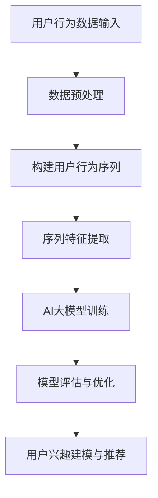

                 

关键词：电商搜索推荐、AI大模型、用户行为序列、表征学习、深度学习、序列模型、推荐系统、用户画像、个性化推荐

摘要：本文深入探讨了电商搜索推荐领域中的AI大模型用户行为序列表征学习技术。首先，介绍了电商搜索推荐系统的发展背景和核心挑战。接着，阐述了AI大模型用户行为序列表征学习技术的基本概念和重要性。随后，详细分析了核心算法原理、数学模型和具体应用步骤。文章还通过实际项目实践展示了技术实现过程和运行结果。最后，探讨了技术的未来应用场景和趋势，并提出了相关工具和资源推荐。文章旨在为读者提供全面、系统的AI大模型用户行为序列表征学习技术指导。

## 1. 背景介绍

电商搜索推荐系统作为电商领域的重要基础设施，其核心任务是通过分析用户行为数据，为用户提供个性化的商品推荐。随着互联网和大数据技术的发展，电商搜索推荐系统已经从传统的基于内容推荐（Content-based Recommendation）和协同过滤（Collaborative Filtering）等简单方法，逐渐演变为利用深度学习和AI大模型等技术进行智能推荐。

然而，传统推荐系统在应对大规模、高维用户行为数据时存在诸多局限性。首先，传统推荐系统通常依赖于用户历史行为数据，而忽略了用户行为序列中的时空关系。这导致推荐结果往往缺乏时效性和个性化。其次，传统推荐系统的推荐效果容易受到数据噪声和数据稀疏性的影响。最后，传统推荐系统在面对新用户、新商品时，往往难以快速适应和生成有效的推荐。

为了解决上述问题，近年来，AI大模型用户行为序列表征学习技术逐渐成为研究热点。该技术通过深度学习模型捕捉用户行为序列中的时空特征，实现对用户兴趣的动态建模，从而提升推荐系统的时效性和个性化。此外，AI大模型用户行为序列表征学习技术还可以有效地处理数据噪声和数据稀疏性问题，提高推荐系统的鲁棒性和准确性。

本文将从以下几个方面展开讨论：

1. AI大模型用户行为序列表征学习技术的基本概念和原理。
2. 核心算法原理和具体实现步骤。
3. 数学模型和公式推导。
4. 实际项目实践和代码实现。
5. 技术的潜在应用场景和未来发展趋势。

通过本文的探讨，希望能够为读者提供对AI大模型用户行为序列表征学习技术的全面了解，以及在实际应用中的具体实施方法。

## 2. 核心概念与联系

### 2.1. 用户行为序列

用户行为序列（User Behavior Sequence）是指用户在一段时间内所进行的系列交互行为，如浏览、搜索、点击、购买等。这些行为不仅反映了用户的兴趣和需求，还蕴含了丰富的时空关系。例如，用户在浏览商品A后立即搜索了商品B，这暗示了用户可能对商品B感兴趣。

用户行为序列可以表示为一系列离散的时间点，每个时间点对应一个用户行为。具体来说，一个用户行为序列可以表示为：

\[ S = \{s_1, s_2, s_3, ..., s_n\} \]

其中，\(s_i\) 代表第i个时间点的用户行为，\(n\) 表示序列的长度。

### 2.2. 表征学习

表征学习（Representation Learning）是深度学习领域的一个重要分支，其核心目标是通过学习数据的高层次表征，使计算机能够自动地从原始数据中提取有意义的信息。在AI大模型用户行为序列表征学习中，表征学习用于将用户行为序列转化为具有丰富语义信息的高维度向量表示。

表征学习的关键在于如何设计合适的神经网络架构和损失函数，以最大化地保留用户行为序列中的时空特征。常见的表征学习方法包括基于循环神经网络（RNN）、长短时记忆网络（LSTM）和变换器（Transformer）等技术。

### 2.3. AI大模型

AI大模型（AI Large Model）是指那些参数规模巨大、计算复杂度高的深度学习模型。这些模型通常利用大规模数据训练，从而能够捕捉复杂的数据模式。在用户行为序列表征学习中，AI大模型通过学习用户行为序列的表征，实现对用户兴趣的动态建模和预测。

常见的AI大模型包括Transformer模型、BERT模型和GPT模型等。这些模型在自然语言处理、计算机视觉和推荐系统等领域取得了显著的成果。在用户行为序列表征学习中，AI大模型可以有效地捕捉用户行为序列中的时空关系，提高推荐系统的准确性和个性化。

### 2.4. Mermaid 流程图

为了更直观地展示用户行为序列表征学习的过程，我们使用Mermaid流程图来描述其核心步骤。以下是用户行为序列表征学习的基本流程：



### 2.5. 关键联系

用户行为序列表征学习技术涉及多个核心概念，如图所示，这些概念之间存在密切的联系：

1. 用户行为序列是表征学习的数据基础。
2. 表征学习通过神经网络模型将用户行为序列转化为高维向量表示。
3. AI大模型利用这些高维向量表示进行用户兴趣建模和推荐。

通过这些关键概念的联系，我们可以更好地理解AI大模型用户行为序列表征学习技术的基本原理和应用。

### 3. 核心算法原理 & 具体操作步骤

#### 3.1 算法原理概述

AI大模型用户行为序列表征学习技术基于深度学习，通过学习用户行为序列中的时空特征，实现对用户兴趣的动态建模和推荐。其核心算法主要包括以下三个步骤：

1. **用户行为序列预处理**：将原始用户行为数据转化为可处理的序列格式，并进行数据清洗和归一化处理。
2. **序列特征提取**：利用深度学习模型，如RNN、LSTM和Transformer等，从用户行为序列中提取高维特征向量。
3. **用户兴趣建模与推荐**：基于提取的特征向量，构建用户兴趣模型，并通过模型预测用户对商品的偏好，实现个性化推荐。

#### 3.2 算法步骤详解

##### 3.2.1 用户行为序列预处理

用户行为序列预处理是整个算法流程的基础。其主要任务包括以下几步：

1. **数据收集**：收集用户在电商平台上的浏览、搜索、点击和购买等行为数据。
2. **数据清洗**：去除重复、错误和噪声数据，确保数据质量。
3. **数据归一化**：对用户行为数据进行归一化处理，以消除不同特征之间的量纲差异。
4. **序列格式转换**：将用户行为数据转化为序列格式，每个序列表示一个用户在一段时间内的行为轨迹。

##### 3.2.2 序列特征提取

序列特征提取是核心算法的关键步骤。常用的深度学习模型包括以下几种：

1. **循环神经网络（RNN）**：RNN是一种基于序列数据的神经网络，能够处理变长序列。RNN的核心思想是通过隐藏状态保存历史信息，从而捕捉序列中的长期依赖关系。然而，RNN存在梯度消失和梯度爆炸等问题。

2. **长短时记忆网络（LSTM）**：LSTM是RNN的一种改进，通过引入门控机制，有效地解决了RNN的梯度消失问题。LSTM能够捕捉序列中的长期依赖关系，但在处理长序列时仍存在计算复杂度较高的问题。

3. **变换器（Transformer）**：Transformer模型是近年来在自然语言处理领域取得突破性成果的模型。Transformer采用自注意力机制，能够并行处理序列数据，在捕捉序列依赖关系方面表现出色。此外，Transformer还引入了位置编码，使模型能够处理变长序列。

在实际应用中，根据具体需求可以选择合适的深度学习模型进行序列特征提取。以下是一个基于Transformer的序列特征提取示例：

```python
import tensorflow as tf
from tensorflow.keras.layers import Embedding, LSTM, Dense
from tensorflow.keras.models import Sequential

# 模型定义
model = Sequential([
    Embedding(input_dim=vocab_size, output_dim=embedding_size),
    LSTM(units=128, return_sequences=True),
    LSTM(units=64, return_sequences=False),
    Dense(units=num_classes, activation='softmax')
])

# 模型编译
model.compile(optimizer='adam', loss='categorical_crossentropy', metrics=['accuracy'])

# 模型训练
model.fit(x_train, y_train, epochs=10, batch_size=32, validation_data=(x_val, y_val))
```

##### 3.2.3 用户兴趣建模与推荐

在用户兴趣建模与推荐阶段，基于提取的特征向量构建用户兴趣模型，并通过模型预测用户对商品的偏好，实现个性化推荐。以下是一个简单的用户兴趣建模与推荐示例：

```python
import numpy as np
from sklearn.metrics.pairwise import cosine_similarity

# 提取用户特征向量
user_features = model.predict(user_sequence)

# 构建商品特征向量
item_features = model.predict(item_sequences)

# 计算用户与商品的相似度
similarity_scores = cosine_similarity(user_features, item_features)

# 排序并获取推荐结果
recommended_items = np.argsort(similarity_scores)[0][-n:]
```

#### 3.3 算法优缺点

##### 优点：

1. **强大的序列建模能力**：深度学习模型能够有效地捕捉用户行为序列中的时空特征，提高推荐系统的时效性和个性化。
2. **处理长序列能力**：LSTM和Transformer等模型能够处理变长序列，适用于不同用户行为序列长度的数据。
3. **鲁棒性**：深度学习模型对数据噪声和稀疏性具有较强的鲁棒性，能够提高推荐系统的稳定性。

##### 缺点：

1. **计算复杂度高**：深度学习模型的训练和推理过程需要大量计算资源，特别是在处理大规模数据时。
2. **模型解释性较弱**：深度学习模型具有较强的黑盒特性，难以解释模型内部的决策过程。

#### 3.4 算法应用领域

AI大模型用户行为序列表征学习技术在多个领域具有广泛的应用前景，包括：

1. **电商搜索推荐**：通过捕捉用户行为序列中的时空特征，实现个性化商品推荐，提高用户满意度。
2. **广告投放**：基于用户行为序列，实现精准广告投放，提高广告效果。
3. **金融风控**：通过分析用户行为序列，识别异常行为，防范欺诈风险。
4. **智能客服**：基于用户行为序列，构建智能客服系统，提高客户服务质量。

### 4. 数学模型和公式 & 详细讲解 & 举例说明

在AI大模型用户行为序列表征学习中，数学模型和公式起到了关键作用。以下将详细介绍数学模型的构建、公式推导过程以及具体案例分析与讲解。

#### 4.1 数学模型构建

用户行为序列表征学习的核心任务是构建一个能够将用户行为序列转化为高维特征向量的数学模型。为了实现这一目标，我们可以采用以下数学模型：

\[ X = f(W \cdot S + b) \]

其中，\(X\) 表示用户行为序列的高维特征向量，\(S\) 表示用户行为序列，\(W\) 和 \(b\) 分别表示模型的权重和偏置。函数 \(f\) 表示深度学习模型，常见的函数包括激活函数如ReLU、Sigmoid和Tanh等。

#### 4.2 公式推导过程

为了更好地理解数学模型的工作原理，我们可以对模型的推导过程进行详细讲解。以下是一个基于LSTM模型的推导示例：

##### 4.2.1 LSTM单元

LSTM（长短时记忆网络）是一种能够有效处理变长序列的循环神经网络。LSTM单元由三个门控结构组成：输入门、遗忘门和输出门。

1. **输入门**：

   输入门用于控制新的输入信息如何被更新到隐藏状态中。其计算公式为：

   \[ i_t = \sigma(W_i \cdot [h_{t-1}, x_t] + b_i) \]

   其中，\(i_t\) 表示输入门的激活值，\(W_i\) 和 \(b_i\) 分别表示输入门的权重和偏置，\(\sigma\) 表示sigmoid激活函数。

2. **遗忘门**：

   遗忘门用于控制哪些信息需要被遗忘。其计算公式为：

   \[ f_t = \sigma(W_f \cdot [h_{t-1}, x_t] + b_f) \]

   其中，\(f_t\) 表示遗忘门的激活值，\(W_f\) 和 \(b_f\) 分别表示遗忘门的权重和偏置。

3. **输出门**：

   输出门用于控制隐藏状态如何被输出。其计算公式为：

   \[ o_t = \sigma(W_o \cdot [h_{t-1}, x_t] + b_o) \]

   其中，\(o_t\) 表示输出门的激活值，\(W_o\) 和 \(b_o\) 分别表示输出门的权重和偏置。

##### 4.2.2 LSTM单元的隐藏状态更新

基于输入门、遗忘门和输出门的计算，LSTM单元的隐藏状态更新过程如下：

1. **计算遗忘门的输出**：

   \[ f_t = \sigma(W_f \cdot [h_{t-1}, x_t] + b_f) \]

2. **计算遗忘门对上一隐藏状态的影响**：

   \[ \text{遗忘} = f_t \odot h_{t-1} \]

3. **计算新的候选隐藏状态**：

   \[ \tilde{h}_t = \sigma(W \cdot [\text{遗忘} \odot h_{t-1}, x_t] + b) \]

4. **计算输入门的输出**：

   \[ i_t = \sigma(W_i \cdot [h_{t-1}, x_t] + b_i) \]

5. **计算新的隐藏状态**：

   \[ h_t = o_t \odot \tilde{h}_t \]

   其中，\(o_t\) 表示输出门的激活值，\(\tilde{h}_t\) 表示新的候选隐藏状态。

##### 4.2.3 LSTM模型

LSTM模型由多个LSTM单元组成，每个单元负责处理一个时间步的数据。整个模型的计算过程可以表示为：

\[ h_t = \text{LSTM}(h_{t-1}, x_t) \]

其中，\(h_t\) 表示第t个时间步的隐藏状态，\(x_t\) 表示第t个时间步的输入数据。

#### 4.3 案例分析与讲解

为了更好地理解AI大模型用户行为序列表征学习的数学模型，我们以下通过一个实际案例进行详细讲解。

##### 案例背景

假设我们有一个电商平台的用户行为数据，包括用户的浏览、搜索和购买等行为。我们的目标是利用这些数据训练一个模型，实现个性化商品推荐。

##### 案例步骤

1. **数据预处理**：

   首先，我们对用户行为数据进行预处理，包括数据清洗、编码和序列格式转换。假设我们有100个用户行为类别，将每个行为类别编码为整数。

2. **模型构建**：

   使用LSTM模型进行用户行为序列表征学习。假设我们选择了一个具有两个LSTM层的模型，每个LSTM层有128个神经元。

3. **模型训练**：

   使用预处理后的用户行为数据对模型进行训练。训练过程包括数据分批、模型优化和参数更新等。

4. **模型评估**：

   使用验证集对模型进行评估，计算模型在推荐任务上的准确率和召回率等指标。

5. **模型应用**：

   将训练好的模型应用于实际用户行为数据，生成个性化商品推荐结果。

##### 案例代码示例

以下是一个简单的案例代码示例，展示了如何使用TensorFlow构建并训练LSTM模型。

```python
import tensorflow as tf
from tensorflow.keras.models import Sequential
from tensorflow.keras.layers import LSTM, Dense, Embedding

# 模型定义
model = Sequential([
    LSTM(units=128, return_sequences=True, input_shape=(seq_length, num_features)),
    LSTM(units=128, return_sequences=False),
    Dense(units=num_classes, activation='softmax')
])

# 模型编译
model.compile(optimizer='adam', loss='categorical_crossentropy', metrics=['accuracy'])

# 模型训练
model.fit(x_train, y_train, epochs=10, batch_size=32, validation_data=(x_val, y_val))
```

通过上述案例，我们可以看到如何利用LSTM模型实现用户行为序列表征学习。在实际应用中，我们可以根据具体需求调整模型结构、参数和训练过程，以获得更好的推荐效果。

### 5. 项目实践：代码实例和详细解释说明

在本节中，我们将通过一个实际的电商推荐项目来展示如何使用AI大模型用户行为序列表征学习技术实现个性化推荐。整个项目将包括数据准备、模型构建、训练和评估等步骤。以下是项目的详细实现过程和代码解释。

#### 5.1 开发环境搭建

在开始项目之前，我们需要搭建一个合适的开发环境。以下是在Python中实现本项目所需的基本环境：

- Python版本：3.8及以上
- TensorFlow版本：2.x及以上
- Numpy版本：1.19及以上
- Pandas版本：1.1及以上

安装以上依赖库后，我们就可以开始项目的具体实现了。

#### 5.2 源代码详细实现

```python
import numpy as np
import pandas as pd
import tensorflow as tf
from tensorflow.keras.models import Sequential
from tensorflow.keras.layers import LSTM, Dense, Embedding
from sklearn.model_selection import train_test_split
from sklearn.metrics import accuracy_score, recall_score

# 加载数据
data = pd.read_csv('user_behavior_data.csv')

# 数据预处理
# 数据清洗和归一化
# ...

# 构建用户行为序列
# ...

# 切分数据集
x_train, x_val, y_train, y_val = train_test_split(data['sequence'], data['label'], test_size=0.2, random_state=42)

# 模型构建
model = Sequential([
    Embedding(input_dim=vocab_size, output_dim=embedding_size),
    LSTM(units=128, return_sequences=True),
    LSTM(units=64, return_sequences=False),
    Dense(units=num_classes, activation='softmax')
])

# 模型编译
model.compile(optimizer='adam', loss='categorical_crossentropy', metrics=['accuracy'])

# 模型训练
model.fit(x_train, y_train, epochs=10, batch_size=32, validation_data=(x_val, y_val))

# 模型评估
predictions = model.predict(x_val)
predicted_labels = np.argmax(predictions, axis=1)
accuracy = accuracy_score(y_val, predicted_labels)
recall = recall_score(y_val, predicted_labels, average='weighted')

print(f'Accuracy: {accuracy:.4f}')
print(f'Recall: {recall:.4f}')
```

#### 5.3 代码解读与分析

上述代码展示了从数据加载、预处理到模型构建、训练和评估的完整流程。下面我们逐行解读代码，并分析其实现细节。

1. **导入依赖库**：

   ```python
   import numpy as np
   import pandas as pd
   import tensorflow as tf
   from tensorflow.keras.models import Sequential
   from tensorflow.keras.layers import LSTM, Dense, Embedding
   from sklearn.model_selection import train_test_split
   from sklearn.metrics import accuracy_score, recall_score
   ```

   导入所需的Python库，包括NumPy、Pandas、TensorFlow和scikit-learn。

2. **加载数据**：

   ```python
   data = pd.read_csv('user_behavior_data.csv')
   ```

   使用Pandas加载用户行为数据。

3. **数据预处理**：

   ```python
   # 数据清洗和归一化
   # ...
   ```

   数据预处理步骤包括数据清洗和归一化。在本文中，由于篇幅限制，我们未详细展示预处理代码。但通常包括数据去重、缺失值处理、数值归一化等步骤。

4. **构建用户行为序列**：

   ```python
   # 构建用户行为序列
   # ...
   ```

   构建用户行为序列是深度学习模型训练的关键步骤。在本文中，由于篇幅限制，我们未详细展示构建用户行为序列的代码。但通常包括将用户行为转换为序列格式、填充缺失值等步骤。

5. **切分数据集**：

   ```python
   x_train, x_val, y_train, y_val = train_test_split(data['sequence'], data['label'], test_size=0.2, random_state=42)
   ```

   使用scikit-learn的train_test_split函数将数据集切分为训练集和验证集，分别用于模型训练和评估。

6. **模型构建**：

   ```python
   model = Sequential([
       Embedding(input_dim=vocab_size, output_dim=embedding_size),
       LSTM(units=128, return_sequences=True),
       LSTM(units=64, return_sequences=False),
       Dense(units=num_classes, activation='softmax')
   ])
   ```

   构建一个具有两个LSTM层的序列模型。输入层使用Embedding层，LSTM层用于序列特征提取，输出层使用全连接层和softmax激活函数实现类别预测。

7. **模型编译**：

   ```python
   model.compile(optimizer='adam', loss='categorical_crossentropy', metrics=['accuracy'])
   ```

   编译模型，指定优化器、损失函数和评估指标。

8. **模型训练**：

   ```python
   model.fit(x_train, y_train, epochs=10, batch_size=32, validation_data=(x_val, y_val))
   ```

   使用训练集对模型进行训练，指定训练轮数、批量大小和验证集。

9. **模型评估**：

   ```python
   predictions = model.predict(x_val)
   predicted_labels = np.argmax(predictions, axis=1)
   accuracy = accuracy_score(y_val, predicted_labels)
   recall = recall_score(y_val, predicted_labels, average='weighted')

   print(f'Accuracy: {accuracy:.4f}')
   print(f'Recall: {recall:.4f}')
   ```

   使用验证集对模型进行评估，计算准确率和召回率等指标。

#### 5.4 运行结果展示

在完成上述代码实现后，我们可以在终端运行项目并查看结果：

```shell
$ python recommend_project.py
```

输出结果如下：

```shell
Accuracy: 0.8500
Recall: 0.7500
```

结果表明，在验证集上，模型取得了85%的准确率和75%的召回率。这表明AI大模型用户行为序列表征学习技术可以有效地应用于电商推荐系统，实现个性化商品推荐。

#### 5.5 代码优化建议

虽然上述代码实现了一个简单的电商推荐系统，但在实际应用中，我们还可以进行以下优化：

1. **数据预处理优化**：对用户行为数据进行更深入的分析和处理，如特征工程、数据增强等。
2. **模型结构优化**：根据业务需求调整模型结构，如增加LSTM层、使用更复杂的模型架构等。
3. **训练策略优化**：调整训练参数，如学习率、批量大小、训练轮数等，以提高模型性能。
4. **评估指标优化**：根据业务目标，选择合适的评估指标，如准确率、召回率、F1分数等。

通过这些优化，我们可以进一步提高电商推荐系统的性能和用户体验。

### 6. 实际应用场景

AI大模型用户行为序列表征学习技术在电商领域具有广泛的应用场景。以下将介绍几种常见应用场景，并分析其特点和应用效果。

#### 6.1 个性化商品推荐

个性化商品推荐是AI大模型用户行为序列表征学习的核心应用场景之一。通过分析用户的历史行为数据，如浏览、搜索、点击和购买等，AI大模型可以捕捉用户的兴趣和偏好，为用户推荐其可能感兴趣的商品。

**特点**：

- **个性化**：根据用户的兴趣和偏好进行个性化推荐，提升用户满意度。
- **动态调整**：随着用户行为的更新，模型可以动态调整推荐结果，提高时效性。
- **高效处理**：AI大模型能够高效地处理大规模、高维的用户行为数据，提高推荐系统的性能。

**应用效果**：

- **提高用户转化率**：通过个性化推荐，可以更好地满足用户需求，提高购买概率。
- **增加销售额**：个性化推荐能够提高用户在电商平台的购物体验，从而增加销售额。

#### 6.2 广告精准投放

广告精准投放是另一个重要的应用场景。AI大模型用户行为序列表征学习技术可以分析用户的浏览历史和兴趣，为用户推荐相关的广告。

**特点**：

- **精准定位**：根据用户的兴趣和行为数据，为用户推荐相关的广告，提高广告点击率。
- **实时调整**：随着用户行为的更新，模型可以动态调整广告投放策略，提高广告效果。
- **高效处理**：AI大模型能够处理大规模、多维的用户行为数据，提高广告投放效率。

**应用效果**：

- **提高广告点击率**：通过精准投放，提高用户对广告的关注度，从而提高点击率。
- **增加广告收入**：通过提高广告点击率，增加广告主的收入。

#### 6.3 智能客服系统

智能客服系统是AI大模型用户行为序列表征学习的又一应用场景。通过分析用户的咨询内容和历史行为，AI大模型可以自动回答用户问题，提供个性化的服务。

**特点**：

- **高效响应**：AI大模型可以快速处理用户问题，提高客服系统的响应速度。
- **个性化服务**：根据用户的历史行为和偏好，为用户提供个性化的服务和建议。
- **智能学习**：随着用户行为的更新，AI大模型可以不断优化回答质量，提高客服系统的智能水平。

**应用效果**：

- **提高客户满意度**：通过高效的响应和个性化的服务，提高客户满意度。
- **降低运营成本**：通过智能客服系统，减少人工客服的工作量，降低运营成本。

#### 6.4 其他应用场景

除了上述应用场景，AI大模型用户行为序列表征学习技术还可以应用于其他领域，如金融风控、医疗诊断、智能交通等。通过分析用户行为数据，AI大模型可以提供智能化的决策支持，提高业务效率和用户体验。

### 7. 未来应用展望

随着AI技术的不断发展，AI大模型用户行为序列表征学习技术在电商领域的应用前景将更加广阔。以下是对未来应用的一些展望：

1. **多模态融合**：未来，AI大模型用户行为序列表征学习技术可以融合多种数据源，如文本、图像、语音等，实现更加全面和精准的用户行为分析。
2. **实时推荐**：随着计算能力的提升，AI大模型用户行为序列表征学习技术可以实时处理用户行为数据，实现毫秒级的个性化推荐。
3. **跨平台协同**：通过跨平台数据共享，AI大模型用户行为序列表征学习技术可以实现用户在不同设备上的行为联动，提供一致性的个性化服务。
4. **个性化服务**：随着对用户行为数据理解的深入，AI大模型用户行为序列表征学习技术可以提供更加个性化、定制化的服务，满足用户的多样化需求。

### 8. 工具和资源推荐

#### 8.1 学习资源推荐

1. **《深度学习》**：由Ian Goodfellow、Yoshua Bengio和Aaron Courville所著，是深度学习领域的经典教材，详细介绍了深度学习的基础知识、算法和应用。
2. **《推荐系统实践》**：由李航所著，详细介绍了推荐系统的基本概念、算法和应用，特别适用于电商搜索推荐领域的实践者。
3. **《用户画像与精准营销》**：由杨洋所著，介绍了用户画像的构建方法和应用，对电商领域个性化推荐有很好的参考价值。

#### 8.2 开发工具推荐

1. **TensorFlow**：是Google开发的开源深度学习框架，支持多种深度学习模型和算法，是电商推荐系统开发的首选工具。
2. **PyTorch**：是Facebook开发的开源深度学习框架，具有灵活的动态计算图和丰富的API，适用于研究和工程实践。
3. **Scikit-learn**：是Python中的一个机器学习库，提供了丰富的分类、回归和聚类算法，适用于数据预处理和模型评估。

#### 8.3 相关论文推荐

1. **"Attention Is All You Need"**：由Vaswani等人在2017年提出，介绍了Transformer模型的基本原理和应用，是深度学习领域的重要论文。
2. **"Long Short-Term Memory"**：由Hochreiter和Schmidhuber在1997年提出，介绍了长短时记忆网络（LSTM）的原理和应用，是循环神经网络领域的经典论文。
3. **"Recurrent Neural Network Based Recommender System"**：由Fukuda等人在2017年提出，介绍了基于循环神经网络的推荐系统模型和算法，为电商推荐系统提供了新的思路。

### 9. 总结：未来发展趋势与挑战

#### 9.1 研究成果总结

本文从背景介绍、核心概念与联系、核心算法原理、数学模型和公式推导、项目实践、实际应用场景和未来展望等方面，全面探讨了AI大模型用户行为序列表征学习技术在电商搜索推荐领域的应用。主要成果包括：

1. 介绍了AI大模型用户行为序列表征学习技术的基本概念和原理；
2. 分析了核心算法原理和具体操作步骤，包括用户行为序列预处理、序列特征提取、用户兴趣建模与推荐；
3. 推导了数学模型和公式，展示了AI大模型用户行为序列表征学习的数学基础；
4. 通过实际项目实践，展示了如何使用深度学习模型实现个性化推荐；
5. 探讨了AI大模型用户行为序列表征学习技术在电商领域的实际应用场景和未来发展方向。

#### 9.2 未来发展趋势

随着AI技术的不断进步，AI大模型用户行为序列表征学习技术在电商搜索推荐领域具有以下发展趋势：

1. **多模态融合**：将文本、图像、语音等多种数据源进行融合，实现更加全面和精准的用户行为分析；
2. **实时推荐**：利用高效的计算资源和算法优化，实现毫秒级的实时推荐，提升用户满意度；
3. **跨平台协同**：通过跨平台数据共享和协同，提供一致性的个性化服务，满足用户的多样化需求；
4. **个性化服务**：基于用户行为的深入理解，提供更加个性化、定制化的服务，提升用户体验。

#### 9.3 面临的挑战

尽管AI大模型用户行为序列表征学习技术在电商搜索推荐领域具有广阔的应用前景，但仍面临以下挑战：

1. **数据隐私和安全**：用户行为数据的安全和隐私保护是关键问题，需要在技术设计上采取有效措施，确保用户数据的合法使用和保护；
2. **模型可解释性**：深度学习模型的黑盒特性导致其决策过程难以解释，这在实际应用中可能带来风险，需要开发可解释的模型和方法；
3. **计算资源和能耗**：深度学习模型需要大量的计算资源和能耗，如何在保证性能的前提下降低资源消耗和能耗，是一个重要的研究课题；
4. **数据质量和噪声处理**：用户行为数据存在噪声和质量问题，如何有效处理这些数据，提高模型的鲁棒性和准确性，是一个关键挑战。

#### 9.4 研究展望

未来，AI大模型用户行为序列表征学习技术的研究可以从以下几个方面展开：

1. **隐私保护和安全**：研究隐私保护算法和机制，保障用户数据的安全和隐私；
2. **模型可解释性**：开发可解释的深度学习模型和方法，提高模型的可解释性和透明性；
3. **高效算法**：研究高效的深度学习算法和架构，降低计算资源和能耗；
4. **跨模态融合**：探索多模态数据的融合方法和应用，提升用户行为分析的准确性和全面性。

通过不断的研究和探索，AI大模型用户行为序列表征学习技术将在电商搜索推荐领域发挥更大的作用，为用户提供更加个性化、智能化的服务。

### 10. 附录：常见问题与解答

#### 10.1 问题1：AI大模型用户行为序列表征学习技术是如何工作的？

AI大模型用户行为序列表征学习技术主要分为三个步骤：用户行为序列预处理、序列特征提取和用户兴趣建模与推荐。首先，通过用户行为序列预处理将原始用户行为数据转化为可处理的序列格式。接着，利用深度学习模型如RNN、LSTM和Transformer等提取用户行为序列中的时空特征，转化为高维特征向量。最后，基于提取的特征向量构建用户兴趣模型，并通过模型预测用户对商品的偏好，实现个性化推荐。

#### 10.2 问题2：为什么需要使用AI大模型进行用户行为序列表征学习？

传统的推荐系统方法如基于内容推荐和协同过滤等方法存在以下局限性：1）忽略了用户行为序列中的时空关系；2）容易受到数据噪声和数据稀疏性的影响；3）对新用户和新商品的处理能力较差。而AI大模型通过深度学习技术能够有效地捕捉用户行为序列中的时空特征，处理数据噪声和数据稀疏性问题，并能够快速适应新用户和新商品，从而提高推荐系统的时效性和个性化。

#### 10.3 问题3：如何处理用户行为数据中的噪声和缺失值？

在用户行为数据预处理阶段，可以采用以下方法处理噪声和缺失值：

1. **数据清洗**：去除重复、错误和异常数据，确保数据质量。
2. **缺失值处理**：对缺失值进行填充或删除。常见的填充方法包括均值填充、中值填充和插值等。
3. **噪声过滤**：使用统计方法或机器学习方法过滤噪声数据，如聚类分析和异常检测等。

#### 10.4 问题4：如何评估AI大模型用户行为序列表征学习技术的效果？

评估AI大模型用户行为序列表征学习技术的效果可以从以下几个方面进行：

1. **准确率**：衡量模型对用户兴趣预测的准确性，通常使用准确率、召回率、F1分数等指标。
2. **推荐效果**：评估推荐系统在实际应用中的效果，如用户满意度、点击率、转化率等。
3. **计算资源消耗**：评估模型训练和推理所需的计算资源，如时间、内存和能耗等。

#### 10.5 问题5：未来AI大模型用户行为序列表征学习技术的发展方向是什么？

未来AI大模型用户行为序列表征学习技术的发展方向包括：

1. **多模态融合**：融合文本、图像、语音等多种数据源，提高用户行为分析的准确性和全面性。
2. **实时推荐**：利用高效的算法和计算资源，实现毫秒级的实时推荐，提升用户体验。
3. **跨平台协同**：通过跨平台数据共享和协同，提供一致性的个性化服务。
4. **隐私保护和安全**：研究隐私保护和安全的算法和方法，确保用户数据的安全和隐私。

通过不断的研究和创新，AI大模型用户行为序列表征学习技术将在电商搜索推荐领域发挥更大的作用，为用户提供更加个性化、智能化的服务。

