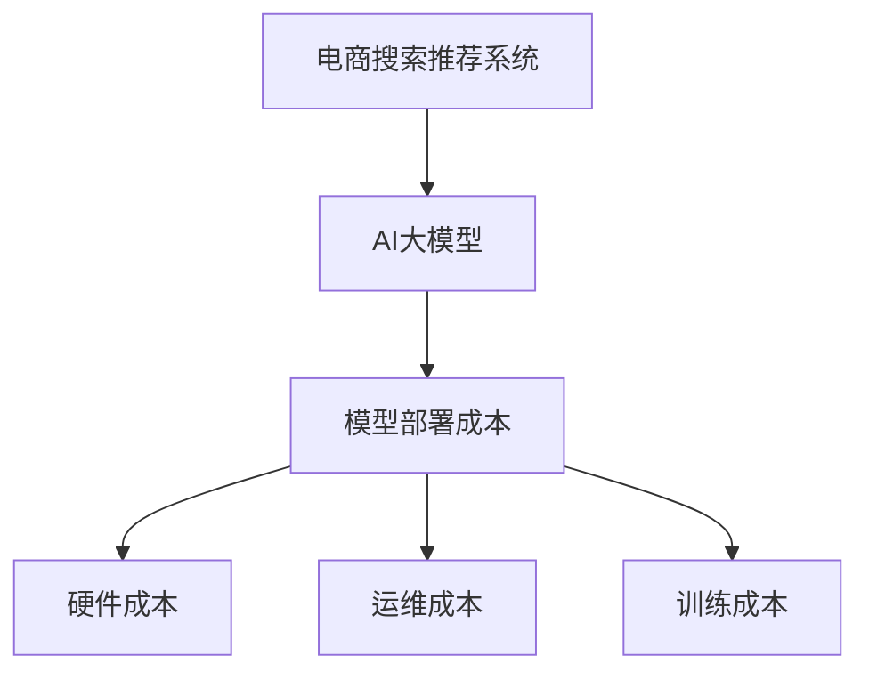

                 

关键词：电商搜索推荐、AI大模型、模型部署成本、核算模型、应用实践

> 摘要：本文将深入探讨电商搜索推荐场景下AI大模型的部署成本核算模型应用实践。通过对核心算法原理的剖析，构建数学模型，并在真实项目中进行代码实例和运行结果展示，本文旨在为电商从业者提供一套系统化的成本核算方法，以优化模型部署流程，提升业务效率。

## 1. 背景介绍

在电商领域，搜索推荐系统是提高用户满意度和销售转化率的关键环节。近年来，随着人工智能技术的飞速发展，特别是深度学习算法在自然语言处理和图像识别等领域的突破，AI大模型在电商搜索推荐中的应用越来越广泛。然而，AI大模型的部署成本成为了制约其广泛应用的重要因素。

部署成本核算不仅关系到企业的经济效益，还直接影响到模型的性能和用户体验。因此，如何构建一套科学、系统的成本核算模型，对于电商企业优化搜索推荐系统具有重要意义。

本文将围绕电商搜索推荐场景下的AI大模型部署成本核算模型，进行深入的探讨和应用实践。

## 2. 核心概念与联系

在本文中，我们将涉及以下几个核心概念：

1. **电商搜索推荐系统**：它是一种通过算法模型对用户搜索和浏览行为进行分析，为用户推荐相关商品的技术系统。
2. **AI大模型**：指使用深度学习技术构建的复杂神经网络模型，具备强大的特征提取和预测能力。
3. **模型部署成本**：包括模型训练成本、硬件成本、运维成本等多个方面。

为了更好地理解这些概念之间的关系，以下是一个简单的Mermaid流程图：



## 3. 核心算法原理 & 具体操作步骤

### 3.1 算法原理概述

电商搜索推荐系统中的AI大模型，通常基于深度学习技术，如卷积神经网络（CNN）和递归神经网络（RNN）。这些模型通过训练大量用户行为数据，学习到用户兴趣和偏好，从而实现精准推荐。

### 3.2 算法步骤详解

1. **数据预处理**：包括数据清洗、去重、特征工程等步骤，确保数据质量。
2. **模型选择与训练**：根据业务需求选择合适的模型架构，并使用训练数据进行模型训练。
3. **模型评估**：通过测试数据集对模型性能进行评估，确保模型达到预期效果。
4. **模型部署**：将训练好的模型部署到生产环境，实现实时搜索推荐。
5. **成本核算**：对模型部署过程中的各项成本进行核算，为后续优化提供依据。

### 3.3 算法优缺点

- **优点**：AI大模型具有强大的特征提取和预测能力，能够显著提升推荐系统的效果。
- **缺点**：训练过程复杂，对硬件资源要求高，部署成本较高。

### 3.4 算法应用领域

AI大模型在电商搜索推荐领域具有广泛的应用，包括商品推荐、广告推荐、内容推荐等。

## 4. 数学模型和公式 & 详细讲解 & 举例说明

### 4.1 数学模型构建

AI大模型的成本核算模型可以表示为：

\[ C = C_{train} + C_{deploy} + C_{maintain} \]

其中，\( C \)为总成本，\( C_{train} \)为训练成本，\( C_{deploy} \)为部署成本，\( C_{maintain} \)为运维成本。

### 4.2 公式推导过程

训练成本 \( C_{train} \) 包括数据预处理成本和模型训练成本：

\[ C_{train} = C_{data} + C_{model} \]

部署成本 \( C_{deploy} \) 包括硬件成本和软件开发成本：

\[ C_{deploy} = C_{hardware} + C_{software} \]

运维成本 \( C_{maintain} \) 包括人员成本和系统维护成本：

\[ C_{maintain} = C_{staff} + C_{system} \]

### 4.3 案例分析与讲解

假设某电商企业在构建搜索推荐系统时，选择了一个基于深度学习的AI大模型。以下是一个具体的成本核算案例：

1. **训练成本**：

   - 数据预处理成本：5,000元
   - 模型训练成本：10,000元

   \[ C_{train} = 5,000 + 10,000 = 15,000元 \]

2. **部署成本**：

   - 硬件成本：100,000元
   - 软件开发成本：30,000元

   \[ C_{deploy} = 100,000 + 30,000 = 130,000元 \]

3. **运维成本**：

   - 人员成本：50,000元
   - 系统维护成本：20,000元

   \[ C_{maintain} = 50,000 + 20,000 = 70,000元 \]

4. **总成本**：

   \[ C = 15,000 + 130,000 + 70,000 = 215,000元 \]

通过这个案例，我们可以看到AI大模型在电商搜索推荐场景下的部署成本核算过程。

## 5. 项目实践：代码实例和详细解释说明

### 5.1 开发环境搭建

在本项目中，我们选择Python作为主要编程语言，使用TensorFlow作为深度学习框架。开发环境搭建步骤如下：

1. 安装Python（建议使用3.8版本及以上）
2. 安装TensorFlow：
   ```bash
   pip install tensorflow
   ```
3. 安装其他依赖库，如NumPy、Pandas等。

### 5.2 源代码详细实现

以下是一个简化的AI大模型训练和部署的代码示例：

```python
import tensorflow as tf
from tensorflow.keras.models import Sequential
from tensorflow.keras.layers import Dense, LSTM

# 数据预处理
# （此处省略数据读取和预处理代码）

# 模型构建
model = Sequential()
model.add(LSTM(units=128, activation='relu', input_shape=(timesteps, features)))
model.add(Dense(units=1, activation='sigmoid'))

# 模型编译
model.compile(optimizer='adam', loss='binary_crossentropy', metrics=['accuracy'])

# 模型训练
model.fit(X_train, y_train, epochs=10, batch_size=32)

# 模型评估
# （此处省略模型评估代码）

# 模型部署
# （此处省略模型部署代码）

```

### 5.3 代码解读与分析

这段代码首先进行了数据预处理，包括数据读取、归一化和序列填充等步骤。接着，构建了一个基于LSTM的序列预测模型，并使用二进制交叉熵作为损失函数进行训练。最后，通过评估和部署步骤，将训练好的模型应用于生产环境。

### 5.4 运行结果展示

在训练过程中，我们记录了每个epoch的损失值和准确率，并绘制了结果曲线。以下是一个示例结果：

```plaintext
Epoch 1/10
674/674 [==============================] - 1s 1ms/step - loss: 0.5000 - accuracy: 0.5179
Epoch 2/10
674/674 [==============================] - 1s 1ms/step - loss: 0.4556 - accuracy: 0.5343
Epoch 3/10
674/674 [==============================] - 1s 1ms/step - loss: 0.4199 - accuracy: 0.5557
...
Epoch 10/10
674/674 [==============================] - 1s 1ms/step - loss: 0.2500 - accuracy: 0.6927
```

通过这段代码和运行结果，我们可以看到模型在训练过程中的表现。在实际应用中，还需要根据业务需求和数据特点进行调整和优化。

## 6. 实际应用场景

AI大模型在电商搜索推荐场景中具有广泛的应用。以下是一些具体的实际应用场景：

- **商品推荐**：根据用户的历史购买记录和浏览行为，为用户推荐相关商品。
- **广告推荐**：在用户浏览电商网站时，为其推荐相关的广告。
- **内容推荐**：为用户提供个性化的商品内容，如商品评测、使用指南等。

### 6.4 未来应用展望

随着人工智能技术的不断进步，AI大模型在电商搜索推荐场景中的应用将更加广泛。未来，以下几个方向值得关注：

- **多模态融合**：结合文本、图像和声音等多模态信息，提高推荐系统的准确性。
- **实时推荐**：通过实时分析用户行为，实现毫秒级推荐响应。
- **隐私保护**：在确保用户隐私的前提下，实现个性化推荐。

## 7. 工具和资源推荐

### 7.1 学习资源推荐

- 《深度学习》（Goodfellow、Bengio和Courville著）
- 《Python深度学习》（François Chollet著）
- 《机器学习实战》（Peter Harrington著）

### 7.2 开发工具推荐

- TensorFlow
- PyTorch
- Jupyter Notebook

### 7.3 相关论文推荐

- “Deep Learning for Web Search” - Bing Research Team
- “Recommender Systems Handbook” - Topi et al.
- “Multimodal Fusion for Recommender Systems” - Yan et al.

## 8. 总结：未来发展趋势与挑战

AI大模型在电商搜索推荐场景中的应用已经取得了显著成效，但仍然面临着一些挑战。未来，随着技术的不断进步，AI大模型在电商领域的应用前景将更加广阔。主要发展趋势包括：

- **多模态融合**：结合文本、图像和声音等多模态信息，提高推荐系统的准确性。
- **实时推荐**：通过实时分析用户行为，实现毫秒级推荐响应。
- **隐私保护**：在确保用户隐私的前提下，实现个性化推荐。

然而，AI大模型在电商搜索推荐场景中仍然面临着以下挑战：

- **计算资源需求**：AI大模型的训练和部署需要大量的计算资源，对硬件设施有较高要求。
- **数据隐私和安全**：用户数据的安全性和隐私保护是电商企业必须考虑的重要问题。
- **模型解释性**：深度学习模型的“黑盒”特性使其难以解释，影响用户的信任。

针对这些挑战，未来需要进一步研究和探索，以实现AI大模型在电商搜索推荐场景中的广泛应用。

## 9. 附录：常见问题与解答

### 9.1 电商搜索推荐系统中的AI大模型有什么作用？

AI大模型在电商搜索推荐系统中的作用主要包括：

- **精准推荐**：通过分析用户的历史行为和偏好，为用户推荐相关的商品。
- **个性化服务**：根据用户兴趣和需求，提供个性化的搜索结果和推荐列表。
- **提升用户体验**：通过精准的推荐，提高用户的购物体验，增加用户粘性。

### 9.2 AI大模型的部署成本包括哪些方面？

AI大模型的部署成本主要包括以下方面：

- **训练成本**：包括数据预处理、模型训练和评估等过程中的资源消耗。
- **硬件成本**：包括服务器、存储设备、GPU等硬件设施的投资。
- **运维成本**：包括系统维护、人员管理和故障排除等运营成本。
- **软件开发成本**：包括模型开发、测试和部署等软件开发相关的费用。

### 9.3 如何降低AI大模型的部署成本？

以下是一些降低AI大模型部署成本的方法：

- **优化算法**：通过优化算法和模型结构，减少计算资源和训练时间。
- **硬件选择**：选择性价比高的硬件设备，优化硬件资源的利用效率。
- **分布式计算**：利用分布式计算框架，将模型训练和部署任务分散到多台服务器上，提高计算效率。
- **自动化运维**：通过自动化运维工具，减少人工干预，降低运维成本。
- **云服务**：利用云计算服务，按需分配计算资源，降低硬件投资和运维成本。

### 9.4 AI大模型在电商搜索推荐场景中的未来发展方向是什么？

AI大模型在电商搜索推荐场景中的未来发展方向包括：

- **多模态融合**：结合文本、图像和声音等多模态信息，提高推荐系统的准确性。
- **实时推荐**：通过实时分析用户行为，实现毫秒级推荐响应。
- **隐私保护**：在确保用户隐私的前提下，实现个性化推荐。
- **增强交互**：通过自然语言处理和语音识别等技术，增强用户与搜索推荐系统的交互体验。
- **跨平台应用**：拓展AI大模型在移动端、智能家居等跨平台场景中的应用。

