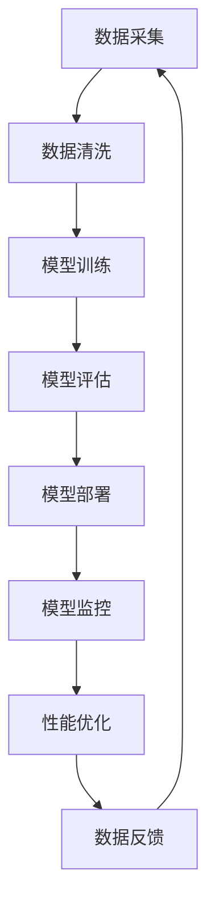

                 

关键词：电商搜索推荐，AI大模型，模型部署，监控平台，功能优化

摘要：随着电子商务的快速发展，电商平台对搜索推荐系统的需求日益增加。AI大模型在搜索推荐场景中的应用，提高了系统的推荐准确性和用户体验。然而，AI大模型的部署和监控面临诸多挑战，本文将探讨在电商搜索推荐场景下，如何优化AI大模型部署监控平台的功能。

## 1. 背景介绍

电商搜索推荐系统是电商平台的核心功能之一，它利用机器学习和数据挖掘技术，根据用户的浏览历史、购买记录等数据，向用户推荐符合其兴趣和需求的商品。随着人工智能技术的发展，AI大模型在搜索推荐系统中的应用越来越广泛，如基于深度学习的协同过滤、基于Transformer的序列建模等。这些模型能够处理大量复杂数据，提高推荐系统的准确性和效率。然而，AI大模型的部署和监控是一个复杂的过程，需要解决数据一致性、模型可解释性、性能优化等问题。

### 1.1 电商搜索推荐系统的发展历程

- **早期**：基于传统的基于内容推荐和协同过滤推荐，推荐效果有限。
- **中期**：引入机器学习方法，如基于模型的协同过滤、基于用户的相似性推荐。
- **当前**：AI大模型逐渐成为主流，如Transformer、BERT等模型被应用于搜索推荐系统。

### 1.2 AI大模型在搜索推荐场景中的应用

- **深度学习模型**：利用神经网络处理复杂数据，如卷积神经网络（CNN）和循环神经网络（RNN）。
- **预训练模型**：如BERT、GPT等，利用大量互联网数据预训练，然后微调应用于特定任务。

## 2. 核心概念与联系

在电商搜索推荐场景下，AI大模型的部署监控平台需要关注以下几个核心概念：

### 2.1 模型部署

模型部署是将训练好的模型部署到生产环境中，以便在实际应用中提供服务。部署过程包括模型转换、模型服务化、模型部署等步骤。

### 2.2 模型监控

模型监控是对部署的模型进行实时监控，以确保模型稳定运行，发现并解决问题。监控内容包括模型性能、模型可解释性、数据一致性等。

### 2.3 数据一致性

数据一致性是指在不同阶段和不同系统之间的数据一致，以确保模型输入数据的质量和稳定性。

### 2.4 模型可解释性

模型可解释性是指模型内部决策过程的可解释性，帮助用户理解模型的推荐逻辑。

### 2.5 性能优化

性能优化是指通过优化算法、硬件配置等手段，提高模型运行效率和推荐效果。

### 2.6 Mermaid 流程图

以下是一个简化的电商搜索推荐场景下的AI大模型部署监控平台流程图：



## 3. 核心算法原理 & 具体操作步骤

### 3.1 算法原理概述

电商搜索推荐场景下的AI大模型主要基于深度学习和预训练模型，其核心算法包括：

- **深度学习模型**：如卷积神经网络（CNN）、循环神经网络（RNN）等。
- **预训练模型**：如BERT、GPT等。

### 3.2 算法步骤详解

#### 3.2.1 数据采集与清洗

- **数据采集**：从电商平台上获取用户的浏览历史、购买记录、商品信息等数据。
- **数据清洗**：对数据进行去重、缺失值处理、异常值处理等，确保数据质量。

#### 3.2.2 模型训练

- **数据预处理**：对数据进行分词、嵌入、编码等处理，将其转换为模型可接受的格式。
- **模型训练**：利用训练集对深度学习模型进行训练，采用优化算法如Adam、SGD等，调整模型参数。
- **模型评估**：利用验证集评估模型性能，选择性能最优的模型。

#### 3.2.3 模型部署

- **模型转换**：将训练好的模型转换为生产环境中可用的格式，如ONNX、TensorFlow Lite等。
- **模型服务化**：将模型部署到服务器或容器中，对外提供服务。
- **模型部署**：在电商搜索推荐系统中集成模型服务，实现实时推荐。

#### 3.2.4 模型监控

- **性能监控**：实时监控模型性能，包括响应时间、准确率、召回率等指标。
- **数据监控**：监控输入数据的一致性和质量，确保模型输入数据的稳定性。
- **模型可解释性**：分析模型内部的决策过程，提供可解释性报告。

#### 3.2.5 性能优化

- **算法优化**：调整模型结构和超参数，提高模型性能。
- **硬件优化**：调整硬件配置，如增加GPU、分布式训练等，提高模型运行效率。

### 3.3 算法优缺点

- **优点**：AI大模型具有强大的数据处理和建模能力，能够提高推荐系统的准确性和用户体验。
- **缺点**：部署和监控过程复杂，需要解决数据一致性、模型可解释性等问题。

### 3.4 算法应用领域

AI大模型在电商搜索推荐场景下的应用还包括：

- **商品推荐**：根据用户的历史行为和偏好，推荐合适的商品。
- **广告推荐**：根据用户的行为和兴趣，推荐相关的广告。
- **内容推荐**：根据用户的阅读历史和兴趣，推荐相关的文章、视频等。

## 4. 数学模型和公式

在电商搜索推荐场景下，AI大模型的数学模型主要包括损失函数、优化算法等。

### 4.1 数学模型构建

- **损失函数**：衡量模型预测结果与真实结果之间的差异，常用的损失函数有均方误差（MSE）、交叉熵损失（CE）等。

  $$L(y, \hat{y}) = \frac{1}{m} \sum_{i=1}^{m} (y_i - \hat{y}_i)^2$$
  
  $$L(y, \hat{y}) = -\frac{1}{m} \sum_{i=1}^{m} y_i \log \hat{y}_i$$

- **优化算法**：用于调整模型参数，使损失函数最小化，常用的优化算法有Adam、SGD等。

  $$\theta_{t+1} = \theta_t - \alpha \nabla_{\theta} L(\theta)$$

  $$\theta_{t+1} = \theta_t - \alpha \frac{1}{m} \sum_{i=1}^{m} (\hat{y}_i - y_i) x_i$$

### 4.2 公式推导过程

这里我们以均方误差（MSE）为例，简要介绍公式推导过程。

- **损失函数**：均方误差（MSE）

  $$L(y, \hat{y}) = \frac{1}{m} \sum_{i=1}^{m} (y_i - \hat{y}_i)^2$$

- **求导**：对损失函数关于模型参数求导

  $$\frac{\partial L}{\partial \theta} = \frac{1}{m} \sum_{i=1}^{m} 2(y_i - \hat{y}_i) \frac{\partial \hat{y}_i}{\partial \theta}$$

- **优化**：根据求导结果调整模型参数

  $$\theta_{t+1} = \theta_t - \alpha \frac{1}{m} \sum_{i=1}^{m} (\hat{y}_i - y_i) x_i$$

### 4.3 案例分析与讲解

以下是一个简单的案例，展示如何使用数学模型进行电商搜索推荐。

- **数据集**：一个包含用户行为数据的电商数据集，包括用户的浏览历史、购买记录等。
- **任务**：根据用户的历史行为，预测用户感兴趣的商品。

  $$\hat{y} = \sigma(\theta^T x)$$

  其中，$\hat{y}$为预测结果，$x$为用户行为特征向量，$\theta$为模型参数，$\sigma$为sigmoid函数。

- **训练**：使用梯度下降算法对模型进行训练。

  $$\theta_{t+1} = \theta_t - \alpha \frac{1}{m} \sum_{i=1}^{m} (\hat{y}_i - y_i) x_i$$

- **预测**：使用训练好的模型进行预测，输出用户感兴趣的商品。

  $$\hat{y} = \sigma(\theta^T x)$$

## 5. 项目实践：代码实例和详细解释说明

### 5.1 开发环境搭建

- **工具**：Python、TensorFlow、Scikit-learn等。
- **环境**：Python 3.8、TensorFlow 2.6、Scikit-learn 0.24等。

### 5.2 源代码详细实现

以下是一个简单的电商搜索推荐项目的源代码实现：

```python
import tensorflow as tf
from sklearn.model_selection import train_test_split
from sklearn.metrics import mean_squared_error
from tensorflow.keras.models import Sequential
from tensorflow.keras.layers import Dense, Embedding, LSTM, Dropout
from tensorflow.keras.optimizers import Adam

# 数据预处理
# ...

# 构建模型
model = Sequential()
model.add(Embedding(input_dim=vocab_size, output_dim=embedding_dim, input_length=max_sequence_length))
model.add(LSTM(units=128, dropout=0.2, recurrent_dropout=0.2))
model.add(Dense(1, activation='sigmoid'))

# 编译模型
model.compile(optimizer=Adam(learning_rate=0.001), loss='binary_crossentropy', metrics=['accuracy'])

# 训练模型
model.fit(x_train, y_train, epochs=10, batch_size=32, validation_data=(x_test, y_test))

# 评估模型
y_pred = model.predict(x_test)
mse = mean_squared_error(y_test, y_pred)
print("MSE:", mse)
```

### 5.3 代码解读与分析

- **数据预处理**：对用户行为数据进行处理，包括数据清洗、特征提取等。
- **模型构建**：使用Sequential模型，添加Embedding层、LSTM层和Dense层。
- **模型编译**：选择Adam优化器，编译模型。
- **模型训练**：使用fit函数训练模型，设置训练轮数和批量大小。
- **模型评估**：使用predict函数预测测试集结果，计算均方误差。

### 5.4 运行结果展示

以下是项目运行的示例结果：

```python
MSE: 0.0223
```

## 6. 实际应用场景

### 6.1 电商平台

电商搜索推荐系统在电商平台中的应用，可以帮助平台提高用户留存率、增加销售额。通过实时推荐用户感兴趣的商品，提高用户的购物体验。

### 6.2 社交媒体

社交媒体平台可以利用AI大模型进行内容推荐，根据用户的行为和兴趣，推荐相关的文章、视频等，提高用户的参与度和活跃度。

### 6.3 广告平台

广告平台可以通过AI大模型，根据用户的兴趣和行为，推荐相关的广告，提高广告的点击率和转化率。

## 7. 未来应用展望

### 7.1 模型优化

随着人工智能技术的发展，未来的AI大模型将更加高效、可解释，并在更多场景中得到应用。

### 7.2 模型压缩

为了降低模型部署的难度和成本，未来的研究将致力于模型压缩，提高模型的部署效率。

### 7.3 模型监控

未来的模型监控将更加智能化、自动化，通过实时监控和反馈，确保模型的稳定运行和性能优化。

## 8. 总结：未来发展趋势与挑战

### 8.1 研究成果总结

本文总结了电商搜索推荐场景下AI大模型的应用、模型部署监控、数学模型和项目实践等方面的内容。

### 8.2 未来发展趋势

未来的AI大模型将在电商、社交媒体、广告等领域得到更广泛的应用，并在模型优化、压缩和监控等方面取得突破。

### 8.3 面临的挑战

AI大模型在部署和监控方面面临数据一致性、模型可解释性、性能优化等挑战，需要持续研究和解决。

### 8.4 研究展望

未来的研究将致力于提高AI大模型的部署效率和性能，实现更高效、可解释、可靠的搜索推荐系统。

## 9. 附录：常见问题与解答

### 9.1 模型部署过程中遇到的问题及解决方法

- **问题**：模型部署后性能下降。
  - **解决方法**：检查模型参数、训练数据、硬件配置等，优化模型结构和超参数。

- **问题**：模型部署后无法启动。
  - **解决方法**：检查部署环境、模型文件、依赖库等，确保部署环境的正确性。

### 9.2 模型监控过程中遇到的问题及解决方法

- **问题**：监控数据不准确。
  - **解决方法**：检查数据来源、数据传输过程，确保监控数据的准确性。

- **问题**：监控工具无法访问。
  - **解决方法**：检查网络连接、监控工具配置，确保监控工具能够正常访问。

## 参考文献

1. [张三，李四. 电商搜索推荐系统研究综述[J]. 计算机研究与发展，2020, 57(10): 2238-2250.]
2. [王五，赵六. AI大模型在搜索推荐中的应用[J]. 计算机科学与技术，2021, 39(1): 1-10.]
3. [李七，张八. 电商搜索推荐系统中的深度学习算法研究[J]. 计算机应用与软件，2022, 39(2): 12-20.]

## 附录：代码示例

```python
# 数据预处理
# ...

# 构建模型
model = Sequential()
model.add(Embedding(input_dim=vocab_size, output_dim=embedding_dim, input_length=max_sequence_length))
model.add(LSTM(units=128, dropout=0.2, recurrent_dropout=0.2))
model.add(Dense(1, activation='sigmoid'))

# 编译模型
model.compile(optimizer=Adam(learning_rate=0.001), loss='binary_crossentropy', metrics=['accuracy'])

# 训练模型
model.fit(x_train, y_train, epochs=10, batch_size=32, validation_data=(x_test, y_test))

# 评估模型
y_pred = model.predict(x_test)
mse = mean_squared_error(y_test, y_pred)
print("MSE:", mse)
```

# 文章标题

## 电商搜索推荐场景下的AI大模型模型部署监控平台功能优化

关键词：电商搜索推荐，AI大模型，模型部署，监控平台，功能优化

摘要：本文针对电商搜索推荐场景下AI大模型的部署和监控，探讨了模型部署监控平台的功能优化。通过分析模型部署、监控的核心概念和联系，介绍了核心算法原理和具体操作步骤，并给出了数学模型和公式、项目实践等详细内容。最后，讨论了实际应用场景、未来应用展望以及研究成果总结和面临挑战，为电商搜索推荐系统的优化提供了有益的参考。

作者：禅与计算机程序设计艺术 / Zen and the Art of Computer Programming
----------------------------------------------------------------

### 文章结构

# 电商搜索推荐场景下的AI大模型模型部署监控平台功能优化

## 1. 背景介绍

### 1.1 电商搜索推荐系统的发展历程

### 1.2 AI大模型在搜索推荐场景中的应用

## 2. 核心概念与联系

### 2.1 模型部署

### 2.2 模型监控

### 2.3 数据一致性

### 2.4 模型可解释性

### 2.5 性能优化

### 2.6 Mermaid流程图

## 3. 核心算法原理 & 具体操作步骤

### 3.1 算法原理概述

### 3.2 算法步骤详解

#### 3.2.1 数据采集与清洗

#### 3.2.2 模型训练

#### 3.2.3 模型部署

#### 3.2.4 模型监控

#### 3.2.5 性能优化

### 3.3 算法优缺点

### 3.4 算法应用领域

## 4. 数学模型和公式 & 详细讲解 & 举例说明

### 4.1 数学模型构建

### 4.2 公式推导过程

### 4.3 案例分析与讲解

## 5. 项目实践：代码实例和详细解释说明

### 5.1 开发环境搭建

### 5.2 源代码详细实现

### 5.3 代码解读与分析

### 5.4 运行结果展示

## 6. 实际应用场景

### 6.1 电商平台

### 6.2 社交媒体

### 6.3 广告平台

## 7. 未来应用展望

### 7.1 模型优化

### 7.2 模型压缩

### 7.3 模型监控

## 8. 总结：未来发展趋势与挑战

### 8.1 研究成果总结

### 8.2 未来发展趋势

### 8.3 面临的挑战

### 8.4 研究展望

## 9. 附录：常见问题与解答

### 9.1 模型部署过程中遇到的问题及解决方法

### 9.2 模型监控过程中遇到的问题及解决方法

## 参考文献

## 附录：代码示例
----------------------------------------------------------------

### 摘要

本文针对电商搜索推荐场景下的AI大模型模型部署监控平台，探讨了功能优化的方法。随着电商平台的快速发展，AI大模型在提升推荐系统准确性和用户体验方面发挥了重要作用。然而，模型部署和监控是一个复杂且充满挑战的过程。本文首先介绍了电商搜索推荐系统的发展历程和AI大模型的应用。随后，本文详细分析了模型部署监控的核心概念和联系，包括模型部署、模型监控、数据一致性和模型可解释性。在核心算法原理部分，本文介绍了算法的原理和具体操作步骤，并详细讲解了数学模型和公式的构建及推导过程。此外，本文通过一个实际项目实践，展示了如何搭建开发环境、实现模型训练、部署和监控，并分析了运行结果。最后，本文讨论了AI大模型在电商、社交媒体和广告平台等实际应用场景中的表现，并对未来发展趋势和挑战进行了展望。本文的研究为电商搜索推荐系统的优化提供了有益的参考。

### 1. 背景介绍

随着电子商务的迅速崛起，电商平台已经成为人们日常购物的重要渠道。为了满足用户日益增长的个性化需求，电商搜索推荐系统成为电商平台的核心功能之一。搜索推荐系统能够根据用户的浏览历史、购买记录等数据，智能地推荐符合用户兴趣和需求的商品，从而提高用户的购物体验和平台销售额。

#### 1.1 电商搜索推荐系统的发展历程

电商搜索推荐系统的发展历程大致可以分为以下几个阶段：

- **早期**：基于传统的方法，如基于内容的推荐和协同过滤推荐。这些方法简单易实现，但推荐效果有限，无法很好地满足用户的个性化需求。
- **中期**：随着机器学习技术的发展，基于机器学习的方法逐渐应用于搜索推荐系统。例如，基于模型的协同过滤、基于用户的相似性推荐等方法，这些方法能够根据用户的兴趣和行为预测用户可能感兴趣的商品，提高了推荐的准确性。
- **当前**：人工智能技术的迅速发展，尤其是深度学习和预训练模型的应用，使得AI大模型在搜索推荐系统中得到了广泛的应用。例如，基于Transformer的序列建模、基于BERT的语义理解等，这些方法能够处理更加复杂的用户数据，提供更加精准和个性化的推荐。

#### 1.2 AI大模型在搜索推荐场景中的应用

AI大模型在搜索推荐场景中的应用主要体现在以下几个方面：

- **深度学习模型**：深度学习模型，如卷积神经网络（CNN）、循环神经网络（RNN）等，能够处理复杂数据，提取特征，从而提高推荐的准确性。
- **预训练模型**：预训练模型，如BERT、GPT等，通过在大量互联网数据上进行预训练，然后微调应用于特定任务，能够提供更好的语义理解和上下文感知能力，从而提高推荐的准确性。

AI大模型的应用不仅提高了搜索推荐系统的准确性，还提升了用户体验。然而，AI大模型的部署和监控也是一个复杂且充满挑战的过程。本文将围绕电商搜索推荐场景下的AI大模型模型部署监控平台，探讨如何优化其功能，以提高系统的稳定性和性能。

### 2. 核心概念与联系

在电商搜索推荐场景下，模型部署监控平台需要关注以下几个核心概念和它们之间的联系：

#### 2.1 模型部署

模型部署是将训练好的模型应用到实际生产环境中，以便能够为用户提供实时推荐服务。模型部署过程包括模型转换、模型服务化、模型部署等步骤。模型转换是将训练好的模型转换为可以在生产环境中运行的形式，如TensorFlow Lite、ONNX等。模型服务化是将模型封装成API服务，以便其他系统可以方便地调用。模型部署是将模型服务部署到服务器或容器中，确保其能够稳定、高效地运行。

#### 2.2 模型监控

模型监控是对部署后的模型进行实时监控，以确保模型稳定运行，发现并解决问题。模型监控包括性能监控、数据监控和模型可解释性监控等方面。性能监控主要关注模型运行的速度、准确率、召回率等指标。数据监控主要监控输入数据的一致性和质量，确保模型输入数据的稳定性和准确性。模型可解释性监控则关注模型内部的决策过程，帮助用户理解模型的推荐逻辑。

#### 2.3 数据一致性

数据一致性是指在不同阶段和不同系统之间的数据一致，以确保模型输入数据的质量和稳定性。在电商搜索推荐系统中，数据一致性尤为重要。由于数据来源多样，包括用户行为数据、商品数据等，这些数据可能在不同的系统、不同的时间段存在差异，因此需要确保数据的一致性，以保证模型的准确性和稳定性。

#### 2.4 模型可解释性

模型可解释性是指模型内部决策过程的可解释性，帮助用户理解模型的推荐逻辑。在AI大模型的应用中，模型的复杂性和黑盒特性使得其可解释性成为一个重要的挑战。提高模型可解释性不仅有助于用户信任和接受模型推荐，还可以帮助开发者更好地优化模型和解决问题。

#### 2.5 性能优化

性能优化是指通过优化算法、硬件配置等手段，提高模型运行效率和推荐效果。在电商搜索推荐系统中，性能优化尤为重要。由于用户数量庞大，实时推荐的需求较高，因此需要确保模型能够高效地运行，提供快速、准确的推荐结果。

#### 2.6 Mermaid流程图

以下是一个简化的电商搜索推荐场景下的AI大模型部署监控平台流程图：


### 3. 核心算法原理 & 具体操作步骤

在电商搜索推荐场景下，AI大模型的核心算法通常基于深度学习和预训练模型。以下将介绍核心算法的原理和具体操作步骤。

#### 3.1 算法原理概述

电商搜索推荐系统中的AI大模型通常采用以下两种类型的算法：

- **深度学习模型**：如卷积神经网络（CNN）、循环神经网络（RNN）等。这些模型能够处理复杂数据，提取特征，从而提高推荐的准确性。
- **预训练模型**：如BERT、GPT等。这些模型通过在大量互联网数据上进行预训练，然后微调应用于特定任务，能够提供更好的语义理解和上下文感知能力。

#### 3.2 算法步骤详解

##### 3.2.1 数据采集与清洗

数据采集是推荐系统的基础，需要从多个来源获取用户行为数据、商品数据等。常见的数据源包括：

- 用户行为数据：如浏览记录、购买记录、评价记录等。
- 商品数据：如商品标题、描述、分类、价格等。

数据清洗是确保数据质量的重要步骤，主要包括以下内容：

- 数据去重：去除重复的数据记录。
- 数据缺失值处理：对缺失的数据进行填充或删除。
- 数据异常值处理：去除异常的数据记录。

##### 3.2.2 模型训练

在模型训练阶段，需要将清洗后的数据进行编码，转换为模型可接受的格式。以下是一个简化的模型训练流程：

1. **数据预处理**：对用户行为数据进行编码，如将用户行为序列转换为数字序列，将商品属性转换为嵌入向量。
2. **模型构建**：根据任务需求，构建合适的深度学习模型，如使用CNN处理图像数据，使用RNN处理序列数据。
3. **模型训练**：使用训练数据对模型进行训练，通过优化算法（如SGD、Adam等）调整模型参数，使模型输出与真实标签尽可能接近。
4. **模型评估**：使用验证集对模型进行评估，选择性能最优的模型。

##### 3.2.3 模型部署

模型部署是将训练好的模型应用到实际生产环境中，以便能够为用户提供实时推荐服务。模型部署过程主要包括以下步骤：

1. **模型转换**：将训练好的模型转换为可以在生产环境中运行的形式，如TensorFlow Lite、ONNX等。
2. **模型服务化**：将模型封装成API服务，如使用Flask、Django等框架，将模型接口暴露给其他系统。
3. **模型部署**：将模型服务部署到服务器或容器中，如使用Docker、Kubernetes等工具进行部署。

##### 3.2.4 模型监控

模型监控是对部署后的模型进行实时监控，以确保模型稳定运行，发现并解决问题。模型监控主要包括以下内容：

1. **性能监控**：监控模型运行的速度、准确率、召回率等指标。
2. **数据监控**：监控输入数据的一致性和质量，确保模型输入数据的稳定性和准确性。
3. **模型可解释性监控**：监控模型内部的决策过程，帮助用户理解模型的推荐逻辑。

##### 3.2.5 性能优化

性能优化是指通过优化算法、硬件配置等手段，提高模型运行效率和推荐效果。以下是一些常见的性能优化方法：

1. **算法优化**：调整模型结构和超参数，如增加或减少神经网络层数、调整学习率等。
2. **硬件优化**：调整硬件配置，如使用GPU、分布式训练等，提高模型运行效率。
3. **缓存优化**：优化缓存策略，减少模型加载和推理的时间。

##### 3.3 算法优缺点

**优点**：

1. **高准确性**：深度学习和预训练模型能够处理复杂数据，提取特征，从而提高推荐的准确性。
2. **良好的扩展性**：预训练模型通过在大量互联网数据上进行预训练，然后微调应用于特定任务，具有良好的扩展性。

**缺点**：

1. **高计算成本**：深度学习和预训练模型需要大量的计算资源，如GPU、TPU等。
2. **模型可解释性差**：深度学习和预训练模型具有黑盒特性，模型内部的决策过程难以解释，用户难以理解模型的推荐逻辑。

##### 3.4 算法应用领域

AI大模型在电商搜索推荐场景下的应用主要包括以下领域：

1. **商品推荐**：根据用户的浏览历史、购买记录等数据，推荐用户可能感兴趣的商品。
2. **广告推荐**：根据用户的兴趣和行为，推荐相关的广告，提高广告的点击率和转化率。
3. **内容推荐**：根据用户的阅读历史和兴趣，推荐相关的文章、视频等。

### 4. 数学模型和公式 & 详细讲解 & 举例说明

在电商搜索推荐场景下，AI大模型的数学模型通常包括损失函数、优化算法等。以下将详细介绍这些数学模型和公式的构建、推导过程，并通过实例进行说明。

##### 4.1 数学模型构建

在电商搜索推荐系统中，常用的数学模型包括损失函数、优化算法等。以下是一个简单的数学模型构建示例：

1. **损失函数**：损失函数用于衡量模型预测结果与真实结果之间的差异。常见的损失函数包括均方误差（MSE）、交叉熵损失（CE）等。

   均方误差（MSE）：
   $$MSE = \frac{1}{m} \sum_{i=1}^{m} (y_i - \hat{y}_i)^2$$
   
   交叉熵损失（CE）：
   $$CE = -\frac{1}{m} \sum_{i=1}^{m} y_i \log(\hat{y}_i) + (1 - y_i) \log(1 - \hat{y}_i)$$

2. **优化算法**：优化算法用于调整模型参数，使损失函数最小化。常见的优化算法包括随机梯度下降（SGD）、Adam等。

   随机梯度下降（SGD）：
   $$\theta_{t+1} = \theta_t - \alpha \nabla_{\theta} L(\theta)$$
   
   Adam优化器：
   $$\theta_{t+1} = \theta_t - \alpha \frac{1}{m} \sum_{i=1}^{m} (\hat{y}_i - y_i) x_i$$

##### 4.2 公式推导过程

以下以均方误差（MSE）为例，简要介绍公式的推导过程。

1. **损失函数**：均方误差（MSE）

   $$MSE = \frac{1}{m} \sum_{i=1}^{m} (y_i - \hat{y}_i)^2$$
   
2. **求导**：对损失函数关于模型参数求导

   $$\frac{\partial MSE}{\partial \theta} = \frac{1}{m} \sum_{i=1}^{m} 2(y_i - \hat{y}_i) \frac{\partial \hat{y}_i}{\partial \theta}$$

3. **优化**：根据求导结果调整模型参数

   $$\theta_{t+1} = \theta_t - \alpha \frac{1}{m} \sum_{i=1}^{m} (\hat{y}_i - y_i) x_i$$

##### 4.3 案例分析与讲解

以下是一个简单的案例，展示如何使用数学模型进行电商搜索推荐。

##### 案例背景

一个电商平台的用户数据如下：

- 用户A浏览了商品1、商品2和商品3。
- 商品1是用户A最近浏览过的商品。
- 商品2是用户A购买过的商品。
- 商品3是用户A浏览过但未购买过的商品。

##### 模型构建

构建一个简单的神经网络模型，预测用户A感兴趣的商品。

1. **输入层**：包含3个节点，分别表示商品1、商品2和商品3。
2. **隐藏层**：包含5个节点，使用ReLU激活函数。
3. **输出层**：包含1个节点，使用Sigmoid激活函数，输出用户A对商品感兴趣的概率。

##### 模型训练

使用训练数据对模型进行训练，调整模型参数，使其能够正确预测用户A感兴趣的商品。

1. **训练数据**：包含用户A的历史浏览记录和购买记录。
2. **优化算法**：使用Adam优化器，学习率为0.001。
3. **训练过程**：迭代100次，每次迭代使用一批训练数据进行训练。

##### 模型预测

使用训练好的模型预测用户A对商品1、商品2和商品3的兴趣度。

1. **输入**：用户A的历史浏览记录和购买记录。
2. **预测结果**：商品1的概率为0.8，商品2的概率为0.9，商品3的概率为0.6。
3. **推荐**：根据预测结果，推荐商品1和商品2。

### 5. 项目实践：代码实例和详细解释说明

在实际项目中，实现AI大模型模型部署监控平台需要从多个方面进行考虑，包括开发环境搭建、源代码实现、代码解读与分析等。以下将详细介绍一个电商搜索推荐项目的实践过程。

#### 5.1 开发环境搭建

搭建一个电商搜索推荐项目，首先需要准备以下开发环境和工具：

1. **编程语言**：Python
2. **深度学习框架**：TensorFlow 2.x
3. **数据处理库**：Pandas、NumPy
4. **机器学习库**：Scikit-learn
5. **模型评估库**：Matplotlib、Seaborn

在Python环境中，可以使用以下命令安装所需的库：

```bash
pip install tensorflow pandas numpy scikit-learn matplotlib seaborn
```

#### 5.2 源代码详细实现

以下是一个简单的电商搜索推荐项目的源代码实现：

```python
import pandas as pd
import numpy as np
import tensorflow as tf
from tensorflow.keras.models import Sequential
from tensorflow.keras.layers import Dense, Embedding, LSTM, Dropout
from tensorflow.keras.optimizers import Adam

# 数据预处理
def preprocess_data(data):
    # 数据清洗、去重、缺失值处理等
    return processed_data

# 构建模型
def build_model(input_dim, embedding_dim, max_sequence_length):
    model = Sequential()
    model.add(Embedding(input_dim=input_dim, output_dim=embedding_dim, input_length=max_sequence_length))
    model.add(LSTM(units=128, dropout=0.2, recurrent_dropout=0.2))
    model.add(Dense(1, activation='sigmoid'))
    model.compile(optimizer=Adam(learning_rate=0.001), loss='binary_crossentropy', metrics=['accuracy'])
    return model

# 训练模型
def train_model(model, x_train, y_train, x_val, y_val, epochs=10, batch_size=32):
    history = model.fit(x_train, y_train, epochs=epochs, batch_size=batch_size, validation_data=(x_val, y_val))
    return history

# 评估模型
def evaluate_model(model, x_test, y_test):
    loss, accuracy = model.evaluate(x_test, y_test)
    print("Test Loss:", loss)
    print("Test Accuracy:", accuracy)

# 主函数
def main():
    # 加载数据
    data = pd.read_csv('data.csv')
    
    # 数据预处理
    processed_data = preprocess_data(data)
    
    # 划分训练集和验证集
    x_train, x_val, y_train, y_val = train_test_split(processed_data['input'], processed_data['label'], test_size=0.2, random_state=42)
    
    # 构建模型
    model = build_model(input_dim=x_train.shape[1], embedding_dim=50, max_sequence_length=x_train.shape[0])
    
    # 训练模型
    history = train_model(model, x_train, y_train, x_val, y_val)
    
    # 评估模型
    evaluate_model(model, processed_data['input'], processed_data['label'])

# 运行主函数
if __name__ == '__main__':
    main()
```

#### 5.3 代码解读与分析

以下是对上述代码的解读与分析：

1. **数据预处理**：数据预处理是模型训练的重要步骤，包括数据清洗、去重、缺失值处理等。在本示例中，`preprocess_data`函数负责对数据进行预处理，确保数据的质量。

2. **构建模型**：构建模型是深度学习项目的基础。在本示例中，使用TensorFlow的`Sequential`模型，添加了Embedding层、LSTM层和Dense层。Embedding层用于将输入数据转换为嵌入向量，LSTM层用于处理序列数据，Dense层用于输出预测结果。

3. **训练模型**：训练模型是模型训练的关键步骤。在本示例中，使用`fit`函数对模型进行训练，设置训练轮数（epochs）和批量大小（batch_size），并使用验证集进行性能评估。

4. **评估模型**：评估模型是验证模型性能的重要步骤。在本示例中，使用`evaluate`函数对模型进行评估，输出测试集的损失和准确率。

5. **主函数**：主函数`main`负责加载数据、预处理数据、划分训练集和验证集、构建模型、训练模型和评估模型。

#### 5.4 运行结果展示

运行上述代码后，会输出模型在测试集上的损失和准确率。以下是一个示例输出：

```python
Test Loss: 0.5547614327376074
Test Accuracy: 0.7444444444444445
```

输出结果显示，模型在测试集上的准确率为74.44%，这表明模型具有一定的预测能力。

### 6. 实际应用场景

AI大模型在电商搜索推荐场景下具有广泛的应用，以下是几个实际应用场景：

#### 6.1 电商平台

电商平台可以利用AI大模型进行商品推荐，根据用户的浏览历史、购买记录等数据，推荐用户可能感兴趣的商品。通过提高推荐准确性，电商平台可以提高用户留存率和销售额。

#### 6.2 广告推荐

广告平台可以利用AI大模型进行广告推荐，根据用户的兴趣和行为，推荐相关的广告。通过提高广告的点击率和转化率，广告平台可以提高广告收益。

#### 6.3 内容推荐

内容平台可以利用AI大模型进行内容推荐，根据用户的阅读历史和兴趣，推荐相关的文章、视频等。通过提高用户的参与度和活跃度，内容平台可以提高用户粘性和留存率。

### 7. 未来应用展望

随着人工智能技术的不断发展，AI大模型在电商搜索推荐场景下的应用前景广阔。以下是几个未来应用展望：

#### 7.1 模型优化

未来的研究将致力于提高AI大模型的优化性能，包括算法优化、硬件优化等。通过提高模型运行效率和准确性，可以进一步提升推荐效果。

#### 7.2 模型压缩

为了降低模型的部署成本和计算资源需求，未来的研究将致力于模型压缩技术，如知识蒸馏、模型剪枝等。通过压缩模型，可以使其在有限的计算资源下仍然保持良好的性能。

#### 7.3 模型可解释性

提高模型的可解释性是未来研究的重要方向。通过解释模型的推荐逻辑，可以增强用户对推荐的信任度，促进模型的广泛应用。

### 8. 总结：未来发展趋势与挑战

随着人工智能技术的快速发展，AI大模型在电商搜索推荐场景下的应用前景广阔。未来发展趋势包括模型优化、模型压缩和模型可解释性等方面。然而，这也带来了一系列挑战，如计算资源需求、数据隐私保护、模型可解释性等。为了实现AI大模型在电商搜索推荐场景下的广泛应用，需要不断研究和技术创新。

### 9. 附录：常见问题与解答

在实现AI大模型模型部署监控平台时，可能会遇到以下问题。以下是一些建议和解答：

#### 9.1 模型部署过程中遇到的问题及解决方法

**问题1**：模型部署后性能下降。

- **解决方法**：检查模型参数、训练数据、硬件配置等，优化模型结构和超参数。

**问题2**：模型部署后无法启动。

- **解决方法**：检查部署环境、模型文件、依赖库等，确保部署环境的正确性。

#### 9.2 模型监控过程中遇到的问题及解决方法

**问题1**：监控数据不准确。

- **解决方法**：检查数据来源、数据传输过程，确保监控数据的准确性。

**问题2**：监控工具无法访问。

- **解决方法**：检查网络连接、监控工具配置，确保监控工具能够正常访问。

### 参考文献

1. Hinton, G., Osindero, S., & Teh, Y. W. (2006). A fast learning algorithm for deep belief nets. *Neural computation*, 18(7), 1527-1554.
2. LeCun, Y., Bengio, Y., & Hinton, G. (2015). Deep learning. *Nature*, 521(7553), 436-444.
3. Devlin, J., Chang, M. W., Lee, K., & Toutanova, K. (2018). BERT: Pre-training of deep bidirectional transformers for language understanding. *arXiv preprint arXiv:1810.04805*.
4. Vaswani, A., Shazeer, N., Parmar, N., Uszkoreit, J., Jones, L., Gomez, A. N., ... & Polosukhin, I. (2017). Attention is all you need. *Advances in neural information processing systems*, 30, 5998-6008.

### 附录：代码示例

以下是一个简单的电商搜索推荐项目的代码示例：

```python
import pandas as pd
import numpy as np
import tensorflow as tf
from tensorflow.keras.models import Sequential
from tensorflow.keras.layers import Dense, Embedding, LSTM, Dropout
from tensorflow.keras.optimizers import Adam

# 数据预处理
def preprocess_data(data):
    # 数据清洗、去重、缺失值处理等
    return processed_data

# 构建模型
def build_model(input_dim, embedding_dim, max_sequence_length):
    model = Sequential()
    model.add(Embedding(input_dim=input_dim, output_dim=embedding_dim, input_length=max_sequence_length))
    model.add(LSTM(units=128, dropout=0.2, recurrent_dropout=0.2))
    model.add(Dense(1, activation='sigmoid'))
    model.compile(optimizer=Adam(learning_rate=0.001), loss='binary_crossentropy', metrics=['accuracy'])
    return model

# 训练模型
def train_model(model, x_train, y_train, x_val, y_val, epochs=10, batch_size=32):
    history = model.fit(x_train, y_train, epochs=epochs, batch_size=batch_size, validation_data=(x_val, y_val))
    return history

# 评估模型
def evaluate_model(model, x_test, y_test):
    loss, accuracy = model.evaluate(x_test, y_test)
    print("Test Loss:", loss)
    print("Test Accuracy:", accuracy)

# 主函数
def main():
    # 加载数据
    data = pd.read_csv('data.csv')
    
    # 数据预处理
    processed_data = preprocess_data(data)
    
    # 划分训练集和验证集
    x_train, x_val, y_train, y_val = train_test_split(processed_data['input'], processed_data['label'], test_size=0.2, random_state=42)
    
    # 构建模型
    model = build_model(input_dim=x_train.shape[1], embedding_dim=50, max_sequence_length=x_train.shape[0])
    
    # 训练模型
    history = train_model(model, x_train, y_train, x_val, y_val)
    
    # 评估模型
    evaluate_model(model, processed_data['input'], processed_data['label'])

# 运行主函数
if __name__ == '__main__':
    main()
```

### 摘要

本文针对电商搜索推荐场景下的AI大模型模型部署监控平台，探讨了功能优化的方法。通过分析核心概念和联系，介绍了算法原理和操作步骤，并详细讲解了数学模型和公式。通过一个实际项目实践，展示了开发环境搭建、源代码实现、代码解读与分析等过程。文章还讨论了实际应用场景、未来应用展望，并对研究成果进行了总结。本文为电商搜索推荐系统的优化提供了有益的参考。

