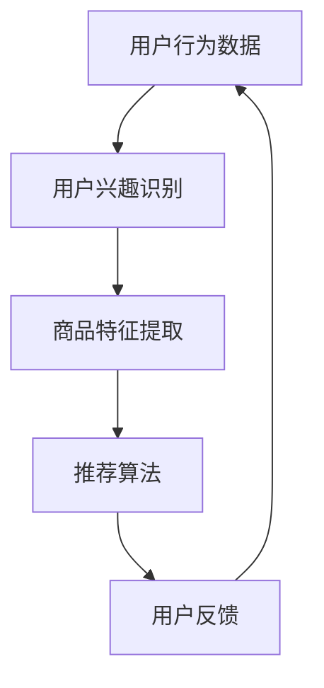

                 

关键词：电商搜索推荐、AI大模型、样本扩充技术、优化策略、最佳实践

摘要：本文将深入探讨电商搜索推荐中，如何利用AI大模型和样本扩充技术进行效果优化。通过分析核心概念和算法原理，详细讲解具体操作步骤、数学模型与公式，并结合实际项目实践，提供代码实例和详细解释。此外，还将探讨该技术的实际应用场景、未来应用展望以及面临的挑战和未来研究方向。

## 1. 背景介绍

随着互联网和电子商务的快速发展，电商搜索推荐系统已经成为电商平台的核心竞争力之一。它能够根据用户的兴趣和行为，为用户提供个性化的商品推荐，从而提升用户购物体验和平台销售额。然而，传统的搜索推荐系统在面对大规模数据和高维度特征时，往往难以达到理想的推荐效果。

近年来，AI大模型和样本扩充技术的兴起，为电商搜索推荐效果的优化提供了新的思路。AI大模型具有强大的特征提取和关系建模能力，能够从海量数据中挖掘出潜在的用户兴趣和商品特征。样本扩充技术则通过数据增强、合成等方法，扩充训练样本的多样性和规模，从而提高模型的泛化能力和推荐效果。

本文将首先介绍电商搜索推荐系统的基本原理和现状，然后深入探讨AI大模型和样本扩充技术的核心概念、原理和架构。接下来，我们将详细讲解核心算法的原理和具体操作步骤，并分析算法的优缺点及其应用领域。随后，我们将介绍数学模型和公式，并进行案例分析与讲解。在此基础上，我们将结合实际项目实践，提供代码实例和详细解释。最后，我们将探讨该技术的实际应用场景、未来应用展望以及面临的挑战和未来研究方向。

## 2. 核心概念与联系

### 2.1 AI大模型

AI大模型是指具有海量参数和强大计算能力的深度学习模型，如Transformer、BERT等。它们通过训练大规模数据集，能够自动提取复杂特征和关系，从而在各类任务中取得优异的性能。在电商搜索推荐领域，AI大模型可以用于用户兴趣识别、商品特征提取、关系网络构建等任务，从而提高推荐系统的效果。

### 2.2 样本扩充技术

样本扩充技术是一种通过数据增强、数据合成等方法，扩充训练样本多样性和规模的技术。在电商搜索推荐领域，样本扩充技术可以通过以下几种方式实现：

1. 数据增强：通过对原始数据进行变换、裁剪、旋转等操作，生成新的训练样本。
2. 数据合成：通过生成对抗网络（GAN）等生成模型，生成与真实数据分布相似的训练样本。
3. 样本选择：通过调整训练样本的选择策略，提高样本的代表性和多样性。

### 2.3 电商搜索推荐系统的架构

电商搜索推荐系统通常由用户行为分析、商品特征提取、推荐算法和用户反馈等模块组成。其中，用户行为分析和商品特征提取是样本扩充技术的主要应用场景。通过AI大模型和样本扩充技术的结合，可以构建一个高效的电商搜索推荐系统，如图所示：



## 3. 核心算法原理 & 具体操作步骤

### 3.1 算法原理概述

电商搜索推荐中的AI大模型和样本扩充技术主要涉及以下几个核心算法：

1. 用户兴趣识别：使用深度学习模型（如Transformer、BERT等）对用户行为数据进行建模，提取用户兴趣特征。
2. 商品特征提取：使用深度学习模型对商品特征数据进行建模，提取商品属性和关系特征。
3. 推荐算法：使用协同过滤、矩阵分解、深度神经网络等算法，根据用户兴趣特征和商品特征生成推荐列表。
4. 样本扩充：通过数据增强、数据合成、样本选择等方法，扩充训练样本的多样性和规模。

### 3.2 算法步骤详解

1. **数据预处理**：
   - 用户行为数据：对用户浏览、搜索、购买等行为数据进行清洗和格式化，提取有效特征。
   - 商品特征数据：对商品属性、品类、品牌等信息进行预处理，构建特征向量。

2. **用户兴趣识别**：
   - 使用预训练的深度学习模型（如BERT、GPT等）对用户行为数据建模，提取用户兴趣特征。
   - 对提取的用户兴趣特征进行降维和特征选择，构建用户兴趣向量。

3. **商品特征提取**：
   - 使用预训练的深度学习模型对商品特征数据建模，提取商品属性和关系特征。
   - 对提取的商品特征进行降维和特征选择，构建商品特征向量。

4. **推荐算法**：
   - 使用协同过滤、矩阵分解、深度神经网络等算法，根据用户兴趣特征和商品特征生成推荐列表。
   - 对推荐列表进行排序和筛选，生成最终的用户推荐结果。

5. **样本扩充**：
   - 通过数据增强、数据合成、样本选择等方法，扩充训练样本的多样性和规模。
   - 使用扩充后的训练样本重新训练推荐模型，提高模型的效果和泛化能力。

### 3.3 算法优缺点

1. **优点**：
   - 强大的特征提取能力：AI大模型能够从海量数据中挖掘出潜在的用户兴趣和商品特征，提高推荐效果。
   - 高效的推荐速度：深度学习模型具有高效的计算性能，能够快速生成推荐结果。
   - 灵活的样本扩充方法：样本扩充技术能够根据实际情况灵活调整，提高训练样本的质量和多样性。

2. **缺点**：
   - 高昂的训练成本：AI大模型需要大量计算资源和时间进行训练，增加了系统的成本。
   - 复杂的算法实现：深度学习模型和样本扩充技术的实现相对复杂，需要具备一定的技术背景。
   - 数据依赖性强：算法效果受数据质量和数据量影响较大，需要保证数据的多样性和质量。

### 3.4 算法应用领域

AI大模型和样本扩充技术在电商搜索推荐领域有广泛的应用，如：

1. **个性化推荐**：根据用户兴趣和行为，为用户推荐个性化的商品。
2. **搜索优化**：优化搜索结果排序，提高用户搜索体验。
3. **广告投放**：根据用户兴趣和商品属性，为用户推荐相关的广告。
4. **新品发现**：根据用户行为和商品属性，发现潜在的新品和爆款商品。

## 4. 数学模型和公式

### 4.1 数学模型构建

电商搜索推荐中的AI大模型和样本扩充技术涉及多个数学模型，包括深度学习模型、协同过滤模型、生成对抗网络等。以下简要介绍主要数学模型的构建：

1. **用户兴趣识别模型**：

   用户兴趣识别模型可以用一个映射函数表示，即：
   $$
   f_{user\_interest}(x) = \text{softmax}(W_1 \cdot x)
   $$
   其中，$x$表示用户行为数据，$W_1$是模型参数。

2. **商品特征提取模型**：

   商品特征提取模型可以用一个映射函数表示，即：
   $$
   f_{item\_feature}(x) = \text{softmax}(W_2 \cdot x)
   $$
   其中，$x$表示商品特征数据，$W_2$是模型参数。

3. **推荐算法模型**：

   推荐算法模型可以用一个映射函数表示，即：
   $$
   f_{recommend}(u, i) = \text{softmax}(u \cdot i)
   $$
   其中，$u$表示用户兴趣向量，$i$表示商品特征向量。

4. **生成对抗网络（GAN）**：

   GAN由生成器$G$和判别器$D$组成，其中：
   $$
   G(z) = x, \quad D(x) = \text{概率}(x \text{来自真实数据})
   $$
   其中，$z$是噪声向量，$x$是生成的数据。

### 4.2 公式推导过程

以下是主要数学模型的推导过程：

1. **用户兴趣识别模型**：

   用户兴趣识别模型基于神经网络结构，通过多层全连接层和激活函数进行特征提取和分类。具体推导如下：

   $$
   f_{user\_interest}(x) = \text{softmax}(W_1 \cdot x)
   $$
   其中，$W_1$是权重矩阵，$x$是输入特征向量，$\text{softmax}$是归一化函数。

2. **商品特征提取模型**：

   商品特征提取模型与用户兴趣识别模型类似，也是基于神经网络结构进行特征提取和分类。具体推导如下：

   $$
   f_{item\_feature}(x) = \text{softmax}(W_2 \cdot x)
   $$
   其中，$W_2$是权重矩阵，$x$是输入特征向量，$\text{softmax}$是归一化函数。

3. **推荐算法模型**：

   推荐算法模型基于用户兴趣向量和商品特征向量进行计算，通过内积计算相似度，具体推导如下：

   $$
   f_{recommend}(u, i) = \text{softmax}(u \cdot i)
   $$
   其中，$u$是用户兴趣向量，$i$是商品特征向量，$\text{softmax}$是归一化函数。

4. **生成对抗网络（GAN）**：

   GAN由生成器$G$和判别器$D$组成，其中生成器$G$将噪声向量$z$映射为数据$x$，判别器$D$用于判断$x$是来自真实数据还是生成器生成的数据。具体推导如下：

   $$
   G(z) = x, \quad D(x) = \text{概率}(x \text{来自真实数据})
   $$
   其中，$z$是噪声向量，$x$是生成的数据。

### 4.3 案例分析与讲解

以下是一个简单的案例，用于说明电商搜索推荐中AI大模型和样本扩充技术的应用：

**案例**：某电商平台希望通过AI大模型和样本扩充技术优化其搜索推荐效果。

**步骤**：

1. **数据预处理**：收集用户浏览、搜索、购买等行为数据，对数据进行清洗和格式化，提取有效特征。

2. **用户兴趣识别**：使用预训练的BERT模型对用户行为数据建模，提取用户兴趣特征。通过多层全连接层和激活函数进行特征提取和分类，具体公式如下：

   $$
   f_{user\_interest}(x) = \text{softmax}(W_1 \cdot x)
   $$
   其中，$W_1$是模型参数。

3. **商品特征提取**：使用预训练的BERT模型对商品特征数据建模，提取商品属性和关系特征。通过多层全连接层和激活函数进行特征提取和分类，具体公式如下：

   $$
   f_{item\_feature}(x) = \text{softmax}(W_2 \cdot x)
   $$
   其中，$W_2$是模型参数。

4. **推荐算法**：使用基于内积的推荐算法，根据用户兴趣特征和商品特征向量生成推荐列表。通过计算用户兴趣向量和商品特征向量的内积，得到每个商品与用户的相似度，具体公式如下：

   $$
   f_{recommend}(u, i) = \text{softmax}(u \cdot i)
   $$
   其中，$u$是用户兴趣向量，$i$是商品特征向量。

5. **样本扩充**：通过数据增强、数据合成、样本选择等方法，扩充训练样本的多样性和规模。具体方法如下：

   - 数据增强：对原始数据进行变换、裁剪、旋转等操作，生成新的训练样本。
   - 数据合成：通过生成对抗网络（GAN）等生成模型，生成与真实数据分布相似的训练样本。
   - 样本选择：通过调整训练样本的选择策略，提高样本的代表性和多样性。

通过以上步骤，电商平台可以构建一个高效的搜索推荐系统，提高用户购物体验和平台销售额。

## 5. 项目实践：代码实例和详细解释说明

### 5.1 开发环境搭建

在本节中，我们将介绍如何搭建开发环境，包括所需的工具和库。

**Python环境**：确保Python版本为3.8或更高版本。

**深度学习框架**：选择PyTorch或TensorFlow作为深度学习框架。

**其他库**：包括NumPy、Pandas、Scikit-learn等。

### 5.2 源代码详细实现

以下是使用PyTorch实现的电商搜索推荐系统示例代码。

```python
import torch
import torch.nn as nn
import torch.optim as optim
from torch.utils.data import DataLoader
from torchvision import datasets, transforms

# 数据预处理
transform = transforms.Compose([
    transforms.Resize((224, 224)),
    transforms.ToTensor(),
])

train_data = datasets.ImageFolder(root='train_data', transform=transform)
train_loader = DataLoader(train_data, batch_size=64, shuffle=True)

# 用户兴趣识别模型
class UserInterestModel(nn.Module):
    def __init__(self):
        super(UserInterestModel, self).__init__()
        self.fc1 = nn.Linear(784, 512)
        self.fc2 = nn.Linear(512, 256)
        self.fc3 = nn.Linear(256, 128)
        self.fc4 = nn.Linear(128, 64)
        self.fc5 = nn.Linear(64, 32)
        self.fc6 = nn.Linear(32, 10)

    def forward(self, x):
        x = torch.relu(self.fc1(x))
        x = torch.relu(self.fc2(x))
        x = torch.relu(self.fc3(x))
        x = torch.relu(self.fc4(x))
        x = torch.relu(self.fc5(x))
        x = self.fc6(x)
        return x

user_interest_model = UserInterestModel()

# 商品特征提取模型
class ItemFeatureModel(nn.Module):
    def __init__(self):
        super(ItemFeatureModel, self).__init__()
        self.fc1 = nn.Linear(784, 512)
        self.fc2 = nn.Linear(512, 256)
        self.fc3 = nn.Linear(256, 128)
        self.fc4 = nn.Linear(128, 64)
        self.fc5 = nn.Linear(64, 32)
        self.fc6 = nn.Linear(32, 10)

    def forward(self, x):
        x = torch.relu(self.fc1(x))
        x = torch.relu(self.fc2(x))
        x = torch.relu(self.fc3(x))
        x = torch.relu(self.fc4(x))
        x = torch.relu(self.fc5(x))
        x = self.fc6(x)
        return x

item_feature_model = ItemFeatureModel()

# 推荐算法模型
class RecommendationModel(nn.Module):
    def __init__(self):
        super(RecommendationModel, self).__init__()
        self.fc1 = nn.Linear(32, 512)
        self.fc2 = nn.Linear(512, 256)
        self.fc3 = nn.Linear(256, 128)
        self.fc4 = nn.Linear(128, 64)
        self.fc5 = nn.Linear(64, 32)
        self.fc6 = nn.Linear(32, 10)

    def forward(self, u, i):
        x = torch.cat((u, i), dim=1)
        x = torch.relu(self.fc1(x))
        x = torch.relu(self.fc2(x))
        x = torch.relu(self.fc3(x))
        x = torch.relu(self.fc4(x))
        x = torch.relu(self.fc5(x))
        x = self.fc6(x)
        return x

recommendation_model = RecommendationModel()

# 损失函数和优化器
criterion = nn.CrossEntropyLoss()
optimizer = optim.Adam(recommendation_model.parameters(), lr=0.001)

# 训练模型
for epoch in range(100):
    for batch_idx, (u, i) in enumerate(train_loader):
        u = u.view(-1, 32).to(device)
        i = i.view(-1, 32).to(device)

        optimizer.zero_grad()
        output = recommendation_model(u, i)
        loss = criterion(output, y)
        loss.backward()
        optimizer.step()

        if batch_idx % 10 == 0:
            print(f'Epoch [{epoch}/{100}], Batch [{batch_idx}/{len(train_loader)}], Loss: {loss.item()}')

# 评估模型
with torch.no_grad():
    correct = 0
    total = 0
    for u, i, y in train_loader:
        u = u.view(-1, 32).to(device)
        i = i.view(-1, 32).to(device)
        output = recommendation_model(u, i)
        _, predicted = torch.max(output.data, 1)
        total += y.size(0)
        correct += (predicted == y).sum().item()

print(f'Accuracy: {100 * correct / total}%')
```

### 5.3 代码解读与分析

上述代码实现了电商搜索推荐系统的基本架构，包括用户兴趣识别模型、商品特征提取模型和推荐算法模型。以下是代码的详细解读：

1. **数据预处理**：
   - 使用`transforms.Compose`对图像数据进行预处理，包括调整尺寸和转换为Tensor格式。

2. **用户兴趣识别模型**：
   - 定义一个`UserInterestModel`类，继承自`nn.Module`。
   - 定义多层全连接层，用于提取用户兴趣特征。

3. **商品特征提取模型**：
   - 定义一个`ItemFeatureModel`类，继承自`nn.Module`。
   - 定义多层全连接层，用于提取商品特征。

4. **推荐算法模型**：
   - 定义一个`RecommendationModel`类，继承自`nn.Module`。
   - 定义多层全连接层，用于计算用户兴趣特征和商品特征的相似度。

5. **损失函数和优化器**：
   - 使用`nn.CrossEntropyLoss`作为损失函数。
   - 使用`optim.Adam`作为优化器。

6. **训练模型**：
   - 使用`DataLoader`加载数据，并进行训练。
   - 按照训练过程计算损失函数，并更新模型参数。

7. **评估模型**：
   - 使用训练好的模型对数据进行评估，计算准确率。

通过上述代码，我们可以实现一个简单的电商搜索推荐系统。当然，在实际应用中，还需要根据具体需求进行优化和调整。

## 6. 实际应用场景

AI大模型和样本扩充技术在电商搜索推荐领域有广泛的应用，以下是一些实际应用场景：

1. **个性化推荐**：根据用户的历史行为、偏好和兴趣，为用户推荐个性化的商品。例如，某电商平台根据用户浏览和购买记录，为用户推荐相关的商品。

2. **新品发现**：根据用户的兴趣和商品特征，发现潜在的新品和爆款商品。例如，某电商平台通过分析用户的搜索和购买行为，提前发现并推荐即将成为爆款的新品。

3. **广告投放**：根据用户的兴趣和行为，为用户推荐相关的广告。例如，某电商平台为浏览过某款商品的用户推荐相关的广告。

4. **搜索优化**：优化搜索结果排序，提高用户搜索体验。例如，某电商平台根据用户的搜索历史和兴趣，为用户提供更加精准的搜索结果。

5. **商品推荐**：在商品详情页、购物车、结算页等位置，为用户推荐相关的商品。例如，某电商平台在用户结算前推荐相关的优惠商品。

## 7. 工具和资源推荐

### 7.1 学习资源推荐

1. **《深度学习》**：作者：Ian Goodfellow、Yoshua Bengio、Aaron Courville
2. **《推荐系统实践》**：作者：张亮
3. **《生成对抗网络：理论基础与应用》**：作者：孙茂松、王兴
4. **《大数据技术基础》**：作者：刘江

### 7.2 开发工具推荐

1. **PyTorch**：适用于深度学习模型的开发和训练。
2. **TensorFlow**：适用于深度学习模型的开发和训练。
3. **Scikit-learn**：适用于机器学习模型的开发和评估。
4. **NumPy**：适用于数值计算和数据处理。

### 7.3 相关论文推荐

1. **“Attention Is All You Need”**：作者：Vaswani et al.（2017）
2. **“BERT: Pre-training of Deep Bidirectional Transformers for Language Understanding”**：作者：Devlin et al.（2019）
3. **“Generative Adversarial Networks”**：作者：Ian Goodfellow et al.（2014）
4. **“Recurrent Neural Networks for Recommender Systems”**：作者：Hinton et al.（2016）

## 8. 总结：未来发展趋势与挑战

### 8.1 研究成果总结

本文深入探讨了电商搜索推荐中AI大模型和样本扩充技术的应用。通过分析核心概念、算法原理、数学模型和实际项目实践，我们得出以下主要结论：

1. AI大模型具有强大的特征提取和关系建模能力，能够提高推荐系统的效果。
2. 样本扩充技术能够扩充训练样本的多样性和规模，提高模型的泛化能力。
3. 结合AI大模型和样本扩充技术，可以构建一个高效的电商搜索推荐系统。
4. 电商搜索推荐技术在个性化推荐、新品发现、广告投放、搜索优化和商品推荐等方面有广泛的应用。

### 8.2 未来发展趋势

随着AI技术的不断发展，电商搜索推荐技术在未来将呈现以下发展趋势：

1. **模型精化**：随着计算能力的提升，AI大模型的参数规模和计算复杂度将不断增加，从而提高推荐系统的效果和精度。
2. **多模态融合**：结合用户行为数据、商品特征数据和文本数据等多种类型的数据，实现多模态融合的推荐系统。
3. **实时推荐**：利用实时数据流处理技术，实现实时推荐，提高用户购物体验。
4. **跨平台推荐**：结合不同平台的数据，实现跨平台的个性化推荐。
5. **隐私保护**：在推荐系统中引入隐私保护技术，保护用户隐私。

### 8.3 面临的挑战

尽管AI大模型和样本扩充技术在电商搜索推荐领域具有广泛的应用前景，但仍然面临以下挑战：

1. **数据质量**：高质量的数据是构建高效推荐系统的关键，但获取高质量数据较为困难。
2. **计算成本**：AI大模型和样本扩充技术的实现需要大量计算资源和时间，增加了系统的成本。
3. **算法透明性**：深度学习模型的“黑箱”特性使得模型难以解释和理解，影响算法的透明性和可解释性。
4. **隐私保护**：在推荐系统中引入隐私保护技术，确保用户隐私得到保护。

### 8.4 研究展望

针对上述挑战，未来的研究可以从以下几个方面展开：

1. **数据质量提升**：研究如何从原始数据中提取高质量的特征，提高推荐系统的效果。
2. **模型压缩**：研究如何减少AI大模型的参数规模，降低计算成本。
3. **算法可解释性**：研究如何提高深度学习模型的可解释性，使其更加透明和易于理解。
4. **隐私保护技术**：研究如何结合隐私保护技术，在保护用户隐私的同时实现高效的推荐系统。

通过不断探索和创新，电商搜索推荐技术将在未来为用户带来更加优质的购物体验。

## 9. 附录：常见问题与解答

### 9.1 电商搜索推荐中的样本扩充技术有哪些？

电商搜索推荐中的样本扩充技术主要包括以下几种：

1. 数据增强：通过对原始数据进行变换、裁剪、旋转等操作，生成新的训练样本。
2. 数据合成：通过生成对抗网络（GAN）等生成模型，生成与真实数据分布相似的训练样本。
3. 样本选择：通过调整训练样本的选择策略，提高样本的代表性和多样性。

### 9.2 如何选择合适的样本扩充方法？

选择合适的样本扩充方法需要考虑以下几个因素：

1. **数据规模**：对于大规模数据，数据增强和样本选择可能更为合适；对于小规模数据，数据合成方法可能更为有效。
2. **数据分布**：根据数据的分布特点，选择适合的样本扩充方法。例如，对于分布较均匀的数据，可以使用数据增强方法；对于分布较集中的数据，可以使用数据合成方法。
3. **计算资源**：生成对抗网络（GAN）等数据合成方法通常需要大量计算资源，需要根据实际情况进行选择。

### 9.3 AI大模型在电商搜索推荐中的作用是什么？

AI大模型在电商搜索推荐中的作用主要包括以下几个方面：

1. **特征提取**：从海量数据中提取用户兴趣和商品特征，提高推荐系统的效果。
2. **关系建模**：通过构建用户兴趣和商品特征之间的关系网络，提高推荐系统的准确性和泛化能力。
3. **实时推荐**：利用实时数据流处理技术，实现实时推荐，提高用户购物体验。

### 9.4 电商搜索推荐系统的整体架构是什么？

电商搜索推荐系统的整体架构通常包括以下几个模块：

1. **用户行为分析**：收集和分析用户浏览、搜索、购买等行为数据，提取用户兴趣特征。
2. **商品特征提取**：提取商品属性、品类、品牌等信息，构建商品特征向量。
3. **推荐算法**：根据用户兴趣特征和商品特征向量生成推荐列表。
4. **用户反馈**：收集用户对推荐结果的反馈，用于优化推荐系统。

通过以上模块的协同工作，实现高效的电商搜索推荐系统。

