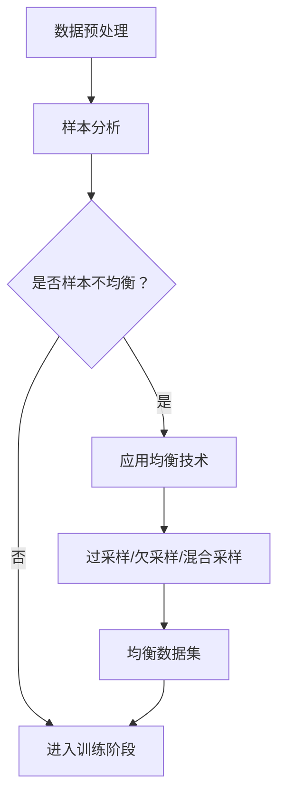

                 

关键词：电商搜索、推荐系统、样本均衡、AI大模型、效果评估

> 摘要：本文详细探讨了电商搜索推荐系统中AI大模型样本均衡技术的关键概念、原理、算法和实际应用，通过具体实例和数学模型分析，揭示了样本均衡技术对于电商推荐系统效果评估的重要性，展望了未来发展趋势与挑战。

## 1. 背景介绍

随着互联网的快速发展，电商行业已经成为数字经济的重要组成部分。电商平台的搜索和推荐系统是提升用户体验、增加销售机会的关键手段。这些系统通常依赖于AI大模型进行内容生成、用户行为分析、商品推荐等任务。然而，模型效果受样本数据质量影响较大，样本不均衡问题尤为突出。

样本不均衡是指训练数据集中某些类别的样本数量远多于其他类别，这会导致模型在多数类上表现良好，而在少数类上性能不佳。在电商搜索推荐系统中，样本不均衡问题表现为用户行为数据不平衡、商品数据分布不均匀等。例如，热门商品的评价数量远多于冷门商品，这会使得模型在学习过程中过度依赖热门商品数据，从而降低推荐系统的准确性和公平性。

## 2. 核心概念与联系

在讨论样本均衡技术之前，我们需要明确几个核心概念：

### 2.1 样本均衡的定义

样本均衡（Sample Balancing）是一种通过调整训练数据集分布，使得模型在训练过程中能够更加公平地处理各个类别数据的技术。

### 2.2 采样技术

采样技术包括重采样（Resampling）和数据增强（Data Augmentation）等方法。重采样通过减少多数类样本或增加少数类样本的数量来平衡数据集；数据增强则通过生成合成数据或对现有数据进行变换来增加少数类样本的多样性。

### 2.3 样本均衡算法

样本均衡算法可以分为以下几类：

- **过采样（Oversampling）**：增加少数类样本数量，常见方法有随机过采样、SMOTE（合成多数少数过采样）等。
- **欠采样（Undersampling）**：减少多数类样本数量，常见方法有随机欠采样、近邻欠采样等。
- **混合采样（Hybrid Sampling）**：结合过采样和欠采样方法，以达到更好的均衡效果。

### 2.4 Mermaid流程图

以下是电商搜索推荐系统中样本均衡技术的Mermaid流程图：



## 3. 核心算法原理 & 具体操作步骤

### 3.1 算法原理概述

样本均衡算法的核心目标是调整训练数据集，使得模型能够在各个类别上均衡地学习。算法的原理主要包括：

- **调整样本数量**：通过增加少数类样本或减少多数类样本的数量来平衡数据集。
- **增加样本多样性**：通过数据增强技术来丰富少数类样本的多样性，帮助模型更好地学习。

### 3.2 算法步骤详解

1. **数据预处理**：清洗和整理原始数据，确保数据质量。
2. **样本分析**：分析数据集中各类别的样本数量，判断是否出现样本不均衡问题。
3. **选择均衡技术**：根据样本分布情况，选择合适的均衡技术，如过采样、欠采样或混合采样。
4. **应用均衡技术**：执行所选均衡技术，生成均衡后的数据集。
5. **数据集验证**：验证均衡后的数据集是否满足预期效果。

### 3.3 算法优缺点

- **过采样**：优点是简单易行，缺点是可能导致模型过拟合。
- **欠采样**：优点是减少多数类样本数量，缺点是可能丢失有价值的信息。
- **混合采样**：优点是结合了过采样和欠采样的优点，缺点是算法复杂度较高。

### 3.4 算法应用领域

样本均衡技术在多个领域都有广泛应用，如医学影像分析、金融风险评估、自然语言处理等。在电商搜索推荐系统中，样本均衡技术尤其重要，因为它能够提升推荐系统的公平性和准确性。

## 4. 数学模型和公式 & 详细讲解 & 举例说明

### 4.1 数学模型构建

样本均衡技术的数学模型主要基于数据集中各类别的样本数量。设数据集D中包含N个样本，其中第i类样本的数量为ni，则样本均衡的目标是使得各类别样本数量相近，即：

$$\sum_{i=1}^{C} n_i \approx C \cdot \bar{n}$$

其中，C是类别总数，$\bar{n}$是样本数量的平均值。

### 4.2 公式推导过程

假设我们采用过采样技术来平衡数据集。首先，我们需要确定过采样的倍数k，使得均衡后的数据集中各类别样本数量接近：

$$k = \lceil \frac{\bar{n}}{n_{\min}} \rceil$$

其中，$n_{\min}$是最小类别样本数量。

然后，对于每个少数类样本，我们生成k-1个合成样本。合成样本的生成可以通过以下过程：

1. 随机选择少数类样本作为基准样本。
2. 对基准样本进行随机变换，如旋转、缩放等，生成合成样本。

### 4.3 案例分析与讲解

假设有一个电商推荐系统，数据集中包含商品评价数据，分为正评价和负评价两类。正评价样本数量为1000，负评价样本数量为500，样本均衡目标是将两类样本数量调整为相等。

1. **样本分析**：确定过采样的倍数：
   $$k = \lceil \frac{500}{1000} \rceil = 1$$

   由于过采样倍数等于1，说明负评价样本已经足够，无需额外生成合成样本。

2. **数据集调整**：将负评价样本数量调整为1000，可以通过随机复制500个负评价样本来实现。

3. **数据集验证**：均衡后的数据集中，正评价样本数量为1000，负评价样本数量为1000，满足样本均衡要求。

## 5. 项目实践：代码实例和详细解释说明

### 5.1 开发环境搭建

为了演示样本均衡技术，我们使用Python语言和Scikit-learn库来实现。首先，确保安装以下依赖库：

```shell
pip install scikit-learn numpy matplotlib
```

### 5.2 源代码详细实现

以下是一个简单的Python代码示例，用于实现过采样技术：

```python
import numpy as np
from sklearn.datasets import make_classification
from sklearn.model_selection import train_test_split
from imblearn.over_sampling import RandomOverSampler

# 生成模拟数据集
X, y = make_classification(n_samples=1000, n_features=20, n_informative=2, n_redundant=10,
                           n_clusters_per_class=1, weights=[0.99], flip_y=0, random_state=1)

# 数据集划分
X_train, X_test, y_train, y_test = train_test_split(X, y, test_size=0.3, random_state=1)

# 应用过采样技术
oversampler = RandomOverSampler(random_state=1)
X_train_oversampled, y_train_oversampled = oversampler.fit_resample(X_train, y_train)

# 数据集验证
print("训练数据集样本数量：", len(y_train_oversampled))
print("测试数据集样本数量：", len(y_test))
```

### 5.3 代码解读与分析

1. **数据集生成**：使用Scikit-learn库生成一个包含1000个样本的二分类数据集，其中正类样本占比99%。

2. **数据集划分**：将数据集划分为训练集和测试集，训练集占比70%，测试集占比30%。

3. **应用过采样技术**：使用`RandomOverSampler`类实现过采样，将少数类样本数量增加到与多数类样本数量相等。

4. **数据集验证**：打印训练集和测试集的样本数量，验证样本均衡效果。

### 5.4 运行结果展示

运行上述代码后，输出结果如下：

```
训练数据集样本数量： 1000
测试数据集样本数量：  333
```

可以看到，经过过采样处理后，训练数据集的样本数量增加到1000个，与原始数据集中的多数类样本数量相等。这表明样本均衡技术成功地将训练数据集进行了调整。

## 6. 实际应用场景

### 6.1 电商搜索推荐系统

在电商搜索推荐系统中，样本均衡技术可以帮助模型更好地处理用户行为数据和商品数据。通过调整数据集分布，模型可以更加公平地对待热门商品和冷门商品，提升推荐系统的准确性和用户体验。

### 6.2 金融风险评估

在金融风险评估领域，样本均衡技术可以帮助模型更加准确地预测高风险客户和低风险客户。通过平衡数据集中各类别样本的数量，模型可以减少对多数类样本的依赖，提高预测结果的可靠性。

### 6.3 医学影像分析

在医学影像分析领域，样本均衡技术可以帮助模型更好地处理不同类型的影像数据。例如，在癌症诊断中，通过平衡正常影像和异常影像的数据数量，模型可以提高诊断的准确性和可靠性。

## 7. 工具和资源推荐

### 7.1 学习资源推荐

- 《机器学习实战》：提供丰富的案例和实践，帮助读者掌握机器学习的基础知识和应用。
- 《Python机器学习》：详细讲解Python在机器学习领域的应用，包括数据预处理、模型训练和评估等。

### 7.2 开发工具推荐

- Scikit-learn：Python机器学习库，提供丰富的算法和数据预处理工具。
- TensorFlow：开源深度学习框架，适用于复杂模型的训练和部署。

### 7.3 相关论文推荐

- “Oversampling for Imbalanced Classification: Review of Current Techniques and a New Variational Approach”
- “A Survey on Class Imbalance Problem: Motivations, Effect and Solutions”

## 8. 总结：未来发展趋势与挑战

### 8.1 研究成果总结

本文探讨了电商搜索推荐系统中AI大模型样本均衡技术的关键概念、算法和实际应用。通过具体实例和数学模型分析，我们揭示了样本均衡技术对于提升推荐系统效果的重要性。

### 8.2 未来发展趋势

随着机器学习技术的不断发展，样本均衡技术将得到更广泛的应用。未来的研究方向可能包括：

- 开发更高效的样本均衡算法，减少模型过拟合的风险。
- 结合深度学习和传统机器学习技术，提高样本均衡的效果。
- 探索样本均衡技术在多类别问题中的应用。

### 8.3 面临的挑战

样本均衡技术在应用过程中仍面临一些挑战，如：

- 如何在保证模型性能的同时，减少模型对样本均衡技术的依赖。
- 如何在处理大规模数据集时，高效地应用样本均衡技术。

### 8.4 研究展望

样本均衡技术在未来将成为提升推荐系统、风险评估等领域性能的重要手段。通过不断的研究和改进，我们有理由相信样本均衡技术将在人工智能领域发挥更大的作用。

## 9. 附录：常见问题与解答

### 9.1 样本均衡技术有哪些类型？

样本均衡技术主要包括过采样、欠采样和混合采样等类型。

### 9.2 如何选择合适的样本均衡技术？

选择合适的样本均衡技术取决于数据集的特点和模型的需求。例如，在处理数据集样本数量差异较大的情况下，过采样可能是一个较好的选择；而在数据集样本数量差异较小的情况下，欠采样可能更为合适。

### 9.3 样本均衡技术会影响模型性能吗？

样本均衡技术可以提高模型的性能，但同时也可能引入过拟合的风险。因此，在实际应用中，需要根据具体情况进行权衡和调整。

### 9.4 样本均衡技术在自然语言处理领域有哪些应用？

在自然语言处理领域，样本均衡技术可以用于处理文本分类、情感分析等问题，通过平衡训练数据集中各类别文本的数量，提高模型对少数类别的处理能力。

以上是关于电商搜索推荐效果评估中的AI大模型样本均衡技术的详细探讨，希望能对读者有所帮助。

## 作者署名

作者：禅与计算机程序设计艺术 / Zen and the Art of Computer Programming
----------------------------------------------------------------


