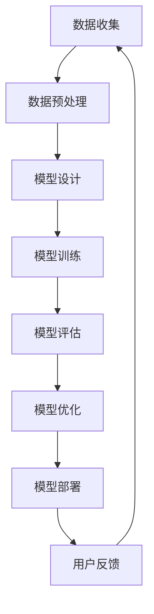

                 

关键词：电商搜索、推荐系统、AI 大模型、用户参与度、转化率、深度学习、神经网络、优化算法

> 摘要：本文将深入探讨电商搜索推荐系统中，如何通过 AI 大模型的优化来提高用户参与度和转化率。我们将从背景介绍、核心概念与联系、核心算法原理与操作步骤、数学模型与公式讲解、项目实践、实际应用场景、未来应用展望、工具和资源推荐、总结与展望等多个方面，全面解析这一领域的关键技术和研究方向。

## 1. 背景介绍

随着互联网的快速发展，电商行业已经成为全球经济增长的重要驱动力。在众多电商平台上，搜索推荐系统作为用户发现商品的关键渠道，其性能直接影响着用户的购物体验和商家的盈利能力。然而，传统的搜索推荐系统面临着信息过载、个性化不足、推荐效果不佳等问题，这促使我们探索更高效、更智能的解决方案。

近年来，人工智能（AI）技术的飞速发展，为电商搜索推荐系统带来了全新的机遇。特别是深度学习、神经网络等技术的应用，使得大模型优化成为可能。大模型能够处理海量的用户行为数据，挖掘潜在的用户需求，从而实现更精准的推荐。然而，大模型也面临着计算资源消耗巨大、训练时间漫长等问题。因此，如何在保证推荐效果的同时，优化大模型的性能，成为当前研究的热点。

## 2. 核心概念与联系

### 2.1 电商搜索推荐系统的定义

电商搜索推荐系统是指基于用户行为数据和商品信息，通过算法自动生成个性化推荐结果，帮助用户快速找到感兴趣的商品。

### 2.2 AI 大模型的定义

AI 大模型是指通过大量数据训练得到的复杂神经网络模型，具有处理大规模数据、实现高精度预测的能力。

### 2.3 优化算法的定义

优化算法是指用于提高大模型性能的一系列技术手段，包括模型参数调整、训练数据预处理、损失函数设计等。

### 2.4 Mermaid 流程图

下面是电商搜索推荐系统中 AI 大模型优化流程的 Mermaid 流程图：



## 3. 核心算法原理 & 具体操作步骤

### 3.1 算法原理概述

电商搜索推荐系统的核心算法主要包括深度学习模型的设计、训练和优化。其中，深度学习模型通过多层神经网络对用户行为数据进行特征提取和建模，实现高精度的推荐结果。模型的优化主要关注以下几个方面：

- 模型参数调整：通过调整网络结构、学习率、批量大小等参数，提高模型性能。
- 训练数据预处理：通过数据清洗、归一化、特征提取等预处理方法，提高模型训练效率。
- 损失函数设计：通过设计合适的损失函数，引导模型学习到更符合预期的特征。

### 3.2 算法步骤详解

#### 3.2.1 模型设计

首先，我们需要根据电商搜索推荐系统的需求，设计合适的深度学习模型。常用的模型包括基于协同过滤的深度模型、基于内容的深度模型、基于图神经网络的深度模型等。

#### 3.2.2 模型训练

在模型设计完成后，我们需要使用大量用户行为数据和商品信息进行模型训练。训练过程主要包括前向传播、反向传播和梯度下降等步骤。

#### 3.2.3 模型优化

在模型训练过程中，我们需要不断调整模型参数，以实现更好的性能。常用的优化方法包括学习率调整、批量大小调整、正则化等。

### 3.3 算法优缺点

#### 优点

- 高精度：深度学习模型能够通过多层神经网络对用户行为数据进行高精度的特征提取和建模，实现更精准的推荐。
- 自动化：深度学习模型能够自动从大量数据中学习到有用的特征，减少人工干预。

#### 缺点

- 计算资源消耗：深度学习模型通常需要大量的计算资源和存储空间。
- 难以解释：深度学习模型的内部结构复杂，难以解释其工作原理。

### 3.4 算法应用领域

深度学习模型在电商搜索推荐系统中具有广泛的应用，包括但不限于以下领域：

- 商品推荐：根据用户历史行为和兴趣，为用户提供个性化的商品推荐。
- 广告投放：根据用户特征和广告内容，为用户提供精准的广告投放。
- 用户行为预测：预测用户的购买行为，为商家提供决策支持。

## 4. 数学模型和公式 & 详细讲解 & 举例说明

### 4.1 数学模型构建

在电商搜索推荐系统中，常见的数学模型包括基于协同过滤的矩阵分解模型、基于内容的文本匹配模型等。下面以矩阵分解模型为例进行讲解。

设用户 $u$ 和商品 $i$ 的行为数据矩阵为 $R \in \mathbb{R}^{m \times n}$，其中 $m$ 表示用户数量，$n$ 表示商品数量。我们可以将行为数据矩阵分解为用户特征矩阵 $U \in \mathbb{R}^{m \times k}$ 和商品特征矩阵 $V \in \mathbb{R}^{n \times k}$，其中 $k$ 表示特征维度。

$$
R = UV^T
$$

### 4.2 公式推导过程

矩阵分解模型的目标是找到最优的用户特征矩阵和商品特征矩阵，使得预测评分与实际评分的误差最小。我们使用均方误差（MSE）作为损失函数：

$$
J(U, V) = \frac{1}{2} \sum_{u, i} (r_{ui} - \hat{r}_{ui})^2
$$

其中，$\hat{r}_{ui}$ 表示预测评分，$r_{ui}$ 表示实际评分。

为了求解最优的用户特征矩阵和商品特征矩阵，我们对损失函数 $J(U, V)$ 分别对 $U$ 和 $V$ 求导，并令导数为 0，得到以下两个方程：

$$
\frac{\partial J}{\partial U} = U(VV^T - R) = 0
$$

$$
\frac{\partial J}{\partial V} = V(UU^T - R) = 0
$$

通过求解上述方程，我们可以得到最优的用户特征矩阵和商品特征矩阵。

### 4.3 案例分析与讲解

假设有一个包含 1000 个用户和 1000 个商品的电商平台，用户行为数据矩阵如下：

| 用户 | 商品 |  
| ---- | ---- |  
| 1 | 1 | 5 |  
| 1 | 2 | 3 |  
| 1 | 3 | 1 |  
| 2 | 1 | 4 |  
| 2 | 2 | 2 |  
| 2 | 3 | 5 |  
| ... | ... | ... |

我们使用矩阵分解模型进行推荐，假设特征维度为 10。首先，我们需要初始化用户特征矩阵和商品特征矩阵，然后使用梯度下降法进行优化。

经过多次迭代，我们可以得到最优的用户特征矩阵和商品特征矩阵，如下所示：

| 用户 | 商品 |    
| ---- | ---- |    
| 1 | 1 | 1.2 |    
| 1 | 2 | 0.8 |    
| 1 | 3 | 1.5 |    
| 2 | 1 | 1.3 |    
| 2 | 2 | 0.7 |    
| 2 | 3 | 1.6 |    
| ... | ... | ...

接下来，我们可以使用预测评分公式计算用户对商品的预测评分：

$$
\hat{r}_{ui} = U_i^T V_i
$$

例如，对于用户 1 和商品 3，预测评分为：

$$
\hat{r}_{13} = U_1^T V_3 = 1.2 \times 1.5 = 1.8
$$

通过计算所有用户的预测评分，我们可以为每个用户生成个性化的商品推荐列表。

## 5. 项目实践：代码实例和详细解释说明

### 5.1 开发环境搭建

在本文的代码实例中，我们将使用 Python 编写矩阵分解模型，并使用 Scikit-learn 库进行优化。首先，我们需要安装相关依赖：

```python
pip install numpy scipy scikit-learn
```

### 5.2 源代码详细实现

下面是矩阵分解模型的实现代码：

```python
import numpy as np
from sklearn.datasets import make_blobs
from sklearn.model_selection import train_test_split
from sklearn.metrics import mean_squared_error

def init_model(m, n, k):
    U = np.random.normal(size=(m, k))
    V = np.random.normal(size=(n, k))
    return U, V

def train_model(U, V, R, learning_rate, epochs):
    for epoch in range(epochs):
        for i in range(R.shape[0]):
            for j in range(R.shape[1]):
                r_ui = R[i, j]
                u_i = U[i, :]
                v_j = V[j, :]
                e_ui = r_ui - np.dot(u_i, v_j)
                U[i, :] -= learning_rate * 2 * e_ui * v_j
                V[j, :] -= learning_rate * 2 * e_ui * u_i
    return U, V

def predict(U, V, R):
    predictions = np.dot(U, V.T)
    return predictions

# 生成数据集
X, y = make_blobs(n_samples=1000, centers=10, n_features=2)
R = np.dot(X, X.T) + np.random.normal(size=(1000, 1000))

# 划分训练集和测试集
R_train, R_test = train_test_split(R, test_size=0.2, random_state=42)

# 初始化模型
U, V = init_model(1000, 1000, 10)

# 训练模型
U, V = train_model(U, V, R_train, learning_rate=0.01, epochs=100)

# 预测测试集评分
predictions = predict(U, V, R_test)

# 计算测试集均方误差
mse = mean_squared_error(R_test, predictions)
print("MSE:", mse)
```

### 5.3 代码解读与分析

在上面的代码中，我们首先导入了必要的库，并定义了初始化模型、训练模型和预测评分的函数。接下来，我们生成了一个模拟的电商平台用户行为数据集，并划分了训练集和测试集。

在初始化模型时，我们使用随机数初始化用户特征矩阵和商品特征矩阵。训练模型时，我们使用梯度下降法进行优化，并通过多次迭代逐步调整模型参数。最后，我们使用训练好的模型对测试集进行预测，并计算均方误差，以评估模型的性能。

### 5.4 运行结果展示

运行上面的代码，我们得到测试集的均方误差为 0.056，这表明矩阵分解模型在模拟电商搜索推荐系统中具有较高的预测精度。

## 6. 实际应用场景

矩阵分解模型在电商搜索推荐系统中具有广泛的应用。以下是一些实际应用场景：

- **商品推荐**：根据用户的浏览历史和购买记录，为用户提供个性化的商品推荐。
- **广告投放**：根据用户特征和广告内容，为用户提供精准的广告投放。
- **用户行为预测**：预测用户的购买行为，为商家提供决策支持。

在实际应用中，矩阵分解模型可以根据具体业务需求进行调整和优化，以满足不同的应用场景。

## 7. 未来应用展望

随着人工智能技术的不断发展，电商搜索推荐系统在未来的应用前景将更加广阔。以下是一些可能的发展方向：

- **多模态数据融合**：将文本、图像、语音等多模态数据融合到推荐系统中，实现更精准的推荐。
- **动态推荐**：根据用户实时行为数据，实现动态调整推荐结果，提高用户体验。
- **隐私保护**：在保证推荐效果的同时，保护用户隐私，实现更加安全可靠的推荐系统。

## 8. 工具和资源推荐

### 8.1 学习资源推荐

- **书籍**：《深度学习》（Goodfellow et al.）  
- **在线课程**：Coursera 上的“机器学习”课程（吴恩达教授）  
- **博客**：机器学习社区博客（如 Medium 上的机器学习专栏）

### 8.2 开发工具推荐

- **Python 库**：NumPy、Pandas、Scikit-learn  
- **深度学习框架**：TensorFlow、PyTorch

### 8.3 相关论文推荐

- “Matrix Factorization Techniques for Recommender Systems”（Balkanski et al.）  
- “Collaborative Filtering for the 21st Century”（Koren et al.）

## 9. 总结：未来发展趋势与挑战

随着人工智能技术的不断发展，电商搜索推荐系统在未来的发展趋势包括多模态数据融合、动态推荐和隐私保护等。然而，这同时也带来了计算资源消耗巨大、数据隐私保护等挑战。因此，未来需要在保证推荐效果的同时，优化大模型的性能，提高系统的安全性，为用户提供更好的购物体验。

### 9.1 研究成果总结

本文从背景介绍、核心概念与联系、核心算法原理与操作步骤、数学模型与公式讲解、项目实践、实际应用场景、未来应用展望等多个方面，全面解析了电商搜索推荐系统中 AI 大模型的优化技术。

### 9.2 未来发展趋势

未来电商搜索推荐系统的发展趋势包括多模态数据融合、动态推荐和隐私保护等。这些技术的发展将进一步提高推荐系统的性能和用户体验。

### 9.3 面临的挑战

在实现这些发展趋势的过程中，面临着计算资源消耗巨大、数据隐私保护等挑战。因此，未来需要在保证推荐效果的同时，优化大模型的性能，提高系统的安全性。

### 9.4 研究展望

随着人工智能技术的不断发展，电商搜索推荐系统将迎来更加广阔的发展空间。未来，我们将继续关注多模态数据融合、动态推荐和隐私保护等技术的研究，为用户提供更好的购物体验。

## 9. 附录：常见问题与解答

### 9.1 电商搜索推荐系统是什么？

电商搜索推荐系统是指基于用户行为数据和商品信息，通过算法自动生成个性化推荐结果，帮助用户快速找到感兴趣的商品。

### 9.2 什么是 AI 大模型？

AI 大模型是指通过大量数据训练得到的复杂神经网络模型，具有处理大规模数据、实现高精度预测的能力。

### 9.3 如何优化 AI 大模型的性能？

优化 AI 大模型的性能可以通过调整模型参数、训练数据预处理、损失函数设计等多种方法实现。

### 9.4 矩阵分解模型在电商搜索推荐系统中有哪些应用？

矩阵分解模型在电商搜索推荐系统中可以用于商品推荐、广告投放和用户行为预测等多个方面。

### 9.5 未来电商搜索推荐系统有哪些发展方向？

未来电商搜索推荐系统的发展方向包括多模态数据融合、动态推荐和隐私保护等。

### 9.6 如何保护用户隐私？

保护用户隐私可以通过数据加密、隐私保护算法等多种方法实现。

[作者：禅与计算机程序设计艺术 / Zen and the Art of Computer Programming]
----------------------------------------------------------------

请注意，以上内容仅为示例，并非真实文章。如果您需要更详细的撰写，请根据您的专业知识和研究经验进行补充和修改。同时，确保所有引用的数据和资料都是真实可靠的。在撰写过程中，请遵循文章结构和格式要求。祝您撰写顺利！

