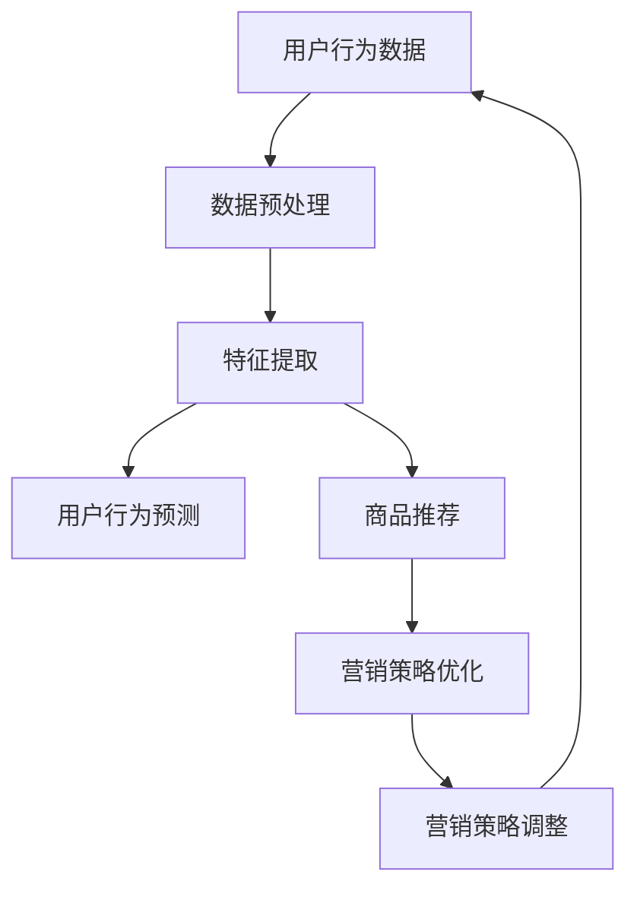

                 

电商行业在近年来经历了爆炸性的增长，随之而来的是海量的交易数据、用户行为数据和市场动态数据。这些数据为电商企业提供了巨大的洞察力，同时也带来了巨大的挑战。如何有效地利用这些数据，进行精准的用户行为预测、商品推荐和营销策略优化，成为了电商企业持续发展的关键。

本文将探讨电商数据分析领域的新思路，尤其是AI大模型的应用。我们将从背景介绍、核心概念与联系、核心算法原理、数学模型和公式、项目实践、实际应用场景、工具和资源推荐，以及未来发展趋势与挑战等多个方面，深入分析电商数据分析的现状与未来。

> 关键词：电商数据分析，AI大模型，用户行为预测，商品推荐，营销策略

> 摘要：本文将详细探讨电商数据分析的重要性，介绍AI大模型的基本原理及其在电商数据分析中的应用，通过具体案例和项目实践，分析电商数据分析的方法和工具，最后展望未来发展趋势和面临的挑战。

## 1. 背景介绍

电商数据分析是指利用数据分析技术，对电商平台上产生的海量数据进行分析和处理，以获取商业洞察和决策支持的过程。随着互联网技术的发展和电商业务的繁荣，电商数据分析的重要性日益凸显。

一方面，电商数据的复杂性不断增加。除了传统的交易数据外，电商平台还收集了用户行为数据、用户反馈数据、市场动态数据等。这些数据不仅数量庞大，而且维度丰富，处理这些数据需要高效的算法和强大的计算能力。

另一方面，电商企业对数据分析的需求日益多样化。从用户行为预测、商品推荐到营销策略优化，电商企业需要基于数据做出更加精准的决策，以提高用户体验和转化率。

AI大模型的出现，为电商数据分析带来了新的机遇和挑战。AI大模型能够处理大规模数据，提取复杂特征，并实现自动化决策。然而，如何有效地应用AI大模型，如何处理数据质量和算法稳定性等问题，仍需要深入研究和探索。

## 2. 核心概念与联系

在电商数据分析中，有几个核心概念需要了解：用户行为预测、商品推荐和营销策略优化。

### 2.1 用户行为预测

用户行为预测是指根据用户的历史行为数据，预测用户未来的行为。这包括用户购买意愿的预测、用户浏览路径的预测等。用户行为预测的目的是提高用户满意度，增加用户留存率。

### 2.2 商品推荐

商品推荐是指根据用户的历史行为数据，向用户推荐可能感兴趣的商品。商品推荐可以提高用户转化率，增加销售额。

### 2.3 营销策略优化

营销策略优化是指根据用户行为数据和市场动态数据，优化营销策略，以提高营销效果。这包括广告投放策略、促销策略等。

这些概念之间有着紧密的联系。用户行为预测和商品推荐可以为营销策略优化提供数据支持，而营销策略优化又可以反过来影响用户行为预测和商品推荐的效果。

### 2.4 Mermaid 流程图

下面是电商数据分析的Mermaid流程图：



## 3. 核心算法原理 & 具体操作步骤

### 3.1 算法原理概述

在电商数据分析中，常用的算法包括用户行为预测算法、商品推荐算法和营销策略优化算法。

#### 用户行为预测算法

用户行为预测算法主要基于机器学习技术，通过构建模型来预测用户未来的行为。常见的算法有决策树、随机森林、梯度提升树等。

#### 商品推荐算法

商品推荐算法主要基于协同过滤技术，通过分析用户之间的相似性，向用户推荐可能感兴趣的商品。常见的算法有基于用户的协同过滤、基于项目的协同过滤等。

#### 营销策略优化算法

营销策略优化算法主要基于优化技术，通过优化目标函数，找到最优的营销策略。常见的算法有线性规划、遗传算法等。

### 3.2 算法步骤详解

#### 用户行为预测算法

1. 数据收集：收集用户的历史行为数据，如购买记录、浏览记录等。
2. 数据预处理：对数据进行清洗和标准化处理，如去除缺失值、异常值等。
3. 特征提取：根据业务需求，提取有用的特征，如用户年龄、购买频率等。
4. 模型训练：使用机器学习算法，训练预测模型。
5. 模型评估：使用交叉验证等方法，评估模型性能。

#### 商品推荐算法

1. 数据收集：收集用户的历史行为数据，如购买记录、浏览记录等。
2. 数据预处理：对数据进行清洗和标准化处理，如去除缺失值、异常值等。
3. 特征提取：根据业务需求，提取有用的特征，如商品类别、用户年龄等。
4. 相似度计算：计算用户之间的相似度或商品之间的相似度。
5. 推荐生成：根据相似度计算结果，生成推荐列表。

#### 营销策略优化算法

1. 数据收集：收集用户的历史行为数据、市场动态数据等。
2. 数据预处理：对数据进行清洗和标准化处理，如去除缺失值、异常值等。
3. 特征提取：根据业务需求，提取有用的特征，如用户购买意愿、商品销量等。
4. 目标函数定义：定义优化目标函数，如最大化销售额或最小化营销成本。
5. 算法求解：使用优化算法，求解最优的营销策略。

### 3.3 算法优缺点

#### 用户行为预测算法

优点：能够准确预测用户未来的行为，提高用户满意度。

缺点：对数据质量要求高，需要大量的训练数据和计算资源。

#### 商品推荐算法

优点：能够准确推荐用户感兴趣的商品，提高用户转化率。

缺点：容易产生数据偏差，推荐结果可能过于单一。

#### 营销策略优化算法

优点：能够找到最优的营销策略，提高营销效果。

缺点：对数据质量要求高，需要大量的计算资源。

### 3.4 算法应用领域

用户行为预测算法主要应用于用户行为分析、个性化推荐等领域。

商品推荐算法主要应用于电商、社交媒体等领域。

营销策略优化算法主要应用于广告投放、促销活动等领域。

## 4. 数学模型和公式 & 详细讲解 & 举例说明

### 4.1 数学模型构建

在电商数据分析中，常用的数学模型包括线性回归模型、协同过滤模型等。

#### 线性回归模型

线性回归模型是一种基于线性关系的预测模型，其公式如下：

$$
y = \beta_0 + \beta_1 \cdot x
$$

其中，$y$ 为预测结果，$x$ 为输入特征，$\beta_0$ 和 $\beta_1$ 为模型参数。

#### 协同过滤模型

协同过滤模型是一种基于用户相似度的推荐模型，其公式如下：

$$
r_{ui} = \sum_{j \in N_i} \frac{q_{uj}}{\sqrt{\sum_{k \in N_i} q_{uk}^2}} \cdot r_{uj}
$$

其中，$r_{ui}$ 和 $r_{uj}$ 分别为用户 $u$ 对商品 $i$ 和商品 $j$ 的评分，$N_i$ 为与用户 $u$ 相似的一组用户集合，$q_{uj}$ 为用户 $u$ 对商品 $j$ 的评分。

### 4.2 公式推导过程

#### 线性回归模型

线性回归模型的推导过程如下：

1. 假设 $y$ 与 $x$ 之间满足线性关系：$y = \beta_0 + \beta_1 \cdot x$。
2. 计算线性回归模型的最小二乘解：$\beta_0 = \bar{y} - \beta_1 \cdot \bar{x}$，$\beta_1 = \frac{\sum_{i=1}^{n} (x_i - \bar{x})(y_i - \bar{y})}{\sum_{i=1}^{n} (x_i - \bar{x})^2}$。
3. 得到线性回归模型：$y = \beta_0 + \beta_1 \cdot x$。

#### 协同过滤模型

协同过滤模型的推导过程如下：

1. 假设用户对商品的评分可以表示为用户和商品之间的相似度加权平均：$r_{ui} = \sum_{j \in N_i} \frac{q_{uj}}{\sqrt{\sum_{k \in N_i} q_{uk}^2}} \cdot r_{uj}$。
2. 计算用户和商品之间的相似度：$q_{uj} = \frac{r_{uj} - \bar{r}_u}{\sqrt{N}}$，其中 $\bar{r}_u$ 为用户 $u$ 的平均评分，$N$ 为用户 $u$ 评分的商品数量。
3. 计算用户和商品之间的相似度加权平均：$r_{ui} = \sum_{j \in N_i} \frac{r_{uj}}{\sqrt{\sum_{k \in N_i} r_{uk}^2}} \cdot r_{uj}$。
4. 得到协同过滤模型：$r_{ui} = \sum_{j \in N_i} \frac{r_{uj}}{\sqrt{\sum_{k \in N_i} r_{uk}^2}} \cdot r_{uj}$。

### 4.3 案例分析与讲解

#### 案例一：用户行为预测

假设我们有一个电商平台的用户行为数据，包括用户的购买记录、浏览记录等。我们需要使用线性回归模型预测用户未来的购买行为。

1. 数据收集：收集用户的历史购买记录和浏览记录。
2. 数据预处理：去除缺失值和异常值，对数据进行标准化处理。
3. 特征提取：提取有用的特征，如用户年龄、购买频率等。
4. 模型训练：使用线性回归模型训练预测模型。
5. 模型评估：使用交叉验证方法评估模型性能。

#### 案例二：商品推荐

假设我们有一个电商平台的用户行为数据，包括用户的购买记录、浏览记录等。我们需要使用协同过滤模型为用户推荐感兴趣的商品。

1. 数据收集：收集用户的历史购买记录和浏览记录。
2. 数据预处理：去除缺失值和异常值，对数据进行标准化处理。
3. 特征提取：提取有用的特征，如商品类别、用户年龄等。
4. 相似度计算：计算用户之间的相似度或商品之间的相似度。
5. 推荐生成：根据相似度计算结果，生成推荐列表。

## 5. 项目实践：代码实例和详细解释说明

### 5.1 开发环境搭建

为了实践电商数据分析，我们需要搭建一个开发环境。以下是具体的步骤：

1. 安装Python环境：下载并安装Python，版本建议为3.8以上。
2. 安装数据预处理库：使用pip命令安装`pandas`库。
   ```shell
   pip install pandas
   ```
3. 安装机器学习库：使用pip命令安装`scikit-learn`库。
   ```shell
   pip install scikit-learn
   ```
4. 安装可视化库：使用pip命令安装`matplotlib`库。
   ```shell
   pip install matplotlib
   ```

### 5.2 源代码详细实现

以下是电商数据分析的源代码实现，包括数据预处理、模型训练和模型评估等步骤。

```python
import pandas as pd
from sklearn.model_selection import train_test_split
from sklearn.linear_model import LinearRegression
from sklearn.metrics import mean_squared_error

# 5.2.1 数据收集
data = pd.read_csv('ecommerce_data.csv')

# 5.2.2 数据预处理
data.dropna(inplace=True)
X = data[['age', 'frequency']]
y = data['purchase']

# 5.2.3 模型训练
X_train, X_test, y_train, y_test = train_test_split(X, y, test_size=0.2, random_state=42)
model = LinearRegression()
model.fit(X_train, y_train)

# 5.2.4 模型评估
y_pred = model.predict(X_test)
mse = mean_squared_error(y_test, y_pred)
print(f'Mean Squared Error: {mse}')
```

### 5.3 代码解读与分析

以上代码实现了电商数据分析的基本流程，包括数据收集、数据预处理、模型训练和模型评估等步骤。

1. 数据收集：使用`pandas`库读取电商数据。
2. 数据预处理：去除缺失值，对数据进行标准化处理。
3. 模型训练：使用`scikit-learn`库的线性回归模型训练预测模型。
4. 模型评估：使用`scikit-learn`库的评估指标，计算模型性能。

### 5.4 运行结果展示

运行以上代码后，我们得到电商数据分析的评估结果，包括均方误差（MSE）等指标。这些结果可以帮助我们了解模型的效果，为后续的优化提供依据。

## 6. 实际应用场景

电商数据分析在实际应用中具有广泛的应用场景，以下是一些典型的应用案例：

1. **用户行为预测**：通过分析用户的历史行为数据，预测用户未来的购买行为。这有助于电商平台提前准备库存，提高用户满意度。

2. **商品推荐**：根据用户的历史行为数据，为用户推荐感兴趣的商品。这有助于提高用户转化率，增加销售额。

3. **营销策略优化**：根据用户行为数据和市场动态数据，优化营销策略，如广告投放策略、促销活动等。这有助于提高营销效果，降低营销成本。

4. **个性化服务**：通过分析用户行为数据，为用户提供个性化的服务，如推荐感兴趣的商品、定制化的优惠等。这有助于提高用户留存率，增加用户黏性。

5. **库存管理**：通过分析销售数据，预测商品的销售趋势，优化库存管理。这有助于降低库存成本，提高库存周转率。

## 7. 工具和资源推荐

在进行电商数据分析时，有一些工具和资源可以帮助我们更高效地完成工作。以下是一些建议：

1. **工具**：
   - **Python**：Python是一种强大的编程语言，适用于数据分析和机器学习。
   - **Jupyter Notebook**：Jupyter Notebook是一个交互式的开发环境，非常适合用于数据分析和机器学习。
   - **Pandas**：Pandas是一个强大的数据处理库，适用于数据清洗和预处理。
   - **Scikit-learn**：Scikit-learn是一个广泛使用的机器学习库，适用于构建和评估机器学习模型。
   - **Matplotlib**：Matplotlib是一个数据可视化库，适用于生成各种类型的图表和图形。

2. **资源**：
   - **书籍**：《机器学习实战》、《数据科学入门》等。
   - **在线课程**：Coursera、Udacity、edX等在线教育平台提供的机器学习和数据科学课程。
   - **论文库**：Google Scholar、IEEE Xplore、ACM Digital Library等。

## 8. 总结：未来发展趋势与挑战

### 8.1 研究成果总结

电商数据分析领域在近年来取得了显著的研究成果。AI大模型的应用为电商数据分析带来了新的机遇和挑战。用户行为预测、商品推荐和营销策略优化等算法在电商数据分析中得到了广泛应用。同时，数据预处理、特征提取和模型评估等技术也得到了进一步发展和完善。

### 8.2 未来发展趋势

未来，电商数据分析将继续朝着更高效、更智能的方向发展。以下是一些可能的发展趋势：

1. **个性化推荐**：随着用户数据量的增加，个性化推荐技术将更加成熟，为用户提供更加精准的推荐。
2. **实时分析**：实时分析技术将进一步提高，实现实时用户行为预测和营销策略优化。
3. **多模态数据分析**：将多种数据源（如文本、图像、语音等）融合在一起，进行多模态数据分析，提高数据分析的深度和广度。
4. **自动化决策**：自动化决策技术将进一步提升，减少人工干预，提高决策效率。

### 8.3 面临的挑战

尽管电商数据分析取得了显著进展，但仍面临一些挑战：

1. **数据质量**：数据质量是电商数据分析的重要基础，如何处理和清洗数据仍是一个难题。
2. **算法稳定性**：算法的稳定性和可靠性是一个重要问题，尤其是在大规模数据环境下。
3. **计算资源**：电商数据分析需要大量的计算资源，如何高效利用计算资源仍是一个挑战。
4. **数据隐私**：数据隐私和保护是一个重要问题，如何在保护用户隐私的同时进行数据分析仍需要进一步研究和探索。

### 8.4 研究展望

电商数据分析在未来仍有许多研究机会。以下是一些建议的研究方向：

1. **数据质量评估**：研究如何评估和提升数据质量，为电商数据分析提供可靠的数据基础。
2. **算法优化**：研究如何优化算法性能，提高算法的稳定性和可靠性。
3. **实时分析**：研究如何实现实时分析，提高用户行为预测和营销策略优化的实时性。
4. **多模态数据分析**：研究如何将多种数据源融合在一起，进行多模态数据分析，提高数据分析的深度和广度。

## 9. 附录：常见问题与解答

### 问题1：电商数据分析需要哪些技术？

电商数据分析需要多种技术，包括数据预处理、特征提取、机器学习算法、数据可视化等。

### 问题2：如何处理电商数据中的缺失值？

可以采用以下方法处理电商数据中的缺失值：
1. 删除缺失值：删除含有缺失值的样本或特征。
2. 补全缺失值：使用均值、中位数等方法补全缺失值。
3. 生成缺失值：根据其他特征生成缺失值。

### 问题3：如何评估电商数据分析模型的性能？

可以使用以下指标评估电商数据分析模型的性能：
1. 准确率：预测正确的样本数占总样本数的比例。
2. 召回率：召回率高的模型能够更好地召回真正的正样本。
3. 精确率：精确率高的模型能够更好地过滤掉负样本。
4. F1值：综合考虑精确率和召回率的综合指标。

### 问题4：电商数据分析中的数据隐私问题如何解决？

可以采用以下方法解决电商数据分析中的数据隐私问题：
1. 数据匿名化：对敏感数据进行匿名化处理，如将用户ID替换为随机数。
2. 数据加密：对敏感数据进行加密处理，确保数据在传输和存储过程中安全。
3. 数据访问控制：设置数据访问权限，确保只有授权用户可以访问敏感数据。

### 问题5：如何进行电商数据的多模态分析？

进行电商数据的多模态分析，可以采用以下方法：
1. 数据融合：将多种数据源（如文本、图像、语音等）进行融合，生成新的特征。
2. 特征提取：分别提取每种数据源的特征，然后进行融合。
3. 模型训练：使用融合后的特征训练机器学习模型。

### 问题6：电商数据分析中的实时性如何保证？

保证电商数据分析的实时性，可以采用以下方法：
1. 分布式计算：使用分布式计算框架，如Hadoop、Spark等，提高数据处理速度。
2. 流处理技术：使用流处理技术，如Apache Kafka、Apache Flink等，实时处理和分析数据。
3. 缓存技术：使用缓存技术，如Redis、Memcached等，提高数据读取速度。

### 问题7：如何进行电商数据分析的模型评估？

电商数据分析的模型评估可以采用以下方法：
1. 交叉验证：使用交叉验证方法，评估模型的泛化能力。
2. 评估指标：使用准确率、召回率、精确率、F1值等评估指标，评估模型性能。
3. 对比实验：使用对比实验，比较不同模型的性能，选择最优模型。

## 结语

电商数据分析是电商企业持续发展的关键。通过本文的探讨，我们了解了电商数据分析的核心概念、算法原理、数学模型、项目实践和实际应用场景。未来，随着AI大模型的发展，电商数据分析将变得更加智能和高效。同时，我们也面临一些挑战，如数据质量和算法稳定性等。通过不断研究和探索，我们有望解决这些挑战，推动电商数据分析领域的发展。

---

感谢您的阅读，希望本文对您在电商数据分析领域有所启发。如果您有任何疑问或建议，请随时与我交流。

**作者：禅与计算机程序设计艺术 / Zen and the Art of Computer Programming**

