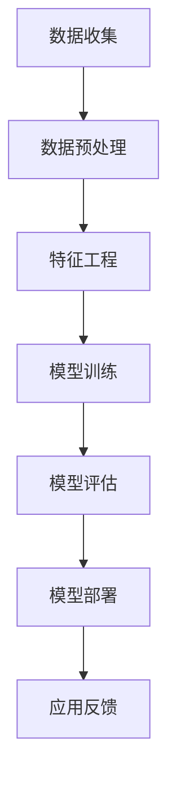

                 

关键词：电商、数据挖掘、AI大模型、算法、应用场景、发展趋势

## 摘要

本文旨在探讨电商领域数据挖掘的最新进展，重点介绍基于AI大模型的挖掘方法。随着大数据和人工智能技术的迅猛发展，电商数据挖掘已成为提升用户体验、优化运营策略的重要手段。本文将首先回顾电商数据挖掘的背景，然后详细阐述AI大模型的核心概念及其在电商数据挖掘中的应用，包括算法原理、操作步骤、数学模型构建、实际项目实践以及未来发展趋势和面临的挑战。

## 1. 背景介绍

### 1.1 电商数据挖掘的定义与意义

电商数据挖掘是指利用数据挖掘技术，从电商平台的庞大数据集中提取有价值的信息，用于市场分析、用户行为预测、推荐系统优化等。这些信息可以帮助电商企业更好地理解客户需求，提升用户体验，优化运营策略，从而增加销售额和市场份额。

### 1.2 电商数据挖掘的发展历程

随着互联网的普及和电子商务的快速发展，电商数据挖掘技术也经历了从简单的统计分析到复杂的数据挖掘算法的演变。早期的电商数据挖掘主要基于用户行为数据和交易数据，通过简单的统计分析方法进行用户画像和推荐系统构建。随着大数据和人工智能技术的引入，电商数据挖掘方法逐渐向智能化和自动化方向发展。

## 2. 核心概念与联系

### 2.1 AI大模型的概念

AI大模型是指通过深度学习和大数据技术训练的，具有大规模参数和复杂结构的人工智能模型。这些模型通常具有强大的特征提取和模式识别能力，能够处理海量数据和复杂任务。

### 2.2 AI大模型在电商数据挖掘中的应用

AI大模型在电商数据挖掘中的应用主要体现在用户行为预测、商品推荐、价格优化、广告投放等方面。通过大规模数据训练，AI大模型能够深入挖掘用户行为规律，准确预测用户偏好，从而实现个性化推荐和精准营销。

### 2.3 Mermaid 流程图

下面是一个简单的Mermaid流程图，展示了AI大模型在电商数据挖掘中的应用流程：



## 3. 核心算法原理 & 具体操作步骤

### 3.1 算法原理概述

AI大模型在电商数据挖掘中的核心算法主要基于深度学习和强化学习。深度学习通过多层神经网络提取数据特征，实现自动特征工程；强化学习则通过不断尝试和反馈，优化决策过程，实现智能推荐和策略优化。

### 3.2 算法步骤详解

1. **数据收集**：收集电商平台的用户行为数据、交易数据、商品数据等。
2. **数据预处理**：清洗数据，包括缺失值处理、异常值检测和去重等。
3. **特征工程**：提取用户行为特征、商品属性特征等，为模型训练提供输入。
4. **模型训练**：使用深度学习和强化学习算法训练大模型，包括模型架构设计、超参数调优等。
5. **模型评估**：评估模型性能，包括准确性、召回率、F1值等指标。
6. **模型部署**：将训练好的模型部署到生产环境，实现实时推荐和策略优化。
7. **应用反馈**：收集用户反馈数据，优化模型和策略。

### 3.3 算法优缺点

**优点**：
1. 强大的特征提取和模式识别能力。
2. 自动化特征工程，降低人工干预。
3. 能够处理大规模数据和复杂任务。

**缺点**：
1. 模型训练时间较长，资源消耗大。
2. 模型解释性较差，难以理解决策过程。

### 3.4 算法应用领域

AI大模型在电商数据挖掘中的应用领域广泛，包括用户行为预测、商品推荐、价格优化、广告投放等。以下是一个应用领域的示例：

- **用户行为预测**：通过分析用户历史行为，预测用户未来行为，如购买意向、浏览路径等。
- **商品推荐**：根据用户兴趣和购买历史，推荐个性化商品。
- **价格优化**：根据市场趋势和用户购买行为，动态调整商品价格。

## 4. 数学模型和公式 & 详细讲解 & 举例说明

### 4.1 数学模型构建

电商数据挖掘中的数学模型通常包括用户行为预测模型、商品推荐模型、价格优化模型等。以下是一个简单的用户行为预测模型的数学模型：

$$
P(y|X) = \frac{e^{\theta^T X}}{1 + e^{\theta^T X}}
$$

其中，$P(y|X)$ 表示在给定特征向量 $X$ 下，用户会采取行为 $y$ 的概率；$\theta$ 表示模型的参数。

### 4.2 公式推导过程

用户行为预测模型的推导过程如下：

1. **概率假设**：假设用户行为 $y$ 是一个二分类变量，取值为 0 或 1。
2. **特征向量**：特征向量 $X$ 包括用户的历史行为特征、商品特征等。
3. **线性模型**：假设用户行为 $y$ 与特征向量 $X$ 之间存在线性关系。
4. **逻辑回归**：使用逻辑回归模型表示用户行为的概率分布。

### 4.3 案例分析与讲解

以下是一个用户行为预测的案例：

- **数据集**：包含1000个用户的历史行为数据，包括浏览记录、购买记录等。
- **特征**：用户历史行为次数、浏览时长、购买金额等。
- **模型**：使用逻辑回归模型预测用户购买概率。

假设我们使用以下特征向量表示用户：

$$
X = [x_1, x_2, x_3]
$$

其中，$x_1$ 表示用户历史购买次数，$x_2$ 表示用户历史浏览时长，$x_3$ 表示用户历史购买金额。

使用逻辑回归模型预测用户购买概率：

$$
P(y=1|X) = \frac{e^{0.5x_1 + 0.3x_2 + 0.2x_3}}{1 + e^{0.5x_1 + 0.3x_2 + 0.2x_3}}
$$

通过训练和测试数据集，可以计算出模型参数 $\theta$，然后使用该模型预测新用户的行为。

## 5. 项目实践：代码实例和详细解释说明

### 5.1 开发环境搭建

1. 安装Python 3.7及以上版本。
2. 安装PyTorch、Scikit-learn等常用库。

### 5.2 源代码详细实现

以下是一个简单的用户行为预测模型的代码实现：

```python
import torch
import torch.nn as nn
import torch.optim as optim
from sklearn.model_selection import train_test_split
from sklearn.preprocessing import StandardScaler

# 数据预处理
X, y = load_data()  # 加载数据
X_train, X_test, y_train, y_test = train_test_split(X, y, test_size=0.2, random_state=42)
scaler = StandardScaler()
X_train = scaler.fit_transform(X_train)
X_test = scaler.transform(X_test)

# 模型定义
class UserBehaviorModel(nn.Module):
    def __init__(self):
        super(UserBehaviorModel, self).__init__()
        self.fc1 = nn.Linear(3, 10)
        self.fc2 = nn.Linear(10, 1)
        self.relu = nn.ReLU()

    def forward(self, x):
        x = self.relu(self.fc1(x))
        x = self.fc2(x)
        return torch.sigmoid(x)

# 模型训练
model = UserBehaviorModel()
optimizer = optim.Adam(model.parameters(), lr=0.001)
criterion = nn.BCELoss()

for epoch in range(100):
    optimizer.zero_grad()
    outputs = model(X_train)
    loss = criterion(outputs, y_train)
    loss.backward()
    optimizer.step()

    if (epoch + 1) % 10 == 0:
        print(f'Epoch [{epoch + 1}/100], Loss: {loss.item()}')

# 模型评估
with torch.no_grad():
    outputs = model(X_test)
    predicted = (outputs > 0.5).float()
    accuracy = (predicted == y_test).float().mean()
    print(f'Accuracy: {accuracy.item()}')

# 模型部署
new_user = torch.tensor([[1, 2, 3]])
predicted概率 = model(new_user)
print(f'Purchase Probability: {predicted.item()}')
```

### 5.3 代码解读与分析

1. **数据预处理**：加载数据，进行数据预处理，包括数据分

