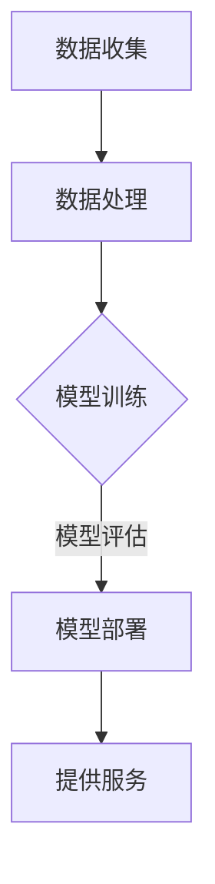

                 

关键词：电商、人工智能、大模型、伦理、隐私

> 摘要：本文深入探讨了电商行业在应用人工智能（AI）大模型过程中所面临的伦理和隐私问题。通过对AI大模型的基本概念、工作原理及其在电商行业中的应用场景的介绍，本文分析了AI大模型可能带来的伦理挑战，特别是在数据隐私保护方面的难题。同时，文章还提出了相应的解决策略和建议，以促进AI技术在电商领域的可持续发展。

## 1. 背景介绍

随着互联网技术的迅猛发展，电子商务已经成为全球经济发展的重要驱动力。据统计，全球电商市场规模在2022年已经超过了3万亿美元，并且这一数字预计还将持续增长。在这种背景下，人工智能（AI）技术，尤其是大模型，被广泛应用于电商行业的各个方面，从个性化推荐、智能客服到供应链优化等。

大模型是指那些具有数十亿甚至千亿参数的深度学习模型，它们能够通过大量数据进行训练，从而获得强大的特征提取和模式识别能力。在电商行业，大模型的应用不仅提高了业务的效率，也显著提升了用户体验。

然而，随着AI大模型在电商行业的广泛应用，伦理和隐私问题逐渐成为行业关注的焦点。数据隐私泄露、算法偏见、滥用用户数据等问题频繁出现，给用户和企业带来了巨大的风险。因此，如何在发挥AI大模型优势的同时，确保用户的隐私和权益，成为电商行业面临的重要挑战。

## 2. 核心概念与联系

### 2.1 人工智能大模型的基本概念

人工智能大模型（Large-scale Artificial Intelligence Models）是指那些具有极高参数量的深度学习模型。这些模型通常通过大量的数据训练，能够自动地从数据中学习复杂的模式和规律。大模型通常采用神经网络结构，特别是深度神经网络（DNN），具有多层非线性变换的能力。

### 2.2 电商行业中的应用场景

在电商行业中，AI大模型的应用场景广泛。以下是几个典型的应用：

- **个性化推荐系统**：通过分析用户的浏览历史、购买行为和偏好，AI大模型能够为用户提供个性化的商品推荐，提升用户体验和转化率。
- **智能客服**：利用自然语言处理（NLP）技术，AI大模型可以模拟人类客服，回答用户的问题，提高客服效率和用户满意度。
- **供应链优化**：通过分析大量订单数据和市场信息，AI大模型能够优化库存管理、物流调度等，降低运营成本，提高供应链效率。

### 2.3 大模型工作原理

大模型的工作原理主要基于以下几个步骤：

1. **数据收集**：从多个来源收集大量数据，包括用户行为数据、市场数据、商品数据等。
2. **数据处理**：对收集到的数据进行清洗、去重、归一化等预处理操作。
3. **模型训练**：使用深度学习算法，如卷积神经网络（CNN）、递归神经网络（RNN）等，对预处理后的数据进行训练，优化模型参数。
4. **模型评估**：通过测试数据对模型进行评估，调整模型参数，确保模型性能。
5. **模型部署**：将训练好的模型部署到生产环境中，为用户提供服务。

### 2.4 伦理与隐私考量

AI大模型的伦理和隐私考量主要涉及以下几个方面：

- **数据隐私**：在收集和使用用户数据时，如何确保用户隐私不被泄露。
- **算法透明性**：如何确保算法的决策过程透明、公正，避免算法偏见。
- **用户权益**：如何保障用户的知情权、选择权和被遗忘权。

### 2.5 Mermaid 流程图



## 3. 核心算法原理 & 具体操作步骤

### 3.1 算法原理概述

AI大模型的算法原理主要基于深度学习，特别是深度神经网络（DNN）。DNN通过多层神经元结构，能够自动提取数据的特征和模式。大模型通常包括输入层、隐藏层和输出层，其中隐藏层的数量和神经元数量可以根据任务需要进行调整。

### 3.2 算法步骤详解

1. **数据收集**：从多个数据源收集用户行为数据、市场数据、商品数据等。
2. **数据处理**：对收集到的数据清洗、去重、归一化等预处理。
3. **模型构建**：定义神经网络结构，包括输入层、隐藏层和输出层。
4. **模型训练**：使用梯度下降等优化算法，训练模型参数，优化模型性能。
5. **模型评估**：使用测试数据对模型进行评估，调整模型参数，确保模型性能。
6. **模型部署**：将训练好的模型部署到生产环境中，为用户提供服务。

### 3.3 算法优缺点

**优点**：

- **强大的特征提取能力**：大模型能够自动从大量数据中提取复杂的特征和模式，提高模型的准确性和鲁棒性。
- **自适应性强**：大模型能够通过不断的训练和学习，适应新的数据和环境，提高模型的泛化能力。

**缺点**：

- **计算资源消耗大**：大模型需要大量的计算资源和存储资源，训练过程耗时较长。
- **数据隐私风险**：大模型在训练过程中可能接触到大量的敏感数据，存在隐私泄露的风险。

### 3.4 算法应用领域

AI大模型在电商行业的应用领域广泛，主要包括：

- **个性化推荐**：通过分析用户的浏览历史和购买行为，为用户提供个性化的商品推荐。
- **智能客服**：利用自然语言处理技术，模拟人类客服，提高客服效率和用户满意度。
- **供应链优化**：通过分析大量订单数据和市场信息，优化库存管理和物流调度。

## 4. 数学模型和公式 & 详细讲解 & 举例说明

### 4.1 数学模型构建

在电商行业中，AI大模型通常采用深度神经网络（DNN）作为基础模型。DNN的数学模型可以表示为：

\[ y = f(W_L \cdot a^{(L-1)} + b_L) \]

其中，\( y \) 是模型的输出，\( f \) 是激活函数，\( W_L \) 和 \( b_L \) 分别是第 \( L \) 层的权重和偏置，\( a^{(L-1)} \) 是前一层神经元的输出。

### 4.2 公式推导过程

深度神经网络（DNN）的训练过程主要包括前向传播和反向传播两个步骤。

**前向传播**：

\[ z^{(L)} = W^{(L)} \cdot a^{(L-1)} + b^{(L)} \]
\[ a^{(L)} = \sigma(z^{(L)}) \]

其中，\( \sigma \) 是激活函数，常用的激活函数包括sigmoid函数、ReLU函数等。

**反向传播**：

计算损失函数的梯度，并更新模型参数：

\[ \frac{\partial L}{\partial W^{(L)}} = \frac{\partial L}{\partial z^{(L)}} \cdot \frac{\partial z^{(L)}}{\partial W^{(L)}} \]
\[ \frac{\partial L}{\partial b^{(L)}} = \frac{\partial L}{\partial z^{(L)}} \cdot \frac{\partial z^{(L)}}{\partial b^{(L)}} \]

其中，\( L \) 是损失函数，常用的损失函数包括均方误差（MSE）、交叉熵损失等。

### 4.3 案例分析与讲解

假设我们有一个电商平台的个性化推荐系统，该系统使用一个三层DNN模型进行训练。输入层有1000个神经元，隐藏层有500个神经元，输出层有10个神经元。激活函数使用ReLU函数。

**前向传播**：

输入层到隐藏层的计算：

\[ z^{(1)} = W^{(1)} \cdot a^{(0)} + b^{(1)} \]
\[ a^{(1)} = \max(0, z^{(1)}) \]

隐藏层到输出层的计算：

\[ z^{(2)} = W^{(2)} \cdot a^{(1)} + b^{(2)} \]
\[ a^{(2)} = \max(0, z^{(2)}) \]

**反向传播**：

计算损失函数的梯度：

\[ \frac{\partial L}{\partial W^{(2)}} = \frac{\partial L}{\partial z^{(2)}} \cdot \frac{\partial z^{(2)}}{\partial W^{(2)}} \]
\[ \frac{\partial L}{\partial b^{(2)}} = \frac{\partial L}{\partial z^{(2)}} \cdot \frac{\partial z^{(2)}}{\partial b^{(2)}} \]

更新模型参数：

\[ W^{(2)} = W^{(2)} - \alpha \cdot \frac{\partial L}{\partial W^{(2)}} \]
\[ b^{(2)} = b^{(2)} - \alpha \cdot \frac{\partial L}{\partial b^{(2)}} \]

## 5. 项目实践：代码实例和详细解释说明

### 5.1 开发环境搭建

在本项目中，我们使用Python作为主要编程语言，TensorFlow作为深度学习框架。首先，确保安装了Python和TensorFlow：

```bash
pip install tensorflow
```

### 5.2 源代码详细实现

以下是该项目的一个简单实现：

```python
import tensorflow as tf
from tensorflow.keras.layers import Dense, Flatten, ReLU
from tensorflow.keras.models import Sequential

# 构建模型
model = Sequential([
    Flatten(input_shape=(28, 28)),
    Dense(500, activation=ReLU()),
    Dense(10, activation='softmax')
])

# 编译模型
model.compile(optimizer='adam', loss='categorical_crossentropy', metrics=['accuracy'])

# 加载数据
(x_train, y_train), (x_test, y_test) = tf.keras.datasets.mnist.load_data()

# 预处理数据
x_train = x_train / 255.0
x_test = x_test / 255.0

# 训练模型
model.fit(x_train, y_train, epochs=5, batch_size=32, validation_data=(x_test, y_test))

# 评估模型
model.evaluate(x_test, y_test)
```

### 5.3 代码解读与分析

- **模型构建**：使用`Sequential`模型，我们添加了`Flatten`层、两个`Dense`层，并使用ReLU作为激活函数。
- **编译模型**：指定优化器、损失函数和评估指标。
- **加载数据**：使用TensorFlow的内置函数加载MNIST数据集。
- **预处理数据**：将数据归一化，使其在0到1之间。
- **训练模型**：使用`fit`函数训练模型，指定训练轮数、批量大小和验证数据。
- **评估模型**：使用`evaluate`函数评估模型在测试数据上的性能。

### 5.4 运行结果展示

在训练完成后，我们可以查看模型在测试数据上的准确率：

```python
print("Test accuracy:", model.evaluate(x_test, y_test)[1])
```

## 6. 实际应用场景

AI大模型在电商行业中的应用非常广泛，以下是几个实际应用场景：

### 6.1 个性化推荐系统

个性化推荐系统是AI大模型在电商行业中最典型的应用之一。通过分析用户的浏览历史、购买行为和偏好，AI大模型可以生成个性化的商品推荐列表，提高用户满意度和转化率。

### 6.2 智能客服

智能客服利用自然语言处理技术，模拟人类客服，为用户提供快速、准确的回答。通过AI大模型，智能客服可以理解和处理复杂的问题，提高客服效率和用户体验。

### 6.3 供应链优化

通过分析大量订单数据和市场信息，AI大模型可以帮助电商企业优化库存管理、物流调度等，降低运营成本，提高供应链效率。

## 7. 未来应用展望

随着AI技术的不断进步，AI大模型在电商行业中的应用前景广阔。未来，我们可以期待以下几个方面的发展：

- **更精准的个性化推荐**：AI大模型将继续提升个性化推荐的准确性，为用户提供更符合其需求的商品推荐。
- **更智能的智能客服**：AI大模型将更好地理解和处理用户的情感和需求，提供更自然的交互体验。
- **更优化的供应链管理**：AI大模型将进一步提高供应链管理的效率和准确性，降低运营成本，提升竞争力。

## 8. 工具和资源推荐

### 8.1 学习资源推荐

- **深度学习专项课程**：在Coursera、Udacity等在线教育平台上有许多高质量的深度学习课程。
- **深度学习书籍**：《深度学习》（Goodfellow, Bengio, Courville）是一本经典的深度学习教材。

### 8.2 开发工具推荐

- **TensorFlow**：Google开发的开源深度学习框架，适用于各种规模的任务。
- **PyTorch**：由Facebook AI Research开发的深度学习框架，具有灵活的动态计算图。

### 8.3 相关论文推荐

- **"DenseNet: Implementing Dense Connects Between Layer for Improving Performance of Deep Neural Networks"**：探讨了一种改进深度神经网络结构的DenseNet模型。
- **"Bert: Pre-training of Deep Bidirectional Transformers for Language Understanding"**：介绍了一种用于自然语言处理的预训练模型Bert。

## 9. 总结：未来发展趋势与挑战

随着AI大模型在电商行业的广泛应用，伦理和隐私问题日益凸显。未来，如何在确保用户隐私和权益的同时，充分发挥AI大模型的优势，将是电商行业面临的重要挑战。我们呼吁行业内外共同努力，制定出更加完善的法律法规和技术标准，推动AI技术在电商行业的可持续发展。

## 10. 附录：常见问题与解答

### 10.1 如何保护用户隐私？

- **数据去识别化**：对用户数据进行去识别化处理，如使用匿名化、加密等技术。
- **数据最小化原则**：仅收集必要的用户数据，避免过度收集。
- **隐私保护算法**：采用隐私保护算法，如差分隐私、联邦学习等，减少数据泄露风险。

### 10.2 如何避免算法偏见？

- **数据多样性**：确保训练数据具有多样性，避免数据偏差。
- **算法透明性**：提高算法透明性，确保算法决策过程公正、公平。
- **持续监督与评估**：定期对算法进行监督和评估，发现并修正潜在的偏见。

## 11. 作者署名

作者：禅与计算机程序设计艺术 / Zen and the Art of Computer Programming

---

本文全面探讨了电商行业中AI大模型的伦理和隐私考量，分析了AI大模型的基本概念、工作原理及其在电商行业中的应用场景。通过对核心算法的详细讲解和实际项目实践，本文揭示了AI大模型在实际应用中面临的挑战，并提出了相应的解决策略。未来，AI技术在电商行业的可持续发展将依赖于我们在伦理和隐私问题上的持续努力。

