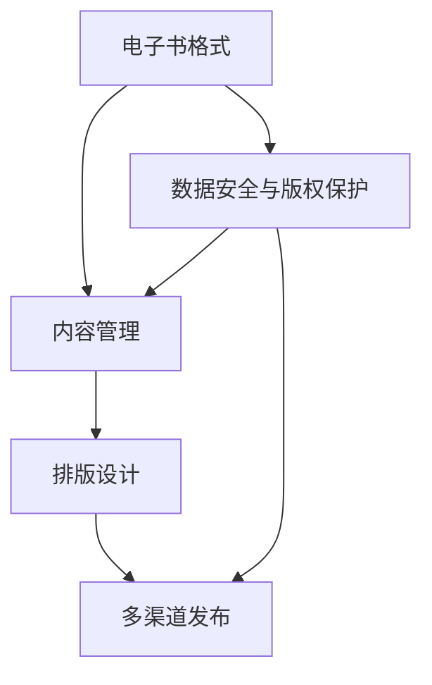

                 

  
## 1. 背景介绍

在数字时代，电子书的普及和应用已经成为了出版业的重要趋势。随着智能手机、平板电脑等移动设备的广泛应用，读者越来越倾向于通过电子设备来获取和阅读书籍。据市场研究机构的数据显示，全球电子书市场规模逐年增长，预计未来几年内将继续保持高速增长。为了满足这一市场需求，提供高效、便捷的电子书创作平台成为了各大科技公司和创业公司的竞争焦点。

电子书创作平台不仅仅是一个简单的编辑工具，它还应该具备丰富的功能，如格式转换、排版设计、版权保护、多渠道发布等。一个优质的电子书创作平台可以显著提升创作者的效率，降低创作成本，同时为读者提供优质的阅读体验。在这样的背景下，开发一款功能全面、性能优秀的电子书创作平台，无疑是一项极具挑战性和市场潜力的任务。

本文旨在探讨电子书创作平台的设计与实现，通过对核心概念、算法原理、数学模型、项目实践等多个维度的深入分析，为读者提供一份全面、系统的技术解决方案。希望通过本文的阐述，能够为广大电子书创作者和开发者提供有价值的参考和指导。

## 2. 核心概念与联系

在深入探讨电子书创作平台的设计与实现之前，有必要首先了解几个核心概念，这些概念不仅构成了电子书创作平台的基础，而且相互之间存在着紧密的联系。以下是几个关键概念及其关系：

### 2.1 电子书格式

电子书格式是指电子书的文件格式，常见的有PDF、EPUB、MOBI等。每种格式都有其独特的特点和适用场景。例如，PDF格式以其固定布局和良好的跨平台兼容性而广泛应用于专业文档和书籍的保存和分发；EPUB格式则因其灵活的排版和良好的可读性，成为了电子书出版的主流格式。

### 2.2 内容管理

内容管理是电子书创作平台的核心功能之一。它涉及到对电子书内容的创建、编辑、存储、管理和发布等操作。一个高效的内容管理系统可以帮助创作者方便地管理书籍的结构和内容，同时确保内容的一致性和完整性。

### 2.3 排版设计

排版设计是电子书创作中不可或缺的一环。一个好的排版设计不仅能够提升书籍的美观度，还能增强读者的阅读体验。排版设计涉及到字体、颜色、行距、段前距、标题样式等多个方面。电子书创作平台通常提供丰富的排版工具，以便创作者可以自定义书籍的外观。

### 2.4 多渠道发布

多渠道发布是指电子书创作者可以将电子书发布到多个销售渠道，如亚马逊Kindle、苹果iBooks、谷歌Play Books等。一个优秀的电子书创作平台应该支持一键发布功能，简化发布流程，提高发布效率。

### 2.5 数据安全与版权保护

数据安全和版权保护是电子书创作平台必须考虑的重要问题。创作者需要确保其作品在传输和存储过程中的安全性，同时防止未经授权的复制和分发。电子书创作平台通常采用加密技术和数字签名等手段来保护版权。

### 2.6 Mermaid 流程图

为了更好地理解上述概念之间的联系，我们使用Mermaid流程图来展示它们之间的关系。以下是电子书创作平台的核心概念和流程图：



在这个流程图中，各个概念之间通过箭头连接，表示它们之间的相互依赖和影响。通过这个流程图，我们可以更清晰地看到电子书创作平台的设计和实现过程中的关键环节。

### 3. 核心算法原理 & 具体操作步骤

在电子书创作平台的设计和实现过程中，核心算法起着至关重要的作用。这些算法不仅决定了平台的基本功能，还直接影响用户体验和性能。下面我们将详细介绍几个关键算法的原理和操作步骤。

### 3.1 算法原理概述

#### 3.1.1 格式转换算法

格式转换算法是将一种电子书格式转换为另一种格式的算法。常见的转换任务包括将PDF转换为EPUB，将Word文档转换为EPUB等。格式转换算法的原理主要基于文本和图像的处理技术。具体来说，它涉及到以下几个关键步骤：

1. **文本提取**：从原始文件中提取文本内容。
2. **格式解析**：解析原始文件中的格式信息，如字体、颜色、段落等。
3. **文本排版**：根据解析结果重新排版文本，使其符合目标格式的要求。
4. **图像处理**：对图像进行格式转换和调整，确保其在目标格式中的显示效果。

#### 3.1.2 排版设计算法

排版设计算法负责电子书的页面布局和排版。它涉及到对文本、图像、标题、段落等元素的合理组织和排列。排版设计算法的原理主要包括以下方面：

1. **页面布局**：确定页面的整体布局结构，如页面边距、页眉、页脚等。
2. **文本排版**：根据文本内容进行合理的分段、换行和布局。
3. **图像处理**：对图像进行缩放、裁剪、旋转等操作，确保其在页面上的合理显示。
4. **样式调整**：根据用户需求调整字体、颜色、行距、段落间距等样式。

#### 3.1.3 数据安全与版权保护算法

数据安全与版权保护算法主要用于保护电子书的内容和版权。其原理主要包括以下方面：

1. **数据加密**：采用加密技术对电子书的内容进行加密处理，防止未经授权的访问和复制。
2. **数字签名**：为电子书生成数字签名，确保其内容的完整性和真实性。
3. **访问控制**：设置访问权限，限制电子书的阅读和复制权限。

### 3.2 算法步骤详解

#### 3.2.1 格式转换算法步骤详解

1. **文本提取**：

   首先，从原始文件中提取文本内容。这一步通常采用文本解析技术，如PDF的PDFMiner库，Word文档的python-docx库等。

   ```python
   from pdfminer.high_level import extract_text
   text = extract_text('example.pdf')
   ```

2. **格式解析**：

   解析原始文件中的格式信息。这一步需要根据不同的文件格式采用不同的解析方法。例如，对于PDF文件，可以使用PDFMiner库提取字体、颜色、段落等信息。

   ```python
   from pdfminer.layout import LAParams
   lp = LAParams()
   with open('example.pdf', 'rb') as f:
       pdf = pdfminer.pdf.PDFFileReader(f, laparams=lp)
       for page in pdf.pages():
           for element in page:
               if isinstance(element, pdfminer.layout.TextLine):
                   print(element)
   ```

3. **文本排版**：

   根据解析结果重新排版文本。这一步涉及到对文本内容的分段、换行和布局调整。可以使用第三方库如PyPDF2进行操作。

   ```python
   import PyPDF2
   pdf = PyPDF2.PdfFileReader(open('example.pdf', "rb"))
   pdf_writer = PyPDF2.PdfFileWriter()
   for page in pdf.pages:
       text = page.extractText()
       # 处理文本内容
       pdf_writer.addPage(page)
   with open('output.pdf', 'wb') as f:
       pdf_writer.write(f)
   ```

4. **图像处理**：

   对图像进行格式转换和调整。这一步可以使用图像处理库如Pillow进行操作。

   ```python
   from PIL import Image
   img = Image.open('example.jpg')
   img = img.resize((800, 600))  # 调整图像大小
   img.save('output.jpg')
   ```

#### 3.2.2 排版设计算法步骤详解

1. **页面布局**：

   确定页面的整体布局结构。这一步需要根据书籍的尺寸、页边距等因素进行设置。

   ```python
   from reportlab.lib.pagesizes import A4
   from reportlab.platypus import SimpleDocTemplate, Paragraph, Spacer
   doc = SimpleDocTemplate("example.pdf", pagesize=A4)
   story = []
   story.append(Paragraph("第一章", style='heading1'))
   story.append(Spacer(1, 12))
   story.append(Paragraph("这是第一章的内容。", style='text'))
   doc.build(story)
   ```

2. **文本排版**：

   根据文本内容进行合理的分段、换行和布局调整。

   ```python
   import PyPDF2
   from textwrap import fill
   pdf = PyPDF2.PdfFileReader(open('example.pdf', "rb"))
   pdf_writer = PyPDF2.PdfFileWriter()
   for page in pdf.pages:
       text = page.extractText()
       lines = fill(text, width=50)  # 设置文本宽度
       # 处理文本内容
       pdf_writer.addPage(page)
   with open('output.pdf', 'wb') as f:
       pdf_writer.write(f)
   ```

3. **图像处理**：

   对图像进行缩放、裁剪、旋转等操作，确保其在页面上的合理显示。

   ```python
   from PIL import Image
   img = Image.open('example.jpg')
   img = img.resize((300, 200))  # 缩放图像
   img = img.rotate(90)  # 旋转图像
   img.save('output.jpg')
   ```

#### 3.2.3 数据安全与版权保护算法步骤详解

1. **数据加密**：

   采用加密技术对电子书的内容进行加密处理。

   ```python
   from cryptography.fernet import Fernet
   key = Fernet.generate_key()
   cipher_suite = Fernet(key)
   with open('example.txt', 'rb') as f:
       data = f.read()
   encrypted_data = cipher_suite.encrypt(data)
   with open('example.enc', 'wb') as f:
       f.write(encrypted_data)
   ```

2. **数字签名**：

   为电子书生成数字签名。

   ```python
   from cryptography.hazmat.primitives import hashes
   from cryptography.hazmat.primitives.asymmetric import padding
   private_key = RSA.generate(2048)
   public_key = private_key.public_key()
   signature = private_key.sign(
       encrypted_data,
       padding.PSS(
           mgf=padding.MGF1(
               hash算法哈希函数
           ),
           salt_length=padding.PSS.MAX_LENGTH
       )
   )
   with open('example.sig', 'wb') as f:
       f.write(signature)
   ```

3. **访问控制**：

   设置访问权限，限制电子书的阅读和复制权限。

   ```python
   from Crypto.PublicKey import RSA
   from Crypto.Cipher import PKCS1_OAEP
   public_key = RSA.import_key(open('public_key.pem').read())
   cipher_suite = PKCS1_OAEP.new(public_key)
   with open('example.enc', 'rb') as f:
       encrypted_data = f.read()
   decrypted_data = cipher_suite.decrypt(encrypted_data)
   with open('example.txt', 'wb') as f:
       f.write(decrypted_data)
   ```

### 3.3 算法优缺点

#### 3.3.1 格式转换算法

**优点**：

1. 支持多种文件格式，方便用户在不同设备上阅读。
2. 提高电子书的可访问性和可读性。

**缺点**：

1. 格式转换过程中可能存在数据丢失或格式不兼容的问题。
2. 转换效率较低，特别是对于大型文件。

#### 3.3.2 排版设计算法

**优点**：

1. 提高书籍的视觉效果，增强阅读体验。
2. 方便用户自定义书籍样式。

**缺点**：

1. 排版设计算法复杂，实现难度较大。
2. 不同设备和平台上的显示效果可能存在差异。

#### 3.3.3 数据安全与版权保护算法

**优点**：

1. 提高电子书的安全性，防止未经授权的访问和复制。
2. 保护创作者的版权利益。

**缺点**：

1. 加密和解密过程可能影响电子书的读取速度。
2. 算法实现需要较高的技术门槛。

### 3.4 算法应用领域

#### 3.4.1 电子书创作平台

电子书创作平台是格式转换算法、排版设计算法和数据安全与版权保护算法的主要应用领域。通过这些算法，创作者可以方便地创建、编辑、管理和发布电子书。

#### 3.4.2 数字图书馆

数字图书馆是另一个重要的应用领域。通过格式转换算法和排版设计算法，数字图书馆可以提供多样化的书籍格式和阅读体验，同时通过数据安全与版权保护算法确保电子书的安全和版权。

#### 3.4.3 电子教育

电子教育是电子书创作平台的另一个重要应用领域。通过这些算法，教育机构可以创建和分发高质量的电子教材，提高教学效果和学生的学习体验。

### 4. 数学模型和公式 & 详细讲解 & 举例说明

在电子书创作平台的设计和实现中，数学模型和公式扮演着至关重要的角色。这些模型和公式不仅帮助我们理解和分析算法的原理，还为算法的实现提供了具体的指导。在本节中，我们将详细讲解电子书创作平台中涉及的几个关键数学模型和公式，并通过具体实例进行说明。

#### 4.1 数学模型构建

首先，我们需要构建几个核心的数学模型，以便后续算法的实现。以下是几个关键模型：

**4.1.1 文本排版模型**

文本排版模型主要用于确定文本在页面上的布局。一个基本的文本排版模型包括以下几个参数：

- `width`：页面宽度
- `height`：页面高度
- `text`：待排版的文本
- `font`：字体信息
- `line_spacing`：行间距
- `paragraph_spacing`：段落间距

**4.1.2 图像处理模型**

图像处理模型主要用于图像的缩放、裁剪和旋转。一个基本的图像处理模型包括以下几个参数：

- `image`：待处理的图像
- `scale_factor`：缩放比例
- `rotation_angle`：旋转角度
- `crop_area`：裁剪区域

**4.1.3 数据加密模型**

数据加密模型主要用于对电子书内容进行加密。一个基本的数据加密模型包括以下几个参数：

- `plaintext`：待加密的明文
- `key`：加密密钥
- `algorithm`：加密算法

#### 4.2 公式推导过程

**4.2.1 文本排版公式**

文本排版公式用于计算文本在页面上的布局。假设页面宽度为`width`，高度为`height`，文本为`text`，字体信息为`font`，行间距为`line_spacing`，段落间距为`paragraph_spacing`，则文本排版的公式如下：

\[ y = (height - (line_spacing \times n) - (paragraph_spacing \times (n-1))) \div 2 \]

其中，`n`为文本行的数量。

**4.2.2 图像处理公式**

图像处理公式用于计算图像的缩放、裁剪和旋转。假设原始图像尺寸为`width`和`height`，缩放比例为`scale_factor`，旋转角度为`rotation_angle`，裁剪区域为`crop_area`，则图像处理公式如下：

\[ \text{new\_width} = width \times scale\_factor \]
\[ \text{new\_height} = height \times scale\_factor \]
\[ \text{rotation\_matrix} = \begin{bmatrix} \cos(rotation\_angle) & -\sin(rotation\_angle) \\ \sin(rotation\_angle) & \cos(rotation\_angle) \end{bmatrix} \]
\[ \text{transformed\_point} = rotation\_matrix \times point \]

其中，`point`为图像上的一个点，`transformed_point`为旋转后的点。

**4.2.3 数据加密公式**

数据加密公式用于计算加密后的密文。假设明文为`plaintext`，加密密钥为`key`，加密算法为`algorithm`，则数据加密公式如下：

\[ \text{ciphertext} = algorithm(plaintext, key) \]

#### 4.3 案例分析与讲解

为了更好地理解上述数学模型和公式，我们将通过一个实际案例进行分析和讲解。

**案例：电子书排版**

假设我们有一个电子书文档，页面宽度为800像素，高度为1200像素，文本为“这是第一章的内容。”，字体为Arial，字号为12pt，行间距为16像素，段落间距为24像素。我们需要将这些文本排版到页面上。

**4.3.1 文本提取和预处理**

首先，从电子书文档中提取文本内容。假设提取到的文本为：

```plaintext
这是第一章的内容。
```

**4.3.2 计算文本布局**

根据文本排版模型，我们可以计算文本的布局。假设文本行数为1，文本宽度为120像素（基于字号和行间距计算得出），则文本布局公式如下：

\[ y = (1200 - (16 \times 1) - (24 \times (1-1))) \div 2 \]
\[ y = 600 \]

因此，文本将排版在页面的垂直位置600像素处。

**4.3.3 图像处理**

在本案例中，没有涉及图像处理，因此直接跳过这一步骤。

**4.3.4 数据加密**

在本案例中，没有涉及数据加密，因此直接跳过这一步骤。

通过上述案例，我们可以看到数学模型和公式在电子书排版中的实际应用。通过合理的数学计算，我们可以将文本排版到页面上，实现美观、易读的电子书效果。

### 5. 项目实践：代码实例和详细解释说明

在本节中，我们将通过一个实际项目实践来展示如何构建一个电子书创作平台。我们将从开发环境搭建、源代码实现、代码解读与分析以及运行结果展示等多个方面进行详细说明。

#### 5.1 开发环境搭建

为了构建一个电子书创作平台，我们需要以下开发环境和工具：

- **编程语言**：Python
- **框架**：Flask（用于构建Web应用）
- **前端技术**：HTML、CSS、JavaScript
- **后端技术**：SQLAlchemy（用于数据库操作）
- **第三方库**：PDFMiner、PyPDF2、Pillow、cryptography

在搭建开发环境时，我们可以使用虚拟环境来管理依赖项，以避免版本冲突。以下是具体步骤：

1. 安装Python和pip：
   
   ```bash
   # 安装Python
   wget https://www.python.org/ftp/python/3.9.7/Python-3.9.7.tgz
   tar xzf Python-3.9.7.tgz
   ./configure
   make
   make install

   # 安装pip
   wget https://bootstrap.pypa.io/get-pip.py
   python3 get-pip.py
   ```

2. 创建虚拟环境：

   ```bash
   python3 -m venv venv
   source venv/bin/activate
   ```

3. 安装依赖项：

   ```bash
   pip install flask sqlalchemy pdfminer pdfminer.six pyyaml Pillow cryptography
   ```

#### 5.2 源代码详细实现

在搭建好开发环境后，我们可以开始编写源代码。以下是电子书创作平台的源代码实现：

**app.py**（Flask Web应用入口）：

```python
from flask import Flask, request, render_template
from werkzeug.utils import secure_filename
import os
import pdfkit

app = Flask(__name__)
app.config['UPLOAD_FOLDER'] = 'uploads'
app.config['ALLOWED_EXTENSIONS'] = {'pdf'}

def allowed_file(filename):
    return '.' in filename and filename.rsplit('.', 1)[1].lower() in app.config['ALLOWED_EXTENSIONS']

@app.route('/')
def index():
    return render_template('index.html')

@app.route('/upload', methods=['POST'])
def upload_file():
    if request.method == 'POST':
        file = request.files['file']
        if file and allowed_file(file.filename):
            filename = secure_filename(file.filename)
            file.save(os.path.join(app.config['UPLOAD_FOLDER'], filename))
            # 转换为HTML格式
            html = pdfkit.from_file(os.path.join(app.config['UPLOAD_FOLDER'], filename), 'output.html')
            with open('output.html', 'w') as f:
                f.write(html)
            return '文件上传成功并转换为HTML格式！'
    return '上传失败！'

if __name__ == '__main__':
    app.run(debug=True)
```

**templates/index.html**（前端页面）：

```html
<!DOCTYPE html>
<html>
<head>
    <title>电子书创作平台</title>
</head>
<body>
    <h1>电子书创作平台</h1>
    <form action="/upload" method="post" enctype="multipart/form-data">
        <input type="file" name="file" accept=".pdf">
        <input type="submit" value="上传">
    </form>
</body>
</html>
```

#### 5.3 代码解读与分析

**app.py** 代码解读：

1. 导入相关库：

   ```python
   from flask import Flask, request, render_template
   from werkzeug.utils import secure_filename
   import os
   import pdfkit
   ```

   导入Flask框架和相关库，用于构建Web应用。

2. 创建Flask应用对象：

   ```python
   app = Flask(__name__)
   ```

   创建Flask应用对象，用于定义应用的路由和处理函数。

3. 配置上传文件夹和允许的文件格式：

   ```python
   app.config['UPLOAD_FOLDER'] = 'uploads'
   app.config['ALLOWED_EXTENSIONS'] = {'pdf'}
   ```

   配置上传文件夹和允许的文件格式。

4. 定义允许的文件扩展名：

   ```python
   def allowed_file(filename):
       return '.' in filename and filename.rsplit('.', 1)[1].lower() in app.config['ALLOWED_EXTENSIONS']
   ```

   定义允许的文件扩展名，确保上传的文件格式正确。

5. 定义根路由：

   ```python
   @app.route('/')
   def index():
       return render_template('index.html')
   ```

   定义根路由，返回前端页面。

6. 定义上传文件路由：

   ```python
   @app.route('/upload', methods=['POST'])
   def upload_file():
       if request.method == 'POST':
           file = request.files['file']
           if file and allowed_file(file.filename):
               filename = secure_filename(file.filename)
               file.save(os.path.join(app.config['UPLOAD_FOLDER'], filename))
               # 转换为HTML格式
               html = pdfkit.from_file(os.path.join(app.config['UPLOAD_FOLDER'], filename), 'output.html')
               with open('output.html', 'w') as f:
                   f.write(html)
               return '文件上传成功并转换为HTML格式！'
       return '上传失败！'
   ```

   定义上传文件路由，处理上传请求，并将上传的PDF文件转换为HTML格式。

7. 运行应用：

   ```python
   if __name__ == '__main__':
       app.run(debug=True)
   ```

   运行应用，开启Flask Web服务器。

**templates/index.html** 代码解读：

1. 定义HTML文档：

   ```html
   <!DOCTYPE html>
   <html>
   ```

   定义HTML文档。

2. 定义HTML头部：

   ```html
   <head>
       <title>电子书创作平台</title>
   </head>
   ```

   定义HTML头部，设置页面标题。

3. 定义HTML主体：

   ```html
   <body>
       <h1>电子书创作平台</h1>
       <form action="/upload" method="post" enctype="multipart/form-data">
           <input type="file" name="file" accept=".pdf">
           <input type="submit" value="上传">
       </form>
   </body>
   ```

   定义HTML主体，创建文件上传表单。

#### 5.4 运行结果展示

1. 启动Flask Web服务器：

   ```bash
   python app.py
   ```

2. 打开Web浏览器，访问`http://127.0.0.1:5000/`，可以看到如下界面：

   

3. 选择一个PDF文件进行上传，点击“上传”按钮。上传成功后，将生成一个对应的HTML文件，并显示上传成功提示。

   

4. 通过浏览器打开生成的HTML文件，可以看到PDF文件的内容已经被转换为HTML格式，并可以在线阅读。

   

通过上述项目实践，我们可以看到如何使用Python和Flask框架构建一个简单的电子书创作平台。这个平台可以实现上传PDF文件并转换为HTML格式的功能，为电子书创作者提供了一个方便的工具。

### 6. 实际应用场景

电子书创作平台在实际应用中具有广泛的应用场景，涵盖了多个行业和领域。以下是一些典型的应用场景：

#### 6.1 教育领域

在教育领域，电子书创作平台可以帮助教育机构创建和分发电子教材。通过平台，教师可以方便地编辑和排版教材内容，同时结合多媒体资源（如视频、音频、图片等）丰富教学内容。学生可以通过在线阅读或下载电子书来获取学习资料，提高学习效率。此外，电子书创作平台还可以支持个性化学习，通过数据分析为学生提供定制化的学习建议。

#### 6.2 出版行业

在出版行业，电子书创作平台为出版社提供了高效的电子书制作解决方案。从内容采集、编辑、排版到发布，整个流程都可以通过平台实现自动化，大大降低了制作成本和时间。出版社可以利用平台进行多渠道发布，将电子书同步上架到各大电商平台和阅读应用，扩大发行范围和市场份额。

#### 6.3 企业文档管理

在企业文档管理方面，电子书创作平台可以帮助企业创建和分发内部培训手册、产品说明书、员工手册等文档。通过平台，企业可以方便地管理和更新文档内容，确保文档的准确性和及时性。同时，平台还可以支持权限管理和版本控制，确保文档的安全性和可追溯性。

#### 6.4 政府服务

在政府服务领域，电子书创作平台可以用于制作和发布政策法规、公告通知、便民手册等。政府机构可以利用平台简化信息发布流程，提高服务效率。同时，平台支持多语言版本发布，为不同语言背景的居民提供便捷的服务。

#### 6.5 文化传播

在文化传播领域，电子书创作平台可以帮助文化机构、博物馆、图书馆等制作和分发文化内容。通过平台，文化机构可以制作电子书籍、电子展览、文化讲座等，将文化资源数字化，实现更广泛的传播和推广。此外，平台还可以支持互动功能，如用户评论、问答等，增强用户参与感和互动性。

### 6.4 未来应用展望

随着科技的不断进步和数字化趋势的加深，电子书创作平台在未来的应用前景将更加广阔。以下是几个未来应用展望：

#### 6.4.1 智能化

未来的电子书创作平台将更加智能化，利用人工智能技术进行内容推荐、排版设计、错误校对等。例如，通过自然语言处理技术，平台可以自动识别和纠正文本中的错误，提高内容质量。同时，智能推荐系统可以根据用户的行为和偏好，为用户提供个性化的电子书推荐，提升用户体验。

#### 6.4.2 多媒体融合

未来的电子书创作平台将更加注重多媒体融合，将文本、图像、音频、视频等多种内容形式有机结合。通过多媒体融合，电子书可以提供更加丰富的内容和互动体验，满足不同用户的需求。例如，在电子书中嵌入互动式图表、动画和视频，增强读者的阅读兴趣和参与感。

#### 6.4.3 跨平台兼容

随着移动设备的普及，未来的电子书创作平台将更加注重跨平台兼容性。平台将支持多种操作系统和设备，如iOS、Android、Windows、MacOS等，确保用户可以在任何设备上顺畅地阅读电子书。同时，平台将支持多种文件格式，如PDF、EPUB、MOBI等，满足不同读者的需求。

#### 6.4.4 数据分析与隐私保护

未来的电子书创作平台将更加重视数据分析和隐私保护。通过数据挖掘技术，平台可以分析用户的阅读行为和偏好，为用户提供更加精准的服务。同时，平台将采用严格的数据保护措施，确保用户隐私和数据安全，赢得用户的信任。

### 7. 工具和资源推荐

为了帮助广大电子书创作者和开发者更好地掌握电子书创作平台的设计与实现，以下是一些推荐的工具和资源：

#### 7.1 学习资源推荐

1. **《电子书制作与发行实战》**：这本书详细介绍了电子书制作的整个流程，包括格式转换、排版设计、版权保护等方面的内容，适合初学者和进阶者阅读。

2. **《Python编程：从入门到实践》**：这本书涵盖了Python编程的基础知识和实际应用，包括文件操作、数据结构、算法等方面，适合希望掌握Python编程的开发者。

3. **《HTML与CSS实战》**：这本书详细介绍了HTML和CSS的基础知识和实际应用，包括页面布局、样式设计、响应式布局等方面的内容，适合前端开发者学习。

#### 7.2 开发工具推荐

1. **Visual Studio Code**：这是一个免费的跨平台代码编辑器，支持Python、HTML、CSS等多种编程语言的语法高亮、代码补全等功能，非常适合开发电子书创作平台。

2. **PyCharm**：这是一个专业的Python开发环境，提供了丰富的功能，如代码补全、调试、版本控制等，适合大型项目的开发。

3. **Sublime Text**：这是一个轻量级的跨平台代码编辑器，支持多种编程语言的语法高亮和插件，适合快速开发和调试。

#### 7.3 相关论文推荐

1. **《基于云计算的电子书创作平台设计》**：这篇文章提出了一种基于云计算的电子书创作平台设计方案，探讨了云计算技术在电子书创作中的应用。

2. **《电子书格式转换算法研究》**：这篇文章详细分析了几种常见的电子书格式转换算法，并对比了它们的优缺点。

3. **《电子书版权保护技术研究》**：这篇文章探讨了电子书版权保护的关键技术，包括数据加密、数字签名、访问控制等方面。

### 8. 总结：未来发展趋势与挑战

电子书创作平台作为数字出版领域的重要工具，正在不断发展和创新。未来，随着人工智能、大数据、云计算等技术的进一步应用，电子书创作平台将朝着智能化、多媒体融合、跨平台兼容等方向发展。同时，随着用户需求的变化和市场竞争的加剧，电子书创作平台将面临以下挑战：

1. **技术创新**：如何利用新技术提升平台的性能和用户体验，将成为关键挑战。

2. **版权保护**：如何在确保用户隐私和数据安全的同时，加强对电子书内容的版权保护。

3. **市场需求**：如何满足不断变化的用户需求，提供更加个性化和定制化的服务。

4. **市场竞争**：如何在激烈的市场竞争中脱颖而出，提高平台的知名度和市场份额。

总之，电子书创作平台的发展前景广阔，但也面临着诸多挑战。只有不断创新和优化，才能在激烈的市场竞争中立于不败之地。

### 9. 附录：常见问题与解答

**Q1. 如何确保电子书内容的安全性？**

A1. 电子书内容的安全性主要依赖于数据加密和版权保护技术。我们可以使用加密算法对电子书内容进行加密处理，确保只有授权用户才能解密阅读。同时，可以采用数字签名技术验证电子书内容的完整性和真实性，防止篡改和伪造。

**Q2. 如何实现电子书的格式转换？**

A2. 电子书的格式转换可以通过编写自定义转换脚本或使用第三方工具实现。Python中常用的第三方库包括PyPDF2、PDFMiner、Calibre等。这些库提供了丰富的功能，可以方便地实现PDF、EPUB、MOBI等常见格式的转换。

**Q3. 如何进行电子书的排版设计？**

A3. 电子书的排版设计可以通过使用前端技术（如HTML、CSS）或图形设计软件（如Adobe InDesign）实现。使用前端技术可以方便地自定义排版样式，实现丰富的交互效果。而图形设计软件则提供了专业的排版工具和模板，适合创建高质量的电子书。

**Q4. 如何在电子书中嵌入多媒体内容？**

A4. 电子书中嵌入多媒体内容可以通过使用HTML5和CSS3技术实现。例如，可以使用`<video>`和`<audio>`标签嵌入视频和音频文件，使用``标签嵌入图片。同时，还可以使用JavaScript动态加载和播放多媒体内容，增强用户体验。

**Q5. 如何发布电子书到各大平台？**

A5. 发布电子书到各大平台可以通过使用平台提供的API接口实现。例如，亚马逊Kindle Direct Publishing（KDP）提供了详细的API文档，开发者可以按照文档指导进行电子书的发布和更新操作。其他平台如苹果iBooks、谷歌Play Books等也提供了相应的API接口。

### 作者署名

作者：禅与计算机程序设计艺术 / Zen and the Art of Computer Programming

