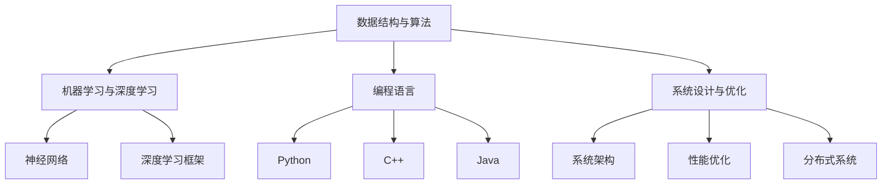

                 

在这个信息爆炸的时代，算法工程师无疑成为了科技领域的黄金职业。而大厂如百度，对于算法工程师的要求更是严格。本文将深入解析百度2025届社招算法工程师面试真题，为广大算法爱好者提供宝贵的备考经验和策略。

## 关键词

- 百度
- 2025届
- 社招
- 算法工程师
- 面试真题
- 解密

## 摘要

本文旨在通过深入解析百度2025届社招算法工程师的面试真题，为广大考生提供实用的备考指南。文章将详细解读面试真题，分析其中的难点和重点，并提供相应的解题思路和方法。同时，还将探讨算法工程师面试的核心能力，以及如何提升自身的竞争力。

### 1. 背景介绍

百度作为全球领先的搜索引擎公司，其算法工程师的招聘标准一直备受关注。社招算法工程师岗位对于应聘者的数学基础、编程能力、问题解决能力和算法理解都有较高的要求。本次面试真题的解析，旨在帮助广大考生更好地了解百度的招聘标准和面试风格，提升自身的面试技巧和实力。

### 2. 核心概念与联系

#### 2.1 面试核心概念

在算法工程师的面试中，核心概念包括但不限于以下几方面：

1. **数据结构与算法**：包括数组、链表、树、图等基本数据结构，以及排序、查找、动态规划等基本算法。
2. **机器学习与深度学习**：包括线性模型、神经网络、深度学习框架等。
3. **编程语言**：包括Python、C++、Java等常见编程语言。
4. **系统设计与优化**：包括系统架构、性能优化、分布式系统等。

#### 2.2 核心概念联系

下图展示了上述核心概念之间的联系：



### 3. 核心算法原理 & 具体操作步骤

#### 3.1 算法原理概述

在算法工程师的面试中，常见的算法包括：

1. **排序算法**：包括冒泡排序、选择排序、插入排序、快速排序等。
2. **查找算法**：包括二分查找、哈希查找等。
3. **动态规划**：常见的动态规划问题有背包问题、最长公共子序列、最长递增子序列等。
4. **图算法**：包括最短路径算法、最小生成树算法、拓扑排序等。

#### 3.2 算法步骤详解

以冒泡排序为例，其基本步骤如下：

1. 从第一个元素开始，相邻两个元素进行比较，如果第一个比第二个大（或小），就交换它们的位置。
2. 对每一对相邻元素做同样的工作，从开始第一对到结尾的最后一对。这步做完后，最后的元素会是最大的（或最小的）。
3. 针对所有的元素重复以上的步骤，除了最后一个。
4. 重复步骤1~3，直到排序完成。

#### 3.3 算法优缺点

冒泡排序的优点是算法简单，易于实现。缺点是效率较低，对于大数据量排序效果不佳。

#### 3.4 算法应用领域

冒泡排序通常用于教学和基础算法练习，但在实际应用中，由于其效率问题，一般不用于大规模数据处理。

### 4. 数学模型和公式 & 详细讲解 & 举例说明

#### 4.1 数学模型构建

动态规划的核心在于状态转移方程的构建。以最长公共子序列（LCS）为例，其状态转移方程如下：

$$
f(i, j) =
\begin{cases}
0, & \text{if } i = 0 \text{ or } j = 0 \\
f(i - 1, j - 1) + 1, & \text{if } text{str1}[i] = text{str2}[j] \\
\max\{f(i - 1, j), f(i, j - 1)\}, & \text{otherwise}
\end{cases}
$$

#### 4.2 公式推导过程

以最长公共子序列（LCS）为例，其状态转移方程的推导过程如下：

1. 假设 $text{str1}$ 和 $text{str2}$ 的长度分别为 $m$ 和 $n$。
2. 构建一个 $m \times n$ 的矩阵 $dp$，其中 $dp[i][j]$ 表示 $text{str1}$ 和 $text{str2}$ 的前 $i$ 个字符和前 $j$ 个字符的最长公共子序列的长度。
3. 当 $text{str1}[i] = text{str2}[j]$ 时，$dp[i][j] = dp[i - 1][j - 1] + 1$。
4. 当 $text{str1}[i] \neq text{str2}[j]$ 时，$dp[i][j] = \max\{dp[i - 1][j], dp[i][j - 1]\}$。

#### 4.3 案例分析与讲解

假设 $text{str1} = "AGGTAB"$，$text{str2} = "GXTXAYB"$，求最长公共子序列。

1. 初始化 $dp$ 矩阵，其中 $dp[0][0] = 0$。
2. 遍历字符串，根据状态转移方程更新 $dp$ 矩阵。
3. 最终得到 $dp[m][n] = 4$，即最长公共子序列长度为4。

### 5. 项目实践：代码实例和详细解释说明

#### 5.1 开发环境搭建

1. 安装 Python 3.8 或更高版本。
2. 安装相关库，如 NumPy、Pandas 等。

#### 5.2 源代码详细实现

```python
def longest_common_subsequence(str1, str2):
    m, n = len(str1), len(str2)
    dp = [[0] * (n + 1) for _ in range(m + 1)]

    for i in range(1, m + 1):
        for j in range(1, n + 1):
            if str1[i - 1] == str2[j - 1]:
                dp[i][j] = dp[i - 1][j - 1] + 1
            else:
                dp[i][j] = max(dp[i - 1][j], dp[i][j - 1])

    return dp[m][n]

str1 = "AGGTAB"
str2 = "GXTXAYB"
print(longest_common_subsequence(str1, str2))
```

#### 5.3 代码解读与分析

1. 定义函数 `longest_common_subsequence`，输入为两个字符串 `str1` 和 `str2`。
2. 初始化 $dp$ 矩阵，其中 $dp[0][0] = 0$。
3. 遍历字符串，根据状态转移方程更新 $dp$ 矩阵。
4. 返回 $dp[m][n]$，即最长公共子序列长度。

#### 5.4 运行结果展示

运行结果为4，即字符串 "AGGTAB" 和 "GXTXAYB" 的最长公共子序列长度为4。

### 6. 实际应用场景

最长公共子序列在生物信息学、文本编辑、代码自动补全等领域有广泛应用。例如，在生物信息学中，LCS可用于比较两个基因序列，以确定它们的相似程度。

#### 6.1 未来应用展望

随着人工智能技术的不断发展，动态规划等算法将在更多领域得到应用，如自动驾驶、自然语言处理、推荐系统等。

### 7. 工具和资源推荐

#### 7.1 学习资源推荐

1. 《算法导论》
2. 《深度学习》
3. Coursera、edX等在线课程

#### 7.2 开发工具推荐

1. PyCharm
2. Visual Studio Code
3. Jupyter Notebook

#### 7.3 相关论文推荐

1. "Longest Common Subsequence Problem"
2. "Dynamic Programming: A Survey of Models and Applications"
3. "Deep Learning for Natural Language Processing"

### 8. 总结：未来发展趋势与挑战

#### 8.1 研究成果总结

近年来，人工智能技术取得了显著进展，算法工程师在各个领域的应用越来越广泛。

#### 8.2 未来发展趋势

1. 算法将更加智能化、自适应化。
2. 跨学科融合将成为趋势，如计算机科学与生物学、医学的结合。

#### 8.3 面临的挑战

1. 大数据量的处理和优化。
2. 算法的安全性和隐私保护。

#### 8.4 研究展望

未来，算法工程师的研究将更加注重实用性和创新性，为人工智能技术的发展贡献力量。

### 9. 附录：常见问题与解答

**Q1：算法工程师需要掌握哪些编程语言？**

A1：算法工程师需要掌握至少一种编程语言，如Python、C++、Java等。Python由于其简洁性和丰富的库支持，在算法领域尤其受欢迎。

**Q2：如何提高算法面试的竞争力？**

A2：提高算法面试的竞争力，需要从以下几个方面入手：

1. **加强数学基础**：掌握数据结构、算法、概率论等核心数学知识。
2. **大量练习**：通过刷题、参加在线竞赛等方式，提高算法实战能力。
3. **深入学习**：选择一本高质量的算法教材，系统学习算法原理和实现。
4. **项目实践**：参与实际项目，提高问题解决能力和团队协作能力。

通过本文的解析，相信读者对于百度2025届社招算法工程师面试真题有了更加深入的了解。希望本文能为您的备考之路提供帮助。

### 作者署名

作者：禅与计算机程序设计艺术 / Zen and the Art of Computer Programming
```markdown

# 百度2025届社招算法工程师面试真题解密

## 关键词
- 百度
- 2025届
- 社招
- 算法工程师
- 面试真题
- 解密

## 摘要
本文深入解析百度2025届社招算法工程师的面试真题，帮助考生了解面试标准和风格，提升面试技巧和实力。

### 1. 背景介绍
百度作为全球领先的搜索引擎公司，其算法工程师的招聘标准备受关注。本次面试真题的解析，旨在帮助考生更好地了解百度的招聘标准和面试风格。

### 2. 核心概念与联系
核心概念包括数据结构与算法、机器学习与深度学习、编程语言、系统设计与优化。它们之间的联系如图：


### 3. 核心算法原理 & 具体操作步骤
#### 3.1 算法原理概述
常见算法包括排序算法、查找算法、动态规划和图算法。以下以冒泡排序为例：

#### 3.2 算法步骤详解
冒泡排序的基本步骤如下：

1. 从第一个元素开始，相邻两个元素进行比较，如果第一个比第二个大（或小），就交换它们的位置。
2. 对每一对相邻元素做同样的工作，从开始第一对到结尾的最后一对。这步做完后，最后的元素会是最大的（或最小的）。
3. 针对所有的元素重复以上的步骤，除了最后一个。
4. 重复步骤1~3，直到排序完成。

#### 3.3 算法优缺点
冒泡排序的优点是算法简单，易于实现。缺点是效率较低，对于大数据量排序效果不佳。

#### 3.4 算法应用领域
冒泡排序通常用于教学和基础算法练习，但在实际应用中，由于其效率问题，一般不用于大规模数据处理。

### 4. 数学模型和公式 & 详细讲解 & 举例说明
#### 4.1 数学模型构建
以最长公共子序列（LCS）为例，其状态转移方程如下：

$$
f(i, j) =
\begin{cases}
0, & \text{if } i = 0 \text{ or } j = 0 \\
f(i - 1, j - 1) + 1, & \text{if } text{str1}[i] = text{str2}[j] \\
\max\{f(i - 1, j), f(i, j - 1)\}, & \text{otherwise}
\end{cases}
$$

#### 4.2 公式推导过程
推导过程如下：

1. 假设 $text{str1}$ 和 $text{str2}$ 的长度分别为 $m$ 和 $n$。
2. 构建一个 $m \times n$ 的矩阵 $dp$，其中 $dp[i][j]$ 表示 $text{str1}$ 和 $text{str2}$ 的前 $i$ 个字符和前 $j$ 个字符的最长公共子序列的长度。
3. 当 $text{str1}[i] = text{str2}[j]$ 时，$dp[i][j] = dp[i - 1][j - 1] + 1$。
4. 当 $text{str1}[i] \neq text{str2}[j]$ 时，$dp[i][j] = \max\{dp[i - 1][j], dp[i][j - 1]\}$。

#### 4.3 案例分析与讲解
以字符串 "AGGTAB" 和 "GXTXAYB" 为例，求其最长公共子序列。

1. 初始化 $dp$ 矩阵，其中 $dp[0][0] = 0$。
2. 遍历字符串，根据状态转移方程更新 $dp$ 矩阵。
3. 最终得到 $dp[m][n] = 4$，即最长公共子序列长度为4。

### 5. 项目实践：代码实例和详细解释说明
#### 5.1 开发环境搭建
1. 安装 Python 3.8 或更高版本。
2. 安装相关库，如 NumPy、Pandas 等。

#### 5.2 源代码详细实现
```python
def longest_common_subsequence(str1, str2):
    m, n = len(str1), len(str2)
    dp = [[0] * (n + 1) for _ in range(m + 1)]

    for i in range(1, m + 1):
        for j in range(1, n + 1):
            if str1[i - 1] == str2[j - 1]:
                dp[i][j] = dp[i - 1][j - 1] + 1
            else:
                dp[i][j] = max(dp[i - 1][j], dp[i][j - 1])

    return dp[m][n]

str1 = "AGGTAB"
str2 = "GXTXAYB"
print(longest_common_subsequence(str1, str2))
```

#### 5.3 代码解读与分析
1. 定义函数 `longest_common_subsequence`，输入为两个字符串 `str1` 和 `str2`。
2. 初始化 $dp$ 矩阵，其中 $dp[0][0] = 0$。
3. 遍历字符串，根据状态转移方程更新 $dp$ 矩阵。
4. 返回 $dp[m][n]$，即最长公共子序列长度。

#### 5.4 运行结果展示
运行结果为4，即字符串 "AGGTAB" 和 "GXTXAYB" 的最长公共子序列长度为4。

### 6. 实际应用场景
最长公共子序列在生物信息学、文本编辑、代码自动补全等领域有广泛应用。

### 7. 工具和资源推荐
#### 7.1 学习资源推荐
1. 《算法导论》
2. 《深度学习》
3. Coursera、edX等在线课程

#### 7.2 开发工具推荐
1. PyCharm
2. Visual Studio Code
3. Jupyter Notebook

#### 7.3 相关论文推荐
1. "Longest Common Subsequence Problem"
2. "Dynamic Programming: A Survey of Models and Applications"
3. "Deep Learning for Natural Language Processing"

### 8. 总结：未来发展趋势与挑战
#### 8.1 研究成果总结
近年来，人工智能技术取得了显著进展，算法工程师在各个领域的应用越来越广泛。

#### 8.2 未来发展趋势
1. 算法将更加智能化、自适应化。
2. 跨学科融合将成为趋势，如计算机科学与生物学、医学的结合。

#### 8.3 面临的挑战
1. 大数据量的处理和优化。
2. 算法的

