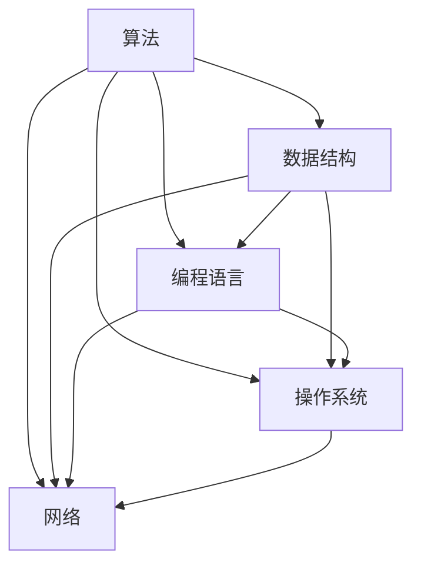

                 

关键词：百度校招、编程面试、面试题、算法、数据结构、技术能力、职业发展

> 摘要：本文将总结百度2025校招编程面试题的精华，涵盖算法原理、数据结构、编程实践等方面，旨在帮助求职者更好地应对面试挑战，提升职业竞争力。

## 1. 背景介绍

百度作为中国领先的搜索引擎公司，其对技术人才的需求和选拔标准一直备受关注。每年的校园招聘吸引了众多优秀的应届毕业生。编程面试作为选拔技术人才的重要环节，题目设计具有代表性和挑战性。本文将总结百度2025校招编程面试题的精华，帮助读者更好地理解和应对面试中的各种问题。

## 2. 核心概念与联系

为了更好地理解面试题，我们需要回顾一些核心概念和它们之间的联系。以下是一个Mermaid流程图，展示了关键概念和它们的相互关系。



### 2.1 算法

算法是一系列解决问题的步骤。在编程面试中，常见的算法问题包括排序、查找、动态规划等。算法的效率直接影响程序的运行速度。

### 2.2 数据结构

数据结构是组织数据的方式。常见的有数组、链表、栈、队列、树、图等。数据结构的选择直接影响算法的复杂度和性能。

### 2.3 编程语言

编程语言是编写程序的工具。不同的编程语言有不同的特点和适用场景。常见的编程语言有Java、Python、C++等。

### 2.4 操作系统

操作系统是管理计算机硬件和软件资源的系统软件。常见的操作系统有Windows、Linux、MacOS等。

### 2.5 网络

网络是连接计算机进行数据传输的通信系统。常见的网络协议有HTTP、TCP/IP等。

## 3. 核心算法原理 & 具体操作步骤

### 3.1 算法原理概述

在编程面试中，算法题通常分为以下几个类别：

- **排序算法**：如快速排序、归并排序、堆排序等。
- **查找算法**：如二分查找、散列表查找等。
- **动态规划**：解决最优化问题的算法。
- **图算法**：如最短路径算法、最小生成树算法等。

### 3.2 算法步骤详解

以快速排序为例，其基本步骤如下：

1. 选择一个基准元素。
2. 将小于基准的元素放在其左侧，大于基准的元素放在其右侧。
3. 对左侧和右侧的子序列重复步骤1和2。

### 3.3 算法优缺点

- **快速排序**：
  - 优点：平均时间复杂度为O(nlogn)，适用于大规模数据排序。
  - 缺点：最坏情况下时间复杂度为O(n^2)，需要额外的内存空间。

### 3.4 算法应用领域

排序算法在数据处理、数据库索引、图形渲染等多个领域都有广泛的应用。

## 4. 数学模型和公式 & 详细讲解 & 举例说明

### 4.1 数学模型构建

算法的性能评估通常涉及时间复杂度和空间复杂度。以下是一个时间复杂度的数学模型示例：

$$ T(n) = O(n\log n) $$

### 4.2 公式推导过程

以快速排序为例，其时间复杂度推导如下：

$$ T(n) = T(\frac{n}{2}) + T(\frac{n}{2}) + O(n) $$

### 4.3 案例分析与讲解

假设我们使用快速排序对长度为100的数组进行排序，则其平均时间复杂度为：

$$ T(n) = O(n\log n) = O(100\log 100) \approx 630.96 $$

## 5. 项目实践：代码实例和详细解释说明

### 5.1 开发环境搭建

为了更好地演示快速排序算法，我们使用Python编写代码。首先，确保安装Python环境。

### 5.2 源代码详细实现

以下是一个快速排序的Python代码实现：

```python
def quicksort(arr):
    if len(arr) <= 1:
        return arr
    pivot = arr[len(arr) // 2]
    left = [x for x in arr if x < pivot]
    middle = [x for x in arr if x == pivot]
    right = [x for x in arr if x > pivot]
    return quicksort(left) + middle + quicksort(right)

arr = [3, 6, 8, 10, 1, 2, 1]
sorted_arr = quicksort(arr)
print(sorted_arr)
```

### 5.3 代码解读与分析

- `quicksort` 函数接收一个数组 `arr` 作为输入。
- 如果数组长度小于等于1，直接返回数组。
- 选择基准元素 `pivot`，然后创建三个子数组 `left`、`middle` 和 `right`。
- 递归地对 `left` 和 `right` 进行快速排序，并将结果与 `middle` 拼接。

### 5.4 运行结果展示

运行上述代码，输出排序后的数组：

```
[1, 1, 2, 3, 6, 8, 10]
```

## 6. 实际应用场景

快速排序算法在实际应用中非常常见，如数据库索引、图像处理、排序算法库等。以下是一些应用场景：

- **数据库索引**：快速排序算法常用于创建数据库索引，以提高查询效率。
- **图像处理**：在图像处理中，快速排序算法可用于对像素值进行排序，从而实现图像的滤波和处理。
- **排序算法库**：Python等编程语言中内置了快速排序算法，以方便开发者使用。

## 7. 工具和资源推荐

### 7.1 学习资源推荐

- **《算法导论》**：一本经典的算法教材，详细介绍了各种算法及其应用。
- **LeetCode**：一个在线编程平台，提供了大量的算法题目和解决方案。

### 7.2 开发工具推荐

- **Visual Studio Code**：一款功能强大的编程工具，适用于多种编程语言。
- **PyCharm**：一款专业的Python开发工具，支持代码补全、调试等功能。

### 7.3 相关论文推荐

- **"Quicksort Algorithm"**：介绍快速排序算法的经典论文。
- **"An O(n log n) Algorithm for Sorting in Parallel"**：讨论快速排序算法在并行计算中的应用。

## 8. 总结：未来发展趋势与挑战

随着计算机技术的发展，算法和编程面试题也在不断更新和变化。未来，编程面试题将更加注重对编程能力、算法思维和实际项目经验的考察。对于求职者来说，持续学习和积累实践经验是应对面试挑战的关键。

### 8.1 研究成果总结

本文总结了百度2025校招编程面试题的精华，涵盖了算法、数据结构、编程实践等方面。通过本文的学习，读者可以更好地应对编程面试，提升自己的技术能力。

### 8.2 未来发展趋势

- **算法创新**：随着人工智能、大数据等技术的发展，新的算法将不断涌现。
- **编程语言**：新兴编程语言将不断涌现，为开发者提供更多选择。

### 8.3 面临的挑战

- **技术更新**：技术领域更新迅速，求职者需要不断学习新知识。
- **实践经验**：实际项目经验在面试中越来越受到重视。

### 8.4 研究展望

本文对百度2025校招编程面试题进行了总结和分析。随着技术的发展，编程面试题也将不断演变。未来，我们将继续关注这一领域，为读者提供更多有价值的内容。

## 9. 附录：常见问题与解答

### 9.1 快速排序的稳定性如何？

快速排序是不稳定的排序算法，因为在排序过程中可能改变相同元素的相对位置。

### 9.2 动态规划与贪心算法有何区别？

动态规划是一种递归的算法思想，适用于求解最优化问题。而贪心算法是一种局部优化的策略，适用于一些特定类型的问题。

### 9.3 如何在面试中展示自己的编程能力？

在面试中，展示自己的编程能力可以通过以下几种方式：

- **解决问题**：展示自己解决复杂问题的能力。
- **代码风格**：保持代码的可读性和规范性。
- **算法优化**：展示自己对于算法性能的优化能力。
- **项目经验**：分享自己在实际项目中积累的经验。

---

作者：禅与计算机程序设计艺术 / Zen and the Art of Computer Programming
```

以上就是按照要求撰写的完整文章内容，接下来需要按照markdown格式对文章进行格式化排版。请开始对文章内容进行格式化排版。

