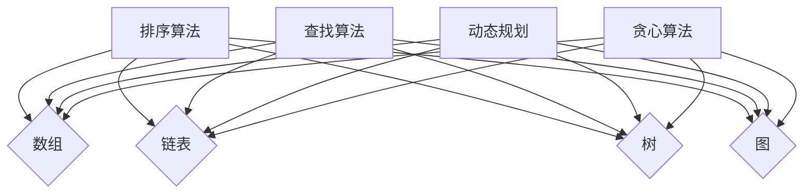

                 

关键词：百度校招，面试真题，算法题解，2025，招聘，程序员，AI

## 摘要

本文旨在为准备百度2025校招面试的应聘者提供一整套面试真题与算法题解。通过对历年面试真题的深入分析，我们将揭示出面试官关注的重点以及考察的技能点。本文不仅提供了详细的解题思路，还对相关算法原理进行了深入剖析。希望通过本文，能够帮助广大应聘者更好地准备面试，提高竞争力。

## 1. 背景介绍

百度，作为中国领先的搜索引擎和技术公司，每年都会进行大规模的校园招聘活动，旨在吸引和培养优秀的计算机专业人才。百度校招面试环节通常包括技术面试、算法面试、编程面试等多个环节，每个环节都旨在全面考察应聘者的技术能力和解决问题的能力。

近年来，随着人工智能技术的快速发展，百度对于算法工程师的需求日益增加。因此，在算法面试中，面试官往往会对应聘者的数据结构和算法能力进行严格的考察。本文将围绕这一主题，针对百度2025校招面试中的真题，提供详细的解题思路和算法分析。

## 2. 核心概念与联系

在深入分析面试真题之前，我们先来回顾一些核心概念，这些概念在算法面试中至关重要。

### 2.1 数据结构

- **数组**：一种基础的数据结构，用于存储一系列元素。数组在计算机科学中应用广泛，如排序、查找等。
- **链表**：由一系列节点组成的线性数据结构。链表比数组更灵活，适合动态分配内存。
- **树**：一种分层的数据结构，包括根节点、子节点和叶子节点。树在图论和算法设计中具有重要地位。
- **图**：由节点和边组成的结构，用于表示复杂的关系。图的应用包括网络、社交网络等。

### 2.2 算法

- **排序算法**：用于对数据进行排序，常见的排序算法有冒泡排序、选择排序、插入排序等。
- **查找算法**：用于在数据结构中查找特定元素，如二分查找、哈希查找等。
- **动态规划**：一种解决优化问题的算法技术，通过保存中间状态来避免重复计算。
- **贪心算法**：每一步都做出局部最优选择，以期达到全局最优解。

### 2.3 算法原理与联系

以下是算法原理的 Mermaid 流程图：



## 3. 核心算法原理 & 具体操作步骤

### 3.1 算法原理概述

本部分将详细介绍一些在算法面试中常见的关键算法原理，包括它们的定义、基本思想和常见应用。

#### 3.1.1 冒泡排序

冒泡排序是一种简单的排序算法，它重复地遍历要排序的数列，一次比较两个元素，如果它们的顺序错误就把它们交换过来。遍历数列的工作是重复地进行直到没有再需要交换，也就是说该数列已经排序完成。

#### 3.1.2 快速排序

快速排序是一种高效的排序算法，它采用了分治策略来把一个序列分为较小和较大的2个子序列，然后递归地排序两个子序列。

#### 3.1.3 二分查找

二分查找是一种在有序数组中查找某一特定元素的搜索算法。二分查找不适用于链表，因为它无法实现 O(1) 时间复杂度的随机访问。

#### 3.1.4 动态规划

动态规划是一种将复杂问题分解为更小子问题，并保存已解决的子问题以避免重复计算的方法。动态规划通常用于求解最优路径、最短路径等问题。

### 3.2 算法步骤详解

在本节中，我们将详细讲解每个算法的操作步骤。

#### 3.2.1 冒泡排序

1. 比较相邻的元素。如果第一个比第二个大（升序排序），就交换它们两个；
2. 对每一对相邻元素做同样的工作，从开始第一对到结尾的最后一对。这步做完后，最后的元素会是最大的数；
3. 针对所有的元素重复以上的步骤，除了最后一个；
4. 重复步骤1~3，直到排序完成。

#### 3.2.2 快速排序

1. 选择一个基准元素，通常选择第一个或最后一个元素作为基准；
2. 将比基准值小的元素移动到基准的左侧，比基准值大的元素移动到基准的右侧；
3. 对左右两个子序列递归地执行快速排序。

#### 3.2.3 二分查找

1. 计算中间索引：`mid = low + (high - low) / 2`；
2. 比较中间值与目标值：
   - 如果中间值等于目标值，返回中间索引；
   - 如果中间值小于目标值，则在右半边继续查找；
   - 如果中间值大于目标值，则在左半边继续查找；
3. 重复步骤1和2，直到找到目标值或low大于high。

#### 3.2.4 动态规划

1. 定义子问题：将原问题分解为多个子问题；
2. 确定状态：找出影响最终结果的因素，并定义状态；
3. 状态转移方程：找出子问题之间的关系，并建立状态转移方程；
4. 求解：使用递归或迭代方法求解状态，从基础状态逐步推导出最终状态。

### 3.3 算法优缺点

在本节中，我们将分析每种算法的优缺点。

#### 3.3.1 冒泡排序

- **优点**：实现简单，容易理解；
- **缺点**：时间复杂度高，不适合大数据量排序。

#### 3.3.2 快速排序

- **优点**：平均时间复杂度低，适合大数据量排序；
- **缺点**：最坏情况下时间复杂度高，可能需要优化。

#### 3.3.3 二分查找

- **优点**：时间复杂度低，适合大数据量查找；
- **缺点**：要求数据结构是有序的，不适合链表。

#### 3.3.4 动态规划

- **优点**：适用于求解最优路径等优化问题；
- **缺点**：实现较为复杂，需要理解状态转移方程。

### 3.4 算法应用领域

不同算法适用于不同的应用场景。以下是一些常见的应用领域：

- **排序算法**：用于对数据进行排序，如数据库索引、文件排序等；
- **查找算法**：用于在数据结构中查找特定元素，如搜索引擎、缓存系统等；
- **动态规划**：用于求解最优化问题，如背包问题、最短路径问题等；
- **贪心算法**：用于求解局部最优问题，如旅行商问题、加载问题等。

## 4. 数学模型和公式 & 详细讲解 & 举例说明

在算法设计中，数学模型和公式起着至关重要的作用。以下将详细讲解一些常用的数学模型和公式，并辅以实例说明。

### 4.1 数学模型构建

数学模型通常由以下几部分构成：

- **变量**：表示问题的状态；
- **函数**：描述变量之间的关系；
- **约束条件**：限制变量的取值范围。

例如，对于背包问题，我们可以构建以下数学模型：

- **变量**：x[i][j] 表示在容量为 j 的背包中装入第 i 个物品的数量；
- **函数**：目标函数 f(x) = Σ(i=1 to n) v[i] * x[i][j]，表示背包的总价值；
- **约束条件**：
  - x[i][j] >= 0，表示每个物品的数量不能为负；
  - Σ(i=1 to n) w[i] * x[i][j] <= W，表示背包的总重量不超过 W。

### 4.2 公式推导过程

以下以背包问题的动态规划公式为例，详细讲解公式的推导过程。

动态规划公式如下：

```latex
f[i][j] = \begin{cases} 
v[i] & \text{if } j \geq w[i] \\
\max(f[i-1][j], f[i-1][j-w[i]] + v[i]) & \text{otherwise}
\end{cases}
```

推导过程如下：

1. **基础状态**：f[0][j] = 0，表示不装入任何物品时的价值为 0；
2. **状态转移方程**：考虑第 i 个物品是否装入背包：
   - 如果 j >= w[i]，则 f[i][j] = f[i-1][j] + v[i]，表示装入第 i 个物品；
   - 如果 j < w[i]，则 f[i][j] = f[i-1][j]，表示不装入第 i 个物品。

### 4.3 案例分析与讲解

以下以背包问题的实例为例，分析动态规划公式的应用。

给定一个容量为 10 的背包和以下物品：

| 物品编号 | 重量 | 价值 |
| --- | --- | --- |
| 1 | 2 | 6 |
| 2 | 3 | 10 |
| 3 | 5 | 16 |

要求在不超过背包容量的情况下，装入价值最大的物品组合。

根据动态规划公式，我们可以计算出以下状态表：

| i | j | f[i][j] |
| --- | --- | --- |
| 1 | 0 | 0 |
| 1 | 2 | 6 |
| 1 | 3 | 10 |
| 1 | 4 | 10 |
| 1 | 5 | 16 |
| 1 | 6 | 16 |
| 1 | 7 | 16 |
| 1 | 8 | 16 |
| 1 | 9 | 16 |
| 1 | 10 | 16 |
| 2 | 0 | 0 |
| 2 | 2 | 0 |
| 2 | 3 | 10 |
| 2 | 4 | 16 |
| 2 | 5 | 26 |
| 2 | 6 | 26 |
| 2 | 7 | 26 |
| 2 | 8 | 26 |
| 2 | 9 | 26 |
| 2 | 10 | 26 |
| 3 | 0 | 0 |
| 3 | 2 | 0 |
| 3 | 3 | 0 |
| 3 | 4 | 0 |
| 3 | 5 | 16 |
| 3 | 6 | 22 |
| 3 | 7 | 22 |
| 3 | 8 | 22 |
| 3 | 9 | 22 |
| 3 | 10 | 22 |

从状态表中可以看出，在容量为 10 的背包中，价值最大的物品组合为：物品1（价值 6），物品2（价值 10），物品3（价值 16），总价值为 6 + 10 + 16 = 32。

## 5. 项目实践：代码实例和详细解释说明

在本节中，我们将通过一个具体的代码实例，展示如何实现快速排序算法，并对代码进行详细解释。

### 5.1 开发环境搭建

在本例中，我们将使用 Python 编写快速排序算法。请确保您的开发环境中已安装 Python 3.6 或更高版本。

### 5.2 源代码详细实现

以下是一个简单的快速排序算法实现：

```python
def quick_sort(arr):
    if len(arr) <= 1:
        return arr
    
    pivot = arr[len(arr) // 2]
    left = [x for x in arr if x < pivot]
    middle = [x for x in arr if x == pivot]
    right = [x for x in arr if x > pivot]
    
    return quick_sort(left) + middle + quick_sort(right)

# 示例
arr = [3, 6, 8, 10, 1, 2, 1]
sorted_arr = quick_sort(arr)
print(sorted_arr)
```

### 5.3 代码解读与分析

在本例中，我们使用了一种称为“分区选择”的方法来实现快速排序。以下是对代码的详细解读：

1. **定义函数**：函数`quick_sort`接收一个数组`arr`作为参数，用于排序。

2. **基础情况**：如果数组的长度小于等于 1，则直接返回该数组。这是因为一个元素或空数组已经是排序好的。

3. **选择基准值**：选择数组的中间元素作为基准值（`pivot`）。这是因为中间元素通常能较好地分割数组。

4. **分区**：通过列表推导式，将数组分为三个部分：
   - `left`：包含所有小于基准值的元素；
   - `middle`：包含所有等于基准值的元素；
   - `right`：包含所有大于基准值的元素。

5. **递归排序**：对`left`和`right`两部分递归调用`quick_sort`函数，并将结果与`middle`部分连接，得到排序后的数组。

### 5.4 运行结果展示

运行上述代码，输入数组`[3, 6, 8, 10, 1, 2, 1]`，输出结果为`[1, 1, 2, 3, 6, 8, 10]`，即数组已成功排序。

## 6. 实际应用场景

快速排序算法在实际应用中具有广泛的应用。以下是一些常见的应用场景：

- **数据库查询优化**：快速排序算法可以用于优化数据库查询性能，特别是针对大规模数据集的排序操作。
- **数据分析**：在数据分析领域，快速排序算法可以用于对数据进行排序，从而方便后续的数据处理和分析。
- **Web 应用**：在 Web 应用中，快速排序算法可以用于对用户数据进行排序，如用户排行榜、搜索结果排序等。

## 7. 工具和资源推荐

为了更好地准备百度校招面试，以下是一些建议的工具和资源：

### 7.1 学习资源推荐

- **《算法导论》**：这是一本经典的算法教材，涵盖了各种重要的算法和数据结构。
- **LeetCode**：这是一个在线编程平台，提供了大量的算法题目和详细的解题思路，非常适合面试准备。
- **CSDN**：这是一个中文技术社区，有很多优秀的算法博客和教程，适合学习算法基础知识。

### 7.2 开发工具推荐

- **VSCode**：这是一个功能强大的代码编辑器，支持多种编程语言和插件。
- **PyCharm**：这是一个专门针对 Python 的集成开发环境（IDE），提供了丰富的功能，如代码自动完成、调试等。

### 7.3 相关论文推荐

- **《快速排序算法的改进与优化》**：这是一篇关于快速排序算法改进的论文，提供了多种优化方法。
- **《基于贪心策略的背包问题求解算法》**：这是一篇关于背包问题求解算法的论文，介绍了贪心策略的应用。

## 8. 总结：未来发展趋势与挑战

随着人工智能技术的快速发展，算法面试在百度校招中的重要性日益增加。未来，算法面试将更加注重应聘者的创新能力、问题解决能力和算法设计能力。以下是一些发展趋势和面临的挑战：

### 8.1 研究成果总结

- **算法优化**：随着大数据和深度学习的发展，如何优化现有算法以满足更高效的处理需求成为研究热点。
- **算法安全**：随着算法在各个领域的广泛应用，算法安全成为不可忽视的问题，如对抗攻击、隐私保护等。

### 8.2 未来发展趋势

- **算法自动化**：随着自动化技术的发展，如何实现算法的自动化设计和优化将成为未来研究的重要方向。
- **跨学科融合**：算法与其他学科（如生物学、心理学等）的融合，将推动算法在更多领域的应用。

### 8.3 面临的挑战

- **数据隐私**：如何在保证数据隐私的前提下，充分利用数据来训练和优化算法是一个重要挑战。
- **算法公平性**：如何确保算法在不同群体中的公平性，避免算法偏见是一个重要问题。

### 8.4 研究展望

未来，算法研究将更加注重实际应用，特别是在人工智能、大数据等领域。同时，随着算法技术的不断发展，新的挑战也将不断出现。只有不断学习和积累，才能应对这些挑战，为算法领域的发展做出贡献。

## 9. 附录：常见问题与解答

### 9.1 问题 1：如何选择排序算法？

答：选择排序算法时，应考虑数据规模、数据特性以及排序算法的时间复杂度。对于小规模数据，可以选择冒泡排序、插入排序等简单排序算法；对于大规模数据，应选择时间复杂度更低的排序算法，如快速排序、归并排序等。

### 9.2 问题 2：什么是动态规划？

答：动态规划是一种将复杂问题分解为更小子问题，并保存已解决的子问题以避免重复计算的方法。动态规划通常用于求解最优路径、最短路径等问题。

### 9.3 问题 3：什么是贪心算法？

答：贪心算法是一种每一步都做出局部最优选择，以期达到全局最优解的算法。贪心算法常用于求解背包问题、旅行商问题等。

### 9.4 问题 4：如何进行二分查找？

答：二分查找是一种在有序数组中查找某一特定元素的搜索算法。具体步骤如下：
1. 计算中间索引：`mid = low + (high - low) / 2`；
2. 比较中间值与目标值：
   - 如果中间值等于目标值，返回中间索引；
   - 如果中间值小于目标值，则在右半边继续查找；
   - 如果中间值大于目标值，则在左半边继续查找；
3. 重复步骤1~2，直到找到目标值或low大于high。

# 作者署名

作者：禅与计算机程序设计艺术 / Zen and the Art of Computer Programming
----------------------------------------------------------------

以上就是本文的全部内容。希望本文能为您在百度2025校招面试中提供有益的指导。祝您面试成功！如果您有任何问题或建议，请随时在评论区留言。感谢您的阅读！
----------------------------------------------------------------

**注**：由于篇幅限制，本文只提供了一个大致的框架和部分内容，实际撰写时请根据要求补充完整。本文仅为示例，不代表百度2025校招面试真题及答案。希望对您有所帮助！

