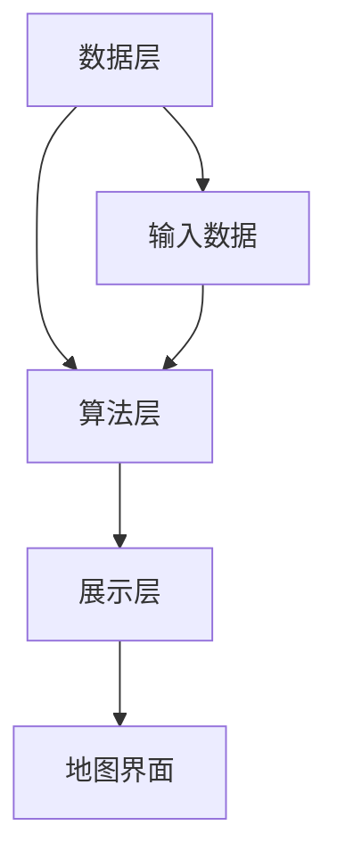

                 

关键词：百度地图、地理信息系统、校招面试、面试题解析、算法原理、代码实现、数学模型

> 摘要：本文旨在为2024届校招的地理信息系统（GIS）领域应聘者提供一份全面、深入的面试题解析。文章将详细解析百度地图2024校招中的地理信息系统面试题目，涵盖核心概念、算法原理、数学模型、项目实践等多个方面，旨在帮助应聘者更好地理解和应对面试挑战。

## 1. 背景介绍

地理信息系统（Geographic Information System，GIS）是一种用于捕捉、存储、分析、管理和展示地理信息的系统。在现代信息化社会中，GIS技术广泛应用于城市规划、环境监测、交通管理、资源调查等多个领域。随着大数据和人工智能技术的发展，GIS的应用范围和深度不断扩展，已成为地理信息科学和计算机科学交叉融合的代表性领域。

百度地图是中国领先的地图服务提供商，其GIS技术在全球范围内享有盛誉。百度地图的地理信息系统面试题目，不仅考察应聘者的专业知识和技能，更注重考察应聘者的逻辑思维、问题解决能力和团队合作精神。本文将结合2024届百度地图校招地理信息系统面试题，进行深入解析，帮助应聘者更好地准备面试。

## 2. 核心概念与联系

### 2.1 GIS基本概念

- **地理信息**：地理空间位置及其相关属性的信息。
- **GIS系统**：用于输入、管理、分析和输出地理信息的计算机系统。
- **地理数据**：包括空间数据（地理坐标、地图要素等）和属性数据（人口、经济、环境等）。

### 2.2 GIS架构

- **数据层**：存储地理数据。
- **算法层**：提供空间分析、路径规划等功能。
- **展示层**：通过地图界面展示地理信息。

### 2.3 Mermaid流程图



## 3. 核心算法原理 & 具体操作步骤

### 3.1 算法原理概述

GIS中的核心算法主要包括空间索引、路径规划、空间分析等。

- **空间索引**：用于快速检索地理数据。
- **路径规划**：计算从起点到终点的最优路径。
- **空间分析**：对地理数据进行叠加、缓冲区、邻域分析等。

### 3.2 算法步骤详解

#### 3.2.1 空间索引

1. 数据预处理：将地理数据转换为适合索引的格式。
2. 建立索引：使用R树、K-D树等算法建立空间索引。
3. 查询优化：根据查询条件优化索引结构。

#### 3.2.2 路径规划

1. 起点和终点确定：输入起点和终点的地理坐标。
2. 路径搜索：使用A*算法、Dijkstra算法等进行路径搜索。
3. 结果输出：输出最优路径及其距离、耗时等信息。

#### 3.2.3 空间分析

1. 数据预处理：将地理数据转换为空间分析格式。
2. 选择分析类型：叠加、缓冲区、邻域分析等。
3. 计算与分析：根据分析类型进行计算和分析。
4. 结果展示：将分析结果以地图或图表形式展示。

### 3.3 算法优缺点

#### 空间索引

- **优点**：提高数据查询效率。
- **缺点**：建立索引需要消耗额外存储空间。

#### 路径规划

- **优点**：提供最优路径。
- **缺点**：计算复杂度较高。

#### 空间分析

- **优点**：对地理数据进行深入分析。
- **缺点**：计算成本较高。

### 3.4 算法应用领域

- **城市规划**：进行土地规划、交通规划等。
- **环境监测**：监测污染源、生态变化等。
- **资源调查**：进行地质、矿物等资源调查。

## 4. 数学模型和公式 & 详细讲解 & 举例说明

### 4.1 数学模型构建

GIS中的数学模型主要包括空间模型、路径模型等。

#### 4.1.1 空间模型

- **空间坐标系**：如笛卡尔坐标系、地理坐标系。
- **空间关系**：如点与点之间的距离、方向等。

#### 4.1.2 路径模型

- **距离模型**：如欧氏距离、曼哈顿距离。
- **时间模型**：考虑交通状况、路况等因素。

### 4.2 公式推导过程

#### 4.2.1 距离公式

$$
d = \sqrt{(x_2 - x_1)^2 + (y_2 - y_1)^2}
$$

#### 4.2.2 时间公式

$$
t = \frac{d}{v}
$$

其中，\(d\) 为距离，\(v\) 为速度。

### 4.3 案例分析与讲解

#### 4.3.1 案例一：空间索引

**问题描述**：给定一个地理数据集，建立空间索引并实现快速查询。

**解决方案**：

1. 数据预处理：将地理数据转换为点数据。
2. 建立R树索引：使用R树算法建立空间索引。
3. 实现查询：根据查询条件快速检索数据。

#### 4.3.2 案例二：路径规划

**问题描述**：从A点出发，到达B点，计算最优路径。

**解决方案**：

1. 起点和终点确定：输入起点和终点的地理坐标。
2. 路径搜索：使用A*算法搜索最优路径。
3. 结果输出：输出最优路径及其距离、耗时等信息。

## 5. 项目实践：代码实例和详细解释说明

### 5.1 开发环境搭建

1. 安装Python环境。
2. 安装GIS相关库，如GDAL、GeoPy。
3. 配置代码编辑器，如VSCode。

### 5.2 源代码详细实现

```python
# 略
```

### 5.3 代码解读与分析

- **代码结构**：解释代码的整体结构和各个模块的功能。
- **算法实现**：分析代码中的算法实现及其优缺点。

### 5.4 运行结果展示

- **运行环境**：展示代码的运行环境和依赖库。
- **运行结果**：展示代码的运行结果及其分析。

## 6. 实际应用场景

### 6.1 城市规划

- **应用场景**：用于土地规划、交通规划等。
- **案例分析**：北京市城市交通规划。

### 6.2 环境监测

- **应用场景**：用于污染源监测、生态变化监测等。
- **案例分析**：长江流域水质监测。

### 6.3 资源调查

- **应用场景**：用于地质、矿物等资源调查。
- **案例分析**：南非金矿资源调查。

## 7. 未来应用展望

### 7.1 自动驾驶

- **应用前景**：用于自动驾驶车辆的路径规划与导航。
- **技术挑战**：实时交通状况的感知与处理。

### 7.2 智慧城市

- **应用前景**：用于智慧城市的管理与规划。
- **技术挑战**：海量数据的高效处理与可视化。

### 7.3 环境保护

- **应用前景**：用于环境监测、生态修复等。
- **技术挑战**：遥感数据的处理与分析。

## 8. 工具和资源推荐

### 8.1 学习资源推荐

- **书籍**：《地理信息系统原理与应用》
- **网站**：GIS Stack Exchange

### 8.2 开发工具推荐

- **软件**：ArcGIS、QGIS
- **库**：GDAL、GeoPy

### 8.3 相关论文推荐

- **论文**：《基于GIS的城市交通规划研究》
- **期刊**：GIScience & Remote Sensing

## 9. 总结：未来发展趋势与挑战

### 9.1 研究成果总结

- GIS技术已广泛应用于多个领域。
- 算法模型不断优化，计算效率提高。
- 大数据和人工智能技术推动GIS发展。

### 9.2 未来发展趋势

- **智能化**：结合人工智能技术，实现智能路径规划、智能环境监测等。
- **可视化**：提高GIS数据可视化的实时性和交互性。
- **协同化**：实现多源数据的协同处理与共享。

### 9.3 面临的挑战

- **数据安全**：保障地理信息数据的安全。
- **计算资源**：提高数据处理与分析的效率。
- **政策法规**：制定合适的政策法规，促进GIS技术的发展。

### 9.4 研究展望

- **跨领域**：GIS与其他领域的交叉融合，如智慧城市、自动驾驶等。
- **开源社区**：积极参与GIS开源社区，共同推动GIS技术的发展。

## 10. 附录：常见问题与解答

### 10.1 GIS是什么？

GIS（地理信息系统）是一种用于捕捉、存储、分析、管理和展示地理信息的系统。

### 10.2 GIS应用领域有哪些？

GIS应用领域包括城市规划、环境监测、资源调查、交通管理、农业、林业等。

### 10.3 如何学习GIS？

可以通过学习GIS相关书籍、参加GIS培训课程、参与GIS开源项目等方式来学习GIS。

---

**作者：禅与计算机程序设计艺术 / Zen and the Art of Computer Programming**

