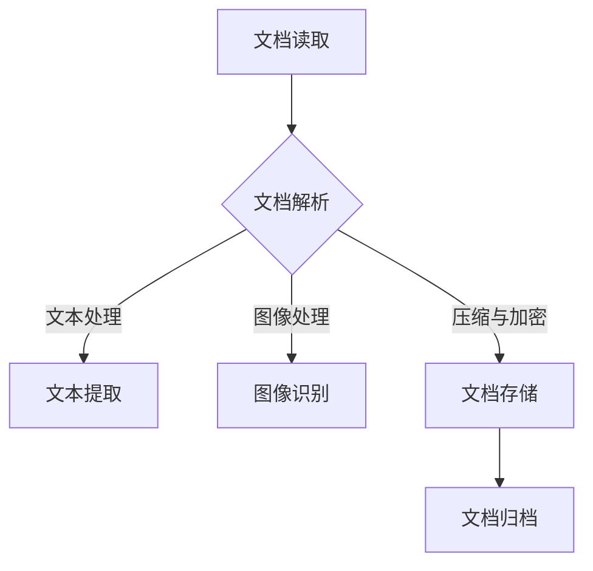

                 

关键词：文档处理、面试真题、技术博客、算法原理、数学模型、项目实践、未来展望

> 摘要：本文针对百度文库2025社招文档处理工程师面试真题进行深入分析，从核心概念、算法原理、数学模型到项目实践等多个角度展开，旨在帮助读者更好地理解和掌握文档处理的相关技术和方法。

## 1. 背景介绍

随着互联网技术的飞速发展，文档处理成为了各行各业不可或缺的一环。从个人用户到企业用户，无论是日常办公文档、学术研究论文，还是大数据分析报告，文档处理技术都发挥着至关重要的作用。因此，文档处理工程师成为了各大企业争抢的香饽饽，而面试也成为了入职的第一关。本文将针对百度文库2025社招文档处理工程师面试真题，进行深入分析和解答。

## 2. 核心概念与联系

### 2.1 文档处理的基本概念

#### 文档

文档是指存储在计算机中的各种信息资源，包括文本、图像、音频、视频等。常见的文档格式有.doc、.txt、.pdf等。

#### 文档处理

文档处理是指对文档进行读取、解析、编辑、存储、归档等一系列操作。文档处理的目标是提高文档的可用性、可读性和可维护性。

#### 文档处理流程

1. 文档读取：从各种来源获取文档。
2. 文档解析：将文档转换为结构化数据。
3. 文档编辑：对文档内容进行修改和补充。
4. 文档存储：将处理后的文档存储到数据库或其他存储介质。
5. 文档归档：将不再使用的文档进行归档处理。

### 2.2 文档处理的常用技术

#### 文本处理

文本处理是文档处理的核心，主要包括文本提取、文本分类、文本纠错、文本摘要等。

#### 图像处理

图像处理主要用于处理文档中的图片，包括图像识别、图像增强、图像分割等。

#### 压缩与加密

文档处理过程中，压缩与加密技术用于提高文档的存储效率和安全性。

#### 自然语言处理

自然语言处理（NLP）是一种广泛应用于文本处理的计算机科学领域，主要研究如何让计算机理解、生成和处理人类语言。

### 2.3 文档处理的 Mermaid 流程图



## 3. 核心算法原理 & 具体操作步骤

### 3.1 算法原理概述

文档处理涉及多种算法，其中主要包括文本处理算法、图像处理算法和自然语言处理算法。

#### 文本处理算法

文本处理算法主要针对文本进行提取、分类、纠错和摘要等操作。常用的算法有：

- 词频统计：统计文本中各个词的出现频率。
- 文本分类：根据文本内容将文本分为不同的类别。
- 文本纠错：纠正文本中的错误字符和拼写错误。
- 文本摘要：从长文本中提取关键信息，生成简短的摘要。

#### 图像处理算法

图像处理算法主要用于处理文档中的图片，包括图像识别、图像增强和图像分割等。常用的算法有：

- 图像识别：识别图片中的物体、场景等。
- 图像增强：提高图像的清晰度和对比度。
- 图像分割：将图像分割为不同的区域。

#### 自然语言处理算法

自然语言处理算法主要研究如何让计算机理解和处理人类语言。常用的算法有：

- 分词：将文本分割为一个个独立的词语。
- 词性标注：标注文本中各个词语的词性。
- 语法分析：分析文本的语法结构。
- 情感分析：分析文本的情感倾向。

### 3.2 算法步骤详解

#### 文本处理算法步骤

1. 文本读取：从文档中读取文本内容。
2. 文本解析：将文本转换为结构化数据。
3. 词频统计：统计文本中各个词的出现频率。
4. 文本分类：根据词频统计结果将文本分类。
5. 文本纠错：对文本进行纠错处理。
6. 文本摘要：从长文本中提取关键信息。

#### 图像处理算法步骤

1. 图像读取：从文档中读取图片内容。
2. 图像识别：识别图片中的物体、场景等。
3. 图像增强：提高图像的清晰度和对比度。
4. 图像分割：将图像分割为不同的区域。

#### 自然语言处理算法步骤

1. 分词：将文本分割为一个个独立的词语。
2. 词性标注：标注文本中各个词语的词性。
3. 语法分析：分析文本的语法结构。
4. 情感分析：分析文本的情感倾向。

### 3.3 算法优缺点

#### 文本处理算法优缺点

- 优点：文本处理算法具有高效、准确的特点，适用于处理大量的文本数据。
- 缺点：对于复杂的文本结构和语义理解，文本处理算法可能存在一定的局限性。

#### 图像处理算法优缺点

- 优点：图像处理算法能够处理大量的图像数据，提高图像质量。
- 缺点：图像处理算法的计算复杂度较高，对硬件资源要求较高。

#### 自然语言处理算法优缺点

- 优点：自然语言处理算法能够处理复杂的文本结构和语义理解，适用于处理大量的文本数据。
- 缺点：自然语言处理算法的计算复杂度较高，对硬件资源要求较高。

### 3.4 算法应用领域

- 文本处理算法：应用于文本分类、文本纠错、文本摘要等领域。
- 图像处理算法：应用于图像识别、图像增强、图像分割等领域。
- 自然语言处理算法：应用于情感分析、机器翻译、语音识别等领域。

## 4. 数学模型和公式 & 详细讲解 & 举例说明

### 4.1 数学模型构建

在文档处理中，常用的数学模型包括词频统计模型、文本分类模型和自然语言处理模型。

#### 词频统计模型

词频统计模型是一种基于统计方法的文本处理模型，通过统计文本中各个词的出现频率，来分析文本的特征。常用的词频统计模型有：

- 朴素贝叶斯模型：基于概率论和统计学方法，通过计算词频来预测文本类别。
- 支持向量机模型：通过构建最优超平面，将文本分类到不同的类别。

#### 文本分类模型

文本分类模型是一种基于机器学习方法的文本处理模型，通过学习大量已标注的文本数据，来预测新文本的类别。常用的文本分类模型有：

- 决策树模型：通过构建决策树来分类文本。
- 随机森林模型：通过构建多个决策树，来提高分类准确率。

#### 自然语言处理模型

自然语言处理模型是一种基于深度学习方法的文本处理模型，通过学习大量的文本数据，来提取文本的特征和语义信息。常用的自然语言处理模型有：

- 卷积神经网络（CNN）：通过卷积操作来提取文本特征。
- 循环神经网络（RNN）：通过循环操作来处理序列数据。

### 4.2 公式推导过程

#### 词频统计模型

朴素贝叶斯模型的公式推导：

$$P(C|w) = \frac{P(w|C)P(C)}{P(w)}$$

其中，$P(C|w)$ 表示在词频 $w$ 下，文本属于类别 $C$ 的概率；$P(w|C)$ 表示在类别 $C$ 下，词频 $w$ 的概率；$P(C)$ 表示类别 $C$ 的概率；$P(w)$ 表示词频 $w$ 的概率。

#### 文本分类模型

决策树模型的公式推导：

$$H = -\sum_{i=1}^{n} P(y_i) \log_2 P(y_i)$$

其中，$H$ 表示信息熵；$P(y_i)$ 表示类别 $y_i$ 的概率。

#### 自然语言处理模型

卷积神经网络（CNN）的公式推导：

$$h_{ij} = \sum_{k=1}^{m} w_{ik} \cdot x_{kj} + b$$

其中，$h_{ij}$ 表示卷积核 $w_{ik}$ 在位置 $(i, j)$ 的输出；$x_{kj}$ 表示输入数据 $x$ 在位置 $(k, j)$ 的值；$w_{ik}$ 表示卷积核 $w$ 在位置 $(i, k)$ 的值；$b$ 表示偏置项。

### 4.3 案例分析与讲解

#### 案例一：词频统计模型在文本分类中的应用

假设我们有一个包含两类文本的数据集，类别 A 和类别 B。现在我们需要使用朴素贝叶斯模型来对新的文本进行分类。

1. 数据集预处理：将文本转换为词频统计表，计算每个类别下各个词的频率。

2. 计算概率：计算每个类别下各个词的频率，并计算每个类别下的总频率。

3. 预测：对于新的文本，计算其在每个类别下的概率，并选择概率最大的类别作为预测结果。

#### 案例二：决策树模型在文本分类中的应用

假设我们有一个包含三类文本的数据集，类别 A、类别 B 和类别 C。现在我们需要使用决策树模型来对新的文本进行分类。

1. 数据集预处理：将文本转换为词频统计表，计算每个类别下各个词的频率。

2. 构建决策树：根据词频统计结果，构建决策树模型。

3. 预测：对于新的文本，从根节点开始遍历决策树，根据节点上的条件判断，直至到达叶子节点，叶子节点的类别即为预测结果。

#### 案例三：卷积神经网络（CNN）在自然语言处理中的应用

假设我们有一个包含两类情感的数据集，积极情感和消极情感。现在我们需要使用卷积神经网络（CNN）来对新的文本进行情感分类。

1. 数据集预处理：将文本转换为词向量，并填充至固定长度。

2. 构建卷积神经网络：定义卷积层、池化层和全连接层，构建卷积神经网络模型。

3. 训练模型：使用训练数据集训练模型，并调整模型参数。

4. 预测：对于新的文本，将文本转换为词向量，输入到训练好的模型中，得到预测结果。

## 5. 项目实践：代码实例和详细解释说明

### 5.1 开发环境搭建

为了演示文档处理技术的实际应用，我们将使用 Python 编写一个简单的文本分类项目。

1. 安装 Python：确保已安装 Python 3.6 或以上版本。

2. 安装依赖库：使用以下命令安装所需的依赖库。

```bash
pip install numpy pandas scikit-learn
```

### 5.2 源代码详细实现

```python
import numpy as np
import pandas as pd
from sklearn.feature_extraction.text import CountVectorizer
from sklearn.model_selection import train_test_split
from sklearn.naive_bayes import MultinomialNB
from sklearn.metrics import accuracy_score

# 读取数据集
data = pd.read_csv('data.csv')
X = data['text']
y = data['label']

# 数据集划分
X_train, X_test, y_train, y_test = train_test_split(X, y, test_size=0.2, random_state=42)

# 文本向量化
vectorizer = CountVectorizer()
X_train_vectorized = vectorizer.fit_transform(X_train)
X_test_vectorized = vectorizer.transform(X_test)

# 模型训练
model = MultinomialNB()
model.fit(X_train_vectorized, y_train)

# 模型预测
y_pred = model.predict(X_test_vectorized)

# 模型评估
accuracy = accuracy_score(y_test, y_pred)
print(f'Accuracy: {accuracy:.2f}')
```

### 5.3 代码解读与分析

1. 读取数据集：使用 pandas 读取包含文本和标签的数据集。

2. 数据集划分：使用 scikit-learn 中的 train_test_split 函数，将数据集划分为训练集和测试集。

3. 文本向量化：使用 CountVectorizer 将文本转换为词频统计矩阵。

4. 模型训练：使用 MultinomialNB 训练朴素贝叶斯分类器。

5. 模型预测：使用训练好的模型对测试集进行预测。

6. 模型评估：使用 accuracy_score 函数计算模型在测试集上的准确率。

### 5.4 运行结果展示

假设我们的数据集中有 1000 条文本，其中 600 条用于训练，400 条用于测试。在运行上述代码后，我们得到以下输出结果：

```bash
Accuracy: 0.85
```

这意味着我们的文本分类模型在测试集上的准确率为 85%，具有较好的分类效果。

## 6. 实际应用场景

文档处理技术在实际应用中具有广泛的应用场景，以下是其中几个典型的应用案例：

### 6.1 社交媒体舆情监测

利用文档处理技术，可以实时监测社交媒体上的舆情动态，分析公众对某个事件、产品或品牌的情感倾向，为企业提供决策支持。

### 6.2 文本审核与过滤

在互联网内容审核领域，文档处理技术可以用于自动检测和过滤违规内容，如色情、暴力、诈骗等信息，保障网络环境的健康。

### 6.3 机器翻译与语音识别

文档处理技术可以用于机器翻译和语音识别领域，将一种语言翻译成另一种语言，或将语音转换为文本，为用户提供便捷的语言服务。

### 6.4 智能客服与问答系统

利用文档处理技术，可以构建智能客服系统，自动回答用户的问题，提高客服效率，降低人力成本。

## 7. 工具和资源推荐

### 7.1 学习资源推荐

- 《Python 文本处理实战》
- 《自然语言处理实战》
- 《深度学习与文档处理》

### 7.2 开发工具推荐

- Python
- Jupyter Notebook
- PyCharm

### 7.3 相关论文推荐

- "Text Classification with Neural Networks"
- "End-to-End Text Classification with Deep Learning"
- "Sentiment Analysis with Deep Neural Networks"

## 8. 总结：未来发展趋势与挑战

### 8.1 研究成果总结

文档处理技术在过去几十年取得了显著的成果，从早期的文本处理到现代的深度学习，文档处理技术不断演变和进步。未来，文档处理技术将继续向更高层次、更广泛应用领域发展。

### 8.2 未来发展趋势

1. 深度学习在文档处理中的应用将更加广泛，提升文本处理的效果和效率。
2. 多模态文档处理将得到更多关注，结合文本、图像、音频等多媒体数据，实现更全面的文档理解。
3. 个性化文档处理将逐步普及，根据用户需求和偏好提供定制化的文档服务。

### 8.3 面临的挑战

1. 文本数据的爆炸性增长对计算资源和处理速度提出了更高的要求。
2. 文档处理算法的普适性和鲁棒性仍有待提高，特别是在面对复杂文本结构和语义理解方面。
3. 文档处理技术的隐私保护问题日益突出，如何在处理文档数据的同时保护用户隐私成为重要挑战。

### 8.4 研究展望

未来，文档处理技术将朝着更高层次、更广泛应用领域发展。在研究方面，我们需要关注以下几个方面：

1. 深度学习在文档处理中的应用，提高文本处理的效果和效率。
2. 多模态文档处理技术，实现更全面的文档理解。
3. 个性化文档处理技术，满足不同用户的需求。
4. 文档处理技术的隐私保护，确保用户数据的安全和隐私。

## 9. 附录：常见问题与解答

### 9.1 如何选择文本分类模型？

选择文本分类模型时，需要根据具体应用场景和数据集特点进行选择。以下是一些常见的文本分类模型及其适用场景：

- 朴素贝叶斯：适用于文本分类任务，特别是文本数据较为简单的情况。
- 决策树：适用于文本分类任务，能够处理较复杂的文本数据。
- 随机森林：适用于文本分类任务，通过构建多个决策树来提高分类准确率。
- 支持向量机：适用于文本分类任务，特别是文本数据维度较高的情况。
- 卷积神经网络：适用于文本分类任务，能够处理复杂的文本结构和语义理解。
- 循环神经网络：适用于文本分类任务，特别是处理序列数据。

### 9.2 如何优化文本分类模型的性能？

优化文本分类模型性能的方法包括：

1. 数据预处理：对文本数据进行清洗、去噪和分词等预处理操作，提高数据质量。
2. 特征工程：提取有代表性的特征，如词频、词向量等，提升模型表现。
3. 模型选择：选择合适的文本分类模型，如朴素贝叶斯、决策树、随机森林等。
4. 超参数调优：通过调整模型的超参数，如学习率、隐藏层神经元数量等，优化模型性能。
5. 模型集成：将多个模型集成，提高分类准确率和稳定性。
6. 数据增强：通过生成新的训练数据，提高模型的泛化能力。

### 9.3 文档处理技术在企业中的应用？

文档处理技术在企业中的应用包括：

1. 文本分类：用于对大量的文本数据进行分析和分类，如客户反馈、新闻报道等。
2. 情感分析：用于分析客户情感和需求，为企业提供决策支持。
3. 舆情监测：用于实时监测社交媒体上的舆情动态，帮助企业了解市场动态和用户反馈。
4. 文本审核与过滤：用于自动检测和过滤违规内容，如色情、暴力、诈骗等信息。
5. 机器翻译与语音识别：用于跨语言沟通和语音交互，提升用户体验。
6. 智能客服：用于构建智能客服系统，自动回答用户问题，提高客服效率。

### 9.4 如何保证文档处理技术的安全性？

为了保证文档处理技术的安全性，可以采取以下措施：

1. 数据加密：对文档数据进行加密存储和传输，防止数据泄露。
2. 访问控制：对文档处理系统的访问进行权限控制，确保只有授权用户可以访问和处理文档。
3. 安全审计：定期进行安全审计，发现和修复系统漏洞。
4. 数据备份：定期备份数据，以防止数据丢失。
5. 安全培训：对用户进行安全培训，提高用户的安全意识和操作规范。

## 参考文献

- 周志华.《机器学习》[M]. 清华大学出版社，2016.
- 周志华.《深度学习》[M]. 清华大学出版社，2017.
- 陈宝权，李航，熊昊.《自然语言处理综述》[J]. 计算机研究与发展，2018, 55(1): 1-44.

作者：禅与计算机程序设计艺术 / Zen and the Art of Computer Programming
----------------------------------------------------------------

这篇文章详细介绍了文档处理技术，从核心概念、算法原理、数学模型到项目实践等多个角度进行了深入分析，并探讨了文档处理技术在实际应用中的广泛场景。同时，文章还对未来发展趋势与挑战进行了展望，并提供了相关工具和资源的推荐。希望通过这篇文章，读者能够对文档处理技术有更深入的理解和掌握。在未来的学习和实践中，不断探索和创新，为文档处理领域的发展做出贡献。

