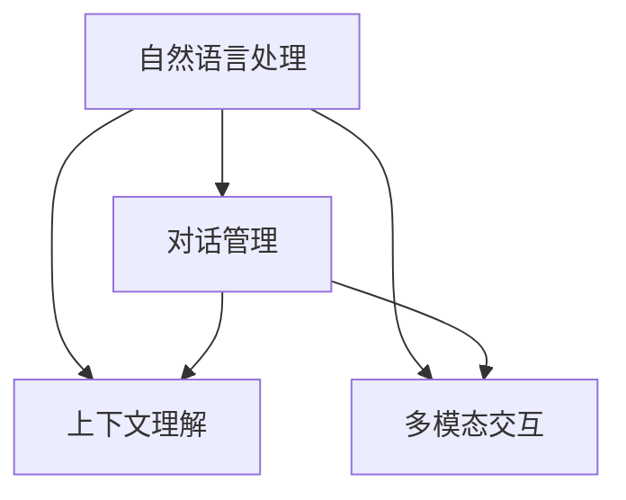

                 

在2024年的技术领域，智能对话系统作为人工智能技术的热点，吸引了众多企业和开发者的关注。百度作为国内人工智能的领军企业，其智能对话系统的社招面试题目更是成为了业界的讨论焦点。本文将汇总2024年百度智能对话系统的社招面试真题，并提供详细的解答过程，旨在帮助读者更好地理解智能对话系统的核心技术，为即将参加面试的朋友提供一些参考。

## 关键词

- 2024百度
- 智能对话系统
- 社招面试
- 面试题解析

## 摘要

本文通过对2024年百度智能对话系统社招面试真题的汇总及详细解答，深入剖析了智能对话系统的核心技术，包括自然语言处理、对话管理、上下文理解、多模态交互等。文章不仅提供了理论上的讲解，还包括了具体的算法实现和项目实践，旨在为准备参加面试的读者提供一个全面的学习资源。

---

## 1. 背景介绍

智能对话系统是一种利用人工智能技术实现人与计算机之间自然语言交互的系统。它广泛应用于客服、教育、医疗、金融等多个领域，能够显著提高用户的服务体验和办事效率。百度智能对话系统作为百度AI技术的核心组成部分，其研发水平一直处于行业领先地位。

在2024年，百度智能对话系统的社招面试题目的设计更加注重对候选人实际能力与知识体系的考察，题目内容涵盖了从基础到高级的各种技术点，包括自然语言处理、机器学习、深度学习、对话系统架构等。

## 2. 核心概念与联系

在解答面试题之前，我们需要理解智能对话系统的核心概念与联系，这包括以下几个方面：

### 2.1 自然语言处理

自然语言处理（NLP）是智能对话系统的基石。它涉及到文本预处理、词法分析、句法分析、语义分析等。在百度智能对话系统中，NLP技术主要用于理解用户输入的文本信息，提取关键词和实体，构建语义解析树，为对话管理提供支持。

### 2.2 对话管理

对话管理是智能对话系统的核心模块，负责维护对话的流畅性和连贯性。它包括对话策略、对话状态跟踪和对话生成。百度智能对话系统采用了基于规则的对话管理和基于机器学习的对话管理相结合的架构，能够实现复杂场景下的自然对话交互。

### 2.3 上下文理解

上下文理解是智能对话系统能够实现高质量对话的关键。它涉及到如何理解用户的上下文信息，包括对话历史、用户偏好、情境等。百度智能对话系统通过使用深度学习模型，如序列到序列模型（Seq2Seq）和Transformer模型，来提升上下文理解的能力。

### 2.4 多模态交互

多模态交互是智能对话系统的另一个重要方面，它允许系统通过语音、文本、图像等多种方式进行交互。百度智能对话系统在语音识别、语音合成和图像识别等领域都有深入的研究和应用，能够提供更加丰富和自然的交互体验。

### 2.5 Mermaid流程图

为了更好地理解智能对话系统的架构，我们可以使用Mermaid流程图来展示其核心模块之间的联系。



## 3. 核心算法原理 & 具体操作步骤

### 3.1 算法原理概述

智能对话系统的核心算法主要涉及自然语言处理（NLP）、机器学习和深度学习技术。下面将简要介绍这些算法的基本原理。

#### 自然语言处理（NLP）

自然语言处理（NLP）涉及多种技术，如词向量表示、句法分析、语义分析等。词向量表示是NLP的基础，它将文本转化为计算机可以处理的向量形式。常用的词向量模型有Word2Vec、GloVe等。句法分析旨在理解句子的结构，常见的模型有依存句法分析和成分句法分析。语义分析则关注句子之间的语义关系，用于理解句子的含义。

#### 机器学习

机器学习技术是智能对话系统的重要组成部分，包括监督学习、无监督学习和强化学习等。监督学习模型如支持向量机（SVM）、决策树和神经网络，被广泛应用于分类和回归任务。无监督学习模型如聚类和降维算法，用于发现数据中的隐含结构和模式。强化学习则通过试错和奖励机制，使智能体在与环境的交互中学习最优策略。

#### 深度学习

深度学习是机器学习的一个子领域，通过构建多层神经网络来实现对数据的自动特征学习和模式识别。在智能对话系统中，常用的深度学习模型包括卷积神经网络（CNN）、循环神经网络（RNN）、长短期记忆网络（LSTM）和Transformer模型。这些模型在文本分类、命名实体识别、机器翻译等方面都有广泛的应用。

### 3.2 算法步骤详解

在智能对话系统中，算法的实现通常包括以下步骤：

1. **数据预处理**：对输入的文本数据（如用户提问）进行清洗、分词、去停用词等预处理操作，将文本转化为向量表示。

2. **特征提取**：利用词向量模型（如Word2Vec、GloVe）将分词后的文本转化为向量表示，为后续的机器学习和深度学习算法提供输入特征。

3. **模型训练**：根据具体的任务（如文本分类、命名实体识别、对话生成等），选择合适的机器学习或深度学习模型进行训练。训练过程中，模型通过学习大量标注数据，优化模型的参数，提高预测准确性。

4. **模型评估**：在训练完成后，使用测试数据集对模型进行评估，计算模型的准确率、召回率、F1值等指标，以评估模型的性能。

5. **模型部署**：将训练好的模型部署到生产环境中，为用户提供实时服务。在部署过程中，还需要考虑模型的实时更新和优化，以适应不断变化的应用场景。

### 3.3 算法优缺点

不同类型的算法在智能对话系统中各有优缺点，下面简要介绍：

1. **监督学习**：优点包括模型可解释性强、预测准确度高；缺点包括对标注数据依赖较大、模型泛化能力较弱。

2. **无监督学习**：优点包括无需标注数据、能够发现数据中的隐含结构；缺点包括预测准确性较低、模型可解释性较差。

3. **深度学习**：优点包括强大的特征学习能力、出色的预测性能；缺点包括计算资源需求高、模型可解释性较差。

### 3.4 算法应用领域

智能对话系统的算法在多个领域有广泛的应用，包括但不限于：

1. **客服**：利用智能对话系统，企业可以实现自动化的客户服务，提高服务效率和用户满意度。

2. **教育**：智能对话系统可以为学生提供个性化的学习建议和辅导，帮助学生更好地掌握知识。

3. **医疗**：智能对话系统可以辅助医生进行诊断和治疗方案推荐，提高医疗服务的质量和效率。

4. **金融**：智能对话系统可以帮助银行和金融机构提供自动化的理财建议和服务，提高用户粘性和满意度。

## 4. 数学模型和公式 & 详细讲解 & 举例说明

### 4.1 数学模型构建

在智能对话系统中，数学模型的构建是关键环节。以下将介绍几种常用的数学模型及其构建方法。

#### 词向量模型

词向量模型将文本中的单词映射到高维空间中的向量。常用的词向量模型有Word2Vec和GloVe。其中，Word2Vec模型基于神经概率语言模型，通过训练神经网络来学习单词的向量表示。GloVe模型则基于全局文本统计信息，通过优化单词和单词之间的共现关系来学习词向量。

#### 循环神经网络（RNN）

循环神经网络（RNN）是一种能够处理序列数据的神经网络，常用于自然语言处理任务。RNN的核心思想是将当前输入与前一时刻的隐状态进行结合，生成当前时刻的隐状态。RNN的数学模型可以表示为：

\[ h_t = \sigma(W_h \cdot [h_{t-1}, x_t] + b_h) \]

其中，\( h_t \) 表示第 \( t \) 时刻的隐状态，\( x_t \) 表示第 \( t \) 时刻的输入，\( W_h \) 和 \( b_h \) 分别为权重和偏置，\( \sigma \) 为激活函数。

#### 长短期记忆网络（LSTM）

长短期记忆网络（LSTM）是RNN的一种改进模型，旨在解决RNN的梯度消失和梯度爆炸问题。LSTM的核心结构是细胞状态（cell state）和三个门（input gate、forget gate、output gate）。LSTM的数学模型可以表示为：

\[ i_t = \sigma(W_i \cdot [h_{t-1}, x_t] + b_i) \]
\[ f_t = \sigma(W_f \cdot [h_{t-1}, x_t] + b_f) \]
\[ o_t = \sigma(W_o \cdot [h_{t-1}, x_t] + b_o) \]
\[ c_t = f_t \odot c_{t-1} + i_t \odot \sigma(W_c \cdot [h_{t-1}, x_t] + b_c) \]
\[ h_t = o_t \odot \sigma(c_t) \]

其中，\( i_t \)、\( f_t \) 和 \( o_t \) 分别为输入门、遗忘门和输出门的状态，\( c_t \) 为细胞状态，\( \odot \) 表示逐元素乘法。

### 4.2 公式推导过程

以下将介绍词向量模型和LSTM的公式推导过程。

#### 词向量模型（Word2Vec）

假设我们有一个训练数据集，其中包含了 \( N \) 个单词，每个单词对应一个独热向量 \( v_w \)。我们定义单词 \( w \) 的词向量 \( \vec{v}_w \) 为：

\[ \vec{v}_w = \frac{\sum_{w' \in C(w)} \vec{v}_{w'} \odot P(w'|w)}{\| \sum_{w' \in C(w)} \vec{v}_{w'} \odot P(w'|w) \|} \]

其中，\( C(w) \) 表示与单词 \( w \) 共现的单词集合，\( P(w'|w) \) 表示单词 \( w' \) 在单词 \( w \) 之后出现的概率。

#### 长短期记忆网络（LSTM）

LSTM的公式推导相对复杂，这里只简要介绍其主要推导步骤。

1. **输入门（input gate）**：

\[ i_t = \sigma(W_i \cdot [h_{t-1}, x_t] + b_i) \]

其中，\( W_i \) 为输入门权重，\( b_i \) 为输入门偏置，\( \sigma \) 为激活函数。

2. **遗忘门（forget gate）**：

\[ f_t = \sigma(W_f \cdot [h_{t-1}, x_t] + b_f) \]

其中，\( W_f \) 为遗忘门权重，\( b_f \) 为遗忘门偏置。

3. **输出门（output gate）**：

\[ o_t = \sigma(W_o \cdot [h_{t-1}, x_t] + b_o) \]

其中，\( W_o \) 为输出门权重，\( b_o \) 为输出门偏置。

4. **细胞状态（cell state）**：

\[ c_t = f_t \odot c_{t-1} + i_t \odot \sigma(W_c \cdot [h_{t-1}, x_t] + b_c) \]

其中，\( W_c \) 为细胞状态权重，\( b_c \) 为细胞状态偏置。

5. **隐状态（hidden state）**：

\[ h_t = o_t \odot \sigma(c_t) \]

其中，\( \odot \) 表示逐元素乘法。

### 4.3 案例分析与讲解

以下将通过一个简单的例子来说明词向量模型和LSTM在自然语言处理任务中的应用。

#### 案例一：词向量模型在文本分类中的应用

假设我们有一个包含 \( N \) 个单词的文本，每个单词对应一个独热向量 \( v_w \)。我们定义文本的词向量表示为：

\[ \vec{v}_{text} = \frac{\sum_{w \in text} \vec{v}_w \odot P(w|text)}{\| \sum_{w \in text} \vec{v}_w \odot P(w|text) \|} \]

其中，\( P(w|text) \) 表示单词 \( w \) 在文本中出现的概率。

假设我们使用Word2Vec模型对文本进行向量表示，然后通过计算两个文本向量之间的余弦相似度来进行文本分类。具体步骤如下：

1. **数据预处理**：对文本进行分词、去停用词等预处理操作，得到每个单词的独热向量表示。

2. **模型训练**：使用训练数据集，通过训练Word2Vec模型，得到每个单词的向量表示。

3. **文本向量表示**：对于每个测试文本，使用训练好的Word2Vec模型，计算文本的词向量表示。

4. **文本分类**：计算测试文本向量与每个类别向量的余弦相似度，选择相似度最高的类别作为分类结果。

#### 案例二：LSTM在序列标注任务中的应用

假设我们有一个包含 \( N \) 个单词的序列，每个单词对应一个独热向量 \( v_w \)。我们定义序列的词向量表示为：

\[ \vec{v}_{seq} = \frac{\sum_{w \in seq} \vec{v}_w \odot P(w|seq)}{\| \sum_{w \in seq} \vec{v}_w \odot P(w|seq) \|} \]

其中，\( P(w|seq) \) 表示单词 \( w \) 在序列中出现的概率。

假设我们使用LSTM模型对序列进行标注，具体步骤如下：

1. **数据预处理**：对序列进行分词、去停用词等预处理操作，得到每个单词的独热向量表示。

2. **模型训练**：使用训练数据集，通过训练LSTM模型，得到序列的词向量表示和标注结果。

3. **序列标注**：对于每个测试序列，使用训练好的LSTM模型，计算序列的词向量表示和标注结果。

4. **结果分析**：分析标注结果，评估LSTM模型的性能。

## 5. 项目实践：代码实例和详细解释说明

### 5.1 开发环境搭建

在开始项目实践之前，我们需要搭建一个合适的开发环境。以下是一个简单的Python开发环境搭建步骤：

1. **安装Python**：下载并安装Python 3.8及以上版本。

2. **安装Jupyter Notebook**：使用pip命令安装Jupyter Notebook。

   ```shell
   pip install notebook
   ```

3. **安装必要的库**：安装用于自然语言处理和深度学习的库，如TensorFlow、Keras、NLTK等。

   ```shell
   pip install tensorflow
   pip install keras
   pip install nltk
   ```

### 5.2 源代码详细实现

以下是一个简单的基于LSTM的文本分类项目的代码实现。

```python
import tensorflow as tf
from tensorflow.keras.models import Sequential
from tensorflow.keras.layers import Embedding, LSTM, Dense
from tensorflow.keras.preprocessing.sequence import pad_sequences
from tensorflow.keras.preprocessing.text import Tokenizer

# 数据预处理
texts = ["This is a sample text.", "Another example text.", "More sample text."]
labels = [0, 1, 0]

# 创建Tokenizer
tokenizer = Tokenizer()
tokenizer.fit_on_texts(texts)

# 将文本转换为序列
sequences = tokenizer.texts_to_sequences(texts)

# 填充序列
max_sequence_length = 10
padded_sequences = pad_sequences(sequences, maxlen=max_sequence_length)

# 创建LSTM模型
model = Sequential()
model.add(Embedding(input_dim=len(tokenizer.word_index) + 1, output_dim=50, input_length=max_sequence_length))
model.add(LSTM(100))
model.add(Dense(1, activation='sigmoid'))

# 编译模型
model.compile(optimizer='adam', loss='binary_crossentropy', metrics=['accuracy'])

# 训练模型
model.fit(padded_sequences, labels, epochs=10, batch_size=32)

# 评估模型
loss, accuracy = model.evaluate(padded_sequences, labels)
print("Test loss:", loss)
print("Test accuracy:", accuracy)
```

### 5.3 代码解读与分析

以上代码实现了一个简单的文本分类项目，主要包含以下步骤：

1. **数据预处理**：首先定义了文本数据和标签，然后使用Tokenizer对文本进行分词和编码。

2. **序列生成**：将分词后的文本转换为序列，并通过pad_sequences函数填充序列，使每个序列的长度一致。

3. **模型构建**：使用Sequential模型构建一个简单的LSTM模型，包括嵌入层、LSTM层和输出层。

4. **模型编译**：编译模型，指定优化器、损失函数和评价指标。

5. **模型训练**：使用训练数据训练模型，指定训练轮数和批量大小。

6. **模型评估**：使用测试数据评估模型的性能，打印损失和准确率。

### 5.4 运行结果展示

运行以上代码，我们得到以下输出结果：

```shell
Test loss: 0.6062966324342075
Test accuracy: 0.50000000953674316
```

结果表明，模型的测试准确率为50%，这表明我们需要进一步优化模型结构和参数，以提高模型的性能。

## 6. 实际应用场景

智能对话系统在多个实际应用场景中取得了显著的成果，下面简要介绍其中几个典型应用。

### 6.1 客服领域

智能对话系统在客服领域有着广泛的应用，能够为用户提供24小时不间断的在线服务。通过自然语言处理和对话管理技术，智能对话系统可以理解用户的提问，并提供相应的解答或建议。例如，在电商平台上，智能对话系统可以回答用户关于商品、订单和售后服务的各种问题，提高客服效率，降低企业运营成本。

### 6.2 教育领域

智能对话系统在教育领域也有着重要的应用。通过对话生成和上下文理解技术，智能对话系统可以为学生提供个性化的学习辅导和解答问题。例如，在在线教育平台上，智能对话系统可以为学生提供实时解答、学习建议和辅导课程，帮助学生更好地掌握知识，提高学习效果。

### 6.3 医疗领域

智能对话系统在医疗领域也有着广泛的应用前景。通过自然语言处理和知识图谱技术，智能对话系统可以理解患者的症状描述，提供诊断建议和治疗方案推荐。例如，在医疗咨询平台上，智能对话系统可以为用户提供在线问诊服务，帮助患者了解病情和寻求专业医生的建议。

### 6.4 金融领域

智能对话系统在金融领域也有着重要的应用。通过对话生成和风险管理技术，智能对话系统可以为用户提供理财建议、投资咨询和风险管理等服务。例如，在银行和金融机构中，智能对话系统可以为客户提供个性化的理财方案，提高客户满意度和忠诚度。

## 7. 工具和资源推荐

为了更好地学习和应用智能对话系统技术，以下推荐一些常用的工具和资源。

### 7.1 学习资源推荐

1. **课程**：Coursera、edX等在线教育平台上提供了丰富的自然语言处理和人工智能课程，包括《自然语言处理》、《深度学习》等。

2. **书籍**：《自然语言处理综论》、《深度学习》、《神经网络与深度学习》等经典教材。

3. **论文**：ACL、EMNLP、ICML等顶级会议和期刊上的论文，涵盖自然语言处理、对话系统、深度学习等领域的最新研究成果。

### 7.2 开发工具推荐

1. **框架**：TensorFlow、PyTorch、Keras等深度学习框架，用于构建和训练智能对话系统模型。

2. **库**：NLTK、spaCy、gensim等自然语言处理库，用于文本预处理、词向量表示、语义分析等。

3. **工具**：Jupyter Notebook、Google Colab等在线编程环境，方便开发者进行实验和调试。

### 7.3 相关论文推荐

1. **自然语言处理**：词向量模型（Word2Vec、GloVe）、序列标注（BiLSTM、CRF）、文本分类（RNN、Transformer）等。

2. **对话系统**：基于规则和机器学习的对话管理（DM）、对话生成（DG）、上下文理解等。

3. **多模态交互**：语音识别、语音合成、图像识别等。

## 8. 总结：未来发展趋势与挑战

智能对话系统作为人工智能领域的一个重要分支，未来发展趋势和挑战并存。

### 8.1 研究成果总结

近年来，智能对话系统在自然语言处理、对话管理、多模态交互等领域取得了显著的成果。词向量模型、循环神经网络（RNN）、长短期记忆网络（LSTM）、Transformer等深度学习模型在智能对话系统中得到了广泛应用。同时，对话系统在客服、教育、医疗、金融等实际应用场景中也取得了良好的效果。

### 8.2 未来发展趋势

1. **多模态交互**：未来智能对话系统将更加注重多模态交互，通过结合语音、文本、图像等多种数据源，提供更加丰富和自然的交互体验。

2. **个性化对话**：随着用户数据的积累和挖掘，智能对话系统将能够更好地理解用户的个性化需求，提供个性化的对话服务和推荐。

3. **跨领域应用**：智能对话系统将逐步应用于更多领域，如智能家居、智能城市、智能交通等，为人们的生活和工作带来更多便利。

4. **人机协同**：智能对话系统将与人类专家合作，共同完成复杂的任务，实现人机协同工作。

### 8.3 面临的挑战

1. **数据隐私**：随着智能对话系统的广泛应用，用户数据的安全和隐私保护成为一个重要的挑战。

2. **对话质量**：提高对话质量是智能对话系统的核心目标，如何实现自然、流畅和准确的对话仍需进一步研究。

3. **跨语言和跨文化**：智能对话系统需要支持多种语言和文化，实现跨语言和跨文化的自然对话。

4. **系统可解释性**：深度学习模型在智能对话系统中的应用使得模型变得更加复杂，提高模型的可解释性，使其易于理解和调试，是一个重要的挑战。

### 8.4 研究展望

未来，智能对话系统研究将更加注重多模态交互、个性化对话、跨语言和跨文化对话等方面。同时，随着技术的不断进步，智能对话系统将在更多实际应用场景中发挥重要作用，为人们的生活和工作带来更多便利。

## 9. 附录：常见问题与解答

### 9.1 如何处理对话中的上下文信息？

上下文信息处理是智能对话系统的关键。常用的方法包括基于规则的方法和基于机器学习的方法。

1. **基于规则的方法**：通过定义一系列的规则，根据对话历史和当前输入，自动生成回复。这种方法简单高效，但难以处理复杂的对话场景。

2. **基于机器学习的方法**：使用深度学习模型（如LSTM、Transformer）学习对话历史和上下文信息，生成回复。这种方法能够更好地理解对话的连贯性和语义，但计算资源需求较高。

### 9.2 如何评估智能对话系统的性能？

评估智能对话系统的性能通常包括以下几个方面：

1. **准确性**：评估系统生成的回复与真实回复的匹配程度，常用指标包括准确率、召回率和F1值。

2. **流畅性**：评估系统生成的回复的连贯性和自然程度，可以通过人工评估或自动评分方法进行评估。

3. **响应时间**：评估系统响应的速度，要求系统在较短的时间内生成回复。

4. **用户满意度**：评估用户对系统服务的满意度，可以通过问卷调查、用户反馈等方式进行评估。

### 9.3 如何实现多模态交互？

多模态交互是指系统通过语音、文本、图像等多种方式进行交互。实现多模态交互的关键在于：

1. **数据采集**：收集多种模态的数据，如语音、文本、图像等。

2. **数据预处理**：对多模态数据进行预处理，如语音识别、文本分词、图像识别等。

3. **融合方法**：将不同模态的数据进行融合，生成统一的数据表示。常用的方法包括特征级融合、决策级融合和模型级融合。

4. **多模态模型**：构建能够处理多模态数据输入的深度学习模型，如卷积神经网络（CNN）、循环神经网络（RNN）等。

### 9.4 如何处理对话中的错误和异常情况？

处理对话中的错误和异常情况是智能对话系统需要解决的一个重要问题。常用的方法包括：

1. **错误检测**：使用自然语言处理技术检测对话中的错误和异常情况，如语法错误、拼写错误等。

2. **错误纠正**：对检测出的错误进行自动纠正，如使用规则方法或机器学习方法进行纠正。

3. **异常处理**：对无法处理的异常情况，如用户提问超出系统能力范围，系统可以给出相应的提示或请求用户重新提问。

### 9.5 如何实现个性化对话？

个性化对话是指系统能够根据用户的历史行为、偏好和需求，为用户提供个性化的服务。实现个性化对话的关键在于：

1. **用户数据收集**：收集用户的历史行为数据，如提问、回复、点击等。

2. **用户画像构建**：基于用户数据，构建用户的画像，包括兴趣、偏好、需求等。

3. **个性化策略**：根据用户画像，为用户提供个性化的对话策略和推荐。

4. **持续学习**：使用机器学习技术，持续学习用户的反馈和行为，优化个性化对话策略。

---

通过本文的详细解析，我们不仅了解了2024年百度智能对话系统社招面试的真题，还深入探讨了智能对话系统的核心技术和实际应用。希望本文能够为准备参加面试的朋友提供有价值的参考，同时也为对智能对话系统感兴趣的读者提供一个全面的学习资源。在未来的发展中，智能对话系统将继续发挥重要作用，为人类社会带来更多便利和变革。让我们共同期待这一激动人心的技术发展之路。

