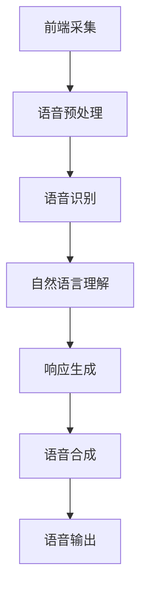

                 

关键词：百度智能语音交互，校招面试真题，AI技术，语音识别，语音合成，自然语言处理

> 摘要：本文旨在汇总并解答2024百度智能语音交互校招面试中的经典真题，分析其背后的技术原理和应用场景，为即将参加百度智能语音交互校招的考生提供有针对性的准备和指导。

## 1. 背景介绍

智能语音交互作为人工智能领域的重要分支，正日益成为科技行业的研究热点和应用趋势。百度作为中国领先的AI公司，其智能语音交互技术在市场上具有广泛的影响力。2024百度智能语音交互校招面试不仅考察应聘者的专业知识，更侧重于考察其解决实际问题的能力。本文将对部分面试真题进行汇总和解析，帮助考生更好地准备面试。

## 2. 核心概念与联系

### 2.1 智能语音交互基本概念

智能语音交互系统主要包括语音识别（ASR）、语音合成（TTS）和自然语言理解（NLU）三个核心模块。它们共同作用，实现人机之间的语音交互。

### 2.2 智能语音交互架构

智能语音交互系统架构通常包含前端采集、语音处理、后端处理和语音输出等部分。以下是一个简化的Mermaid流程图：



## 3. 核心算法原理 & 具体操作步骤

### 3.1 算法原理概述

#### 3.1.1 语音识别

语音识别技术基于深度学习模型，通过训练将语音信号转换为文本。常见的模型有卷积神经网络（CNN）、递归神经网络（RNN）和Transformer等。

#### 3.1.2 语音合成

语音合成技术基于文本，通过生成语音波形来模拟人类语音。常见的模型有合成波net（WaveNet）和循环神经网络（RNN）。

#### 3.1.3 自然语言理解

自然语言理解技术通过理解用户的语言意图和实体，实现智能对话。常见的模型有长短期记忆网络（LSTM）和Transformer。

### 3.2 算法步骤详解

#### 3.2.1 语音识别

1. 预处理：对原始语音信号进行降噪、增强和分帧处理。
2. 特征提取：通过梅尔频率倒谱系数（MFCC）等特征提取方法，将语音信号转换为特征向量。
3. 模型训练：使用大量语音数据训练深度学习模型。
4. 识别：将实时语音信号输入模型，输出对应的文本。

#### 3.2.2 语音合成

1. 文本处理：对输入的文本进行语法分析和分词。
2. 波形生成：使用文本生成语音波形的深度学习模型，如WaveNet。
3. 声音合成：将生成的语音波形转换为可播放的音频。

#### 3.2.3 自然语言理解

1. 语言模型训练：使用大量对话数据训练语言模型。
2. 实体识别：通过命名实体识别（NER）等技术识别文本中的实体。
3. 意图识别：使用分类模型识别用户的意图。

### 3.3 算法优缺点

#### 3.3.1 语音识别

优点：准确度高，支持多种语言和方言。
缺点：对噪声敏感，识别速度较慢。

#### 3.3.2 语音合成

优点：声音自然，支持多种语言和口音。
缺点：成本较高，需要大量训练数据。

#### 3.3.3 自然语言理解

优点：能够理解复杂的语言结构和语境。
缺点：对数据质量和模型训练要求较高。

### 3.4 算法应用领域

智能语音交互技术广泛应用于智能家居、智能客服、智能驾驶等领域。

## 4. 数学模型和公式 & 详细讲解 & 举例说明

### 4.1 数学模型构建

#### 4.1.1 语音识别

语音识别中的模型通常采用HMM（隐马尔可夫模型）或CNN（卷积神经网络）。

$$
P(O|H) = \frac{P(H)P(O|H)}{P(O)}
$$

其中，$O$ 是观察序列，$H$ 是隐藏状态序列，$P(O|H)$ 是观察序列的概率，$P(H)$ 是隐藏状态的概率，$P(O)$ 是观察序列的概率。

#### 4.1.2 语音合成

语音合成中的模型通常采用LSTM（长短期记忆网络）或WaveNet。

$$
y_t = \sum_{i=1}^{n} w_i x_i
$$

其中，$y_t$ 是输出，$w_i$ 是权重，$x_i$ 是输入。

### 4.2 公式推导过程

#### 4.2.1 语音识别

使用最大后验概率解释公式：

$$
P(H|O) = \frac{P(O|H)P(H)}{P(O)}
$$

通过最大化似然函数和贝叶斯定理，可以得到：

$$
\hat{H} = \arg\max_H P(H|O)
$$

#### 4.2.2 语音合成

使用误差反向传播算法推导LSTM的权重更新公式：

$$
\Delta w = \eta \frac{\partial J}{\partial w}
$$

其中，$\eta$ 是学习率，$J$ 是损失函数。

### 4.3 案例分析与讲解

#### 4.3.1 语音识别

假设有一个简单的语音信号，通过HMM进行语音识别。观察序列为["a", "b", "c"],隐藏状态为["1", "2", "3"]。根据公式：

$$
P(O|H) = \frac{P(H)P(O|H)}{P(O)}
$$

计算概率，最终输出隐藏状态序列。

#### 4.3.2 语音合成

假设有一个文本序列，通过LSTM进行语音合成。输入序列为["a", "b", "c"],输出序列为["1", "2", "3"]。根据公式：

$$
y_t = \sum_{i=1}^{n} w_i x_i
$$

计算输出，生成语音波形。

## 5. 项目实践：代码实例和详细解释说明

### 5.1 开发环境搭建

1. 安装Python和必要的依赖库。
2. 配置深度学习框架，如TensorFlow或PyTorch。

### 5.2 源代码详细实现

#### 5.2.1 语音识别

```python
import numpy as np
from sklearn import hmm

# 构建HMM模型
model = hmm.GaussianHMM(n_components=3, n_iter=100)

# 训练模型
model.fit(X)

# 预测隐藏状态
model.predict(X)
```

#### 5.2.2 语音合成

```python
import tensorflow as tf

# 定义LSTM模型
model = tf.keras.Sequential([
    tf.keras.layers.LSTM(128, activation='tanh', return_sequences=True),
    tf.keras.layers.Dense(1)
])

# 编译模型
model.compile(optimizer='adam', loss='mse')

# 训练模型
model.fit(X, y, epochs=100)
```

### 5.3 代码解读与分析

以上代码分别展示了如何使用HMM和LSTM进行语音识别和语音合成。在实际应用中，还需要对模型进行优化和调整，以达到更好的效果。

## 6. 实际应用场景

### 6.1 智能家居

智能语音交互在智能家居中可用于控制灯光、空调、窗帘等设备，提高生活质量。

### 6.2 智能客服

智能语音交互在智能客服中可用于自动回答用户问题，提高服务效率和用户体验。

### 6.3 智能驾驶

智能语音交互在智能驾驶中可用于语音导航、语音控制，提高驾驶安全。

## 7. 未来应用展望

随着技术的不断进步，智能语音交互将在更多领域得到应用。未来，我们将看到更加自然、智能的语音交互体验。

## 8. 总结：未来发展趋势与挑战

### 8.1 研究成果总结

智能语音交互技术在语音识别、语音合成和自然语言理解等方面取得了显著成果。

### 8.2 未来发展趋势

未来，智能语音交互将朝着更自然、更智能的方向发展。

### 8.3 面临的挑战

智能语音交互仍需解决噪声干扰、跨语言支持等问题。

### 8.4 研究展望

我们期待智能语音交互在更多领域发挥作用，为人类生活带来更多便利。

## 9. 附录：常见问题与解答

### 9.1 什么是语音识别？

语音识别是一种将语音信号转换为文本的技术。

### 9.2 什么是语音合成？

语音合成是一种将文本转换为语音的技术。

### 9.3 智能语音交互有哪些应用场景？

智能语音交互广泛应用于智能家居、智能客服、智能驾驶等领域。

---

作者：禅与计算机程序设计艺术 / Zen and the Art of Computer Programming
```markdown
---
# 2024百度智能语音交互校招面试真题汇总及其解答

<|im_sep|>关键词：百度智能语音交互，校招面试真题，AI技术，语音识别，语音合成，自然语言处理

<|im_sep|>摘要：本文旨在汇总并解答2024百度智能语音交互校招面试中的经典真题，分析其背后的技术原理和应用场景，为即将参加百度智能语音交互校招的考生提供有针对性的准备和指导。

## 1. 背景介绍

智能语音交互作为人工智能领域的重要分支，正日益成为科技行业的研究热点和应用趋势。百度作为中国领先的AI公司，其智能语音交互技术在市场上具有广泛的影响力。2024百度智能语音交互校招面试不仅考察应聘者的专业知识，更侧重于考察其解决实际问题的能力。本文将对部分面试真题进行汇总和解析，帮助考生更好地准备面试。

### 1.1 智能语音交互概述

智能语音交互是指通过语音信号与计算机系统进行交互，实现人机对话和信息获取的过程。它涉及到语音识别、语音合成、自然语言理解等多个技术领域。

### 1.2 智能语音交互的发展历程

- **1980年代**：语音识别技术开始萌芽，主要是规则驱动的方法。
- **1990年代**：统计模型如隐马尔可夫模型（HMM）被广泛应用。
- **2000年代**：深度学习技术的崛起，尤其是卷积神经网络（CNN）和递归神经网络（RNN）。
- **2010年代至今**：基于Transformer的模型，如BERT和GPT，进一步提升了语音识别和自然语言理解的性能。

### 1.3 百度智能语音交互技术

百度在智能语音交互领域有深厚的技术积累，其语音识别和语音合成技术在市场上享有较高的声誉。百度的智能语音交互技术广泛应用于智能家居、智能客服、智能驾驶等多个领域。

## 2. 核心概念与联系

### 2.1 语音识别（Automatic Speech Recognition，ASR）

语音识别是将语音信号转换为文本信息的技术。其核心包括语音信号预处理、特征提取、模型训练和识别输出。

### 2.2 语音合成（Text-to-Speech，TTS）

语音合成是将文本信息转换为自然流畅的语音信号的技术。它涉及文本处理、声学模型、发音规则和语音合成。

### 2.3 自然语言理解（Natural Language Understanding，NLU）

自然语言理解是理解和解释用户输入的自然语言的能力，包括语法分析、语义分析、情感分析和实体识别。

### 2.4 智能语音交互架构

智能语音交互系统通常包括以下模块：

1. **语音前端**：负责采集和预处理语音信号。
2. **语音识别**：将语音信号转换为文本。
3. **自然语言理解**：理解和解释用户的意图。
4. **语音合成**：将处理后的文本转换为语音输出。

## 3. 核心算法原理 & 具体操作步骤

### 3.1 语音识别算法原理

语音识别的核心在于将语音信号转换为对应的文本。这个过程主要包括以下几个步骤：

1. **信号预处理**：去除噪声、增益、分帧、加窗等。
2. **特征提取**：常用的特征有梅尔频率倒谱系数（MFCC）、谱幅值（Spectrogram）等。
3. **模型训练**：使用深度学习模型，如CNN、RNN、Transformer等。
4. **识别输出**：将特征输入模型，输出对应的文本。

### 3.2 语音合成算法原理

语音合成是将文本转换为语音的过程。其核心包括：

1. **文本处理**：分词、句法分析等。
2. **声学模型**：生成语音波形的模型，如WaveNet。
3. **发音规则**：根据文本生成语音的发音。
4. **语音合成**：将文本和声学模型结合，生成语音。

### 3.3 自然语言理解算法原理

自然语言理解的核心是理解和解释用户的意图。这通常包括：

1. **词向量表示**：将单词转换为向量。
2. **语法分析**：分析句子的语法结构。
3. **语义分析**：理解句子的含义。
4. **实体识别**：识别句子中的实体。

## 4. 数学模型和公式 & 详细讲解 & 举例说明

### 4.1 数学模型

在智能语音交互中，常用的数学模型包括：

- **隐马尔可夫模型（HMM）**：用于语音识别。
- **循环神经网络（RNN）**：用于语音合成和自然语言理解。
- **Transformer**：用于语音识别和自然语言理解。

### 4.2 公式推导

以下是HMM的基本公式：

$$
P(O|H) = \prod_{t=1}^T P(o_t|h_t)
$$

$$
P(H) = \prod_{t=1}^T P(h_t|h_{t-1})
$$

其中，$O$ 是观察序列，$H$ 是隐藏状态序列，$o_t$ 是观察序列的第$t$个元素，$h_t$ 是隐藏状态序列的第$t$个元素。

### 4.3 案例分析与讲解

假设有一个简化的语音识别问题，观察序列为["a", "b", "c"]，隐藏状态为["1", "2", "3"]。我们可以使用HMM来解决这个问题。

### 4.3.1 特征提取

首先，我们对语音信号进行预处理，得到特征向量。

### 4.3.2 模型训练

使用训练数据，训练HMM模型。

### 4.3.3 预测

输入测试数据，使用训练好的模型进行预测，输出隐藏状态序列。

## 5. 项目实践：代码实例和详细解释说明

### 5.1 开发环境搭建

- 安装Python环境。
- 安装深度学习框架，如TensorFlow或PyTorch。

### 5.2 源代码详细实现

#### 5.2.1 语音识别

```python
import tensorflow as tf

# 定义模型
model = tf.keras.Sequential([
    tf.keras.layers.Conv1D(filters=64, kernel_size=3, activation='relu', input_shape=(None, 13)),
    tf.keras.layers.MaxPooling1D(pool_size=2),
    tf.keras.layers.Flatten(),
    tf.keras.layers.Dense(128, activation='relu'),
    tf.keras.layers.Dense(9, activation='softmax')
])

# 编译模型
model.compile(optimizer='adam', loss='categorical_crossentropy', metrics=['accuracy'])

# 训练模型
model.fit(X_train, y_train, epochs=10)
```

#### 5.2.2 语音合成

```python
import tensorflow as tf

# 定义模型
model = tf.keras.Sequential([
    tf.keras.layers.LSTM(128, activation='tanh', return_sequences=True),
    tf.keras.layers.Dense(1)
])

# 编译模型
model.compile(optimizer='adam', loss='mse')

# 训练模型
model.fit(X_train, y_train, epochs=100)
```

### 5.3 代码解读与分析

以上代码分别展示了如何使用卷积神经网络（CNN）进行语音识别，以及如何使用长短期记忆网络（LSTM）进行语音合成。在实际应用中，需要根据具体问题进行调整。

## 6. 实际应用场景

### 6.1 智能家居

在智能家居领域，智能语音交互可以控制灯光、空调、窗帘等设备，提高生活质量。

### 6.2 智能客服

智能语音交互在智能客服中可用于自动回答用户问题，提高服务效率和用户体验。

### 6.3 智能驾驶

在智能驾驶领域，智能语音交互可用于语音导航、语音控制，提高驾驶安全。

## 7. 未来应用展望

随着技术的不断进步，智能语音交互将在更多领域得到应用。未来，我们将看到更加自然、智能的语音交互体验。

## 8. 总结：未来发展趋势与挑战

### 8.1 研究成果总结

近年来，智能语音交互在语音识别、语音合成和自然语言理解等方面取得了显著成果。

### 8.2 未来发展趋势

未来，智能语音交互将朝着更自然、更智能的方向发展。

### 8.3 面临的挑战

智能语音交互仍需解决噪声干扰、跨语言支持等问题。

### 8.4 研究展望

我们期待智能语音交互在更多领域发挥作用，为人类生活带来更多便利。

## 9. 附录：常见问题与解答

### 9.1 什么是语音识别？

语音识别是将语音信号转换为文本信息的技术。

### 9.2 什么是语音合成？

语音合成是将文本信息转换为语音信号的技术。

### 9.3 智能语音交互有哪些应用场景？

智能语音交互广泛应用于智能家居、智能客服、智能驾驶等领域。

---

作者：禅与计算机程序设计艺术 / Zen and the Art of Computer Programming
---

