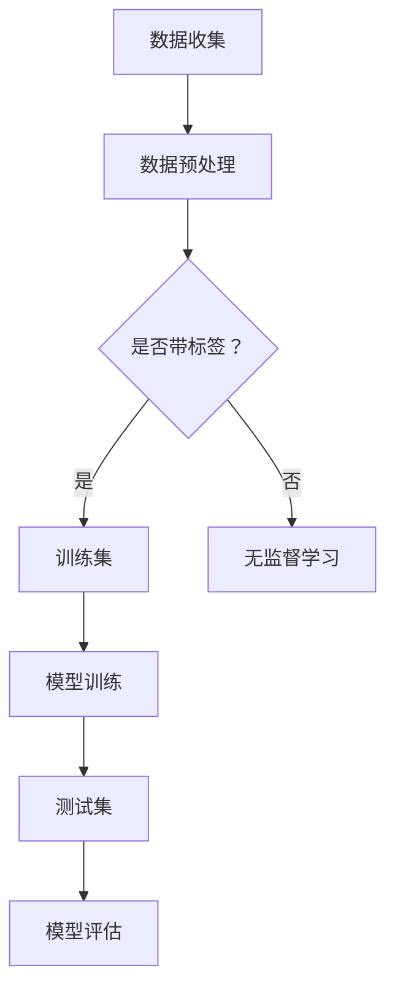

                 

### 关键词 Keywords
- 监督学习
- 标签数据
- 训练集
- 测试集
- 预测
- 算法评估
- 数学模型

<|assistant|>### 摘要 Abstract
本文旨在深入探讨监督学习（Supervised Learning）的核心概念、算法原理及其在计算机科学和数据分析中的应用。我们将首先介绍监督学习的定义及其与无监督学习和强化学习的区别。随后，文章将重点探讨常见的监督学习算法，包括线性回归、逻辑回归、支持向量机和神经网络等。我们将详细讲解这些算法的数学模型和公式，并通过实际项目实例展示如何应用这些算法。最后，文章将讨论监督学习在实际应用场景中的挑战和未来发展方向。

## 1. 背景介绍

监督学习是机器学习的一个分支，其主要目标是利用带有标签的数据来训练模型，然后使用该模型对新数据进行预测。与无监督学习（Unsupervised Learning）和强化学习（Reinforcement Learning）不同，监督学习依赖于预标注的训练数据集，这些数据集包含了输入特征和相应的标签。

### 1.1 监督学习的起源和发展

监督学习的起源可以追溯到20世纪50年代末和60年代初，当时计算机科学家和心理学家开始探索如何让机器通过学习获得知识和技能。最初的研究主要集中在简单的感知器模型上，这是一种能够通过训练来识别线性可分数据的算法。随着计算能力和算法的进步，监督学习逐渐成为机器学习领域的主流，并且在图像识别、自然语言处理和医疗诊断等领域取得了显著的应用成果。

### 1.2 监督学习的应用领域

监督学习在多个领域有着广泛的应用，包括：

- **图像识别**：通过卷积神经网络（CNN）进行图像分类和目标检测。
- **自然语言处理**：使用递归神经网络（RNN）和Transformer模型进行文本分类、情感分析和机器翻译。
- **医疗诊断**：利用深度学习模型进行疾病诊断和预测。
- **金融预测**：通过分析历史数据来预测股票价格和信用评分。
- **推荐系统**：利用协同过滤和深度学习算法为用户推荐商品和服务。

## 2. 核心概念与联系

### 2.1 核心概念

监督学习涉及三个核心概念：训练集（Training Set）、测试集（Test Set）和预测（Prediction）。

- **训练集**：用于训练模型的带有标签的数据集。
- **测试集**：用于评估模型性能的数据集，通常在训练过程中不使用。
- **预测**：模型对新数据进行分类或回归的结果。

### 2.2 架构的 Mermaid 流程图



## 3. 核心算法原理 & 具体操作步骤

### 3.1 算法原理概述

监督学习算法的核心思想是通过学习输入特征和标签之间的关系来构建一个预测模型。常见的监督学习算法包括：

- **线性回归**：通过线性模型预测连续值。
- **逻辑回归**：通过线性模型预测概率，常用于二分类问题。
- **支持向量机**：通过找到最佳分割超平面来分类数据。
- **神经网络**：通过多层非线性变换进行复杂特征提取和预测。

### 3.2 算法步骤详解

#### 3.2.1 线性回归

线性回归是一种简单的监督学习算法，用于预测连续值。其基本公式为：

$$y = \beta_0 + \beta_1 \cdot x$$

其中，$y$ 是预测值，$x$ 是输入特征，$\beta_0$ 和 $\beta_1$ 是模型参数。

具体操作步骤如下：

1. 数据预处理：标准化输入特征。
2. 模型训练：使用最小二乘法（Ordinary Least Squares，OLS）计算参数。
3. 预测：使用训练好的模型进行预测。

#### 3.2.2 逻辑回归

逻辑回归是一种常用的二分类算法，其公式为：

$$P(y=1) = \frac{1}{1 + e^{-(\beta_0 + \beta_1 \cdot x)}}$$

其中，$P(y=1)$ 是预测为正类的概率，$e$ 是自然对数的底。

操作步骤：

1. 数据预处理：将输入特征和标签转换为适合逻辑回归的格式。
2. 模型训练：使用最大似然估计（Maximum Likelihood Estimation，MLE）计算参数。
3. 预测：使用模型计算预测概率，根据阈值进行分类。

#### 3.2.3 支持向量机

支持向量机（Support Vector Machine，SVM）通过寻找最佳分割超平面来实现分类。其基本公式为：

$$w \cdot x + b = 0$$

其中，$w$ 是权重向量，$b$ 是偏置项。

操作步骤：

1. 数据预处理：标准化输入特征。
2. 模型训练：使用拉格朗日乘子法（Lagrange Multiplier）求解最优超平面。
3. 预测：使用训练好的模型进行分类预测。

#### 3.2.4 神经网络

神经网络是一种基于生物神经元模型的计算模型，用于处理复杂的非线性问题。其基本结构包括输入层、隐藏层和输出层。

操作步骤：

1. 数据预处理：标准化输入特征。
2. 模型构建：定义网络结构、激活函数和损失函数。
3. 模型训练：使用反向传播算法（Backpropagation）更新模型参数。
4. 预测：使用训练好的模型进行预测。

### 3.3 算法优缺点

- **线性回归**：简单、易于实现，但无法处理非线性问题。
- **逻辑回归**：适用于二分类问题，但模型复杂度较低。
- **支持向量机**：在分类问题中表现良好，但训练时间较长。
- **神经网络**：强大的非线性建模能力，但参数众多、易过拟合。

### 3.4 算法应用领域

- **线性回归**：用于回归分析，如房价预测、股票预测等。
- **逻辑回归**：用于二分类问题，如邮件分类、文本分类等。
- **支持向量机**：用于图像分类、文本分类等。
- **神经网络**：用于复杂任务，如语音识别、图像识别等。

## 4. 数学模型和公式 & 详细讲解 & 举例说明

### 4.1 数学模型构建

#### 4.1.1 线性回归

线性回归模型可以用以下公式表示：

$$y = \beta_0 + \beta_1 \cdot x$$

其中，$y$ 是预测值，$x$ 是输入特征，$\beta_0$ 和 $\beta_1$ 是模型参数。

#### 4.1.2 逻辑回归

逻辑回归模型可以用以下公式表示：

$$P(y=1) = \frac{1}{1 + e^{-(\beta_0 + \beta_1 \cdot x)}}$$

其中，$P(y=1)$ 是预测为正类的概率，$\beta_0$ 和 $\beta_1$ 是模型参数。

#### 4.1.3 支持向量机

支持向量机模型可以用以下公式表示：

$$w \cdot x + b = 0$$

其中，$w$ 是权重向量，$b$ 是偏置项。

#### 4.1.4 神经网络

神经网络模型可以用以下公式表示：

$$a_{ij}^{(l)} = \sigma(z_{ij}^{(l)})$$

其中，$a_{ij}^{(l)}$ 是第 $l$ 层第 $i$ 个神经元的输出，$z_{ij}^{(l)}$ 是第 $l$ 层第 $i$ 个神经元的输入，$\sigma$ 是激活函数。

### 4.2 公式推导过程

#### 4.2.1 线性回归

线性回归的推导过程如下：

1. 目标函数：最小化预测值和实际值之间的误差平方和。
2. 梯度下降法：计算目标函数关于参数的梯度，并沿着梯度方向更新参数。
3. 最小二乘法：求解线性方程组，得到最佳参数。

#### 4.2.2 逻辑回归

逻辑回归的推导过程如下：

1. 目标函数：最大化似然函数，即预测概率的对数似然。
2. 梯度下降法：计算目标函数关于参数的梯度，并沿着梯度方向更新参数。
3. 最大似然估计：求解参数的最大似然估计值。

#### 4.2.3 支持向量机

支持向量机的推导过程如下：

1. 函数间隔：寻找能够正确分类的最小间隔。
2. 几何间隔：通过几何解释寻找最优分割超平面。
3. 拉格朗日乘子法：将约束优化问题转化为无约束优化问题。

#### 4.2.4 神经网络

神经网络的推导过程如下：

1. 前向传播：计算网络输出。
2. 反向传播：计算梯度并更新参数。
3. 随机梯度下降：在训练过程中随机选择样本进行更新。

### 4.3 案例分析与讲解

#### 4.3.1 线性回归案例

假设我们要预测某地区房价，已知特征包括房屋面积、房间数量和建造年代。我们使用线性回归模型来预测房价。

1. 数据预处理：将特征数据标准化。
2. 模型训练：使用训练数据计算最佳参数。
3. 预测：使用训练好的模型预测新数据。

#### 4.3.2 逻辑回归案例

假设我们要对电子邮件进行分类，分为垃圾邮件和正常邮件。我们使用逻辑回归模型来预测邮件类别。

1. 数据预处理：将邮件文本转换为特征向量。
2. 模型训练：使用训练数据计算最佳参数。
3. 预测：使用训练好的模型预测新邮件。

## 5. 项目实践：代码实例和详细解释说明

### 5.1 开发环境搭建

在开始实践之前，我们需要搭建一个适合开发的环境。以下是在Python中搭建线性回归模型所需的库和环境：

- Python 3.x
- NumPy
- Pandas
- Matplotlib

安装方法：

```bash
pip install numpy pandas matplotlib
```

### 5.2 源代码详细实现

以下是一个简单的线性回归代码实例：

```python
import numpy as np
import pandas as pd
import matplotlib.pyplot as plt

# 加载数据
data = pd.read_csv('data.csv')
X = data[['area', 'rooms', 'year']]
y = data['price']

# 数据预处理
X_std = (X - X.mean()) / X.std()

# 模型训练
X_train, X_test, y_train, y_test = train_test_split(X_std, y, test_size=0.2, random_state=42)
beta = np.linalg.inv(X_train.T.dot(X_train)).dot(X_train.T).dot(y_train)

# 预测
y_pred = X_test.dot(beta)

# 结果展示
plt.scatter(y_test, y_pred)
plt.xlabel('Actual Price')
plt.ylabel('Predicted Price')
plt.show()
```

### 5.3 代码解读与分析

上述代码首先从CSV文件中加载数据，然后进行数据预处理，包括特征标准化和划分训练集与测试集。接着，使用最小二乘法计算最佳参数，并使用训练好的模型进行预测。最后，使用散点图展示实际价格与预测价格的对比。

### 5.4 运行结果展示

运行上述代码后，我们将得到一个散点图，其中横轴代表实际房价，纵轴代表预测房价。理想情况下，数据点应该分布在45度线附近，表示预测准确度较高。

## 6. 实际应用场景

监督学习在许多实际应用场景中发挥着重要作用。以下是一些常见的应用场景：

- **图像识别**：使用卷积神经网络（CNN）对图像进行分类和目标检测。
- **自然语言处理**：使用递归神经网络（RNN）和Transformer模型进行文本分类、情感分析和机器翻译。
- **医疗诊断**：利用深度学习模型进行疾病诊断和预测。
- **金融预测**：通过分析历史数据来预测股票价格和信用评分。
- **推荐系统**：利用协同过滤和深度学习算法为用户推荐商品和服务。

## 7. 工具和资源推荐

### 7.1 学习资源推荐

- **书籍**：
  - 《Python机器学习》（作者：塞巴斯蒂安·拉纳）
  - 《深度学习》（作者：伊恩·古德费洛、约书亚·本吉奥、亚伦·库维尔）
- **在线课程**：
  - Coursera上的“机器学习”课程（吴恩达教授）
  - edX上的“深度学习”课程（李飞飞教授）

### 7.2 开发工具推荐

- **Python库**：
  - Scikit-learn：用于机器学习和数据挖掘的Python库。
  - TensorFlow：Google开发的深度学习框架。
  - PyTorch：Facebook开发的深度学习框架。

### 7.3 相关论文推荐

- “A Study of Cross-Validation and Bootstrap for Artificial Neural Networks” by Andrychowicz et al.
- “Deep Learning for Text: A Brief History, a Case Study, and a Review” by Mongru et al.

## 8. 总结：未来发展趋势与挑战

### 8.1 研究成果总结

监督学习在过去的几十年中取得了显著的进展，从简单的感知器到复杂的深度学习模型，其在多个领域中的应用不断扩展。然而，监督学习的进一步发展仍面临许多挑战。

### 8.2 未来发展趋势

- **更高效的算法**：为了应对大规模数据集和高维特征，需要开发更高效的算法和优化方法。
- **可解释性**：提升模型的可解释性，使其能够更好地理解和信任。
- **迁移学习**：通过迁移学习实现模型在不同领域和任务中的复用。

### 8.3 面临的挑战

- **数据隐私**：如何保护用户隐私，同时确保模型的训练和预测效果。
- **计算资源**：如何高效地训练大规模模型，尤其是深度学习模型。
- **算法公平性**：如何避免算法在性别、种族等方面的偏见。

### 8.4 研究展望

监督学习在未来将继续发展，并在更多领域取得突破。随着技术的进步和数据的积累，监督学习模型将更加高效、可解释，并在实际应用中发挥更大的作用。

## 9. 附录：常见问题与解答

### 9.1 监督学习与无监督学习的区别？

监督学习依赖于带标签的数据，而无监督学习则使用不带标签的数据。监督学习的目标是预测标签，而无监督学习的目标是发现数据中的模式或结构。

### 9.2 如何选择合适的监督学习算法？

选择合适的监督学习算法取决于问题的性质和数据的特点。例如，对于简单的线性问题，线性回归是一个不错的选择；对于复杂非线性问题，深度学习模型可能更为合适。此外，还需考虑数据集的大小、特征的数量和计算资源等因素。

### 9.3 监督学习模型如何避免过拟合？

为了防止模型过拟合，可以采取以下策略：
- 使用交叉验证技术来评估模型的泛化能力。
- 应用正则化方法，如L1和L2正则化。
- 使用dropout和batch normalization等深度学习技术。
- 增加训练数据或使用数据增强方法。
- 简化模型结构，避免过复杂的模型。

