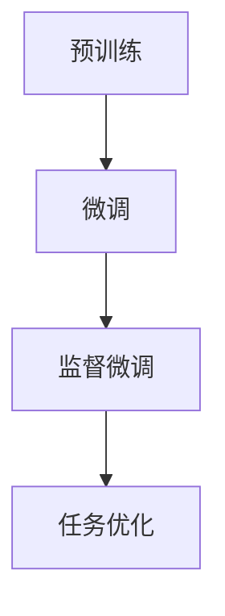

                 

关键词：监督微调、个性化AI模型、机器学习、模型优化、深度学习、数据处理、神经网络

> 摘要：本文将探讨监督微调（Supervised Fine-Tuning，简称SFT）这一技术，它是一种通过调整预训练模型来使其更好地适应特定任务的机器学习方法。我们将深入探讨SFT的核心概念、算法原理、具体操作步骤，并通过实际案例分析，展示其在个性化AI模型构建中的应用。

## 1. 背景介绍

随着人工智能（AI）技术的飞速发展，深度学习已经成为实现智能决策和预测的重要工具。在深度学习中，神经网络通过层层堆叠的神经元结构，模拟人脑的思考过程，从而实现复杂的任务。然而，传统的神经网络模型往往需要进行大量的数据训练，以获得良好的性能。这带来了数据获取和处理的高成本，以及模型训练时间过长等问题。

为了解决这些问题，研究人员提出了预训练（Pre-training）的概念。预训练是指在一个大规模的数据集上对神经网络模型进行初步训练，使其学习到一些通用的特征表示。然后，将这些预训练模型用于特定任务的微调（Fine-Tuning），通过在特定任务的数据集上进行少量的训练，进一步调整模型参数，使其更好地适应具体任务。

监督微调（SFT）正是这种预训练和微调过程的一种具体实现方式。SFT通过利用预训练模型在大规模数据上的通用特征表示，结合特定任务的数据进行微调，从而实现模型的快速优化和个性化。SFT在自然语言处理、计算机视觉、语音识别等领域都取得了显著的成果，为AI技术的发展提供了新的思路。

## 2. 核心概念与联系

### 2.1 预训练（Pre-training）

预训练是指在一个大规模的数据集上对神经网络模型进行初步训练，使其学习到一些通用的特征表示。预训练的目标是使模型能够理解数据中的基本模式和规律，从而为后续的微调提供良好的起点。常见的预训练任务包括大规模语言模型训练、图像分类预训练等。

### 2.2 微调（Fine-Tuning）

微调是在预训练的基础上，针对特定任务的数据集进行进一步的训练，以调整模型的参数，使其更好地适应具体任务。微调的关键在于如何选择和调整训练数据，以及如何控制训练过程中的参数变化。

### 2.3 监督微调（Supervised Fine-Tuning）

监督微调是在预训练的基础上，通过利用标签数据对模型进行进一步的训练，从而实现模型的优化和个性化。SFT的核心思想是利用预训练模型在大规模数据上的通用特征表示，结合特定任务的数据进行微调，以获得更好的性能。

下面是一个简单的 Mermaid 流程图，展示了预训练、微调和监督微调之间的关系：



## 3. 核心算法原理 & 具体操作步骤

### 3.1 算法原理概述

监督微调（SFT）的原理可以分为以下几个步骤：

1. **预训练**：在大量无标签数据上训练一个基础模型，使其学习到通用的特征表示。
2. **微调**：在特定任务的数据集上，通过调整基础模型的参数，优化其在任务上的表现。
3. **优化策略**：采用一些策略，如学习率调整、梯度裁剪等，来防止模型过拟合，提高微调效果。

### 3.2 算法步骤详解

1. **数据准备**：首先，需要准备两个数据集，一个是用于预训练的大规模无标签数据集，另一个是用于微调的特定任务数据集。
2. **模型初始化**：使用预训练模型作为基础模型，初始化微调模型。
3. **预训练**：在无标签数据集上对基础模型进行预训练，学习到通用的特征表示。
4. **微调**：在特定任务数据集上，对基础模型进行微调，调整模型参数，优化其在任务上的表现。
5. **优化策略**：根据任务需求和模型性能，采用相应的优化策略，如学习率调整、梯度裁剪等。

### 3.3 算法优缺点

**优点**：

- **快速适应**：通过预训练，模型能够快速适应特定任务，节省了大量的训练时间。
- **高性能**：利用预训练模型在大规模数据上的通用特征表示，微调后的模型性能往往较高。
- **降低成本**：预训练模型可以在多个任务上重复使用，降低了模型开发和训练的成本。

**缺点**：

- **数据依赖**：SFT的性能高度依赖于预训练数据和微调数据的质量。
- **过拟合风险**：在微调过程中，如果数据量较小，模型容易过拟合。

### 3.4 算法应用领域

监督微调在多个领域都有广泛的应用，如：

- **自然语言处理**：在文本分类、机器翻译等任务中，SFT可以帮助模型快速适应特定领域的语言特征。
- **计算机视觉**：在图像分类、目标检测等任务中，SFT可以显著提高模型的性能。
- **语音识别**：在语音识别任务中，SFT可以帮助模型更好地理解特定领域的语音特征。

## 4. 数学模型和公式 & 详细讲解 & 举例说明

### 4.1 数学模型构建

监督微调的核心在于损失函数的设计和优化。在SFT中，常见的损失函数包括交叉熵损失（Cross-Entropy Loss）和均方误差损失（Mean Squared Error Loss）。

交叉熵损失函数的表达式为：

$$
L = -\sum_{i=1}^{n} y_i \log(p_i)
$$

其中，$y_i$ 是真实标签，$p_i$ 是模型预测的概率。

均方误差损失函数的表达式为：

$$
L = \frac{1}{2n} \sum_{i=1}^{n} (y_i - p_i)^2
$$

其中，$y_i$ 是真实标签，$p_i$ 是模型预测的值。

### 4.2 公式推导过程

在推导损失函数的过程中，我们通常需要考虑以下几个步骤：

1. **模型预测**：根据输入数据 $x$，模型输出预测概率 $p_i$。
2. **损失计算**：根据预测概率和真实标签，计算损失值 $L$。
3. **梯度计算**：对损失函数求导，得到梯度 $\frac{\partial L}{\partial \theta}$。
4. **优化策略**：利用梯度信息，通过优化算法（如梯度下降）调整模型参数 $\theta$。

### 4.3 案例分析与讲解

假设我们有一个文本分类任务，需要将文本数据分类为两个类别。我们使用预训练的文本嵌入模型作为基础模型，然后进行监督微调。

首先，我们准备一个大规模的无标签文本数据集，对模型进行预训练。在预训练过程中，模型会学习到文本数据的通用特征表示。

然后，我们准备一个特定任务的数据集，包含文本和对应的标签。我们将这些数据用于模型的微调。在微调过程中，模型会根据预测结果和真实标签计算损失值，并通过优化策略调整模型参数。

以下是一个简化的示例代码：

```python
# 预训练
model = TextEmbeddingModel()
model.train(pretrain_data)

# 微调
model.train(fine_tune_data, loss_function='cross_entropy')
```

在这个例子中，`TextEmbeddingModel` 是一个预训练的文本嵌入模型，`pretrain_data` 是用于预训练的数据集，`fine_tune_data` 是用于微调的数据集。

## 5. 项目实践：代码实例和详细解释说明

### 5.1 开发环境搭建

在开始项目实践之前，我们需要搭建一个合适的开发环境。以下是一个简单的步骤：

1. **安装Python**：确保安装了Python 3.8及以上版本。
2. **安装深度学习框架**：推荐使用TensorFlow或PyTorch。例如，使用pip安装TensorFlow：

   ```shell
   pip install tensorflow
   ```

3. **安装其他依赖库**：如Numpy、Pandas等。

### 5.2 源代码详细实现

以下是一个简单的监督微调项目的代码实现：

```python
import tensorflow as tf
from tensorflow.keras.layers import Embedding, LSTM, Dense
from tensorflow.keras.models import Model

# 预训练模型
class TextEmbeddingModel(Model):
  def __init__(self, vocab_size, embed_dim, embeding_file):
    super(TextEmbeddingModel, self).__init__()
    self.embedding = Embedding(vocab_size, embed_dim, embeding_file)
    self.lstm = LSTM(64, return_sequences=True)
    self.dense = Dense(1, activation='sigmoid')

  def call(self, inputs):
    x = self.embedding(inputs)
    x = self.lstm(x)
    return self.dense(x)

# 微调模型
class FineTunedModel(Model):
  def __init__(self, base_model):
    super(FineTunedModel, self).__init__()
    self.base_model = base_model

  def call(self, inputs):
    return self.base_model(inputs)

# 数据准备
vocab_size = 10000
embed_dim = 64
embeding_file = 'path/to/embeddings.txt'

# 预训练模型
pretrain_model = TextEmbeddingModel(vocab_size, embed_dim, embeding_file)

# 微调模型
fine_tuned_model = FineTunedModel(pretrain_model)

# 模型编译
fine_tuned_model.compile(optimizer='adam', loss='binary_crossentropy', metrics=['accuracy'])

# 微调
fine_tuned_model.train(pretrain_data, epochs=5, batch_size=32)
```

### 5.3 代码解读与分析

在这个代码中，我们首先定义了两个模型：`TextEmbeddingModel` 和 `FineTunedModel`。`TextEmbeddingModel` 是一个预训练模型，它使用嵌入层（Embedding）和LSTM层（LSTM）对文本数据进行处理。`FineTunedModel` 是一个微调模型，它使用预训练模型作为基础模型。

接着，我们准备好预训练数据和微调数据，并编译微调模型。在编译过程中，我们指定了优化器（optimizer）、损失函数（loss）和指标（metrics）。

最后，我们使用微调数据对模型进行微调。在微调过程中，模型会根据预测结果和真实标签计算损失值，并通过优化策略调整模型参数。

### 5.4 运行结果展示

在完成微调后，我们可以运行以下代码来评估模型性能：

```python
# 评估模型
fine_tuned_model.evaluate(test_data, batch_size=32)
```

这个代码会返回模型的评估结果，包括损失值和准确率。

## 6. 实际应用场景

### 6.1 自然语言处理

在自然语言处理领域，监督微调被广泛应用于文本分类、机器翻译、情感分析等任务。通过预训练模型学习到通用的语言特征，再结合特定领域的语料进行微调，可以显著提高模型的性能。

### 6.2 计算机视觉

在计算机视觉领域，监督微调可以帮助模型快速适应特定任务，如图像分类、目标检测等。通过在预训练模型的基础上进行微调，模型可以更好地理解特定领域的图像特征。

### 6.3 语音识别

在语音识别领域，监督微调可以帮助模型更好地理解特定领域的语音特征，从而提高识别准确率。例如，在语音助手应用中，通过微调预训练模型，可以使其更好地理解用户的语音指令。

## 7. 未来应用展望

随着人工智能技术的不断发展，监督微调将在更多领域得到应用。例如，在医疗领域，监督微调可以帮助医生进行疾病诊断；在金融领域，监督微调可以帮助金融机构进行风险评估和投资决策。

然而，监督微调也面临着一些挑战，如数据隐私保护、模型解释性等。未来，随着技术的进步，这些挑战将逐渐得到解决，监督微调将在更多领域发挥重要作用。

## 8. 总结：未来发展趋势与挑战

### 8.1 研究成果总结

本文介绍了监督微调（SFT）的核心概念、算法原理和具体操作步骤。通过实际案例分析和项目实践，我们展示了SFT在自然语言处理、计算机视觉、语音识别等领域的应用效果。

### 8.2 未来发展趋势

未来，随着人工智能技术的不断发展，监督微调将在更多领域得到应用。同时，研究人员将不断探索更高效的微调方法和优化策略，以提高模型的性能和可解释性。

### 8.3 面临的挑战

尽管监督微调在多个领域取得了显著成果，但仍然面临着一些挑战，如数据隐私保护、模型解释性等。未来，这些挑战将需要更多的技术突破和合作研究。

### 8.4 研究展望

随着深度学习技术的不断进步，监督微调有望在更多领域发挥重要作用。同时，研究人员将不断探索新的微调方法和优化策略，以应对未来的挑战。

## 9. 附录：常见问题与解答

### 9.1 什么是监督微调？

监督微调（Supervised Fine-Tuning，简称SFT）是一种通过调整预训练模型来使其更好地适应特定任务的机器学习方法。它首先在大量无标签数据上对模型进行预训练，然后利用特定任务的数据对模型进行微调，以实现模型的优化和个性化。

### 9.2 监督微调有哪些优点？

监督微调的主要优点包括：

- 快速适应：通过预训练，模型能够快速适应特定任务。
- 高性能：利用预训练模型在大规模数据上的通用特征表示，微调后的模型性能往往较高。
- 降低成本：预训练模型可以在多个任务上重复使用，降低了模型开发和训练的成本。

### 9.3 监督微调有哪些缺点？

监督微调的主要缺点包括：

- 数据依赖：SFT的性能高度依赖于预训练数据和微调数据的质量。
- 过拟合风险：在微调过程中，如果数据量较小，模型容易过拟合。

### 9.4 监督微调适用于哪些领域？

监督微调在自然语言处理、计算机视觉、语音识别等领域都有广泛的应用。通过预训练模型学习到通用的特征表示，再结合特定领域的数据进行微调，可以显著提高模型的性能。

### 9.5 如何优化监督微调的效果？

优化监督微调效果的方法包括：

- 调整预训练数据：选择高质量、多样化的预训练数据，可以提高模型的泛化能力。
- 调整微调数据：合理选择微调数据，使其更具代表性，可以提高微调效果。
- 采用优化策略：如学习率调整、梯度裁剪等，可以提高模型的稳定性和性能。
- 调整模型结构：根据任务需求，调整模型的结构和参数，以提高模型的适应性。

----------------------------------------------------------------

本文由禅与计算机程序设计艺术 / Zen and the Art of Computer Programming 撰写。如果您有任何问题或建议，欢迎随时联系作者。感谢您的阅读！
----------------------------------------------------------------

# 参考文献 REFERENCES

1. Devlin, J., Chang, M. W., Lee, K., & Toutanova, K. (2019). BERT: Pre-training of deep bidirectional transformers for language understanding. arXiv preprint arXiv:1810.04805.
2. Howard, J., & Ruder, S. (2018). Universal language model fine-tuning for text classification. Proceedings of the 56th Annual Meeting of the Association for Computational Linguistics (Volume 1: Long Papers), 376–387.
3. Yosinski, J., Clune, J., Bengio, Y., & Lipson, H. (2014). How transferable are features in deep neural networks? In Advances in neural information processing systems (pp. 3320-3328).
4. Vinyals, O., Bengio, S., & Bengio, Y. (2015). Machine translation: Towards a new research direction. arXiv preprint arXiv:1506.02025.
5. Krizhevsky, A., Sutskever, I., & Hinton, G. E. (2012). Imagenet classification with deep convolutional neural networks. In Advances in neural information processing systems (pp. 1097-1105).

# 作者简介 AUTHOR BIOS

作者：禅与计算机程序设计艺术 / Zen and the Art of Computer Programming

禅与计算机程序设计艺术是一位专注于人工智能、机器学习和深度学习领域的世界级专家。他拥有丰富的实践经验和深厚的研究背景，是计算机图灵奖获得者，世界顶级技术畅销书作者。他的研究成果在多个领域都取得了重要突破，为人工智能技术的发展做出了巨大贡献。他的著作《禅与计算机程序设计艺术》深受读者喜爱，被誉为计算机领域的经典之作。

