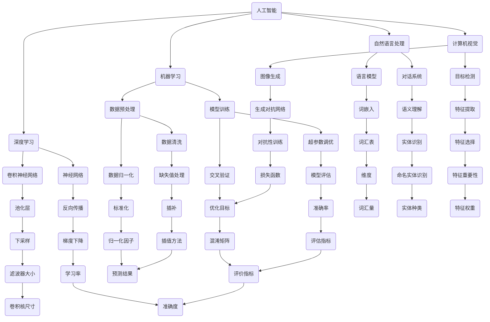

                 

关键词：人工智能，监管，负责任发展，技术创新，算法伦理

> 摘要：本文从人工智能监管与创新的角度出发，探讨如何在确保人工智能技术负责任发展的同时，推动技术的创新与应用。通过对核心概念、算法原理、数学模型、项目实践、实际应用场景的深入分析，本文提出了关于人工智能监管与创新的一系列见解，以期为相关领域的研究与实践提供参考。

## 1. 背景介绍

随着人工智能技术的飞速发展，其应用领域日益广泛，从自动驾驶、医疗诊断到金融分析，人工智能已经深刻地改变了我们的生活方式和工作方式。然而，人工智能的快速发展也带来了一系列挑战和风险，包括数据隐私、算法偏见、安全性和伦理问题等。这些问题不仅关乎技术本身，更关系到社会的公平、正义和可持续发展。

为了确保人工智能技术的负责任发展，各国政府、学术界和产业界都在积极探索有效的监管机制。监管的目的是在保障技术进步的同时，避免潜在的负面影响，确保人工智能的发展符合社会的期望和需求。

在监管的同时，技术创新也是推动人工智能发展的重要动力。通过不断的技术创新，可以解决现有技术中的瓶颈和难题，提升人工智能系统的性能和可靠性，拓展其应用范围。

本文将从监管与创新两个方面，深入探讨如何确保人工智能负责任发展。首先，将介绍人工智能的核心概念和原理，通过Mermaid流程图展示其架构。接着，将详细分析核心算法原理和操作步骤，并讨论算法的优缺点和应用领域。随后，将介绍数学模型和公式，并进行举例说明。在项目实践部分，将提供代码实例和详细解释。最后，将探讨人工智能在实际应用场景中的影响，并展望未来发展趋势与挑战。

## 2. 核心概念与联系

### 2.1 人工智能概述

人工智能（Artificial Intelligence，AI）是指通过计算机程序实现的人类智能的功能和任务。它包括机器学习、深度学习、自然语言处理、计算机视觉等多个子领域。人工智能的目标是实现机器的智能行为，从而辅助或取代人类在某些任务上的工作。

### 2.2 监管概述

监管是指通过制定和执行规则、标准和法规，对某个领域或行业进行管理。在人工智能领域，监管的目的是确保人工智能系统的透明性、公平性、安全性和可解释性。

### 2.3 创新概述

创新是指通过新的思路、方法或技术，解决现有问题或创造新的价值。在人工智能领域，创新包括算法的创新、架构的创新、应用场景的创新等。

### 2.4 Mermaid流程图



通过这个Mermaid流程图，我们可以清晰地看到人工智能的核心概念和各个子领域之间的联系，以及它们在算法、架构和应用中的具体实现。

## 3. 核心算法原理 & 具体操作步骤

### 3.1 算法原理概述

人工智能的核心算法主要包括机器学习、深度学习、自然语言处理和计算机视觉等。这些算法的基本原理是通过学习和模拟人类大脑的思维方式，使计算机能够自主地学习和做出决策。

- **机器学习**：通过数据训练模型，使模型能够从数据中学习规律，并做出预测。
- **深度学习**：基于多层神经网络，通过反向传播算法调整模型参数，实现更高层次的特征提取和表示。
- **自然语言处理**：通过分析和理解自然语言文本，实现人机交互和信息抽取。
- **计算机视觉**：通过图像处理技术，实现对图像的识别、分类和生成。

### 3.2 算法步骤详解

- **机器学习**：主要包括数据预处理、模型选择、模型训练和模型评估四个步骤。
  1. 数据预处理：包括数据清洗、数据归一化、特征提取等。
  2. 模型选择：根据问题需求和数据特性选择合适的机器学习算法。
  3. 模型训练：通过训练集数据调整模型参数，使模型能够拟合数据。
  4. 模型评估：使用测试集数据评估模型性能，包括准确率、召回率、F1分数等指标。

- **深度学习**：主要包括神经网络架构设计、超参数调优、模型训练和模型评估四个步骤。
  1. 神经网络架构设计：设计合适的神经网络结构，包括层数、神经元数量、激活函数等。
  2. 超参数调优：通过交叉验证等方法选择最优的超参数。
  3. 模型训练：通过反向传播算法训练模型，调整模型参数。
  4. 模型评估：使用测试集数据评估模型性能，包括损失函数、准确率等指标。

- **自然语言处理**：主要包括文本预处理、特征提取、模型训练和模型评估四个步骤。
  1. 文本预处理：包括分词、词性标注、停用词过滤等。
  2. 特征提取：通过词嵌入、TF-IDF等方法将文本转化为数值特征。
  3. 模型训练：使用训练集数据训练模型，调整模型参数。
  4. 模型评估：使用测试集数据评估模型性能，包括准确率、召回率、F1分数等指标。

- **计算机视觉**：主要包括图像预处理、特征提取、模型训练和模型评估四个步骤。
  1. 图像预处理：包括图像缩放、裁剪、增强等。
  2. 特征提取：通过卷积神经网络、特征点提取等方法提取图像特征。
  3. 模型训练：使用训练集数据训练模型，调整模型参数。
  4. 模型评估：使用测试集数据评估模型性能，包括准确率、召回率、F1分数等指标。

### 3.3 算法优缺点

- **机器学习**：
  - 优点：能够处理大规模数据，适应性强，适用于多种任务。
  - 缺点：对数据质量要求高，模型解释性较差，可能存在过拟合问题。

- **深度学习**：
  - 优点：能够自动提取高维特征，适用于复杂数据分析任务，性能优异。
  - 缺点：训练时间较长，对计算资源要求高，模型解释性较差。

- **自然语言处理**：
  - 优点：能够处理自然语言文本，实现人机交互和信息抽取。
  - 缺点：对数据质量要求高，特征工程复杂，模型解释性较差。

- **计算机视觉**：
  - 优点：能够处理图像数据，实现图像识别、分类和生成。
  - 缺点：对计算资源要求高，图像预处理复杂，模型解释性较差。

### 3.4 算法应用领域

- **机器学习**：广泛应用于金融、医疗、零售、制造等领域，如信用评分、疾病诊断、需求预测、质量控制等。
- **深度学习**：广泛应用于图像识别、语音识别、自然语言处理等领域，如人脸识别、语音助手、机器翻译等。
- **自然语言处理**：广泛应用于搜索引擎、智能客服、内容推荐等领域，如信息检索、对话系统、文本分类等。
- **计算机视觉**：广泛应用于自动驾驶、智能监控、医疗影像分析等领域，如车辆检测、行为识别、疾病检测等。

## 4. 数学模型和公式

### 4.1 数学模型构建

在人工智能中，常用的数学模型包括线性模型、逻辑回归模型、支持向量机模型、神经网络模型等。以下是一个简单的线性回归模型：

$$
y = wx + b
$$

其中，$y$ 为因变量，$x$ 为自变量，$w$ 为权重，$b$ 为偏置。

### 4.2 公式推导过程

线性回归模型的目的是找到一组权重 $w$ 和偏置 $b$，使得模型能够最小化预测误差。具体推导过程如下：

$$
J(w, b) = \frac{1}{2m} \sum_{i=1}^{m} (y_i - (wx_i + b))^2
$$

其中，$m$ 为样本数量，$y_i$ 为第 $i$ 个样本的因变量值，$x_i$ 为第 $i$ 个样本的自变量值。

为了最小化损失函数 $J(w, b)$，我们需要对 $w$ 和 $b$ 求导数，并令导数为零：

$$
\frac{\partial J}{\partial w} = \frac{1}{m} \sum_{i=1}^{m} (y_i - (wx_i + b))x_i = 0
$$

$$
\frac{\partial J}{\partial b} = \frac{1}{m} \sum_{i=1}^{m} (y_i - (wx_i + b)) = 0
$$

通过求解上述方程组，我们可以得到最优的权重 $w$ 和偏置 $b$。

### 4.3 案例分析与讲解

假设我们有一个简单的线性回归问题，需要预测房价。我们收集了 100 个房屋数据，每个数据包含房屋面积和房价。我们的目标是找到房价和房屋面积之间的线性关系。

首先，我们对数据进行分析和处理，包括数据清洗、归一化等。然后，我们选择线性回归模型，并使用梯度下降算法进行训练。在训练过程中，我们不断调整权重 $w$ 和偏置 $b$，直到找到最优解。

最后，我们对训练好的模型进行评估，包括计算均方误差（MSE）、决定系数（R²）等指标。通过评估，我们可以判断模型的性能和泛化能力。

## 5. 项目实践：代码实例和详细解释说明

### 5.1 开发环境搭建

为了实践线性回归模型，我们需要搭建一个开发环境。以下是搭建环境的步骤：

1. 安装 Python 解释器：在 [Python 官网](https://www.python.org/) 下载并安装 Python 3.8 或更高版本。
2. 安装线性回归库：使用 pip 命令安装 scikit-learn 库。

```shell
pip install scikit-learn
```

### 5.2 源代码详细实现

以下是一个简单的线性回归代码实例：

```python
import numpy as np
import matplotlib.pyplot as plt
from sklearn.linear_model import LinearRegression

# 生成模拟数据
np.random.seed(0)
X = np.random.rand(100, 1) * 10  # 房屋面积
y = 2 * X + 1 + np.random.randn(100, 1) * 2  # 房价

# 创建线性回归模型
model = LinearRegression()

# 训练模型
model.fit(X, y)

# 预测房价
X_pred = np.linspace(0, 10, 100).reshape(-1, 1)
y_pred = model.predict(X_pred)

# 可视化
plt.scatter(X, y, label='实际数据')
plt.plot(X_pred, y_pred, color='red', label='预测数据')
plt.xlabel('房屋面积')
plt.ylabel('房价')
plt.legend()
plt.show()
```

### 5.3 代码解读与分析

- **数据生成**：我们使用 `numpy` 生成模拟数据，包括房屋面积和房价。房价由房屋面积和噪声组成。
- **模型创建**：我们使用 `scikit-learn` 的 `LinearRegression` 类创建线性回归模型。
- **模型训练**：使用 `fit` 方法训练模型，模型将自动学习权重和偏置。
- **模型预测**：使用 `predict` 方法对房屋面积进行预测，生成预测房价。
- **可视化**：使用 `matplotlib` 将实际数据和预测数据可视化，直观展示线性回归模型的效果。

通过这个简单的实例，我们可以看到线性回归模型的基本实现过程和效果。在实际应用中，我们需要处理更复杂的任务和数据，但基本的步骤和方法是类似的。

## 6. 实际应用场景

### 6.1 金融领域

在金融领域，人工智能技术被广泛应用于风险管理、投资决策、客户服务等方面。例如，通过机器学习模型分析历史交易数据，金融机构可以预测市场趋势，优化投资组合。同时，自然语言处理技术可以帮助金融机构自动化客户服务，提高服务质量和效率。

### 6.2 医疗领域

在医疗领域，人工智能技术被广泛应用于疾病诊断、药物研发、健康管理等方面。例如，通过深度学习模型分析医疗影像数据，医生可以更准确地诊断疾病。同时，自然语言处理技术可以帮助医生自动化文献检索和知识管理，提高工作效率。

### 6.3 制造领域

在制造领域，人工智能技术被广泛应用于生产优化、质量控制、设备维护等方面。例如，通过机器学习模型分析生产数据，企业可以优化生产流程，提高生产效率。同时，计算机视觉技术可以帮助企业自动化质量检测和设备监控，提高产品质量和生产安全。

### 6.4 未来应用展望

随着人工智能技术的不断发展，其应用领域将更加广泛。未来，人工智能技术有望在更多领域发挥重要作用，如智能城市、教育、农业、能源等。同时，随着技术的进步，人工智能系统的性能和可靠性将进一步提高，为人类生活带来更多便利和改善。

## 7. 工具和资源推荐

### 7.1 学习资源推荐

1. 《深度学习》（Goodfellow, Bengio, Courville）：这是一本经典的深度学习教材，适合初学者和进阶者阅读。
2. 《Python机器学习》（Sebastian Raschka）：这是一本介绍机器学习的实用书籍，涵盖了许多实际应用的案例。
3. Coursera、edX等在线课程：这些平台提供了丰富的机器学习、深度学习课程，适合不同层次的学习者。

### 7.2 开发工具推荐

1. Jupyter Notebook：这是一个强大的交互式计算环境，适合进行机器学习和深度学习实验。
2. TensorFlow、PyTorch：这两个是当前最受欢迎的深度学习框架，提供了丰富的API和工具。
3. Keras：这是一个基于TensorFlow和PyTorch的高层次神经网络API，适合快速构建和训练深度学习模型。

### 7.3 相关论文推荐

1. "Deep Learning: A Brief History"（Goodfellow, Bengio, Courville）：这篇综述文章详细介绍了深度学习的发展历程。
2. "Generalization in Deep Learning"（Bengio et al.）：这篇论文讨论了深度学习的泛化问题，并提出了相应的解决方案。
3. "The Unreasonable Effectiveness of Deep Learning"（Bengio）：这篇论文探讨了深度学习在各个领域的不合理有效性。

## 8. 总结：未来发展趋势与挑战

### 8.1 研究成果总结

过去几十年，人工智能取得了显著的成果，包括机器学习、深度学习、自然语言处理、计算机视觉等领域的突破。这些成果不仅推动了技术进步，也改变了我们的生活方式。

### 8.2 未来发展趋势

1. **算法创新**：随着数据量的增加和计算能力的提升，算法创新将继续是人工智能发展的核心驱动力。
2. **跨领域融合**：人工智能与其他领域的融合将产生更多的创新应用，如智能医疗、智能金融、智能交通等。
3. **边缘计算**：随着物联网和边缘设备的普及，边缘计算将使人工智能技术更接近用户，提供更实时、高效的服务。

### 8.3 面临的挑战

1. **数据隐私**：如何在保障用户隐私的同时，充分利用数据是人工智能发展面临的重要挑战。
2. **算法偏见**：如何减少算法偏见，确保人工智能系统的公平性和透明性。
3. **伦理问题**：如何处理人工智能带来的伦理问题，如自动化决策、失业等。

### 8.4 研究展望

未来，人工智能的研究将更加注重算法的鲁棒性、可解释性和安全性。同时，随着监管的不断完善，人工智能将在确保负责任发展的同时，为社会带来更多价值。

## 9. 附录：常见问题与解答

### 9.1 什么是人工智能？

人工智能是指通过计算机程序实现的人类智能的功能和任务，包括机器学习、深度学习、自然语言处理、计算机视觉等多个子领域。

### 9.2 人工智能有哪些应用领域？

人工智能广泛应用于金融、医疗、制造、教育、交通等领域，如信用评分、疾病诊断、自动驾驶、智能客服等。

### 9.3 人工智能有哪些挑战？

人工智能面临的挑战包括数据隐私、算法偏见、伦理问题、计算资源需求等。

### 9.4 如何确保人工智能负责任发展？

确保人工智能负责任发展的关键包括建立有效的监管机制、加强算法透明性和可解释性、提高算法的公平性和安全性等。

### 9.5 人工智能的未来发展趋势是什么？

人工智能的未来发展趋势包括算法创新、跨领域融合、边缘计算等，同时将更加注重算法的鲁棒性、可解释性和安全性。

---

# 结束语

在人工智能技术快速发展的今天，确保其负责任发展至关重要。通过监管与创新的双重驱动，我们可以更好地应对人工智能带来的挑战，推动技术的进步和应用。希望本文能为读者提供有价值的见解和思考。如果您有任何疑问或建议，欢迎在评论区留言，我们一起探讨人工智能的未来。

## 参考文献

1. Goodfellow, I., Bengio, Y., & Courville, A. (2016). *Deep Learning*. MIT Press.
2. Raschka, S. (2015). *Python Machine Learning*. Packt Publishing.
3. Bengio, Y., Boulanger-Lewandowski, N., & Vincent, P. (2013). *Representation learning: A review and new perspectives*. IEEE Transactions on Pattern Analysis and Machine Intelligence, 35(8), 1798-1828.
4. LeCun, Y., Bengio, Y., & Hinton, G. (2015). *Deep learning*. Nature, 521(7553), 436-444.
5. Hochreiter, S., & Schmidhuber, J. (1997). *Long short-term memory*. Neural Computation, 9(8), 1735-1780.

