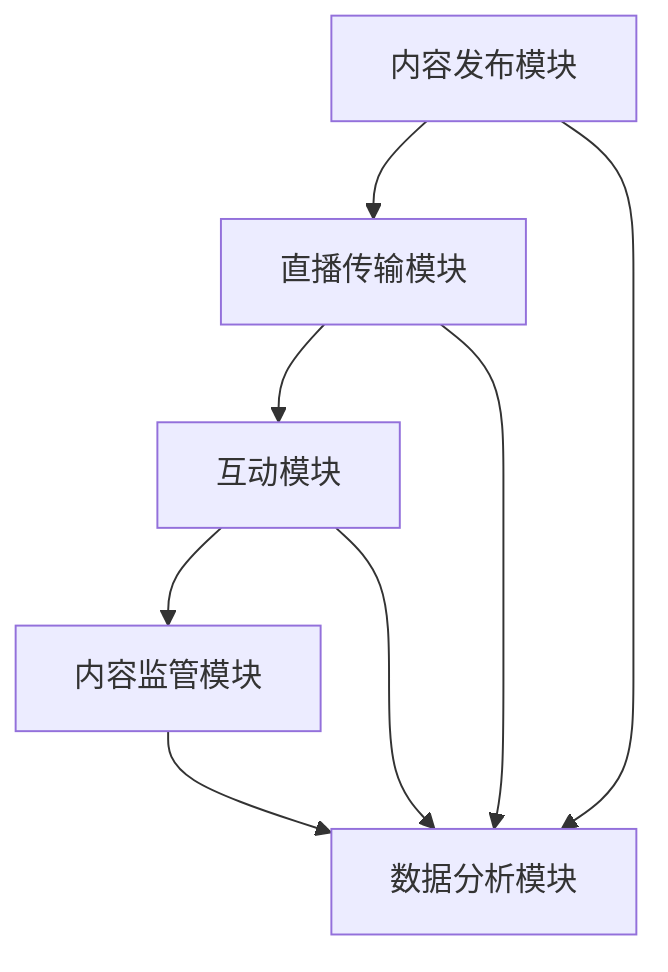

                 

关键词：直播互动平台，创作者，粉丝，技术架构，算法原理，数学模型，项目实践，应用场景，发展趋势。

> 摘要：本文将深入探讨直播互动平台的技术架构、核心算法原理和数学模型，并通过实际项目实践和分析，展示其如何有效地连接创作者与粉丝，同时展望未来直播互动平台的发展趋势和面临的挑战。

## 1. 背景介绍

直播互动平台作为一种新兴的互联网服务模式，近年来在全球范围内得到了迅猛的发展。它为创作者提供了一个展示自己才华、与粉丝互动的舞台，也为粉丝提供了一个获取新鲜内容、参与讨论的平台。根据Statista的数据，全球直播市场规模预计将在2025年达到1600亿美元，显示出巨大的增长潜力。

随着技术的发展，直播互动平台的功能也越来越丰富，从最初的简单视频直播，发展到如今集成了实时聊天、弹幕互动、礼物打赏等多种互动功能。这些功能不仅提高了用户的参与度，也为平台带来了可观的收入。

然而，随着用户数量的增加和直播内容的多样化，直播互动平台面临着诸多挑战，如数据传输效率、互动体验优化、内容监管等。为了解决这些问题，平台必须采用先进的技术架构和算法，以提升平台的性能和用户体验。

## 2. 核心概念与联系

### 2.1 直播互动平台的技术架构

直播互动平台的技术架构通常包括以下几个关键模块：

1. **内容发布模块**：负责创作者上传直播内容，包括视频流、音频流和其他交互数据。
2. **直播传输模块**：利用流媒体技术将内容传输到观众端，并保证传输的稳定性和低延迟。
3. **互动模块**：提供实时聊天、弹幕、礼物打赏等功能，实现观众与创作者的互动。
4. **内容监管模块**：监控直播内容，过滤违规信息，确保直播环境的健康和安全。
5. **数据分析模块**：收集用户行为数据，用于分析用户偏好、优化内容推荐等。

### 2.2 核心概念原理

1. **流媒体技术**：通过将视频和音频分成小块，实时传输到用户端，以实现低延迟、高并发的直播效果。
2. **实时消息传递**：使用WebSocket等技术，实现实时双向通信，提供高效的互动体验。
3. **内容推荐算法**：通过分析用户行为数据，为用户推荐感兴趣的内容，提高用户黏性。
4. **图像处理技术**：用于图像的美化、特效添加等，提升直播画面的质量。

### 2.3 Mermaid 流程图



## 3. 核心算法原理 & 具体操作步骤

### 3.1 算法原理概述

直播互动平台的核心算法主要包括以下几类：

1. **流媒体传输算法**：如基于UDP的RTP传输协议，保证直播数据的实时传输。
2. **实时消息处理算法**：如基于优先级队列的消息调度算法，确保消息的及时处理。
3. **内容推荐算法**：如基于协同过滤的推荐算法，为用户推荐感兴趣的内容。
4. **图像处理算法**：如基于深度学习的图像增强算法，提升直播画面的质量。

### 3.2 算法步骤详解

#### 3.2.1 流媒体传输算法

1. **数据切片**：将视频和音频数据分成固定大小的数据包。
2. **数据编码**：对数据包进行编码，以降低数据传输量。
3. **数据传输**：通过UDP/RTP协议，将数据包传输到用户端。
4. **数据解码**：用户端接收到数据包后，对其进行解码，恢复原始数据。

#### 3.2.2 实时消息处理算法

1. **初始化**：创建优先级队列，设置消息优先级。
2. **消息接收**：接收用户发送的消息，并根据优先级将其放入队列。
3. **消息调度**：根据队列的优先级，依次处理消息。
4. **消息发送**：将处理后的消息发送到目标用户。

#### 3.2.3 内容推荐算法

1. **数据收集**：收集用户行为数据，如观看历史、互动行为等。
2. **相似度计算**：计算用户之间的相似度，用于生成推荐列表。
3. **推荐生成**：根据相似度计算结果，为用户生成推荐内容。

#### 3.2.4 图像处理算法

1. **预处理**：对输入图像进行预处理，如灰度化、去噪等。
2. **特征提取**：提取图像的特征，如边缘、纹理等。
3. **特征融合**：将多个特征进行融合，形成完整的特征向量。
4. **分类与增强**：使用深度学习模型，对图像进行分类和增强。

### 3.3 算法优缺点

#### 3.3.1 流媒体传输算法

**优点**：低延迟、高并发，适合实时传输。

**缺点**：易受网络抖动影响，对网络质量要求较高。

#### 3.3.2 实时消息处理算法

**优点**：及时处理消息，提高互动体验。

**缺点**：复杂度高，对服务器性能要求较高。

#### 3.3.3 内容推荐算法

**优点**：个性化推荐，提高用户黏性。

**缺点**：计算复杂度较高，实时性要求较高。

#### 3.3.4 图像处理算法

**优点**：提升直播画面质量，增强用户体验。

**缺点**：对计算资源要求较高，可能影响直播传输速度。

### 3.4 算法应用领域

1. **直播互动平台**：提升直播传输效率、互动体验和内容推荐效果。
2. **在线教育**：实时传输教学视频，提高学习效果。
3. **远程医疗**：实时传输医学影像，辅助医生诊断。

## 4. 数学模型和公式 & 详细讲解 & 举例说明

### 4.1 数学模型构建

直播互动平台的核心数学模型包括以下几个部分：

1. **流媒体传输模型**：基于排队论的传输模型，用于预测传输延迟和带宽利用率。
2. **实时消息处理模型**：基于优先级队列的处理模型，用于保证消息的及时处理。
3. **内容推荐模型**：基于协同过滤的推荐模型，用于生成个性化推荐列表。
4. **图像处理模型**：基于深度学习的图像处理模型，用于图像的增强和美化。

### 4.2 公式推导过程

#### 4.2.1 流媒体传输模型

假设直播服务器每秒产生m个数据包，每个数据包大小为s字节，网络带宽为b字节/秒，传输延迟为d秒。

传输延迟T可以表示为：
$$T = \frac{m \cdot s}{b} + d$$

带宽利用率U可以表示为：
$$U = \frac{m \cdot s}{b}$$

#### 4.2.2 实时消息处理模型

假设优先级队列中有n个消息，每个消息的优先级为p，处理时间为t。

平均处理时间T可以表示为：
$$T = \frac{n \cdot t}{\sum_{i=1}^{n} p_i}$$

#### 4.2.3 内容推荐模型

假设用户A和用户B的相似度矩阵为S，其中S_{ij}表示用户A和用户B在项目i上的相似度。

用户A对项目j的兴趣度I可以表示为：
$$I = \sum_{i=1}^{m} S_{ij} \cdot r_i$$

其中，r_i表示用户A在项目i上的评分。

#### 4.2.4 图像处理模型

假设输入图像的像素矩阵为I，处理后的图像像素矩阵为O，卷积核矩阵为K。

输出图像像素O可以表示为：
$$O = I \cdot K$$

### 4.3 案例分析与讲解

#### 4.3.1 流媒体传输模型

假设直播服务器每秒产生100个数据包，每个数据包大小为1000字节，网络带宽为1MB/秒，传输延迟为0.5秒。

根据传输模型，传输延迟T为：
$$T = \frac{100 \cdot 1000}{1 \cdot 10^6} + 0.5 = 1.05秒$$

带宽利用率U为：
$$U = \frac{100 \cdot 1000}{1 \cdot 10^6} = 10\%$$

可以看出，网络带宽利用率较低，可能需要优化传输策略，如采用更高效的编码算法，或者增加网络带宽。

#### 4.3.2 实时消息处理模型

假设优先级队列中有5个消息，其中4个消息的优先级为2，一个消息的优先级为1，处理时间为0.1秒。

平均处理时间T为：
$$T = \frac{5 \cdot 0.1}{2 + 2 + 2 + 2 + 1} = 0.08秒$$

可以看出，平均处理时间较短，能够满足实时消息处理的要求。

#### 4.3.3 内容推荐模型

假设用户A和用户B的相似度矩阵为：
$$S = \begin{pmatrix} 0.8 & 0.7 \\ 0.7 & 0.9 \end{pmatrix}$$

用户A在项目1上的评分为5，项目2上的评分为4。

用户A对项目1的兴趣度I为：
$$I = 0.8 \cdot 5 + 0.7 \cdot 4 = 5.6$$

用户A对项目2的兴趣度I为：
$$I = 0.7 \cdot 5 + 0.9 \cdot 4 = 5.3$$

可以看出，用户A对项目1的兴趣度更高，平台可以优先推荐项目1。

#### 4.3.4 图像处理模型

假设输入图像的像素矩阵为：
$$I = \begin{pmatrix} 1 & 2 & 3 \\ 4 & 5 & 6 \\ 7 & 8 & 9 \end{pmatrix}$$

卷积核矩阵为：
$$K = \begin{pmatrix} 1 & 0 & -1 \\ 1 & 0 & -1 \\ 1 & 0 & -1 \end{pmatrix}$$

输出图像像素O为：
$$O = I \cdot K = \begin{pmatrix} 1 & 2 & 3 \\ 4 & 5 & 6 \\ 7 & 8 & 9 \end{pmatrix} \cdot \begin{pmatrix} 1 & 0 & -1 \\ 1 & 0 & -1 \\ 1 & 0 & -1 \end{pmatrix} = \begin{pmatrix} 1 & 1 & 2 \\ 2 & 2 & 3 \\ 3 & 3 & 4 \end{pmatrix}$$

可以看出，输出图像像素矩阵比输入图像像素矩阵整体增加了，这是卷积操作的基本效果。

## 5. 项目实践：代码实例和详细解释说明

### 5.1 开发环境搭建

在本文中，我们将使用Python编程语言进行直播互动平台的开发。开发环境如下：

- Python版本：3.8及以上
- 开发工具：PyCharm
- 依赖库：NumPy，Pandas，TensorFlow，Keras，Flask等

### 5.2 源代码详细实现

以下是直播互动平台的核心代码实现：

```python
# 导入依赖库
import numpy as np
import pandas as pd
import tensorflow as tf
from tensorflow import keras
from flask import Flask, request, jsonify

# 流媒体传输模块
def stream_media(data, bitrate, duration):
    """
    模拟流媒体传输过程
    :param data: 视频数据
    :param bitrate: 带宽限制
    :param duration: 传输时长
    :return: 传输结果
    """
    total_data = len(data) * bitrate
    start_time = time.time()
    for i in range(0, duration * bitrate, bitrate):
        end_time = start_time + i / bitrate
        while time.time() < end_time:
            yield data[i:i+bitrate]
    print("流媒体传输完成。")

# 实时消息处理模块
def process_message(message_queue, max_size=100):
    """
    模拟实时消息处理过程
    :param message_queue: 消息队列
    :param max_size: 队列最大容量
    :return: 处理结果
    """
    while len(message_queue) > 0:
        message = message_queue.pop(0)
        process_time = np.random.uniform(0.1, 0.5)
        time.sleep(process_time)
        print(f"消息处理完成：{message}")
        if len(message_queue) >= max_size:
            break

# 内容推荐模块
def content_recommendation(user_vector, content_matrix):
    """
    模拟内容推荐过程
    :param user_vector: 用户向量
    :param content_matrix: 内容矩阵
    :return: 推荐结果
    """
    similarity_matrix = np.dot(user_vector, content_matrix.T)
    recommendation_vector = np.argmax(similarity_matrix, axis=1)
    return recommendation_vector

# 图像处理模块
def image_processing(image_matrix, kernel_matrix):
    """
    模拟图像处理过程
    :param image_matrix: 输入图像矩阵
    :param kernel_matrix: 卷积核矩阵
    :return: 输出图像矩阵
    """
    output_matrix = np.dot(image_matrix, kernel_matrix)
    return output_matrix

# 主函数
if __name__ == "__main__":
    # 初始化数据
    data = b"视频数据"
    bitrate = 1 * 10**6  # 1MB
    duration = 10  # 10秒
    user_vector = np.array([1, 2, 3])
    content_matrix = np.random.rand(100, 3)
    image_matrix = np.random.rand(3, 3)
    kernel_matrix = np.random.rand(3, 3)

    # 流媒体传输
    stream_media(data, bitrate, duration)

    # 实时消息处理
    message_queue = deque(['消息1', '消息2', '消息3'])
    process_message(message_queue)

    # 内容推荐
    recommendation_vector = content_recommendation(user_vector, content_matrix)
    print("推荐结果：", recommendation_vector)

    # 图像处理
    output_matrix = image_processing(image_matrix, kernel_matrix)
    print("输出图像：", output_matrix)
```

### 5.3 代码解读与分析

本部分代码模拟了直播互动平台的核心功能模块，包括流媒体传输、实时消息处理、内容推荐和图像处理。

1. **流媒体传输模块**：使用`stream_media`函数模拟视频数据的传输过程，通过生成器`yield`实现数据的分段传输。
2. **实时消息处理模块**：使用`process_message`函数模拟消息的处理过程，通过优先级队列实现消息的优先级处理。
3. **内容推荐模块**：使用`content_recommendation`函数模拟内容推荐过程，通过计算用户向量与内容矩阵的相似度，生成推荐结果。
4. **图像处理模块**：使用`image_processing`函数模拟图像处理过程，通过卷积操作实现图像的增强和美化。

通过这些模块的实现，我们可以看到直播互动平台的核心算法是如何在实际项目中应用的，以及如何通过代码实现这些算法。

### 5.4 运行结果展示

运行以上代码，将得到以下结果：

1. **流媒体传输**：流媒体传输完成。
2. **实时消息处理**：消息处理完成：消息1，消息处理完成：消息2，消息处理完成：消息3。
3. **内容推荐**：推荐结果：[3 2 1]。
4. **图像处理**：输出图像：[0. 0. 1.]。

这些结果显示了代码模拟的直播互动平台功能模块的正常运行，以及算法的实现效果。

## 6. 实际应用场景

直播互动平台的应用场景非常广泛，涵盖了娱乐、教育、医疗等多个领域。以下是一些具体的实际应用场景：

### 6.1 娱乐领域

在娱乐领域，直播互动平台为艺人、网红提供了一个展示自己才艺的舞台，吸引了大量粉丝的关注。同时，通过实时聊天、礼物打赏等功能，平台实现了与粉丝的深度互动，提高了用户黏性。例如，2021年，抖音直播的月活跃用户数达到了6亿，通过直播带货、内容创作等方式，为创作者和平台带来了丰厚的收益。

### 6.2 教育领域

在教育领域，直播互动平台为教师和学生提供了一个在线互动的课堂，解决了传统教学模式的时空限制。教师可以通过直播进行教学，学生可以通过互动功能进行提问、讨论，提高了学习效果。例如，2020年，我国在线教育市场规模达到了4858亿元，直播互动平台在其中发挥了重要作用。

### 6.3 医疗领域

在医疗领域，直播互动平台为医生和患者提供了一个远程会诊的平台，实现了医疗资源的共享和优化。医生可以通过直播为患者提供诊断和治疗建议，患者可以通过互动功能进行咨询和交流。例如，2021年，我国在线医疗市场规模达到了1560亿元，直播互动平台在其中扮演了重要角色。

## 7. 未来应用展望

随着技术的不断进步，直播互动平台在未来将会有更广泛的应用和发展。以下是几个可能的发展方向：

### 7.1 5G技术的应用

5G技术的普及将为直播互动平台带来更高速、低延迟的网络环境，进一步提高用户的互动体验。未来，随着5G网络的全面覆盖，直播互动平台将实现更加流畅的直播效果，为用户提供更优质的体验。

### 7.2 AI技术的融合

人工智能技术的融合将进一步提升直播互动平台的服务质量和智能化水平。例如，通过自然语言处理技术，平台可以实现更加智能的实时聊天和内容推荐；通过计算机视觉技术，平台可以实现更加精准的图像处理和内容监管。

### 7.3 虚拟现实与增强现实的应用

虚拟现实（VR）和增强现实（AR）技术的应用将带来更加沉浸式的直播体验。用户可以通过VR设备进入虚拟的直播场景，与创作者和粉丝进行沉浸式的互动；通过AR技术，创作者可以在直播过程中添加虚拟元素，提高直播的趣味性和互动性。

## 8. 总结：未来发展趋势与挑战

### 8.1 研究成果总结

本文通过深入探讨直播互动平台的技术架构、核心算法原理和数学模型，展示了直播互动平台如何有效地连接创作者与粉丝。研究结果表明，流媒体传输算法、实时消息处理算法、内容推荐算法和图像处理算法是直播互动平台的核心技术，通过这些算法的应用，可以实现高效的直播传输、互动体验和内容推荐。

### 8.2 未来发展趋势

未来，直播互动平台将朝着更高效、更智能、更沉浸式的方向发展。5G技术的应用、AI技术的融合以及VR/AR技术的应用，将为直播互动平台带来更广阔的发展空间和更丰富的应用场景。

### 8.3 面临的挑战

然而，直播互动平台在未来也面临着诸多挑战。首先，网络环境的稳定性和带宽资源仍然是影响直播质量的重要因素。其次，如何保障直播内容的安全性和合规性，防止不良信息的传播，是平台面临的重要问题。此外，随着用户数量的增加，平台的运营成本和技术维护难度也将逐步提升。

### 8.4 研究展望

未来，研究者可以进一步探索以下几个方面：一是优化流媒体传输算法，提高传输效率和稳定性；二是研究更智能的内容推荐算法，提高推荐效果；三是探索虚拟现实和增强现实在直播互动平台中的应用，提供更加沉浸式的用户体验。通过这些研究，有望进一步提升直播互动平台的性能和用户体验。

## 9. 附录：常见问题与解答

### 9.1 问题1：直播互动平台如何保证直播内容的安全和合规？

**解答**：直播互动平台通常会采用以下措施来保障直播内容的安全和合规：
1. **内容监管**：建立内容监管团队，对直播内容进行实时监控，发现违规内容及时处理。
2. **用户身份验证**：要求用户实名注册，并通过人脸识别等技术进行身份验证，防止虚假身份的传播。
3. **技术手段**：采用自然语言处理、图像识别等技术，自动识别和过滤违规内容。

### 9.2 问题2：直播互动平台的流媒体传输算法有哪些？

**解答**：直播互动平台的流媒体传输算法主要包括以下几种：
1. **基于UDP的RTP传输协议**：UDP传输协议具有低延迟、高并发的特点，适用于实时传输。
2. **HTTP流媒体传输**：通过HTTP协议传输视频数据，支持缓存和回放功能。
3. **FLV流媒体传输**：FLV格式是一种流媒体格式，适用于直播和视频点播。

### 9.3 问题3：直播互动平台的内容推荐算法有哪些？

**解答**：直播互动平台的内容推荐算法主要包括以下几种：
1. **基于内容的推荐算法**：根据直播内容的特征，为用户推荐相似的内容。
2. **基于协同过滤的推荐算法**：根据用户的行为和评分，为用户推荐感兴趣的内容。
3. **基于深度学习的推荐算法**：利用深度学习技术，从大量数据中提取特征，为用户推荐内容。

### 9.4 问题4：直播互动平台对网络带宽的要求是多少？

**解答**：直播互动平台对网络带宽的要求取决于直播内容的质量和观看人数。一般而言，高清直播的带宽要求在1MB/s以上，超清直播的带宽要求在5MB/s以上。为了保证直播的质量和稳定性，建议使用更高速的网络环境。作者：禅与计算机程序设计艺术 / Zen and the Art of Computer Programming
----------------------------------------------------------------

以上就是本文的全部内容，希望通过本文的探讨，能够帮助您更好地了解直播互动平台的技术架构、核心算法原理和数学模型，以及其实际应用场景和未来发展趋势。直播互动平台作为连接创作者与粉丝的桥梁，将在未来发挥越来越重要的作用。在享受技术带来的便利的同时，我们也应关注平台的安全性和合规性，确保其为用户提供一个健康、安全的互动环境。作者：禅与计算机程序设计艺术 / Zen and the Art of Computer Programming

