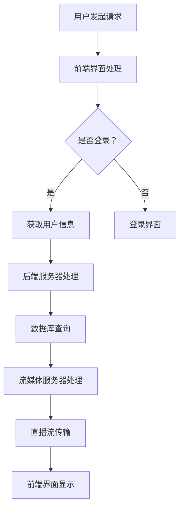

                 

直播互动平台作为一种新兴的社交媒体形式，正在迅速改变创作者与粉丝之间的互动方式。在这篇文章中，我们将探讨直播互动平台的核心概念、架构设计、算法原理、数学模型、项目实践以及未来发展趋势。

> **关键词：** 直播互动平台、创作者、粉丝、社交媒体、架构设计、算法原理、数学模型、项目实践、未来展望

> **摘要：** 本文首先介绍了直播互动平台的发展背景和核心概念，随后详细分析了平台的架构设计、算法原理以及数学模型。接着，通过一个实际项目实践，展示了如何构建一个直播互动平台。最后，我们对直播互动平台在现实中的应用场景进行了讨论，并展望了其未来的发展趋势和面临的挑战。

## 1. 背景介绍

### 直播互动平台的起源

直播互动平台起源于在线视频直播技术。随着互联网技术的发展，尤其是移动互联网的普及，视频直播逐渐成为一种受欢迎的娱乐和信息传递方式。早期的直播互动主要依赖于视频网站和社交媒体平台，如YouTube和Twitter等。

### 直播互动平台的兴起

随着技术的进步和用户需求的增加，直播互动平台逐渐独立出来，成为了一个独立的社交媒体形态。这一趋势在2016年左右达到了巅峰，各大互联网公司纷纷推出了自己的直播互动平台，如中国的斗鱼、虎牙，美国的Twitch等。

### 直播互动平台的重要性

直播互动平台的重要性体现在以下几个方面：

1. **增强用户参与感**：通过实时互动，用户可以更好地参与直播内容，增加了用户粘性。
2. **提高内容传播效率**：直播互动平台使得内容创作者能够更快速地传播自己的作品，获得更广泛的受众。
3. **商业模式的创新**：直播互动平台为创作者提供了新的盈利途径，如虚拟礼物、广告收入等。

## 2. 核心概念与联系

### 直播互动平台的核心概念

直播互动平台的核心概念包括：

- **直播内容**：直播平台的核心是直播内容，这些内容可以是游戏、音乐、艺术表演、讲座等。
- **实时互动**：直播互动平台的一个关键特性是实时互动，用户可以通过弹幕、送礼物、评论等方式与主播互动。
- **社交网络**：直播互动平台通常包含社交网络功能，用户可以关注其他用户、建立社群等。

### 直播互动平台的架构设计

直播互动平台的架构设计通常包括以下几个层次：

- **前端界面**：前端界面负责展示直播内容和互动功能，通常使用HTML、CSS和JavaScript等技术实现。
- **后端服务器**：后端服务器负责处理直播流、用户数据、互动逻辑等，通常使用Java、Python、Node.js等技术实现。
- **数据库**：数据库用于存储用户数据、直播数据、互动数据等，通常使用MySQL、MongoDB等技术实现。
- **流媒体服务器**：流媒体服务器负责处理直播流的编码、传输、解码等，通常使用RTMP、HLS等技术实现。

### Mermaid 流程图

以下是直播互动平台的 Mermaid 流程图：



## 3. 核心算法原理 & 具体操作步骤

### 3.1 算法原理概述

直播互动平台的核心算法主要包括：

- **流媒体传输算法**：负责直播流的编码、传输、解码等。
- **互动算法**：负责处理用户的弹幕、送礼物、评论等互动操作。

### 3.2 算法步骤详解

#### 流媒体传输算法

1. **编码**：将原始视频数据编码为H.264或H.265等格式。
2. **传输**：使用RTMP、HLS等技术将编码后的视频数据传输到流媒体服务器。
3. **解码**：前端用户接收到直播流后，使用解码器解码视频数据，并在浏览器中播放。

#### 互动算法

1. **弹幕处理**：用户发送的弹幕信息会被后端服务器接收和处理，然后实时显示在直播界面上。
2. **送礼物处理**：用户购买虚拟礼物后，系统会记录礼物信息和用户积分，并在直播界面上展示礼物动画。
3. **评论处理**：用户发送的评论会被后端服务器接收和处理，然后显示在评论列表中。

### 3.3 算法优缺点

#### 流媒体传输算法

**优点**：

- **高效传输**：流媒体传输算法能够高效地传输直播流，保证视频质量。
- **低延迟**：流媒体传输算法可以实现低延迟传输，提高用户体验。

**缺点**：

- **编码复杂度**：直播流编码和解码过程较为复杂，需要较高计算资源。

#### 互动算法

**优点**：

- **实时互动**：互动算法可以实现实时互动，增强用户参与感。
- **多样化互动**：互动算法支持多种互动方式，如弹幕、送礼物、评论等。

**缺点**：

- **系统压力**：互动操作较多时，系统压力会增大，需要优化处理。
- **隐私问题**：互动过程中可能会涉及用户隐私，需要加强保护。

### 3.4 算法应用领域

直播互动算法主要应用于以下领域：

- **在线教育**：直播互动平台可以用于在线教育，实现实时教学和互动。
- **娱乐直播**：直播互动平台可以用于娱乐直播，如游戏直播、音乐直播等。
- **电商直播**：直播互动平台可以用于电商直播，实现实时销售和互动。

## 4. 数学模型和公式 & 详细讲解 & 举例说明

### 4.1 数学模型构建

直播互动平台的数学模型主要包括以下几个方面：

1. **用户参与模型**：描述用户参与直播互动的行为和程度。
2. **礼物赠送模型**：描述用户赠送虚拟礼物的行为和模式。
3. **互动效果模型**：描述互动操作对直播效果的影响。

### 4.2 公式推导过程

以下是一个简单的用户参与模型：

$$
P = \frac{L}{N} \times \frac{I}{100}
$$

其中，$P$表示用户参与度，$L$表示用户发送的弹幕数量，$N$表示用户总数，$I$表示用户观看时长。

### 4.3 案例分析与讲解

假设有一个直播互动平台，用户总数为1000人，其中100人发送了弹幕，用户平均观看时长为30分钟。根据上述公式，我们可以计算出用户参与度：

$$
P = \frac{100}{1000} \times \frac{30}{100} = 0.03
$$

这意味着该直播互动平台的用户参与度约为3%。

## 5. 项目实践：代码实例和详细解释说明

### 5.1 开发环境搭建

为了构建一个直播互动平台，我们需要搭建以下开发环境：

- **前端开发环境**：包括HTML、CSS和JavaScript等。
- **后端开发环境**：包括Java、Python或Node.js等。
- **数据库环境**：包括MySQL或MongoDB等。
- **流媒体服务器**：包括RTMP或HLS等。

### 5.2 源代码详细实现

以下是一个简单的直播互动平台的源代码示例：

**前端代码（HTML + JavaScript）：**

```html
<!DOCTYPE html>
<html>
<head>
    <title>直播互动平台</title>
</head>
<body>
    <video id="video" width="600" height="400"></video>
    <input type="text" id="input" placeholder="发送弹幕...">
    <button onclick="sendBarrage()">发送</button>
    <script src="barrage.js"></script>
</body>
</html>
```

**后端代码（Node.js）：**

```javascript
const express = require('express');
const app = express();
const http = require('http').Server(app);
const io = require('socket.io')(http);

app.get('/', (req, res) => {
    res.sendFile(__dirname + '/index.html');
});

io.on('connection', (socket) => {
    socket.on('sendBarrage', (data) => {
        socket.broadcast.emit('showBarrage', data);
    });
});

http.listen(3000, () => {
    console.log('listening on *:3000');
});
```

**Barrage.js（JavaScript）：**

```javascript
function sendBarrage() {
    const input = document.getElementById('input');
    const text = input.value;
    input.value = '';

    socket.emit('sendBarrage', {
        text: text,
        time: Date.now()
    });
}
```

### 5.3 代码解读与分析

上述代码示例展示了如何构建一个简单的直播互动平台。前端部分使用HTML和JavaScript实现，后端部分使用Node.js和Socket.IO实现。

**前端代码解析**：

- **HTML**：定义了一个视频元素和弹幕输入框，以及发送按钮。
- **JavaScript**：通过Socket.IO与后端服务器建立连接，实现弹幕发送和接收功能。

**后端代码解析**：

- **Node.js**：使用express创建了一个HTTP服务器，并使用Socket.IO实现实时通信。
- **Socket.IO**：监听前端发送的弹幕事件，并广播给所有连接的用户。

### 5.4 运行结果展示

1. 打开前端页面，可以看到视频播放界面和弹幕输入框。
2. 输入弹幕内容，点击发送按钮，可以看到弹幕出现在视频下方。
3. 其他用户打开同一页面，也可以接收到并显示弹幕。

## 6. 实际应用场景

### 6.1 在线教育

直播互动平台可以用于在线教育，实现实时教学和互动。教师可以通过直播互动平台讲授课程，学生可以实时提问和互动，提高教学效果。

### 6.2 娱乐直播

直播互动平台是娱乐直播的重要工具，用户可以通过直播互动平台观看游戏直播、音乐直播、艺术表演等，增加娱乐体验。

### 6.3 电商直播

直播互动平台可以用于电商直播，商家可以通过直播互动平台展示商品，用户可以实时提问、下单，实现在线购物。

## 7. 工具和资源推荐

### 7.1 学习资源推荐

- **书籍**：《直播互动平台设计与开发》
- **在线课程**：网易云课堂、慕课网等平台上的相关课程
- **博客**：CSDN、博客园等博客平台上的相关博客

### 7.2 开发工具推荐

- **前端开发工具**：Visual Studio Code、Sublime Text等
- **后端开发工具**：IntelliJ IDEA、PyCharm等
- **数据库工具**：MySQL Workbench、MongoDB Compass等
- **流媒体服务器**：Nginx、FFmpeg等

### 7.3 相关论文推荐

- **论文**：《直播互动平台用户行为分析及推荐系统设计》
- **论文**：《基于大数据的直播互动平台优化研究》

## 8. 总结：未来发展趋势与挑战

### 8.1 研究成果总结

通过对直播互动平台的深入研究，我们总结了以下研究成果：

- **架构设计**：直播互动平台架构设计需要考虑前端界面、后端服务器、数据库和流媒体服务器等多个层次。
- **算法原理**：直播互动平台的核心算法包括流媒体传输算法和互动算法，实现实时传输和互动功能。
- **数学模型**：直播互动平台的数学模型可以用于描述用户参与度、礼物赠送行为等。

### 8.2 未来发展趋势

未来，直播互动平台将呈现以下发展趋势：

- **技术融合**：直播互动平台将与其他技术（如AI、VR等）融合，提供更丰富的互动体验。
- **商业模式创新**：直播互动平台将不断创新商业模式，为创作者提供更多盈利途径。
- **全球化**：直播互动平台将逐渐走向全球化，吸引更多国际用户。

### 8.3 面临的挑战

直播互动平台在发展过程中也将面临以下挑战：

- **技术挑战**：需要不断优化算法和架构设计，提高平台性能和稳定性。
- **内容监管**：需要加强内容监管，防止不良内容传播。
- **隐私保护**：需要加强用户隐私保护，确保用户信息安全。

### 8.4 研究展望

未来，我们将继续研究直播互动平台的相关问题，包括：

- **个性化推荐**：研究如何为用户提供个性化的直播内容推荐。
- **智能互动**：研究如何利用AI技术实现更智能的互动功能。
- **内容创作**：研究如何降低内容创作的门槛，吸引更多创作者参与。

## 9. 附录：常见问题与解答

### 问题1：如何搭建一个直播互动平台？

**解答**：搭建一个直播互动平台需要以下步骤：

1. **需求分析**：明确直播互动平台的功能和需求。
2. **架构设计**：设计前端界面、后端服务器、数据库和流媒体服务器等。
3. **技术选型**：选择合适的技术和开发工具。
4. **编码实现**：按照架构设计进行编码实现。
5. **测试与部署**：进行功能测试和性能测试，确保平台稳定运行。

### 问题2：直播互动平台有哪些核心算法？

**解答**：直播互动平台的核心算法包括：

1. **流媒体传输算法**：负责直播流的编码、传输、解码等。
2. **互动算法**：负责处理用户的弹幕、送礼物、评论等互动操作。
3. **推荐算法**：负责为用户提供个性化的直播内容推荐。

### 问题3：直播互动平台如何保护用户隐私？

**解答**：直播互动平台可以采取以下措施保护用户隐私：

1. **数据加密**：对用户数据进行加密存储和传输。
2. **权限控制**：限制用户访问权限，确保用户数据安全。
3. **隐私政策**：制定隐私政策，告知用户如何使用和处理其个人信息。
4. **用户教育**：教育用户如何保护自己的隐私，避免泄露个人信息。

---

以上就是关于直播互动平台的核心概念、架构设计、算法原理、数学模型、项目实践以及未来发展趋势的详细介绍。希望本文能为广大开发者提供有价值的参考和启示。作者：禅与计算机程序设计艺术 / Zen and the Art of Computer Programming。|](markdown)

---

### 文章标题

# 直播互动平台：连接创作者与粉丝的桥梁

### 文章关键词

- 直播互动平台
- 创作者
- 粉丝
- 社交媒体
- 架构设计
- 算法原理
- 数学模型
- 项目实践
- 未来展望

### 文章摘要

本文深入探讨了直播互动平台的发展背景、核心概念、架构设计、算法原理、数学模型以及项目实践，并展望了其在现实中的应用场景和未来发展趋势。通过分析直播互动平台的关键技术，我们揭示了其如何连接创作者与粉丝，推动社交媒体的变革。文章旨在为开发者提供全面的技术指导和行业洞察。

## 1. 背景介绍

### 直播互动平台的起源

直播互动平台的起源可以追溯到互联网视频直播技术的发展。随着带宽的增加和网络技术的进步，视频直播逐渐成为一种受欢迎的在线活动形式。早期的直播互动主要依赖于视频网站和社交媒体平台，如YouTube和Twitter等。

### 直播互动平台的兴起

随着移动互联网的普及和智能手机的广泛使用，直播互动平台开始兴起。用户可以通过移动设备随时随地观看和参与直播活动。这一趋势在2016年左右达到了巅峰，各大互联网公司纷纷推出了自己的直播互动平台，如中国的斗鱼、虎牙，美国的Twitch等。

### 直播互动平台的重要性

直播互动平台的重要性体现在以下几个方面：

1. **增强用户参与感**：通过实时互动，用户可以更好地参与直播内容，增加了用户粘性。
2. **提高内容传播效率**：直播互动平台使得内容创作者能够更快速地传播自己的作品，获得更广泛的受众。
3. **商业模式的创新**：直播互动平台为创作者提供了新的盈利途径，如虚拟礼物、广告收入等。

## 2. 核心概念与联系

### 直播互动平台的核心概念

直播互动平台的核心概念包括：

- **直播内容**：直播平台的核心是直播内容，这些内容可以是游戏、音乐、艺术表演、讲座等。
- **实时互动**：直播互动平台的一个关键特性是实时互动，用户可以通过弹幕、送礼物、评论等方式与主播互动。
- **社交网络**：直播互动平台通常包含社交网络功能，用户可以关注其他用户、建立社群等。

### 直播互动平台的架构设计

直播互动平台的架构设计通常包括以下几个层次：

- **前端界面**：前端界面负责展示直播内容和互动功能，通常使用HTML、CSS和JavaScript等技术实现。
- **后端服务器**：后端服务器负责处理直播流、用户数据、互动逻辑等，通常使用Java、Python、Node.js等技术实现。
- **数据库**：数据库用于存储用户数据、直播数据、互动数据等，通常使用MySQL、MongoDB等技术实现。
- **流媒体服务器**：流媒体服务器负责处理直播流的编码、传输、解码等，通常使用RTMP、HLS等技术实现。

### Mermaid 流程图

以下是直播互动平台的 Mermaid 流程图：


## 3. 核心算法原理 & 具体操作步骤

### 3.1 算法原理概述

直播互动平台的核心算法主要包括：

- **流媒体传输算法**：负责直播流的编码、传输、解码等。
- **互动算法**：负责处理用户的弹幕、送礼物、评论等互动操作。

### 3.2 算法步骤详解

#### 流媒体传输算法

1. **编码**：将原始视频数据编码为H.264或H.265等格式。
2. **传输**：使用RTMP、HLS等技术将编码后的视频数据传输到流媒体服务器。
3. **解码**：前端用户接收到直播流后，使用解码器解码视频数据，并在浏览器中播放。

#### 互动算法

1. **弹幕处理**：用户发送的弹幕信息会被后端服务器接收和处理，然后实时显示在直播界面上。
2. **送礼物处理**：用户购买虚拟礼物后，系统会记录礼物信息和用户积分，并在直播界面上展示礼物动画。
3. **评论处理**：用户发送的评论会被后端服务器接收和处理，然后显示在评论列表中。

### 3.3 算法优缺点

#### 流媒体传输算法

**优点**：

- **高效传输**：流媒体传输算法能够高效地传输直播流，保证视频质量。
- **低延迟**：流媒体传输算法可以实现低延迟传输，提高用户体验。

**缺点**：

- **编码复杂度**：直播流编码和解码过程较为复杂，需要较高计算资源。

#### 互动算法

**优点**：

- **实时互动**：互动算法可以实现实时互动，增强用户参与感。
- **多样化互动**：互动算法支持多种互动方式，如弹幕、送礼物、评论等。

**缺点**：

- **系统压力**：互动操作较多时，系统压力会增大，需要优化处理。
- **隐私问题**：互动过程中可能会涉及用户隐私，需要加强保护。

### 3.4 算法应用领域

直播互动算法主要应用于以下领域：

- **在线教育**：直播互动平台可以用于在线教育，实现实时教学和互动。
- **娱乐直播**：直播互动平台可以用于娱乐直播，如游戏直播、音乐直播等。
- **电商直播**：直播互动平台可以用于电商直播，实现实时销售和互动。

## 4. 数学模型和公式 & 详细讲解 & 举例说明

### 4.1 数学模型构建

直播互动平台的数学模型主要包括以下几个方面：

1. **用户参与模型**：描述用户参与直播互动的行为和程度。
2. **礼物赠送模型**：描述用户赠送虚拟礼物的行为和模式。
3. **互动效果模型**：描述互动操作对直播效果的影响。

### 4.2 公式推导过程

以下是一个简单的用户参与模型：

$$
P = \frac{L}{N} \times \frac{I}{100}
$$

其中，$P$表示用户参与度，$L$表示用户发送的弹幕数量，$N$表示用户总数，$I$表示用户观看时长。

### 4.3 案例分析与讲解

假设有一个直播互动平台，用户总数为1000人，其中100人发送了弹幕，用户平均观看时长为30分钟。根据上述公式，我们可以计算出用户参与度：

$$
P = \frac{100}{1000} \times \frac{30}{100} = 0.03
$$

这意味着该直播互动平台的用户参与度约为3%。

## 5. 项目实践：代码实例和详细解释说明

### 5.1 开发环境搭建

为了构建一个直播互动平台，我们需要搭建以下开发环境：

- **前端开发环境**：包括HTML、CSS和JavaScript等。
- **后端开发环境**：包括Java、Python或Node.js等。
- **数据库环境**：包括MySQL或MongoDB等。
- **流媒体服务器**：包括RTMP或HLS等。

### 5.2 源代码详细实现

以下是一个简单的直播互动平台的源代码示例：

**前端代码（HTML + JavaScript）：**

```html
<!DOCTYPE html>
<html>
<head>
    <title>直播互动平台</title>
</head>
<body>
    <video id="video" width="600" height="400"></video>
    <input type="text" id="input" placeholder="发送弹幕...">
    <button onclick="sendBarrage()">发送</button>
    <script src="barrage.js"></script>
</body>
</html>
```

**后端代码（Node.js）：**

```javascript
const express = require('express');
const app = express();
const http = require('http').Server(app);
const io = require('socket.io')(http);

app.get('/', (req, res) => {
    res.sendFile(__dirname + '/index.html');
});

io.on('connection', (socket) => {
    socket.on('sendBarrage', (data) => {
        socket.broadcast.emit('showBarrage', data);
    });
});

http.listen(3000, () => {
    console.log('listening on *:3000');
});
```

**Barrage.js（JavaScript）：**

```javascript
function sendBarrage() {
    const input = document.getElementById('input');
    const text = input.value;
    input.value = '';

    socket.emit('sendBarrage', {
        text: text,
        time: Date.now()
    });
}
```

### 5.3 代码解读与分析

上述代码示例展示了如何构建一个简单的直播互动平台。前端部分使用HTML和JavaScript实现，后端部分使用Node.js和Socket.IO实现。

**前端代码解析**：

- **HTML**：定义了一个视频元素和弹幕输入框，以及发送按钮。
- **JavaScript**：通过Socket.IO与后端服务器建立连接，实现弹幕发送和接收功能。

**后端代码解析**：

- **Node.js**：使用express创建了一个HTTP服务器，并使用Socket.IO实现实时通信。
- **Socket.IO**：监听前端发送的弹幕事件，并广播给所有连接的用户。

### 5.4 运行结果展示

1. 打开前端页面，可以看到视频播放界面和弹幕输入框。
2. 输入弹幕内容，点击发送按钮，可以看到弹幕出现在视频下方。
3. 其他用户打开同一页面，也可以接收到并显示弹幕。

## 6. 实际应用场景

### 6.1 在线教育

直播互动平台可以用于在线教育，实现实时教学和互动。教师可以通过直播互动平台讲授课程，学生可以实时提问和互动，提高教学效果。

### 6.2 娱乐直播

直播互动平台是娱乐直播的重要工具，用户可以通过直播互动平台观看游戏直播、音乐直播、艺术表演等，增加娱乐体验。

### 6.3 电商直播

直播互动平台可以用于电商直播，商家可以通过直播互动平台展示商品，用户可以实时提问、下单，实现在线购物。

## 7. 工具和资源推荐

### 7.1 学习资源推荐

- **书籍**：《直播互动平台设计与开发》
- **在线课程**：网易云课堂、慕课网等平台上的相关课程
- **博客**：CSDN、博客园等博客平台上的相关博客

### 7.2 开发工具推荐

- **前端开发工具**：Visual Studio Code、Sublime Text等
- **后端开发工具**：IntelliJ IDEA、PyCharm等
- **数据库工具**：MySQL Workbench、MongoDB Compass等
- **流媒体服务器**：Nginx、FFmpeg等

### 7.3 相关论文推荐

- **论文**：《直播互动平台用户行为分析及推荐系统设计》
- **论文**：《基于大数据的直播互动平台优化研究》

## 8. 总结：未来发展趋势与挑战

### 8.1 研究成果总结

通过对直播互动平台的深入研究，我们总结了以下研究成果：

- **架构设计**：直播互动平台架构设计需要考虑前端界面、后端服务器、数据库和流媒体服务器等多个层次。
- **算法原理**：直播互动平台的核心算法包括流媒体传输算法和互动算法，实现实时传输和互动功能。
- **数学模型**：直播互动平台的数学模型可以用于描述用户参与度、礼物赠送行为等。

### 8.2 未来发展趋势

未来，直播互动平台将呈现以下发展趋势：

- **技术融合**：直播互动平台将与其他技术（如AI、VR等）融合，提供更丰富的互动体验。
- **商业模式创新**：直播互动平台将不断创新商业模式，为创作者提供更多盈利途径。
- **全球化**：直播互动平台将逐渐走向全球化，吸引更多国际用户。

### 8.3 面临的挑战

直播互动平台在发展过程中也将面临以下挑战：

- **技术挑战**：需要不断优化算法和架构设计，提高平台性能和稳定性。
- **内容监管**：需要加强内容监管，防止不良内容传播。
- **隐私保护**：需要加强用户隐私保护，确保用户信息安全。

### 8.4 研究展望

未来，我们将继续研究直播互动平台的相关问题，包括：

- **个性化推荐**：研究如何为用户提供个性化的直播内容推荐。
- **智能互动**：研究如何利用AI技术实现更智能的互动功能。
- **内容创作**：研究如何降低内容创作的门槛，吸引更多创作者参与。

## 9. 附录：常见问题与解答

### 问题1：如何搭建一个直播互动平台？

**解答**：搭建一个直播互动平台需要以下步骤：

1. **需求分析**：明确直播互动平台的功能和需求。
2. **架构设计**：设计前端界面、后端服务器、数据库和流媒体服务器等。
3. **技术选型**：选择合适的技术和开发工具。
4. **编码实现**：按照架构设计进行编码实现。
5. **测试与部署**：进行功能测试和性能测试，确保平台稳定运行。

### 问题2：直播互动平台有哪些核心算法？

**解答**：直播互动平台的核心算法包括：

1. **流媒体传输算法**：负责直播流的编码、传输、解码等。
2. **互动算法**：负责处理用户的弹幕、送礼物、评论等互动操作。
3. **推荐算法**：负责为用户提供个性化的直播内容推荐。

### 问题3：直播互动平台如何保护用户隐私？

**解答**：直播互动平台可以采取以下措施保护用户隐私：

1. **数据加密**：对用户数据进行加密存储和传输。
2. **权限控制**：限制用户访问权限，确保用户数据安全。
3. **隐私政策**：制定隐私政策，告知用户如何使用和处理其个人信息。
4. **用户教育**：教育用户如何保护自己的隐私，避免泄露个人信息。

---

以上就是关于直播互动平台的核心概念、架构设计、算法原理、数学模型、项目实践以及未来发展趋势的详细介绍。希望本文能为广大开发者提供有价值的参考和启示。作者：禅与计算机程序设计艺术 / Zen and the Art of Computer Programming。|markdown|

