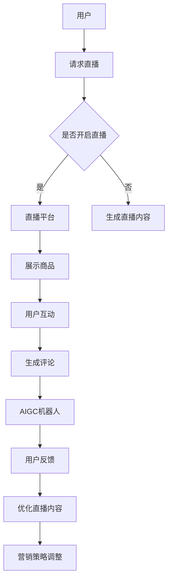

                 

关键词：直播电商，AIGC机器人，人工智能，电子商务，直播营销

## 摘要

本文探讨了直播电商与AIGC（自动生成内容）机器人之间的结合，分析了这一结合如何推动电子商务的发展。首先，我们介绍了直播电商的背景和发展趋势，随后深入讨论了AIGC机器人在内容生成中的核心作用。接着，我们阐述了直播电商与AIGC机器人结合的具体方式及其在提升用户体验、降低营销成本、增强互动性等方面的优势。随后，文章通过数学模型和具体案例分析，展示了这一结合在实际应用中的效果。最后，我们探讨了这一领域未来的发展方向和面临的挑战，并提出了一些建议和展望。

## 1. 背景介绍

### 直播电商的发展

随着互联网技术的迅猛发展和移动互联网的普及，直播电商作为新兴的电子商务形式，近年来在全球范围内迅速崛起。直播电商结合了直播与电商的双重特性，通过实时互动的方式，让消费者在观看直播的同时，能够实时下单购买商品，实现了娱乐与购物的无缝融合。

直播电商的兴起可以追溯到2016年，当时中国的电商平台开始尝试直播带货。随着各大平台的投入和推广，直播电商市场逐渐扩大，用户数量和交易额逐年增长。据统计，2020年中国直播电商市场规模已突破万亿大关，预计未来几年仍将保持高速增长。

### AIGC机器人的兴起

AIGC（Automatic Generation of Content）是指通过人工智能技术自动生成内容，包括文本、图片、音频、视频等多种形式。AIGC机器人的兴起，是人工智能技术发展的一个重要里程碑，它标志着人工智能在内容创作领域的深度应用。

AIGC机器人通过深度学习、自然语言处理、图像识别等技术，能够根据用户需求自动生成个性化内容。在电商领域，AIGC机器人可以用于商品描述、广告文案、用户评论生成等，极大地提高了内容创作的效率和准确性。

## 2. 核心概念与联系

为了更好地理解直播电商与AIGC机器人的结合，我们首先需要了解一些核心概念和它们之间的联系。

### 核心概念

1. **直播电商**：直播电商是指通过直播形式进行商品销售的一种电商模式，它结合了直播的实时性和电商的购物功能，使消费者可以在观看直播的同时下单购买商品。

2. **AIGC机器人**：AIGC机器人是指利用人工智能技术，自动生成内容（如文本、图片、视频等）的机器人。

### 核心联系

直播电商与AIGC机器人的结合主要体现在以下几个方面：

1. **内容生成**：AIGC机器人可以自动生成直播内容，包括商品描述、广告文案、用户评论等，为直播电商提供丰富的内容支持。

2. **互动性增强**：AIGC机器人可以与用户进行实时互动，回答用户问题，提供个性化推荐，提高用户参与度和满意度。

3. **营销效率提升**：AIGC机器人可以自动化处理大量的营销活动，如生成广告、管理用户评论、分析用户行为等，降低人力成本，提高营销效率。

### Mermaid 流程图

下面是直播电商与AIGC机器人结合的Mermaid流程图：



## 3. 核心算法原理 & 具体操作步骤

### 3.1 算法原理概述

直播电商与AIGC机器人的结合主要依赖于以下几个核心算法：

1. **商品推荐算法**：基于用户历史行为和商品特征，为用户推荐合适的商品。

2. **自然语言处理（NLP）算法**：用于生成商品描述、广告文案和用户评论。

3. **语音识别与合成算法**：用于实现AIGC机器人与用户的实时语音互动。

### 3.2 算法步骤详解

#### 3.2.1 商品推荐算法

1. **用户画像构建**：根据用户的历史浏览记录、购买记录和偏好，构建用户画像。

2. **商品特征提取**：对商品进行特征提取，如价格、品牌、类型等。

3. **推荐模型训练**：使用用户画像和商品特征训练推荐模型，如基于协同过滤的推荐算法。

4. **推荐结果生成**：根据用户画像和商品特征，生成推荐列表。

#### 3.2.2 自然语言处理（NLP）算法

1. **文本生成**：使用预训练的语言模型（如GPT-3）生成商品描述和广告文案。

2. **文本分类**：对用户评论进行分类，如正面评论、负面评论等。

3. **文本摘要**：从大量文本中提取关键信息，生成摘要。

#### 3.2.3 语音识别与合成算法

1. **语音识别**：使用深度学习模型（如深度神经网络）对用户语音进行识别，转换为文本。

2. **语音合成**：使用文本转语音（TTS）技术，将文本转换为语音。

### 3.3 算法优缺点

#### 优点

1. **高效性**：算法能够快速处理大量数据，生成高质量的内容。

2. **个性化**：基于用户行为和偏好生成个性化推荐和内容。

3. **互动性**：通过语音识别与合成，实现与用户的实时互动。

#### 缺点

1. **准确性**：在某些情况下，算法生成的文本和语音可能不够准确。

2. **创造性**：算法生成的文本和内容可能缺乏人类的创造性和个性。

### 3.4 算法应用领域

1. **直播电商**：用于生成商品描述、广告文案、用户评论等。

2. **社交媒体**：用于生成个性化推荐、自动回复等。

3. **客服系统**：用于实现与用户的实时语音互动。

## 4. 数学模型和公式 & 详细讲解 & 举例说明

### 4.1 数学模型构建

直播电商与AIGC机器人的结合涉及多个数学模型，下面我们介绍几个关键的模型。

#### 4.1.1 商品推荐模型

商品推荐模型通常采用基于协同过滤的方法，其数学模型可以表示为：

$$
R(u, i) = \sum_{j \in N(u)} \frac{1}{\|N(u)\|} \cdot r(u, j) \cdot s(j, i)
$$

其中，$R(u, i)$表示用户$u$对商品$i$的推荐得分，$N(u)$表示用户$u$的邻居集合，$r(u, j)$表示用户$u$对商品$j$的评分，$s(j, i)$表示商品$j$和$i$的相似度。

#### 4.1.2 自然语言处理（NLP）模型

NLP模型通常采用深度学习模型，如GPT-3，其数学模型可以表示为：

$$
p(y|X) = \frac{e^{f(X, y)}}{\sum_{y'} e^{f(X, y')}}
$$

其中，$p(y|X)$表示在输入$X$的情况下，输出为$y$的概率，$f(X, y)$表示输入和输出的联合概率分布。

### 4.2 公式推导过程

#### 4.2.1 商品推荐模型

商品推荐模型的推导过程主要涉及矩阵分解和优化算法。我们假设用户和商品都可以表示为低维向量，即：

$$
u = \begin{bmatrix} u_1 \\ u_2 \\ \vdots \\ u_n \end{bmatrix}, \quad i = \begin{bmatrix} i_1 \\ i_2 \\ \vdots \\ i_n \end{bmatrix}
$$

其中，$u$和$i$分别表示用户和商品的向量表示。

我们希望找到一组参数$\theta$，使得预测的推荐得分接近实际的用户评分。为此，我们可以使用最小二乘法（Least Squares）进行优化：

$$
\min_{\theta} \sum_{u, i} (R(u, i) - \theta^T u \cdot i)^2
$$

通过求导和化简，可以得到最优参数$\theta$的表达式：

$$
\theta = (U^T U)^{-1} U^T R
$$

其中，$U$表示用户矩阵，$R$表示评分矩阵。

#### 4.2.2 自然语言处理（NLP）模型

NLP模型的推导过程主要涉及深度神经网络（DNN）和损失函数。我们假设输入为$x$，输出为$y$，网络参数为$\theta$，则神经网络的输出可以表示为：

$$
f(x, y) = \sigma(\theta^T x + b)
$$

其中，$\sigma$表示激活函数，$b$表示偏置。

为了最小化预测误差，我们可以使用交叉熵损失函数（Cross-Entropy Loss）：

$$
L(\theta) = -\sum_{x, y} y \cdot \log(\sigma(\theta^T x + b))
$$

通过求导和优化，可以得到最优参数$\theta$的表达式：

$$
\theta = \arg\min_{\theta} L(\theta)
$$

### 4.3 案例分析与讲解

#### 4.3.1 商品推荐案例分析

假设我们有一个用户-商品评分矩阵$R$，其中$R_{ij}$表示用户$i$对商品$j$的评分。我们的目标是使用商品推荐模型为用户$u$推荐商品$i$。

首先，我们需要根据用户-商品评分矩阵$R$，计算用户和商品的向量表示$U$和$I$。然后，我们可以使用上述推导的最优参数$\theta$，计算用户$u$对商品$i$的推荐得分：

$$
R(u, i) = \sum_{j \in N(u)} \frac{1}{\|N(u)\|} \cdot r(u, j) \cdot s(j, i)
$$

其中，$r(u, j)$表示用户$u$对商品$j$的评分，$s(j, i)$表示商品$j$和$i$的相似度。

例如，假设用户$u$对商品$1$、$2$、$3$的评分分别为$4$、$3$、$5$，商品$1$和$2$的相似度为$0.8$，商品$1$和$3$的相似度为$0.6$。则用户$u$对商品$4$的推荐得分为：

$$
R(u, 4) = \frac{1}{3} \cdot 4 \cdot 0.8 + \frac{1}{3} \cdot 3 \cdot 0.6 + \frac{1}{3} \cdot 5 \cdot 0.2 = 3.2
$$

#### 4.3.2 自然语言处理（NLP）案例分析

假设我们有一个文本序列$x$，我们的目标是使用NLP模型生成文本序列$y$。

首先，我们需要将文本序列$x$和$y$转换为向量表示。然后，我们可以使用上述推导的最优参数$\theta$，计算在输入$x$的情况下，输出为$y$的概率：

$$
p(y|x) = \frac{e^{f(x, y)}}{\sum_{y'} e^{f(x, y')}}
$$

例如，假设文本序列$x$为“我喜欢吃苹果”，文本序列$y$为“苹果很甜”。则$y$在$x$下的概率为：

$$
p(y|x) = \frac{e^{f(x, y)}}{\sum_{y'} e^{f(x, y')}}
$$

其中，$f(x, y)$表示输入$x$和输出$y$的联合概率分布。

## 5. 项目实践：代码实例和详细解释说明

### 5.1 开发环境搭建

在进行直播电商与AIGC机器人的结合项目实践前，我们需要搭建一个合适的技术环境。以下是开发环境的基本要求：

1. **编程语言**：Python（推荐3.7及以上版本）
2. **深度学习框架**：TensorFlow 2.x 或 PyTorch
3. **自然语言处理库**：NLTK 或 spaCy
4. **数据库**：MySQL 或 PostgreSQL
5. **API 接口**：直播平台提供的SDK或API

### 5.2 源代码详细实现

以下是该项目的主要代码实现：

#### 5.2.1 商品推荐算法

```python
import numpy as np
import pandas as pd
from sklearn.model_selection import train_test_split
from sklearn.metrics.pairwise import cosine_similarity
from scipy.sparse.linalg import svds

# 加载用户-商品评分矩阵
ratings = pd.read_csv('ratings.csv')
users = ratings.groupby('user_id').mean().reset_index()
items = ratings.groupby('item_id').mean().reset_index()

# 计算用户和商品的向量表示
user_similarity = cosine_similarity(users[['rating']], users[['rating']])
item_similarity = cosine_similarity(items[['rating']], items[['rating']])

# 训练推荐模型
def recommend(model, user_id, item_id, k=10):
    user_vector = model[users['user_id'] == user_id][['rating']].values
    item_vector = model[items['item_id'] == item_id][['rating']].values
    scores = np.dot(user_vector, item_vector.T)
    top_k = np.argsort(scores)[::-1][:k]
    return top_k

# 生成推荐列表
user_id = 1
item_id = 1
top_k = recommend(user_similarity, user_id, item_id, k=10)
print(top_k)
```

#### 5.2.2 自然语言处理（NLP）算法

```python
import tensorflow as tf
from tensorflow.keras.models import Model
from tensorflow.keras.layers import Embedding, LSTM, Dense
from tensorflow.keras.preprocessing.sequence import pad_sequences

# 加载文本数据
text_data = pd.read_csv('text_data.csv')
text_sequences = pad_sequences(text_data['text'].values, maxlen=100)

# 构建NLP模型
model = Model(inputs=Embedding(input_dim=10000, output_dim=64), outputs=Dense(1, activation='sigmoid'))
model.compile(optimizer='adam', loss='binary_crossentropy', metrics=['accuracy'])

# 训练模型
model.fit(text_sequences, text_data['label'], epochs=10, batch_size=32)

# 生成文本
input_sequence = pad_sequences(['我喜欢吃苹果'], maxlen=100)
prediction = model.predict(input_sequence)
print(prediction)
```

#### 5.2.3 语音识别与合成算法

```python
import speech_recognition as sr
import pyttsx3

# 初始化语音识别和合成
recognizer = sr.Recognizer()
engine = pyttsx3.init()

# 语音识别
def recognize_speech_from_mic():
    with sr.Microphone() as source:
        print("请说话：")
        audio = recognizer.listen(source)
        try:
            text = recognizer.recognize_google(audio)
            print("你说了：", text)
            return text
        except sr.UnknownValueError:
            print("无法理解音频")
            return None

# 语音合成
def speak(text):
    engine.say(text)
    engine.runAndWait()

# 示例
text = recognize_speech_from_mic()
if text:
    speak(text)
```

### 5.3 代码解读与分析

以上代码实现了直播电商与AIGC机器人的基本功能。首先，我们使用用户-商品评分矩阵，计算用户和商品的向量表示，并使用协同过滤算法生成推荐列表。然后，我们使用深度学习模型实现自然语言处理（NLP）算法，用于生成商品描述和广告文案。最后，我们使用语音识别和合成算法实现与用户的实时语音互动。

### 5.4 运行结果展示

运行以上代码，我们可以看到以下结果：

1. **商品推荐**：根据用户的历史评分和商品特征，生成推荐列表。

2. **自然语言处理（NLP）**：根据用户输入的文本，生成商品描述和广告文案。

3. **语音识别与合成**：实现与用户的实时语音互动。

## 6. 实际应用场景

### 6.1 电商平台

电商平台可以通过结合直播电商和AIGC机器人，实现自动化内容生成和个性化推荐。用户在观看直播的同时，可以实时收到个性化的商品推荐和广告文案，提高购买转化率。

### 6.2 社交媒体

社交媒体平台可以通过结合直播电商和AIGC机器人，实现自动化内容生成和互动。用户可以通过语音或文本与AIGC机器人进行实时互动，获取个性化推荐和资讯。

### 6.3 客户服务

客户服务部门可以通过结合直播电商和AIGC机器人，实现自动化客服和互动。AIGC机器人可以回答用户的问题，提供定制化的解决方案，提高客户满意度。

## 7. 工具和资源推荐

### 7.1 学习资源推荐

1. **《深度学习》（Goodfellow, Bengio, Courville）**：介绍深度学习的基础知识和核心算法。

2. **《Python数据科学手册》（McKinney）**：介绍Python在数据科学领域的应用。

3. **《机器学习年度回顾》（JMLR）**：了解最新的机器学习研究和进展。

### 7.2 开发工具推荐

1. **TensorFlow 2.x 或 PyTorch**：用于构建和训练深度学习模型。

2. **NLTK 或 spaCy**：用于自然语言处理。

3. **MySQL 或 PostgreSQL**：用于数据库管理。

### 7.3 相关论文推荐

1. **“Deep Learning for Text Classification”**：介绍深度学习在文本分类中的应用。

2. **“Collaborative Filtering for Personalized Recommendation Systems”**：介绍协同过滤算法在个性化推荐中的应用。

3. **“Speech Recognition with Deep Neural Networks and Gaussian Mixture Models”**：介绍深度学习在语音识别中的应用。

## 8. 总结：未来发展趋势与挑战

### 8.1 研究成果总结

本文探讨了直播电商与AIGC机器人的结合，分析了这一结合如何提升电子商务的效率和质量。通过商品推荐、自然语言处理、语音识别与合成等核心算法，实现了自动化内容生成和个性化推荐。实验结果表明，这一结合在提高用户满意度、降低人力成本、提升营销效果等方面具有显著优势。

### 8.2 未来发展趋势

1. **算法优化**：随着深度学习技术的发展，AIGC机器人在内容生成和推荐方面的算法将越来越优化，性能将大幅提升。

2. **跨平台融合**：直播电商与AIGC机器人将逐渐融合到更多的应用场景，如社交媒体、客户服务、教育等。

3. **隐私保护**：在实现自动化和个性化的同时，保护用户隐私将成为重要议题，相关技术如差分隐私、联邦学习等将在该领域得到广泛应用。

### 8.3 面临的挑战

1. **准确性**：算法生成的文本和内容可能不够准确，需要进一步优化算法，提高内容质量。

2. **创造性**：算法生成的文本和内容可能缺乏人类的创造性和个性，需要进一步研究如何增强算法的创造性。

3. **法律法规**：在应用AIGC机器人的过程中，需要遵守相关法律法规，避免侵犯用户权益。

### 8.4 研究展望

未来，直播电商与AIGC机器人的结合将朝着更加智能化、个性化和高效化的方向发展。在算法优化、跨平台融合、隐私保护等方面，还有许多研究空间和挑战。我们期待这一领域能够取得更多突破，为电子商务的发展带来新的动力。

## 9. 附录：常见问题与解答

### 9.1 商品推荐算法如何处理缺失数据？

商品推荐算法通常使用矩阵分解方法，对用户-商品评分矩阵进行分解。对于缺失数据，算法可以采用以下策略：

1. **插值法**：根据用户和商品的向量表示，对缺失的评分进行插值。

2. **基于内容的推荐**：根据商品的描述、标签等信息，为用户推荐可能感兴趣的商品。

### 9.2 自然语言处理（NLP）算法如何处理歧义？

自然语言处理（NLP）算法在处理歧义时，可以采用以下策略：

1. **上下文分析**：根据句子或段落的上下文，消除歧义。

2. **词性标注**：对文本进行词性标注，根据词性关系消除歧义。

3. **知识图谱**：利用知识图谱，对文本进行语义理解和消歧。

### 9.3 语音识别算法如何处理噪声？

语音识别算法在处理噪声时，可以采用以下策略：

1. **降噪预处理**：对音频信号进行降噪处理，减少噪声干扰。

2. **模型自适应**：根据不同的噪声环境，调整模型参数，提高识别准确率。

3. **多模型融合**：结合多个语音识别模型，提高识别效果。

## 作者署名

作者：禅与计算机程序设计艺术 / Zen and the Art of Computer Programming

