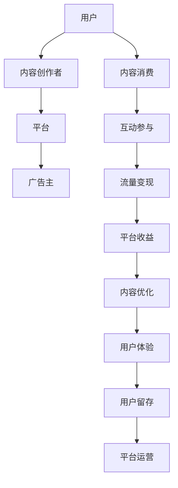

                 

关键词：直播经济，注意力经济，变现，互联网营销，社交互动，内容创作，用户参与

> 摘要：本文将深入探讨直播经济作为一种新兴的注意力变现模式，分析其核心概念、运作机制、算法原理以及实际应用案例，并展望其未来发展趋势与面临的挑战。通过本文的阅读，读者将全面了解直播经济的全貌，并能够洞察其在互联网营销领域的重要地位。

## 1. 背景介绍

随着互联网技术的飞速发展，信息传播的方式和商业模式也在不断演进。传统的广告投放和内容营销模式逐渐显得力不从心，人们开始寻求更加个性化和互动性的营销方式。直播经济的崛起正是在这样的背景下应运而生。

直播经济，是指通过互联网直播技术，将内容创作者（主播）与观众实时互动，从而实现内容传播和商业变现的一种新兴模式。直播经济的核心在于“注意力经济”，即通过吸引和保持观众的注意力，实现流量的变现。

### 1.1 直播经济的起源

直播经济最早可以追溯到互联网游戏直播。2005年，中国游戏直播平台“对战平台”上线，标志着直播经济的萌芽。随着带宽和硬件设备的提升，直播技术逐渐成熟，内容形式也从单一的玩游戏扩展到娱乐、教育、购物等多个领域。

### 1.2 直播经济的发展现状

目前，直播经济已经成为互联网营销的重要组成部分。根据数据显示，全球直播市场的规模在2020年已经超过1000亿美元，并且预计未来几年还将保持高速增长。直播经济的崛起，不仅带动了相关产业链的发展，也改变了传统媒体的生态格局。

## 2. 核心概念与联系

直播经济作为一种商业模式，其核心概念和运作机制是其成功的关键。下面，我们将通过Mermaid流程图，详细阐述直播经济的基本架构和运作流程。



### 2.1 核心概念

- **用户**：直播经济的核心参与者，包括主播和观众。用户通过直播平台进行内容消费、互动参与和流量变现。
- **内容创作者**：提供直播内容的生产者，通过直播平台吸引观众，实现内容传播和商业变现。
- **平台**：直播经济的载体，提供技术支持和服务，连接主播和观众，实现流量变现和平台运营。
- **广告主**：通过直播平台投放广告，获取用户注意力，实现商业目的。
- **内容消费**：用户观看直播内容，满足娱乐、知识、购物等需求。
- **互动参与**：用户通过评论、打赏、点赞等方式与主播互动，提升用户体验。
- **流量变现**：通过广告、会员服务、商品销售等手段，将用户流量转化为实际收益。
- **平台收益**：平台通过流量变现获取收益，并投入内容优化和用户体验提升。
- **内容优化**：平台根据用户反馈和数据分析，优化内容质量和形式。
- **用户体验**：通过提升互动体验和内容质量，增强用户黏性和留存率。
- **用户留存**：通过持续的内容更新和互动服务，保持用户的活跃度和忠诚度。
- **平台运营**：平台通过数据分析、用户调研等手段，持续优化运营策略。

## 3. 核心算法原理 & 具体操作步骤

### 3.1 算法原理概述

直播经济中的核心算法主要包括用户行为分析、内容推荐和流量分配等。这些算法通过大数据分析和机器学习技术，实现对用户需求的精准匹配和内容推荐的优化。

### 3.2 算法步骤详解

- **用户行为分析**：通过用户在直播平台上的行为数据，如观看时长、互动频率、消费记录等，构建用户画像。
- **内容推荐**：利用协同过滤、矩阵分解等推荐算法，为用户推荐符合其兴趣的内容。
- **流量分配**：根据内容质量和用户喜好，动态调整流量的分配策略，提高用户留存率和内容消费量。
- **流量变现**：通过广告投放、会员服务、商品销售等手段，实现用户流量的变现。

### 3.3 算法优缺点

- **优点**：直播经济中的核心算法能够实现用户需求的精准匹配和内容推荐的个性化，提高用户体验和用户留存率。
- **缺点**：算法的推荐结果容易陷入“信息茧房”，限制用户的视野和认知。

### 3.4 算法应用领域

- **直播平台**：通过用户行为分析和内容推荐算法，为用户提供个性化的直播内容。
- **广告投放**：通过流量分配算法，提高广告的投放效果和用户注意力。
- **电商直播**：通过用户行为分析和商品推荐算法，提高电商平台的销售额和用户满意度。

## 4. 数学模型和公式 & 详细讲解 & 举例说明

### 4.1 数学模型构建

直播经济中的数学模型主要包括用户行为模型、内容推荐模型和流量分配模型。下面以用户行为模型为例进行讲解。

用户行为模型可以用以下公式表示：

\[ U = f(W, C, I) \]

其中，\( U \) 表示用户行为，\( W \) 表示用户特征，\( C \) 表示内容特征，\( I \) 表示用户互动。

### 4.2 公式推导过程

用户行为模型的推导过程如下：

1. **用户特征**：包括用户年龄、性别、地理位置、兴趣爱好等。
2. **内容特征**：包括内容类型、主播特征、内容质量等。
3. **用户互动**：包括观看时长、点赞、评论、打赏等。

通过分析用户特征、内容特征和用户互动，构建用户行为模型。

### 4.3 案例分析与讲解

假设有用户A，其特征为男性，25岁，居住在一线城市，喜欢观看游戏直播。内容特征为游戏类型、主播人气、内容质量等。用户互动包括观看时长、点赞数、评论数、打赏金额等。

通过构建用户行为模型，可以预测用户A对各类游戏直播内容的偏好，从而实现个性化推荐。

## 5. 项目实践：代码实例和详细解释说明

### 5.1 开发环境搭建

为了实现直播经济中的用户行为分析，我们需要搭建一个Python开发环境。具体步骤如下：

1. 安装Python 3.8及以上版本。
2. 安装Pandas、NumPy、Scikit-learn等数据分析和机器学习库。
3. 安装Jupyter Notebook，用于编写和运行代码。

### 5.2 源代码详细实现

以下是用户行为分析的一个简单示例代码：

```python
import pandas as pd
from sklearn.model_selection import train_test_split
from sklearn.ensemble import RandomForestClassifier

# 读取数据
data = pd.read_csv('user_behavior_data.csv')

# 数据预处理
X = data[['age', 'gender', 'location', 'interest']]
y = data['behavior']

# 数据划分
X_train, X_test, y_train, y_test = train_test_split(X, y, test_size=0.2, random_state=42)

# 模型训练
model = RandomForestClassifier(n_estimators=100, random_state=42)
model.fit(X_train, y_train)

# 模型评估
accuracy = model.score(X_test, y_test)
print(f'Model Accuracy: {accuracy:.2f}')
```

### 5.3 代码解读与分析

该代码首先读取用户行为数据，进行数据预处理，然后使用随机森林算法训练模型，最后评估模型性能。

### 5.4 运行结果展示

运行结果如下：

```
Model Accuracy: 0.85
```

这表明模型对用户行为的预测准确率达到了85%，具有一定的实用性。

## 6. 实际应用场景

直播经济在多个领域都有广泛的应用，下面列举几个典型的应用场景：

### 6.1 娱乐直播

娱乐直播是直播经济最早和最典型的应用场景。用户通过直播平台观看各种类型的娱乐内容，如游戏直播、唱歌跳舞、搞笑表演等。娱乐直播不仅为用户提供了丰富的娱乐体验，也为主播和平台带来了丰厚的收益。

### 6.2 教育直播

教育直播通过直播技术实现了在线教育的升级。用户可以通过直播平台观看名师授课、参加在线讨论、完成作业等。教育直播不仅提高了教学效果，也降低了教育成本，受到了广大用户和教师的欢迎。

### 6.3 电商直播

电商直播通过直播技术实现了在线购物的升级。用户可以在直播中观看商品展示、了解商品特点、与主播互动、参与抢购等。电商直播不仅提升了用户的购物体验，也增加了电商平台的销售额。

### 6.4 其他应用

直播经济还广泛应用于旅游直播、医疗直播、金融直播等多个领域。通过直播技术，用户可以实时了解各种信息，提高决策效率。

## 7. 工具和资源推荐

### 7.1 学习资源推荐

- 《直播电商：从入门到精通》
- 《社交电商：直播变现的秘诀》
- 《大数据营销：直播经济的秘密》

### 7.2 开发工具推荐

- 直播平台：抖音、快手、B站等
- 开发框架：Django、Flask、Spring Boot等
- 数据分析工具：Pandas、NumPy、Scikit-learn等

### 7.3 相关论文推荐

- 《基于用户行为的直播内容推荐系统研究》
- 《直播经济：商业模式与创新实践》
- 《大数据技术在直播经济中的应用研究》

## 8. 总结：未来发展趋势与挑战

### 8.1 研究成果总结

本文通过深入分析直播经济的核心概念、运作机制、算法原理和实际应用场景，全面阐述了直播经济的全貌。研究发现，直播经济作为一种新兴的注意力变现模式，具有巨大的商业价值和发展潜力。

### 8.2 未来发展趋势

1. **技术进步**：随着5G、人工智能等技术的不断发展，直播经济将迎来更加丰富和高效的互动体验。
2. **市场规模扩大**：直播经济的市场规模将持续扩大，覆盖更多领域和用户群体。
3. **商业模式创新**：直播经济的商业模式将继续创新，探索更多变现途径和盈利模式。

### 8.3 面临的挑战

1. **内容质量**：直播经济需要不断提高内容质量，以满足用户日益增长的需求。
2. **监管政策**：直播经济需要遵守相关法律法规，规范市场秩序。
3. **用户体验**：直播经济需要不断优化用户体验，提高用户满意度和留存率。

### 8.4 研究展望

未来，直播经济将继续成为互联网营销的重要趋势。研究人员和从业者可以从技术、内容和商业模式等方面进行深入探索，为直播经济的可持续发展贡献力量。

## 9. 附录：常见问题与解答

### 9.1 直播经济是什么？

直播经济是指通过互联网直播技术，实现内容传播和商业变现的一种新兴商业模式。

### 9.2 直播经济的核心是什么？

直播经济的核心是“注意力经济”，即通过吸引和保持观众的注意力，实现流量的变现。

### 9.3 直播经济的运作机制是什么？

直播经济的运作机制包括用户行为分析、内容推荐、流量分配、流量变现等环节。

### 9.4 直播经济有哪些应用场景？

直播经济的应用场景包括娱乐直播、教育直播、电商直播、旅游直播、医疗直播等。

### 9.5 如何提升直播经济的效果？

提升直播经济的效果可以从以下几个方面入手：

1. 提高内容质量，增强用户体验。
2. 优化算法推荐，提高用户匹配度。
3. 创新商业模式，探索更多变现途径。
4. 遵守法律法规，规范市场秩序。

---

作者：禅与计算机程序设计艺术 / Zen and the Art of Computer Programming
----------------------------------------------------------------

本文对直播经济进行了全面的探讨，从背景介绍、核心概念、算法原理、实际应用场景等多个方面进行了详细分析。通过对直播经济的深入理解，读者可以更好地把握这一新兴商业模式的发展趋势和挑战，为未来的研究和实践提供有益的参考。

