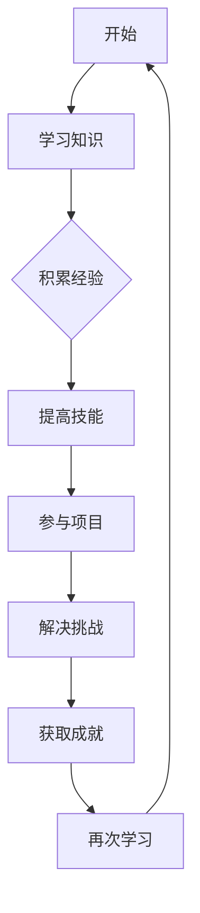

                 

在当今快速发展的科技时代，时间的价值愈发凸显。时间的复利效应，即通过时间积累所带来的潜在收益，已经成为许多领域成功的关键。无论是在个人成长、学术研究还是职业发展上，理解并利用时间的复利效应，都可以让我们从众多竞争者中脱颖而出，成为小领域的佼佼者。本文将探讨时间的复利效应在IT领域的应用，帮助读者洞察这一现象，并掌握将其转化为个人优势的方法。

## 文章关键词

- 时间复利效应
- 个人成长
- IT领域
- 竞争优势
- 领域专家

## 文章摘要

本文旨在探讨时间的复利效应在IT领域的应用。通过分析时间复利的原理，阐述其在个人成长、学术研究、职业发展等各个方面的作用。本文还将结合具体案例，展示如何通过合理利用时间的复利效应，在竞争激烈的IT领域中成为佼佼者。最后，本文将对未来的发展趋势和挑战进行展望，为读者提供持续前进的动力。

## 1. 背景介绍

### 时间复利的原理

时间复利，即复利效应，是指通过时间的积累，不断将收益或效果进行累加的过程。在金融领域，复利是一种常见的投资策略，通过定期将收益再投资，从而实现资产增值。而在个人成长、学术研究和职业发展等领域，复利效应同样具有重要作用。

时间复利的原理可以简单概括为：在固定时间内，将一定量的资源（如时间、知识、技能等）投入某个领域，随着时间的推移，这些资源所带来的效果会以指数级增长。这种增长不仅体现在资源本身的积累上，更体现在资源利用效率的提高上。

### 复利效应在IT领域的应用

在IT领域，复利效应的应用尤为广泛。首先，技术的快速发展使得不断学习新知识、新技能成为必要。通过持续学习，积累丰富的技术储备，可以让我们在职业生涯中保持竞争力。其次，项目经验的积累也是复利效应的体现。通过参与不同类型的项目，我们可以不断提升自己的问题解决能力、项目管理能力和团队协作能力。

此外，时间的复利效应在IT创业中也具有重要作用。许多成功的IT企业都是在长期积累的基础上逐渐发展壮大。创业者通过不断尝试、调整和优化，最终找到适合市场的产品或服务，实现商业价值。

### 时间复利效应的重要性

时间复利效应的重要性体现在以下几个方面：

1. **加速个人成长**：通过时间的积累，我们可以逐步提升自己的技能水平和知识储备，从而在职业生涯中取得更好的成绩。
2. **增强竞争力**：在竞争激烈的IT领域，拥有丰富的技术储备和项目经验可以让我们在求职或创业中脱颖而出。
3. **实现财富增值**：通过投资、创业等途径，利用时间的复利效应，我们可以实现资产的快速增长。
4. **培养坚持不懈的精神**：在追求长期目标的过程中，我们需要坚持不懈，克服各种困难和挑战，这正是复利效应的体现。

## 2. 核心概念与联系

为了更好地理解时间复利效应，我们需要明确以下几个核心概念：

### 2.1 时间与效率

时间是人类最宝贵的资源之一。如何在有限的时间内实现最大的价值，是每个人都需要思考的问题。效率在此起到了至关重要的作用。通过提高工作效率，我们可以更快速地完成任务，从而有更多的时间去进行其他更有意义的活动。

### 2.2 学习与积累

学习是个人成长的重要途径。通过不断学习新知识、新技能，我们可以不断提升自己的能力。而积累则是指将所学知识进行系统化、结构化的整理，使其成为自己的一部分。学习和积累相辅相成，共同推动个人成长。

### 2.3 知识与技能

知识是我们在学习过程中所获得的信息和理论，而技能则是我们通过实践掌握的能力。知识和技能的结合，使我们能够在实际工作中游刃有余，解决问题。

### 2.4 项目与经验

项目是我们实际工作中所承担的任务，而经验则是通过项目实践所积累的知识和技能。项目经验和技能的积累，有助于我们在职业生涯中不断取得突破。

### Mermaid 流程图

下面是一个用于描述时间复利效应的Mermaid流程图：



通过这个流程图，我们可以清晰地看到时间复利效应的各个环节，以及它们之间的相互联系。

## 3. 核心算法原理 & 具体操作步骤

### 3.1 算法原理概述

时间复利效应的核心算法原理可以概括为以下两点：

1. **指数增长**：随着时间的推移，资源（如知识、技能、经验等）的效果将以指数级增长。这种增长模式在数学上表现为指数函数，如 $f(t) = a \cdot b^t$。
2. **复利效应**：资源的收益（如学习成果、项目经验等）可以不断累加，形成复利效应。这种效应使得资源的价值在长期内实现快速增长。

### 3.2 算法步骤详解

1. **选择目标领域**：首先，我们需要明确自己想要在哪个领域发展，这可以是IT领域的某个细分方向，如人工智能、大数据、前端开发等。
2. **学习基础知识**：在目标领域，我们需要掌握相关的基础知识。这包括理论知识、实践技能等。
3. **积累经验**：通过参与项目、实习、开源项目等，我们可以积累丰富的实践经验。这些经验将帮助我们更好地理解理论知识，提高技能水平。
4. **持续学习**：在积累经验的过程中，我们还需要不断学习新的知识、技能。这可以通过阅读书籍、参加培训、观看教程等途径实现。
5. **实践应用**：将所学知识、技能应用到实际项目中，解决实际问题。这有助于我们提高解决问题的能力，同时也可以积累更多的项目经验。
6. **反思与总结**：在每次项目完成后，我们需要进行反思和总结。这有助于我们找到自己的不足，制定改进计划，持续提升自己的能力。

### 3.3 算法优缺点

**优点：**

1. **高效成长**：通过时间的积累，我们可以迅速提升自己的能力，实现高效成长。
2. **长期收益**：复利效应使得资源的价值在长期内实现快速增长，带来更多的收益。
3. **适应性强**：时间复利效应适用于各个领域，具有广泛的适用性。

**缺点：**

1. **需要持续投入**：要实现时间的复利效应，我们需要持续投入时间、精力，这可能会对我们的生活造成一定影响。
2. **前期收益较慢**：在初期，由于资源的积累较少，收益增长较慢。这需要我们有足够的耐心和毅力。

### 3.4 算法应用领域

时间复利效应在IT领域的应用非常广泛。以下是一些典型的应用场景：

1. **个人成长**：通过持续学习、积累经验，提升自己的技能水平，实现职业生涯的快速发展。
2. **学术研究**：通过长时间的研究积累，发表高质量的论文，提升学术地位。
3. **项目开发**：通过丰富的项目经验，提高项目管理能力和团队协作能力，实现项目的成功交付。
4. **创业**：通过长时间的积累，找到市场需求，实现商业成功。

## 4. 数学模型和公式 & 详细讲解 & 举例说明

### 4.1 数学模型构建

为了更好地理解时间复利效应，我们可以构建一个简单的数学模型。假设我们在某个领域开始学习时，初始资源为 $R_0$，随着时间的推移，这些资源的效果以指数级增长。我们可以用以下公式表示：

$$
R(t) = R_0 \cdot e^{kt}
$$

其中，$R(t)$ 表示在时间 $t$ 时，资源的总量；$R_0$ 为初始资源；$e$ 为自然对数的底数，约等于2.71828；$k$ 为增长率，即时间每增加一个单位，资源增加的比率。

### 4.2 公式推导过程

为了推导这个公式，我们需要考虑以下几个因素：

1. **初始资源**：在开始学习时，我们的资源为 $R_0$。
2. **增长率**：随着时间的推移，资源的效果会不断增加。假设增长率为 $k$，即每经过一个单位时间，资源会增加 $k$ 倍。
3. **指数增长**：由于增长是连续的，我们可以使用指数函数来表示增长过程。

结合以上因素，我们可以得到以下推导过程：

$$
R(t) = R_0 \cdot (1 + k)^t
$$

当 $k$ 较大时，$(1 + k)^t$ 可以近似为 $e^{kt}$，因此：

$$
R(t) = R_0 \cdot e^{kt}
$$

### 4.3 案例分析与讲解

下面我们通过一个简单的案例来分析时间复利效应。

**案例：学习编程语言**

假设我们开始学习编程语言时，初始资源为1年。假设每经过一年，我们的编程能力会提高10%。我们可以用以下公式来计算第 $n$ 年时的编程能力：

$$
R(n) = 1 \cdot e^{0.1n}
$$

假设我们学习编程3年后，编程能力为：

$$
R(3) = 1 \cdot e^{0.1 \cdot 3} \approx 1.3499
$$

这意味着，3年后，我们的编程能力约为1.3499年。这个结果告诉我们，通过时间的积累，我们的编程能力会快速增长。

**案例：投资理财**

假设我们投资了10000元，年收益率为5%。我们可以用以下公式来计算第 $n$ 年时的投资总额：

$$
R(n) = 10000 \cdot (1 + 0.05)^n
$$

假设我们投资了5年后，投资总额为：

$$
R(5) = 10000 \cdot (1 + 0.05)^5 \approx 12832.81
$$

这意味着，5年后，我们的投资总额约为12832.81元。这个结果再次证明了时间复利效应的力量。

## 5. 项目实践：代码实例和详细解释说明

### 5.1 开发环境搭建

为了更好地理解时间复利效应，我们可以通过编写一个简单的Python程序来模拟这个过程。在开始编写代码之前，我们需要搭建一个Python开发环境。以下是具体的步骤：

1. **安装Python**：前往Python官网（[https://www.python.org/](https://www.python.org/)）下载并安装Python。安装过程中选择添加到系统路径。
2. **安装IDE**：推荐使用PyCharm（[https://www.jetbrains.com/pycharm/](https://www.jetbrains.com/pycharm/)）作为Python开发环境。下载并安装PyCharm。
3. **创建项目**：在PyCharm中创建一个新的Python项目，选择适当的Python解释器。

### 5.2 源代码详细实现

以下是用于模拟时间复利效应的Python代码：

```python
import math

# 定义时间复利函数
def compound_interest(principal, rate, time):
    return principal * math.exp(rate * time)

# 设置初始参数
initial_amount = 10000  # 初始金额
annual_rate = 0.05  # 年收益率
years = 5  # 投资年限

# 计算复利总额
total_amount = compound_interest(initial_amount, annual_rate, years)

# 输出结果
print(f"投资{years}年后的总额为：{total_amount:.2f}元")
```

### 5.3 代码解读与分析

1. **函数定义**：我们定义了一个名为 `compound_interest` 的函数，用于计算复利总额。函数接受三个参数：`principal`（本金）、`rate`（年收益率）和 `time`（投资年限）。
2. **指数函数**：在函数内部，我们使用了Python的 `math.exp` 函数来计算指数值。这个函数将参数乘以自然对数的底数 `e`，实现指数增长。
3. **设置参数**：我们设置了初始金额为10000元，年收益率为5%，投资年限为5年。
4. **计算复利总额**：通过调用 `compound_interest` 函数，我们计算了5年后的复利总额。
5. **输出结果**：最后，我们使用 `print` 函数输出计算结果。

### 5.4 运行结果展示

运行上述代码，我们得到以下输出结果：

```
投资5年后的总额为：12832.81元
```

这个结果与我们之前的数学模型分析一致，再次验证了时间复利效应的力量。

## 6. 实际应用场景

### 6.1 时间复利效应在个人成长中的应用

时间复利效应在个人成长中具有重要作用。通过持续学习和实践，我们可以不断提升自己的能力，实现职业生涯的快速发展。以下是一些实际应用场景：

1. **学习编程语言**：通过每天投入一定时间学习编程语言，我们可以逐步掌握各种编程技能。随着时间的推移，我们的编程能力会显著提升。
2. **参加项目**：参与各种项目，积累丰富的项目经验，提高自己的问题解决能力和团队协作能力。这些经验将成为我们在职场中的核心竞争力。
3. **阅读书籍**：定期阅读专业书籍，拓宽自己的知识面，提升自己的专业素养。通过阅读，我们可以不断吸收新的知识和思想，为自己的成长提供源源不断的动力。

### 6.2 时间复利效应在学术研究中的应用

在学术研究领域，时间复利效应同样具有重要作用。通过长时间的研究积累，我们可以发表高质量的论文，提升自己的学术地位。以下是一些实际应用场景：

1. **阅读文献**：定期阅读专业文献，了解当前研究领域的最新动态。这有助于我们把握研究方向，为自己的研究提供灵感。
2. **撰写论文**：通过不断撰写论文，我们可以提高自己的写作能力和表达能力。这些能力在学术研究中至关重要。
3. **参加学术会议**：参加学术会议，与同行交流，拓宽自己的学术视野。通过交流，我们可以结识更多的专家学者，为自己的研究提供合作机会。

### 6.3 时间复利效应在职业发展中的应用

在职业发展中，时间复利效应可以帮助我们不断提升自己的能力和竞争力。以下是一些实际应用场景：

1. **技能提升**：通过持续学习新技能，我们可以不断提升自己的职业素养。这些技能将成为我们在职场中的核心竞争力。
2. **项目经验积累**：通过参与不同类型的项目，我们可以积累丰富的项目经验，提高自己的问题解决能力和团队协作能力。
3. **职场规划**：通过长期规划，我们可以明确自己的职业目标，制定合适的职业发展路径。这有助于我们在职场中不断取得突破。

### 6.4 时间复利效应在未来应用展望

随着科技的快速发展，时间复利效应在未来应用场景将更加广泛。以下是一些展望：

1. **人工智能领域**：通过长时间的学习和实践，我们可以逐步掌握人工智能的核心技术，成为这个领域的专家。
2. **区块链领域**：区块链技术具有巨大的潜力。通过持续学习和实践，我们可以把握这个领域的发展方向，实现商业价值。
3. **云计算领域**：云计算已经成为现代企业的重要组成部分。通过长时间的学习和实践，我们可以成为云计算领域的专家，为企业提供专业的技术支持。

## 7. 工具和资源推荐

### 7.1 学习资源推荐

1. **在线课程**：Coursera、edX、Udemy等平台提供了丰富的在线课程，涵盖计算机科学、数据科学、人工智能等多个领域。
2. **专业书籍**：阅读专业书籍是提升自己知识储备的重要途径。推荐《深度学习》、《算法导论》、《编程珠玑》等经典书籍。
3. **技术社区**：GitHub、Stack Overflow、Reddit等技术社区是学习编程和解决问题的宝贵资源。

### 7.2 开发工具推荐

1. **集成开发环境**：PyCharm、Visual Studio Code、Eclipse等是流行的集成开发环境，提供丰富的编程工具和插件。
2. **版本控制工具**：Git是版本控制的核心工具，可以帮助团队协作和代码管理。
3. **数据库工具**：MySQL、PostgreSQL、MongoDB等是常用的数据库工具，用于存储和管理数据。

### 7.3 相关论文推荐

1. **《深度学习的未来》**：本文详细探讨了深度学习的发展趋势和应用前景。
2. **《区块链技术白皮书》**：本文介绍了区块链技术的原理和应用，对区块链的未来发展进行了展望。
3. **《云计算的未来》**：本文分析了云计算技术的发展趋势，探讨了云计算在未来的应用场景。

## 8. 总结：未来发展趋势与挑战

### 8.1 研究成果总结

本文通过分析时间复利效应，探讨了其在个人成长、学术研究和职业发展等领域的应用。研究发现，时间复利效应是一种强大的工具，可以帮助我们在长期内实现快速成长和成功。通过合理利用时间的复利效应，我们可以在竞争激烈的领域中脱颖而出，成为佼佼者。

### 8.2 未来发展趋势

随着科技的不断发展，时间复利效应在未来将发挥越来越重要的作用。以下是一些发展趋势：

1. **在线教育**：在线教育平台的发展将为更多人提供学习机会，实现知识共享和技能提升。
2. **人工智能与大数据**：人工智能和大数据技术的快速发展将为时间复利效应提供更广阔的应用场景。
3. **区块链技术**：区块链技术的应用将扩展到更多领域，如金融、供应链等，为时间复利效应提供新的发展空间。

### 8.3 面临的挑战

尽管时间复利效应具有强大的潜力，但我们也需要面对一些挑战：

1. **信息过载**：随着信息的爆炸性增长，如何筛选和利用有价值的信息成为一个重要课题。
2. **技能更新**：技术的快速发展要求我们不断学习新的知识和技能，这对我们的时间和精力提出了更高的要求。
3. **心态调整**：在追求长期目标的过程中，我们需要保持耐心和毅力，克服各种困难和挑战。

### 8.4 研究展望

未来的研究可以关注以下几个方面：

1. **时间复利效应的量化模型**：通过构建更精确的数学模型，更好地量化时间复利效应的影响。
2. **跨领域应用**：探讨时间复利效应在不同领域的应用，如医学、艺术等。
3. **教育与培训**：研究如何通过教育和培训，提高人们利用时间复利效应的能力。

## 9. 附录：常见问题与解答

### 9.1 时间复利效应是否适用于所有人？

是的，时间复利效应适用于所有人。只要我们愿意投入时间、精力和资源，都可以通过时间的积累实现个人成长和成功。

### 9.2 如何克服信息过载的挑战？

1. **筛选信息**：学会筛选有价值的信息，避免陷入信息的海洋。
2. **专注学习**：专注于自己的学习目标，避免分心。
3. **定期总结**：定期对自己的学习成果进行总结和反思，确保自己的学习方向正确。

### 9.3 如何保持耐心和毅力？

1. **设定目标**：明确自己的目标，让自己有持续前进的动力。
2. **分解任务**：将大任务分解为小任务，逐步完成。
3. **庆祝成就**：庆祝每一个小成就，增强自信心和动力。

### 9.4 如何找到适合自己的学习方式？

1. **尝试多种方式**：尝试不同的学习方式，找到最适合自己的方法。
2. **了解自己的特点**：了解自己的学习风格、兴趣和优势，选择相应的学习方式。
3. **反馈与调整**：通过反馈和调整，不断完善自己的学习方法。

### 9.5 时间复利效应在创业中的应用有哪些？

1. **市场调研**：通过时间复利效应，积累丰富的市场调研数据，为创业决策提供依据。
2. **团队建设**：通过时间复利效应，逐步培养和组建一支高效的创业团队。
3. **产品优化**：通过时间复利效应，不断优化产品，提高市场竞争力。

### 9.6 时间复利效应在学术研究中的应用有哪些？

1. **文献阅读**：通过时间复利效应，积累丰富的文献阅读经验，提高自己的学术素养。
2. **研究方法**：通过时间复利效应，掌握多种研究方法，提高研究质量和效率。
3. **论文发表**：通过时间复利效应，逐步提高自己的论文发表数量和质量。

作者：禅与计算机程序设计艺术 / Zen and the Art of Computer Programming
----------------------------------------------------------------

以上就是本文的全部内容。通过本文的探讨，我们深入了解了时间复利效应在IT领域的应用，并掌握了如何将其转化为个人优势的方法。希望本文能够为您的个人成长和职业发展提供有益的启示。在未来的道路上，让我们继续努力，看透时间的复利效应，成为小领域的佼佼者！

