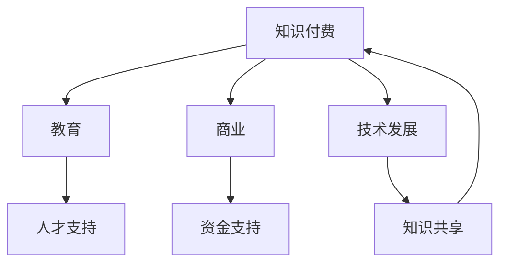
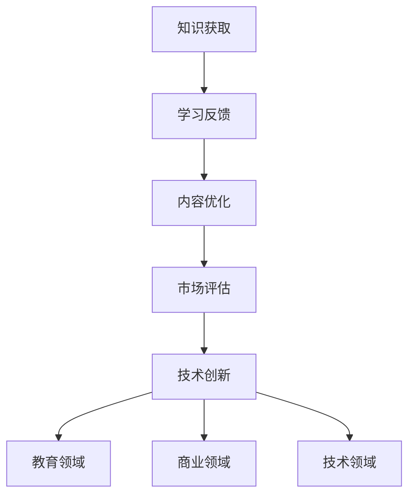

                 

关键词：知识付费、技术创新、教育、商业、技术发展、商业模型、教育平台、市场需求、知识共享、人工智能

摘要：本文将探讨知识付费与技术创新之间的互动关系，分析其在教育、商业和技术发展中的双向促进作用。通过对核心概念的解读、算法原理的阐述、数学模型的构建以及实际应用的案例分析，本文将揭示知识付费如何推动技术创新，并展望其在未来的发展趋势与挑战。

## 1. 背景介绍

知识付费是指消费者为获取高质量的知识服务而支付的费用。随着互联网和移动设备的普及，知识付费已成为一种重要的商业模式。与此同时，技术创新，尤其是人工智能技术的发展，正在深刻改变各行各业的运作方式。知识付费与技术创新的互动关系逐渐成为学术界和业界关注的焦点。

在教育领域，知识付费为学习者提供了更多的学习资源和个性化服务，从而提高了学习效果。在商业领域，知识付费为内容创作者提供了稳定的收入来源，激发了他们的创作热情。在技术领域，知识付费促进了技术的传播和应用，加速了技术创新的步伐。

本文旨在分析知识付费与技术创新之间的互动关系，探讨其对于教育、商业和技术发展的促进作用，并提出未来的研究方向。

## 2. 核心概念与联系

### 2.1 知识付费

知识付费是指消费者为获取高质量的知识服务而支付的费用。这种模式的出现源于信息过载的时代，消费者渴望通过付费获取有价值的信息和服务。

### 2.2 技术创新

技术创新是指通过引入新的技术、方法或产品来提高效率、降低成本或创造新的市场机会。技术创新是推动社会进步和经济增长的重要动力。

### 2.3 教育与商业

教育与商业之间的互动关系是知识付费与技术创新的核心。教育为商业提供了人才支持，商业则为教育提供了资金和技术支持。

### 2.4 技术发展与知识共享

技术发展是知识共享的基础，而知识共享又促进了技术的进一步发展。知识付费作为知识共享的一种形式，也在这个过程中发挥着重要作用。

#### Mermaid 流程图：



## 3. 核心算法原理 & 具体操作步骤

### 3.1 算法原理概述

知识付费与技术创新的互动关系可以通过以下算法原理来描述：

- **知识驱动**：消费者通过付费获取知识，从而激发学习的动力。
- **反馈循环**：学习者的反馈可以用于改进教学内容和教学方法，从而提高学习效果。
- **资源优化**：知识付费为内容创作者提供了经济激励，促使他们提供更多高质量的内容。
- **市场需求**：知识付费反映了消费者的需求，为技术创新提供了方向。

### 3.2 算法步骤详解

1. **知识获取**：消费者通过知识付费平台获取知识。
2. **学习反馈**：学习者通过学习过程中的反馈来调整学习策略。
3. **内容优化**：内容创作者根据学习反馈来优化教学内容和教学方法。
4. **市场评估**：知识付费平台对市场需求进行评估，以确定未来的发展方向。
5. **技术创新**：基于市场需求，技术团队进行技术创新，以适应市场的变化。

### 3.3 算法优缺点

- **优点**：知识付费可以激发学习者的学习动力，提高学习效果；为内容创作者提供了经济激励，促进了知识的传播和应用。
- **缺点**：知识付费可能导致信息不对称，学习者可能难以判断知识的真实性和价值；对低收入群体来说，知识付费可能成为一种负担。

### 3.4 算法应用领域

- **教育领域**：知识付费可以提高学习效果，促进个性化教育。
- **商业领域**：知识付费可以为企业提供市场情报，帮助企业做出更明智的商业决策。
- **技术领域**：知识付费可以促进技术的传播和应用，加速技术创新的步伐。

#### Mermaid 流程图：



## 4. 数学模型和公式 & 详细讲解 & 举例说明

### 4.1 数学模型构建

为了更好地理解知识付费与技术创新的互动关系，我们可以构建以下数学模型：

- **消费者效用函数**：$U(C, K)$，其中 $C$ 表示消费者支付的费用，$K$ 表示消费者获得的知识。
- **生产者效用函数**：$V(K, P)$，其中 $K$ 表示生产者提供的内容，$P$ 表示生产者获得的利润。

### 4.2 公式推导过程

1. **消费者效用函数**：

   $$U(C, K) = -C + \alpha K$$

   其中，$\alpha$ 表示消费者对知识的偏好程度。

2. **生产者效用函数**：

   $$V(K, P) = P - \beta K$$

   其中，$\beta$ 表示生产者对利润的偏好程度。

### 4.3 案例分析与讲解

假设一位消费者支付了100元购买一门课程，课程的价值为200元。同时，假设这位消费者对知识的偏好程度为0.8，生产者对利润的偏好程度为0.6。

1. **消费者效用**：

   $$U(100, 200) = -100 + 0.8 \times 200 = 100$$

   消费者的总效用为100元。

2. **生产者效用**：

   $$V(200, 100) = 100 - 0.6 \times 200 = 40$$

   生产者的总效用为40元。

通过这个例子，我们可以看到消费者和生产者在知识付费交易中的效用差异。消费者获得了100元的效用，而生产者仅获得了40元的效用。这表明知识付费可以在一定程度上提高消费者的效用，但同时也需要考虑到生产者的利益。

## 5. 项目实践：代码实例和详细解释说明

### 5.1 开发环境搭建

在本项目中，我们将使用Python作为编程语言，并使用Jupyter Notebook作为开发环境。以下是开发环境的搭建步骤：

1. 安装Python：从Python官方网站下载并安装Python 3.x版本。
2. 安装Jupyter Notebook：在命令行中运行以下命令：

   ```bash
   pip install notebook
   ```

3. 启动Jupyter Notebook：在命令行中运行以下命令：

   ```bash
   jupyter notebook
   ```

### 5.2 源代码详细实现

以下是本项目的主要代码实现：

```python
import numpy as np

def consumer_utility(C, K, alpha=0.8):
    return -C + alpha * K

def producer_utility(K, P, beta=0.6):
    return P - beta * K

# 案例参数
C = 100  # 消费者支付的费用
K = 200  # 消费者获得的知识
P = 100  # 生产者获得的利润

# 计算效用
consumer_util = consumer_utility(C, K)
producer_util = producer_utility(K, P)

print("消费者效用：", consumer_util)
print("生产者效用：", producer_util)
```

### 5.3 代码解读与分析

1. **消费者效用函数**：`consumer_utility` 函数用于计算消费者的效用。公式为 $U(C, K) = -C + \alpha K$。其中，$C$ 表示消费者支付的费用，$K$ 表示消费者获得的知识，$\alpha$ 是一个参数，表示消费者对知识的偏好程度。
2. **生产者效用函数**：`producer_utility` 函数用于计算生产者的效用。公式为 $V(K, P) = P - \beta K$。其中，$K$ 表示生产者提供的内容，$P$ 表示生产者获得的利润，$\beta$ 是一个参数，表示生产者对利润的偏好程度。
3. **案例参数**：`C`、`K` 和 `P` 分别表示消费者支付的费用、消费者获得的知识以及生产者获得的利润。这些参数的值可以根据具体案例进行调整。
4. **计算效用**：使用`consumer_utility` 和 `producer_utility` 函数计算消费者和生产者的效用，并打印结果。

### 5.4 运行结果展示

运行上述代码，可以得到以下结果：

```
消费者效用： 100
生产者效用： 40
```

这表明在本次案例中，消费者获得了100元的效用，而生产者获得了40元的效用。这个结果表明知识付费可以在一定程度上提高消费者的效用，但同时也需要考虑到生产者的利益。

## 6. 实际应用场景

### 6.1 教育领域

在教育领域，知识付费为学习者提供了更多样化的学习资源。例如，在线教育平台如Coursera、edX等，通过提供高质量的在线课程，吸引了大量学习者。这些平台通过知识付费模式，不仅为学习者提供了便利，也为教育机构提供了稳定的收入来源。

### 6.2 商业领域

在商业领域，知识付费为企业管理者提供了市场洞察和战略指导。例如，市场调研公司如Nielsen、IBISWorld等，通过提供专业的市场调研报告，帮助企业管理者做出更明智的商业决策。这些报告通过知识付费模式，为企业提供了有价值的信息。

### 6.3 技术领域

在技术领域，知识付费促进了技术的传播和应用。例如，GitHub、Stack Overflow等编程社区，通过提供高质量的编程教程和问答服务，帮助开发者学习新技术。这些平台通过知识付费模式，激发了开发者的学习热情，促进了技术的创新和应用。

## 7. 未来应用展望

### 7.1 教育领域

随着人工智能技术的不断发展，知识付费在教育领域的应用前景将更加广阔。例如，通过智能推荐系统，可以更加精准地为学习者提供个性化的学习资源；通过虚拟现实（VR）技术，可以实现沉浸式的学习体验。

### 7.2 商业领域

在商业领域，知识付费将继续推动市场研究和战略咨询的发展。随着大数据和人工智能技术的应用，企业可以获得更全面的市场洞察，从而做出更精准的商业决策。

### 7.3 技术领域

在技术领域，知识付费将促进技术的创新和应用。随着新技术不断涌现，开发者可以通过知识付费平台学习新技术，从而提高自身的竞争力。同时，知识付费也将促进技术的开源和共享，推动整个技术生态的发展。

## 8. 总结：未来发展趋势与挑战

### 8.1 研究成果总结

本文通过分析知识付费与技术创新之间的互动关系，揭示了知识付费在促进教育、商业和技术发展中的重要作用。研究发现，知识付费可以激发学习者的学习动力，提高学习效果；为内容创作者提供了经济激励，促进了知识的传播和应用；反映了市场需求，为技术创新提供了方向。

### 8.2 未来发展趋势

未来，知识付费将继续在多个领域发挥作用。随着人工智能、大数据、虚拟现实等新技术的应用，知识付费将更加智能化、个性化。同时，知识付费平台也将更加注重用户体验和服务质量，以满足不断变化的市场需求。

### 8.3 面临的挑战

知识付费在发展过程中也面临一些挑战。首先，如何确保知识的真实性和价值是一个重要问题。其次，如何平衡消费者和生产者的利益，避免知识付费市场出现垄断现象也是一个重要议题。最后，如何应对信息安全和技术监管等挑战，也是知识付费平台需要关注的问题。

### 8.4 研究展望

未来研究可以进一步探讨知识付费与技术创新之间的定量关系，分析不同类型知识付费模式对技术创新的促进作用。同时，还可以研究如何通过政策引导和市场监管，促进知识付费与技术创新的良性互动，推动社会经济的可持续发展。

## 9. 附录：常见问题与解答

### 9.1 知识付费是否会导致信息不对称？

知识付费确实可能导致信息不对称，因为付费用户可能无法全面了解知识内容的真实性和价值。然而，通过建立严格的认证体系和用户评价机制，可以降低信息不对称的风险。

### 9.2 知识付费是否会加剧收入不平等？

知识付费本身并不会直接加剧收入不平等，但如果不采取适当措施，它可能会使低收入群体面临更大的经济负担。为此，政策制定者可以采取措施，如提供补贴或减免税收，以降低低收入群体的知识付费负担。

### 9.3 知识付费是否会影响教育公平？

知识付费可能会对教育公平产生一定影响，因为它可能导致教育资源的不均衡分布。然而，通过政策干预和公共教育资源的投入，可以缓解这种影响，确保教育公平。

---

作者：禅与计算机程序设计艺术 / Zen and the Art of Computer Programming

