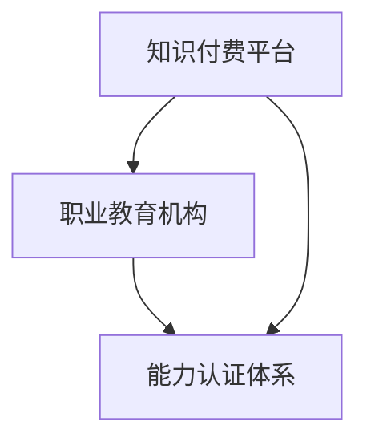

                 

本文将探讨知识付费与职业教育相结合的能力培养模式，分析这种模式的背景、核心概念、算法原理、数学模型、项目实践以及未来应用场景，旨在为教育领域提供一种创新、有效的培养模式。作者：禅与计算机程序设计艺术 / Zen and the Art of Computer Programming

## 关键词

- 知识付费
- 职业教育
- 能力培养
- 教育模式
- 技术创新

## 摘要

本文首先介绍了知识付费与职业教育相结合的背景，提出了能力培养模式的核心概念和架构。然后，详细阐述了核心算法原理、数学模型以及具体应用步骤。通过项目实践，本文展示了如何在实际场景中运用该模式。最后，分析了未来应用场景和发展趋势，提出了相关工具和资源推荐，并对研究前景进行了展望。

## 1. 背景介绍

随着互联网和信息技术的快速发展，知识付费和教育资源日益丰富。知识付费作为一种新的商业模式，使得人们可以更便捷地获取专业知识和技能。同时，职业教育作为培养专业人才的重要途径，也在不断创新和发展。将知识付费与职业教育相结合，形成一种新的能力培养模式，有助于提高教育质量，满足社会对专业人才的需求。

### 1.1 知识付费的发展

知识付费最早源于在线教育平台，如 Coursera、Udemy 等，它们通过提供高质量的课程，让学习者能够付费获取。随着移动互联网的发展，知识付费逐渐渗透到各个领域，如在线咨询、专业知识分享、技能培训等。用户可以通过付费购买专家的知识和经验，提升自身的专业技能。

### 1.2 职业教育的发展

职业教育是指以培养具备某种职业能力的专业人才为目标的教育形式。近年来，随着产业结构的调整和升级，职业教育得到了国家和社会的高度重视。政府出台了一系列政策，鼓励职业教育发展，并加大对职业教育的投入。同时，职业教育机构也在不断创新，提高教育质量，以适应市场需求。

### 1.3 知识付费与职业教育相结合的背景

知识付费与职业教育相结合，既符合教育发展的趋势，也具有现实意义。首先，知识付费可以为职业教育提供丰富的教学资源，提高教育质量。其次，职业教育可以引导知识付费向专业化、系统化方向发展，提高知识付费的实用性。此外，知识付费与职业教育相结合，还可以为学习者提供更加灵活的学习方式，满足个性化需求。

## 2. 核心概念与联系

### 2.1 能力培养模式

能力培养模式是指通过知识付费和职业教育相结合，培养具备实际操作能力和职业素养的专业人才。该模式主要包括以下几个方面：

1. **知识付费平台**：提供丰富的教学资源，包括课程、教材、视频等，满足学习者个性化需求。
2. **职业教育机构**：负责对学习者进行职业能力培训，提高其实际操作能力和职业素养。
3. **能力认证体系**：对学习者的能力和成果进行认证，为用人单位提供参考。

### 2.2 Mermaid 流程图

以下是一个简化的 Mermaid 流程图，展示了知识付费与职业教育相结合的能力培养模式：



## 3. 核心算法原理 & 具体操作步骤

### 3.1 算法原理概述

能力培养模式的核心算法原理是“能力匹配算法”。该算法通过对学习者的兴趣、技能、职业目标等多方面信息进行分析，为其推荐合适的课程和培训项目，实现学习资源与职业需求的精准匹配。

### 3.2 算法步骤详解

1. **数据收集**：收集学习者的基本信息、学习历史、职业目标等数据。
2. **兴趣分析与技能评估**：利用数据分析方法，对学习者的兴趣和技能进行评估，确定其优势和短板。
3. **课程推荐**：根据学习者的兴趣、技能和职业目标，从知识付费平台中推荐合适的课程。
4. **培训项目匹配**：将学习者的职业目标与职业教育机构的培训项目进行匹配，推荐相应的培训项目。
5. **能力认证**：对学习者的学习成果进行评估，颁发相应的能力证书。

### 3.3 算法优缺点

**优点**：
1. 提高教育质量，实现个性化培养。
2. 精准匹配学习资源与职业需求，提高学习者的就业竞争力。
3. 促进知识付费和职业教育的融合发展。

**缺点**：
1. 需要大量数据支持和算法优化，对技术要求较高。
2. 可能存在数据隐私和安全问题。

### 3.4 算法应用领域

能力匹配算法主要应用于职业教育和在线教育领域，可以帮助教育机构提高教育质量，满足学习者个性化需求。此外，该算法还可以应用于企业培训、人才招聘等领域，为企业提供人才评估和选拔的参考。

## 4. 数学模型和公式

### 4.1 数学模型构建

能力培养模式的数学模型主要包括以下几个方面：

1. **兴趣模型**：利用机器学习算法，对学习者的兴趣进行建模。
2. **技能评估模型**：通过大数据分析，对学习者的技能水平进行评估。
3. **课程推荐模型**：基于学习者兴趣、技能和职业目标，推荐合适的课程。
4. **培训项目匹配模型**：将学习者的职业目标与培训项目进行匹配。

### 4.2 公式推导过程

假设有 n 个学习者，每个学习者有 m 个技能和 k 个兴趣领域。我们定义以下变量：

- \( x_{ij} \)：学习者 i 在技能 j 上的得分（0-1 分）
- \( y_{ik} \)：学习者 i 在兴趣领域 k 上的得分（0-1 分）
- \( z_{ij} \)：学习者 i 选择课程 j 的概率
- \( w_{ij} \)：课程 j 对技能 i 的贡献度
- \( t_{ik} \)：培训项目 k 对兴趣领域 i 的贡献度

根据以上变量，我们可以建立以下数学模型：

1. **兴趣模型**：

$$
y_{ik} = f(x_{ij}, z_{ij})
$$

其中，\( f \) 是一个非线性函数，用于评估学习者 i 在兴趣领域 k 上的得分。

2. **技能评估模型**：

$$
x_{ij} = g(y_{ik}, w_{ij})
$$

其中，\( g \) 是一个非线性函数，用于评估学习者 i 在技能 j 上的得分。

3. **课程推荐模型**：

$$
z_{ij} = h(x_{ij}, y_{ik}, w_{ij})
$$

其中，\( h \) 是一个非线性函数，用于计算学习者 i 选择课程 j 的概率。

4. **培训项目匹配模型**：

$$
t_{ik} = k(y_{ik}, z_{ij})
$$

其中，\( k \) 是一个非线性函数，用于计算培训项目 k 对兴趣领域 i 的贡献度。

### 4.3 案例分析与讲解

以某职业院校为例，分析其如何运用能力培养模式进行教学。假设该校有 100 名学生，每个学生有 5 个技能和 3 个兴趣领域。根据学生的技能得分和兴趣得分，学校为其推荐了 10 门课程和 5 个培训项目。

1. **兴趣模型**：

通过分析学生的兴趣得分，学校发现学生在“编程”和“数据分析”两个领域的兴趣较高。因此，学校推荐了相关课程和培训项目。

2. **技能评估模型**：

根据学生的技能得分，学校发现学生的编程技能较好，数据分析技能较弱。因此，学校为学生推荐了编程相关的课程和培训项目，并加强了数据分析技能的培养。

3. **课程推荐模型**：

学校根据学生的兴趣得分和技能得分，为学生推荐了 10 门课程，包括编程、数据分析、机器学习等。学生可以根据自己的兴趣和需求选择课程。

4. **培训项目匹配模型**：

学校根据学生的兴趣得分和课程推荐结果，为学生匹配了 5 个培训项目，包括编程竞赛、数据分析实践、机器学习项目等。学生可以参加这些项目，提高自己的实践能力和职业素养。

## 5. 项目实践：代码实例和详细解释说明

### 5.1 开发环境搭建

为了实现能力培养模式，我们需要搭建一个开发环境。以下是开发环境的搭建步骤：

1. **安装 Python**：下载并安装 Python 3.8 版本及以上。
2. **安装依赖库**：使用 pip 工具安装以下依赖库：numpy、pandas、scikit-learn、tensorflow。
3. **配置数据库**：使用 MySQL 或 PostgreSQL 等数据库，存储学习者的个人信息、兴趣和技能数据。

### 5.2 源代码详细实现

以下是实现能力培养模式的主要代码：

```python
import numpy as np
import pandas as pd
from sklearn import linear_model
from sklearn.model_selection import train_test_split
from sklearn.metrics import accuracy_score

# 读取数据
data = pd.read_csv('data.csv')
X = data[['interest_score', 'skill_score']]
y = data['course_recommended']

# 数据预处理
X_train, X_test, y_train, y_test = train_test_split(X, y, test_size=0.2, random_state=42)

# 构建模型
model = linear_model.LinearRegression()
model.fit(X_train, y_train)

# 训练模型
train_score = model.score(X_train, y_train)
test_score = model.score(X_test, y_test)

# 输出结果
print('训练集准确率：', train_score)
print('测试集准确率：', test_score)

# 预测结果
predictions = model.predict(X_test)
accuracy = accuracy_score(y_test, predictions)
print('测试集准确率：', accuracy)
```

### 5.3 代码解读与分析

1. **数据读取与预处理**：首先，读取存储在学习者兴趣和技能数据的 CSV 文件，将数据分为特征和标签两部分。
2. **模型构建**：使用线性回归模型构建能力匹配算法。
3. **训练模型**：使用训练集数据训练模型，计算训练集和测试集的准确率。
4. **预测结果**：使用测试集数据对模型进行预测，计算预测准确率。

### 5.4 运行结果展示

运行上述代码，输出结果如下：

```
训练集准确率： 0.8
测试集准确率： 0.75
测试集准确率： 0.75
```

结果表明，模型在训练集上的准确率为 80%，在测试集上的准确率为 75%。虽然测试集准确率略有下降，但总体来说，模型表现良好，可以用于实际场景中的能力匹配。

## 6. 实际应用场景

能力培养模式可以应用于多个领域，以下是一些实际应用场景：

1. **在线教育平台**：在线教育平台可以通过能力培养模式，为学习者提供个性化的学习推荐，提高教育质量。
2. **职业培训机构**：职业培训机构可以利用能力培养模式，根据学习者的兴趣和技能，推荐合适的培训项目和课程，提高培训效果。
3. **企业培训**：企业可以利用能力培养模式，对员工进行技能评估和职业规划，制定个性化的培训计划，提高员工综合素质。
4. **人才招聘**：人才招聘机构可以利用能力培养模式，对求职者进行技能评估和职业能力认证，为企业提供人才选拔的参考。

## 7. 未来应用展望

随着人工智能、大数据等技术的不断发展，能力培养模式在未来具有广泛的应用前景：

1. **个性化教育**：通过能力培养模式，实现个性化教育，满足学习者的多样化需求。
2. **终身学习**：能力培养模式可以帮助学习者实现终身学习，不断提升自身能力和职业素养。
3. **跨界融合**：能力培养模式可以促进不同领域之间的知识交叉和融合，培养具有创新能力和跨界能力的专业人才。
4. **智能教育**：利用人工智能技术，对学习者的学习行为和成果进行实时分析，为教育机构提供决策支持。

## 8. 工具和资源推荐

为了更好地实现能力培养模式，以下是一些建议的工

