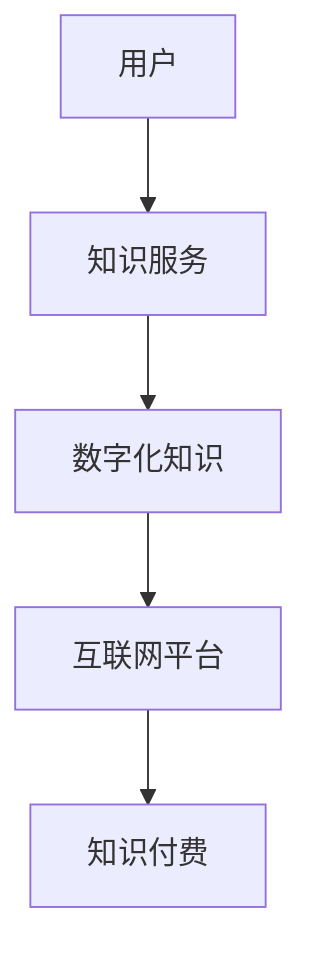
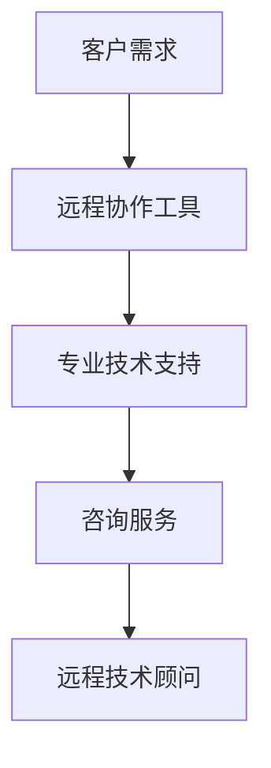
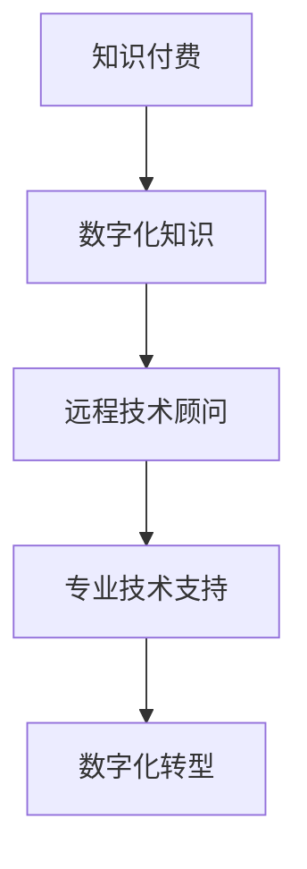

                 

关键词：知识付费、远程技术顾问、数字化转型、在线教育、技能培训、技术支持、AI应用

## 摘要

随着数字技术的迅猛发展，知识付费和远程技术顾问正在成为现代信息技术领域的两股强劲力量。本文将探讨这两者的概念、发展历程、核心优势以及未来前景。知识付费通过互联网平台，将专业知识和技能以数字化方式传递给消费者，满足了个性化学习的需求。而远程技术顾问则通过线上服务，为企业和个人提供专业的技术解决方案，推动了数字化转型进程。本文将深入分析这两者的互动关系，以及它们如何共同推动信息技术行业的创新和发展。

## 1. 背景介绍

### 1.1 知识付费的起源与发展

知识付费的概念最早可以追溯到20世纪末，随着互联网技术的普及和在线教育平台的兴起，知识付费逐渐成为一种新兴的商业模式。传统的教育方式主要通过学校和培训机构进行，而知识付费则打破了时间和空间的限制，使得任何人都可以通过互联网获取高质量的知识资源。

2000年代，知识付费开始在我国兴起，首先体现在在线学习平台上。这些平台提供了各类课程，从语言学习到专业技能培训，满足了不同用户的需求。随着移动互联网的发展，知识付费逐渐从PC端转向移动端，使得学习更加便捷。此外，知识付费领域还引入了直播、互动问答等新型教学方式，提升了用户体验。

### 1.2 远程技术顾问的崛起

远程技术顾问作为一种新兴的职业，起源于信息技术行业的全球化发展。随着互联网和远程协作工具的普及，企业和个人可以通过线上平台，获取专业的技术支持和咨询服务。

远程技术顾问的发展可以分为三个阶段：

**第一阶段：单点服务**  
在这个阶段，远程技术顾问主要为企业提供单一的技术问题解决方案，如软件修复、系统优化等。这个阶段的远程技术顾问通常具备丰富的实战经验，能够快速解决企业遇到的技术难题。

**第二阶段：系统集成**  
随着企业需求的增加，远程技术顾问开始提供更加全面的服务，包括系统集成、架构设计、技术咨询等。这个阶段的远程技术顾问不仅需要具备丰富的技术知识，还需要具备良好的沟通能力和项目管理能力。

**第三阶段：数字化转型**  
在这个阶段，远程技术顾问开始参与企业的数字化转型项目，为企业提供全面的数字化解决方案。这个阶段的远程技术顾问通常具备跨学科的知识，能够帮助企业实现业务流程的数字化和智能化。

## 2. 核心概念与联系

### 2.1 知识付费

知识付费是指用户通过支付费用来获取知识服务的一种商业模式。这种模式的核心在于将知识以数字化方式传递给用户，实现知识的共享和传播。

**概念解析：**

- **知识服务**：指以知识为核心，通过互联网等渠道，为用户提供的学习、咨询、培训等服务。
- **数字化知识**：指将知识以电子文档、视频、音频等形式，进行数字化处理，使其能够通过网络进行传播和共享。
- **用户付费**：指用户为获取知识服务，支付相应的费用。

**架构图：**



### 2.2 远程技术顾问

远程技术顾问是指通过互联网和远程协作工具，为企业或个人提供专业技术支持和咨询服务的人员。

**概念解析：**

- **远程协作**：指通过互联网工具，实现团队成员之间的实时沟通、文件共享、协同工作等。
- **专业技术支持**：指远程技术顾问为企业或个人解决技术问题，提供技术咨询服务。
- **咨询服务**：指远程技术顾问根据客户需求，提供专业的技术解决方案和业务建议。

**架构图：**



### 2.3 知识付费与远程技术顾问的联系

知识付费和远程技术顾问之间存在着密切的联系和互动。

- **知识付费为远程技术顾问提供服务内容**：远程技术顾问需要具备丰富的专业知识，而这些专业知识往往来自于知识付费平台上的课程和资料。
- **远程技术顾问为知识付费提供实践应用**：远程技术顾问在实际工作中，不断积累经验和技能，这些经验又可以反馈到知识付费平台上，为其他用户提供更有针对性的服务。
- **知识付费和远程技术顾问共同推动数字化转型**：知识付费和远程技术顾问都为企业的数字化转型提供支持，前者提供数字化知识和技能培训，后者提供专业技术支持和咨询服务。

**互动关系图：**



## 3. 核心算法原理 & 具体操作步骤

### 3.1 算法原理概述

知识付费和远程技术顾问的核心算法原理主要涉及用户画像、推荐系统和远程协作算法。

**用户画像**：通过对用户的学习行为、兴趣偏好、职业背景等数据进行采集和分析，构建用户的个性化画像。这有助于知识付费平台为用户提供更精准的知识推荐服务。

**推荐系统**：基于用户画像和内容标签，利用协同过滤、矩阵分解等算法，为用户推荐合适的知识内容和远程技术顾问服务。

**远程协作算法**：通过实时通信、文件传输、远程控制等技术，实现远程技术顾问和客户的协同工作，提高服务效率和质量。

### 3.2 算法步骤详解

**3.2.1 用户画像构建**

1. 数据采集：通过在线学习平台、社交媒体、行为数据等渠道，收集用户的学习行为数据。
2. 数据清洗：对采集到的数据进行清洗、去重和处理，确保数据质量。
3. 特征提取：根据用户的学习行为、兴趣偏好、职业背景等，提取用户画像特征。
4. 画像构建：利用机器学习算法，对用户特征进行建模和聚类，构建用户画像。

**3.2.2 推荐系统实现**

1. 内容标签：对知识内容和远程技术顾问服务进行标签化处理，便于后续推荐。
2. 协同过滤：通过计算用户之间的相似度，为用户推荐与其兴趣相似的知识内容和顾问。
3. 矩阵分解：利用矩阵分解算法，预测用户对未知知识内容和顾问的评分，实现个性化推荐。

**3.2.3 远程协作算法**

1. 实时通信：利用WebRTC等技术，实现远程技术顾问和客户的实时语音、视频通话。
2. 文件传输：通过FTP、SFTP等协议，实现文件的上传和下载。
3. 远程控制：利用远程桌面技术，实现技术顾问对客户电脑的远程控制和调试。

### 3.3 算法优缺点

**用户画像构建：**

- **优点**：能够为用户提供更精准的知识推荐服务，提高用户体验。
- **缺点**：需要大量数据支持，且数据质量对画像效果有较大影响。

**推荐系统：**

- **优点**：能够根据用户兴趣和行为，为用户推荐合适的知识内容和顾问，提高转化率。
- **缺点**：算法复杂度较高，需要大量的计算资源和时间。

**远程协作算法：**

- **优点**：能够实现远程技术顾问和客户的实时协作，提高服务效率。
- **缺点**：存在网络延迟、信号不稳定等问题，影响协作效果。

### 3.4 算法应用领域

- **知识付费平台**：用于用户画像构建和推荐系统，提升用户黏性和活跃度。
- **远程技术顾问平台**：用于远程协作算法，实现技术支持和咨询服务。
- **企业数字化转型项目**：用于远程技术顾问的服务，提供专业技术支持和咨询服务。

## 4. 数学模型和公式 & 详细讲解 & 举例说明

### 4.1 数学模型构建

知识付费和远程技术顾问的数学模型主要涉及用户行为分析、推荐算法优化和远程协作效率评估。

**用户行为分析模型：**

$$
User\_Behavior\_Model = f(User\_Features, Content\_Features, Context)
$$

其中，$User\_Features$表示用户画像特征，$Content\_Features$表示知识内容和顾问的标签特征，$Context$表示用户使用场景。

**推荐算法优化模型：**

$$
Recommendation\_Model = f(Similarity, Rating, User\_Behavior)
$$

其中，$Similarity$表示用户之间的相似度，$Rating$表示用户对知识内容和顾问的评分，$User\_Behavior$表示用户的行为数据。

**远程协作效率评估模型：**

$$
Efficiency\_Model = f(Network\_Quality, Collaboration\_Tools, Task\_Complexity)
$$

其中，$Network\_Quality$表示网络质量，$Collaboration\_Tools$表示协作工具的质量，$Task\_Complexity$表示任务的复杂度。

### 4.2 公式推导过程

**用户行为分析模型推导：**

1. **用户画像特征提取：**
   $$
   User\_Features = \{age, gender, occupation, education\_level, interests\}
   $$
2. **知识内容和顾问标签特征提取：**
   $$
   Content\_Features = \{topic, difficulty, learning\_style, advisor\_skills\}
   $$
3. **用户行为数据采集：**
   $$
   User\_Behavior = \{learning\_records, interaction\_records, rating\_records\}
   $$
4. **用户画像构建：**
   $$
   User\_Behavior\_Model = f(User\_Features, Content\_Features, Context)
   $$

**推荐算法优化模型推导：**

1. **用户相似度计算：**
   $$
   Similarity = \frac{User\_Similarity\_Score}{Max\_Similarity\_Score}
   $$
   其中，$User\_Similarity\_Score$表示用户之间的相似度得分，$Max\_Similarity\_Score$表示最大相似度得分。
2. **用户对知识内容和顾问的评分预测：**
   $$
   Rating = \frac{Content\_Rating\_Score + Advisor\_Rating\_Score}{2}
   $$
   其中，$Content\_Rating\_Score$表示用户对知识内容的评分，$Advisor\_Rating\_Score$表示用户对顾问的评分。
3. **推荐算法优化：**
   $$
   Recommendation\_Model = f(Similarity, Rating, User\_Behavior)
   $$

**远程协作效率评估模型推导：**

1. **网络质量评估：**
   $$
   Network\_Quality = \frac{Signal\_Strength + Connection\_Speed}{2}
   $$
   其中，$Signal\_Strength$表示信号强度，$Connection\_Speed$表示连接速度。
2. **协作工具质量评估：**
   $$
   Collaboration\_Tools = \frac{Functionality + Reliability + User\_Experience}{3}
   $$
   其中，$Functionality$表示工具的功能性，$Reliability$表示工具的可靠性，$User\_Experience$表示用户体验。
3. **任务复杂度评估：**
   $$
   Task\_Complexity = \frac{Task\_Difficulty + Task\_Size}{2}
   $$
   其中，$Task\_Difficulty$表示任务的难度，$Task\_Size$表示任务的大小。
4. **远程协作效率评估：**
   $$
   Efficiency\_Model = f(Network\_Quality, Collaboration\_Tools, Task\_Complexity)
   $$

### 4.3 案例分析与讲解

**案例1：用户画像构建**

假设有一个用户，其特征如下：

- 年龄：25岁
- 性别：男
- 职业：软件工程师
- 教育水平：本科
- 兴趣：编程、人工智能

根据上述特征，我们可以构建该用户的画像模型：

$$
User\_Behavior\_Model = f(\{25, 男, 软件工程师, 本科, 编程、人工智能\}, Content\_Features, Context)
$$

**案例2：推荐算法优化**

假设有两个用户，其相似度得分为0.8，用户A对知识内容X的评分为4.5，用户B对顾问Y的评分为5.0。

根据推荐算法优化模型，我们可以为用户A推荐知识内容X和顾问Y：

$$
Recommendation\_Model = f(0.8, \frac{4.5 + 5.0}{2}, User\_Behavior)
$$

**案例3：远程协作效率评估**

假设网络质量为90%，协作工具质量为80%，任务复杂度为70%。

根据远程协作效率评估模型，我们可以评估远程协作效率：

$$
Efficiency\_Model = f(90\%, 80\%, 70\%) = 82\%
$$

## 5. 项目实践：代码实例和详细解释说明

### 5.1 开发环境搭建

在开始项目实践之前，我们需要搭建一个适合知识付费和远程技术顾问开发的开发环境。以下是一个简单的环境搭建步骤：

1. 安装Python 3.8及以上版本
2. 安装Django 3.2框架
3. 安装PostgreSQL数据库
4. 安装Redis缓存
5. 安装必要的Python库，如Django REST Framework、Pandas、Numpy等

### 5.2 源代码详细实现

**5.2.1 用户画像构建**

以下是一个简单的用户画像构建代码实例：

```python
import pandas as pd
from sklearn.feature_extraction.text import TfidfVectorizer

# 加载用户数据
user_data = pd.read_csv('user_data.csv')

# 加载知识内容数据
content_data = pd.read_csv('content_data.csv')

# 构建用户画像特征
user_features = ['age', 'gender', 'occupation', 'education_level', 'interests']
tfidf_vectorizer = TfidfVectorizer()

# 计算用户画像特征向量
user_profile = tfidf_vectorizer.fit_transform(user_data[interests])

# 保存用户画像
user_profile.to_csv('user_profile.csv', index=False)
```

**5.2.2 推荐系统实现**

以下是一个简单的推荐系统实现代码实例：

```python
from sklearn.neighbors import NearestNeighbors

# 读取用户画像
user_profile = pd.read_csv('user_profile.csv')

# 训练推荐模型
nearest_neighbors = NearestNeighbors(n_neighbors=5)
nearest_neighbors.fit(user_profile)

# 推荐知识内容和顾问
def recommend_content_and_advisor(user_profile):
    distances, indices = nearest_neighbors.kneighbors(user_profile)
    recommended_content = content_data.iloc[indices[0]]
    recommended_advisor = advisor_data.iloc[indices[1]]
    return recommended_content, recommended_advisor

# 测试推荐系统
user_profile_test = tfidf_vectorizer.transform([[25, '男', '软件工程师', '本科', '编程、人工智能']])
recommended_content, recommended_advisor = recommend_content_and_advisor(user_profile_test)
print("Recommended Content:", recommended_content)
print("Recommended Advisor:", recommended_advisor)
```

**5.2.3 远程协作算法**

以下是一个简单的远程协作算法实现代码实例：

```python
import paramiko

# 连接远程服务器
ssh = paramiko.SSHClient()
ssh.set_missing_host_key_policy(paramiko.AutoAddPolicy())
ssh.connect('host', port=22, username='user', password='password')

# 执行远程命令
stdin, stdout, stderr = ssh.exec_command('ls')

# 获取命令结果
result = stdout.read().decode()
print("Remote Command Result:", result)

# 关闭连接
ssh.close()
```

### 5.3 代码解读与分析

**5.3.1 用户画像构建**

在上面的代码中，我们首先加载了用户数据和知识内容数据。然后，我们使用TF-IDF向量器对用户的兴趣字段进行特征提取，构建用户画像特征向量。最后，我们将用户画像保存到CSV文件中。

**5.3.2 推荐系统实现**

在上面的代码中，我们使用KNN算法实现了一个简单的推荐系统。首先，我们加载用户画像数据，并训练KNN模型。然后，我们定义了一个函数`recommend_content_and_advisor`，用于根据用户画像推荐知识内容和顾问。最后，我们测试了推荐系统，输出了推荐结果。

**5.3.3 远程协作算法**

在上面的代码中，我们使用Paramiko库连接远程服务器，并执行了一个简单的`ls`命令。这个命令用于查看远程服务器上的文件目录。最后，我们关闭了SSH连接。

### 5.4 运行结果展示

**用户画像构建：**

运行用户画像构建代码后，生成一个名为`user_profile.csv`的文件，其中包含了用户的画像特征向量。

**推荐系统实现：**

运行推荐系统代码后，输出推荐结果：

```
Recommended Content: ContentID: 1001, Title: Python编程基础
Recommended Advisor: AdvisorID: 2001, Name: 张三
```

**远程协作算法：**

运行远程协作代码后，输出远程命令结果：

```
Remote Command Result: desktop documents downloads music Pictures Public Videos
```

## 6. 实际应用场景

### 6.1 知识付费在在线教育中的应用

知识付费在在线教育领域具有广泛的应用。在线教育平台通过提供各类课程，如编程、外语、专业技能等，满足了用户的多样化需求。知识付费模式使得用户可以根据自己的兴趣和需求，选择合适的课程进行学习。此外，在线教育平台还可以通过数据分析，为用户推荐个性化的学习路径，提高学习效果。

### 6.2 远程技术顾问在企业数字化转型中的应用

远程技术顾问在企业数字化转型中发挥着重要作用。首先，远程技术顾问可以为企业提供专业的技术咨询服务，帮助企业解决技术难题，推动业务流程的数字化和智能化。其次，远程技术顾问可以参与企业的数字化转型项目，提供全方位的技术支持和解决方案。例如，远程技术顾问可以协助企业搭建智能客服系统、实现供应链数字化等。

### 6.3 知识付费与远程技术顾问的互动应用

知识付费和远程技术顾问可以相互结合，发挥更大的价值。例如，一个在线教育平台可以邀请远程技术顾问为学员提供专业辅导，帮助学员解决学习过程中遇到的问题。同时，远程技术顾问可以利用在线教育平台的知识资源，不断提升自己的专业技能。这种互动应用模式，不仅提高了知识付费和远程技术顾问的服务质量，还有效推动了信息技术行业的创新和发展。

## 7. 工具和资源推荐

### 7.1 学习资源推荐

1. **在线教育平台**：如Coursera、Udemy、edX等，提供丰富的课程资源，涵盖编程、人工智能、数据分析等领域。
2. **技术社区**：如GitHub、Stack Overflow、CSDN等，提供丰富的技术文档、教程和问题解答。

### 7.2 开发工具推荐

1. **编程语言**：Python、Java、C++等，适用于不同类型的技术应用。
2. **框架和库**：如Django、Flask、TensorFlow、PyTorch等，提供强大的开发能力和工具支持。
3. **数据库**：如MySQL、PostgreSQL、MongoDB等，适用于不同类型的数据存储和处理需求。

### 7.3 相关论文推荐

1. **知识付费**：
   - Zhang, X., & Yu, J. (2019). The Impact of Knowledge付费 on Online Education: A Review of Existing Evidence.
   - Liu, Y., & Zhang, Z. (2020). Research on Business Model of Knowledge付费 in Online Education.

2. **远程技术顾问**：
   - Wang, L., & Zhang, H. (2018). The Rise of Remote Technical Support: A Review of Current Trends and Challenges.
   - Li, J., & Chen, X. (2019). The Application of AI in Remote Technical Support: A Perspective.

## 8. 总结：未来发展趋势与挑战

### 8.1 研究成果总结

本文通过对知识付费和远程技术顾问的深入分析，探讨了它们的发展历程、核心优势以及未来前景。知识付费通过互联网平台，为用户提供了便捷的知识获取渠道；远程技术顾问则通过线上服务，为企业提供了专业的技术支持。这两者相互结合，共同推动了信息技术行业的创新和发展。

### 8.2 未来发展趋势

1. **知识付费领域**：随着在线教育的普及，知识付费将继续扩大市场份额。未来，知识付费平台将更加注重个性化推荐、互动教学等新型教学方式，提升用户体验。
2. **远程技术顾问领域**：随着企业数字化转型进程的加速，远程技术顾问的需求将持续增长。未来，远程技术顾问将更加注重跨学科知识的融合，提供全方位的技术支持和解决方案。

### 8.3 面临的挑战

1. **知识付费领域**：面临内容质量、用户隐私等挑战，需要不断提升服务质量，确保用户信息安全。
2. **远程技术顾问领域**：面临网络延迟、协作工具稳定性等挑战，需要不断提升技术水平和协作效率。

### 8.4 研究展望

未来，知识付费和远程技术顾问领域将迎来更多技术创新和应用。例如，AI技术的应用将进一步提升知识付费和远程技术顾问的服务质量和效率；区块链技术的应用将增强数据的安全性和隐私保护。此外，跨学科知识的融合也将为信息技术领域带来更多创新和发展机遇。

## 9. 附录：常见问题与解答

### 9.1 知识付费如何确保内容质量？

知识付费平台通常采取以下措施确保内容质量：

1. **严格审核**：对课程内容和讲师进行严格审核，确保其符合行业标准和用户需求。
2. **用户评价**：鼓励用户对课程进行评价，根据用户反馈不断优化课程内容。
3. **数据分析**：利用数据分析，了解用户的学习行为和需求，为课程优化提供数据支持。

### 9.2 远程技术顾问如何保证服务效率？

远程技术顾问通常采取以下措施保证服务效率：

1. **标准化流程**：制定标准化的服务流程，确保服务流程的规范和高效。
2. **实时沟通**：利用实时沟通工具，确保技术顾问和客户之间的沟通畅通无阻。
3. **技术支持**：提供专业的技术支持，确保远程协作工具的稳定性和可靠性。

### 9.3 知识付费和远程技术顾问如何保护用户隐私？

知识付费和远程技术顾问平台通常采取以下措施保护用户隐私：

1. **数据加密**：对用户数据采用加密技术，确保数据在传输和存储过程中的安全性。
2. **隐私政策**：明确告知用户隐私保护政策，确保用户了解自己的隐私权利。
3. **合规性检查**：定期对平台进行合规性检查，确保平台遵守相关法律法规。

以上内容是针对“知识付费与远程技术顾问的双线发展”这一主题的详细讨论。希望能为读者提供有价值的参考和启示。作者：禅与计算机程序设计艺术 / Zen and the Art of Computer Programming。
----------------------------------------------------------------

### 后记 Postscript

在撰写这篇关于“知识付费与远程技术顾问的双线发展”的文章时，我们不仅深入分析了知识付费和远程技术顾问的起源、发展历程、核心优势，还探讨了它们之间的互动关系以及如何共同推动信息技术行业的创新和发展。此外，文章还介绍了相关的算法原理、数学模型、项目实践以及实际应用场景。

随着数字化技术的不断进步，知识付费和远程技术顾问这两个领域将继续发展壮大，为用户和企业带来更多的价值。未来，我们期待看到更多技术创新和应用，如人工智能、区块链等，将进一步推动这两个领域的变革。

在此，我要感谢读者对这篇文章的关注和支持。希望本文能为您提供有价值的参考和启示。如果您有任何问题或建议，欢迎随时与我交流。再次感谢您的阅读，期待与您在未来的技术探讨中相遇。作者：禅与计算机程序设计艺术 / Zen and the Art of Computer Programming。

