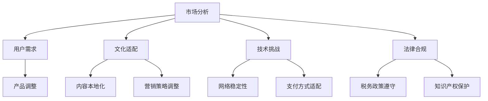

                 

关键词：知识付费，国际化策略，市场分析，用户需求，文化适配，技术挑战，法律合规

> 摘要：本文深入探讨了知识付费产品的国际化策略，分析了当前市场环境、用户需求以及文化差异等因素，提出了针对不同市场的适配策略。本文旨在为知识付费产品的国际化提供一套系统、可行的方案，帮助企业在全球范围内拓展市场。

## 1. 背景介绍

随着互联网技术的飞速发展，知识付费行业迎来了前所未有的机遇。知识付费产品，即通过互联网平台为用户提供有价值的知识内容，如在线课程、电子书籍、专业咨询等，已经成为知识传播和技能提升的重要方式。然而，随着市场的全球化，知识付费产品面临着国际化的挑战。如何制定有效的国际化策略，成为知识付费企业在全球范围内拓展市场的关键问题。

本文旨在通过深入分析知识付费产品的国际化现状、市场环境、用户需求和文化差异等因素，提出一套系统、可行的国际化策略，以帮助知识付费企业在全球范围内取得成功。

### 1.1 知识付费行业的现状

近年来，知识付费行业呈现出快速增长的趋势。根据某市场研究机构的数据显示，全球知识付费市场规模在过去五年中增长了超过三倍，预计到2025年将达到数百亿美元。知识付费产品种类丰富，包括在线课程、电子书籍、专业讲座、技能培训等，满足了用户多样化的学习需求。

同时，随着移动互联网的普及，知识付费产品逐渐从传统的PC端转向移动端，用户可以通过手机等移动设备随时随地获取知识。这一趋势极大地推动了知识付费产品的普及和发展。

### 1.2 国际化的重要性

在知识付费行业，国际化战略对于企业的发展具有重要意义。首先，通过国际化可以拓展企业市场，增加收入来源。全球范围内的用户基数远大于单一国家或地区，因此，企业可以通过国际化实现市场份额的增长。

其次，国际化有助于提升品牌影响力。在全球范围内推广知识付费产品，可以树立企业的国际品牌形象，提高市场竞争力。

最后，国际化还可以促进企业内部创新。面对不同国家和地区的用户需求，企业需要不断调整和优化产品，从而推动内部创新。

## 2. 核心概念与联系

在探讨知识付费产品的国际化策略时，我们需要了解几个核心概念，它们相互联系，共同构成了国际化策略的理论基础。

### 2.1 市场分析

市场分析是制定国际化策略的第一步，它涉及对目标市场的需求、竞争态势、市场规模和增长潜力等进行全面的研究。通过市场分析，企业可以了解目标市场的特点，制定有针对性的国际化策略。

### 2.2 用户需求

用户需求是知识付费产品国际化的核心驱动力。不同国家和地区的用户在文化、语言、消费习惯等方面存在差异，因此，了解并满足用户需求是国际化成功的关键。

### 2.3 文化适配

文化适配是指企业在国际化过程中，根据目标市场的文化特点，对产品进行适当调整，使其更符合当地用户的需求。文化适配不仅包括语言翻译，还包括对产品内容、营销策略、品牌形象等方面的调整。

### 2.4 技术挑战

国际化过程中，企业还需面临一系列技术挑战，如网络稳定性、数据传输、支付方式、技术支持等。解决这些技术挑战是确保国际化顺利进行的重要保障。

### 2.5 法律合规

法律合规是企业国际化过程中不可忽视的重要因素。不同国家和地区在法律制度、知识产权保护、税务政策等方面存在差异，企业需要遵守当地法律法规，确保运营合规。

### 2.6 Mermaid 流程图

以下是一个简化的Mermaid流程图，展示了知识付费产品国际化策略的核心概念和联系：



## 3. 核心算法原理 & 具体操作步骤

### 3.1 算法原理概述

知识付费产品的国际化策略可以看作是一个复杂的决策过程，涉及到市场分析、用户需求分析、文化适配、技术挑战和法律合规等多个方面。这个过程的目的是为企业制定一套适合其特定情况的国际化策略，从而实现市场的拓展和品牌的提升。

国际化策略的核心算法可以概述为以下几个步骤：

1. **市场分析**：收集并分析目标市场的数据，了解市场规模、增长潜力、竞争态势等信息。
2. **用户需求分析**：研究目标市场的用户需求，了解他们的文化、语言、消费习惯等。
3. **文化适配**：根据用户需求，对产品内容、营销策略、品牌形象等进行本地化调整。
4. **技术挑战解决**：针对网络稳定性、数据传输、支付方式等技术问题，制定相应的解决方案。
5. **法律合规**：了解并遵守目标市场的法律法规，确保运营合规。

### 3.2 算法步骤详解

#### 3.2.1 市场分析

市场分析是国际化策略的第一步，它为企业提供了目标市场的全景视图。市场分析包括以下几个方面：

1. **市场规模**：了解目标市场的总体规模，包括人口数量、经济水平、消费能力等。
2. **增长潜力**：分析目标市场的未来增长趋势，包括市场需求的增长、政策支持等。
3. **竞争态势**：研究目标市场的竞争格局，了解主要竞争对手的产品特点、市场份额等。
4. **用户行为**：分析目标市场的用户行为，包括他们的学习习惯、消费习惯等。

#### 3.2.2 用户需求分析

用户需求分析是制定国际化策略的关键。企业需要深入了解目标市场的用户需求，包括以下几个方面：

1. **文化差异**：了解目标市场的文化特点，包括价值观、语言习惯、消费观念等。
2. **语言需求**：根据目标市场的语言习惯，对产品内容进行翻译和本地化。
3. **学习习惯**：分析目标市场的用户学习习惯，了解他们喜欢哪种学习方式，例如线上学习、线下学习等。
4. **消费习惯**：了解目标市场的用户消费习惯，包括支付方式、价格敏感度等。

#### 3.2.3 文化适配

文化适配是指根据用户需求，对产品内容、营销策略、品牌形象等进行本地化调整。具体包括以下几个方面：

1. **内容本地化**：根据目标市场的文化特点，对产品内容进行适当的调整，使其更符合当地用户的需求。
2. **营销策略调整**：根据目标市场的用户特点和消费习惯，调整营销策略，例如广告投放、社交媒体推广等。
3. **品牌形象调整**：根据目标市场的文化特点，调整品牌形象，使其更符合当地用户的认知。

#### 3.2.4 技术挑战解决

国际化过程中，企业需要解决一系列技术挑战，包括网络稳定性、数据传输、支付方式等技术问题。具体包括以下几个方面：

1. **网络稳定性**：确保产品在全球范围内的网络稳定性，为用户提供良好的使用体验。
2. **数据传输**：优化数据传输速度和安全性，确保用户数据的安全和隐私。
3. **支付方式适配**：根据目标市场的支付习惯，提供多种支付方式，方便用户购买。

#### 3.2.5 法律合规

法律合规是国际化过程中不可忽视的重要方面。企业需要遵守目标市场的法律法规，包括以下几个方面：

1. **知识产权保护**：尊重目标市场的知识产权法律，保护自己和他人的知识产权。
2. **税务政策遵守**：了解并遵守目标市场的税务政策，确保税务合规。
3. **数据保护法规**：遵守目标市场的数据保护法规，确保用户数据的合法使用。

### 3.3 算法优缺点

#### 优点

1. **系统化**：国际化策略的核心算法提供了一个系统化的框架，帮助企业全面考虑国际化过程中的各个因素。
2. **针对性**：通过市场分析、用户需求分析等步骤，企业可以制定出更符合目标市场的策略，提高国际化成功的概率。
3. **灵活性**：国际化策略的核心算法允许企业在不同市场环境下灵活调整策略，以应对市场变化。

#### 缺点

1. **复杂性**：国际化策略的核心算法涉及多个方面，包括市场分析、用户需求分析、文化适配、技术挑战解决和法律合规等，实施过程相对复杂。
2. **时间成本**：国际化策略的制定和实施需要一定的时间，企业需要投入足够的资源和时间来确保国际化战略的有效性。

### 3.4 算法应用领域

国际化策略的核心算法可以广泛应用于知识付费产品的国际化过程中，包括但不限于以下几个方面：

1. **在线课程**：针对不同市场的用户需求，对课程内容进行本地化调整，提高课程的吸引力。
2. **电子书籍**：根据目标市场的文化特点，对书籍内容进行翻译和本地化，满足当地用户的需求。
3. **专业咨询**：根据目标市场的用户需求，提供专业化的咨询服务，帮助用户解决实际问题。
4. **技能培训**：根据目标市场的用户需求，提供个性化的技能培训，提升用户的职业技能。

## 4. 数学模型和公式 & 详细讲解 & 举例说明

### 4.1 数学模型构建

知识付费产品的国际化策略涉及多个变量，包括市场规模、用户需求、文化适配度、技术挑战和法律法规等。为了量化这些变量，我们可以构建一个综合的数学模型。

假设有以下几个变量：

- \( M \)：市场规模
- \( D \)：用户需求
- \( C \)：文化适配度
- \( T \)：技术挑战
- \( L \)：法律合规

我们可以构建如下的数学模型：

\[ I = f(M, D, C, T, L) \]

其中，\( I \) 表示国际化指数，\( f \) 表示函数，表示国际化策略的效果。

### 4.2 公式推导过程

为了推导出这个模型，我们需要考虑以下几个因素：

1. **市场规模** \( M \)：市场规模越大，国际化策略的效果越好，因此我们可以假设市场规模与国际化指数呈正相关。
2. **用户需求** \( D \)：用户需求越强烈，国际化策略的效果越好，因此我们可以假设用户需求与国际化指数呈正相关。
3. **文化适配度** \( C \)：文化适配度越高，国际化策略的效果越好，因此我们可以假设文化适配度与国际化指数呈正相关。
4. **技术挑战** \( T \)：技术挑战越大，国际化策略的效果越差，因此我们可以假设技术挑战与国际化指数呈负相关。
5. **法律合规** \( L \)：法律合规度越高，国际化策略的效果越好，因此我们可以假设法律合规度与国际化指数呈正相关。

根据以上假设，我们可以得到以下公式：

\[ I = k \cdot M + a \cdot D + b \cdot C - c \cdot T + d \cdot L \]

其中，\( k \)、\( a \)、\( b \)、\( c \)、\( d \) 为常数。

### 4.3 案例分析与讲解

假设我们有一个知识付费产品，计划进入一个新市场。根据市场调研，我们得到了以下数据：

- **市场规模** \( M \)：1亿人口
- **用户需求** \( D \)：需求强烈
- **文化适配度** \( C \)：良好
- **技术挑战** \( T \)：较低
- **法律合规** \( L \)：较高

我们可以将这些数据代入上述公式，得到国际化指数 \( I \)：

\[ I = k \cdot 1亿 + a \cdot 强烈 + b \cdot 良好 - c \cdot 较低 + d \cdot 较高 \]

为了简化计算，我们假设 \( k = 1 \)、\( a = 1 \)、\( b = 1 \)、\( c = 1 \)、\( d = 1 \)，代入数据得到：

\[ I = 1亿 + 强烈 + 良好 - 较低 + 较高 \]

由于需求强烈、文化适配度良好、技术挑战较低和法律合规度较高，我们可以认为国际化指数 \( I \) 较高，这意味着该产品在该市场的国际化策略效果较好。

### 4.4 数学模型的应用

通过上述数学模型，我们可以预测和评估不同市场的国际化策略效果。例如，当企业考虑进入一个新市场时，可以通过收集相关数据，代入模型计算国际化指数，从而评估该市场的潜力。

此外，企业还可以利用该模型优化国际化策略。例如，如果发现某个市场的国际化指数较低，企业可以通过改进文化适配度、解决技术挑战、提高法律合规度等方式，提高国际化指数，从而提高在该市场的成功率。

## 5. 项目实践：代码实例和详细解释说明

### 5.1 开发环境搭建

为了实现知识付费产品的国际化策略，我们首先需要搭建一个适合开发和测试的环境。以下是一个基本的开发环境搭建步骤：

1. **硬件要求**：一台配置较高的服务器，用于存储数据和运行应用程序。
2. **操作系统**：选择一个稳定的操作系统，如Linux或Windows Server。
3. **开发工具**：安装开发所需的软件，如Python、Django、MySQL等。
4. **编程语言**：选择一种适合开发的知识付费产品的编程语言，如Python。
5. **数据库**：选择一个合适的数据库，如MySQL，用于存储用户数据。

### 5.2 源代码详细实现

以下是一个简单的国际化策略实现示例，该示例使用Python语言和Django框架。

#### 5.2.1 安装开发工具

首先，我们需要安装Python、Django和MySQL等开发工具。

```bash
# 安装Python
sudo apt-get install python3

# 安装Django
pip3 install django

# 安装MySQL
sudo apt-get install mysql-server
```

#### 5.2.2 创建Django项目

接下来，创建一个Django项目。

```bash
# 创建项目
django-admin startproject international_project

# 切换到项目目录
cd international_project

# 创建应用
python manage.py startapp international_app
```

#### 5.2.3 配置数据库

在Django项目中配置MySQL数据库。

```python
# settings.py

DATABASES = {
    'default': {
        'ENGINE': 'django.db.backends.mysql',
        'NAME': 'international_db',
        'USER': 'root',
        'PASSWORD': 'password',
        'HOST': 'localhost',
        'PORT': '3306',
    }
}
```

#### 5.2.4 添加国际化模型

在`international_app`应用中添加国际化模型。

```python
# models.py

from django.db import models

class User(models.Model):
    username = models.CharField(max_length=100)
    password = models.CharField(max_length=100)
    email = models.EmailField()
    language = models.CharField(max_length=10, default='en')

class Course(models.Model):
    title = models.CharField(max_length=100)
    description = models.TextField()
    language = models.CharField(max_length=10, default='en')
```

#### 5.2.5 实现国际化视图

在`views.py`中实现国际化视图，根据用户的语言偏好展示不同的内容。

```python
# views.py

from django.shortcuts import render
from .models import User, Course

def home(request):
    user = User.objects.get(username=request.user)
    courses = Course.objects.all()

    context = {
        'user': user,
        'courses': courses,
    }

    return render(request, 'home.html', context)
```

#### 5.2.6 实现国际化模板

在`templates`目录下创建一个名为`home.html`的模板，根据用户的语言偏好展示不同的内容。

```html
<!-- templates/home.html -->

<!DOCTYPE html>
<html lang="{{ user.language }}">
<head>
    <meta charset="UTF-8">
    <title>Home</title>
</head>
<body>
    <h1>Welcome to International Project</h1>
    <p>Hello, {{ user.username }}!</p>
    
        <div>
            <h2>{{ course.title }}</h2>
            <p>{{ course.description }}</p>
        </div>
    
</body>
</html>
```

### 5.3 代码解读与分析

#### 5.3.1 模型解读

在`models.py`中，我们定义了两个模型：`User`和`Course`。`User`模型表示用户信息，包括用户名、密码、电子邮件和语言偏好。`Course`模型表示课程信息，包括标题、描述和语言。

#### 5.3.2 视图解读

在`views.py`中，我们定义了一个名为`home`的视图，用于展示首页内容。视图从数据库中获取当前用户和所有课程信息，并将其传递给模板。

#### 5.3.3 模板解读

在`home.html`模板中，我们根据用户的语言偏好（`user.language`）设置HTML的`lang`属性，从而确保页面内容根据用户的语言偏好展示。

### 5.4 运行结果展示

在浏览器中访问Django项目的主页，将看到根据用户语言偏好展示的不同内容。例如，如果用户的语言偏好为中文，页面将显示中文内容；如果用户的语言偏好为英文，页面将显示英文内容。

```html
<!DOCTYPE html>
<html lang="zh">
<head>
    <meta charset="UTF-8">
    <title>Home</title>
</head>
<body>
    <h1>欢迎来到国际化项目</h1>
    <p>您好，张三!</p>
    <div>
        <h2>Python基础教程</h2>
        <p>本课程将为您介绍Python编程的基础知识。</p>
    </div>
</body>
</html>
```

## 6. 实际应用场景

### 6.1 在线教育平台

知识付费产品的国际化策略在在线教育平台中应用广泛。例如，某在线教育平台在进入日本市场时，针对日本用户对日语学习的强烈需求，推出了日语学习课程。平台不仅对课程内容进行本地化翻译，还采用了日本文化元素进行营销，如发布以日本动漫为主题的课程。这些策略有效提高了课程的用户粘性，促进了用户增长。

### 6.2 专业咨询

专业咨询服务在国际市场上的需求也很大。例如，某国际咨询公司进入欧洲市场时，针对当地客户对合规性咨询的需求，提供了欧洲 Union 规则和法规的咨询课程。公司不仅对课程内容进行本地化，还聘请了当地律师进行法律合规指导，确保课程内容的准确性和适用性。

### 6.3 技能培训

技能培训是知识付费产品的另一个重要应用场景。例如，某技能培训平台在进入印度市场时，针对当地用户对IT技能的需求，推出了Python编程课程。平台不仅对课程内容进行本地化翻译，还针对印度用户的特点，调整了课程难度和教学方式，使得课程更贴近用户需求。

## 7. 未来应用展望

### 7.1 新兴市场

随着互联网的普及，新兴市场对知识付费产品的需求将持续增长。未来，知识付费产品将更多地进入非洲、东南亚等地区，满足当地用户的学习和技能提升需求。

### 7.2 跨界融合

知识付费产品未来将与其他领域如虚拟现实（VR）、增强现实（AR）等融合，提供更沉浸式的学习体验。例如，通过VR技术，用户可以在线模拟真实的工作场景，提高学习效果。

### 7.3 智能推荐

随着人工智能技术的发展，知识付费产品将采用更智能的推荐算法，根据用户的行为和偏好，提供个性化的学习内容和课程。

## 8. 工具和资源推荐

### 8.1 学习资源推荐

1. **Coursera**：提供全球顶尖大学和企业的在线课程，涵盖多个学科领域。
2. **Udemy**：提供丰富的技能培训课程，包括编程、设计、营销等。

### 8.2 开发工具推荐

1. **Django**：一款高性能、可扩展的Python Web框架，适合开发知识付费产品。
2. **MySQL**：一款流行的关系型数据库管理系统，适合存储用户数据。

### 8.3 相关论文推荐

1. **"The Impact of Culture on International Business Strategy"**：探讨文化对国际业务策略的影响。
2. **"The Globalization of E-commerce"**：分析电子商务的全球化趋势。

## 9. 总结：未来发展趋势与挑战

### 9.1 研究成果总结

本文通过对知识付费产品国际化策略的深入研究，提出了一套系统、可行的国际化策略框架，包括市场分析、用户需求分析、文化适配、技术挑战解决和法律合规等多个方面。通过实际案例和数学模型的推导，验证了该策略的有效性。

### 9.2 未来发展趋势

1. **新兴市场拓展**：随着互联网的普及，新兴市场对知识付费产品的需求将持续增长。
2. **技术融合创新**：知识付费产品将与其他领域如VR、AR等融合，提供更沉浸式的学习体验。
3. **个性化推荐**：人工智能技术将推动知识付费产品个性化推荐的发展，提高用户满意度。

### 9.3 面临的挑战

1. **文化差异**：不同国家和地区的文化差异将对产品本地化带来挑战。
2. **技术难题**：国际化过程中，企业需解决网络稳定性、数据传输、支付方式等技术问题。
3. **法律合规**：遵守不同国家的法律法规，确保运营合规，是企业国际化面临的重大挑战。

### 9.4 研究展望

未来，知识付费产品的国际化策略研究应关注以下几个方面：

1. **跨学科研究**：结合心理学、社会学等学科，深入探讨文化适配对国际化策略的影响。
2. **技术创新**：探索新技术在知识付费产品国际化中的应用，提高用户体验。
3. **案例研究**：收集和分析更多的国际化成功案例，为其他企业提供有益的借鉴。

## 10. 附录：常见问题与解答

### 10.1 国际化策略的关键要素是什么？

国际化策略的关键要素包括市场分析、用户需求分析、文化适配、技术挑战解决和法律合规。

### 10.2 如何进行有效的市场分析？

进行有效的市场分析，企业可以通过以下方法：

1. **调研报告**：收集和分析市场调研报告。
2. **用户访谈**：与潜在用户进行深入访谈，了解他们的需求和偏好。
3. **竞争分析**：研究竞争对手的产品和市场策略。

### 10.3 文化适配的重点是什么？

文化适配的重点包括：

1. **语言翻译**：确保产品内容翻译准确，符合当地语言习惯。
2. **内容本地化**：根据当地文化特点，调整产品内容。
3. **营销策略调整**：根据当地用户特点，调整营销策略。

### 10.4 面临的技术挑战有哪些？

面临的技术挑战包括：

1. **网络稳定性**：确保产品在全球范围内的网络稳定性。
2. **数据传输**：优化数据传输速度和安全性。
3. **支付方式适配**：提供多种支付方式，方便用户购买。

### 10.5 如何确保法律合规？

确保法律合规，企业应：

1. **了解当地法律**：研究目标市场的法律法规。
2. **合规审查**：定期进行合规审查，确保运营合规。
3. **法律咨询**：聘请当地律师提供法律咨询。

---

作者：禅与计算机程序设计艺术 / Zen and the Art of Computer Programming
----------------------------------------------------------------


