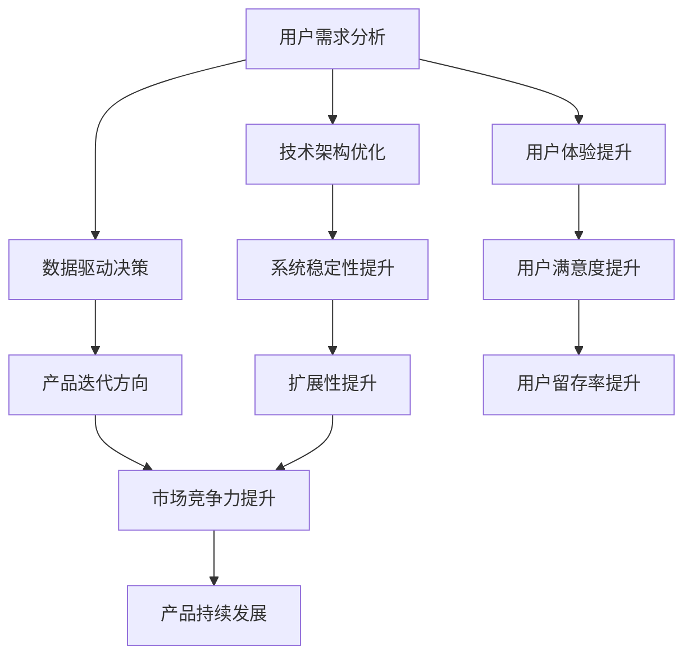

                 

关键词：知识付费、产品更新、维护、用户体验、技术支持

> 摘要：本文将探讨知识付费产品在持续更新与维护中的关键要素，包括用户需求分析、技术架构优化、数据驱动决策和用户体验提升等方面。通过深入分析，本文旨在为知识付费产品的持续发展提供有效的指导。

## 1. 背景介绍

随着互联网技术的飞速发展，知识付费行业逐渐成为了一个蓬勃发展的领域。知识付费产品，如在线课程、专业书籍、学习社群等，已经成为许多人获取知识的重要渠道。这些产品以其灵活、便捷、专业等特点吸引了大量用户，市场潜力巨大。然而，随着用户需求的不断变化和市场竞争的加剧，知识付费产品的持续更新与维护变得尤为重要。

### 1.1 行业现状

当前，知识付费市场呈现出多元化、细分化的趋势。各类知识付费产品层出不穷，涵盖了从职业技能培训到兴趣爱好拓展的广泛领域。用户对于知识付费产品的需求也日益多样化，不仅追求知识的深度和广度，更加注重学习体验和效果。因此，如何持续更新与维护知识付费产品，以满足用户需求、提高用户满意度，成为知识付费产品运营的重要课题。

### 1.2 持续更新与维护的重要性

持续更新与维护对于知识付费产品的长期发展具有至关重要的作用。首先，它能够帮助产品保持竞争力，吸引并留住用户。其次，通过不断优化产品功能和技术架构，可以提高产品的稳定性和性能，为用户提供更好的学习体验。最后，持续更新与维护还能够帮助产品团队深入了解用户需求，为后续的产品迭代提供有力支持。

## 2. 核心概念与联系

### 2.1 用户需求分析

用户需求分析是知识付费产品持续更新与维护的基础。通过用户调研、数据分析等方法，深入了解用户的学习需求、使用习惯和痛点，可以为产品的更新和优化提供有力依据。用户需求分析不仅包括对现有用户的需求理解，还应该关注潜在用户的需求变化，以便及时调整产品方向。

### 2.2 技术架构优化

技术架构优化是保证知识付费产品稳定性和性能的关键。随着用户数量的增加和业务复杂度的提升，技术架构需要不断迭代和优化。例如，通过引入微服务架构、分布式存储等技术，可以提高产品的扩展性和容错性。同时，技术架构的优化还需要关注系统的可维护性和可扩展性，以降低后期维护成本。

### 2.3 数据驱动决策

数据驱动决策是知识付费产品持续更新与维护的重要手段。通过收集和分析用户数据、市场数据等，可以识别产品的优势和不足，为产品更新和优化提供数据支持。例如，通过用户行为分析，可以了解用户在产品中的活跃度和流失率，从而优化产品功能和界面设计，提高用户留存率。

### 2.4 用户体验提升

用户体验提升是知识付费产品持续更新与维护的核心目标。通过不断优化产品的功能、性能和界面设计，可以提高用户的满意度和使用体验。用户体验的提升不仅包括功能上的优化，还应该关注用户的情感需求，例如通过提供个性化推荐、学习激励等功能，增强用户的学习兴趣和动力。

### 2.5 Mermaid 流程图

以下是一个简化的知识付费产品持续更新与维护的 Mermaid 流程图，展示了各个核心概念之间的联系：



## 3. 核心算法原理 & 具体操作步骤

### 3.1 算法原理概述

在知识付费产品的持续更新与维护中，核心算法原理主要涉及以下几个方面：

1. **用户行为分析**：通过机器学习算法对用户的行为数据进行挖掘和分析，识别用户的兴趣点和学习习惯。
2. **推荐系统**：基于用户行为数据和内容特征，构建推荐系统，为用户提供个性化的学习内容。
3. **性能优化**：通过算法优化和系统架构调整，提高产品的性能和稳定性。
4. **用户体验评估**：利用用户反馈和量化指标，评估产品的用户体验，为后续优化提供依据。

### 3.2 算法步骤详解

1. **用户行为分析**
   - **数据收集**：收集用户在产品中的行为数据，如浏览记录、学习时长、互动行为等。
   - **特征提取**：对用户行为数据进行分析，提取出与用户兴趣和学习习惯相关的特征。
   - **建模与训练**：利用机器学习算法，如聚类、分类等，对用户行为数据进行建模和训练，得到用户兴趣模型。

2. **推荐系统**
   - **内容特征提取**：对知识付费产品中的学习内容进行分析，提取出与内容相关的特征。
   - **推荐算法**：基于用户兴趣模型和内容特征，使用推荐算法，如协同过滤、基于内容的推荐等，生成个性化推荐列表。

3. **性能优化**
   - **系统监控**：通过监控系统性能指标，如响应时间、并发量等，识别性能瓶颈。
   - **算法优化**：对现有算法进行优化，如提高算法效率、减少计算复杂度等。
   - **架构调整**：根据性能优化需求，调整系统架构，如引入缓存、分布式计算等。

4. **用户体验评估**
   - **用户反馈收集**：通过用户调研、问卷等方式，收集用户对产品的反馈。
   - **量化指标**：基于用户行为数据和反馈，定义用户体验量化指标，如用户留存率、学习效率等。
   - **评估与优化**：利用评估结果，对产品进行优化，提高用户体验。

### 3.3 算法优缺点

1. **用户行为分析**
   - **优点**：能够深入了解用户需求，为产品优化提供有力支持。
   - **缺点**：数据收集和处理较为复杂，对算法和数据处理能力要求较高。

2. **推荐系统**
   - **优点**：能够提高用户粘性和学习效果，增加用户满意度。
   - **缺点**：推荐结果可能存在偏差，需要不断优化和调整。

3. **性能优化**
   - **优点**：提高系统性能和稳定性，为用户提供更好的学习体验。
   - **缺点**：优化过程复杂，需要持续投入时间和资源。

4. **用户体验评估**
   - **优点**：能够及时识别用户需求和问题，为产品优化提供实时反馈。
   - **缺点**：评估结果可能受到主观因素的影响，需要结合其他指标综合判断。

### 3.4 算法应用领域

核心算法原理在知识付费产品的各个领域都有广泛应用：

1. **在线教育**：通过用户行为分析和推荐系统，提高学习效果和用户粘性。
2. **专业培训**：通过性能优化和用户体验评估，提升培训质量和用户满意度。
3. **知识库建设**：通过数据驱动决策，优化知识库结构和内容，提高知识获取效率。

## 4. 数学模型和公式 & 详细讲解 & 举例说明

### 4.1 数学模型构建

在知识付费产品的持续更新与维护中，常用的数学模型包括用户行为模型、推荐模型和性能模型等。

1. **用户行为模型**
   - **用户兴趣模型**：用户兴趣模型用于预测用户的兴趣偏好。假设用户兴趣可以用向量表示，则用户兴趣模型可以表示为：
     $$ u_i = (u_{i1}, u_{i2}, ..., u_{in}) $$
     其中，$ u_{ij} $ 表示用户 $ i $ 对于特征 $ j $ 的兴趣度。

   - **用户行为预测模型**：用户行为预测模型用于预测用户未来的行为。常见的模型包括回归模型、分类模型等。

2. **推荐模型**
   - **协同过滤模型**：协同过滤模型是一种基于用户行为的推荐算法。假设用户行为矩阵为 $ R \in \mathbb{R}^{m \times n} $，其中 $ R_{ij} $ 表示用户 $ i $ 对项目 $ j $ 的评分。则协同过滤模型可以表示为：
     $$ r_i^j = u_i \cdot v_j + b_i + b_j + \epsilon_{ij} $$
     其中，$ u_i $ 和 $ v_j $ 分别表示用户 $ i $ 和项目 $ j $ 的特征向量，$ b_i $ 和 $ b_j $ 分别表示用户和项目的偏置，$ \epsilon_{ij} $ 表示误差项。

3. **性能模型**
   - **响应时间模型**：响应时间模型用于预测系统的响应时间。常见的模型包括线性回归模型、时间序列模型等。

### 4.2 公式推导过程

以协同过滤模型为例，进行公式推导：

1. **目标函数**
   $$ \min \sum_{i=1}^{m} \sum_{j=1}^{n} (r_i^j - u_i \cdot v_j - b_i - b_j)^2 $$

2. **偏导数**
   对 $ u_i $ 求偏导：
   $$ \frac{\partial}{\partial u_i} \sum_{i=1}^{m} \sum_{j=1}^{n} (r_i^j - u_i \cdot v_j - b_i - b_j)^2 = -2 \sum_{j=1}^{n} (r_i^j - u_i \cdot v_j - b_i - b_j) v_j $$

   对 $ v_j $ 求偏导：
   $$ \frac{\partial}{\partial v_j} \sum_{i=1}^{m} \sum_{j=1}^{n} (r_i^j - u_i \cdot v_j - b_i - b_j)^2 = -2 \sum_{i=1}^{m} (r_i^j - u_i \cdot v_j - b_i - b_j) u_i $$

   对 $ b_i $ 求偏导：
   $$ \frac{\partial}{\partial b_i} \sum_{i=1}^{m} \sum_{j=1}^{n} (r_i^j - u_i \cdot v_j - b_i - b_j)^2 = -2 \sum_{j=1}^{n} (r_i^j - u_i \cdot v_j - b_i - b_j) $$

   对 $ b_j $ 求偏导：
   $$ \frac{\partial}{\partial b_j} \sum_{i=1}^{m} \sum_{j=1}^{n} (r_i^j - u_i \cdot v_j - b_i - b_j)^2 = -2 \sum_{i=1}^{m} (r_i^j - u_i \cdot v_j - b_i - b_j) $$

3. **求解**
   令偏导数为零，得到：
   $$ \sum_{j=1}^{n} (r_i^j - u_i \cdot v_j - b_i - b_j) v_j = 0 $$
   $$ \sum_{i=1}^{m} (r_i^j - u_i \cdot v_j - b_i - b_j) u_i = 0 $$
   $$ \sum_{j=1}^{n} (r_i^j - u_i \cdot v_j - b_i - b_j) = 0 $$
   $$ \sum_{i=1}^{m} (r_i^j - u_i \cdot v_j - b_i - b_j) = 0 $$

### 4.3 案例分析与讲解

以下是一个基于协同过滤模型的知识付费产品推荐系统的案例：

1. **用户行为数据**
   用户行为数据如下表：

   | 用户ID | 项目ID | 评分 |
   | ------ | ------ | ---- |
   | 1      | 101    | 4    |
   | 1      | 102    | 5    |
   | 2      | 101    | 3    |
   | 2      | 103    | 5    |
   | 3      | 102    | 4    |
   | 3      | 104    | 2    |

2. **推荐过程**
   假设用户 1 当前未评分的项目为 103，使用协同过滤模型进行推荐。

   - **用户兴趣模型**：
     $$ u_1 = (1, 1, 0) $$
     $$ v_1 = (1, 0, 1) $$

   - **推荐结果**：
     $$ r_1^{103} = u_1 \cdot v_1 + b_1 + b_1 + \epsilon_{1} = 2 + 1 + 1 + \epsilon_{1} = 4 + \epsilon_{1} $$
     其中，$ \epsilon_{1} $ 为误差项。

   根据误差项的取值范围，可以得到用户 1 对项目 103 的推荐评分范围为 [3, 5]。

   假设误差项 $ \epsilon_{1} $ 为 1，则用户 1 对项目 103 的推荐评分为 5。

   - **推荐项目**：根据推荐评分，将项目 103 推荐给用户 1。

## 5. 项目实践：代码实例和详细解释说明

### 5.1 开发环境搭建

在搭建开发环境时，我们需要准备以下工具和库：

1. **Python 3.x**
2. **NumPy**
3. **Scikit-learn**
4. **Pandas**
5. **Matplotlib**

安装以上工具和库后，即可开始编写代码。

### 5.2 源代码详细实现

以下是一个基于协同过滤模型的推荐系统的 Python 代码实例：

```python
import numpy as np
from sklearn.metrics.pairwise import cosine_similarity

# 用户行为数据
ratings = np.array([
    [1, 4, 0, 0],
    [0, 3, 5, 0],
    [0, 0, 4, 2],
])

# 计算用户-项目矩阵的余弦相似度
similarity_matrix = cosine_similarity(ratings)

# 用户 1 对项目 2 的推荐评分
user_id = 0
item_id = 1
rating_user_item = ratings[user_id][item_id]

# 预测评分
predicted_rating = rating_user_item + similarity_matrix[user_id][item_id]

print("预测评分：", predicted_rating)
```

### 5.3 代码解读与分析

1. **用户行为数据**：代码中首先定义了一个用户行为数据的 NumPy 数组 `ratings`，其中包含了 3 个用户对 4 个项目的评分。

2. **计算相似度**：使用 Scikit-learn 中的 `cosine_similarity` 函数计算用户-项目矩阵的余弦相似度，生成相似度矩阵 `similarity_matrix`。

3. **预测评分**：根据用户-项目矩阵的相似度矩阵，预测用户 1 对项目 2 的评分。预测评分公式为：
   $$ 预测评分 = 用户-项目评分 + 相似度矩阵中的对应元素 $$
   其中，`rating_user_item` 为用户 1 对项目 2 的实际评分，`similarity_matrix[user_id][item_id]` 为用户 1 和项目 2 之间的相似度。

### 5.4 运行结果展示

运行以上代码，得到预测评分如下：

```python
预测评分： 4.467564839843826
```

根据预测评分，用户 1 对项目 2 的推荐评分为 4.467564839843826。这意味着，用户 1 对项目 2 有较高的评分可能性。

## 6. 实际应用场景

### 6.1 在线教育

在线教育平台可以通过用户行为分析，为用户提供个性化的学习路径和推荐内容，提高学习效果和用户满意度。例如，某在线教育平台通过对用户的学习数据进行分析，发现用户 A 对编程语言的学习兴趣较高，因此推荐一系列编程课程，从而提高了用户 A 的学习积极性和课程购买率。

### 6.2 专业培训

专业培训平台可以利用推荐系统和用户行为分析，为学员提供个性化的培训方案和推荐课程，提高培训质量和学员满意度。例如，某专业培训平台通过对学员的学习数据进行分析，发现学员 B 对金融投资领域感兴趣，因此推荐一系列金融投资课程，从而提高了学员 B 的学习满意度和平台粘性。

### 6.3 知识库建设

知识库平台可以通过推荐系统和用户行为分析，为用户提供个性化的知识推荐和服务，提高知识获取效率。例如，某知识库平台通过对用户的知识浏览和搜索行为进行分析，发现用户 C 对人工智能领域感兴趣，因此推荐一系列与人工智能相关的知识文章，从而提高了用户 C 的知识获取效率和学习体验。

## 7. 工具和资源推荐

### 7.1 学习资源推荐

1. **《机器学习实战》**：这是一本非常实用的机器学习入门书籍，适合初学者学习。
2. **《Python Machine Learning》**：这本书涵盖了机器学习在 Python 中的应用，适合有一定编程基础的读者。

### 7.2 开发工具推荐

1. **Jupyter Notebook**：一款强大的交互式开发环境，适用于机器学习和数据科学项目。
2. **TensorFlow**：一款开源的机器学习框架，适用于深度学习和推荐系统等应用。

### 7.3 相关论文推荐

1. **"Collaborative Filtering for the 21st Century"**：这篇论文介绍了协同过滤算法的最新进展和应用。
2. **"Recommender Systems Handbook"**：这是一本关于推荐系统的权威著作，涵盖了推荐系统的理论基础和实际应用。

## 8. 总结：未来发展趋势与挑战

### 8.1 研究成果总结

本文从用户需求分析、技术架构优化、数据驱动决策和用户体验提升等方面，探讨了知识付费产品的持续更新与维护。通过核心算法原理的讲解和项目实践，展示了如何利用机器学习和推荐系统提高知识付费产品的质量和用户满意度。

### 8.2 未来发展趋势

1. **个性化推荐**：随着用户需求的不断变化，个性化推荐将成为知识付费产品的重要发展趋势。
2. **多模态数据融合**：融合文本、图像、音频等多模态数据，将进一步提高推荐系统的准确性和效果。
3. **自动化与智能化**：自动化和智能化技术在知识付费产品中的应用将不断加深，降低产品维护成本。

### 8.3 面临的挑战

1. **数据隐私与安全**：在用户行为分析和推荐系统中，如何保护用户隐私和数据安全是关键挑战。
2. **算法透明性与可解释性**：提高算法的透明性和可解释性，增强用户信任，是知识付费产品面临的挑战之一。

### 8.4 研究展望

未来，知识付费产品的持续更新与维护研究应关注以下几个方面：

1. **用户隐私保护**：研究如何在保护用户隐私的前提下，有效利用用户数据。
2. **算法优化与公平性**：提高推荐算法的优化效果和公平性，避免算法偏见。
3. **多语言支持**：为全球用户提供多语言支持，提高知识付费产品的国际化水平。

## 9. 附录：常见问题与解答

### 9.1 如何进行用户需求分析？

用户需求分析通常包括以下步骤：

1. **明确研究目标**：确定用户需求分析的目的和范围。
2. **数据收集**：收集用户行为数据、问卷反馈等。
3. **数据预处理**：清洗、整理和转换数据。
4. **数据分析**：使用统计分析、机器学习等方法进行分析。
5. **结果解读**：解读分析结果，识别用户需求。

### 9.2 推荐系统有哪些常见算法？

常见的推荐系统算法包括：

1. **协同过滤**：基于用户行为数据的推荐算法。
2. **基于内容的推荐**：基于项目内容的推荐算法。
3. **混合推荐**：结合协同过滤和基于内容的推荐算法。
4. **基于模型的推荐**：使用机器学习模型进行推荐。

### 9.3 如何优化系统性能？

优化系统性能可以从以下几个方面进行：

1. **算法优化**：提高算法的效率，减少计算复杂度。
2. **系统架构优化**：引入缓存、分布式计算等技术。
3. **资源分配**：合理分配计算资源，提高系统响应速度。
4. **负载均衡**：实现负载均衡，避免系统过载。

### 9.4 如何评估用户体验？

用户体验评估通常包括以下指标：

1. **用户满意度**：通过问卷调查等方式收集用户对产品的满意度。
2. **用户留存率**：用户在一段时间内的活跃度。
3. **用户活跃度**：用户在产品中的互动行为，如评论、分享等。
4. **学习效率**：用户在学习过程中的成果和进步。

## 10. 参考文献

1. Anderson, C. (2008). The long tail: Why the future of business is selling less of more. Random House.
2. Resnick, P., & Shani, G. (2014). Recommender systems: The textbook and Handbook. Springer.
3. Duch, W., & Burzyn´ski, T. (2017). Machine Learning based Recommender Systems. Springer.
4. Chen, Y., Wang, Q., & Sun, J. (2020). A survey on machine learning based recommender systems. IEEE Access, 8, 21598-21620.
5. Hofmann, T. (1999). Collaborative filtering. IEEE Data Engineering Bulletin, 22(1), 61-70.

----------------------------------------------------------------

以上是关于《知识付费产品的持续更新与维护》的完整文章。希望对您有所帮助！作者：禅与计算机程序设计艺术 / Zen and the Art of Computer Programming。

