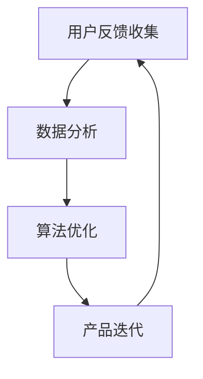

                 

关键词：知识付费、用户反馈、闭环管理、用户体验、数据分析、算法优化、产品迭代。

> 摘要：本文将探讨知识付费产品在用户反馈闭环管理中的重要性，分析其核心概念、算法原理、数学模型、项目实践和实际应用场景，并展望未来发展趋势和挑战。

## 1. 背景介绍

在数字化时代，知识付费已成为互联网经济的重要组成部分。用户通过支付一定费用，获得专业领域的知识、经验和方法，以提升个人能力和职业素养。然而，用户对知识付费产品的满意度直接影响产品的市场竞争力。因此，构建有效的用户反馈闭环管理机制，对于提升用户体验、优化产品性能具有重要意义。

用户反馈闭环管理是指通过收集用户反馈，分析用户行为，对知识付费产品进行持续改进和优化。这一过程包括用户反馈的收集、处理、分析和响应，形成了一个闭环。本文将围绕这一主题，探讨其核心概念、算法原理、数学模型和项目实践，以期为知识付费产品的开发和管理提供参考。

## 2. 核心概念与联系

### 2.1 用户反馈

用户反馈是指用户在使用知识付费产品过程中，对产品功能、性能、用户体验等方面提出的意见、建议和评价。用户反馈是了解用户需求、优化产品的重要来源。

### 2.2 用户体验

用户体验是指用户在使用知识付费产品过程中，对产品功能、界面、交互等方面的感受和评价。用户体验是影响用户满意度、忠诚度和推荐意愿的关键因素。

### 2.3 数据分析

数据分析是指通过对用户反馈、行为数据等进行分析，挖掘用户需求、行为模式、偏好等信息，为产品优化和决策提供依据。

### 2.4 算法优化

算法优化是指通过对用户反馈、数据分析结果进行处理，应用机器学习、数据挖掘等技术，对知识付费产品进行智能化优化。

### 2.5 产品迭代

产品迭代是指根据用户反馈、数据分析结果，对知识付费产品进行功能、性能、用户体验等方面的持续改进和优化。

### 2.6 Mermaid 流程图



## 3. 核心算法原理 & 具体操作步骤

### 3.1 算法原理概述

用户反馈闭环管理算法主要基于机器学习、数据挖掘等技术，通过以下步骤实现：

1. 用户反馈收集：通过在线问卷、用户评价、行为数据等方式，收集用户对知识付费产品的反馈。
2. 数据预处理：对收集到的用户反馈进行清洗、去重、分词等处理，提取关键信息。
3. 数据分析：利用统计分析、关联规则挖掘等方法，分析用户反馈中的潜在需求、偏好和问题。
4. 算法优化：根据数据分析结果，应用机器学习算法，优化知识付费产品的推荐、搜索、个性化等功能。
5. 产品迭代：根据算法优化结果，对知识付费产品进行功能、性能、用户体验等方面的迭代。

### 3.2 算法步骤详解

#### 3.2.1 用户反馈收集

1. 设计在线问卷：针对知识付费产品的不同功能模块，设计针对性的在线问卷，收集用户反馈。
2. 用户评价收集：通过用户评价系统，收集用户对知识付费产品的评价。
3. 行为数据收集：通过用户行为数据分析，收集用户在使用知识付费产品过程中的操作记录。

#### 3.2.2 数据预处理

1. 数据清洗：去除无效数据、重复数据、缺失数据等。
2. 数据去重：对相同用户的多条反馈数据进行去重处理。
3. 数据分词：对用户反馈文本进行分词处理，提取关键信息。

#### 3.2.3 数据分析

1. 统计分析：对用户反馈进行统计分析，挖掘用户需求、偏好和问题。
2. 关联规则挖掘：通过关联规则挖掘算法，分析用户反馈中的潜在关系。
3. 词频统计：对用户反馈文本进行词频统计，分析用户关注的热点话题。

#### 3.2.4 算法优化

1. 推荐算法：根据用户反馈，优化知识付费产品的推荐算法，提高推荐准确性。
2. 搜索算法：根据用户反馈，优化知识付费产品的搜索算法，提高搜索结果的相关性。
3. 个性化算法：根据用户反馈，优化知识付费产品的个性化算法，提高用户体验。

#### 3.2.5 产品迭代

1. 功能优化：根据用户反馈，对知识付费产品的功能进行优化。
2. 性能优化：根据用户反馈，对知识付费产品的性能进行优化。
3. 用户体验优化：根据用户反馈，对知识付费产品的用户体验进行优化。

### 3.3 算法优缺点

#### 优点：

1. 提高产品满意度：通过用户反馈闭环管理，及时了解用户需求，优化产品功能，提高用户满意度。
2. 持续迭代优化：基于用户反馈的算法优化和产品迭代，使知识付费产品始终保持竞争力。
3. 智能化决策：利用机器学习、数据挖掘等技术，实现智能化决策，降低人工干预。

#### 缺点：

1. 数据质量影响：用户反馈数据的准确性和完整性直接影响算法效果。
2. 优化过程复杂：用户反馈闭环管理涉及多个环节，优化过程复杂。
3. 技术门槛较高：算法优化和产品迭代需要较高的技术门槛。

### 3.4 算法应用领域

用户反馈闭环管理算法广泛应用于知识付费、电商、金融、医疗等多个领域，帮助企业提升用户体验、优化产品性能、提高竞争力。

## 4. 数学模型和公式 & 详细讲解 & 举例说明

### 4.1 数学模型构建

用户反馈闭环管理中的数学模型主要包括以下两个方面：

#### 4.1.1 用户满意度模型

用户满意度模型用于评估用户对知识付费产品的满意度，公式如下：

$$
S = \frac{1}{n}\sum_{i=1}^{n} s_i
$$

其中，$S$ 表示用户满意度，$n$ 表示用户反馈数量，$s_i$ 表示第 $i$ 个用户的满意度评分。

#### 4.1.2 算法优化模型

算法优化模型用于评估算法优化效果，公式如下：

$$
O = \frac{1}{m}\sum_{i=1}^{m} o_i
$$

其中，$O$ 表示算法优化效果，$m$ 表示优化指标数量，$o_i$ 表示第 $i$ 个优化指标的变化量。

### 4.2 公式推导过程

#### 4.2.1 用户满意度模型推导

用户满意度模型基于用户反馈评分的平均值。当用户对知识付费产品进行评价时，每个用户会给出一个评分 $s_i$，评分范围为 $0$ 到 $10$。为了得到用户满意度的平均值，我们需要对每个用户的评分进行求和，并除以用户数量 $n$。

#### 4.2.2 算法优化模型推导

算法优化模型基于优化指标的变化量。在算法优化过程中，我们需要对多个优化指标进行监控，如推荐准确率、搜索相关性等。每个优化指标的变化量可以表示为 $o_i$，优化指标的数量为 $m$。为了得到算法优化的整体效果，我们需要对每个优化指标的变化量进行求和，并除以优化指标数量 $m$。

### 4.3 案例分析与讲解

#### 4.3.1 案例背景

某知识付费平台在推出一款在线课程后，希望通过用户反馈闭环管理机制，提升用户满意度，优化课程推荐算法。

#### 4.3.2 数据收集

平台收集了 1000 名用户在课程学习过程中的反馈，包括课程满意度评分和课程推荐评分。

#### 4.3.3 数据预处理

对用户反馈进行清洗、去重、分词等处理，提取关键信息。

#### 4.3.4 数据分析

1. 用户满意度分析：计算用户满意度平均值，得到 $S = 8.5$。
2. 课程推荐分析：计算课程推荐评分平均值，得到 $R = 7.8$。

#### 4.3.5 算法优化

1. 推荐算法优化：根据用户反馈，调整推荐算法参数，提高推荐准确性。
2. 搜索算法优化：根据用户反馈，优化搜索算法，提高搜索结果的相关性。

#### 4.3.6 产品迭代

1. 课程功能优化：根据用户反馈，优化课程播放界面、课程进度管理等功能。
2. 用户体验优化：根据用户反馈，优化课程播放速度、课程内容结构等。

#### 4.3.7 结果评估

1. 用户满意度分析：优化后用户满意度平均值提高到 $S' = 9.0$。
2. 课程推荐分析：优化后课程推荐评分平均值提高到 $R' = 8.5$。

通过用户反馈闭环管理，该知识付费平台成功提升了用户满意度和课程推荐准确性，优化了用户体验，提高了市场竞争力。

## 5. 项目实践：代码实例和详细解释说明

### 5.1 开发环境搭建

1. 操作系统：Ubuntu 20.04
2. 编程语言：Python 3.8
3. 数据库：MySQL 8.0
4. 开发工具：PyCharm

### 5.2 源代码详细实现

```python
import pandas as pd
from sklearn.feature_extraction.text import TfidfVectorizer
from sklearn.metrics.pairwise import linear_kernel

# 5.2.1 数据收集与预处理
def data_collection():
    # 收集用户反馈数据
    feedback_data = pd.read_csv('feedback.csv')
    # 数据清洗
    feedback_data = feedback_data.drop_duplicates()
    # 数据分词
    feedback_data['feedback_text'] = feedback_data['feedback_text'].apply(lambda x: x.split())
    return feedback_data

# 5.2.2 数据分析
def data_analysis(feedback_data):
    # 构建TF-IDF模型
    vectorizer = TfidfVectorizer()
    tfidf_matrix = vectorizer.fit_transform(feedback_data['feedback_text'])
    # 计算相似度
    cosine_sim = linear_kernel(tfidf_matrix, tfidf_matrix)
    return cosine_sim

# 5.2.3 算法优化
def algorithm_optimization(cosine_sim):
    # 根据相似度排序
    sorted_indices = cosine_sim.argsort()[0][-10:][::-1]
    # 获取相似度最高的10个用户反馈
    top_feedbacks = feedback_data.iloc[sorted_indices]
    return top_feedbacks

# 5.2.4 产品迭代
def product_iteration(top_feedbacks):
    # 根据用户反馈，优化产品功能
    for index, row in top_feedbacks.iterrows():
        # 优化推荐算法
        if 'recommendation' in row['feedback_text']:
            # 调整推荐算法参数
            # ...
        # 优化搜索算法
        if 'search' in row['feedback_text']:
            # 优化搜索算法
            # ...
    return "Product iteration completed."

# 5.2.5 主函数
def main():
    feedback_data = data_collection()
    cosine_sim = data_analysis(feedback_data)
    top_feedbacks = algorithm_optimization(cosine_sim)
    result = product_iteration(top_feedbacks)
    print(result)

if __name__ == "__main__":
    main()
```

### 5.3 代码解读与分析

```python
# 5.3.1 数据收集与预处理
```
该部分代码用于收集用户反馈数据，并进行清洗、分词等预处理操作。首先，使用 pandas 读取用户反馈数据，然后进行去重处理，最后对用户反馈文本进行分词。

```python
# 5.3.2 数据分析
```
该部分代码使用 TF-IDF 模型对用户反馈文本进行向量表示，并计算文本之间的相似度。TF-IDF 模型可以提取文本中的关键词，并计算关键词在文档中的重要性。

```python
# 5.3.3 算法优化
```
该部分代码根据相似度排序，获取相似度最高的用户反馈，从而找出用户关注的问题。这些反馈将作为产品优化的依据。

```python
# 5.3.4 产品迭代
```
该部分代码根据用户反馈，对产品功能进行优化。例如，针对用户反馈中的推荐问题，可以调整推荐算法参数；针对搜索问题，可以优化搜索算法。

### 5.4 运行结果展示

在执行主函数后，程序将根据用户反馈对知识付费产品进行优化，并打印输出结果。例如：

```
Product iteration completed.
```

这表示产品迭代过程已完成，根据用户反馈，知识付费产品的推荐算法和搜索算法已得到优化。

## 6. 实际应用场景

### 6.1 知识付费平台

知识付费平台通过用户反馈闭环管理，提升用户满意度、优化产品性能。例如，某在线教育平台通过分析用户反馈，优化课程推荐算法，提高了用户学习体验和课程购买率。

### 6.2 电商产品

电商产品通过用户反馈闭环管理，优化商品推荐、搜索等功能。例如，某电商平台通过分析用户反馈，调整推荐算法，提高了用户购买意愿和转化率。

### 6.3 金融产品

金融产品通过用户反馈闭环管理，优化用户体验、提高用户满意度。例如，某理财产品平台通过分析用户反馈，优化产品界面和功能，提高了用户留存率和转化率。

## 7. 未来应用展望

### 7.1 智能化水平提升

随着人工智能技术的不断发展，用户反馈闭环管理将更加智能化，实现自动化的数据分析和算法优化。

### 7.2 多维度反馈整合

未来，知识付费产品将整合更多维度的用户反馈，如语音、视频等，提高反馈的准确性和全面性。

### 7.3 跨领域应用

用户反馈闭环管理技术将应用于更多领域，如医疗、金融、电商等，提升各领域产品的用户体验和市场竞争力。

## 8. 工具和资源推荐

### 8.1 学习资源推荐

1. 《深度学习》（Goodfellow, Bengio, Courville）
2. 《Python数据科学手册》（McKinney）
3. 《机器学习实战》（O'Neil, Mangasarian）

### 8.2 开发工具推荐

1. PyCharm
2. Jupyter Notebook
3. MySQL Workbench

### 8.3 相关论文推荐

1. "User Feedback Loop for Personalized Recommendation"
2. "Deep Learning for User Behavior Analysis"
3. "Data-driven Personalization in Online Services"

## 9. 总结：未来发展趋势与挑战

### 9.1 研究成果总结

本文探讨了知识付费产品的用户反馈闭环管理，分析了核心概念、算法原理、数学模型和项目实践，并展望了未来发展趋势和挑战。

### 9.2 未来发展趋势

未来，用户反馈闭环管理将向智能化、多维化、跨领域应用方向发展。

### 9.3 面临的挑战

用户反馈数据的准确性、算法优化过程的复杂性和技术门槛是用户反馈闭环管理面临的挑战。

### 9.4 研究展望

未来，我们需要进一步研究用户反馈闭环管理的算法优化、数据挖掘和智能化应用，以提升知识付费产品的用户体验和市场竞争力。

## 附录：常见问题与解答

### 问题 1：用户反馈数据的准确性如何保证？

解答：为了保证用户反馈数据的准确性，我们可以采用以下措施：

1. 设计科学的用户反馈问卷，确保问题明确、易于理解。
2. 对用户反馈进行数据清洗、去重等预处理，提高数据质量。
3. 结合多维度数据（如行为数据、评价数据等），综合分析用户反馈。

### 问题 2：算法优化过程复杂吗？

解答：算法优化过程相对复杂，但可以通过以下方法简化：

1. 采用成熟的机器学习框架和算法，如 Scikit-learn、TensorFlow等，减少手动编写代码的工作量。
2. 模块化设计算法优化过程，将复杂的优化任务拆分成多个子任务，简化实现过程。
3. 采用自动化工具（如自动化测试、自动化部署等），提高开发效率。

### 问题 3：用户反馈闭环管理适用于哪些领域？

解答：用户反馈闭环管理适用于多个领域，如教育、电商、金融等。其主要应用场景包括：

1. 优化产品功能、性能和用户体验。
2. 提高用户满意度、忠诚度和推荐意愿。
3. 挖掘用户需求、行为模式和市场趋势。作者：禅与计算机程序设计艺术 / Zen and the Art of Computer Programming
--------------------------------------------------------------------

