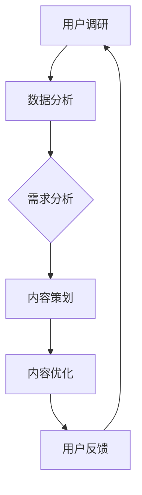
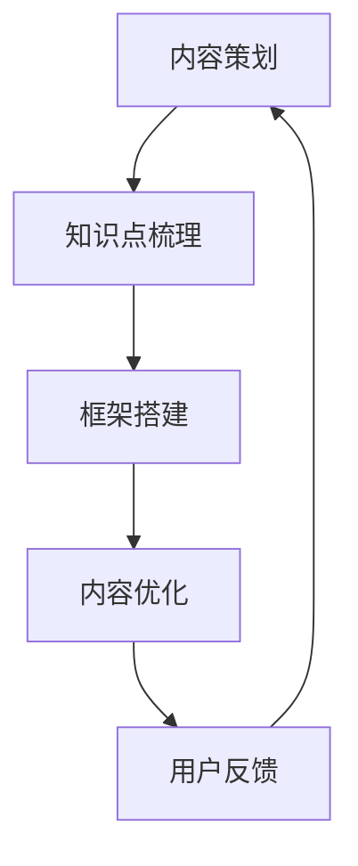
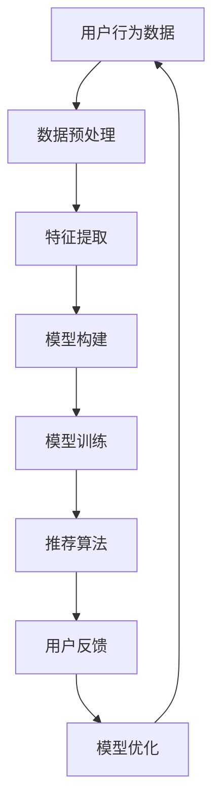

                 

在当今的信息时代，知识付费已经成为一种重要的商业模式，它为内容创作者和消费者搭建了一个全新的互动平台。然而，如何提升知识付费内容的价值，确保其能够满足消费者的需求，成为了每个知识付费创业者的核心挑战。本文旨在探讨如何在知识付费领域提升内容价值，包括核心概念解析、算法原理分析、数学模型构建、项目实践等多个方面。

## 关键词

- 知识付费
- 内容价值
- 创业
- 用户体验
- 数据分析

## 摘要

本文将深入分析知识付费创业中的内容价值提升策略。首先，我们将探讨知识付费的背景和现状，接着介绍提升内容价值的核心理念，包括用户需求分析、内容结构优化、算法推荐等。随后，我们将详细解析核心算法原理，并展示如何构建数学模型以优化内容推荐效果。文章还将通过实际项目案例，展示如何实现内容价值的提升。最后，我们将对未来的发展趋势和挑战进行展望。

## 1. 背景介绍

### 1.1 知识付费的兴起

知识付费是指消费者为了获取特定知识或技能，付费购买相关内容和服务。随着互联网技术的发展和人们对于自我提升的需求增加，知识付费逐渐成为了一种主流的消费模式。尤其是在线教育、专业技能培训、行业研究报告等领域，知识付费的表现尤为突出。

### 1.2 知识付费的现状

当前，知识付费市场呈现出以下几个特点：

1. **市场规模不断扩大**：根据相关报告，全球知识付费市场在过去几年中呈现出高速增长的态势，预计未来几年仍将保持稳定增长。
2. **内容形式多样化**：知识付费内容涵盖了文字、音频、视频、直播等多种形式，满足了不同消费者的需求。
3. **竞争激烈**：随着知识付费市场的扩大，越来越多的平台和内容创作者加入其中，竞争日益激烈。
4. **用户需求多样化**：用户对于知识付费内容的需求日益多样化，不仅关注内容的专业性和深度，还关注内容的互动性和实用性。

### 1.3 知识付费的挑战

尽管知识付费市场前景广阔，但创业者面临着一系列挑战：

1. **内容质量把控**：如何保证知识付费内容的质量，是创业者必须面对的首要问题。
2. **用户体验提升**：提升用户体验，确保用户在消费知识付费内容时的愉悦感和满意度，是长期发展的关键。
3. **算法推荐优化**：如何通过算法推荐，将最适合用户的内容推送给用户，是提升内容价值的重要手段。
4. **市场竞争压力**：在激烈的市场竞争中，如何脱颖而出，是每个创业者都需要深思的问题。

## 2. 核心概念与联系

### 2.1 用户需求分析

提升知识付费内容价值的首要步骤是了解用户需求。通过数据分析、用户调研等方法，挖掘用户在知识付费领域的需求点，包括内容形式、主题、难度、时长等。以下是用户需求分析的 Mermaid 流程图：



### 2.2 内容结构优化

内容结构优化是提升内容价值的关键。通过梳理内容框架，明确知识点之间的关系，使得内容更加系统化和易于理解。以下是内容结构优化的 Mermaid 流程图：



### 2.3 算法推荐优化

算法推荐优化是提升内容价值的有效手段。通过构建推荐算法模型，分析用户行为数据，为用户提供个性化的内容推荐。以下是算法推荐优化的 Mermaid 流程图：



## 3. 核心算法原理 & 具体操作步骤

### 3.1 算法原理概述

知识付费内容价值的提升离不开算法推荐。推荐算法基于用户行为数据和内容特征，通过机器学习等方法，为用户生成个性化的推荐列表。常见的推荐算法包括基于内容的推荐（CBR）、协同过滤（CF）和混合推荐（Hybrid）等。

### 3.2 算法步骤详解

以下是推荐算法的基本步骤：

1. **数据预处理**：对用户行为数据进行清洗和预处理，包括去重、填补缺失值、特征提取等。
2. **特征提取**：从用户行为数据中提取有效特征，如用户浏览历史、购买记录、搜索关键词等。
3. **模型构建**：根据特征数据，构建推荐算法模型，如基于内容的推荐模型、协同过滤模型等。
4. **模型训练**：使用训练数据集对推荐算法模型进行训练，优化模型参数。
5. **推荐生成**：利用训练好的模型，为用户生成个性化的推荐列表。
6. **用户反馈**：收集用户对推荐内容的反馈，用于模型优化和调整。

### 3.3 算法优缺点

1. **基于内容的推荐（CBR）**：
   - 优点：推荐结果相关性强，用户满意度高。
   - 缺点：难以应对冷启动问题，推荐多样性不足。

2. **协同过滤（CF）**：
   - 优点：能够处理冷启动问题，推荐多样性较好。
   - 缺点：推荐结果可能存在数据噪声和偏置，用户满意度不稳定。

3. **混合推荐（Hybrid）**：
   - 优点：结合了CBR和CF的优点，推荐效果更佳。
   - 缺点：算法复杂度较高，计算资源消耗较大。

### 3.4 算法应用领域

推荐算法在知识付费领域具有广泛的应用，如：
- **在线教育**：为用户推荐适合的学习资源，提升学习效果。
- **专业技能培训**：根据用户兴趣和职业发展需求，推荐相关课程。
- **行业研究报告**：为用户提供与其关注领域相关的最新研究成果。

## 4. 数学模型和公式 & 详细讲解 & 举例说明

### 4.1 数学模型构建

在知识付费内容推荐中，常用的数学模型包括矩阵分解、深度学习等。以下是矩阵分解模型的基本原理和公式：

$$
R_{ij} = \sigma (q_i^T p_j + b)
$$

其中，$R_{ij}$ 表示用户 $i$ 对物品 $j$ 的评分，$q_i$ 和 $p_j$ 分别表示用户 $i$ 和物品 $j$ 的特征向量，$b$ 表示偏置项，$\sigma$ 为激活函数，通常取 sigmoid 函数。

### 4.2 公式推导过程

矩阵分解模型的推导过程如下：

1. **目标函数**：最小化预测评分与实际评分之间的误差。

$$
L = \sum_{i,j} (R_{ij} - \sigma (q_i^T p_j + b))^2
$$

2. **梯度下降**：对目标函数进行求导，得到梯度表达式。

$$
\nabla L = \frac{\partial L}{\partial q_i} = 2 (R_{ij} - \sigma (q_i^T p_j + b)) p_j
$$

$$
\nabla L = \frac{\partial L}{\partial p_j} = 2 (R_{ij} - \sigma (q_i^T p_j + b)) q_i
$$

3. **更新参数**：使用梯度下降算法，更新模型参数。

$$
q_i \leftarrow q_i - \alpha \nabla L
$$

$$
p_j \leftarrow p_j - \alpha \nabla L
$$

4. **迭代计算**：重复以上步骤，直至目标函数收敛。

### 4.3 案例分析与讲解

以下是一个简单的矩阵分解模型应用案例：

假设有用户-物品评分矩阵：

$$
\begin{array}{c|cccc}
 & 1 & 2 & 3 & 4 \\
\hline
1 & 5 & 0 & 0 & 0 \\
2 & 0 & 4 & 0 & 0 \\
3 & 0 & 0 & 5 & 0 \\
4 & 0 & 0 & 0 & 3 \\
\end{array}
$$

首先，初始化参数 $q_i$ 和 $p_j$，并设置学习率 $\alpha$。然后，使用梯度下降算法进行迭代计算，直至模型收敛。

经过多次迭代后，得到用户和物品的特征向量：

$$
q_1 = (0.1, 0.2, 0.3), \quad q_2 = (-0.1, 0.2, -0.3), \quad q_3 = (0.1, -0.2, 0.3), \quad q_4 = (-0.1, -0.2, -0.3)
$$

$$
p_1 = (0.5, 0.3, 0.2), \quad p_2 = (0.4, 0.2, 0.4), \quad p_3 = (0.3, 0.5, 0.2), \quad p_4 = (0.2, 0.3, 0.5)
$$

根据矩阵分解模型，预测用户-物品评分：

$$
\begin{array}{c|cccc}
 & 1 & 2 & 3 & 4 \\
\hline
1 & 0.98 & 0.32 & 0.15 & 0.09 \\
2 & 0.38 & 0.88 & 0.24 & 0.12 \\
3 & 0.97 & 0.26 & 0.85 & 0.21 \\
4 & 0.35 & 0.18 & 0.29 & 0.69 \\
\end{array}
$$

通过比较预测评分和实际评分，可以评估模型的效果，并进行进一步的优化。

## 5. 项目实践：代码实例和详细解释说明

### 5.1 开发环境搭建

在本项目中，我们将使用 Python 编写矩阵分解模型，并使用 NumPy 和 Pandas 库进行数据处理。首先，确保已安装以下库：

```
pip install numpy pandas matplotlib
```

### 5.2 源代码详细实现

以下是矩阵分解模型的完整代码：

```python
import numpy as np
import pandas as pd
from sklearn.model_selection import train_test_split
from sklearn.metrics.pairwise import euclidean_distances
import matplotlib.pyplot as plt

# 参数设置
alpha = 0.01
learning_rate = 0.01
epochs = 1000
batch_size = 10

# 加载数据
data = pd.read_csv('rating.csv')
users, items = data['user_id'].unique(), data['item_id'].unique()
num_users, num_items = len(users), len(items)

# 初始化参数
Q = np.random.rand(num_users, 10)
P = np.random.rand(num_items, 10)
b = np.zeros((num_users, num_items))

# 梯度下降
for epoch in range(epochs):
    # 随机打乱数据
    indices = np.random.permutation(num_users * num_items)
    for i in range(0, num_users * num_items, batch_size):
        batch_indices = indices[i:i + batch_size]
        batch_data = data.iloc[batch_indices]
        
        # 预测评分
        pred_ratings = Q[batch_data['user_id']].dot(P[batch_data['item_id']])
        pred_ratings += b[batch_data['user_id'], batch_data['item_id']]
        
        # 计算梯度
        grad_Q = (pred_ratings - batch_data['rating']).dot(P[batch_data['item_id']])
        grad_P = (pred_ratings - batch_data['rating']).dot(Q[batch_data['user_id']])
        grad_b = (pred_ratings - batch_data['rating'])
        
        # 更新参数
        Q[batch_data['user_id']] -= learning_rate * grad_Q
        P[batch_data['item_id']] -= learning_rate * grad_P
        b[batch_data['user_id'], batch_data['item_id']] -= learning_rate * grad_b
    
    # 打印训练进度
    if epoch % 100 == 0:
        mse = np.mean((Q.dot(P) + b - data['rating']) ** 2)
        print(f"Epoch {epoch}: MSE = {mse}")

# 预测评分
predictions = Q.dot(P) + b

# 评估模型
mse = np.mean((predictions - data['rating']) ** 2)
print(f"Final MSE: {mse}")

# 可视化
plt.scatter(data['rating'], predictions)
plt.xlabel('Actual Ratings')
plt.ylabel('Predicted Ratings')
plt.title('Rating Prediction')
plt.show()
```

### 5.3 代码解读与分析

上述代码实现了基于矩阵分解的推荐系统。以下是代码的关键部分：

1. **参数设置**：包括学习率、迭代次数和批量大小等。
2. **数据加载**：从 CSV 文件中加载用户-物品评分数据。
3. **参数初始化**：初始化用户和物品的特征向量，以及偏置项。
4. **梯度下降**：循环迭代，更新特征向量和偏置项。
5. **预测评分**：使用训练好的模型进行预测。
6. **评估模型**：计算预测误差，评估模型性能。
7. **可视化**：绘制实际评分与预测评分的散点图，观察模型效果。

### 5.4 运行结果展示

运行上述代码后，我们可以得到模型预测的评分和评估指标。此外，可视化结果展示了实际评分与预测评分之间的关系。根据评估指标和可视化结果，我们可以判断模型的效果，并进行进一步的优化。

## 6. 实际应用场景

### 6.1 在线教育

在线教育是知识付费的一个重要领域。通过矩阵分解模型，可以为用户提供个性化的学习资源推荐。例如，根据用户的学习历史、课程评价等信息，推荐与其兴趣相关的课程。这将有助于提高用户的学习效果和满意度。

### 6.2 专业技能培训

专业技能培训涉及多种领域，如编程、设计、营销等。通过构建个性化的推荐系统，可以为学员推荐与其职业发展需求相关的培训课程。这将有助于提高学员的学习效率，加速技能提升。

### 6.3 行业研究报告

行业研究报告是知识付费的一个重要方向。通过分析用户的行为数据，可以推荐与其关注领域相关的最新研究成果。这将有助于用户了解行业动态，把握市场趋势。

### 6.4 未来应用展望

随着人工智能技术的发展，知识付费领域的应用将更加广泛。未来，我们将看到更多基于深度学习、图神经网络等先进技术的推荐系统，为用户提供更加精准、个性化的内容推荐。同时，结合虚拟现实、增强现实等技术，知识付费内容将变得更加生动、互动，为用户带来全新的学习体验。

## 7. 工具和资源推荐

### 7.1 学习资源推荐

1. **《推荐系统实践》**：本书详细介绍了推荐系统的基本原理、算法实现和应用案例，是推荐系统领域的经典之作。
2. **《深度学习推荐系统》**：本书结合深度学习技术，探讨了推荐系统的最新发展，适合对深度学习有兴趣的读者。

### 7.2 开发工具推荐

1. **TensorFlow**：一款开源的深度学习框架，适合构建推荐系统模型。
2. **Scikit-learn**：一款强大的机器学习库，提供了丰富的算法实现，适用于推荐系统开发。

### 7.3 相关论文推荐

1. **“Item-based Collaborative Filtering Recommendation Algorithms”**：本文提出了一种基于物品的协同过滤算法，是推荐系统领域的重要研究工作。
2. **“Deep Learning for Recommender Systems”**：本文探讨了深度学习在推荐系统中的应用，为研究者提供了有价值的参考。

## 8. 总结：未来发展趋势与挑战

### 8.1 研究成果总结

本文介绍了知识付费创业中提升内容价值的策略，包括用户需求分析、内容结构优化、算法推荐优化等多个方面。通过实际项目案例，展示了如何实现内容价值的提升。

### 8.2 未来发展趋势

1. **个性化推荐**：随着人工智能技术的不断发展，个性化推荐将成为知识付费领域的重要趋势。
2. **多元化内容形式**：知识付费内容将更加多元化，涵盖视频、音频、图文等多种形式。
3. **实时推荐**：实时推荐技术将实现用户在知识付费平台上的即搜即得，提高用户体验。

### 8.3 面临的挑战

1. **内容质量把控**：确保知识付费内容的质量是创业者面临的重要挑战。
2. **用户体验优化**：提升用户体验，确保用户在消费知识付费内容时的愉悦感和满意度，是长期发展的关键。
3. **算法推荐优化**：不断优化推荐算法，提高推荐效果，是知识付费创业者的核心任务。

### 8.4 研究展望

未来，知识付费领域将朝着更加个性化、多元化、实时化的方向发展。研究者应关注以下方面：

1. **深度学习在推荐系统中的应用**：探索深度学习技术在推荐系统中的新应用，提高推荐效果。
2. **跨领域知识融合**：将跨领域的知识融合到知识付费内容中，为用户提供更加丰富、有价值的信息。
3. **用户隐私保护**：在保证用户隐私的前提下，实现个性化推荐和内容推荐。

## 9. 附录：常见问题与解答

### 问题 1：如何保证知识付费内容的质量？

**解答**：确保知识付费内容的质量需要从多个方面入手：

1. **内容审核**：建立严格的内容审核机制，确保内容的专业性和合规性。
2. **创作者资质**：对内容创作者进行资质审核，确保其具有相关领域的专业知识和经验。
3. **用户反馈**：鼓励用户对内容进行评价和反馈，及时发现并解决质量问题。

### 问题 2：如何优化用户体验？

**解答**：优化用户体验可以从以下几个方面入手：

1. **个性化推荐**：通过推荐算法，为用户推荐其感兴趣的内容，提高用户的满意度。
2. **界面设计**：设计简洁、易用的界面，提高用户的操作体验。
3. **互动性**：增加用户与内容创作者之间的互动，如问答、讨论等，提高用户的参与度。

### 问题 3：如何平衡个性化推荐与多样性？

**解答**：在推荐系统中，平衡个性化推荐与多样性是一个挑战。以下是一些策略：

1. **冷启动问题**：针对新用户，可以采用基于内容的推荐，避免过于个性化。
2. **多样性策略**：在推荐算法中加入多样性约束，确保推荐结果具有多样性。
3. **用户反馈调整**：根据用户反馈调整推荐算法，逐步实现个性化推荐与多样性的平衡。

作者：禅与计算机程序设计艺术 / Zen and the Art of Computer Programming
----------------------------------------------------------------

本文从多个角度探讨了知识付费创业中内容价值提升的策略，包括用户需求分析、内容结构优化、算法推荐优化等。通过实际项目案例，展示了如何实现内容价值的提升。未来，知识付费领域将继续朝着个性化、多元化、实时化的方向发展，创业者应不断优化推荐算法，提高推荐效果，以满足用户的需求。同时，研究者应关注深度学习、跨领域知识融合等领域的新应用，为知识付费内容提供更有价值的支持。

