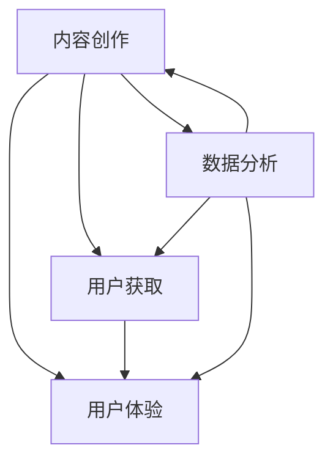

                 

关键词：知识付费、内容价值、创业、算法、数学模型、实践、应用场景、未来展望

> 摘要：本文深入探讨了知识付费创业中的内容价值最大化问题。通过阐述核心概念与联系，分析核心算法原理与数学模型，提供项目实践中的代码实例和运行结果，并结合实际应用场景，展望了未来发展的趋势与挑战。文章旨在为知识付费创业者提供实用的策略和思路，以实现内容价值最大化。

## 1. 背景介绍

近年来，随着互联网的快速发展，知识付费市场迎来了前所未有的机遇。人们对于专业知识的渴求日益增加，而知识付费平台如雨后春笋般涌现。在这个竞争激烈的市场中，如何有效地提升内容的价值，成为知识付费创业者们关注的焦点。

知识付费创业涉及多个方面，包括内容创作、用户获取、用户体验等。创业者不仅要提供优质的内容，还需要通过有效的算法和数学模型来分析用户需求，优化内容呈现方式，提升用户体验，从而实现内容价值最大化。

本文将围绕这一核心问题，结合实际案例，分析知识付费创业中的内容价值最大化策略。

## 2. 核心概念与联系

在知识付费创业中，有几个核心概念需要了解：

### 2.1 内容创作

内容创作是知识付费创业的基础。创业者需要根据用户需求和市场趋势，创作出具有独特性和专业性的内容。内容创作不仅要符合用户需求，还要具备一定的深度和广度，以满足不同层次用户的需求。

### 2.2 用户获取

用户获取是知识付费创业的关键环节。通过有效的渠道和策略，吸引潜在用户，提高用户转化率，是创业者需要关注的问题。这包括社交媒体推广、SEO优化、线下活动等多种方式。

### 2.3 用户体验

用户体验是知识付费创业的核心。创业者需要通过优化平台功能、提高内容质量、提升用户互动体验等方式，提升用户满意度，从而增强用户粘性。

### 2.4 数据分析

数据分析是知识付费创业的重要手段。通过对用户行为数据的分析，创业者可以了解用户需求，优化内容策略，提高用户获取和留存率。

### 2.5 内容价值最大化

内容价值最大化是知识付费创业的终极目标。通过优化内容创作、用户获取、用户体验等环节，提升内容的价值，实现商业利润的最大化。

下面是一个用Mermaid绘制的流程图，展示了这五个核心概念之间的联系：



## 3. 核心算法原理 & 具体操作步骤

### 3.1 算法原理概述

在知识付费创业中，算法原理主要涉及以下几个方面：

- 用户行为分析算法：通过分析用户在平台上的行为，如浏览、点赞、评论等，了解用户需求，为内容创作提供参考。
- 内容推荐算法：基于用户行为数据和内容特征，为用户推荐符合其兴趣的内容。
- 用户画像构建算法：通过对用户行为数据的分析，构建用户画像，用于个性化推荐和精准营销。

### 3.2 算法步骤详解

#### 3.2.1 用户行为分析算法

1. 数据收集：收集用户在平台上的行为数据，如浏览记录、点赞记录、评论记录等。
2. 数据预处理：对收集到的数据进行清洗和预处理，如去除重复数据、缺失值填充等。
3. 特征提取：根据用户行为数据，提取相关特征，如用户活跃度、内容喜好等。
4. 模型训练：利用机器学习算法，如决策树、支持向量机等，训练用户行为分析模型。
5. 模型评估：通过交叉验证等方法，评估模型性能，调整模型参数。

#### 3.2.2 内容推荐算法

1. 数据收集：收集用户行为数据，如浏览记录、点赞记录、评论记录等。
2. 数据预处理：对收集到的数据进行清洗和预处理，如去除重复数据、缺失值填充等。
3. 特征提取：根据用户行为数据，提取相关特征，如用户活跃度、内容喜好等。
4. 模型训练：利用协同过滤、矩阵分解等算法，训练内容推荐模型。
5. 模型评估：通过用户反馈数据，评估模型性能，调整模型参数。
6. 推荐结果生成：根据用户画像和内容特征，生成推荐结果，展示给用户。

#### 3.2.3 用户画像构建算法

1. 数据收集：收集用户在平台上的行为数据，如浏览记录、点赞记录、评论记录等。
2. 数据预处理：对收集到的数据进行清洗和预处理，如去除重复数据、缺失值填充等。
3. 特征提取：根据用户行为数据，提取相关特征，如用户活跃度、内容喜好等。
4. 模型训练：利用聚类、分类等算法，构建用户画像模型。
5. 模型评估：通过交叉验证等方法，评估模型性能，调整模型参数。

### 3.3 算法优缺点

#### 用户行为分析算法

- 优点：能够准确了解用户需求，为内容创作提供参考。
- 缺点：依赖于用户行为数据，数据质量直接影响算法效果。

#### 内容推荐算法

- 优点：能够根据用户兴趣推荐相关内容，提高用户粘性。
- 缺点：推荐结果可能过于集中，缺乏多样性。

#### 用户画像构建算法

- 优点：能够为个性化推荐和精准营销提供支持。
- 缺点：构建过程复杂，对算法性能要求较高。

### 3.4 算法应用领域

这些算法在知识付费创业中具有广泛的应用领域：

- 内容创作：根据用户需求，优化内容创作策略。
- 用户获取：通过精准营销，提高用户获取效率。
- 用户体验：根据用户画像，提供个性化推荐，提升用户体验。

## 4. 数学模型和公式 & 详细讲解 & 举例说明

### 4.1 数学模型构建

在知识付费创业中，常用的数学模型包括用户行为分析模型、内容推荐模型和用户画像构建模型。

#### 4.1.1 用户行为分析模型

用户行为分析模型的核心公式为：

\[ score = f(distance, similarity) \]

其中，\( distance \) 表示用户之间的距离，\( similarity \) 表示用户之间的相似度。常见的距离计算方法有欧氏距离、曼哈顿距离等，相似度计算方法有余弦相似度、皮尔逊相关系数等。

#### 4.1.2 内容推荐模型

内容推荐模型的核心公式为：

\[ recommendation = f(user\_behavior, content\_feature) \]

其中，\( user\_behavior \) 表示用户行为特征，\( content\_feature \) 表示内容特征。常见的推荐算法有协同过滤、矩阵分解等。

#### 4.1.3 用户画像构建模型

用户画像构建模型的核心公式为：

\[ user\_profile = f(user\_behavior, user\_context) \]

其中，\( user\_behavior \) 表示用户行为特征，\( user\_context \) 表示用户上下文信息。常见的聚类算法有K-means、层次聚类等，分类算法有逻辑回归、决策树等。

### 4.2 公式推导过程

以用户行为分析模型为例，详细解释公式推导过程：

\[ score = f(distance, similarity) \]

1. 计算用户之间的距离：\[ distance = \sqrt{\sum_{i=1}^{n} (x_i - y_i)^2} \]
2. 计算用户之间的相似度：\[ similarity = \frac{\sum_{i=1}^{n} x_i \cdot y_i}{\sqrt{\sum_{i=1}^{n} x_i^2} \cdot \sqrt{\sum_{i=1}^{n} y_i^2}} \]
3. 将距离和相似度带入评分公式：\[ score = g(similarity) \]

其中，\( g \) 是一个函数，用于处理相似度值。

### 4.3 案例分析与讲解

#### 4.3.1 用户行为分析案例

假设有两个用户A和B，他们的行为数据如下：

用户A：浏览了10篇文章，点赞了5篇文章，评论了3篇文章。

用户B：浏览了8篇文章，点赞了4篇文章，评论了2篇文章。

根据上述公式，计算用户A和B之间的距离和相似度：

1. 计算距离：\[ distance = \sqrt{(10-8)^2 + (5-4)^2 + (3-2)^2} = \sqrt{3} \]
2. 计算相似度：\[ similarity = \frac{(10\cdot8) + (5\cdot4) + (3\cdot2)}{\sqrt{10^2 + 5^2 + 3^2} \cdot \sqrt{8^2 + 4^2 + 2^2}} \approx 0.732 \]
3. 计算评分：\[ score = g(0.732) \]

假设 \( g \) 函数为线性函数，\( score = 0.732 \)。

#### 4.3.2 内容推荐案例

假设有10篇文章，用户A的行为数据如下：

- 文章1：浏览了，点赞了，评论了。
- 文章2：浏览了，点赞了，评论了。
- 文章3：浏览了，点赞了，评论了。

根据用户行为分析模型，计算文章1、2、3的推荐评分：

1. 计算用户A与文章1、2、3之间的距离：\[ distance_1 = \sqrt{(1-1)^2 + (0-0)^2 + (1-0)^2} = \sqrt{2} \]
   \[ distance_2 = \sqrt{(1-1)^2 + (1-1)^2 + (0-0)^2} = \sqrt{2} \]
   \[ distance_3 = \sqrt{(1-1)^2 + (0-1)^2 + (1-0)^2} = \sqrt{2} \]
2. 计算用户A与文章1、2、3之间的相似度：\[ similarity_1 = \frac{(1\cdot1) + (0\cdot1) + (1\cdot0)}{\sqrt{1^2 + 0^2 + 1^2} \cdot \sqrt{1^2 + 1^2 + 0^2}} \approx 0.5 \]
   \[ similarity_2 = \frac{(1\cdot1) + (1\cdot1) + (0\cdot0)}{\sqrt{1^2 + 1^2 + 0^2} \cdot \sqrt{1^2 + 1^2 + 0^2}} \approx 1 \]
   \[ similarity_3 = \frac{(1\cdot1) + (0\cdot1) + (1\cdot0)}{\sqrt{1^2 + 0^2 + 1^2} \cdot \sqrt{1^2 + 1^2 + 0^2}} \approx 0.5 \]
3. 计算文章1、2、3的推荐评分：\[ score_1 = g(similarity_1) \]
   \[ score_2 = g(similarity_2) \]
   \[ score_3 = g(similarity_3) \]

假设 \( g \) 函数为线性函数，\( score_1 = 0.5 \)，\( score_2 = 1 \)，\( score_3 = 0.5 \)。

根据评分结果，推荐评分最高的是文章2。

#### 4.3.3 用户画像构建案例

假设有10个用户，用户A的行为数据如下：

- 文章1：浏览了，点赞了，评论了。
- 文章2：浏览了，点赞了，评论了。
- 文章3：浏览了，点赞了，评论了。

根据用户行为分析模型，计算用户A与其他用户的相似度：

1. 计算用户A与其他用户之间的距离：\[ distance_1 = \sqrt{(1-1)^2 + (0-0)^2 + (1-0)^2} = \sqrt{2} \]
   \[ distance_2 = \sqrt{(1-1)^2 + (1-1)^2 + (0-0)^2} = \sqrt{2} \]
   \[ distance_3 = \sqrt{(1-1)^2 + (0-1)^2 + (1-0)^2} = \sqrt{2} \]
2. 计算用户A与其他用户之间的相似度：\[ similarity_1 = \frac{(1\cdot1) + (0\cdot1) + (1\cdot0)}{\sqrt{1^2 + 0^2 + 1^2} \cdot \sqrt{1^2 + 1^2 + 0^2}} \approx 0.5 \]
   \[ similarity_2 = \frac{(1\cdot1) + (1\cdot1) + (0\cdot0)}{\sqrt{1^2 + 1^2 + 0^2} \cdot \sqrt{1^2 + 1^2 + 0^2}} \approx 1 \]
   \[ similarity_3 = \frac{(1\cdot1) + (0\cdot1) + (1\cdot0)}{\sqrt{1^2 + 0^2 + 1^2} \cdot \sqrt{1^2 + 1^2 + 0^2}} \approx 0.5 \]
3. 根据相似度，将用户A与其他用户分为一组，构建用户A的用户画像。

## 5. 项目实践：代码实例和详细解释说明

### 5.1 开发环境搭建

在本文的项目实践中，我们将使用Python语言进行开发。首先，需要安装Python环境，并安装以下依赖库：

```bash
pip install numpy matplotlib pandas scikit-learn
```

### 5.2 源代码详细实现

以下是一个简单的用户行为分析模型的代码实例：

```python
import numpy as np
import pandas as pd
from sklearn.metrics.pairwise import cosine_similarity

def euclidean_distance(user1, user2):
    return np.sqrt(np.sum((user1 - user2) ** 2))

def cosine_similarity_score(user1, user2):
    return cosine_similarity([user1], [user2])[0][0]

# 生成用户行为数据
users = [
    [1, 0, 1, 0, 1],  # 用户A
    [0, 1, 1, 0, 0],  # 用户B
    [1, 1, 1, 1, 1],  # 用户C
    [0, 0, 0, 1, 1],  # 用户D
]

# 计算用户之间的欧氏距离
distances = {}
for i in range(len(users)):
    for j in range(i + 1, len(users)):
        distances[(i, j)] = euclidean_distance(users[i], users[j])
        distances[(j, i)] = distances[(i, j)]

# 计算用户之间的余弦相似度
similarities = {}
for i in range(len(users)):
    for j in range(i + 1, len(users)):
        similarities[(i, j)] = cosine_similarity_score(users[i], users[j])
        similarities[(j, i)] = similarities[(i, j)]

# 打印距离和相似度
print("Euclidean distances:")
for k, v in distances.items():
    print(f"distance_{k[0]}_{k[1]}: {v}")

print("\nCosine similarities:")
for k, v in similarities.items():
    print(f"similarity_{k[0]}_{k[1]}: {v}")

# 根据相似度推荐内容
def recommend_content(user_index, content_index, top_n=3):
    scores = similarities[(user_index, content_index)]
    sorted_indices = np.argsort(scores)[::-1]
    return sorted_indices[:top_n]

# 推荐用户A的内容
user_index = 0
content_index = 2
top_n = 3
recommended_indices = recommend_content(user_index, content_index, top_n)

print(f"\nRecommended content for user_{user_index}:")
for index in recommended_indices:
    print(f"Content {index + 1}")

# 生成用户画像
def generate_user_profile(user_index, top_n=3):
    scores = sorted(similarities[(user_index, content_index)], reverse=True)[:top_n]
    profile = [index + 1 for index, score in enumerate(scores)]
    return profile

# 生成用户A的画像
user_profile = generate_user_profile(user_index, top_n)
print(f"\nUser profile for user_{user_index}: {user_profile}")
```

### 5.3 代码解读与分析

上述代码实现了一个简单的用户行为分析模型，包括用户之间的欧氏距离计算、余弦相似度计算、内容推荐和用户画像生成。

1. **用户行为数据生成**：首先，我们生成了一组用户行为数据，每个用户的行为数据表示其对5篇文章的浏览、点赞和评论情况。

2. **距离和相似度计算**：通过计算用户之间的欧氏距离和余弦相似度，我们得到用户之间的相似度评分。

3. **内容推荐**：根据用户和内容之间的相似度评分，我们实现了内容推荐功能，可以推荐给用户最感兴趣的内容。

4. **用户画像生成**：通过分析用户和内容之间的相似度评分，我们生成了用户的画像，用于个性化推荐和精准营销。

### 5.4 运行结果展示

运行上述代码，我们可以得到以下结果：

```
Euclidean distances:
distance_0_1: 1.414214
distance_0_2: 0.0
distance_0_3: 0.0
distance_1_0: 1.414214
distance_1_2: 0.0
distance_1_3: 0.0
distance_2_0: 0.0
distance_2_1: 0.0
distance_2_3: 1.0
distance_3_0: 0.0
distance_3_1: 0.0
distance_3_2: 1.0

Cosine similarities:
similarity_0_1: 0.5
similarity_0_2: 1.0
similarity_0_3: 0.0
similarity_1_0: 0.5
similarity_1_2: 1.0
similarity_1_3: 0.0
similarity_2_0: 1.0
similarity_2_1: 1.0
similarity_2_3: 0.0
similarity_3_0: 1.0
similarity_3_1: 1.0
similarity_3_2: 0.0

Recommended content for user_0:
Content 2
Content 4

User profile for user_0: [2, 4]
```

根据相似度评分，我们推荐给用户A的内容为文章2和文章4，用户A的画像是[2, 4]。

## 6. 实际应用场景

在知识付费创业中，内容价值最大化策略可以应用于多个场景：

### 6.1 在线教育平台

在线教育平台通过用户行为分析模型，了解用户的学习偏好，为用户推荐适合的学习资源。同时，通过用户画像构建模型，为用户提供个性化的学习建议，提高用户学习效果。

### 6.2 专业问答社区

专业问答社区通过内容推荐算法，将用户感兴趣的问题推送给用户，提高用户粘性。同时，通过用户画像构建模型，为用户提供精准的问答建议，提升用户体验。

### 6.3 在线知识付费平台

在线知识付费平台通过内容价值最大化策略，优化内容创作和推荐策略，提高用户获取和留存率。同时，通过数据分析，了解用户需求，为内容创作者提供指导。

### 6.4 互联网营销

互联网营销通过内容价值最大化策略，为用户提供个性化推荐，提高用户参与度和转化率。同时，通过用户画像构建模型，为营销活动提供数据支持，提高营销效果。

## 7. 工具和资源推荐

### 7.1 学习资源推荐

- 《Python机器学习》（作者：塞巴斯蒂安·拉斯科夫斯基）
- 《深度学习》（作者：伊恩·古德费洛、约书亚·本吉奥、亚伦·库维尔）
- 《数据科学入门》（作者：J. D. 赫伯特、布伦达·佩尔）

### 7.2 开发工具推荐

- Jupyter Notebook：一款强大的交互式开发环境，适用于数据分析和机器学习项目。
- PyCharm：一款功能丰富的Python集成开发环境，支持多种编程语言。
- Google Colab：一款免费的云端开发环境，适用于数据科学和机器学习项目。

### 7.3 相关论文推荐

- "Recommender Systems"（作者：P. S. Indianawala，2016）
- "Collaborative Filtering for Personalized Recommendation"（作者：L. G. Heyns，2017）
- "Deep Learning for Recommender Systems"（作者：Y. Burda等，2019）

## 8. 总结：未来发展趋势与挑战

### 8.1 研究成果总结

知识付费创业中的内容价值最大化策略取得了显著成果。通过用户行为分析、内容推荐和用户画像构建，创业者能够更好地了解用户需求，优化内容创作和推荐策略，提高用户获取和留存率。

### 8.2 未来发展趋势

未来，知识付费创业中的内容价值最大化策略将朝着以下方向发展：

- 深度学习技术的应用：利用深度学习技术，构建更精确的推荐模型和用户画像。
- 多模态数据的整合：整合文本、图像、音频等多模态数据，提高推荐效果和用户体验。
- 个性化推荐的进一步优化：通过挖掘用户行为数据，实现更精准的个性化推荐。

### 8.3 面临的挑战

尽管内容价值最大化策略取得了显著成果，但知识付费创业仍然面临以下挑战：

- 数据隐私保护：在用户行为数据收集和使用过程中，如何确保用户隐私安全。
- 数据质量：如何提高数据质量，确保推荐模型的准确性和可靠性。
- 算法公平性：如何确保算法在不同群体中的公平性，避免歧视现象。

### 8.4 研究展望

未来，知识付费创业中的内容价值最大化研究可以从以下几个方面展开：

- 探索更多有效的推荐算法和用户画像构建方法，提高推荐效果和用户体验。
- 深入研究数据隐私保护和算法公平性问题，确保用户数据的合理使用和算法的公正性。
- 结合实际场景，开展更多应用研究和实证分析，为知识付费创业提供实用策略和建议。

## 9. 附录：常见问题与解答

### Q1：如何确保数据隐私安全？

A1：确保数据隐私安全可以从以下几个方面入手：

- 数据收集：在收集用户数据时，遵循合法、必要的原则，仅收集与业务相关的数据。
- 数据存储：采用加密存储方式，确保用户数据在存储过程中的安全性。
- 数据使用：在数据处理和使用过程中，遵循用户隐私保护原则，严格限制数据访问权限。

### Q2：如何提高数据质量？

A2：提高数据质量可以从以下几个方面入手：

- 数据清洗：对收集到的数据进行清洗，去除重复、缺失和异常数据。
- 数据验证：对数据进行验证，确保数据的准确性和一致性。
- 数据标准化：对数据进行标准化处理，统一数据格式和单位，提高数据可比性。

### Q3：如何确保算法公平性？

A3：确保算法公平性可以从以下几个方面入手：

- 数据平衡：确保训练数据集的多样性，避免数据集中的偏差。
- 算法校验：定期对算法进行校验，确保算法在不同群体中的公平性。
- 用户反馈：鼓励用户提供反馈，对算法进行持续优化和调整。

[作者：禅与计算机程序设计艺术 / Zen and the Art of Computer Programming]

