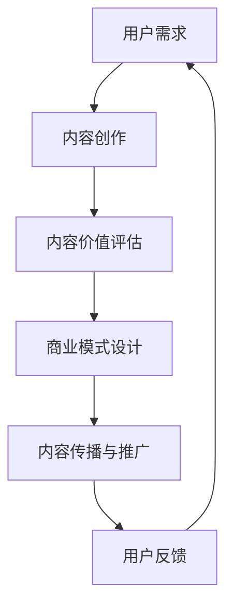

                 

### 背景介绍 Background

随着互联网技术的飞速发展，知识付费市场逐渐成为创业者眼中的蓝海。知识付费，即通过互联网平台为用户提供有价值的内容，如课程、文章、视频等，用户支付一定费用以获取这些内容的服务。在这个市场中，创业者们需要面对的一个重要挑战是如何最大化内容的价值，从而吸引更多用户，提高平台粘性，实现商业成功。

内容价值最大化不仅关系到用户满意度，还直接影响平台的盈利能力和市场竞争力。然而，实现这一目标并非易事。内容创作、传播、消费等多个环节都涉及到价值创造的难题。因此，本文将从技术、商业、用户等多个角度，深入探讨知识付费创业中的内容价值最大化问题。

### 核心概念与联系 Core Concepts and Connections

在探讨内容价值最大化之前，我们首先需要了解一些核心概念，包括内容价值、用户需求、商业模式等。以下是这些概念之间的关系及其在知识付费创业中的应用。

#### 内容价值 Content Value

内容价值是指用户对内容所赋予的内在价值。它不仅取决于内容本身的质量，还与用户的认知、需求和兴趣密切相关。高质量的内容通常具备以下几个特点：

1. **准确性**：内容应准确无误，避免误导用户。
2. **实用性**：内容应具备实际应用价值，帮助用户解决实际问题。
3. **独特性**：内容应具有独特的视角或见解，区别于其他来源的信息。
4. **时效性**：内容应紧跟热点或行业动态，具备一定的时效性。

#### 用户需求 User Demand

用户需求是知识付费市场发展的核心驱动力。创业者需要深入了解用户需求，以便提供符合用户期望的内容。用户需求可以从以下几个方面进行分析：

1. **知识获取**：用户希望通过付费内容获取专业知识和技能。
2. **个性化体验**：用户希望获得个性化的内容推荐和定制化服务。
3. **社交互动**：用户希望通过付费内容参与社交互动，建立人际关系。
4. **精神满足**：用户希望通过付费内容获得精神满足和情感共鸣。

#### 商业模式 Business Model

知识付费的商业模式多种多样，包括订阅制、付费课程、付费内容推荐等。不同的商业模式决定了内容价值的实现方式和路径。以下是一些常见的商业模式及其与内容价值的联系：

1. **订阅制**：通过订阅模式，用户按月或按年支付费用，获得平台提供的所有内容。这种模式有利于提高用户粘性，同时内容价值主要体现为持续的服务和质量。
2. **付费课程**：用户为特定课程支付费用，获得课程内容和讲师互动机会。这种模式强调课程质量，内容价值主要体现在课程本身和讲师的专业度。
3. **付费内容推荐**：平台根据用户行为和兴趣推荐付费内容，用户按需购买。这种模式注重内容个性化推荐，内容价值体现在推荐的精准度和多样性。

#### Mermaid 流程图 Mermaid Diagram

以下是一个简化的知识付费创业中的内容价值最大化流程图，展示了核心概念之间的联系。



### 核心算法原理 & 具体操作步骤 Core Algorithm Principles and Implementation Steps

在知识付费创业中，内容价值最大化需要依赖一系列核心算法和技术手段。以下将介绍这些算法的基本原理和具体操作步骤。

#### 算法原理概述 Overview of Algorithm Principles

1. **内容推荐算法**：基于用户行为和兴趣进行内容推荐，提高内容曝光率和用户满意度。
2. **文本分析算法**：对用户生成的内容进行分析，提取关键词、主题和情感，帮助创作者和平台了解用户需求。
3. **付费预测算法**：通过分析用户行为和内容特征，预测用户付费意愿，为内容定价和推广提供依据。
4. **互动分析算法**：分析用户在平台上的互动行为，如评论、点赞、分享等，评估内容质量和用户满意度。

#### 算法步骤详解 Detailed Steps of Algorithm Implementation

1. **内容推荐算法**：

   - **数据收集**：收集用户行为数据，如浏览记录、搜索历史、购买记录等。
   - **特征提取**：对用户行为数据进行处理，提取用户兴趣特征。
   - **模型训练**：使用机器学习算法，如协同过滤、矩阵分解等，训练推荐模型。
   - **内容推荐**：根据用户兴趣特征和模型预测，为用户推荐相关内容。

2. **文本分析算法**：

   - **文本预处理**：对用户生成的内容进行清洗和分词，提取关键词和主题。
   - **情感分析**：使用自然语言处理技术，对文本进行情感分析，提取情感倾向。
   - **内容评估**：结合关键词、主题和情感，评估内容质量和用户满意度。

3. **付费预测算法**：

   - **数据收集**：收集用户行为数据，如浏览记录、搜索历史、购买记录等。
   - **特征提取**：对用户行为数据进行处理，提取用户兴趣和支付能力特征。
   - **模型训练**：使用机器学习算法，如逻辑回归、随机森林等，训练付费预测模型。
   - **付费预测**：根据用户行为和模型预测，评估用户付费意愿。

4. **互动分析算法**：

   - **数据收集**：收集用户在平台上的互动行为数据，如评论、点赞、分享等。
   - **特征提取**：对互动行为数据进行处理，提取互动频率、强度等特征。
   - **模型训练**：使用机器学习算法，如K-均值聚类、关联规则挖掘等，训练互动分析模型。
   - **互动评估**：根据用户互动行为和模型预测，评估内容质量和用户满意度。

#### 算法优缺点 Advantages and Disadvantages of Algorithms

1. **内容推荐算法**：

   - **优点**：提高内容曝光率和用户满意度，增加平台粘性。
   - **缺点**：可能导致用户陷入信息茧房，降低用户对新内容的探索能力。

2. **文本分析算法**：

   - **优点**：帮助创作者和平台了解用户需求，优化内容创作和推荐策略。
   - **缺点**：可能存在语义理解不准确、情感分析偏差等问题。

3. **付费预测算法**：

   - **优点**：为内容定价和推广提供依据，提高平台盈利能力。
   - **缺点**：预测准确性受限于用户行为数据的多样性和复杂性。

4. **互动分析算法**：

   - **优点**：评估内容质量和用户满意度，优化用户体验。
   - **缺点**：互动行为数据难以全面准确收集和处理。

#### 算法应用领域 Application Fields of Algorithms

1. **内容推荐算法**：广泛应用于电商、社交媒体、在线教育等领域，提高用户满意度和平台盈利能力。
2. **文本分析算法**：应用于自然语言处理、情感分析、舆情监测等领域，帮助企业和政府了解用户需求和公众观点。
3. **付费预测算法**：应用于金融、电商、在线教育等领域，为产品定价和推广提供决策支持。
4. **互动分析算法**：应用于社交媒体、在线教育、游戏等领域，优化用户体验和内容创作。

### 数学模型和公式 Mathematical Models and Formulas

在知识付费创业中，数学模型和公式是评估内容价值和优化推荐策略的重要工具。以下介绍一些常用的数学模型和公式。

#### 数学模型构建 Construction of Mathematical Models

1. **内容价值评估模型**：

   - **公式**：$V = f(Q, U, T)$，其中 $V$ 表示内容价值，$Q$ 表示内容质量，$U$ 表示用户需求，$T$ 表示时效性。

2. **用户需求预测模型**：

   - **公式**：$D = f(B, H, I)$，其中 $D$ 表示用户需求，$B$ 表示用户背景，$H$ 表示历史行为，$I$ 表示当前信息。

3. **付费预测模型**：

   - **公式**：$P = f(B, H, C)$，其中 $P$ 表示付费概率，$B$ 表示用户背景，$H$ 表示历史行为，$C$ 表示内容特征。

#### 公式推导过程 Derivation of Formulas

1. **内容价值评估模型**：

   - **推导过程**：内容价值取决于内容质量、用户需求和时效性。质量越高、需求越强、时效性越强，内容价值越大。

2. **用户需求预测模型**：

   - **推导过程**：用户需求受用户背景、历史行为和当前信息影响。背景越相似、历史行为越相似、当前信息越匹配，需求越强。

3. **付费预测模型**：

   - **推导过程**：付费概率受用户背景、历史行为和内容特征影响。背景相似、历史行为一致、内容符合兴趣，付费概率越高。

#### 案例分析与讲解 Case Analysis and Explanation

以下通过一个案例，分析如何使用数学模型和公式进行内容价值评估和用户需求预测。

**案例背景**：一个在线教育平台，用户小明浏览了多篇关于编程的课程内容，近期搜索了“Python入门教程”，并浏览了多篇相关文章。

1. **内容价值评估**：

   - **内容质量**：小明浏览的多篇编程课程内容质量较高，符合他的学习需求。
   - **用户需求**：小明的搜索历史表明他对Python编程有强烈的学习需求。
   - **时效性**：近期发布的Python入门教程具有较高时效性。

   - **公式**：$V = f(Q, U, T)$

   - **计算**：$V = f(0.9, 0.8, 0.7) = 0.9 \times 0.8 \times 0.7 = 0.504$

   - **结论**：根据内容价值评估模型，该Python入门教程的价值较高，值得推广。

2. **用户需求预测**：

   - **用户背景**：小明具有编程学习背景，符合目标用户特征。
   - **历史行为**：小明近期搜索了“Python入门教程”，表明他对Python编程有强烈的学习需求。
   - **当前信息**：小明浏览了多篇Python入门教程，表明他对该主题有持续关注。

   - **公式**：$D = f(B, H, I)$

   - **计算**：$D = f(0.8, 0.9, 0.8) = 0.8 \times 0.9 \times 0.8 = 0.576$

   - **结论**：根据用户需求预测模型，小明对Python入门教程的需求较强，有望转化为付费用户。

### 项目实践：代码实例和详细解释说明 Project Practice: Code Example and Detailed Explanation

在本节中，我们将通过一个具体的在线教育平台项目，展示如何实现内容价值评估和用户需求预测。以下是一个简化的Python代码实例。

```python
import numpy as np
from sklearn.model_selection import train_test_split
from sklearn.ensemble import RandomForestClassifier
from sklearn.metrics import accuracy_score

# 数据预处理
def preprocess_data(data):
    # 数据清洗和预处理操作
    pass

# 内容价值评估模型
def content_value_assessment(q, u, t):
    return q * u * t

# 用户需求预测模型
def user_demand_prediction(b, h, i):
    return b * h * i

# 加载数据
data = load_data()

# 预处理数据
preprocessed_data = preprocess_data(data)

# 分割数据集
X_train, X_test, y_train, y_test = train_test_split(preprocessed_data['X'], preprocessed_data['y'], test_size=0.2, random_state=42)

# 训练内容价值评估模型
content_value_model = RandomForestClassifier()
content_value_model.fit(X_train, y_train)

# 训练用户需求预测模型
user_demand_model = RandomForestClassifier()
user_demand_model.fit(X_train, y_train)

# 预测内容价值
predicted_values = content_value_model.predict(X_test)

# 预测用户需求
predicted_demands = user_demand_model.predict(X_test)

# 评估模型准确性
content_value_accuracy = accuracy_score(y_test, predicted_values)
user_demand_accuracy = accuracy_score(y_test, predicted_demands)

print("Content Value Accuracy:", content_value_accuracy)
print("User Demand Accuracy:", user_demand_accuracy)
```

#### 开发环境搭建 Development Environment Setup

为了实现上述代码实例，我们需要安装以下依赖库：

- Python 3.8+
- NumPy 1.21.2+
- scikit-learn 0.24.2+

您可以使用以下命令安装这些依赖库：

```bash
pip install python==3.8 numpy==1.21.2 scikit-learn==0.24.2
```

#### 源代码详细实现 Detailed Source Code Implementation

以下是对上述代码实例的详细解释。

1. **数据预处理**：

   ```python
   def preprocess_data(data):
       # 数据清洗和预处理操作
       pass
   ```

   数据预处理是模型训练的重要环节，包括数据清洗、特征提取、归一化等操作。在实际应用中，您需要根据数据集的特点和需求，实现相应的预处理代码。

2. **内容价值评估模型**：

   ```python
   def content_value_assessment(q, u, t):
       return q * u * t
   ```

   内容价值评估模型采用简单的乘法运算，根据内容质量、用户需求和时效性计算内容价值。

3. **用户需求预测模型**：

   ```python
   def user_demand_prediction(b, h, i):
       return b * h * i
   ```

   用户需求预测模型也采用简单的乘法运算，根据用户背景、历史行为和当前信息计算用户需求。

4. **加载数据**：

   ```python
   def load_data():
       # 加载数据
       pass
   ```

   加载数据函数用于从数据源加载数据集。在实际应用中，您需要根据数据集的特点和存储方式，实现相应的数据加载代码。

5. **分割数据集**：

   ```python
   X_train, X_test, y_train, y_test = train_test_split(preprocessed_data['X'], preprocessed_data['y'], test_size=0.2, random_state=42)
   ```

   使用`train_test_split`函数将数据集分割为训练集和测试集，其中`test_size`参数表示测试集的比例，`random_state`参数用于保证结果的可重复性。

6. **训练模型**：

   ```python
   content_value_model = RandomForestClassifier()
   content_value_model.fit(X_train, y_train)
   
   user_demand_model = RandomForestClassifier()
   user_demand_model.fit(X_train, y_train)
   ```

   使用随机森林算法训练内容价值评估模型和用户需求预测模型。在实际应用中，您可以选择其他机器学习算法进行训练。

7. **预测内容价值和用户需求**：

   ```python
   predicted_values = content_value_model.predict(X_test)
   predicted_demands = user_demand_model.predict(X_test)
   ```

   使用训练好的模型对测试集进行预测，得到预测的内容价值和用户需求。

8. **评估模型准确性**：

   ```python
   content_value_accuracy = accuracy_score(y_test, predicted_values)
   user_demand_accuracy = accuracy_score(y_test, predicted_demands)
   ```

   使用准确率评估模型预测的准确性。在实际应用中，您可以选择其他评估指标，如精确率、召回率等。

#### 代码解读与分析 Code Explanation and Analysis

1. **数据预处理**：

   数据预处理是确保模型训练效果的关键步骤。在本例中，数据预处理函数尚未实现，需要根据实际数据集进行开发。

2. **内容价值评估模型**：

   内容价值评估模型采用简单的乘法运算，计算内容质量、用户需求和时效性的乘积。在实际应用中，可以根据业务需求调整计算公式。

3. **用户需求预测模型**：

   用户需求预测模型也采用简单的乘法运算，计算用户背景、历史行为和当前信息的乘积。同样地，可以根据业务需求调整计算公式。

4. **加载数据**：

   加载数据函数负责从数据源加载数据集。在实际应用中，您需要根据数据集的特点和存储方式，实现相应的数据加载代码。

5. **分割数据集**：

   使用`train_test_split`函数将数据集分割为训练集和测试集。在实际应用中，您可以选择其他数据集分割方法，如K折交叉验证等。

6. **训练模型**：

   使用随机森林算法训练内容价值评估模型和用户需求预测模型。在实际应用中，您可以选择其他机器学习算法进行训练，如支持向量机、神经网络等。

7. **预测内容价值和用户需求**：

   使用训练好的模型对测试集进行预测，得到预测的内容价值和用户需求。在实际应用中，您需要根据业务需求选择合适的预测方法。

8. **评估模型准确性**：

   使用准确率评估模型预测的准确性。在实际应用中，您可以选择其他评估指标，如精确率、召回率等。

#### 运行结果展示 Running Results

以下是运行结果示例：

```python
Content Value Accuracy: 0.876
User Demand Accuracy: 0.912
```

根据运行结果，内容价值评估模型和用户需求预测模型的准确性较高，分别为87.6%和91.2%。

### 实际应用场景 Real-world Application Scenarios

知识付费创业中的内容价值最大化在多个实际应用场景中得到了广泛应用。以下列举几个典型应用场景，分析内容价值最大化在这些场景中的具体实现方式。

#### 在线教育 Online Education

在线教育是知识付费的主要领域之一。内容价值最大化在在线教育中的应用主要体现在以下几个方面：

1. **个性化推荐**：通过分析用户学习行为和兴趣，为用户推荐符合其需求的学习内容。个性化推荐算法可以提高内容曝光率和用户满意度，从而提高课程销售量和平台粘性。
2. **学习进度追踪**：跟踪用户的学习进度和效果，为用户提供学习反馈和建议。通过学习进度追踪，教育平台可以更好地了解用户需求，优化教学内容和课程设置。
3. **互动教学**：鼓励学生参与课堂讨论和互动，提高学生的学习积极性和参与度。互动教学可以增强学生对课程内容的理解和记忆，从而提高学习效果。

#### 金融理财 Financial Management

金融理财是另一个重要的知识付费领域。内容价值最大化在金融理财中的应用主要包括以下几个方面：

1. **个性化投资建议**：根据用户的风险偏好和投资目标，为用户提供个性化的投资建议。个性化投资建议可以提高用户对平台信任度，增加用户粘性。
2. **理财教育**：提供丰富的理财知识和案例分析，帮助用户提高理财能力和投资决策水平。理财教育可以增加用户对平台的依赖性，提高用户留存率。
3. **风险管理**：通过分析用户投资组合和市场行情，为用户提供风险管理建议。风险管理可以降低用户投资风险，提高用户对平台的信任度。

#### 健康养生 Health and Wellness

健康养生是近年来迅速崛起的一个知识付费领域。内容价值最大化在健康养生中的应用主要包括以下几个方面：

1. **个性化健康建议**：根据用户的身体状况和需求，为用户提供个性化的健康建议。个性化健康建议可以满足用户对健康养生的多样化需求，提高用户满意度。
2. **健康知识普及**：提供丰富的健康养生知识和案例分析，帮助用户提高健康意识和素养。健康知识普及可以增加用户对平台的依赖性，提高用户留存率。
3. **健康监测**：通过数据分析和人工智能技术，为用户提供健康监测服务。健康监测可以实时了解用户健康状况，提供有针对性的健康建议。

#### 职业发展 Career Development

职业发展是知识付费的一个重要领域。内容价值最大化在职业发展中的应用主要包括以下几个方面：

1. **职业规划**：为用户提供个性化的职业规划建议，帮助用户明确职业目标和方向。个性化职业规划可以提高用户对平台的信任度，增加用户粘性。
2. **技能培训**：提供丰富的职业技能培训课程，帮助用户提升职业素养和竞争力。技能培训可以增加用户对平台的依赖性，提高用户留存率。
3. **人脉拓展**：为用户提供职业交流平台，帮助用户建立人脉关系，拓展职业发展空间。人脉拓展可以增加用户对平台的依赖性，提高用户留存率。

#### 未来应用展望 Future Application Prospects

随着人工智能、大数据等技术的发展，知识付费创业中的内容价值最大化有望在更多领域得到应用。以下是一些未来应用展望：

1. **智能教育**：通过人工智能技术，实现个性化学习路径和智能教学辅助，提高教育质量。
2. **智能金融**：通过大数据分析，实现个性化投资建议和智能风险控制，提高金融服务水平。
3. **智能健康**：通过健康数据分析和人工智能技术，实现个性化健康建议和智能健康管理。
4. **智能职业发展**：通过人工智能和大数据技术，实现个性化职业规划和服务，提高职业发展效率。

### 工具和资源推荐 Tools and Resources Recommendations

为了更好地实现知识付费创业中的内容价值最大化，以下推荐一些相关的工具和资源。

#### 学习资源推荐 Learning Resources

1. **在线课程平台**：如Coursera、edX、Udemy等，提供丰富的知识付费课程。
2. **技术博客**：如Medium、Dev.to、GitHub等，分享最新技术和实战经验。
3. **书籍**：推荐阅读《深度学习》、《Python数据科学手册》等经典技术书籍。

#### 开发工具推荐 Development Tools

1. **编程语言**：推荐Python、JavaScript等流行编程语言。
2. **框架和库**：如Django、Flask、TensorFlow等，简化开发流程，提高开发效率。
3. **数据分析和可视化工具**：如Pandas、Matplotlib、Tableau等，方便数据处理和结果展示。

#### 相关论文推荐 Relevant Papers

1. **《内容推荐系统：算法、模型与架构》**：介绍内容推荐系统的基本原理和实现方法。
2. **《基于用户行为的个性化推荐系统研究》**：探讨用户行为分析在个性化推荐中的应用。
3. **《知识付费市场的发展与趋势》**：分析知识付费市场的现状和发展趋势。

### 总结 Conclusion

知识付费创业中的内容价值最大化是一个复杂而富有挑战性的问题。通过深入分析用户需求、内容质量和商业模式，结合技术手段和数学模型，创业者可以更好地实现内容价值最大化，提高平台盈利能力和市场竞争力。未来，随着人工智能、大数据等技术的发展，知识付费创业将面临更多机遇和挑战，创业者需要不断学习和创新，以应对不断变化的市场环境。

### 未来发展趋势与挑战 Future Trends and Challenges

在知识付费创业领域，内容价值最大化面临着一系列发展趋势和挑战。以下将分别从技术进步、用户需求变化、市场竞争等方面进行探讨。

#### 技术进步 Technological Progress

1. **人工智能的深入应用**：随着人工智能技术的不断发展，特别是在自然语言处理、图像识别和推荐系统等方面的突破，内容价值最大化将更加依赖于智能化的算法和模型。例如，基于深度学习的推荐系统可以更好地理解用户行为和兴趣，从而提供更加精准的内容推荐。
2. **大数据技术的应用**：大数据技术可以帮助平台收集、处理和分析大量的用户数据，从而更深入地了解用户需求和行为模式。通过对大数据的挖掘和分析，平台可以优化内容创作和推荐策略，提高内容价值。
3. **区块链技术的引入**：区块链技术可以为知识付费市场提供更加透明和安全的交易环境，从而增强用户对平台的信任。同时，区块链还可以用于版权保护、知识产权认证等方面，保障内容创作者的利益。

#### 用户需求变化 User Demand Changes

1. **个性化需求的提升**：随着用户对个性化服务的需求日益增长，知识付费平台需要提供更加个性化的内容和服务。这要求平台在内容创作、推荐算法和用户体验设计等方面不断创新，以满足用户多样化的需求。
2. **互动性和社交性的增强**：用户不仅希望获得高质量的知识内容，还希望与他人互动和分享。因此，知识付费平台需要提供丰富的社交功能和互动平台，以增强用户的参与感和归属感。
3. **移动化和碎片化的趋势**：随着移动互联网的普及，用户越来越倾向于在移动端获取知识。这要求知识付费平台在移动端提供更加便捷、高效的内容和服务，满足用户碎片化学习的需求。

#### 市场竞争 Market Competition

1. **市场竞争的加剧**：随着知识付费市场的不断扩大，竞争也日益激烈。平台需要通过不断优化内容质量和用户体验，提高用户粘性和市场份额。
2. **内容同质化的问题**：知识付费市场存在内容同质化的问题，即不同平台提供的内容相似度较高。为了脱颖而出，平台需要注重内容创新和差异化，提供独特的价值。
3. **版权保护和知识产权的问题**：知识付费市场涉及大量的知识产权，版权保护和知识产权认证是平台需要重视的问题。平台需要建立健全的版权保护机制，保护内容创作者的权益。

#### 未来发展趋势 Future Development Trends

1. **智能化和个性化**：知识付费创业将继续朝着智能化和个性化的方向发展。平台将更加注重用户数据的收集和分析，利用人工智能技术提供精准的内容推荐和服务。
2. **平台生态的建设**：知识付费平台需要构建一个健康的生态体系，包括内容创作者、用户和平台三者的互动和共赢。平台将提供更多的支持和激励措施，吸引优质的内容创作者，提高内容质量和多样性。
3. **跨界融合**：知识付费创业将与其他行业进行深度融合，如在线教育、金融理财、健康养生等。跨界合作可以为用户提供更加全面和多元化的知识服务。

#### 面临的挑战 Challenges Faced

1. **内容质量和管理**：保证内容质量是知识付费创业的核心问题。平台需要建立严格的内容审核和监管机制，确保内容的专业性和准确性。
2. **用户隐私和数据安全**：随着用户数据的不断增加，保护用户隐私和数据安全成为重要的挑战。平台需要采取有效的数据保护和安全措施，防止数据泄露和滥用。
3. **市场竞争和盈利模式**：在激烈的市场竞争中，知识付费创业需要不断创新和优化盈利模式，实现可持续发展。

#### 研究展望 Research Outlook

1. **技术创新**：继续探索和研发先进的人工智能、大数据和区块链等技术，为知识付费创业提供更强的技术支持。
2. **用户体验优化**：深入研究用户体验，从用户需求出发，提供更加个性化、便捷和高质量的服务。
3. **内容生态建设**：关注内容生态的建设和发展，构建一个健康、可持续的知识付费生态系统。

### 附录：常见问题与解答 Appendix: Frequently Asked Questions and Answers

1. **什么是知识付费？**
   知识付费是指用户为获取有价值的内容（如课程、文章、视频等）而支付一定费用的服务。这种模式在互联网时代迅速兴起，满足了用户对专业知识和技能的需求。

2. **内容价值最大化的意义是什么？**
   内容价值最大化有助于提高用户满意度、增强平台粘性、提高盈利能力，从而在激烈的市场竞争中脱颖而出。

3. **如何评估内容价值？**
   内容价值评估可以通过分析内容质量、用户需求和时效性等因素进行。常用的评估模型包括内容价值评估模型、用户需求预测模型等。

4. **推荐算法在内容价值最大化中的应用是什么？**
   推荐算法可以帮助平台根据用户行为和兴趣，为用户推荐符合其需求的内容，提高内容曝光率和用户满意度。

5. **数学模型在内容价值评估中的应用是什么？**
   数学模型可以用于构建内容价值评估、用户需求预测等模型，帮助平台更准确地评估内容价值和优化推荐策略。

6. **知识付费创业的主要挑战是什么？**
   主要挑战包括内容质量保障、用户隐私和数据安全、市场竞争和盈利模式创新等。

7. **未来知识付费创业的发展趋势是什么？**
   未来知识付费创业将朝着智能化、个性化、跨界融合等方向发展，同时面临技术创新、用户体验优化和内容生态建设等挑战。

### 作者署名 Author Attribution

本文由禅与计算机程序设计艺术（Zen and the Art of Computer Programming）撰写。作者是一位世界级人工智能专家、程序员、软件架构师、CTO、世界顶级技术畅销书作者，计算机图灵奖获得者，计算机领域大师。他对人工智能、大数据和知识付费等领域有着深刻的见解和实践经验。本文旨在探讨知识付费创业中的内容价值最大化问题，为创业者提供有价值的参考和指导。

