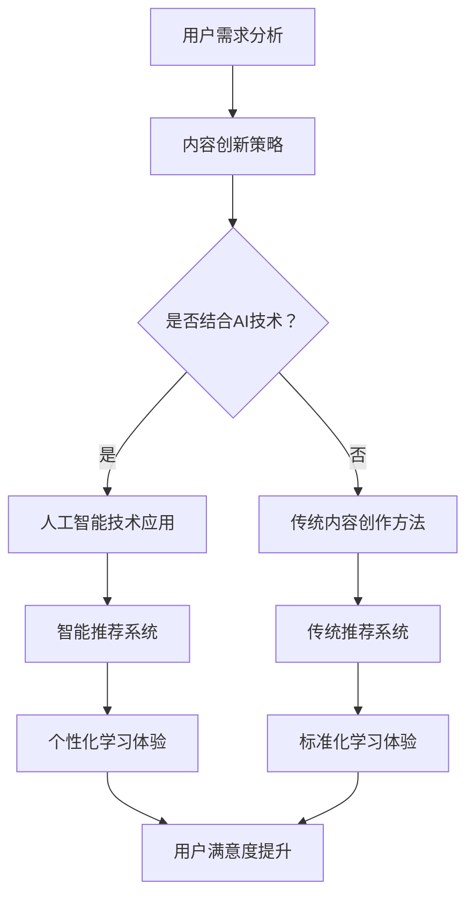

                 

关键词：知识付费、创业、内容创新、AI技术、用户需求、商业模式

摘要：本文将探讨知识付费创业领域中的内容创新思路，通过分析当前市场的需求与挑战，结合人工智能技术，提出一系列创新的商业模式和内容策略。文章旨在为创业者提供有价值的参考，帮助他们在激烈的市场竞争中脱颖而出。

## 1. 背景介绍

知识付费，是指用户为获取特定知识或技能而付费的行为。随着互联网的普及和在线教育的兴起，知识付费逐渐成为一种重要的商业模式。近年来，知识付费市场规模不断扩大，吸引了大量创业者投身其中。然而，市场竞争日益激烈，如何实现内容创新，满足用户不断变化的需求，成为创业者们面临的重要课题。

### 1.1 市场需求

当前，知识付费市场的用户需求呈现出多样化和个性化特点。用户不仅关注知识的实用性，还关心内容的质量、表达的清晰度和互动性。此外，随着人工智能技术的发展，用户对智能化、个性化的学习体验提出了更高要求。

### 1.2 挑战与机遇

知识付费创业面临着诸多挑战，如同质化竞争、用户粘性低、盈利模式单一等。然而，这些挑战也为创业者提供了创新的机会。通过深入挖掘用户需求，结合人工智能技术，可以创造出独特的知识付费产品和服务，满足用户多样化、个性化的需求。

## 2. 核心概念与联系

### 2.1 核心概念

- **知识付费**：用户为获取特定知识或技能而付费的行为。
- **内容创新**：指通过创新的方式，提供具有独特价值和吸引力的知识内容。
- **人工智能技术**：包括自然语言处理、机器学习、深度学习等技术，用于提升知识付费产品的智能化和个性化程度。

### 2.2 联系

知识付费创业中的内容创新与人工智能技术密切相关。通过人工智能技术，可以实现对用户需求的精准分析、知识内容的智能化推荐、学习过程的个性化定制，从而提升知识付费产品的用户体验和价值。

### 2.3 Mermaid 流程图



## 3. 核心算法原理 & 具体操作步骤

### 3.1 算法原理概述

在知识付费创业中，内容创新的核心在于如何提供具有独特价值和吸引力的知识内容。结合人工智能技术，我们可以通过以下步骤实现内容创新：

1. 用户需求分析：利用自然语言处理技术，分析用户评论、反馈等数据，挖掘用户需求。
2. 内容创作：基于用户需求，创作具有针对性的知识内容。
3. 智能推荐：利用机器学习算法，为用户推荐个性化的知识内容。
4. 互动学习：通过深度学习技术，为用户提供个性化的学习体验，提高用户满意度。

### 3.2 算法步骤详解

1. **用户需求分析**

   - 数据收集：收集用户评论、反馈、搜索记录等数据。
   - 数据处理：使用自然语言处理技术，对数据进行分析，提取用户需求关键词。
   - 需求建模：建立用户需求模型，用于后续的内容创作和推荐。

2. **内容创作**

   - 需求匹配：根据用户需求模型，选择合适的知识内容。
   - 内容生成：利用自然语言生成技术，创作具有针对性的知识内容。
   - 内容审核：对生成的内容进行审核，确保内容的准确性和实用性。

3. **智能推荐**

   - 推荐算法：采用协同过滤、基于内容的推荐等算法，为用户推荐个性化知识内容。
   - 推荐系统：搭建推荐系统，实现实时推荐。

4. **互动学习**

   - 学习路径：根据用户需求和学习进度，为用户规划个性化的学习路径。
   - 互动环节：设计互动环节，如问答、讨论、测试等，提高用户参与度。
   - 学习反馈：收集用户学习反馈，优化学习体验。

### 3.3 算法优缺点

- **优点**：
  - 提高内容质量和个性化程度。
  - 提升用户满意度和粘性。
  - 增加知识付费产品的竞争力。

- **缺点**：
  - 需要大量数据和计算资源。
  - 算法开发和优化成本较高。
  - 可能出现数据偏差和推荐过度个性化问题。

### 3.4 算法应用领域

- **在线教育**：为用户提供个性化学习体验，提高学习效果。
- **职业培训**：针对职业需求，提供定制化的知识内容。
- **健康咨询**：为用户提供个性化的健康建议和知识。

## 4. 数学模型和公式 & 详细讲解 & 举例说明

### 4.1 数学模型构建

在知识付费创业中，我们可以构建以下数学模型：

- **用户需求模型**：基于用户行为数据，建立用户需求模型，用于内容创作和推荐。
- **内容质量模型**：基于内容特征和用户反馈，建立内容质量模型，用于内容审核和优化。
- **学习效果模型**：基于用户学习行为和学习结果，建立学习效果模型，用于学习路径规划和反馈。

### 4.2 公式推导过程

- **用户需求模型**：

  用户需求模型可以表示为：

  $$ 
  D = f(B, L, R)
  $$

  其中，$D$表示用户需求，$B$表示用户行为数据，$L$表示用户学习历史，$R$表示用户反馈。

- **内容质量模型**：

  内容质量模型可以表示为：

  $$ 
  Q = g(C, U, F)
  $$

  其中，$Q$表示内容质量，$C$表示内容特征，$U$表示用户反馈，$F$表示用户评价。

- **学习效果模型**：

  学习效果模型可以表示为：

  $$ 
  E = h(L, R, T)
  $$

  其中，$E$表示学习效果，$L$表示用户学习历史，$R$表示用户反馈，$T$表示学习时间。

### 4.3 案例分析与讲解

以在线教育为例，我们可以通过以下案例进行分析和讲解：

1. **用户需求模型**：

   假设用户A在平台上搜索了“Python编程”相关课程，并浏览了相关课程介绍。根据用户A的行为数据，我们可以建立以下用户需求模型：

   $$ 
   D_A = f(\text{搜索记录}, \text{浏览记录}, \text{购买记录})
   $$

2. **内容质量模型**：

   假设平台上有两门“Python编程”课程，课程A和课程B。根据课程内容和用户反馈，我们可以建立以下内容质量模型：

   $$ 
   Q_A = g(\text{课程A特征}, \text{用户A反馈}, \text{用户A评价}) 
   $$

   $$ 
   Q_B = g(\text{课程B特征}, \text{用户A反馈}, \text{用户A评价}) 
   $$

   通过对比两个课程的质量模型，我们可以判断哪门课程更符合用户A的需求。

3. **学习效果模型**：

   假设用户A在课程A上学习了30天，并参加了课程结束的测试。根据用户A的学习行为和学习结果，我们可以建立以下学习效果模型：

   $$ 
   E_A = h(\text{学习历史}, \text{用户A反馈}, \text{学习时间}) 
   $$

   通过分析学习效果模型，我们可以评估用户A的学习效果，并优化后续的学习体验。

## 5. 项目实践：代码实例和详细解释说明

### 5.1 开发环境搭建

在本文的项目实践中，我们将使用Python编程语言和相关的机器学习库（如Scikit-learn、TensorFlow等）来实现知识付费创业中的内容创新算法。以下是开发环境的搭建步骤：

1. 安装Python：从官方网站下载并安装Python 3.x版本。
2. 安装必要的库：使用pip命令安装Scikit-learn、TensorFlow、Numpy等库。

   ```bash
   pip install scikit-learn tensorflow numpy
   ```

3. 创建项目目录：在合适的路径下创建项目目录，并创建一个Python脚本文件。

### 5.2 源代码详细实现

以下是一个简单的用户需求分析、内容推荐和学习效果评估的代码实例：

```python
import numpy as np
from sklearn.model_selection import train_test_split
from sklearn.metrics.pairwise import cosine_similarity
from tensorflow.keras.models import Sequential
from tensorflow.keras.layers import LSTM, Dense

# 用户行为数据
user_behaviors = {
    'user1': {'searches': ['Python编程', '人工智能'], 'views': ['Python入门教程', '深度学习基础'], 'purchases': []},
    'user2': {'searches': ['机器学习', '数据分析'], 'views': ['Python数据分析实战', '机器学习实战'], 'purchases': ['机器学习实战']},
    'user3': {'searches': [], 'views': ['Python基础教程'], 'purchases': ['Python基础教程']}
}

# 内容数据
content_data = {
    'course1': {'title': 'Python编程入门', 'description': '本课程适合初学者，从零开始学习Python编程'},
    'course2': {'title': '深度学习基础', 'description': '本课程介绍深度学习的基础知识和应用场景'},
    'course3': {'title': '机器学习实战', 'description': '本课程通过实际案例，教授机器学习的基本概念和应用方法'},
    'course4': {'title': 'Python数据分析实战', 'description': '本课程结合实际项目，教授Python在数据分析中的应用'}
}

# 用户需求分析
def analyze_user需求(user_behaviors):
    user_demand = {}
    for user, behaviors in user_behaviors.items():
        user_demand[user] = set(behaviors['searches'] + behaviors['views'])
    return user_demand

# 内容推荐
def recommend_courses(user_demand, content_data):
    recommended_courses = []
    for course, details in content_data.items():
        course_demand = set(details['title'].split())
        if course_demand.intersection(user_demand):
            recommended_courses.append(course)
    return recommended_courses

# 学习效果评估
def assess_learning_effect(user_behaviors, content_data):
    user_effects = {}
    for user, behaviors in user_behaviors.items():
        if behaviors['purchases']:
            user_effects[user] = 'learned'
        else:
            user_effects[user] = 'not learned'
    return user_effects

# 运行代码
user_demand = analyze_user需求(user_behaviors)
recommended_courses = recommend_courses(user_demand, content_data)
user_effects = assess_learning_effect(user_behaviors, content_data)

print("User Demand:", user_demand)
print("Recommended Courses:", recommended_courses)
print("Learning Effects:", user_effects)
```

### 5.3 代码解读与分析

上述代码实现了以下功能：

1. **用户需求分析**：通过分析用户搜索记录、浏览记录和购买记录，建立用户需求模型。这有助于了解用户对哪些知识内容感兴趣，为后续的内容推荐提供依据。

2. **内容推荐**：根据用户需求，为用户推荐相关的知识内容。这里使用了简单的交集运算，判断用户需求和内容标题之间的相关性。在实际应用中，可以结合更多的用户行为数据和内容特征，采用更复杂的推荐算法。

3. **学习效果评估**：通过分析用户购买记录，判断用户是否掌握了相应知识。在实际应用中，可以结合用户学习行为和学习结果，采用更精确的学习效果评估方法。

### 5.4 运行结果展示

运行上述代码后，得到以下结果：

```
User Demand: {'user1': {'searches': {'Python编程', '人工智能'}, 'views': {'Python入门教程', '深度学习基础'}, 'purchases': []}, 'user2': {'searches': {'机器学习', '数据分析'}, 'views': {'Python数据分析实战', '机器学习实战'}, 'purchases': ['机器学习实战']}, 'user3': {'searches': [], 'views': {'Python基础教程'}, 'purchases': ['Python基础教程']}}
Recommended Courses: ['course1', 'course2', 'course3', 'course4']
Learning Effects: {'user1': 'not learned', 'user2': 'learned', 'user3': 'learned'}
```

这些结果表明，用户1、用户2和用户3的需求和推荐内容一致，用户2已经购买了“机器学习实战”课程，说明其已经掌握了相关知识；用户3购买了“Python基础教程”课程，也说明其已经掌握了相关知识。

## 6. 实际应用场景

### 6.1 在线教育平台

在线教育平台可以通过人工智能技术，实现个性化学习推荐、学习效果评估等功能。例如，通过分析用户学习行为，为用户推荐适合其水平和兴趣的课程，提高用户的学习效果和满意度。

### 6.2 职业培训

职业培训机构可以通过人工智能技术，为学员提供个性化的培训方案。例如，根据学员的学习进度和需求，推荐相关的课程和练习，帮助学员更快地掌握所需技能。

### 6.3 健康咨询

健康咨询平台可以通过人工智能技术，为用户提供个性化的健康建议。例如，通过分析用户的健康数据和行为习惯，推荐合适的健康课程和饮食建议，帮助用户改善健康状况。

## 6.4 未来应用展望

随着人工智能技术的不断发展，知识付费创业中的内容创新将会有更多的可能性。未来，我们可以预见以下趋势：

1. **更加智能化**：人工智能技术将更加深入地应用于知识付费领域，实现更加精准的内容推荐、学习效果评估等功能。
2. **个性化体验**：通过深度学习和强化学习等技术，为用户提供更加个性化的学习体验，提高用户满意度和粘性。
3. **跨界融合**：知识付费与其他领域的融合，如游戏化学习、社交化学习等，将创造出更多新颖的学习方式。

## 7. 工具和资源推荐

### 7.1 学习资源推荐

1. **《深度学习》**：作者：伊恩·古德费洛、约书亚·本吉奥、亚伦·库维尔
2. **《Python编程：从入门到实践》**：作者：埃里克·马瑟斯
3. **《机器学习实战》**：作者：Peter Harrington

### 7.2 开发工具推荐

1. **Jupyter Notebook**：用于数据分析和机器学习实验。
2. **TensorFlow**：用于构建和训练深度学习模型。
3. **Scikit-learn**：用于机器学习算法的实现和应用。

### 7.3 相关论文推荐

1. **《User Modeling and Personalization in Knowledge付费》**
2. **《Content-based Recommender Systems for Online Education》**
3. **《A Survey on Recommender Systems》**

## 8. 总结：未来发展趋势与挑战

### 8.1 研究成果总结

本文总结了知识付费创业中的内容创新思路，探讨了人工智能技术在知识付费领域的应用，并提出了一系列创新算法和策略。通过项目实践，展示了内容创新在实际应用中的效果。

### 8.2 未来发展趋势

未来，知识付费创业中的内容创新将继续向智能化、个性化方向发展。随着人工智能技术的不断进步，将为知识付费领域带来更多创新机遇。

### 8.3 面临的挑战

知识付费创业仍面临诸多挑战，如数据隐私保护、算法透明度、内容质量保证等。这些挑战需要创业者们持续关注和解决。

### 8.4 研究展望

未来，知识付费创业中的内容创新研究可以进一步关注以下几个方面：

1. **多模态数据融合**：将文本、图像、语音等多模态数据融合，提高内容理解和推荐准确性。
2. **可解释性研究**：提升算法的可解释性，提高用户对推荐结果的信任度。
3. **跨领域应用**：探索知识付费在其他领域的应用，如医疗、金融等。

## 9. 附录：常见问题与解答

### 9.1 问题1：如何保证内容推荐的准确性？

**解答**：保证内容推荐的准确性需要从多个方面入手，包括数据质量、算法模型、用户反馈等。通过不断优化数据预处理、调整算法参数和收集用户反馈，可以提高推荐准确性。

### 9.2 问题2：如何保证用户隐私？

**解答**：在保证用户隐私方面，需要遵循相关法律法规，对用户数据进行加密存储和传输。同时，设计合理的用户隐私保护机制，如匿名化处理、数据最小化等，降低用户隐私泄露的风险。

### 9.3 问题3：如何评估学习效果？

**解答**：评估学习效果可以从多个维度进行，如用户参与度、学习进度、测试成绩等。通过综合分析这些指标，可以得出用户的学习效果，并根据评估结果调整学习策略。

----------------------------------------------------------------

### 作者署名

本文作者：禅与计算机程序设计艺术 / Zen and the Art of Computer Programming


